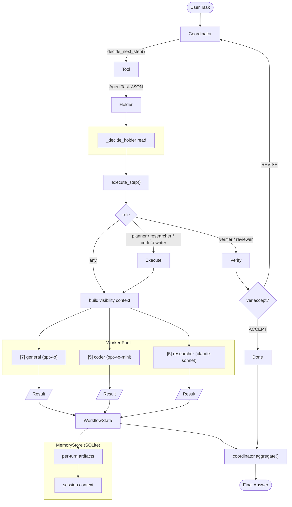
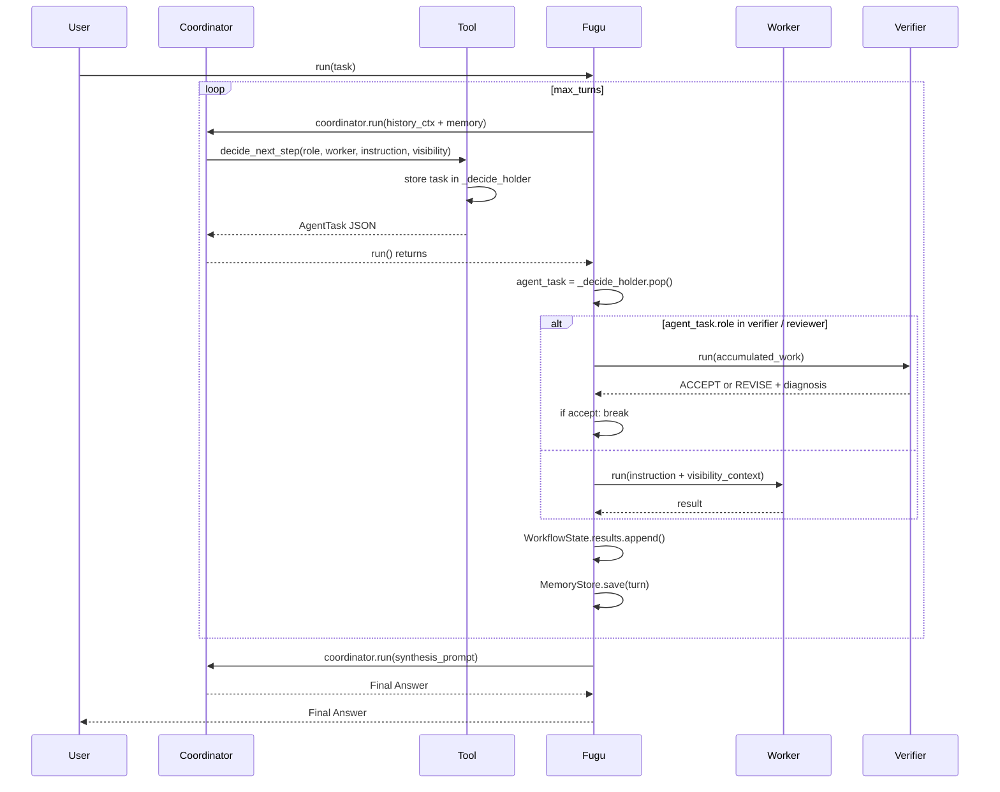

# FuguAgent: Multi-Agent System as a Single Model

## Description

New `FuguAgent` class (`swarms/agents/fugu.py`) implementing the Fugu/Trinity orchestration pattern — a multi-agent system that presents itself as a single model API.

### Core Architecture

The `FuguAgent` coordinates a pool of worker agents through a dedicated coordinator model using **tool-calling** (not text parsing). At each step the coordinator calls the `decide_next_step` tool, committing to a structured `AgentTask {role, worker, instruction, visibility}`. The result is stored directly via closure capture, bypassing fragile history parsing.

**Key components:**

- **`decide_next_step` tool** — Function-call based orchestration. The coordinator decides role, worker, instruction, and visibility for each step and commits via the tool. No JSON text parsing required.
- **Dynamic roles** — Roles are not hardcoded. The coordinator assigns whichever role fits: `planner`, `researcher`, `coder`, `writer`, `verifier`, `reviewer`, `executor`, `summarizer`, etc.
- **Model capability ranking** — Workers are ranked by `MODEL_TIER` scores. The coordinator's system prompt lists workers by tier, ensuring the most powerful models handle the hardest subtasks.
- **`MemoryStore`** — SQLite-backed persistent memory across turns and sessions.
- **Visibility routing** — Each `AgentTask` specifies which prior step outputs (by index) the worker can see, implementing the Conductor's access-list pattern.
- **Chain-of-thought aggregation** — Final answer synthesized by passing all step outputs through the coordinator.

**Files changed:**

| File | Change |
|------|--------|
| `swarms/agents/fugu.py` | New — core FuguAgent implementation (380 LOC) |
| `swarms/agents/__init__.py` | Added `FuguAgent` export |
| `swarms/structs/swarm_router.py` | Added `"FuguAgent"` to `SwarmType` + `_create_fugu_agent()` |
| `examples/single_agent/fugu_example.py` | New — minimal usage example |

## Architecture



### Execution Loop



## Usage

```python
from swarms import FuguAgent

agent = FuguAgent(
    coordinator_model="gpt-4o-mini",
    max_turns=5,
    verbose=True,
)

result = agent.run("Write a short story about a robot discovering music.")
```

Workers are auto-detected from `OPENAI_API_KEY` / `ANTHROPIC_API_KEY` / `GOOGLE_API_KEY`, or can be passed explicitly:

```python
from swarms import FuguAgent, Agent

agent = FuguAgent(
    workers=[
        Agent(agent_name="coder", model_name="gpt-4o"),
        Agent(agent_name="researcher", model_name="claude-sonnet-4-5"),
    ],
    max_turns=5,
)
```

Also available via `SwarmRouter`:

```python
from swarms import SwarmRouter, Agent

router = SwarmRouter(
    agents=[Agent(agent_name="a", model_name="gpt-4o"), Agent(agent_name="b", model_name="claude-sonnet-4-5")],
    swarm_type="FuguAgent",
    max_loops=5,
)
result = router.run("Write a story about a robot.")
```

## Issue

N/A — new feature.

## Dependencies

None beyond existing swarms dependencies. No new packages required.

## Tag Maintainer

kye@swarms.world

## Twitter Handle

N/A