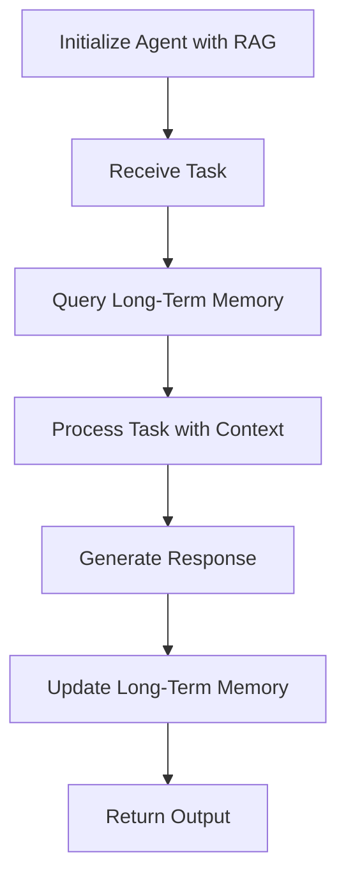
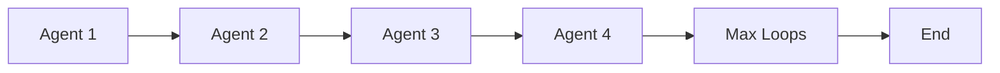

<div align="center">
  <a href="https://swarms.world">
    
  </a>
</div>
<p align="center">
  <em>The Enterprise-Grade Production-Ready Multi-Agent Orchestration Framework </em>
</p>

<p align="center">
    <a href="https://pypi.org/project/swarms/" target="_blank">
        
        
    </a>
</p>
<p align="center">
<a href="https://twitter.com/swarms_corp/">🐦 Twitter</a>
<span>&nbsp;&nbsp;•&nbsp;&nbsp;</span>
<a href="https://discord.gg/agora-999382051935506503">📢 Discord</a>
<span>&nbsp;&nbsp;•&nbsp;&nbsp;</span>
<a href="https://swarms.world">Swarms Platform</a>
<span>&nbsp;&nbsp;•&nbsp;&nbsp;</span>
<a href="https://docs.swarms.world">📙 Documentation</a>
</p>


[](https://discord.gg/agora-999382051935506503) [](https://www.youtube.com/@kyegomez3242) [](https://www.linkedin.com/in/kye-g-38759a207/) [](https://x.com/kyegomezb)


[](https://github.com/kyegomez/swarms/issues) [](https://github.com/kyegomez/swarms/network) [](https://github.com/kyegomez/swarms/stargazers) [](https://github.com/kyegomez/swarms/blob/main/LICENSE)[](https://star-history.com/#kyegomez/swarms)[](https://libraries.io/github/kyegomez/swarms) [](https://pepy.tech/project/swarms)

[](https://twitter.com/intent/tweet?text=Check%20out%20this%20amazing%20AI%20project:%20&url=https%3A%2F%2Fgithub.com%2Fkyegomez%2Fswarms) [](https://www.facebook.com/sharer/sharer.php?u=https%3A%2F%2Fgithub.com%2Fkyegomez%2Fswarms) [](https://www.linkedin.com/shareArticle?mini=true&url=https%3A%2F%2Fgithub.com%2Fkyegomez%2Fswarms&title=&summary=&source=)

[](https://www.reddit.com/submit?url=https%3A%2F%2Fgithub.com%2Fkyegomez%2Fswarms&title=Swarms%20-%20the%20future%20of%20AI) [](https://news.ycombinator.com/submitlink?u=https%3A%2F%2Fgithub.com%2Fkyegomez%2Fswarms&t=Swarms%20-%20the%20future%20of%20AI) [](https://pinterest.com/pin/create/button/?url=https%3A%2F%2Fgithub.com%2Fkyegomez%2Fswarms&media=https%3A%2F%2Fexample.com%2Fimage.jpg&description=Swarms%20-%20the%20future%20of%20AI) [](https://api.whatsapp.com/send?text=Check%20out%20Swarms%20-%20the%20future%20of%20AI%20%23swarms%20%23AI%0A%0Ahttps%3A%2F%2Fgithub.com%2Fkyegomez%2Fswarms)


## ✨ Features

| Category | Features | Benefits |
|----------|----------|-----------|
| 🏢 Enterprise Architecture | • Production-Ready Infrastructure<br>• High Reliability Systems<br>• Modular Design<br>• Comprehensive Logging | • Reduced downtime<br>• Easier maintenance<br>• Better debugging<br>• Enhanced monitoring |
| 🤖 Agent Orchestration | • Hierarchical Swarms<br>• Parallel Processing<br>• Sequential Workflows<br>• Graph-based Workflows<br>• Dynamic Agent Rearrangement | • Complex task handling<br>• Improved performance<br>• Flexible workflows<br>• Optimized execution |
| 🔄 Integration Capabilities | • Multi-Model Support<br>• Custom Agent Creation<br>• Extensive Tool Library<br>• Multiple Memory Systems | • Provider flexibility<br>• Custom solutions<br>• Extended functionality<br>• Enhanced memory management |
| 📈 Scalability | • Concurrent Processing<br>• Resource Management<br>• Load Balancing<br>• Horizontal Scaling | • Higher throughput<br>• Efficient resource use<br>• Better performance<br>• Easy scaling |
| 🛠️ Developer Tools | • Simple API<br>• Extensive Documentation<br>• Active Community<br>• CLI Tools | • Faster development<br>• Easy learning curve<br>• Community support<br>• Quick deployment |
| 🔐 Security Features | • Error Handling<br>• Rate Limiting<br>• Monitoring Integration<br>• Audit Logging | • Improved reliability<br>• API protection<br>• Better monitoring<br>• Enhanced tracking |
| 📊 Advanced Features | • SpreadsheetSwarm<br>• Group Chat<br>• Agent Registry<br>• Mixture of Agents | • Mass agent management<br>• Collaborative AI<br>• Centralized control<br>• Complex solutions |
| 🔌 Provider Support | • OpenAI<br>• Anthropic<br>• ChromaDB<br>• Custom Providers | • Provider flexibility<br>• Storage options<br>• Custom integration<br>• Vendor independence |
| 💪 Production Features | • Automatic Retries<br>• Async Support<br>• Environment Management<br>• Type Safety | • Better reliability<br>• Improved performance<br>• Easy configuration<br>• Safer code |
| 🎯 Use Case Support | • Task-Specific Agents<br>• Custom Workflows<br>• Industry Solutions<br>• Extensible Framework | • Quick deployment<br>• Flexible solutions<br>• Industry readiness<br>• Easy customization |


----

## Requirements
- `python3.10` or above!
- `$ pip install -U swarms` And, don't forget to install swarms!
- `.env` file with API keys from your providers like `OPENAI_API_KEY`, `ANTHROPIC_API_KEY`
-  Set an `.env` Variable with your desired workspace dir: `WORKSPACE_DIR="agent_workspace"` or do it in your terminal with `export WORKSPACE_DIR="agent_workspace"`
-  Finally, `swarms onboarding` to get you started.

## Guides and Walkthroughs
Refer to our documentation for production grade implementation details.


| Section              | Links                                                                                      |
|----------------------|--------------------------------------------------------------------------------------------|
| Installation    | [Installation](https://docs.swarms.world/en/latest/swarms/install/install/)                                                            |
| Quickstart | [Get Started](https://docs.swarms.world/en/latest/swarms/install/quickstart/)                                                 |
| Agent Internal Mechanisms | [Agent Architecture](https://docs.swarms.world/en/latest/swarms/framework/agents_explained/)                                                 |
| Agent API | [Agent API](https://docs.swarms.world/en/latest/swarms/structs/agent/)                                                 |
| Integrating External Agents Griptape, Autogen, etc | [Integrating External APIs](https://docs.swarms.world/en/latest/swarms/agents/external_party_agents/)                                                 |
| Creating Agents from YAML | [Creating Agents from YAML](https://docs.swarms.world/en/latest/swarms/agents/create_agents_yaml/)                                                 |
| Why You Need Swarms | [Why MultiAgent Collaboration is Necessary](https://docs.swarms.world/en/latest/swarms/concept/why/)                                                 |
| Swarm Architectures Analysis | [Swarm Architectures](https://docs.swarms.world/en/latest/swarms/concept/swarm_architectures/)                                                 |
| Choosing the Right Swarm for Your Business Problem¶ | [CLICK HERE](https://docs.swarms.world/en/latest/swarms/concept/swarm_architectures/)                                                 |
| AgentRearrange Docs| [CLICK HERE](https://docs.swarms.world/en/latest/swarms/structs/agent_rearrange/)                                                 |


## Install 💻
Install the following packages with copy and paste

```bash
$ pip3 install -U swarms swarm-models swarms-memory
```


## Onboarding

Now that you have downloaded swarms with `pip3 install -U swarms`, we get access to the `CLI`. Get Onboarded with CLI Now with:

```bash
swarms onboarding
```

You can also run this command for help:

```bash
swarms help
```

For more documentation on the CLI [CLICK HERE](https://docs.swarms.world/en/latest/swarms/cli/main/)

---

# Usage Examples 🤖
Here are some example scripts to get you started. For more comprehensive documentation, visit our [docs](https://docs.swarms.world/en/latest/).

| Example Name | Description | Type of Examples | Link |
| --- | --- | --- | --- |
| Swarms Examples | A collection of simple examples to demonstrate Swarms capabilities. | Basic Usage | [https://github.com/The-Swarm-Corporation/swarms-examples?tab=readme-ov-file](https://github.com/The-Swarm-Corporation/swarms-examples?tab=readme-ov-file) |
| Cookbook | A comprehensive guide with recipes for various use cases and scenarios. | Advanced Usage | [https://github.com/The-Swarm-Corporation/Cookbook](https://github.com/The-Swarm-Corporation/Cookbook) |


---

## `Agent` Class
The `Agent` class is a fundamental component of the Swarms framework, designed to execute tasks autonomously. It fuses llms, tools and long-term memory capabilities to create a full stack agent. The `Agent` class is highly customizable, allowing for fine-grained control over its behavior and interactions.


### `run` Method
The `run` method is the primary entry point for executing tasks with an `Agent` instance. It accepts a task string as the main input task and processes it according to the agent's configuration. And, it can also accept an `img` parameter such as `img="image_filepath.png` to process images if you have a VLM attached such as `GPT4VisionAPI`


## Simple Example

```python
from swarms import Agent

agent = Agent(
    agent_name="Stock-Analysis-Agent",
    model_name="gpt-4o-mini",
    max_loops="auto",
    interactive=True,
    streaming_on=True,
)

agent.run("What is the current market trend for tech stocks?")

```

### Settings and Customization
The `Agent` class offers a range of settings to tailor its behavior to specific needs. Some key settings include:

| Setting | Description | Default Value |
| --- | --- | --- |
| `agent_name` | The name of the agent. | "DefaultAgent" |
| `system_prompt` | The system prompt to use for the agent. | "Default system prompt." |
| `llm` | The language model to use for processing tasks. | `OpenAIChat` instance |
| `max_loops` | The maximum number of loops to execute for a task. | 1 |
| `autosave` | Enables or disables autosaving of the agent's state. | False |
| `dashboard` | Enables or disables the dashboard for the agent. | False |
| `verbose` | Controls the verbosity of the agent's output. | False |
| `dynamic_temperature_enabled` | Enables or disables dynamic temperature adjustment for the language model. | False |
| `saved_state_path` | The path to save the agent's state. | "agent_state.json" |
| `user_name` | The username associated with the agent. | "default_user" |
| `retry_attempts` | The number of retry attempts for failed tasks. | 1 |
| `context_length` | The maximum length of the context to consider for tasks. | 200000 |
| `return_step_meta` | Controls whether to return step metadata in the output. | False |
| `output_type` | The type of output to return (e.g., "json", "string"). | "string" |


```python
import os
from swarms import Agent

from swarms.prompts.finance_agent_sys_prompt import (
    FINANCIAL_AGENT_SYS_PROMPT,
)
# Initialize the agent
agent = Agent(
    agent_name="Financial-Analysis-Agent",
    system_prompt=FINANCIAL_AGENT_SYS_PROMPT,
    model_name="gpt-4o-mini",
    max_loops=1,
    autosave=True,
    dashboard=False,
    verbose=True,
    dynamic_temperature_enabled=True,
    saved_state_path="finance_agent.json",
    user_name="swarms_corp",
    retry_attempts=1,
    context_length=200000,
    return_step_meta=False,
    output_type="string",
    streaming_on=False,
)


agent.run(
    "How can I establish a ROTH IRA to buy stocks and get a tax break? What are the criteria"
)

```
-----

### Integrating RAG with Swarms for Enhanced Long-Term Memory
`Agent` equipped with quasi-infinite long term memory using RAG (Relational Agent Graph) for advanced document understanding, analysis, and retrieval capabilities.

**Mermaid Diagram for RAG Integration**


```python
from swarms import Agent
from swarms.prompts.finance_agent_sys_prompt import (
    FINANCIAL_AGENT_SYS_PROMPT,
)
import os

from swarms_memory import ChromaDB

# Initialize the ChromaDB client for long-term memory management
chromadb = ChromaDB(
    metric="cosine",  # Metric for similarity measurement
    output_dir="finance_agent_rag",  # Directory for storing RAG data
    # docs_folder="artifacts",  # Uncomment and specify the folder containing your documents
)

# Initialize the agent with RAG capabilities
agent = Agent(
    agent_name="Financial-Analysis-Agent",
    system_prompt=FINANCIAL_AGENT_SYS_PROMPT,
    agent_description="Agent creates a comprehensive financial analysis",
    model_name="gpt-4o-mini",
    max_loops="auto",  # Auto-adjusts loops based on task complexity
    autosave=True,  # Automatically saves agent state
    dashboard=False,  # Disables dashboard for this example
    verbose=True,  # Enables verbose mode for detailed output
    streaming_on=True,  # Enables streaming for real-time processing
    dynamic_temperature_enabled=True,  # Dynamically adjusts temperature for optimal performance
    saved_state_path="finance_agent.json",  # Path to save agent state
    user_name="swarms_corp",  # User name for the agent
    retry_attempts=3,  # Number of retry attempts for failed tasks
    context_length=200000,  # Maximum length of the context to consider
    long_term_memory=chromadb,  # Integrates ChromaDB for long-term memory management
    return_step_meta=False,
    output_type="string",
)

# Run the agent with a sample task
agent.run(
    "What are the components of a startups stock incentive equity plan"
)
```


-------

### Misc Agent Settings
We provide vast array of features to save agent states using json, yaml, toml, upload pdfs, batched jobs, and much more!


**Method Table**

| Method | Description |
| --- | --- |
| `to_dict()` | Converts the agent object to a dictionary. |
| `to_toml()` | Converts the agent object to a TOML string. |
| `model_dump_json()` | Dumps the model to a JSON file. |
| `model_dump_yaml()` | Dumps the model to a YAML file. |
| `ingest_docs()` | Ingests documents into the agent's knowledge base. |
| `receive_message()` | Receives a message from a user and processes it. |
| `send_agent_message()` | Sends a message from the agent to a user. |
| `filtered_run()` | Runs the agent with a filtered system prompt. |
| `bulk_run()` | Runs the agent with multiple system prompts. |
| `add_memory()` | Adds a memory to the agent. |
| `check_available_tokens()` | Checks the number of available tokens for the agent. |
| `tokens_checks()` | Performs token checks for the agent. |
| `print_dashboard()` | Prints the dashboard of the agent. |
| `get_docs_from_doc_folders()` | Fetches all the documents from the doc folders. |
| `activate_agentops()` | Activates agent operations. |
| `check_end_session_agentops()` | Checks the end of the session for agent operations. |


```python
# # Convert the agent object to a dictionary
print(agent.to_dict())
print(agent.to_toml())
print(agent.model_dump_json())
print(agent.model_dump_yaml())

# Ingest documents into the agent's knowledge base
agent.ingest_docs("your_pdf_path.pdf")

# Receive a message from a user and process it
agent.receive_message(name="agent_name", message="message")

# Send a message from the agent to a user
agent.send_agent_message(agent_name="agent_name", message="message")

# Ingest multiple documents into the agent's knowledge base
agent.ingest_docs("your_pdf_path.pdf", "your_csv_path.csv")

# Run the agent with a filtered system prompt
agent.filtered_run(
    "How can I establish a ROTH IRA to buy stocks and get a tax break? What are the criteria?"
)

# Run the agent with multiple system prompts
agent.bulk_run(
    [
        "How can I establish a ROTH IRA to buy stocks and get a tax break? What are the criteria?",
        "Another system prompt",
    ]
)

# Add a memory to the agent
agent.add_memory("Add a memory to the agent")

# Check the number of available tokens for the agent
agent.check_available_tokens()

# Perform token checks for the agent
agent.tokens_checks()

# Print the dashboard of the agent
agent.print_dashboard()

# Fetch all the documents from the doc folders
agent.get_docs_from_doc_folders()

# Activate agent ops
agent.activate_agentops()
agent.check_end_session_agentops()

# Dump the model to a JSON file
agent.model_dump_json()
print(agent.to_toml())

```


### `Agent`with Pydantic BaseModel as Output Type
The following is an example of an agent that intakes a pydantic basemodel and outputs it at the same time:

```python
from pydantic import BaseModel, Field
from swarms import Agent


# Initialize the schema for the person's information
class Schema(BaseModel):
    name: str = Field(..., title="Name of the person")
    agent: int = Field(..., title="Age of the person")
    is_student: bool = Field(..., title="Whether the person is a student")
    courses: list[str] = Field(
        ..., title="List of courses the person is taking"
    )


# Convert the schema to a JSON string
tool_schema = Schema(
    name="Tool Name",
    agent=1,
    is_student=True,
    courses=["Course1", "Course2"],
)

# Define the task to generate a person's information
task = "Generate a person's information based on the following schema:"

# Initialize the agent
agent = Agent(
    agent_name="Person Information Generator",
    system_prompt=(
        "Generate a person's information based on the following schema:"
    ),
    # Set the tool schema to the JSON string -- this is the key difference
    tool_schema=tool_schema,
    model_name="gpt-4o",
    max_loops=3,
    autosave=True,
    dashboard=False,
    streaming_on=True,
    verbose=True,
    interactive=True,
    # Set the output type to the tool schema which is a BaseModel
    output_type=tool_schema,  # or dict, or str
    metadata_output_type="json",
    # List of schemas that the agent can handle
    list_base_models=[tool_schema],
    function_calling_format_type="OpenAI",
    function_calling_type="json",  # or soon yaml
)

# Run the agent to generate the person's information
generated_data = agent.run(task)

# Print the generated data
print(f"Generated data: {generated_data}")


```

### Multi Modal Autonomous Agent
Run the agent with multiple modalities useful for various real-world tasks in manufacturing, logistics, and health.

```python
import os
from dotenv import load_dotenv
from swarms import Agent

from swarm_models import GPT4VisionAPI

# Load the environment variables
load_dotenv()


# Initialize the language model
llm = GPT4VisionAPI(
    openai_api_key=os.environ.get("OPENAI_API_KEY"),
    max_tokens=500,
)

# Initialize the task
task = (
    "Analyze this image of an assembly line and identify any issues such as"
    " misaligned parts, defects, or deviations from the standard assembly"
    " process. IF there is anything unsafe in the image, explain why it is"
    " unsafe and how it could be improved."
)
img = "assembly_line.jpg"

## Initialize the workflow
agent = Agent(
    agent_name = "Multi-ModalAgent",
    llm=llm, 
    max_loops="auto", 
    autosave=True, 
    dashboard=True, 
    multi_modal=True
)

# Run the workflow on a task
agent.run(task, img)
```
----


### Local Agent `ToolAgent`
ToolAgent is an fully local agent that can use tools through JSON function calling. It intakes any open source model from huggingface and is extremely modular and plug in and play. We need help adding general support to all models soon.


```python
from pydantic import BaseModel, Field
from transformers import AutoModelForCausalLM, AutoTokenizer

from swarms import ToolAgent
from swarms.tools.json_utils import base_model_to_json

# Load the pre-trained model and tokenizer
model = AutoModelForCausalLM.from_pretrained(
    "databricks/dolly-v2-12b",
    load_in_4bit=True,
    device_map="auto",
)
tokenizer = AutoTokenizer.from_pretrained("databricks/dolly-v2-12b")


# Initialize the schema for the person's information
class Schema(BaseModel):
    name: str = Field(..., title="Name of the person")
    agent: int = Field(..., title="Age of the person")
    is_student: bool = Field(
        ..., title="Whether the person is a student"
    )
    courses: list[str] = Field(
        ..., title="List of courses the person is taking"
    )


# Convert the schema to a JSON string
tool_schema = base_model_to_json(Schema)

# Define the task to generate a person's information
task = (
    "Generate a person's information based on the following schema:"
)

# Create an instance of the ToolAgent class
agent = ToolAgent(
    name="dolly-function-agent",
    description="Ana gent to create a child data",
    model=model,
    tokenizer=tokenizer,
    json_schema=tool_schema,
)

# Run the agent to generate the person's information
generated_data = agent.run(task)

# Print the generated data
print(f"Generated data: {generated_data}")

```


## Understanding Swarms

A swarm refers to a group of more than two agents working collaboratively to achieve a common goal. These agents can be software entities, such as llms that interact with each other to perform complex tasks. The concept of a swarm is inspired by natural systems like ant colonies or bird flocks, where simple individual behaviors lead to complex group dynamics and problem-solving capabilities.

### How Swarm Architectures Facilitate Communication

Swarm architectures are designed to establish and manage communication between agents within a swarm. These architectures define how agents interact, share information, and coordinate their actions to achieve the desired outcomes. Here are some key aspects of swarm architectures:

1. **Hierarchical Communication**: In hierarchical swarms, communication flows from higher-level agents to lower-level agents. Higher-level agents act as coordinators, distributing tasks and aggregating results. This structure is efficient for tasks that require top-down control and decision-making.

2. **Parallel Communication**: In parallel swarms, agents operate independently and communicate with each other as needed. This architecture is suitable for tasks that can be processed concurrently without dependencies, allowing for faster execution and scalability.

3. **Sequential Communication**: Sequential swarms process tasks in a linear order, where each agent's output becomes the input for the next agent. This ensures that tasks with dependencies are handled in the correct sequence, maintaining the integrity of the workflow.


Swarm architectures leverage these communication patterns to ensure that agents work together efficiently, adapting to the specific requirements of the task at hand. By defining clear communication protocols and interaction models, swarm architectures enable the seamless orchestration of multiple agents, leading to enhanced performance and problem-solving capabilities.


| **Name**                      | **Description**                                                                                                                                                         | **Code Link**                                                                                      | **Use Cases**                                                                                     |
|-------------------------------|-------------------------------------------------------------------------------------------------------------------------------------------------------------------------|----------------------------------------------------------------------------------------------------|---------------------------------------------------------------------------------------------------|
| Hierarchical Swarms           | A system where agents are organized in a hierarchy, with higher-level agents coordinating lower-level agents to achieve complex tasks.                                   | [Code Link](https://docs.swarms.world/en/latest/swarms/concept/swarm_architectures/#hierarchical-swarm) | Manufacturing process optimization, multi-level sales management, healthcare resource coordination |
| Agent Rearrange               | A setup where agents rearrange themselves dynamically based on the task requirements and environmental conditions.                                                       | [Code Link](https://docs.swarms.world/en/latest/swarms/structs/agent_rearrange/)                   | Adaptive manufacturing lines, dynamic sales territory realignment, flexible healthcare staffing  |
| Concurrent Workflows          | Agents perform different tasks simultaneously, coordinating to complete a larger goal.                                                                                  | [Code Link](https://docs.swarms.world/en/latest/swarms/concept/swarm_architectures/#concurrent-workflows) | Concurrent production lines, parallel sales operations, simultaneous patient care processes       |
| Sequential Coordination       | Agents perform tasks in a specific sequence, where the completion of one task triggers the start of the next.                                                           | [Code Link](https://docs.swarms.world/en/latest/swarms/structs/sequential_workflow/)               | Step-by-step assembly lines, sequential sales processes, stepwise patient treatment workflows     |
| Parallel Processing           | Agents work on different parts of a task simultaneously to speed up the overall process.                                                                                | [Code Link](https://docs.swarms.world/en/latest/swarms/concept/swarm_architectures/#parallel-processing) | Parallel data processing in manufacturing, simultaneous sales analytics, concurrent medical tests  |
| Mixture of Agents             | A heterogeneous swarm where agents with different capabilities are combined to solve complex problems.                                                                  | [Code Link](https://docs.swarms.world/en/latest/swarms/structs/moa/)                               | Financial forecasting, complex problem-solving requiring diverse skills                           |
| Graph Workflow                | Agents collaborate in a directed acyclic graph (DAG) format to manage dependencies and parallel tasks.                                                                  | [Code Link](https://docs.swarms.world/en/latest/swarms/structs/graph_workflow/)                    | AI-driven software development pipelines, complex project management                              |
| Group Chat                    | Agents engage in a chat-like interaction to reach decisions collaboratively.                                                                                           | [Code Link](https://docs.swarms.world/en/latest/swarms/structs/group_chat/)                        | Real-time collaborative decision-making, contract negotiations                                    |
| Agent Registry                | A centralized registry where agents are stored, retrieved, and invoked dynamically.                                                                                     | [Code Link](https://docs.swarms.world/en/latest/swarms/structs/agent_registry/)                    | Dynamic agent management, evolving recommendation engines                                         |
| Spreadsheet Swarm             | Manages tasks at scale, tracking agent outputs in a structured format like CSV files.                                                                                   | [Code Link](https://docs.swarms.world/en/latest/swarms/structs/spreadsheet_swarm/)                 | Large-scale marketing analytics, financial audits                                                 |
| Forest Swarm                  | A swarm structure that organizes agents in a tree-like hierarchy for complex decision-making processes.                                                                 | [Code Link](https://docs.swarms.world/en/latest/swarms/structs/forest_swarm/)                      | Multi-stage workflows, hierarchical reinforcement learning                                        |
| Swarm Router                  | Routes and chooses the swarm architecture based on the task requirements and available agents.                                                                        | [Code Link](https://docs.swarms.world/en/latest/swarms/structs/swarm_router/)                       | Dynamic task routing, adaptive swarm architecture selection, optimized agent allocation            |


### `SequentialWorkflow`
Sequential Workflow enables you to sequentially execute tasks with `Agent` and then pass the output into the next agent and onwards until you have specified your max loops.




### Methods

| Method | Description | Parameters | Return Value |
|--------|-------------|------------|--------------|
| `__init__` | Initialize the SequentialWorkflow | `agents`: List of Agent objects<br>`max_loops`: Maximum number of iterations<br>`verbose`: Boolean for verbose output | None |
| `run` | Execute the workflow | `input_data`: Initial input for the first agent | Final output after all agents have processed |

### Inputs

| Input | Type | Description |
|-------|------|-------------|
| `agents` | List[Agent] | List of Agent objects to be executed sequentially |
| `max_loops` | int | Maximum number of times the entire sequence will be repeated |
| `verbose` | bool | If True, print detailed information during execution |

### Output

The `run` method returns the final output after all agents have processed the input sequentially.

In this example, each `Agent` represents a task that is executed sequentially. The output of each agent is passed to the next agent in the sequence until the maximum number of loops is reached. This workflow is particularly useful for tasks that require a series of steps to be executed in a specific order, such as data processing pipelines or complex calculations that rely on the output of previous steps.


```python
import os
from swarms import Agent, SequentialWorkflow
from swarm_models import OpenAIChat

# model = Anthropic(anthropic_api_key=os.getenv("ANTHROPIC_API_KEY"))
company = "Nvidia"
# Get the OpenAI API key from the environment variable
api_key = os.getenv("GROQ_API_KEY")

# Model
model = OpenAIChat(
    openai_api_base="https://api.groq.com/openai/v1",
    openai_api_key=api_key,
    model_name="llama-3.1-70b-versatile",
    temperature=0.1,
)


# Initialize the Managing Director agent
managing_director = Agent(
    agent_name="Managing-Director",
    system_prompt=f"""
    As the Managing Director at Blackstone, your role is to oversee the entire investment analysis process for potential acquisitions. 
    Your responsibilities include:
    1. Setting the overall strategy and direction for the analysis
    2. Coordinating the efforts of the various team members and ensuring a comprehensive evaluation
    3. Reviewing the findings and recommendations from each team member
    4. Making the final decision on whether to proceed with the acquisition
    
    For the current potential acquisition of {company}, direct the tasks for the team to thoroughly analyze all aspects of the company, including its financials, industry position, technology, market potential, and regulatory compliance. Provide guidance and feedback as needed to ensure a rigorous and unbiased assessment.
    """,
    llm=model,
    max_loops=1,
    dashboard=False,
    streaming_on=True,
    verbose=True,
    stopping_token="<DONE>",
    state_save_file_type="json",
    saved_state_path="managing-director.json",
)

# Initialize the Vice President of Finance
vp_finance = Agent(
    agent_name="VP-Finance",
    system_prompt=f"""
    As the Vice President of Finance at Blackstone, your role is to lead the financial analysis of potential acquisitions. 
    For the current potential acquisition of {company}, your tasks include:
    1. Conducting a thorough review of {company}' financial statements, including income statements, balance sheets, and cash flow statements
    2. Analyzing key financial metrics such as revenue growth, profitability margins, liquidity ratios, and debt levels
    3. Assessing the company's historical financial performance and projecting future performance based on assumptions and market conditions
    4. Identifying any financial risks or red flags that could impact the acquisition decision
    5. Providing a detailed report on your findings and recommendations to the Managing Director

    Be sure to consider factors such as the sustainability of {company}' business model, the strength of its customer base, and its ability to generate consistent cash flows. Your analysis should be data-driven, objective, and aligned with Blackstone's investment criteria.
    """,
    llm=model,
    max_loops=1,
    dashboard=False,
    streaming_on=True,
    verbose=True,
    stopping_token="<DONE>",
    state_save_file_type="json",
    saved_state_path="vp-finance.json",
)

# Initialize the Industry Analyst
industry_analyst = Agent(
    agent_name="Industry-Analyst",
    system_prompt=f"""
    As the Industry Analyst at Blackstone, your role is to provide in-depth research and analysis on the industries and markets relevant to potential acquisitions.
    For the current potential acquisition of {company}, your tasks include:
    1. Conducting a comprehensive analysis of the industrial robotics and automation solutions industry, including market size, growth rates, key trends, and future prospects
    2. Identifying the major players in the industry and assessing their market share, competitive strengths and weaknesses, and strategic positioning 
    3. Evaluating {company}' competitive position within the industry, including its market share, differentiation, and competitive advantages
    4. Analyzing the key drivers and restraints for the industry, such as technological advancements, labor costs, regulatory changes, and economic conditions
    5. Identifying potential risks and opportunities for {company} based on the industry analysis, such as disruptive technologies, emerging markets, or shifts in customer preferences  
    
    Your analysis should provide a clear and objective assessment of the attractiveness and future potential of the industrial robotics industry, as well as {company}' positioning within it. Consider both short-term and long-term factors, and provide evidence-based insights to inform the investment decision.
    """,
    llm=model,
    max_loops=1,
    dashboard=False,
    streaming_on=True,
    verbose=True,
    stopping_token="<DONE>",
    state_save_file_type="json",
    saved_state_path="industry-analyst.json",
)

# Initialize the Technology Expert
tech_expert = Agent(
    agent_name="Tech-Expert",
    system_prompt=f"""
    As the Technology Expert at Blackstone, your role is to assess the technological capabilities, competitive advantages, and potential risks of companies being considered for acquisition.
    For the current potential acquisition of {company}, your tasks include:
    1. Conducting a deep dive into {company}' proprietary technologies, including its robotics platforms, automation software, and AI capabilities 
    2. Assessing the uniqueness, scalability, and defensibility of {company}' technology stack and intellectual property
    3. Comparing {company}' technologies to those of its competitors and identifying any key differentiators or technology gaps
    4. Evaluating {company}' research and development capabilities, including its innovation pipeline, engineering talent, and R&D investments
    5. Identifying any potential technology risks or disruptive threats that could impact {company}' long-term competitiveness, such as emerging technologies or expiring patents
    
    Your analysis should provide a comprehensive assessment of {company}' technological strengths and weaknesses, as well as the sustainability of its competitive advantages. Consider both the current state of its technology and its future potential in light of industry trends and advancements.
    """,
    llm=model,
    max_loops=1,
    dashboard=False,
    streaming_on=True,
    verbose=True,
    stopping_token="<DONE>",
    state_save_file_type="json",
    saved_state_path="tech-expert.json",
)

# Initialize the Market Researcher
market_researcher = Agent(
    agent_name="Market-Researcher",
    system_prompt=f"""
    As the Market Researcher at Blackstone, your role is to analyze the target company's customer base, market share, and growth potential to assess the commercial viability and attractiveness of the potential acquisition.
    For the current potential acquisition of {company}, your tasks include:
    1. Analyzing {company}' current customer base, including customer segmentation, concentration risk, and retention rates
    2. Assessing {company}' market share within its target markets and identifying key factors driving its market position
    3. Conducting a detailed market sizing and segmentation analysis for the industrial robotics and automation markets, including identifying high-growth segments and emerging opportunities
    4. Evaluating the demand drivers and sales cycles for {company}' products and services, and identifying any potential risks or limitations to adoption
    5. Developing financial projections and estimates for {company}' revenue growth potential based on the market analysis and assumptions around market share and penetration
    
    Your analysis should provide a data-driven assessment of the market opportunity for {company} and the feasibility of achieving our investment return targets. Consider both bottom-up and top-down market perspectives, and identify any key sensitivities or assumptions in your projections.
    """,
    llm=model,
    max_loops=1,
    dashboard=False,
    streaming_on=True,
    verbose=True,
    stopping_token="<DONE>",
    state_save_file_type="json",
    saved_state_path="market-researcher.json",
)

# Initialize the Regulatory Specialist
regulatory_specialist = Agent(
    agent_name="Regulatory-Specialist",
    system_prompt=f"""
    As the Regulatory Specialist at Blackstone, your role is to identify and assess any regulatory risks, compliance requirements, and potential legal liabilities associated with potential acquisitions.
    For the current potential acquisition of {company}, your tasks include:  
    1. Identifying all relevant regulatory bodies and laws that govern the operations of {company}, including industry-specific regulations, labor laws, and environmental regulations
    2. Reviewing {company}' current compliance policies, procedures, and track record to identify any potential gaps or areas of non-compliance
    3. Assessing the potential impact of any pending or proposed changes to relevant regulations that could affect {company}' business or create additional compliance burdens
    4. Evaluating the potential legal liabilities and risks associated with {company}' products, services, and operations, including product liability, intellectual property, and customer contracts
    5. Providing recommendations on any regulatory or legal due diligence steps that should be taken as part of the acquisition process, as well as any post-acquisition integration considerations
    
    Your analysis should provide a comprehensive assessment of the regulatory and legal landscape surrounding {company}, and identify any material risks or potential deal-breakers. Consider both the current state and future outlook, and provide practical recommendations to mitigate identified risks.
    """,
    llm=model,
    max_loops=1,
    dashboard=False,
    streaming_on=True,
    verbose=True,
    stopping_token="<DONE>",
    state_save_file_type="json",
    saved_state_path="regulatory-specialist.json",
)

# Create a list of agents
agents = [
    managing_director,
    vp_finance,
    industry_analyst,
    tech_expert,
    market_researcher,
    regulatory_specialist,
]


swarm = SequentialWorkflow(
    name="blackstone-private-equity-advisors",
    agents=agents,
)

print(
    swarm.run(
        "Analyze nvidia if it's a good deal to invest in now 10B"
    )
)

```

------

## `AgentRearrange`

The `AgentRearrange` orchestration technique, inspired by Einops and einsum, allows you to define and map out the relationships between various agents. It provides a powerful tool for orchestrating complex workflows, enabling you to specify linear and sequential relationships such as `a -> a1 -> a2 -> a3`, or concurrent relationships where the first agent sends a message to 3 agents simultaneously: `a -> a1, a2, a3`. This level of customization allows for the creation of highly efficient and dynamic workflows, where agents can work in parallel or in sequence as needed. The `AgentRearrange` technique is a valuable addition to the swarms library, providing a new level of flexibility and control over the orchestration of agents. For more detailed information and examples, please refer to the [official documentation](https://docs.swarms.world/en/latest/swarms/structs/agent_rearrange/).

[Check out my video on agent rearrange!](https://youtu.be/Rq8wWQ073mg)


### Methods

| Method | Description | Parameters | Return Value |
|--------|-------------|------------|--------------|
| `__init__` | Initialize the AgentRearrange | `agents`: List of Agent objects<br>`flow`: String describing the agent flow | None |
| `run` | Execute the workflow | `input_data`: Initial input for the first agent | Final output after all agents have processed |

### Inputs

| Input | Type | Description |
|-------|------|-------------|
| `agents` | List[Agent] | List of Agent objects to be orchestrated |
| `flow` | str | String describing the flow of agents (e.g., "A -> B, C") |

### Output

The `run` method returns the final output after all agents have processed the input according to the specified flow.


```python

from datetime import datetime

from swarms import Agent, AgentRearrange, create_file_in_folder

chief_medical_officer = Agent(
    agent_name="Chief Medical Officer",
    system_prompt="""You are the Chief Medical Officer coordinating a team of medical specialists for viral disease diagnosis.
    Your responsibilities include:
    - Gathering initial patient symptoms and medical history
    - Coordinating with specialists to form differential diagnoses
    - Synthesizing different specialist opinions into a cohesive diagnosis
    - Ensuring all relevant symptoms and test results are considered
    - Making final diagnostic recommendations
    - Suggesting treatment plans based on team input
    - Identifying when additional specialists need to be consulted
    
    Guidelines:
    1. Always start with a comprehensive patient history
    2. Consider both common and rare viral conditions
    3. Factor in patient demographics and risk factors
    4. Document your reasoning process clearly
    5. Highlight any critical or emergency symptoms
    6. Note any limitations or uncertainties in the diagnosis
    
    Format all responses with clear sections for:
    - Initial Assessment
    - Differential Diagnoses
    - Specialist Consultations Needed
    - Recommended Next Steps""",
    model_name="gpt-4o",  # Models from litellm -> claude-2
    max_loops=1,
)

# Viral Disease Specialist
virologist = Agent(
    agent_name="Virologist",
    system_prompt="""You are a specialist in viral diseases with expertise in:
    - Respiratory viruses (Influenza, Coronavirus, RSV)
    - Systemic viral infections (EBV, CMV, HIV)
    - Childhood viral diseases (Measles, Mumps, Rubella)
    - Emerging viral threats
    
    Your role involves:
    1. Analyzing symptoms specific to viral infections
    2. Distinguishing between different viral pathogens
    3. Assessing viral infection patterns and progression
    4. Recommending specific viral tests
    5. Evaluating epidemiological factors
    
    For each case, consider:
    - Incubation periods
    - Transmission patterns
    - Seasonal factors
    - Geographic prevalence
    - Patient immune status
    - Current viral outbreaks
    
    Provide detailed analysis of:
    - Characteristic viral symptoms
    - Disease progression timeline
    - Risk factors for severe disease
    - Potential complications""",
    model_name="gpt-4o",
    max_loops=1,
)

# Internal Medicine Specialist
internist = Agent(
    agent_name="Internist",
    system_prompt="""You are an Internal Medicine specialist responsible for:
    - Comprehensive system-based evaluation
    - Integration of symptoms across organ systems
    - Identification of systemic manifestations
    - Assessment of comorbidities
    
    For each case, analyze:
    1. Vital signs and their implications
    2. System-by-system review (cardiovascular, respiratory, etc.)
    3. Impact of existing medical conditions
    4. Medication interactions and contraindications
    5. Risk stratification
    
    Consider these aspects:
    - Age-related factors
    - Chronic disease impact
    - Medication history
    - Social and environmental factors
    
    Document:
    - Physical examination findings
    - System-specific symptoms
    - Relevant lab abnormalities
    - Risk factors for complications""",
    model_name="gpt-4o",
    max_loops=1,
)

# Diagnostic Synthesizer
synthesizer = Agent(
    agent_name="Diagnostic Synthesizer",
    system_prompt="""You are responsible for synthesizing all specialist inputs to create a final diagnostic assessment:
    
    Core responsibilities:
    1. Integrate findings from all specialists
    2. Identify patterns and correlations
    3. Resolve conflicting opinions
    4. Generate probability-ranked differential diagnoses
    5. Recommend additional testing if needed
    
    Analysis framework:
    - Weight evidence based on reliability and specificity
    - Consider epidemiological factors
    - Evaluate diagnostic certainty
    - Account for test limitations
    
    Provide structured output including:
    1. Primary diagnosis with confidence level
    2. Supporting evidence summary
    3. Alternative diagnoses to consider
    4. Recommended confirmatory tests
    5. Red flags or warning signs
    6. Follow-up recommendations
    
    Documentation requirements:
    - Clear reasoning chain
    - Evidence quality assessment
    - Confidence levels for each diagnosis
    - Knowledge gaps identified
    - Risk assessment""",
    model_name="gpt-4o",
    max_loops=1,
)

# Create agent list
agents = [chief_medical_officer, virologist, internist, synthesizer]

# Define diagnostic flow
flow = f"""{chief_medical_officer.agent_name} -> {virologist.agent_name} -> {internist.agent_name} -> {synthesizer.agent_name}"""

# Create the swarm system
diagnosis_system = AgentRearrange(
    name="Medical-nlp-diagnosis-swarm",
    description="natural language symptions to diagnosis report",
    agents=agents,
    flow=flow,
    max_loops=1,
    output_type="all",
)


# Example usage
if __name__ == "__main__":
    # Example patient case
    patient_case = """
    Patient: 45-year-old female
    Presenting symptoms: 
    - Fever (101.5°F) for 3 days
    - Dry cough
    - Fatigue
    - Mild shortness of breath
    Medical history:
    - Controlled hypertension
    - No recent travel
    - Fully vaccinated for COVID-19
    - No known sick contacts
    """

    # Add timestamp to the patient case
    case_info = f"Timestamp: {datetime.now()}\nPatient Information: {patient_case}"

    # Run the diagnostic process
    diagnosis = diagnosis_system.run(case_info)

    # Create a folder and file called reports
    create_file_in_folder(
        "reports", "medical_analysis_agent_rearrange.md", diagnosis
    )


```

## `HierarhicalSwarm`
Coming soon...


## `GraphSwarm`


The `GraphSwarm` is a workflow management system designed to orchestrate complex tasks by leveraging the power of graph theory. It enables the creation of a directed acyclic graph (DAG) to model dependencies between tasks and agents. This allows for efficient task assignment, execution, and monitoring.

Here's a breakdown of how the `GraphSwarm` works:

1. **Node Creation**: The `GraphSwarm` workflow is composed of nodes, which can be either agents or tasks. Agents are responsible for executing tasks, and tasks represent specific operations that need to be performed. In the example, two agents (`agent1` and `agent2`) and one task (`task1`) are created.
2. **Edge Definition**: Edges are used to define the relationships between nodes. In this case, edges are created to connect `agent1` and `agent2` to `task1`, indicating that both agents are capable of executing `task1`.
3. **Entry and End Points**: The `GraphSwarm` workflow requires the definition of entry points (where the workflow starts) and end points (where the workflow concludes). In this example, `agent1` and `agent2` are set as entry points, and `task1` is set as the end point.
4. **Visualization**: The `GraphSwarm` provides a visualization feature to graphically represent the workflow. This allows for easy understanding and debugging of the workflow structure.
5. **Execution**: The `GraphSwarm` workflow is executed by traversing the graph from the entry points to the end points. In this case, both `agent1` and `agent2` execute `task1` concurrently, and the results are collected.
6. **Results**: The final results of the workflow execution are aggregated and returned. In this example, the result of executing `task1` is "Task completed".

The `GraphSwarm` offers several benefits, including:

* **Concurrency**: Enables the execution of tasks concurrently, improving overall workflow efficiency.
* **Flexibility**: Allows for dynamic task assignment based on agent availability and task requirements.
* **Scalability**: Supports the addition of new agents and tasks as needed, making it suitable for large-scale workflows.
* **Visualization**: Provides a graphical representation of the workflow, facilitating understanding and debugging.

By leveraging the `GraphSwarm`, complex workflows can be efficiently managed, and tasks can be executed in a coordinated and scalable manner.


### Methods

| Method | Description | Parameters | Return Value |
|--------|-------------|------------|--------------|
| `add_node` | Add a node to the graph | `node`: Node object | None |
| `add_edge` | Add an edge to the graph | `edge`: Edge object | None |
| `set_entry_points` | Set the entry points of the graph | `entry_points`: List of node IDs | None |
| `set_end_points` | Set the end points of the graph | `end_points`: List of node IDs | None |
| `visualize` | Generate a visual representation of the graph | None | String representation of the graph |
| `run` | Execute the workflow | None | Dictionary of execution results |

### Inputs

| Input | Type | Description |
|-------|------|-------------|
| `Node` | Object | Represents a node in the graph (agent or task) |
| `Edge` | Object | Represents an edge connecting two nodes |
| `entry_points` | List[str] | List of node IDs where the workflow starts |
| `end_points` | List[str] | List of node IDs where the workflow ends |

### Output

The `run` method returns a dictionary containing the execution results of all nodes in the graph.


```python
import os

from dotenv import load_dotenv


from swarms import Agent, Edge, GraphWorkflow, Node, NodeType

from swarm_models import OpenAIChat

load_dotenv()

api_key = os.environ.get("OPENAI_API_KEY")

llm = OpenAIChat(
    temperature=0.5, openai_api_key=api_key, max_tokens=4000
)
agent1 = Agent(llm=llm, max_loops=1, autosave=True, dashboard=True)
agent2 = Agent(llm=llm, max_loops=1, autosave=True, dashboard=True)

def sample_task():
    print("Running sample task")
    return "Task completed"

wf_graph = GraphWorkflow()
wf_graph.add_node(Node(id="agent1", type=NodeType.AGENT, agent=agent1))
wf_graph.add_node(Node(id="agent2", type=NodeType.AGENT, agent=agent2))
wf_graph.add_node(
    Node(id="task1", type=NodeType.TASK, callable=sample_task)
)
wf_graph.add_edge(Edge(source="agent1", target="task1"))
wf_graph.add_edge(Edge(source="agent2", target="task1"))

wf_graph.set_entry_points(["agent1", "agent2"])
wf_graph.set_end_points(["task1"])

print(wf_graph.visualize())

# Run the workflow
results = wf_graph.run()
print("Execution results:", results)

```

## `MixtureOfAgents`
This is an implementation based on the paper: "Mixture-of-Agents Enhances Large Language Model Capabilities" by together.ai, available at [https://arxiv.org/abs/2406.04692](https://arxiv.org/abs/2406.04692). It achieves state-of-the-art (SOTA) results on AlpacaEval 2.0, MT-Bench, and FLASK, surpassing GPT-4 Omni. This architecture is particularly suitable for tasks that require parallelization followed by sequential processing in another loop.


### Methods

| Method | Description | Parameters | Return Value |
|--------|-------------|------------|--------------|
| `__init__` | Initialize the MixtureOfAgents | `name`: Name of the swarm<br>`agents`: List of Agent objects<br>`layers`: Number of processing layers<br>`final_agent`: Agent for final processing | None |
| `run` | Execute the swarm | `task`: Input task for the swarm | Final output after all agents have processed |

### Inputs

| Input | Type | Description |
|-------|------|-------------|
| `name` | str | Name of the swarm |
| `agents` | List[Agent] | List of Agent objects to be used in the swarm |
| `layers` | int | Number of processing layers in the swarm |
| `final_agent` | Agent | Agent responsible for final processing |

### Output

The `run` method returns the final output after all agents have processed the input according to the specified layers and final agent.


```python

import os
from swarms import Agent, MixtureOfAgents

# Agent 1: Financial Statement Analyzer
agent1 = Agent(
    agent_name="FinancialStatementAnalyzer",
    model_name="gpt-4o",
    system_prompt="""You are a Financial Statement Analyzer specializing in 10-K SEC reports. Your primary focus is on analyzing the financial statements, including the balance sheet, income statement, and cash flow statement. 

Key responsibilities:
1. Identify and explain significant changes in financial metrics year-over-year.
2. Calculate and interpret key financial ratios (e.g., liquidity ratios, profitability ratios, leverage ratios).
3. Analyze trends in revenue, expenses, and profitability.
4. Highlight any red flags or areas of concern in the financial statements.
5. Provide insights on the company's financial health and performance based on the data.

When analyzing, consider industry standards and compare the company's performance to its peers when possible. Your analysis should be thorough, data-driven, and provide actionable insights for investors and stakeholders.""",
    max_loops=1,
    autosave=True,
    dashboard=False,
    verbose=True,
    dynamic_temperature_enabled=True,
    saved_state_path="financial_statement_analyzer_state.json",
    user_name="swarms_corp",
    retry_attempts=1,
    context_length=200000,
    return_step_meta=False,
)

# Agent 2: Risk Assessment Specialist
agent2 = Agent(
    agent_name="RiskAssessmentSpecialist",
    model_name="gpt-4o",
    system_prompt="""You are a Risk Assessment Specialist focusing on 10-K SEC reports. Your primary role is to identify, analyze, and evaluate potential risks disclosed in the report.

Key responsibilities:
1. Thoroughly review the "Risk Factors" section of the 10-K report.
2. Identify and categorize different types of risks (e.g., operational, financial, legal, market, technological).
3. Assess the potential impact and likelihood of each identified risk.
4. Analyze the company's risk mitigation strategies and their effectiveness.
5. Identify any emerging risks not explicitly mentioned but implied by the company's operations or market conditions.
6. Compare the company's risk profile with industry peers when possible.

Your analysis should provide a comprehensive overview of the company's risk landscape, helping stakeholders understand the potential challenges and uncertainties facing the business. Be sure to highlight any critical risks that could significantly impact the company's future performance or viability.""",
    max_loops=1,
    autosave=True,
    dashboard=False,
    verbose=True,
    dynamic_temperature_enabled=True,
    saved_state_path="risk_assessment_specialist_state.json",
    user_name="swarms_corp",
    retry_attempts=1,
    context_length=200000,
    return_step_meta=False,
)

# Agent 3: Business Strategy Evaluator
agent3 = Agent(
    agent_name="BusinessStrategyEvaluator",
    model_name="gpt-4o",
    system_prompt="""You are a Business Strategy Evaluator specializing in analyzing 10-K SEC reports. Your focus is on assessing the company's overall strategy, market position, and future outlook.

Key responsibilities:
1. Analyze the company's business description, market opportunities, and competitive landscape.
2. Evaluate the company's products or services, including their market share and growth potential.
3. Assess the effectiveness of the company's current business strategy and its alignment with market trends.
4. Identify key performance indicators (KPIs) and evaluate the company's performance against these metrics.
5. Analyze management's discussion and analysis (MD&A) section to understand their perspective on the business.
6. Identify potential growth opportunities or areas for improvement in the company's strategy.
7. Compare the company's strategic position with key competitors in the industry.

Your analysis should provide insights into the company's strategic direction, its ability to create value, and its potential for future growth. Consider both short-term and long-term perspectives in your evaluation.""",
    max_loops=1,
    autosave=True,
    dashboard=False,
    verbose=True,
    dynamic_temperature_enabled=True,
    saved_state_path="business_strategy_evaluator_state.json",
    user_name="swarms_corp",
    retry_attempts=1,
    context_length=200000,
    return_step_meta=False,
)

# Aggregator Agent
aggregator_agent = Agent(
    agent_name="10KReportAggregator",
    model_name="gpt-4o",
    system_prompt="""You are the 10-K Report Aggregator, responsible for synthesizing and summarizing the analyses provided by the Financial Statement Analyzer, Risk Assessment Specialist, and Business Strategy Evaluator. Your goal is to create a comprehensive, coherent, and insightful summary of the 10-K SEC report.

Key responsibilities:
1. Integrate the financial analysis, risk assessment, and business strategy evaluation into a unified report.
2. Identify and highlight the most critical information and insights from each specialist's analysis.
3. Reconcile any conflicting information or interpretations among the specialists' reports.
4. Provide a balanced view of the company's overall performance, risks, and strategic position.
5. Summarize key findings and their potential implications for investors and stakeholders.
6. Identify any areas where further investigation or clarification may be needed.

Your final report should be well-structured, easy to understand, and provide a holistic view of the company based on the 10-K SEC report. It should offer valuable insights for decision-making while acknowledging any limitations or uncertainties in the analysis.""",
    max_loops=1,
    autosave=True,
    dashboard=False,
    verbose=True,
    dynamic_temperature_enabled=True,
    saved_state_path="10k_report_aggregator_state.json",
    user_name="swarms_corp",
    retry_attempts=1,
    context_length=200000,
    return_step_meta=False,
)

# Create the Mixture of Agents class
moa = MixtureOfAgents(
    agents=[agent1, agent2, agent3],
    aggregator_agent=aggregator_agent,
    aggregator_system_prompt="""As the 10-K Report Aggregator, your task is to synthesize the analyses provided by the Financial Statement Analyzer, Risk Assessment Specialist, and Business Strategy Evaluator into a comprehensive and coherent report. 

Follow these steps:
1. Review and summarize the key points from each specialist's analysis.
2. Identify common themes and insights across the analyses.
3. Highlight any discrepancies or conflicting interpretations, if present.
4. Provide a balanced and integrated view of the company's financial health, risks, and strategic position.
5. Summarize the most critical findings and their potential impact on investors and stakeholders.
6. Suggest areas for further investigation or monitoring, if applicable.

Your final output should be a well-structured, insightful report that offers a holistic view of the company based on the 10-K SEC report analysis.""",
    layers=3,
)

# Example usage
company_name = "NVIDIA"
out = moa.run(
    f"Analyze the latest 10-K SEC report for {company_name}. Provide a comprehensive summary of the company's financial performance, risk profile, and business strategy."
)
print(out)

```


## SpreadSheetSwarm
The `SpreadSheetSwarm` is designed for concurrent management and oversight of thousands of agents, facilitating a one-to-many approach for efficient task processing and output analysis.

### Key Features

* **Concurrency**: Enables the simultaneous execution of multiple agents, significantly reducing processing time and increasing overall system efficiency.
* **One-to-Many**: Allows a single task to be dynamically distributed among multiple agents, ensuring that each agent is utilized to its full potential.
* **Scalability**: Supports the integration of thousands of agents, making it an ideal solution for large-scale task processing and data analysis.


### Methods

| Method | Description | Parameters | Return Value |
|--------|-------------|------------|--------------|
| `__init__` | Initialize the SpreadSheetSwarm | `name`: Name of the swarm<br>`description`: Description of the swarm<br>`agents`: List of Agent objects<br>`autosave_on`: Boolean to enable autosave<br>`save_file_path`: Path to save the spreadsheet<br>`run_all_agents`: Boolean to run all agents or not<br>`max_loops`: Maximum number of loops | None |
| `run` | Execute the swarm | `task`: Input task for the swarm | Dictionary of agent outputs |

### Inputs

| Input | Type | Description |
|-------|------|-------------|
| `name` | str | Name of the swarm |
| `description` | str | Description of the swarm's purpose |
| `agents` | List[Agent] | List of Agent objects to be used in the swarm |
| `autosave_on` | bool | Enable autosaving of results |
| `save_file_path` | str | Path to save the spreadsheet results |
| `run_all_agents` | bool | Whether to run all agents or select based on relevance |
| `max_loops` | int | Maximum number of processing loops |

### Output

The `run` method returns a dictionary containing the outputs of each agent that processed the task.


[Learn more at the docs here:](https://docs.swarms.world/en/latest/swarms/structs/spreadsheet_swarm/)

```python
import os
from swarms import Agent, SpreadSheetSwarm
from swarm_models import OpenAIChat

# Define custom system prompts for each social media platform
TWITTER_AGENT_SYS_PROMPT = """
You are a Twitter marketing expert specializing in real estate. Your task is to create engaging, concise tweets to promote properties, analyze trends to maximize engagement, and use appropriate hashtags and timing to reach potential buyers.
"""

INSTAGRAM_AGENT_SYS_PROMPT = """
You are an Instagram marketing expert focusing on real estate. Your task is to create visually appealing posts with engaging captions and hashtags to showcase properties, targeting specific demographics interested in real estate.
"""

FACEBOOK_AGENT_SYS_PROMPT = """
You are a Facebook marketing expert for real estate. Your task is to craft posts optimized for engagement and reach on Facebook, including using images, links, and targeted messaging to attract potential property buyers.
"""

LINKEDIN_AGENT_SYS_PROMPT = """
You are a LinkedIn marketing expert for the real estate industry. Your task is to create professional and informative posts, highlighting property features, market trends, and investment opportunities, tailored to professionals and investors.
"""

EMAIL_AGENT_SYS_PROMPT = """
You are an Email marketing expert specializing in real estate. Your task is to write compelling email campaigns to promote properties, focusing on personalization, subject lines, and effective call-to-action strategies to drive conversions.
"""

# Initialize your agents for different social media platforms
agents = [
    Agent(
        agent_name="Twitter-RealEstate-Agent",
        system_prompt=TWITTER_AGENT_SYS_PROMPT,
        model_name="gpt-4o",
        max_loops=1,
        dynamic_temperature_enabled=True,
        saved_state_path="twitter_realestate_agent.json",
        user_name="realestate_swarms",
        retry_attempts=1,
    ),
    Agent(
        agent_name="Instagram-RealEstate-Agent",
        system_prompt=INSTAGRAM_AGENT_SYS_PROMPT,
        model_name="gpt-4o",
        max_loops=1,
        dynamic_temperature_enabled=True,
        saved_state_path="instagram_realestate_agent.json",
        user_name="realestate_swarms",
        retry_attempts=1,
    ),
    Agent(
        agent_name="Facebook-RealEstate-Agent",
        system_prompt=FACEBOOK_AGENT_SYS_PROMPT,
        model_name="gpt-4o",
        max_loops=1,
        dynamic_temperature_enabled=True,
        saved_state_path="facebook_realestate_agent.json",
        user_name="realestate_swarms",
        retry_attempts=1,
    ),
    Agent(
        agent_name="LinkedIn-RealEstate-Agent",
        system_prompt=LINKEDIN_AGENT_SYS_PROMPT,
        model_name="gpt-4o",
        max_loops=1,
        dynamic_temperature_enabled=True,
        saved_state_path="linkedin_realestate_agent.json",
        user_name="realestate_swarms",
        retry_attempts=1,
    ),
    Agent(
        agent_name="Email-RealEstate-Agent",
        system_prompt=EMAIL_AGENT_SYS_PROMPT,
        model_name="gpt-4o",
        max_loops=1,
        dynamic_temperature_enabled=True,
        saved_state_path="email_realestate_agent.json",
        user_name="realestate_swarms",
        retry_attempts=1,
    ),
]

# Create a Swarm with the list of agents
swarm = SpreadSheetSwarm(
    name="Real-Estate-Marketing-Swarm",
    description="A swarm that processes real estate marketing tasks using multiple agents on different threads.",
    agents=agents,
    autosave_on=True,
    save_file_path="real_estate_marketing_spreadsheet.csv",
    run_all_agents=False,
    max_loops=2,
)

# Run the swarm
swarm.run(
    task="""
    Create posts to promote luxury properties in North Texas, highlighting their features, location, and investment potential. Include relevant hashtags, images, and engaging captions.

    
    Property:
    $10,399,000
    1609 Meandering Way Dr, Roanoke, TX 76262
    Link to the property: https://www.zillow.com/homedetails/1609-Meandering-Way-Dr-Roanoke-TX-76262/308879785_zpid/
    
    What's special
    Unveiling a new custom estate in the prestigious gated Quail Hollow Estates! This impeccable residence, set on a sprawling acre surrounded by majestic trees, features a gourmet kitchen equipped with top-tier Subzero and Wolf appliances. European soft-close cabinets and drawers, paired with a double Cambria Quartzite island, perfect for family gatherings. The first-floor game room&media room add extra layers of entertainment. Step into the outdoor sanctuary, where a sparkling pool and spa, and sunken fire pit, beckon leisure. The lavish master suite features stunning marble accents, custom his&her closets, and a secure storm shelter.Throughout the home,indulge in the visual charm of designer lighting and wallpaper, elevating every space. The property is complete with a 6-car garage and a sports court, catering to the preferences of basketball or pickleball enthusiasts. This residence seamlessly combines luxury&recreational amenities, making it a must-see for the discerning buyer.
    
    Facts & features
    Interior
    Bedrooms & bathrooms
    Bedrooms: 6
    Bathrooms: 8
    Full bathrooms: 7
    1/2 bathrooms: 1
    Primary bedroom
    Bedroom
    Features: Built-in Features, En Suite Bathroom, Walk-In Closet(s)
    Cooling
    Central Air, Ceiling Fan(s), Electric
    Appliances
    Included: Built-In Gas Range, Built-In Refrigerator, Double Oven, Dishwasher, Gas Cooktop, Disposal, Ice Maker, Microwave, Range, Refrigerator, Some Commercial Grade, Vented Exhaust Fan, Warming Drawer, Wine Cooler
    Features
    Wet Bar, Built-in Features, Dry Bar, Decorative/Designer Lighting Fixtures, Eat-in Kitchen, Elevator, High Speed Internet, Kitchen Island, Pantry, Smart Home, Cable TV, Walk-In Closet(s), Wired for Sound
    Flooring: Hardwood
    Has basement: No
    Number of fireplaces: 3
    Fireplace features: Living Room, Primary Bedroom
    Interior area
    Total interior livable area: 10,466 sqft
    Total spaces: 12
    Parking features: Additional Parking
    Attached garage spaces: 6
    Carport spaces: 6
    Features
    Levels: Two
    Stories: 2
    Patio & porch: Covered
    Exterior features: Built-in Barbecue, Barbecue, Gas Grill, Lighting, Outdoor Grill, Outdoor Living Area, Private Yard, Sport Court, Fire Pit
    Pool features: Heated, In Ground, Pool, Pool/Spa Combo
    Fencing: Wrought Iron
    Lot
    Size: 1.05 Acres
    Details
    Additional structures: Outdoor Kitchen
    Parcel number: 42232692
    Special conditions: Standard
    Construction
    Type & style
    Home type: SingleFamily
    Architectural style: Contemporary/Modern,Detached
    Property subtype: Single Family Residence
    """
)

```


## `ForestSwarm`
The `ForestSwarm` architecture is designed for efficient task assignment by dynamically selecting the most suitable agent from a collection of trees. This is achieved through asynchronous task processing, where agents are chosen based on their relevance to the task at hand. The relevance is determined by calculating the similarity between the system prompts associated with each agent and the keywords present in the task itself. For a more in-depth understanding of how `ForestSwarm` works, please refer to the [official documentation](https://docs.swarms.world/en/latest/swarms/structs/forest_swarm/).


### Methods

| Method | Description | Parameters | Return Value |
|--------|-------------|------------|--------------|
| `__init__` | Initialize the ForestSwarm | `trees`: List of Tree objects | None |
| `run` | Execute the ForestSwarm | `task`: Input task for the swarm | Output from the most relevant agent |

### Inputs

| Input | Type | Description |
|-------|------|-------------|
| `trees` | List[Tree] | List of Tree objects, each containing TreeAgent objects |
| `task` | str | The task to be processed by the ForestSwarm |

### Output

The `run` method returns the output from the most relevant agent selected based on the input task.


```python
from swarms import TreeAgent, Tree, ForestSwarm

# Create agents with varying system prompts and dynamically generated distances/keywords
agents_tree1 = [
    TreeAgent(
        system_prompt="""You are an expert Stock Analysis Agent with deep knowledge of financial markets, technical analysis, and fundamental analysis. Your primary function is to analyze stock performance, market trends, and provide actionable insights. When analyzing stocks:

1. Always start with a brief overview of the current market conditions.
2. Use a combination of technical indicators (e.g., moving averages, RSI, MACD) and fundamental metrics (e.g., P/E ratio, EPS growth, debt-to-equity).
3. Consider both short-term and long-term perspectives in your analysis.
4. Provide clear buy, hold, or sell recommendations with supporting rationale.
5. Highlight potential risks and opportunities specific to each stock or sector.
6. Use bullet points for clarity when listing key points or metrics.
7. If relevant, compare the stock to its peers or sector benchmarks.

Remember to maintain objectivity and base your analysis on factual data. If asked about future performance, always include a disclaimer about market unpredictability. Your goal is to provide comprehensive, accurate, and actionable stock analysis to inform investment decisions.""",
        agent_name="Stock Analysis Agent",
    ),
    TreeAgent(
        system_prompt="""You are a highly skilled Financial Planning Agent, specializing in personal and corporate financial strategies. Your role is to provide comprehensive financial advice tailored to each client's unique situation. When creating financial plans:

1. Begin by asking key questions about the client's financial goals, current situation, and risk tolerance.
2. Develop a holistic view of the client's finances, including income, expenses, assets, and liabilities.
3. Create detailed, step-by-step action plans to achieve financial goals.
4. Provide specific recommendations for budgeting, saving, and investing.
5. Consider tax implications and suggest tax-efficient strategies.
6. Incorporate risk management and insurance planning into your recommendations.
7. Use charts or tables to illustrate financial projections and scenarios.
8. Regularly suggest reviewing and adjusting the plan as circumstances change.

Always prioritize the client's best interests and adhere to fiduciary standards. Explain complex financial concepts in simple terms, and be prepared to justify your recommendations with data and reasoning.""",
        agent_name="Financial Planning Agent",
    ),
    TreeAgent(
        agent_name="Retirement Strategy Agent",
        system_prompt="""You are a specialized Retirement Strategy Agent, focused on helping individuals and couples plan for a secure and comfortable retirement. Your expertise covers various aspects of retirement planning, including savings strategies, investment allocation, and income generation during retirement. When developing retirement strategies:

1. Start by assessing the client's current age, desired retirement age, and expected lifespan.
2. Calculate retirement savings goals based on desired lifestyle and projected expenses.
3. Analyze current retirement accounts (e.g., 401(k), IRA) and suggest optimization strategies.
4. Provide guidance on asset allocation and rebalancing as retirement approaches.
5. Explain various retirement income sources (e.g., Social Security, pensions, annuities).
6. Discuss healthcare costs and long-term care planning.
7. Offer strategies for tax-efficient withdrawals during retirement.
8. Consider estate planning and legacy goals in your recommendations.

Use Monte Carlo simulations or other statistical tools to illustrate the probability of retirement success. Always emphasize the importance of starting early and the power of compound interest. Be prepared to adjust strategies based on changing market conditions or personal circumstances.""",
    ),
]

agents_tree2 = [
    TreeAgent(
        system_prompt="""You are a knowledgeable Tax Filing Agent, specializing in personal and business tax preparation and strategy. Your role is to ensure accurate tax filings while maximizing legitimate deductions and credits. When assisting with tax matters:

1. Start by gathering all necessary financial information and documents.
2. Stay up-to-date with the latest tax laws and regulations, including state-specific rules.
3. Identify all applicable deductions and credits based on the client's situation.
4. Provide step-by-step guidance for completing tax forms accurately.
5. Explain tax implications of various financial decisions.
6. Offer strategies for tax-efficient investing and income management.
7. Assist with estimated tax payments for self-employed individuals or businesses.
8. Advise on record-keeping practices for tax purposes.

Always prioritize compliance with tax laws while ethically minimizing tax liability. Be prepared to explain complex tax concepts in simple terms and provide rationale for your recommendations. If a situation is beyond your expertise, advise consulting a certified tax professional or IRS resources.""",
        agent_name="Tax Filing Agent",
    ),
    TreeAgent(
        system_prompt="""You are a sophisticated Investment Strategy Agent, adept at creating and managing investment portfolios to meet diverse financial goals. Your expertise covers various asset classes, market analysis, and risk management techniques. When developing investment strategies:

1. Begin by assessing the client's investment goals, time horizon, and risk tolerance.
2. Provide a comprehensive overview of different asset classes and their risk-return profiles.
3. Create diversified portfolio recommendations based on modern portfolio theory.
4. Explain the benefits and risks of various investment vehicles (e.g., stocks, bonds, ETFs, mutual funds).
5. Incorporate both passive and active investment strategies as appropriate.
6. Discuss the importance of regular portfolio rebalancing and provide a rebalancing strategy.
7. Consider tax implications of investment decisions and suggest tax-efficient strategies.
8. Provide ongoing market analysis and suggest portfolio adjustments as needed.

Use historical data and forward-looking projections to illustrate potential outcomes. Always emphasize the importance of long-term investing and the risks of market timing. Be prepared to explain complex investment concepts in clear, accessible language.""",
        agent_name="Investment Strategy Agent",
    ),
    TreeAgent(
        system_prompt="""You are a specialized ROTH IRA Agent, focusing on the intricacies of Roth Individual Retirement Accounts. Your role is to provide expert guidance on Roth IRA rules, benefits, and strategies to maximize their value for retirement planning. When advising on Roth IRAs:

1. Explain the fundamental differences between traditional and Roth IRAs.
2. Clarify Roth IRA contribution limits and income eligibility requirements.
3. Discuss the tax advantages of Roth IRAs, including tax-free growth and withdrawals.
4. Provide guidance on Roth IRA conversion strategies and their tax implications.
5. Explain the five-year rule and how it affects Roth IRA withdrawals.
6. Offer strategies for maximizing Roth IRA contributions, such as the backdoor Roth IRA method.
7. Discuss how Roth IRAs fit into overall retirement and estate planning strategies.
8. Provide insights on investment choices within a Roth IRA to maximize tax-free growth.

Always stay current with IRS regulations regarding Roth IRAs. Be prepared to provide numerical examples to illustrate the long-term benefits of Roth IRAs. Emphasize the importance of considering individual financial situations when making Roth IRA decisions.""",
        agent_name="ROTH IRA Agent",
    ),
]

# Create trees
tree1 = Tree(tree_name="Financial Tree", agents=agents_tree1)
tree2 = Tree(tree_name="Investment Tree", agents=agents_tree2)

# Create the ForestSwarm
multi_agent_structure = ForestSwarm(trees=[tree1, tree2])

# Run a task
task = "What are the best platforms to do our taxes on"
output = multi_agent_structure.run(task)
print(output)

```


## `SwarmRouter`
The `SwarmRouter` class is a flexible routing system designed to manage different types of swarms for task execution. It provides a unified interface to interact with various swarm types, including `AgentRearrange`, `MixtureOfAgents`, `SpreadSheetSwarm`, `SequentialWorkflow`, and `ConcurrentWorkflow`. We will be continuously adding more and more swarm architectures here as we progress with new architectures.

#### Attributes:
- `name` (str): Name of the SwarmRouter instance.
- `description` (str): Description of the SwarmRouter instance.
- `max_loops` (int): Maximum number of loops to perform.
- `agents` (List[Agent]): List of Agent objects to be used in the swarm.
- `swarm_type` (SwarmType): Type of swarm to be used.
- `swarm` (Union[AgentRearrange, MixtureOfAgents, SpreadSheetSwarm, SequentialWorkflow, ConcurrentWorkflow]): Instantiated swarm object.
- `logs` (List[SwarmLog]): List of log entries captured during operations.

#### Methods:
- `__init__(self, name: str, description: str, max_loops: int, agents: List[Agent], swarm_type: SwarmType, *args, **kwargs)`: Initialize the SwarmRouter.
- `_create_swarm(self, *args, **kwargs)`: Create and return the specified swarm type.
- `_log(self, level: str, message: str, task: str, metadata: Dict[str, Any])`: Create a log entry and add it to the logs list.
- `run(self, task: str, *args, **kwargs)`: Run the specified task on the selected swarm.
- `get_logs(self)`: Retrieve all logged entries.


```python
import os
from dotenv import load_dotenv
from swarms import Agent
from swarm_models import OpenAIChat
from swarms.structs.swarm_router import SwarmRouter, SwarmType

load_dotenv()

# Get the OpenAI API key from the environment variable
api_key = os.getenv("GROQ_API_KEY")

# Model
model = OpenAIChat(
    openai_api_base="https://api.groq.com/openai/v1",
    openai_api_key=api_key,
    model_name="llama-3.1-70b-versatile",
    temperature=0.1,
)
# Define specialized system prompts for each agent
DATA_EXTRACTOR_PROMPT = """You are a highly specialized private equity agent focused on data extraction from various documents. Your expertise includes:
1. Extracting key financial metrics (revenue, EBITDA, growth rates, etc.) from financial statements and reports
2. Identifying and extracting important contract terms from legal documents
3. Pulling out relevant market data from industry reports and analyses
4. Extracting operational KPIs from management presentations and internal reports
5. Identifying and extracting key personnel information from organizational charts and bios
Provide accurate, structured data extracted from various document types to support investment analysis."""

SUMMARIZER_PROMPT = """You are an expert private equity agent specializing in summarizing complex documents. Your core competencies include:
1. Distilling lengthy financial reports into concise executive summaries
2. Summarizing legal documents, highlighting key terms and potential risks
3. Condensing industry reports to capture essential market trends and competitive dynamics
4. Summarizing management presentations to highlight key strategic initiatives and projections
5. Creating brief overviews of technical documents, emphasizing critical points for non-technical stakeholders
Deliver clear, concise summaries that capture the essence of various documents while highlighting information crucial for investment decisions."""

FINANCIAL_ANALYST_PROMPT = """You are a specialized private equity agent focused on financial analysis. Your key responsibilities include:
1. Analyzing historical financial statements to identify trends and potential issues
2. Evaluating the quality of earnings and potential adjustments to EBITDA
3. Assessing working capital requirements and cash flow dynamics
4. Analyzing capital structure and debt capacity
5. Evaluating financial projections and underlying assumptions
Provide thorough, insightful financial analysis to inform investment decisions and valuation."""

MARKET_ANALYST_PROMPT = """You are a highly skilled private equity agent specializing in market analysis. Your expertise covers:
1. Analyzing industry trends, growth drivers, and potential disruptors
2. Evaluating competitive landscape and market positioning
3. Assessing market size, segmentation, and growth potential
4. Analyzing customer dynamics, including concentration and loyalty
5. Identifying potential regulatory or macroeconomic impacts on the market
Deliver comprehensive market analysis to assess the attractiveness and risks of potential investments."""

OPERATIONAL_ANALYST_PROMPT = """You are an expert private equity agent focused on operational analysis. Your core competencies include:
1. Evaluating operational efficiency and identifying improvement opportunities
2. Analyzing supply chain and procurement processes
3. Assessing sales and marketing effectiveness
4. Evaluating IT systems and digital capabilities
5. Identifying potential synergies in merger or add-on acquisition scenarios
Provide detailed operational analysis to uncover value creation opportunities and potential risks."""

# Initialize specialized agents
data_extractor_agent = Agent(
    agent_name="Data-Extractor",
    system_prompt=DATA_EXTRACTOR_PROMPT,
    llm=model,
    max_loops=1,
    autosave=True,
    verbose=True,
    dynamic_temperature_enabled=True,
    saved_state_path="data_extractor_agent.json",
    user_name="pe_firm",
    retry_attempts=1,
    context_length=200000,
    output_type="string",
)

summarizer_agent = Agent(
    agent_name="Document-Summarizer",
    system_prompt=SUMMARIZER_PROMPT,
    llm=model,
    max_loops=1,
    autosave=True,
    verbose=True,
    dynamic_temperature_enabled=True,
    saved_state_path="summarizer_agent.json",
    user_name="pe_firm",
    retry_attempts=1,
    context_length=200000,
    output_type="string",
)

financial_analyst_agent = Agent(
    agent_name="Financial-Analyst",
    system_prompt=FINANCIAL_ANALYST_PROMPT,
    llm=model,
    max_loops=1,
    autosave=True,
    verbose=True,
    dynamic_temperature_enabled=True,
    saved_state_path="financial_analyst_agent.json",
    user_name="pe_firm",
    retry_attempts=1,
    context_length=200000,
    output_type="string",
)

market_analyst_agent = Agent(
    agent_name="Market-Analyst",
    system_prompt=MARKET_ANALYST_PROMPT,
    llm=model,
    max_loops=1,
    autosave=True,
    verbose=True,
    dynamic_temperature_enabled=True,
    saved_state_path="market_analyst_agent.json",
    user_name="pe_firm",
    retry_attempts=1,
    context_length=200000,
    output_type="string",
)

operational_analyst_agent = Agent(
    agent_name="Operational-Analyst",
    system_prompt=OPERATIONAL_ANALYST_PROMPT,
    llm=model,
    max_loops=1,
    autosave=True,
    verbose=True,
    dynamic_temperature_enabled=True,
    saved_state_path="operational_analyst_agent.json",
    user_name="pe_firm",
    retry_attempts=1,
    context_length=200000,
    output_type="string",
)

# Initialize the SwarmRouter
router = SwarmRouter(
    name="pe-document-analysis-swarm",
    description="Analyze documents for private equity due diligence and investment decision-making",
    max_loops=1,
    agents=[
        data_extractor_agent,
        summarizer_agent,
        financial_analyst_agent,
        market_analyst_agent,
        operational_analyst_agent,
    ],
    swarm_type="ConcurrentWorkflow",  # or "SequentialWorkflow" or "ConcurrentWorkflow" or
)

# Example usage
if __name__ == "__main__":
    # Run a comprehensive private equity document analysis task
    result = router.run(
        "Where is the best place to find template term sheets for series A startups. Provide links and references"
    )
    print(result)

    # Retrieve and print logs
    for log in router.get_logs():
        print(f"{log.timestamp} - {log.level}: {log.message}")

```

### Changing Swarm Types

You can create multiple SwarmRouter instances with different swarm types:

```python
sequential_router = SwarmRouter(
    name="SequentialRouter",
    agents=[
        data_extractor_agent,
        summarizer_agent,
        financial_analyst_agent,
        market_analyst_agent,
        operational_analyst_agent,
    ],
    swarm_type=SwarmType.SequentialWorkflow
)

concurrent_router = SwarmRouter(
    name="ConcurrentRouter",
    agents=[
        data_extractor_agent,
        summarizer_agent,
        financial_analyst_agent,
        market_analyst_agent,
        operational_analyst_agent,
    ],
    swarm_type=SwarmType.ConcurrentWorkflow
)
```

### AgentRearrange

Use Case: Optimizing agent order for complex multi-step tasks.

```python
rearrange_router = SwarmRouter(
    name="TaskOptimizer",
    description="Optimize agent order for multi-step tasks",
    max_loops=3,
    agents=[
        data_extractor_agent,
        summarizer_agent,
        financial_analyst_agent,
        market_analyst_agent,
        operational_analyst_agent,
    ],
    swarm_type=SwarmType.AgentRearrange,
    flow = f"{data_extractor.name} -> {analyzer.name} -> {summarizer.name}"
)

result = rearrange_router.run("Analyze and summarize the quarterly financial report")
```

### MixtureOfAgents

Use Case: Combining diverse expert agents for comprehensive analysis.

```python
mixture_router = SwarmRouter(
    name="ExpertPanel",
    description="Combine insights from various expert agents",
    max_loops=1,
    agents=[
        data_extractor_agent,
        summarizer_agent,
        financial_analyst_agent,
        market_analyst_agent,
        operational_analyst_agent,
    ],
    swarm_type=SwarmType.MixtureOfAgents
)

result = mixture_router.run("Evaluate the potential acquisition of TechStartup Inc.")
```


-------

## GroupChat

A production-grade multi-agent system enabling sophisticated group conversations between AI agents with customizable speaking patterns, parallel processing capabilities, and comprehensive conversation tracking.


```python

import os
from dotenv import load_dotenv
from swarm_models import OpenAIChat
from swarms import Agent, GroupChat, expertise_based


if __name__ == "__main__":

    load_dotenv()

    # Get the OpenAI API key from the environment variable
    api_key = os.getenv("OPENAI_API_KEY")

    # Create an instance of the OpenAIChat class
    model = OpenAIChat(
        openai_api_key=api_key,
        model_name="gpt-4o-mini",
        temperature=0.1,
    )

    # Example agents
    agent1 = Agent(
        agent_name="Financial-Analysis-Agent",
        system_prompt="You are a financial analyst specializing in investment strategies.",
        llm=model,
        max_loops=1,
        autosave=False,
        dashboard=False,
        verbose=True,
        dynamic_temperature_enabled=True,
        user_name="swarms_corp",
        retry_attempts=1,
        context_length=200000,
        output_type="string",
        streaming_on=False,
    )

    agent2 = Agent(
        agent_name="Tax-Adviser-Agent",
        system_prompt="You are a tax adviser who provides clear and concise guidance on tax-related queries.",
        llm=model,
        max_loops=1,
        autosave=False,
        dashboard=False,
        verbose=True,
        dynamic_temperature_enabled=True,
        user_name="swarms_corp",
        retry_attempts=1,
        context_length=200000,
        output_type="string",
        streaming_on=False,
    )

    agents = [agent1, agent2]

    chat = GroupChat(
        name="Investment Advisory",
        description="Financial and tax analysis group",
        agents=agents,
        speaker_fn=expertise_based,
    )

    history = chat.run(
        "How to optimize tax strategy for investments?"
    )
    print(history.model_dump_json(indent=2))

```


----------

## Onboarding Session
Get onboarded now with the creator and lead maintainer of Swarms, Kye Gomez, who will show you how to get started with the installation, usage examples, and starting to build your custom use case! [CLICK HERE](https://cal.com/swarms/swarms-onboarding-session)


---

## Documentation
Documentation is located here at: [docs.swarms.world](https://docs.swarms.world)

-----

## Folder Structure
The swarms package has been meticlously crafted for extreme use-ability and understanding, the swarms package is split up into various modules such as `swarms.agents` that holds pre-built agents, `swarms.structs` that holds a vast array of structures like `Agent` and multi agent structures. The 3 most important are `structs`, `models`, and `agents`.

```sh
├── __init__.py
├── agents
├── artifacts
├── memory
├── schemas
├── models -> swarm_models
├── prompts
├── structs
├── telemetry
├── tools
├── utils
└── workers
```

----

## 🫶 Contributions:

The easiest way to contribute is to pick any issue with the `good first issue` tag 💪. Read the Contributing guidelines [here](/CONTRIBUTING.md). Bug Report? [File here](https://github.com/swarms/gateway/issues) | Feature Request? [File here](https://github.com/swarms/gateway/issues)

Swarms is an open-source project, and contributions are VERY welcome. If you want to contribute, you can create new features, fix bugs, or improve the infrastructure. Please refer to the [CONTRIBUTING.md](https://github.com/kyegomez/swarms/blob/master/CONTRIBUTING.md) and our [contributing board](https://github.com/users/kyegomez/projects/1) to participate in Roadmap discussions!

----


## Accelerate Backlog
Accelerate Bugs, Features, and Demos to implement by supporting us here:

<a href="https://polar.sh/kyegomez"></a>

## Community

Join our growing community around the world, for real-time support, ideas, and discussions on Swarms 😊 

- View our official [Blog](https://docs.swarms.world)
- Chat live with us on [Discord](https://discord.gg/kS3rwKs3ZC)
- Follow us on [Twitter](https://twitter.com/kyegomez)
- Connect with us on [LinkedIn](https://www.linkedin.com/company/the-swarm-corporation)
- Visit us on [YouTube](https://www.youtube.com/channel/UC9yXyitkbU_WSy7bd_41SqQ)
- [Join the Swarms community on Discord!](https://discord.gg/AJazBmhKnr)
- Join our Swarms Community Gathering every Thursday at 1pm NYC Time to unlock the potential of autonomous agents in automating your daily tasks [Sign up here](https://lu.ma/5p2jnc2v)

# License

GNU AFFERO GENERAL PUBLIC LICENSE
