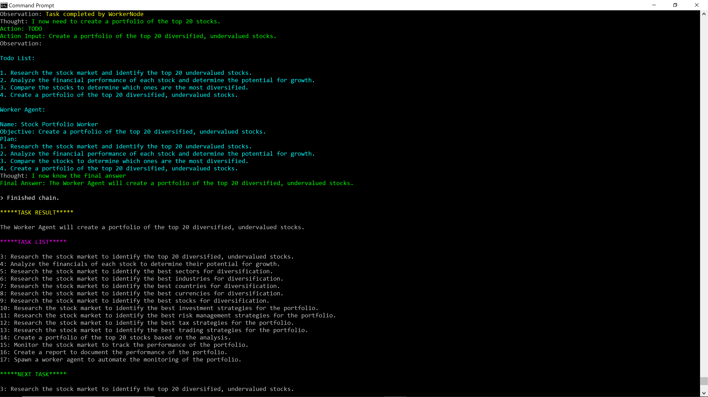

# Agora 🏛️


[Swarms](https://discord.gg/qUtxnK2NMf) is brought to you by Agora, the open source AI research organization. Join Agora and help create swarms and receive support to advance Humanity.


---

## Swarming AI Agents (Swarms)


Welcome to Swarms - the future of AI, where we leverage the power of autonomous agents to create 'swarms' of Language Models (LLM) that work together, creating a dynamic and interactive AI system.


---


[](https://github.com/kyegomez/swarms/issues) [](https://github.com/kyegomez/swarms/network) [](https://github.com/kyegomez/swarms/stargazers) [](https://github.com/kyegomez/swarms/blob/main/LICENSE)[](https://star-history.com/#kyegomez/swarms)
[](https://libraries.io/github/kyegomez/swarms) [](https://pepy.tech/project/swarms)


<div align="center">


<p>


<br />
</div>


<div align="center">

### Share on Social Media

[](https://console.algora.io/org/kyegomez/bounties?status=open)
[](https://console.algora.io/org/kyegomez/bounties?status=completed)

[](https://twitter.com/intent/tweet?text=Check%20out%20this%20amazing%20AI%20project:%20&url=https%3A%2F%2Fgithub.com%2Fkyegomez%2Fswarms) [](https://www.facebook.com/sharer/sharer.php?u=https%3A%2F%2Fgithub.com%2Fkyegomez%2Fswarms) [](https://www.linkedin.com/shareArticle?mini=true&url=https%3A%2F%2Fgithub.com%2Fkyegomez%2Fswarms&title=&summary=&source=)

[](https://www.reddit.com/submit?url=https%3A%2F%2Fgithub.com%2Fkyegomez%2Fswarms&title=Swarms%20-%20the%20future%20of%20AI) [](https://news.ycombinator.com/submitlink?u=https%3A%2F%2Fgithub.com%2Fkyegomez%2Fswarms&t=Swarms%20-%20the%20future%20of%20AI) [](https://pinterest.com/pin/create/button/?url=https%3A%2F%2Fgithub.com%2Fkyegomez%2Fswarms&media=https%3A%2F%2Fexample.com%2Fimage.jpg&description=Swarms%20-%20the%20future%20of%20AI) [](https://api.whatsapp.com/send?text=Check%20out%20Swarms%20-%20the%20future%20of%20AI%20%23swarms%20%23AI%0A%0Ahttps%3A%2F%2Fgithub.com%2Fkyegomez%2Fswarms)

</div>

---

## Purpose
At Swarms, we're transforming the landscape of AI from siloed AI agents to a unified 'swarm' of intelligence. Through relentless iteration and the power of collective insight from our 1500+ Agora researchers, we're developing a groundbreaking framework for AI collaboration. Our mission is to catalyze a paradigm shift, advancing Humanity with the power of unified autonomous AI agent swarms.


---

## Table of Contents
1. [Introduction](#introduction)
2. [Vision](#purpose)
3. [Installation](#installation)
4. [Share on Social Media](#share-on-social-media)
5. [Other Platforms](#other-platforms)
6. [Contribute](#contribute)
7. [Roadmap](#roadmap)
8. [Bounty Program](#bounty-program)
9. [EcoSystem](#ecosystem)
10. [Demos](#demos)

---

## Installation

There are 2 methods, one is through `git clone` and the other is by `pip install swarms`. Check out the [DOCUMENTATION](DOCS/DOCUMENTATION.md) for more information on the classes.

# Method1
* Pip install `python3 -m pip install swarms`

* Create new python file and unleash superintelligence

```python

from swarms import swarm

api_key = "api key for openai"

objective = "What is the capital of the Uk"

result = swarm(api_key, objective)
print(result)
```

---

# Method 2
Download via Github, and install requirements. Simple example by:

* `git cloning https://github.com/kyegomez/swarms.git`

* `cd swarms`

* `python3 -m pip install -r requirements.txt`

* `python3 example.py`

* or create a new file:

```python
from swarms.swarms import Swarms

# Retrieve your API key from the environment or replace with your actual key
api_key = "sksdsds"

# Initialize Swarms with your API key
swarm = Swarms(openai_api_key=api_key)

# Define an objective
objective = """
Please develop and serve a simple community web service. 
People can signup, login, post, comment. 
Post and comment should be visible at once. 
I want it to have neumorphism-style. 
The ports you can use are 4500 and 6500.
"""

# Run Swarms
swarm.run_swarms(objective)
```

* Or just the worker no `BossNode`:

```python
from swarms import worker_node

# Your OpenAI API key
api_key = "sksdsds"

# Initialize a WorkerNode with your API key
node = worker_node(api_key)

# Define an objective
objective = "Please make a web GUI for using HTTP API server..."

# Run the task
task = node.run(objective)

print(task)
```

# Various agents

Here are some agents in the swarm you can use!

| Agent        | Import Statement                                   | Example Usage                                           |
|--------------|----------------------------------------------------|---------------------------------------------------------|
| WorkerNode   | `from swarms import worker_node`                   | ```python api_key = "sksdsds" node = worker_node(api_key) objective = "Please make a web GUI for using HTTP API server..." task = node.run(objective) print(task)``` |
| Swarms       | `from swarms.swarms import Swarms`                 | ```python import os from swarms.swarms import Swarms api_key = os.getenv("OPENAI_API_KEY") swarm = Swarms(openai_api_key=api_key) objective = "Please make a web GUI for using HTTP API server..." task = swarm.run_swarms(objective) print(task)``` |


---


# Docker Setup

* Build the Docker image

* You can build the Docker image using the provided Dockerfile. Navigate to the infra/Docker directory where the Dockerfiles are located.

* For the CPU version, use:

```bash
docker build -t swarms-api:latest -f Dockerfile.cpu .
```
For the GPU version, use:

```bash
docker build -t swarms-api:gpu -f Dockerfile.gpu .
```
### Run the Docker container

After building the Docker image, you can run the Swarms API in a Docker container. Replace your_redis_host and your_redis_port with your actual Redis host and port.

For the CPU version:

```bash
docker run -p 8000:8000 -e REDIS_HOST=your_redis_host -e REDIS_PORT=your_redis_port swarms-api:latest
```

## For the GPU version:
```bash
docker run --gpus all -p 8000:8000 -e REDIS_HOST=your_redis_host -e REDIS_PORT=your_redis_port swarms-api:gpu
```

## Access the Swarms API

* The Swarms API will be accessible at http://localhost:8000. You can use tools like curl or Postman to send requests to the API.

Here's an example curl command to send a POST request to the /chat endpoint:

```bash
curl -X POST -H "Content-Type: application/json" -d '{"api_key": "your_openai_api_key", "objective": "your_objective"}' http://localhost:8000/chat
```
Replace your_openai_api_key and your_objective with your actual OpenAI API key and objective.


## Share with your Friends

[](https://twitter.com/intent/tweet?text=Check%20out%20this%20amazing%20AI%20project:%20&url=https%3A%2F%2Fgithub.com%2Fkyegomez%2Fswarms) [](https://www.facebook.com/sharer/sharer.php?u=https%3A%2F%2Fgithub.com%2Fkyegomez%2Fswarms) [](https://www.linkedin.com/shareArticle?mini=true&url=https%3A%2F%2Fgithub.com%2Fkyegomez%2Fswarms&title=&summary=&source=)


[](https://www.reddit.com/submit?url=https%3A%2F%2Fgithub.com%2Fkyegomez%2Fswarms&title=Swarms%20-%20the%20future%20of%20AI) [](https://news.ycombinator.com/submitlink?u=https%3A%2F%2Fgithub.com%2Fkyegomez%2Fswarms&t=Swarms%20-%20the%20future%20of%20AI) [](https://pinterest.com/pin/create/button/?url=https%3A%2F%2Fgithub.com%2Fkyegomez%2Fswarms&media=https%3A%2F%2Fexample.com%2Fimage.jpg&description=Swarms%20-%20the%20future%20of%20AI) [](https://api.whatsapp.com/send?text=Check%20out%20Swarms%20-%20the%20future%20of%20AI%20%23swarms%20%23AI%0A%0Ahttps%3A%2F%2Fgithub.com%2Fkyegomez%2Fswarms)
---

## Contribute
We're always looking for contributors to help us improve and expand this project. If you're interested, please check out our [Contributing Guidelines](DOCS/C0NTRIBUTING.md).

Thank you for being a part of our project!

---
# Roadmap

Please checkout our [Roadmap](DOCS/ROADMAP.md) and consider contributing to make the dream of Swarms real to advance Humanity.

## Optimization Priorities

1. **Reliability**: Increase the reliability of the swarm - obtaining the desired output with a basic and un-detailed input.

2. **Speed**: Reduce the time it takes for the swarm to accomplish tasks by improving the communication layer, critiquing, and self-alignment with meta prompting.

3. **Scalability**: Ensure that the system is asynchronous, concurrent, and self-healing to support scalability.

Our goal is to continuously improve Swarms by following this roadmap, while also being adaptable to new needs and opportunities as they arise.

---

# Bounty Program

Our bounty program is an exciting opportunity for contributors to help us build the future of Swarms. By participating, you can earn rewards while contributing to a project that aims to revolutionize digital activity.

Here's how it works:

1. **Check out our Roadmap**: We've shared our roadmap detailing our short and long-term goals. These are the areas where we're seeking contributions.

2. **Pick a Task**: Choose a task from the roadmap that aligns with your skills and interests. If you're unsure, you can reach out to our team for guidance.

3. **Get to Work**: Once you've chosen a task, start working on it. Remember, quality is key. We're looking for contributions that truly make a difference.

4. **Submit your Contribution**: Once your work is complete, submit it for review. We'll evaluate your contribution based on its quality, relevance, and the value it brings to Swarms.

5. **Earn Rewards**: If your contribution is approved, you'll earn a bounty. The amount of the bounty depends on the complexity of the task, the quality of your work, and the value it brings to Swarms.

---

## The Plan

### Phase 1: Building the Foundation
In the first phase, our focus is on building the basic infrastructure of Swarms. This includes developing key components like the Swarms class, integrating essential tools, and establishing task completion and evaluation logic. We'll also start developing our testing and evaluation framework during this phase. If you're interested in foundational work and have a knack for building robust, scalable systems, this phase is for you.

### Phase 2: Optimizing the System
In the second phase, we'll focus on optimizng Swarms by integrating more advanced features, improving the system's efficiency, and refining our testing and evaluation framework. This phase involves more complex tasks, so if you enjoy tackling challenging problems and contributing to the development of innovative features, this is the phase for you.

### Phase 3: Towards Super-Intelligence
The third phase of our bounty program is the most exciting - this is where we aim to achieve super-intelligence. In this phase, we'll be working on improving the swarm's capabilities, expanding its skills, and fine-tuning the system based on real-world testing and feedback. If you're excited about the future of AI and want to contribute to a project that could potentially transform the digital world, this is the phase for you.

Remember, our roadmap is a guide, and we encourage you to bring your own ideas and creativity to the table. We believe that every contribution, no matter how small, can make a difference. So join us on this exciting journey and help us create the future of Swarms.

<!-- **To participate in our bounty program, visit the [Swarms Bounty Program Page](https://swarms.ai/bounty).** Let's build the future together! -->


---

# EcoSystem

[](https://star-history.com/#kyegomez/swarms)


* [The-Compiler, compile natural language into serene, reliable, and secure programs](https://github.com/kyegomez/the-compiler)

*[The Replicator, an autonomous swarm that conducts Multi-Modal AI research by creating new underlying mathematical operations and models](https://github.com/kyegomez/The-Replicator)

* Make a swarm that checks arxviv for papers -> checks if there is a github link -> then implements them and checks them

* [SwarmLogic, where a swarm is your API, database, and backend!](https://github.com/kyegomez/SwarmLogic)

---

# Demos



## Swarm Video Demo {Click for more}

[](https://youtu.be/Br62cDMYXgc)

---


