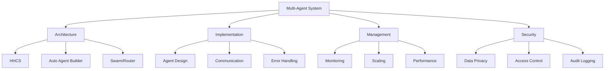
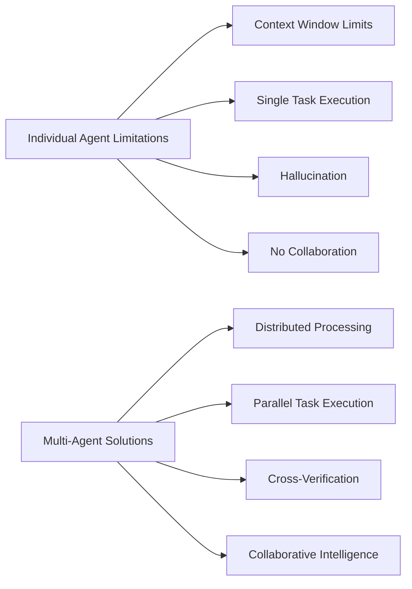
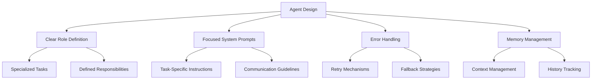
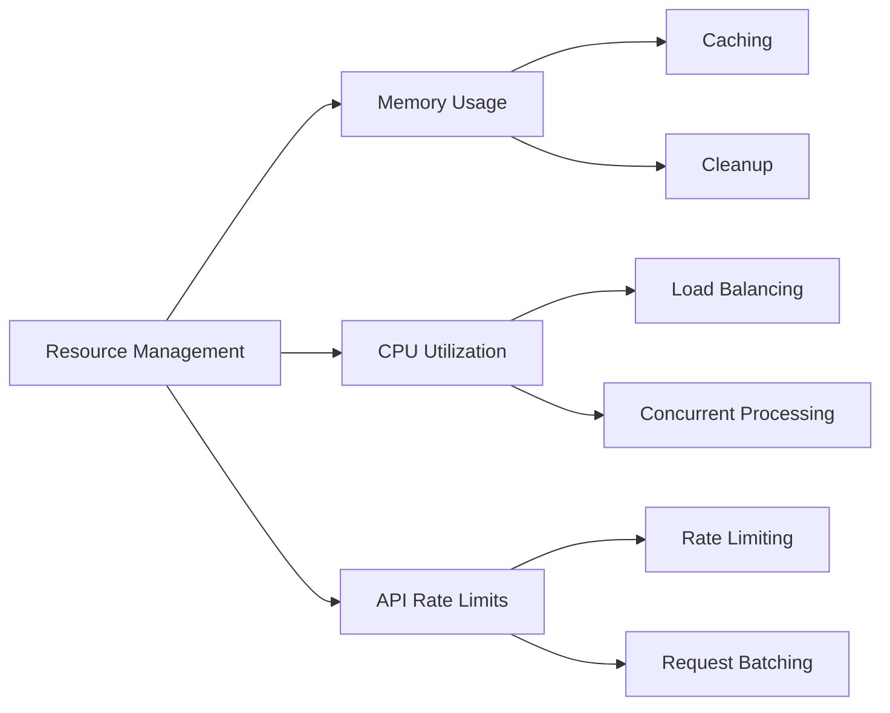
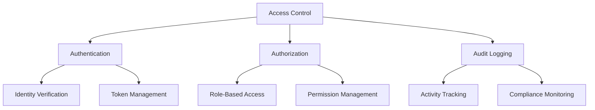

# Best Practices for Multi-Agent Systems

## Overview

This guide provides comprehensive best practices for designing, implementing, and managing multi-agent systems. It covers key aspects from architecture selection to performance optimization and security considerations.



## Why Multi-Agent Systems?

Individual agents face several limitations that multi-agent systems can overcome:



### Key Benefits

1. **Enhanced Reliability**
   - Cross-verification between agents
   - Redundancy and fault tolerance
   - Consensus-based decision making

2. **Improved Efficiency**
   - Parallel processing capabilities
   - Specialized agent roles
   - Resource optimization

3. **Better Accuracy**
   - Multiple verification layers
   - Collaborative fact-checking
   - Consensus-driven outputs

## Architecture Selection

Choose the appropriate architecture based on your needs:

| Architecture | Best For | Key Features |
|--------------|----------|--------------|
| HHCS | Complex, multi-domain tasks | - Clear task routing<br>- Specialized handling<br>- Parallel processing |
| Auto Agent Builder | Dynamic, evolving tasks | - Self-organizing<br>- Flexible scaling<br>- Adaptive creation |
| SwarmRouter | Varied task types | - Multiple workflows<br>- Simple configuration<br>- Flexible deployment |

## Implementation Best Practices

### 1. Agent Design



### 2. Communication Protocols

- **State Alignment**
  - Begin with shared understanding
  - Regular status updates
  - Clear task progression

- **Information Sharing**
  - Transparent decision making
  - Explicit acknowledgments
  - Structured data formats

### 3. Error Handling

```python
try:
    result = router.route_task(task)
except Exception as e:
    logger.error(f"Task routing failed: {str(e)}")
    # Implement retry or fallback strategy
```

## Performance Optimization

### 1. Resource Management



### 2. Scaling Strategies

1. **Horizontal Scaling**
   - Add more agents for parallel processing
   - Distribute workload across instances
   - Balance resource utilization

2. **Vertical Scaling**
   - Optimize individual agent performance
   - Enhance memory management
   - Improve processing efficiency

## Security Considerations

### 1. Data Privacy

- Implement encryption for sensitive data
- Secure communication channels
- Regular security audits

### 2. Access Control



## Monitoring and Maintenance

### 1. Key Metrics

- Response times
- Success rates
- Error rates
- Resource utilization
- API usage

### 2. Logging Best Practices

```python
# Structured logging example
logger.info({
    'event': 'task_completion',
    'task_id': task.id,
    'duration': duration,
    'agents_involved': agent_count,
    'status': 'success'
})
```

### 3. Alert Configuration

Set up alerts for:
- Critical errors
- Performance degradation
- Resource constraints
- Security incidents

## Getting Started

1. **Start Small**
   - Begin with a pilot project
   - Test with limited scope
   - Gather metrics and feedback

2. **Scale Gradually**
   - Increase complexity incrementally
   - Add agents as needed
   - Monitor performance impact

3. **Maintain Documentation**
   - Keep system diagrams updated
   - Document configuration changes
   - Track performance optimizations

## Conclusion

Building effective multi-agent systems requires careful consideration of architecture, implementation, security, and maintenance practices. By following these guidelines, you can create robust, efficient, and secure multi-agent systems that effectively overcome the limitations of individual agents.

!!! tip "Remember"
    - Start with clear objectives
    - Choose appropriate architecture
    - Implement proper security measures
    - Monitor and optimize performance
    - Document everything 