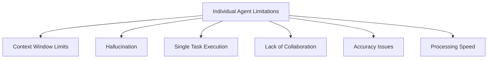
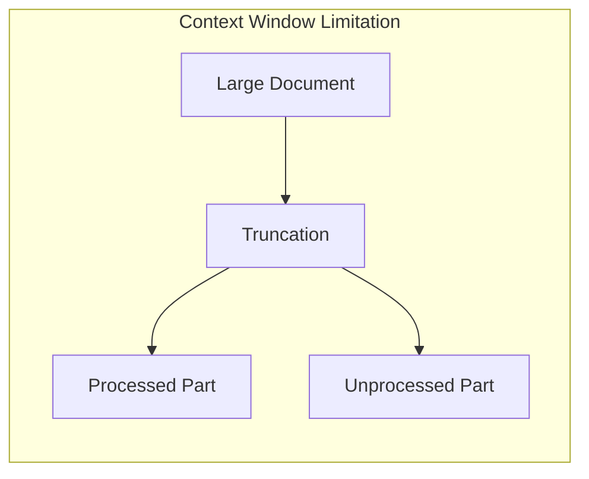
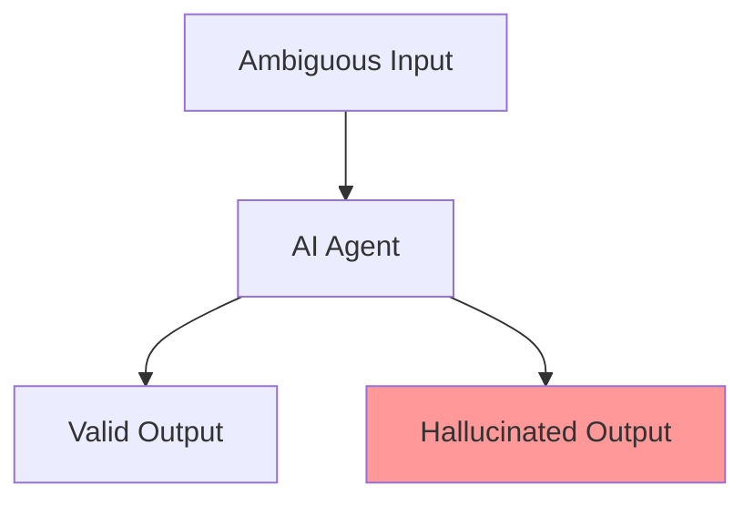
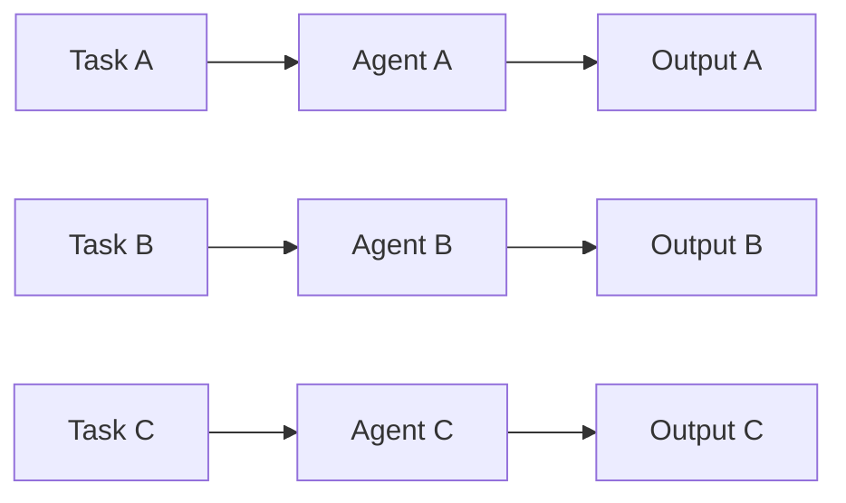
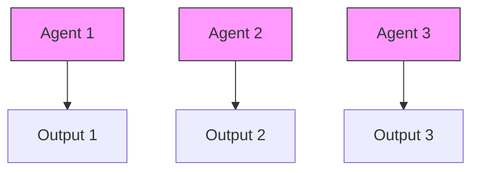
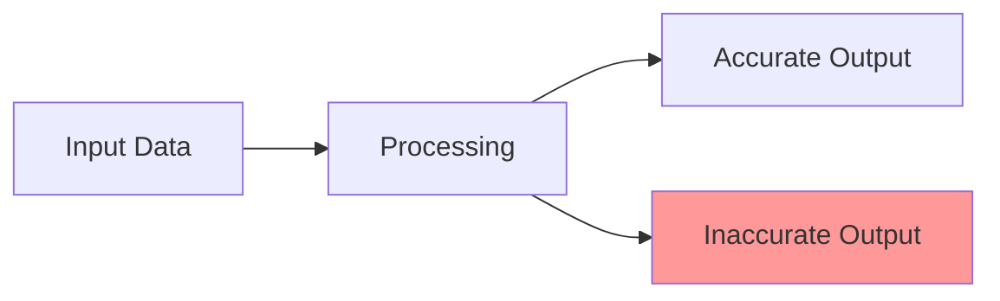
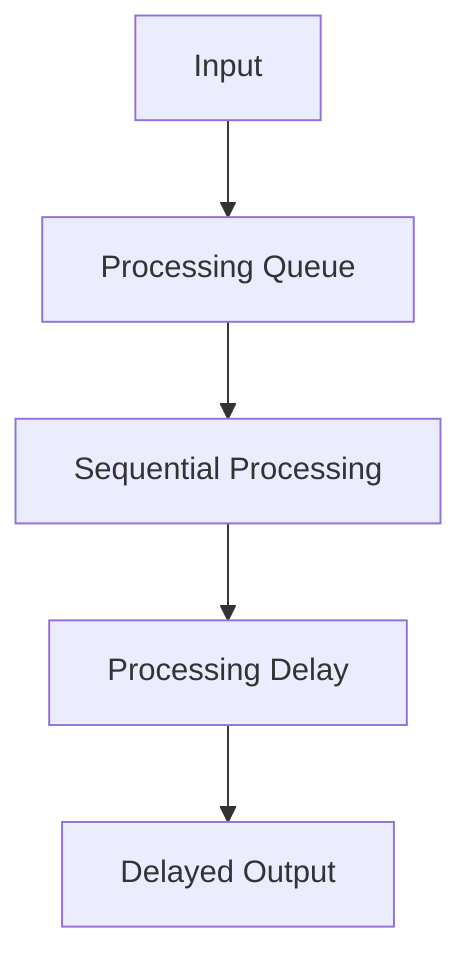

# Limitations of Individual Agents

This section explores the fundamental limitations of individual AI agents and why multi-agent systems are necessary for complex tasks. Understanding these limitations is crucial for designing effective multi-agent architectures.

## Overview

## 1. Context Window Limits

### The Challenge
Individual agents are constrained by fixed context windows, limiting their ability to process large amounts of information simultaneously.

### Impact
- Limited understanding of large documents
- Fragmented processing of long conversations
- Inability to maintain extended context
- Loss of important information

## 2. Hallucination

### The Challenge
Individual agents may generate plausible-sounding but incorrect information, especially when dealing with ambiguous or incomplete data.

### Impact
- Unreliable information generation
- Reduced trust in system outputs
- Potential for misleading decisions
- Need for extensive verification

## 3. Single Task Execution

### The Challenge
Most individual agents are optimized for specific tasks and struggle with multi-tasking or adapting to new requirements.

### Impact
- Limited flexibility
- Inefficient resource usage
- Complex integration requirements
- Reduced adaptability

## 4. Lack of Collaboration

### The Challenge
Individual agents operate in isolation, unable to share insights or coordinate actions with other agents.

### Impact
- No knowledge sharing
- Duplicate effort
- Missed optimization opportunities
- Limited problem-solving capabilities

## 5. Accuracy Issues

### The Challenge
Individual agents may produce inaccurate results due to:
- Limited training data
- Model biases
- Lack of cross-validation
- Incomplete context understanding

## 6. Processing Speed Limitations

### The Challenge
Individual agents may experience:
- Slow response times
- Resource constraints
- Limited parallel processing
- Bottlenecks in complex tasks

## Best Practices for Mitigation

1. **Use Multi-Agent Systems**
   - Distribute tasks across agents
   - Enable parallel processing
   - Implement cross-validation
   - Foster collaboration

2. **Implement Verification**
   - Cross-check results
   - Use consensus mechanisms
   - Monitor accuracy metrics
   - Track performance

3. **Optimize Resource Usage**
   - Balance load distribution
   - Cache frequent operations
   - Implement efficient queuing
   - Monitor system health

## Conclusion

Understanding these limitations is crucial for:
- Designing robust multi-agent systems
- Implementing effective mitigation strategies
- Optimizing system performance
- Ensuring reliable outputs

The next section explores how [Multi-Agent Architecture](architecture.md) addresses these limitations through collaborative approaches and specialized agent roles. 