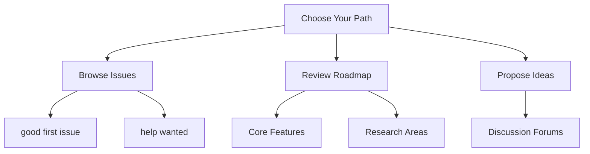

# Contributing to Swarms

## Building the Infrastructure for the World's Autonomous Economy

Multi-agent collaboration is the most important technology in human history. It will reshape civilization by enabling billions of autonomous agents to coordinate and solve problems at unprecedented scale.

!!! success "The Foundation of Tomorrow"
    **Swarms** is the foundational infrastructure powering this autonomous economy. By contributing, you're building the systems that will enable the next generation of intelligent automation.

### What You're Building

=== "Autonomous Systems"
    **Autonomous Resource Allocation**
    
    Global supply chains and energy distribution optimized in real-time

=== "Intelligence Networks"
    **Distributed Decision Making**
    
    Collaborative intelligence networks across industries and governments

=== "Smart Markets"
    **Self-Organizing Markets**
    
    Agent-driven marketplaces that automatically balance supply and demand

=== "Problem Solving"
    **Collaborative Problem Solving**
    
    Massive agent swarms tackling climate change, disease, and scientific discovery

=== "Infrastructure"
    **Adaptive Infrastructure**
    
    Self-healing systems that evolve without human intervention

---

## Why Contribute to Swarms?

### :material-rocket-launch: Shape the Future of Civilization

!!! abstract "Your Impact"
    - Define standards for multi-agent communication protocols
    - Build architectural patterns for distributed intelligence systems
    - Create frameworks for deploying agent swarms in production
    - Establish ethical guidelines for autonomous agent collaboration

### :material-trophy: Recognition and Professional Development

!!! tip "Immediate Recognition"
    - **Social Media Features** - All merged PRs showcased publicly
    - **Bounty Programs** - Financial rewards for high-impact contributions
    - **Fast-Track Hiring** - Priority consideration for core team positions
    - **Community Spotlights** - Regular recognition and acknowledgments

!!! info "Career Benefits"
    - Multi-agent expertise highly valued by AI industry
    - Portfolio demonstrates cutting-edge technical skills
    - Direct networking with leading researchers and companies
    - Thought leadership opportunities in emerging field

### :material-brain: Technical Expertise Development

Master cutting-edge technologies:

| Technology Area | Skills You'll Develop |
|----------------|----------------------|
| **Swarm Intelligence** | Design sophisticated agent coordination mechanisms |
| **Distributed Computing** | Build scalable architectures for thousands of agents |
| **Communication Protocols** | Create novel interaction patterns |
| **Production AI** | Deploy and orchestrate enterprise-scale systems |
| **Research Implementation** | Turn cutting-edge papers into working code |

### :material-account-group: Research Community Access

!!! note "Collaborative Environment"
    - Work with experts from academic institutions and industry
    - Regular technical seminars and research discussions
    - Structured mentorship from experienced contributors
    - Applied research opportunities with real-world impact

---

## Contribution Opportunities

=== "New Contributors"
    ### :material-school: Perfect for Getting Started
    
    - **Documentation** - Improve guides, tutorials, and API references
    - **Bug Reports** - Identify and document issues
    - **Code Quality** - Participate in testing and review processes
    - **Community Support** - Help users in forums and discussions

=== "Experienced Developers"
    ### :material-code-braces: Advanced Technical Work
    
    - **Core Architecture** - Design fundamental system components
    - **Performance Optimization** - Enhance coordination and communication efficiency
    - **Research Implementation** - Turn cutting-edge papers into working code
    - **Integration Development** - Build connections with AI tools and platforms

=== "Researchers"
    ### :material-flask: Research and Innovation
    
    - **Algorithm Development** - Implement novel multi-agent algorithms
    - **Experimental Frameworks** - Create evaluation and benchmarking tools
    - **Theoretical Contributions** - Develop research documentation and frameworks
    - **Academic Collaboration** - Partner on funded research projects

---

## How to Contribute

### Step 1: Get Started

!!! info "Essential Resources"
    [:material-book-open-page-variant: **Documentation**](https://docs.swarms.world/en/latest/){ .md-button .md-button--primary }
    [:material-github: **GitHub Repository**](https://github.com/kyegomez/swarms){ .md-button }
    [:material-chat: **Community Channels**](#){ .md-button }

### Step 2: Find Your Path

### Step 3: Make Impact

1. **Fork & Setup** - Configure your development environment
2. **Develop** - Create your contribution
3. **Submit** - Open a pull request
4. **Collaborate** - Work with maintainers
5. **Celebrate** - See your work recognized

---

## Recognition Framework

### :material-flash: Immediate Benefits

!!! success "Instant Recognition"
    | Benefit | Description |
    |---------|-------------|
    | **Social Media Features** | Every merged PR showcased publicly |
    | **Community Recognition** | Contributor badges and documentation credits |
    | **Professional References** | Formal acknowledgment for portfolios |
    | **Direct Mentorship** | Access to core team guidance |

### :material-trending-up: Long-term Opportunities

!!! tip "Career Growth"
    - **Team Positions** - Fast-track consideration for core team roles
    - **Conference Speaking** - Present work at AI conferences and events
    - **Industry Connections** - Network with leading AI organizations
    - **Research Collaboration** - Partner with academic institutions

---

## Societal Impact

!!! abstract "Building Solutions for Humanity"
    Swarms enables technology that addresses critical challenges:

    === "Research"
        **Scientific Research**
        
        Accelerate collaborative research and discovery across disciplines

    === "Healthcare"
        **Healthcare Innovation**
        
        Support drug discovery and personalized medicine development

    === "Environment"
        **Environmental Solutions**
        
        Monitor climate and optimize sustainability initiatives

    === "Education"
        **Educational Technology**
        
        Create adaptive learning systems for personalized education

    === "Economy"
        **Economic Innovation**
        
        Generate new opportunities and efficiency improvements

---

## Get Involved

### :material-link: Connect With Us

!!! info "Join the Community"
    [:material-github: **GitHub Repository**](https://github.com/kyegomez/swarms){ .md-button .md-button--primary }
    [:material-book: **Documentation**](https://docs.swarms.world/en/latest/){ .md-button }
    [:material-forum: **Community Forums**](#){ .md-button }

---

!!! warning "The Future is Now"
    Multi-agent collaboration will define the next century of human progress. The autonomous economy depends on the infrastructure we build today.

!!! success "Your Mission"
    Your contribution to Swarms helps create the foundation for billions of autonomous agents working together to solve humanity's greatest challenges.

    **Join us in building the most important technology of our time.**

---

*Built with :material-heart: by the global Swarms community*

