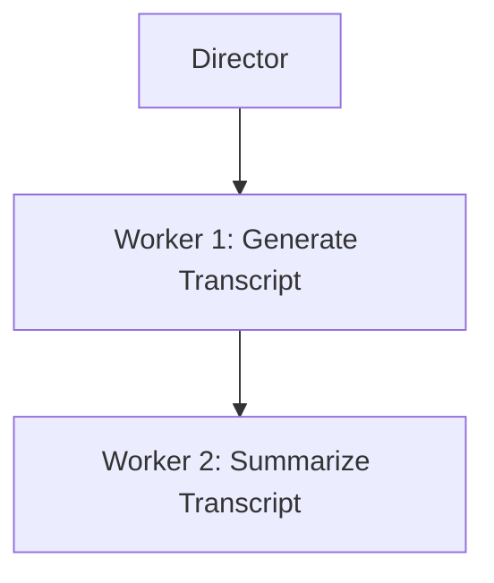
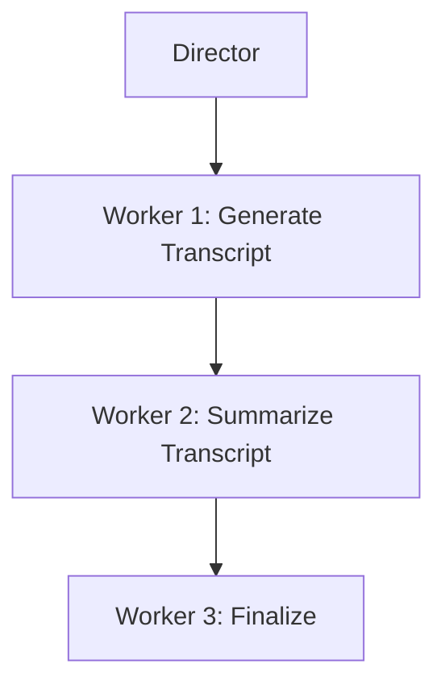

# Swarms – The Ultimate Multi-Agent LLM Framework for Developers

Swarms aims to be the definitive and most reliable multi-agent LLM framework, offering developers the tools to automate business operations effortlessly. It provides a vast array of swarm architectures, seamless third-party integration, and unparalleled ease of use. With Swarms, developers can orchestrate intelligent, scalable agent ecosystems that can automate complex business processes.

### Key Features for Developers:
1. **Architectural Flexibility** – Choose from a wide variety of pre-built swarm architectures or build custom agent frameworks. Swarms allows developers to define flexible workflows for specific use cases, providing both sequential and concurrent task execution.
2. **Third-Party Integration** – Swarms makes it simple to integrate with external APIs, databases, and other platforms. By supporting extreme integration capabilities, it ensures your agents work effortlessly within any workflow.
3. **Developer-Centric APIs** – The Swarms API is built with developers in mind, offering an intuitive, simple-to-use interface. Developers can orchestrate agent swarms with minimal code and maximum control.

---

### Code Examples

#### 1. Basic Financial Analysis Agent:
This example demonstrates a simple financial agent setup that responds to financial questions, such as establishing a ROTH IRA, using OpenAI's GPT-based model.

```python
from swarms.structs.agent import Agent
from swarms.prompts.finance_agent_sys_prompt import FINANCIAL_AGENT_SYS_PROMPT

# Initialize the Financial Analysis Agent with GPT-4o-mini model
agent = Agent(
    agent_name="Financial-Analysis-Agent",
    system_prompt=FINANCIAL_AGENT_SYS_PROMPT,
    model_name="gpt-4o-mini",
    max_loops=1,
    autosave=True,
    dashboard=False,
    verbose=True,
    dynamic_temperature_enabled=True,
    saved_state_path="finance_agent.json",
    user_name="swarms_corp",
    retry_attempts=1,
    context_length=200000,
    return_step_meta=False,
)

# Example task for the agent
out = agent.run(
    "How can I establish a ROTH IRA to buy stocks and get a tax break? What are the criteria?"
)

# Output the result
print(out)
```

#### 2. Agent Orchestration with AgentRearrange:
The following example showcases how to use the `AgentRearrange` class to manage a multi-agent system. It sets up a director agent to orchestrate two workers—one to generate a transcript and another to summarize it.

```python
from swarms.structs.agent import Agent
from swarms.structs.rearrange import AgentRearrange  

# Initialize the Director agent using Anthropic model via model_name
director = Agent(
    agent_name="Director",
    system_prompt="You are a Director agent. Your role is to coordinate and direct tasks for worker agents. Break down complex tasks into clear, actionable steps.",
    model_name="claude-3-sonnet-20240229",
    max_loops=1,
    dashboard=False,
    streaming_on=False, 
    verbose=True,
    stopping_token="<DONE>",
    state_save_file_type="json",
    saved_state_path="director.json",
)

# Worker 1: transcript generation
worker1 = Agent(
    agent_name="Worker1",
    system_prompt="You are a content creator agent. Your role is to generate detailed, engaging transcripts for YouTube videos about technical topics. Focus on clarity and educational value.",
    model_name="claude-3-sonnet-20240229",
    max_loops=1,
    dashboard=False,
    streaming_on=False,  
    verbose=True,
    stopping_token="<DONE>",
    state_save_file_type="json",
    saved_state_path="worker1.json",
)

# Worker 2: summarization
worker2 = Agent(
    agent_name="Worker2",
    system_prompt="You are a summarization agent. Your role is to create concise, clear summaries of technical content while maintaining key information and insights.",
    model_name="claude-3-sonnet-20240229",
    max_loops=1,
    dashboard=False,
    streaming_on=False,  
    verbose=True,
    stopping_token="<DONE>",
    state_save_file_type="json",
    saved_state_path="worker2.json",
)

# Orchestrate the agents in sequence
agents = [director, worker1, worker2]
flow = "Director -> Worker1 -> Worker2"
agent_system = AgentRearrange(agents=agents, flow=flow)

# Run the workflow
output = agent_system.run(
    "Create a format to express and communicate swarms of LLMs in a structured manner for YouTube"
)
print(output)
```

#### 1. Basic Agent Flow:
Here’s a visual representation of the basic workflow using Mermaid to display the sequential flow between agents.



In this diagram:
- The **Director** agent assigns tasks.
- **Worker 1** generates a transcript for a YouTube video.
- **Worker 2** summarizes the transcript.

#### 2. Sequential Agent Flow:
This diagram showcases a sequential agent setup where one agent completes its task before the next agent starts its task.



In this setup:

- The **Director** agent assigns tasks to **Worker 1**, which generates a transcript for a YouTube video.

- **Worker 1** completes its task before **Worker 2** starts summarizing the transcript.

- **Worker 2** completes its task before **Worker 3** finalizes the process.

### Why Developers Should Choose Swarms:

Swarms is designed with flexibility at its core. Developers can create custom architectures and workflows, enabling extreme control over how agents interact with each other. Whether it’s a linear process or a complex mesh of agent communications, Swarms handles it efficiently.

With support for extreme third-party integration, Swarms makes it easy for developers to plug into external systems, such as APIs or internal databases. This allows agents to act on live data, process external inputs, and execute actions in real time, making it a powerful tool for real-world applications.

Swarms abstracts the complexity of managing multiple agents with orchestration tools like `AgentRearrange`. Developers can define workflows that execute tasks concurrently or sequentially, depending on the problem at hand. This makes it easy to build and maintain large-scale automation systems.

### Conclusion:
Swarms is not just another multi-agent framework; it's built specifically for developers who need powerful tools to automate complex, large-scale business operations. With flexible architecture, deep integration capabilities, and developer-friendly APIs, Swarms is the ultimate solution for businesses looking to streamline operations and future-proof their workflows.