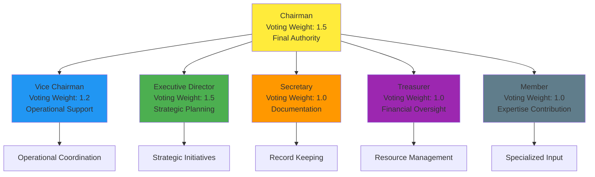
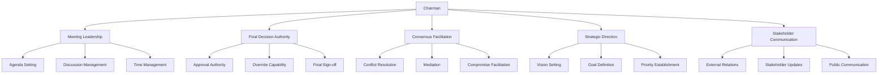
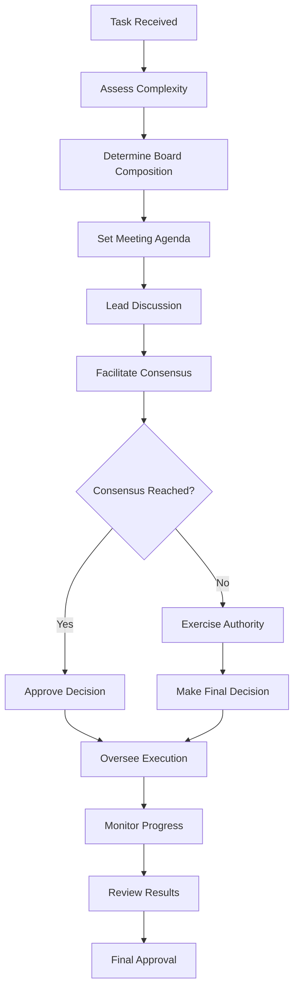
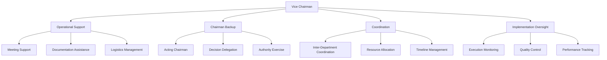
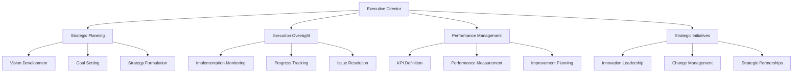
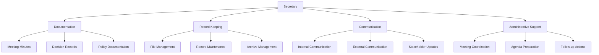
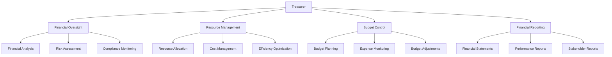
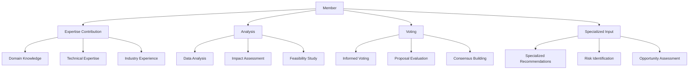
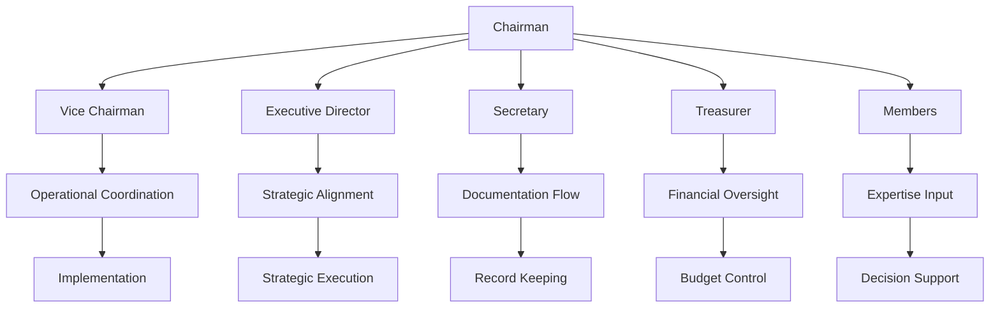

# Board of Directors Roles

The Board of Directors system implements a hierarchical structure with clearly defined roles, responsibilities, and voting weights. Each role is designed to contribute specific expertise and authority to the decision-making process, ensuring comprehensive analysis and balanced decision-making.

## Role Hierarchy



**Diagram Explanation:**
This hierarchical diagram shows the organizational structure of the Board of Directors, with the Chairman at the top having final authority and the highest voting weight (1.5). The Chairman directly supervises all other board members, each with specific responsibilities and voting weights. The Vice Chairman and Executive Director have elevated voting weights (1.2 and 1.5 respectively) due to their senior positions, while the Secretary, Treasurer, and general Members have standard voting weights (1.0). Each role contributes specialized expertise to different aspects of the decision-making process.

**Technical Implementation:**
```python
# Example: Role hierarchy implementation
class BoardRoleHierarchy:
    def __init__(self):
        self.roles = {
            "CHAIRMAN": {
                "voting_weight": 1.5,
                "authority_level": "FINAL",
                "supervises": ["VICE_CHAIRMAN", "EXECUTIVE_DIRECTOR", "SECRETARY", "TREASURER", "MEMBER"],
                "responsibilities": ["leadership", "final_decision", "consensus_facilitation"],
                "override_capability": True
            },
            "VICE_CHAIRMAN": {
                "voting_weight": 1.2,
                "authority_level": "SENIOR",
                "supervises": ["MEMBER"],
                "responsibilities": ["operational_support", "coordination", "implementation"],
                "backup_for": "CHAIRMAN"
            },
            "EXECUTIVE_DIRECTOR": {
                "voting_weight": 1.5,
                "authority_level": "SENIOR",
                "supervises": ["MEMBER"],
                "responsibilities": ["strategic_planning", "execution_oversight", "performance_management"],
                "strategic_authority": True
            },
            "SECRETARY": {
                "voting_weight": 1.0,
                "authority_level": "STANDARD",
                "supervises": [],
                "responsibilities": ["documentation", "record_keeping", "communication"],
                "administrative_authority": True
            },
            "TREASURER": {
                "voting_weight": 1.0,
                "authority_level": "STANDARD",
                "supervises": [],
                "responsibilities": ["financial_oversight", "resource_management", "budget_control"],
                "financial_authority": True
            },
            "MEMBER": {
                "voting_weight": 1.0,
                "authority_level": "STANDARD",
                "supervises": [],
                "responsibilities": ["expertise_contribution", "analysis", "voting"],
                "specialized_expertise": True
            }
        }
    
    def get_role_info(self, role_name):
        """Get detailed information about a specific role"""
        return self.roles.get(role_name, {})
    
    def get_voting_weight(self, role_name):
        """Get voting weight for a specific role"""
        role_info = self.get_role_info(role_name)
        return role_info.get("voting_weight", 1.0)
    
    def get_authority_level(self, role_name):
        """Get authority level for a specific role"""
        role_info = self.get_role_info(role_name)
        return role_info.get("authority_level", "STANDARD")
    
    def can_override_decision(self, role_name):
        """Check if a role can override board decisions"""
        role_info = self.get_role_info(role_name)
        return role_info.get("override_capability", False)
    
    def get_supervision_chain(self, role_name):
        """Get the supervision chain for a specific role"""
        supervision_chain = []
        current_role = role_name
        
        while current_role:
            role_info = self.get_role_info(current_role)
            if role_info:
                supervision_chain.append(current_role)
                # Find who supervises this role
                current_role = None
                for supervisor, info in self.roles.items():
                    if current_role in info.get("supervises", []):
                        current_role = supervisor
                        break
            else:
                break
        
        return supervision_chain
```

## Chairman Role

### Primary Responsibilities



**Diagram Explanation:**
This diagram illustrates the comprehensive responsibilities of the Chairman role, showing how the Chairman serves as the central authority figure with five main areas of responsibility. Meeting Leadership involves agenda setting, discussion management, and time management. Final Decision Authority includes approval authority, override capability, and final sign-off responsibilities. Consensus Facilitation covers conflict resolution, mediation, and compromise facilitation. Strategic Direction encompasses vision setting, goal definition, and priority establishment. Stakeholder Communication includes external relations, stakeholder updates, and public communication.

**Technical Implementation:**
```python
# Example: Chairman role implementation
class Chairman:
    def __init__(self, name, config):
        self.name = name
        self.config = config
        self.authority_level = "FINAL"
        self.voting_weight = 1.5
        self.override_capability = True
        self.meeting_history = []
        self.decision_history = []
    
    async def lead_meeting(self, task, board_members):
        """Lead a board meeting for task discussion and decision-making"""
        meeting_result = {
            "meeting_id": self.generate_meeting_id(),
            "task": task,
            "participants": list(board_members.keys()),
            "phases": [],
            "decisions": [],
            "consensus_achieved": False
        }
        
        # Phase 1: Meeting Opening
        opening_phase = await self.open_meeting(task, board_members)
        meeting_result["phases"].append(opening_phase)
        
        # Phase 2: Agenda Review and Task Presentation
        presentation_phase = await self.present_task(task, board_members)
        meeting_result["phases"].append(presentation_phase)
        
        # Phase 3: Discussion Facilitation
        discussion_phase = await self.facilitate_discussion(task, board_members)
        meeting_result["phases"].append(discussion_phase)
        
        # Phase 4: Consensus Building
        consensus_phase = await self.build_consensus(discussion_phase["proposals"], board_members)
        meeting_result["phases"].append(consensus_phase)
        
        # Phase 5: Decision Making
        decision_phase = await self.make_final_decision(consensus_phase, board_members)
        meeting_result["phases"].append(decision_phase)
        
        meeting_result["decisions"] = decision_phase["decisions"]
        meeting_result["consensus_achieved"] = consensus_phase["consensus_achieved"]
        
        # Record meeting in history
        self.meeting_history.append(meeting_result)
        
        return meeting_result
    
    async def open_meeting(self, task, board_members):
        """Open the board meeting and set the agenda"""
        agenda = await self.create_agenda(task)
        
        opening_statement = f"""
        Meeting called to order by Chairman {self.name}.
        
        Task: {task['description']}
        Priority: {task.get('priority', 'Normal')}
        Timeline: {task.get('timeline', 'Not specified')}
        
        Agenda:
        {self.format_agenda(agenda)}
        
        Board members present: {', '.join(board_members.keys())}
        """
        
        return {
            "phase": "meeting_opening",
            "opening_statement": opening_statement,
            "agenda": agenda,
            "participants": list(board_members.keys()),
            "timestamp": datetime.now().isoformat()
        }
    
    async def create_agenda(self, task):
        """Create a structured agenda for the meeting"""
        agenda = {
            "items": [
                {
                    "item": "Task Presentation",
                    "duration": "10 minutes",
                    "responsible": "Chairman",
                    "description": "Present task details and requirements"
                },
                {
                    "item": "Expertise Assignment",
                    "duration": "5 minutes",
                    "responsible": "Chairman",
                    "description": "Assign analysis areas to board members"
                },
                {
                    "item": "Individual Analysis",
                    "duration": "15 minutes",
                    "responsible": "All Members",
                    "description": "Board members analyze assigned areas"
                },
                {
                    "item": "Group Discussion",
                    "duration": "20 minutes",
                    "responsible": "All Members",
                    "description": "Open discussion and debate"
                },
                {
                    "item": "Proposal Development",
                    "duration": "15 minutes",
                    "responsible": "All Members",
                    "description": "Develop and refine proposals"
                },
                {
                    "item": "Voting and Consensus",
                    "duration": "10 minutes",
                    "responsible": "All Members",
                    "description": "Vote on proposals and reach consensus"
                },
                {
                    "item": "Decision Finalization",
                    "duration": "5 minutes",
                    "responsible": "Chairman",
                    "description": "Finalize decisions and assign execution"
                }
            ],
            "total_duration": "80 minutes",
            "break_time": "10 minutes"
        }
        
        return agenda
    
    async def facilitate_discussion(self, task, board_members):
        """Facilitate discussion among board members"""
        discussion_result = {
            "phase": "discussion_facilitation",
            "discussion_points": [],
            "conflicts": [],
            "resolutions": [],
            "proposals": []
        }
        
        # Guide discussion through structured phases
        for member_role, member in board_members.items():
            # Get member's analysis
            analysis = await member.analyze_task(task)
            discussion_result["discussion_points"].append({
                "member": member_role,
                "analysis": analysis,
                "timestamp": datetime.now().isoformat()
            })
            
            # Identify conflicts
            conflicts = await self.identify_conflicts(analysis, discussion_result["discussion_points"])
            discussion_result["conflicts"].extend(conflicts)
            
            # Facilitate conflict resolution
            for conflict in conflicts:
                resolution = await self.resolve_conflict(conflict, board_members)
                discussion_result["resolutions"].append(resolution)
        
        # Develop proposals based on discussion
        proposals = await self.develop_proposals(discussion_result["discussion_points"])
        discussion_result["proposals"] = proposals
        
        return discussion_result
    
    async def build_consensus(self, proposals, board_members):
        """Build consensus among board members on proposals"""
        consensus_result = {
            "phase": "consensus_building",
            "voting_rounds": [],
            "consensus_achieved": False,
            "final_proposal": None
        }
        
        current_proposals = proposals
        round_number = 1
        
        while round_number <= self.config.get("max_consensus_rounds", 3):
            # Conduct voting round
            voting_result = await self.conduct_voting_round(current_proposals, board_members, round_number)
            consensus_result["voting_rounds"].append(voting_result)
            
            # Check if consensus achieved
            if voting_result["consensus_achieved"]:
                consensus_result["consensus_achieved"] = True
                consensus_result["final_proposal"] = voting_result["winning_proposal"]
                break
            
            # Refine proposals for next round
            current_proposals = await self.refine_proposals(current_proposals, voting_result)
            round_number += 1
        
        return consensus_result
    
    async def make_final_decision(self, consensus_result, board_members):
        """Make final decision based on consensus or exercise authority"""
        if consensus_result["consensus_achieved"]:
            # Consensus reached, approve the decision
            decision = {
                "type": "consensus_decision",
                "proposal": consensus_result["final_proposal"],
                "approval_method": "consensus",
                "board_support": "unanimous"
            }
        else:
            # No consensus, exercise chairman authority
            decision = await self.exercise_authority(consensus_result, board_members)
        
        decision_result = {
            "phase": "final_decision",
            "decision": decision,
            "execution_plan": await self.create_execution_plan(decision),
            "timestamp": datetime.now().isoformat()
        }
        
        # Record decision in history
        self.decision_history.append(decision_result)
        
        return decision_result
    
    async def exercise_authority(self, consensus_result, board_members):
        """Exercise chairman authority when consensus cannot be reached"""
        # Analyze all proposals and voting results
        proposal_analysis = await self.analyze_proposals(consensus_result["voting_rounds"])
        
        # Make decision based on best interests and available information
        final_decision = await self.select_best_proposal(proposal_analysis)
        
        return {
            "type": "authority_decision",
            "proposal": final_decision,
            "approval_method": "chairman_authority",
            "rationale": final_decision["rationale"],
            "board_support": final_decision["support_level"]
        }
```

### Chairman's Decision Flow



**Diagram Explanation:**
This flowchart shows the Chairman's decision-making process from task reception to final approval. The process begins with task assessment and board composition determination, followed by agenda setting and discussion leadership. The Chairman then facilitates consensus building, and if consensus is reached, approves the decision. If consensus cannot be achieved, the Chairman exercises their authority to make a final decision. The Chairman then oversees execution, monitors progress, reviews results, and provides final approval.

**Technical Implementation:**
```python
# Example: Chairman decision flow implementation
class ChairmanDecisionFlow:
    def __init__(self, chairman):
        self.chairman = chairman
        self.decision_states = {
            "TASK_RECEIVED": "Initial state when task is received",
            "COMPLEXITY_ASSESSED": "Task complexity has been evaluated",
            "BOARD_COMPOSED": "Board members have been selected",
            "AGENDA_SET": "Meeting agenda has been created",
            "DISCUSSION_LEAD": "Discussion has been facilitated",
            "CONSENSUS_FACILITATED": "Consensus building has been attempted",
            "DECISION_MADE": "Final decision has been made",
            "EXECUTION_OVERSIGHT": "Execution is being monitored",
            "PROGRESS_MONITORED": "Progress is being tracked",
            "RESULTS_REVIEWED": "Results have been reviewed",
            "FINAL_APPROVAL": "Final approval has been given"
        }
    
    async def execute_decision_flow(self, task):
        """Execute the complete chairman decision flow"""
        flow_state = {
            "current_state": "TASK_RECEIVED",
            "task": task,
            "transitions": [],
            "decisions": [],
            "timestamps": {}
        }
        
        # Step 1: Assess Complexity
        complexity_assessment = await self.assess_task_complexity(task)
        flow_state["transitions"].append({
            "from": "TASK_RECEIVED",
            "to": "COMPLEXITY_ASSESSED",
            "assessment": complexity_assessment
        })
        flow_state["current_state"] = "COMPLEXITY_ASSESSED"
        flow_state["timestamps"]["complexity_assessed"] = datetime.now().isoformat()
        
        # Step 2: Determine Board Composition
        board_composition = await self.determine_board_composition(complexity_assessment)
        flow_state["transitions"].append({
            "from": "COMPLEXITY_ASSESSED",
            "to": "BOARD_COMPOSED",
            "composition": board_composition
        })
        flow_state["current_state"] = "BOARD_COMPOSED"
        flow_state["timestamps"]["board_composed"] = datetime.now().isoformat()
        
        # Step 3: Set Meeting Agenda
        meeting_agenda = await self.set_meeting_agenda(task, board_composition)
        flow_state["transitions"].append({
            "from": "BOARD_COMPOSED",
            "to": "AGENDA_SET",
            "agenda": meeting_agenda
        })
        flow_state["current_state"] = "AGENDA_SET"
        flow_state["timestamps"]["agenda_set"] = datetime.now().isoformat()
        
        # Step 4: Lead Discussion
        discussion_result = await self.lead_discussion(task, board_composition, meeting_agenda)
        flow_state["transitions"].append({
            "from": "AGENDA_SET",
            "to": "DISCUSSION_LEAD",
            "discussion": discussion_result
        })
        flow_state["current_state"] = "DISCUSSION_LEAD"
        flow_state["timestamps"]["discussion_led"] = datetime.now().isoformat()
        
        # Step 5: Facilitate Consensus
        consensus_result = await self.facilitate_consensus(discussion_result)
        flow_state["transitions"].append({
            "from": "DISCUSSION_LEAD",
            "to": "CONSENSUS_FACILITATED",
            "consensus": consensus_result
        })
        flow_state["current_state"] = "CONSENSUS_FACILITATED"
        flow_state["timestamps"]["consensus_facilitated"] = datetime.now().isoformat()
        
        # Step 6: Make Decision
        if consensus_result["consensus_achieved"]:
            decision = await self.approve_consensus_decision(consensus_result)
        else:
            decision = await self.exercise_authority(consensus_result)
        
        flow_state["decisions"].append(decision)
        flow_state["transitions"].append({
            "from": "CONSENSUS_FACILITATED",
            "to": "DECISION_MADE",
            "decision": decision
        })
        flow_state["current_state"] = "DECISION_MADE"
        flow_state["timestamps"]["decision_made"] = datetime.now().isoformat()
        
        # Step 7: Oversee Execution
        execution_oversight = await self.oversee_execution(decision)
        flow_state["transitions"].append({
            "from": "DECISION_MADE",
            "to": "EXECUTION_OVERSIGHT",
            "oversight": execution_oversight
        })
        flow_state["current_state"] = "EXECUTION_OVERSIGHT"
        flow_state["timestamps"]["execution_oversight"] = datetime.now().isoformat()
        
        # Step 8: Monitor Progress
        progress_monitoring = await self.monitor_progress(execution_oversight)
        flow_state["transitions"].append({
            "from": "EXECUTION_OVERSIGHT",
            "to": "PROGRESS_MONITORED",
            "progress": progress_monitoring
        })
        flow_state["current_state"] = "PROGRESS_MONITORED"
        flow_state["timestamps"]["progress_monitored"] = datetime.now().isoformat()
        
        # Step 9: Review Results
        results_review = await self.review_results(progress_monitoring)
        flow_state["transitions"].append({
            "from": "PROGRESS_MONITORED",
            "to": "RESULTS_REVIEWED",
            "review": results_review
        })
        flow_state["current_state"] = "RESULTS_REVIEWED"
        flow_state["timestamps"]["results_reviewed"] = datetime.now().isoformat()
        
        # Step 10: Final Approval
        final_approval = await self.give_final_approval(results_review)
        flow_state["transitions"].append({
            "from": "RESULTS_REVIEWED",
            "to": "FINAL_APPROVAL",
            "approval": final_approval
        })
        flow_state["current_state"] = "FINAL_APPROVAL"
        flow_state["timestamps"]["final_approval"] = datetime.now().isoformat()
        
        return flow_state
```

### Key Competencies

- **Leadership**: Ability to guide and inspire board members
- **Decision Making**: Strong analytical and judgment skills
- **Communication**: Excellent verbal and written communication
- **Conflict Resolution**: Skills in mediating disagreements
- **Strategic Thinking**: Long-term vision and planning ability
- **Stakeholder Management**: Relationship building and management

## Vice Chairman Role

### Supporting Responsibilities



**Diagram Explanation:**
This diagram shows the Vice Chairman's supporting role structure, highlighting four main areas of responsibility. Operational Support includes meeting support, documentation assistance, and logistics management. Chairman Backup involves acting as chairman when needed, decision delegation, and authority exercise. Coordination covers inter-department coordination, resource allocation, and timeline management. Implementation Oversight includes execution monitoring, quality control, and performance tracking.

**Technical Implementation:**
```python
# Example: Vice Chairman role implementation
class ViceChairman:
    def __init__(self, name, config):
        self.name = name
        self.config = config
        self.authority_level = "SENIOR"
        self.voting_weight = 1.2
        self.backup_for = "CHAIRMAN"
        self.operational_areas = []
        self.coordination_history = []
    
    async def provide_operational_support(self, chairman, task):
        """Provide operational support to the chairman"""
        support_areas = {
            "meeting_support": await self.support_meeting_operations(chairman, task),
            "documentation_assistance": await self.assist_with_documentation(task),
            "logistics_management": await self.manage_logistics(task)
        }
        
        return {
            "support_provided": support_areas,
            "timestamp": datetime.now().isoformat()
        }
    
    async def act_as_chairman(self, chairman, reason):
        """Act as chairman when the chairman is unavailable"""
        acting_authority = {
            "acting_chairman": self.name,
            "original_chairman": chairman.name,
            "reason": reason,
            "authority_delegated": True,
            "delegation_timestamp": datetime.now().isoformat()
        }
        
        # Assume chairman responsibilities
        acting_authority["capabilities"] = [
            "meeting_leadership",
            "decision_making",
            "consensus_facilitation",
            "final_approval"
        ]
        
        return acting_authority
    
    async def coordinate_operations(self, task, board_members):
        """Coordinate operations across different areas"""
        coordination_plan = {
            "inter_department_coordination": await self.coordinate_departments(task),
            "resource_allocation": await self.allocate_resources(task),
            "timeline_management": await self.manage_timeline(task)
        }
        
        self.coordination_history.append({
            "task": task,
            "coordination_plan": coordination_plan,
            "timestamp": datetime.now().isoformat()
        })
        
        return coordination_plan
    
    async def oversee_implementation(self, execution_plan):
        """Oversee the implementation of board decisions"""
        oversight_result = {
            "execution_monitoring": await self.monitor_execution(execution_plan),
            "quality_control": await self.control_quality(execution_plan),
            "performance_tracking": await self.track_performance(execution_plan)
        }
        
        return oversight_result
```

## Executive Director Role

### Strategic Responsibilities



**Diagram Explanation:**
This diagram illustrates the Executive Director's strategic role, showing four main areas of responsibility. Strategic Planning includes vision development, goal setting, and strategy formulation. Execution Oversight involves implementation monitoring, progress tracking, and issue resolution. Performance Management covers KPI definition, performance measurement, and improvement planning. Strategic Initiatives includes innovation leadership, change management, and strategic partnerships.

**Technical Implementation:**
```python
# Example: Executive Director role implementation
class ExecutiveDirector:
    def __init__(self, name, config):
        self.name = name
        self.config = config
        self.authority_level = "SENIOR"
        self.voting_weight = 1.5
        self.strategic_authority = True
        self.performance_metrics = {}
        self.strategic_initiatives = []
    
    async def develop_strategic_plan(self, task, board_context):
        """Develop strategic plan for task execution"""
        strategic_plan = {
            "vision": await self.develop_vision(task),
            "goals": await self.set_goals(task),
            "strategy": await self.formulate_strategy(task, board_context),
            "timeline": await self.create_strategic_timeline(task),
            "resources": await self.plan_strategic_resources(task)
        }
        
        return strategic_plan
    
    async def oversee_execution(self, execution_plan):
        """Oversee execution of strategic plans"""
        oversight_result = {
            "implementation_monitoring": await self.monitor_implementation(execution_plan),
            "progress_tracking": await self.track_progress(execution_plan),
            "issue_resolution": await self.resolve_issues(execution_plan)
        }
        
        return oversight_result
    
    async def manage_performance(self, execution_results):
        """Manage performance and define KPIs"""
        performance_management = {
            "kpi_definition": await self.define_kpis(execution_results),
            "performance_measurement": await self.measure_performance(execution_results),
            "improvement_planning": await self.plan_improvements(execution_results)
        }
        
        return performance_management
    
    async def lead_strategic_initiatives(self, task):
        """Lead strategic initiatives and innovation"""
        strategic_initiatives = {
            "innovation_leadership": await self.lead_innovation(task),
            "change_management": await self.manage_change(task),
            "strategic_partnerships": await self.develop_partnerships(task)
        }
        
        self.strategic_initiatives.append({
            "task": task,
            "initiatives": strategic_initiatives,
            "timestamp": datetime.now().isoformat()
        })
        
        return strategic_initiatives
```

## Secretary Role

### Administrative Responsibilities



**Diagram Explanation:**
This diagram shows the Secretary's administrative role structure, highlighting four main areas of responsibility. Documentation includes meeting minutes, decision records, and policy documentation. Record Keeping involves file management, record maintenance, and archive management. Communication covers internal communication, external communication, and stakeholder updates. Administrative Support includes meeting coordination, agenda preparation, and follow-up actions.

**Technical Implementation:**
```python
# Example: Secretary role implementation
class Secretary:
    def __init__(self, name, config):
        self.name = name
        self.config = config
        self.authority_level = "STANDARD"
        self.voting_weight = 1.0
        self.administrative_authority = True
        self.documentation_repository = {}
        self.communication_log = []
    
    async def document_meeting(self, meeting_data):
        """Document board meeting proceedings"""
        meeting_documentation = {
            "meeting_id": meeting_data["meeting_id"],
            "date": meeting_data["timestamp"],
            "participants": meeting_data["participants"],
            "agenda": meeting_data["agenda"],
            "minutes": await self.create_meeting_minutes(meeting_data),
            "decisions": meeting_data["decisions"],
            "action_items": await self.extract_action_items(meeting_data)
        }
        
        # Store in documentation repository
        self.documentation_repository[meeting_data["meeting_id"]] = meeting_documentation
        
        return meeting_documentation
    
    async def maintain_records(self, record_type, data):
        """Maintain various types of records"""
        record_entry = {
            "type": record_type,
            "data": data,
            "timestamp": datetime.now().isoformat(),
            "secretary": self.name
        }
        
        if record_type not in self.documentation_repository:
            self.documentation_repository[record_type] = []
        
        self.documentation_repository[record_type].append(record_entry)
        
        return record_entry
    
    async def manage_communication(self, communication_type, content, recipients):
        """Manage internal and external communication"""
        communication = {
            "type": communication_type,
            "content": content,
            "recipients": recipients,
            "timestamp": datetime.now().isoformat(),
            "secretary": self.name
        }
        
        self.communication_log.append(communication)
        
        # Send communication based on type
        if communication_type == "internal":
            await self.send_internal_communication(communication)
        elif communication_type == "external":
            await self.send_external_communication(communication)
        elif communication_type == "stakeholder_update":
            await self.send_stakeholder_update(communication)
        
        return communication
    
    async def provide_administrative_support(self, board_members, task):
        """Provide administrative support to board members"""
        administrative_support = {
            "meeting_coordination": await self.coordinate_meetings(board_members, task),
            "agenda_preparation": await self.prepare_agendas(task),
            "follow_up_actions": await self.manage_follow_up_actions(task)
        }
        
        return administrative_support
```

## Treasurer Role

### Financial Responsibilities



**Diagram Explanation:**
This diagram illustrates the Treasurer's financial role structure, showing four main areas of responsibility. Financial Oversight includes financial analysis, risk assessment, and compliance monitoring. Resource Management involves resource allocation, cost management, and efficiency optimization. Budget Control covers budget planning, expense monitoring, and budget adjustments. Financial Reporting includes financial statements, performance reports, and stakeholder reports.

**Technical Implementation:**
```python
# Example: Treasurer role implementation
class Treasurer:
    def __init__(self, name, config):
        self.name = name
        self.config = config
        self.authority_level = "STANDARD"
        self.voting_weight = 1.0
        self.financial_authority = True
        self.financial_records = {}
        self.budget_tracking = {}
    
    async def provide_financial_oversight(self, task, budget):
        """Provide financial oversight for task execution"""
        financial_oversight = {
            "financial_analysis": await self.analyze_financial_implications(task, budget),
            "risk_assessment": await self.assess_financial_risks(task, budget),
            "compliance_monitoring": await self.monitor_compliance(task, budget)
        }
        
        return financial_oversight
    
    async def manage_resources(self, task, available_resources):
        """Manage resource allocation and optimization"""
        resource_management = {
            "resource_allocation": await self.allocate_resources(task, available_resources),
            "cost_management": await self.manage_costs(task),
            "efficiency_optimization": await self.optimize_efficiency(task)
        }
        
        return resource_management
    
    async def control_budget(self, task, budget_limits):
        """Control budget and monitor expenses"""
        budget_control = {
            "budget_planning": await self.plan_budget(task, budget_limits),
            "expense_monitoring": await self.monitor_expenses(task),
            "budget_adjustments": await self.adjust_budget(task)
        }
        
        # Track budget usage
        self.budget_tracking[task["id"]] = budget_control
        
        return budget_control
    
    async def generate_financial_reports(self, task, financial_data):
        """Generate financial reports and statements"""
        financial_reports = {
            "financial_statements": await self.create_financial_statements(financial_data),
            "performance_reports": await self.create_performance_reports(financial_data),
            "stakeholder_reports": await self.create_stakeholder_reports(financial_data)
        }
        
        # Store financial records
        self.financial_records[task["id"]] = financial_reports
        
        return financial_reports
```

## Member Role

### General Responsibilities



**Diagram Explanation:**
This diagram shows the general Member role structure, highlighting four main areas of responsibility. Expertise Contribution includes domain knowledge, technical expertise, and industry experience. Analysis involves data analysis, impact assessment, and feasibility study. Voting covers informed voting, proposal evaluation, and consensus building. Specialized Input includes specialized recommendations, risk identification, and opportunity assessment.

**Technical Implementation:**
```python
# Example: Member role implementation
class BoardMember:
    def __init__(self, name, expertise_areas, config):
        self.name = name
        self.expertise_areas = expertise_areas
        self.config = config
        self.authority_level = "STANDARD"
        self.voting_weight = 1.0
        self.specialized_expertise = True
        self.analysis_history = []
        self.voting_history = []
    
    async def contribute_expertise(self, task, expertise_areas):
        """Contribute specialized expertise to task analysis"""
        expertise_contribution = {
            "domain_knowledge": await self.apply_domain_knowledge(task, expertise_areas),
            "technical_expertise": await self.apply_technical_expertise(task, expertise_areas),
            "industry_experience": await self.apply_industry_experience(task, expertise_areas)
        }
        
        return expertise_contribution
    
    async def perform_analysis(self, task, data):
        """Perform comprehensive analysis of task and data"""
        analysis_result = {
            "data_analysis": await self.analyze_data(task, data),
            "impact_assessment": await self.assess_impact(task, data),
            "feasibility_study": await self.study_feasibility(task, data)
        }
        
        # Store analysis in history
        self.analysis_history.append({
            "task": task,
            "analysis": analysis_result,
            "timestamp": datetime.now().isoformat()
        })
        
        return analysis_result
    
    async def vote_on_proposals(self, proposals, context):
        """Vote on proposals based on analysis and expertise"""
        voting_decision = {
            "proposal_evaluations": await self.evaluate_proposals(proposals, context),
            "informed_vote": await self.make_informed_vote(proposals, context),
            "rationale": await self.provide_voting_rationale(proposals, context)
        }
        
        # Store voting decision in history
        self.voting_history.append({
            "proposals": proposals,
            "decision": voting_decision,
            "timestamp": datetime.now().isoformat()
        })
        
        return voting_decision
    
    async def provide_specialized_input(self, task, context):
        """Provide specialized input based on expertise areas"""
        specialized_input = {
            "specialized_recommendations": await self.make_specialized_recommendations(task, context),
            "risk_identification": await self.identify_risks(task, context),
            "opportunity_assessment": await self.assess_opportunities(task, context)
        }
        
        return specialized_input
```

## Role Interaction Patterns

### Communication Flow



**Diagram Explanation:**
This diagram shows the communication flow and interaction patterns between different board roles. The Chairman serves as the central communication hub, coordinating with all other board members. Each role has specific communication channels and responsibilities: Vice Chairman handles operational coordination, Executive Director manages strategic alignment, Secretary manages documentation flow, Treasurer oversees financial matters, and Members provide expertise input. These interactions support implementation, strategic execution, record keeping, budget control, and decision support.

**Technical Implementation:**
```python
# Example: Role interaction system
class RoleInteractionSystem:
    def __init__(self, board_members):
        self.board_members = board_members
        self.communication_channels = {}
        self.interaction_patterns = {}
    
    async def establish_communication_flow(self):
        """Establish communication flow between board members"""
        communication_flow = {
            "chairman_communications": await self.setup_chairman_communications(),
            "operational_coordination": await self.setup_operational_coordination(),
            "strategic_alignment": await self.setup_strategic_alignment(),
            "documentation_flow": await self.setup_documentation_flow(),
            "financial_oversight": await self.setup_financial_oversight(),
            "expertise_input": await self.setup_expertise_input()
        }
        
        return communication_flow
    
    async def coordinate_role_interactions(self, task):
        """Coordinate interactions between different roles"""
        interactions = {
            "chairman_vice_chairman": await self.coordinate_chairman_vice_chairman(task),
            "chairman_executive_director": await self.coordinate_chairman_executive_director(task),
            "secretary_documentation": await self.coordinate_secretary_documentation(task),
            "treasurer_financial": await self.coordinate_treasurer_financial(task),
            "member_expertise": await self.coordinate_member_expertise(task)
        }
        
        return interactions
```

## Best Practices for Role Management

### 1. Clear Role Definition
- Define specific responsibilities for each role
- Establish clear authority boundaries
- Document role interactions and communication protocols

### 2. Balanced Voting Weights
- Ensure fair representation while maintaining leadership hierarchy
- Consider expertise and experience in weight assignment
- Regularly review and adjust weights based on performance

### 3. Effective Communication
- Establish clear communication channels
- Implement regular reporting mechanisms
- Ensure transparency in decision-making processes

### 4. Continuous Improvement
- Regularly assess role effectiveness
- Gather feedback from board members
- Implement improvements based on lessons learned

### 5. Conflict Resolution
- Establish clear conflict resolution procedures
- Provide mediation mechanisms
- Ensure fair and impartial resolution processes 