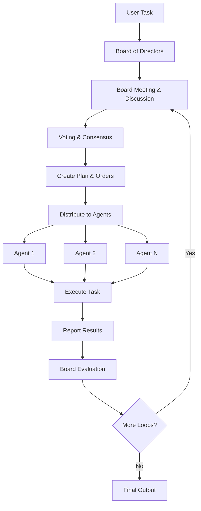
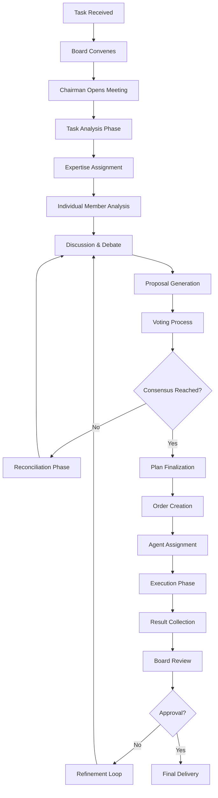
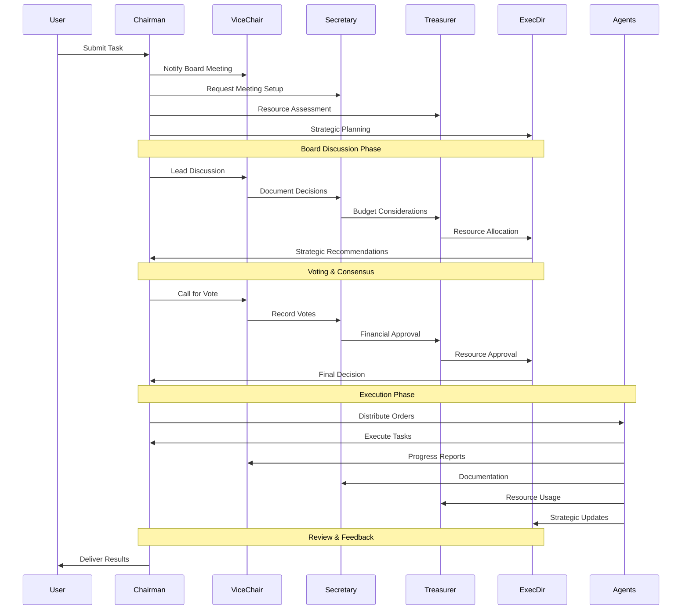
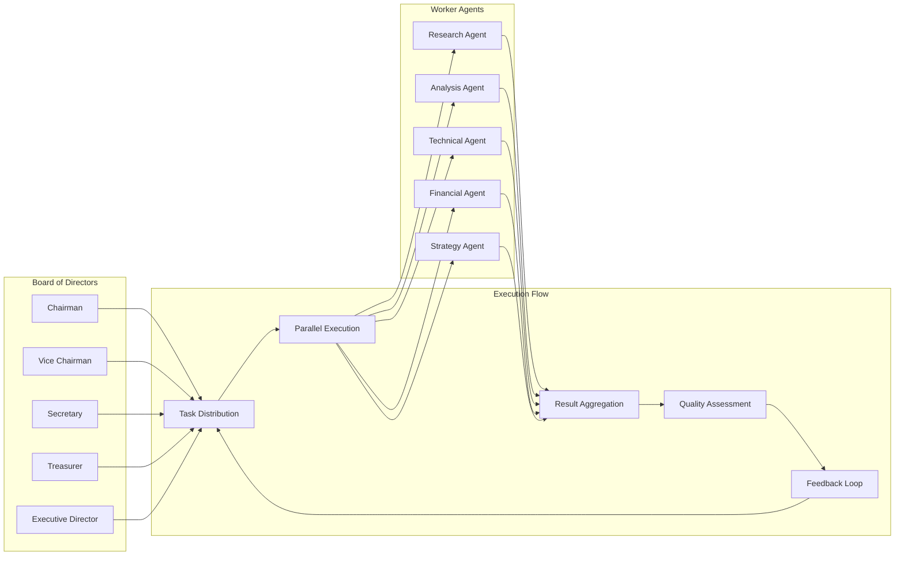

# `BoardOfDirectorsSwarm`

The `BoardOfDirectorsSwarm` is a sophisticated multi-agent orchestration system that implements a collective decision-making approach as an alternative to the single Director pattern. It consists of a board of directors that convenes to discuss, vote, and reach consensus on task distribution and execution strategies.

## Overview

The Board of Directors Swarm follows a democratic workflow pattern that mimics real-world corporate governance structures:

1. **Task Reception**: User provides a task to the swarm
2. **Board Meeting**: Board of Directors convenes to discuss and create a plan
3. **Voting & Consensus**: Board members vote and reach consensus on task distribution
4. **Order Distribution**: Board distributes orders to specialized worker agents
5. **Execution**: Individual agents execute their assigned tasks
6. **Feedback Loop**: Board evaluates results and issues new orders if needed (up to `max_loops`)
7. **Context Preservation**: All conversation history and context is maintained throughout the process

## Architecture

### High-Level Workflow



**Diagram Explanation:**
This diagram illustrates the complete lifecycle of a task through the Board of Directors Swarm system. The workflow begins when a user submits a task, which triggers the board to convene for discussion and planning. The board then votes on the approach and creates detailed execution orders. These orders are distributed to multiple specialized agents who execute their tasks in parallel. Results are collected and evaluated by the board, which can trigger additional refinement loops if needed. The process continues until the board is satisfied with the results or the maximum number of loops is reached.

**Key Technical Points:**
- **Parallel Execution**: Multiple agents can work simultaneously on different aspects of the task
- **Iterative Refinement**: The system supports multiple feedback loops for continuous improvement
- **Centralized Coordination**: The board maintains control over the entire process while delegating execution
- **Result Aggregation**: All agent outputs are collected and evaluated before proceeding

### Detailed Decision-Making Process



**Diagram Explanation:**
This detailed flowchart shows the internal decision-making process within the board. The process begins with task reception and board convening, followed by a structured analysis phase where each board member contributes based on their expertise. The discussion and debate phase allows for thorough consideration of different approaches, leading to proposal generation and voting. If consensus isn't reached, the system enters a reconciliation phase to resolve conflicts. Once consensus is achieved, the plan is finalized and orders are created for agent assignment. The execution phase is followed by result collection and board review, with the option to enter refinement loops if the results don't meet approval criteria.

**Technical Implementation Details:**
- **Expertise Assignment**: Board members are assigned tasks based on their specialized knowledge areas
- **Voting Mechanisms**: Configurable voting weights and decision thresholds ensure fair representation
- **Conflict Resolution**: Built-in reconciliation mechanisms handle disagreements among board members
- **Quality Gates**: Approval checkpoints ensure output quality before final delivery

### Board Member Interaction Flow



**Diagram Explanation:**
This sequence diagram shows the detailed interaction patterns between different board members and agents throughout the entire process. The interaction begins with the Chairman receiving a task from the user and immediately coordinating with other board members. Each board member has specific responsibilities: the Vice Chairman leads discussions, the Secretary documents decisions, the Treasurer handles resource assessment, and the Executive Director provides strategic planning. During the voting phase, each member contributes their expertise and votes are recorded systematically. In the execution phase, the Chairman distributes orders to agents while maintaining communication channels with all board members for progress monitoring and strategic updates.

**Technical Communication Patterns:**
- **Hierarchical Communication**: Chairman serves as the central coordinator
- **Specialized Reporting**: Each agent reports to the appropriate board member based on their role
- **Parallel Coordination**: Multiple board members can work simultaneously on different aspects
- **Feedback Channels**: Continuous communication ensures real-time monitoring and adjustment

### Agent Execution and Feedback Loop



**Diagram Explanation:**
This diagram illustrates the relationship between the Board of Directors and Worker Agents, showing how tasks flow from decision-making to execution and back through feedback loops. The Board of Directors collectively participates in task distribution, ensuring that all perspectives are considered. Worker agents execute tasks in parallel, each specializing in different areas (research, analysis, technical implementation, financial considerations, and strategic planning). Results are aggregated and assessed for quality before determining whether additional feedback loops are needed.

**Technical Architecture Benefits:**
- **Separation of Concerns**: Clear distinction between decision-making (Board) and execution (Agents)
- **Scalability**: Additional agents can be added without changing the board structure
- **Fault Tolerance**: If one agent fails, others can continue working
- **Quality Control**: Centralized assessment ensures consistent output quality

## Technical Implementation

### Core Components

The `BoardOfDirectorsSwarm` consists of several key components:

1. **Board Members**: Specialized agents with specific roles and voting weights
2. **Worker Agents**: Execution agents that perform the actual tasks
3. **Voting System**: Configurable voting mechanisms for decision-making
4. **Communication Protocol**: Structured communication between board members and agents
5. **Feedback Loop Controller**: Manages iterative refinement processes

### Configuration Options

```python
# Example configuration for BoardOfDirectorsSwarm
board_config = {
    "max_loops": 3,                    # Maximum number of refinement loops
    "voting_threshold": 0.7,           # Consensus threshold (70%)
    "enable_voting_weights": True,     # Use weighted voting
    "consensus_method": "majority",    # Voting method: "majority" or "unanimous"
    "board_size": 5,                   # Number of board members
    "enable_feedback_loops": True,     # Enable iterative refinement
    "output_format": "structured",     # Output format: "structured", "text", "json"
    "enable_logging": True,            # Enable detailed logging
    "parallel_execution": True,        # Enable parallel agent execution
    "quality_gates": True,             # Enable quality checkpoints
}
```

### Voting Mechanisms

The system supports multiple voting mechanisms:

1. **Majority Voting**: Simple majority of votes required
2. **Weighted Voting**: Votes weighted by board member importance
3. **Unanimous Consensus**: All board members must agree
4. **Threshold-based**: Configurable percentage of agreement required

```python
# Example voting configuration
voting_config = {
    "method": "weighted_majority",
    "threshold": 0.75,
    "weights": {
        "CHAIRMAN": 1.5,
        "VICE_CHAIRMAN": 1.2,
        "SECRETARY": 1.0,
        "TREASURER": 1.0,
        "EXECUTIVE_DIRECTOR": 1.5
    },
    "tie_breaker": "CHAIRMAN",  # Chairman breaks ties
    "allow_abstention": True,   # Allow board members to abstain
}
```

### Communication Protocols

The system uses structured communication protocols:

1. **Task Distribution Protocol**: Standardized format for distributing tasks to agents
2. **Progress Reporting Protocol**: Regular status updates from agents to board
3. **Decision Communication Protocol**: Clear communication of board decisions
4. **Feedback Protocol**: Structured feedback for iterative improvement

```python
# Example communication message format
message_format = {
    "sender": "CHAIRMAN",
    "recipient": "RESEARCH_AGENT",
    "message_type": "TASK_DISTRIBUTION",
    "content": {
        "task_id": "task_123",
        "task_description": "Research market trends for Q4",
        "deadline": "2024-01-15T10:00:00Z",
        "priority": "HIGH",
        "resources": ["market_data", "analytics_tools"],
        "expected_output": "structured_report"
    },
    "metadata": {
        "timestamp": "2024-01-10T09:00:00Z",
        "session_id": "session_456",
        "board_decision_id": "decision_789"
    }
}
```

## Usage Examples

### Basic Usage

```python
from swarms import BoardOfDirectorsSwarm, Agent

# Create specialized agents
research_agent = Agent(
    name="Research Agent",
    system_prompt="You are a research specialist focused on market analysis and data gathering.",
    llm="gpt-4"
)

analysis_agent = Agent(
    name="Analysis Agent",
    system_prompt="You are an analysis expert who interprets data and provides insights.",
    llm="gpt-4"
)

technical_agent = Agent(
    name="Technical Agent",
    system_prompt="You are a technical specialist who handles implementation and technical details.",
    llm="gpt-4"
)

# Create the Board of Directors Swarm
board_swarm = BoardOfDirectorsSwarm(
    agents=[research_agent, analysis_agent, technical_agent],
    max_loops=3,
    voting_threshold=0.7,
    enable_voting_weights=True
)

# Execute a task
task = "Analyze the current market trends in AI and provide strategic recommendations for our company."
result = board_swarm.run(task)
print(result)
```

### Advanced Configuration

```python
from swarms import BoardOfDirectorsSwarm, Agent
from swarms.structs.board_of_directors import BoardConfig

# Create a custom board configuration
custom_config = BoardConfig(
    max_loops=5,
    voting_threshold=0.8,
    consensus_method="unanimous",
    enable_feedback_loops=True,
    output_format="structured",
    board_roles={
        "CHAIRMAN": {"weight": 1.5, "responsibilities": ["leadership", "final_decision"]},
        "VICE_CHAIRMAN": {"weight": 1.2, "responsibilities": ["operations", "coordination"]},
        "SECRETARY": {"weight": 1.0, "responsibilities": ["documentation", "record_keeping"]},
        "TREASURER": {"weight": 1.0, "responsibilities": ["financial_oversight", "resource_allocation"]},
        "EXECUTIVE_DIRECTOR": {"weight": 1.5, "responsibilities": ["strategic_planning", "execution"]}
    }
)

# Create specialized agents with custom prompts
agents = [
    Agent(
        name="Market Research Agent",
        system_prompt="""You are a market research specialist with expertise in:
        - Competitive analysis
        - Market sizing and segmentation
        - Customer behavior analysis
        - Industry trend identification
        Provide detailed, data-driven insights.""",
        llm="gpt-4"
    ),
    Agent(
        name="Financial Analysis Agent",
        system_prompt="""You are a financial analyst specializing in:
        - Financial modeling and forecasting
        - Risk assessment and mitigation
        - Investment analysis
        - Cost-benefit analysis
        Provide comprehensive financial insights.""",
        llm="gpt-4"
    ),
    Agent(
        name="Technical Strategy Agent",
        system_prompt="""You are a technical strategist focused on:
        - Technology roadmap planning
        - Technical feasibility assessment
        - Implementation strategy
        - Technology risk evaluation
        Provide strategic technical guidance.""",
        llm="gpt-4"
    )
]

# Create the swarm with custom configuration
board_swarm = BoardOfDirectorsSwarm(
    agents=agents,
    config=custom_config
)

# Execute a complex task
complex_task = """
Analyze the feasibility of launching a new AI-powered product in the healthcare sector.
Consider:
1. Market opportunity and competitive landscape
2. Financial viability and investment requirements
3. Technical implementation challenges and timeline
4. Regulatory compliance requirements
5. Risk assessment and mitigation strategies

Provide a comprehensive report with recommendations for next steps.
"""

result = board_swarm.run(complex_task)
print(result)
```

### Real-World Use Cases

#### 1. Strategic Business Planning

```python
# Example: Strategic business planning with multiple stakeholders
business_planning_task = """
Develop a comprehensive 5-year strategic plan for our technology company.
Include:
- Market analysis and competitive positioning
- Product development roadmap
- Financial projections and funding requirements
- Operational scaling strategy
- Risk management framework
- Success metrics and KPIs
"""

# Configure board for strategic planning
strategic_config = BoardConfig(
    max_loops=4,
    voting_threshold=0.8,
    consensus_method="weighted_majority",
    enable_feedback_loops=True,
    output_format="structured"
)

strategic_swarm = BoardOfDirectorsSwarm(
    agents=[market_agent, financial_agent, technical_agent, strategy_agent],
    config=strategic_config
)

strategic_plan = strategic_swarm.run(business_planning_task)
```

#### 2. Product Development Decision Making

```python
# Example: Product development decision making
product_decision_task = """
Evaluate the feasibility of developing a new AI-powered customer service chatbot.
Consider:
- Technical requirements and development timeline
- Market demand and competitive analysis
- Cost-benefit analysis and ROI projections
- Implementation challenges and resource requirements
- Success criteria and measurement metrics

Provide a go/no-go recommendation with detailed rationale.
"""

# Configure board for product decisions
product_config = BoardConfig(
    max_loops=3,
    voting_threshold=0.75,
    consensus_method="majority",
    enable_feedback_loops=True,
    output_format="structured"
)

product_swarm = BoardOfDirectorsSwarm(
    agents=[technical_agent, market_agent, financial_agent],
    config=product_config
)

product_recommendation = product_swarm.run(product_decision_task)
```

#### 3. Crisis Management and Response

```python
# Example: Crisis management and response planning
crisis_task = """
Our company is facing a major data breach. Develop an immediate response plan.
Include:
- Immediate containment and mitigation steps
- Communication strategy for stakeholders
- Legal and regulatory compliance requirements
- Financial impact assessment
- Long-term recovery and prevention measures
- Timeline and resource allocation
"""

# Configure board for crisis management
crisis_config = BoardConfig(
    max_loops=2,  # Faster response needed
    voting_threshold=0.6,  # Lower threshold for urgent decisions
    consensus_method="majority",
    enable_feedback_loops=False,  # No time for multiple iterations
    output_format="structured"
)

crisis_swarm = BoardOfDirectorsSwarm(
    agents=[security_agent, legal_agent, communications_agent, financial_agent],
    config=crisis_config
)

crisis_response = crisis_swarm.run(crisis_task)
```

## Performance Optimization

### Parallel Execution Strategies

The Board of Directors Swarm supports various parallel execution strategies:

1. **Task-Level Parallelism**: Multiple agents work on different aspects simultaneously
2. **Board-Level Parallelism**: Board members can analyze different aspects in parallel
3. **Iteration-Level Parallelism**: Multiple refinement loops can run concurrently

```python
# Example: Optimizing for parallel execution
parallel_config = BoardConfig(
    max_loops=3,
    parallel_execution=True,
    max_concurrent_agents=5,
    enable_async_processing=True,
    timeout_per_agent=300,  # 5 minutes per agent
    enable_agent_pooling=True
)

# Create agent pool for better resource utilization
agent_pool = [
    Agent(name=f"Research_Agent_{i}", system_prompt="...", llm="gpt-4")
    for i in range(3)
] + [
    Agent(name=f"Analysis_Agent_{i}", system_prompt="...", llm="gpt-4")
    for i in range(2)
]

parallel_swarm = BoardOfDirectorsSwarm(
    agents=agent_pool,
    config=parallel_config
)
```

### Quality Control Mechanisms

```python
# Example: Quality control configuration
quality_config = BoardConfig(
    max_loops=3,
    quality_gates=True,
    quality_threshold=0.8,
    enable_peer_review=True,
    review_required=True,
    output_validation=True,
    enable_metrics_tracking=True
)

# Define quality metrics
quality_metrics = {
    "completeness": 0.9,      # 90% completeness required
    "accuracy": 0.85,         # 85% accuracy required
    "relevance": 0.9,         # 90% relevance required
    "clarity": 0.8            # 80% clarity required
}

quality_swarm = BoardOfDirectorsSwarm(
    agents=agents,
    config=quality_config,
    quality_metrics=quality_metrics
)
```

## Monitoring and Debugging

### Logging and Observability

```python
import logging
from swarms import BoardOfDirectorsSwarm

# Configure detailed logging
logging.basicConfig(
    level=logging.DEBUG,
    format='%(asctime)s - %(name)s - %(levelname)s - %(message)s'
)

# Create swarm with logging enabled
logging_swarm = BoardOfDirectorsSwarm(
    agents=agents,
    config=BoardConfig(
        enable_logging=True,
        log_level="DEBUG",
        enable_metrics=True,
        enable_tracing=True
    )
)

# Execute with detailed logging
result = logging_swarm.run(task)
```

### Performance Metrics

```python
# Example: Performance monitoring
from swarms.metrics import SwarmMetrics

# Create metrics collector
metrics = SwarmMetrics()

# Configure swarm with metrics
monitored_swarm = BoardOfDirectorsSwarm(
    agents=agents,
    config=BoardConfig(enable_metrics=True),
    metrics_collector=metrics
)

# Execute and collect metrics
result = monitored_swarm.run(task)

# Analyze performance
performance_report = metrics.generate_report()
print(f"Total execution time: {performance_report['total_time']}")
print(f"Average agent response time: {performance_report['avg_agent_time']}")
print(f"Number of voting rounds: {performance_report['voting_rounds']}")
print(f"Consensus achieved: {performance_report['consensus_achieved']}")
```

## Best Practices

### 1. Agent Design

- **Specialized Expertise**: Design agents with specific, complementary expertise
- **Clear Responsibilities**: Define clear boundaries for each agent's responsibilities
- **Consistent Communication**: Use standardized communication protocols
- **Error Handling**: Implement robust error handling and recovery mechanisms

### 2. Board Configuration

- **Appropriate Voting Thresholds**: Set thresholds based on decision criticality
- **Balanced Voting Weights**: Ensure fair representation while maintaining leadership hierarchy
- **Flexible Consensus Methods**: Choose consensus methods based on decision type
- **Reasonable Loop Limits**: Balance quality with efficiency

### 3. Task Design

- **Clear Objectives**: Define clear, measurable objectives
- **Structured Requirements**: Provide structured, detailed requirements
- **Appropriate Scope**: Ensure tasks are appropriately scoped for the board size
- **Context Provision**: Provide sufficient context for informed decision-making

### 4. Performance Optimization

- **Parallel Execution**: Leverage parallel execution where possible
- **Resource Management**: Monitor and optimize resource usage
- **Quality Gates**: Implement appropriate quality control mechanisms
- **Continuous Monitoring**: Monitor performance and adjust configurations as needed

## Troubleshooting

### Common Issues and Solutions

1. **Consensus Not Reached**
   - **Issue**: Board cannot reach consensus within loop limit
   - **Solution**: Lower voting threshold, increase max_loops, or adjust voting weights

2. **Agent Timeout**
   - **Issue**: Individual agents take too long to respond
   - **Solution**: Increase timeout settings or optimize agent prompts

3. **Poor Quality Output**
   - **Issue**: Final output doesn't meet quality standards
   - **Solution**: Enable quality gates, increase max_loops, or improve agent prompts

4. **Resource Exhaustion**
   - **Issue**: System runs out of resources during execution
   - **Solution**: Implement resource limits, use agent pooling, or optimize parallel execution

### Debugging Techniques

```python
# Example: Debugging configuration
debug_config = BoardConfig(
    max_loops=1,  # Limit loops for debugging
    enable_logging=True,
    log_level="DEBUG",
    enable_tracing=True,
    debug_mode=True
)

# Create debug swarm
debug_swarm = BoardOfDirectorsSwarm(
    agents=agents,
    config=debug_config
)

# Execute with debugging
try:
    result = debug_swarm.run(task)
except Exception as e:
    print(f"Error: {e}")
    print(f"Debug info: {debug_swarm.get_debug_info()}")
``` 