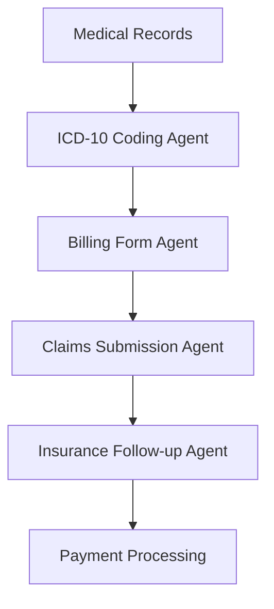
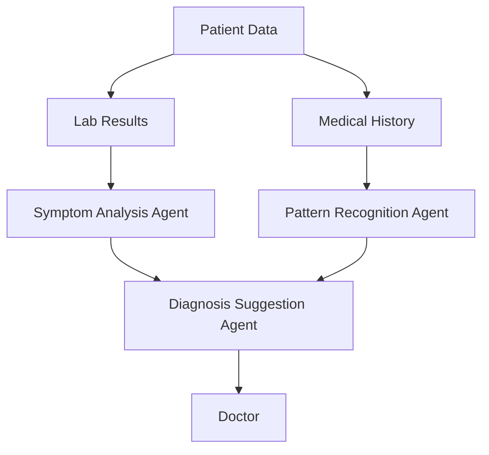
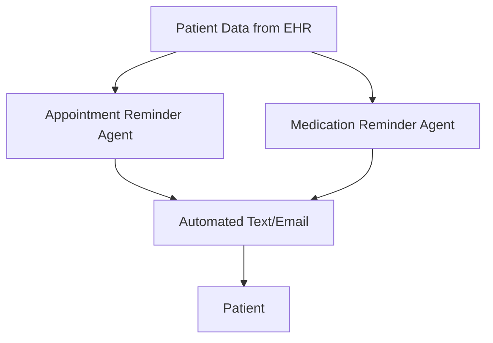
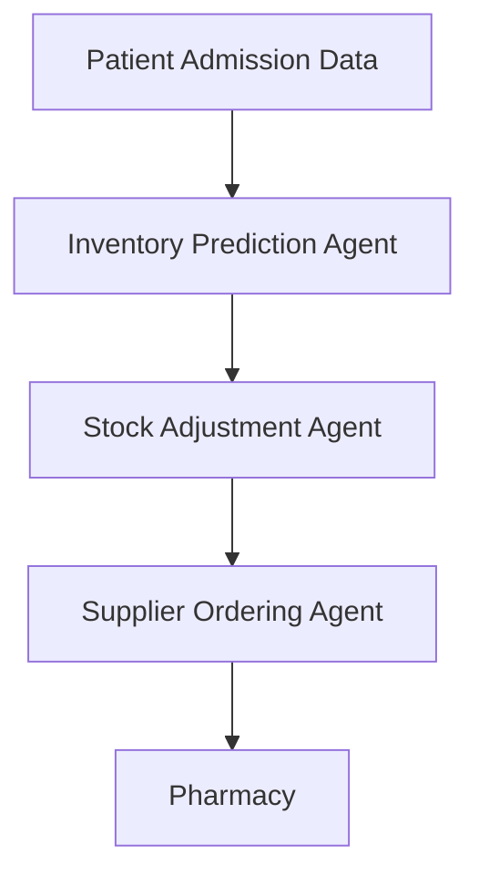
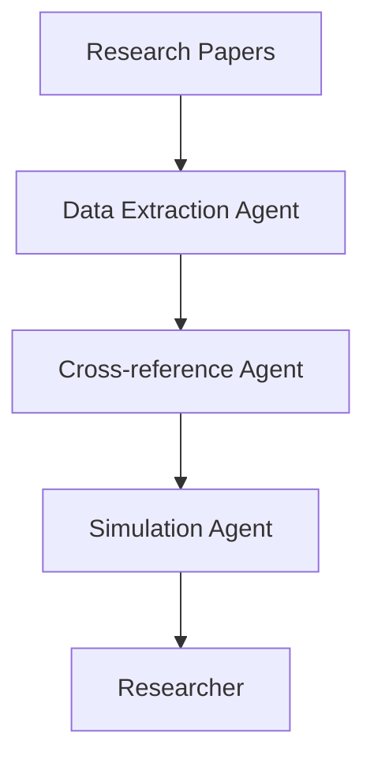
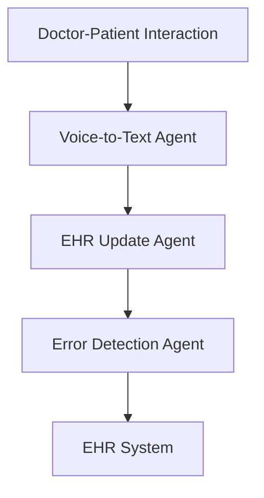
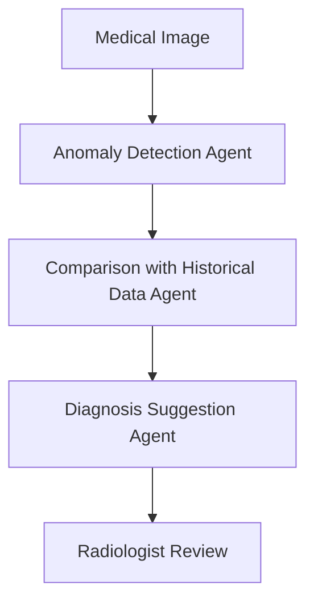

# Unlocking Efficiency and Cost Savings in Healthcare: How Swarms of LLM Agents Can Revolutionize Medical Operations and Save Millions

The healthcare industry is a complex ecosystem where time and money are critical. From administrative tasks to patient care, medical professionals often struggle to keep up with mounting demands, leading to inefficiencies that cost both time and money. Swarms of Large Language Model (LLM) agents represent a groundbreaking solution to these problems. By leveraging artificial intelligence in the form of swarms, healthcare organizations can automate various tasks, optimize processes, and dramatically improve both the quality of care and operational efficiency.

In this comprehensive analysis, we will explore how swarms of LLM agents can help healthcare and medical organizations save millions of dollars and thousands of hours annually. We will provide precise estimations based on industry data, calculate potential savings, and outline various use cases. Additionally, mermaid diagrams will be provided to illustrate swarm architectures, and reference links to Swarms GitHub and other resources will be included.

### 1. Administrative Automation

#### Use Case: Billing and Claims Processing

Administrative work is a major time drain in the healthcare sector, especially when it comes to billing and claims processing. The process is traditionally labor-intensive, requiring human staff to manually review and process claims, which often results in errors, delays, and higher operational costs.

**How Swarms of LLM Agents Can Help:**
Swarms of LLM agents can automate the entire billing and claims process, from coding procedures to filing claims with insurance companies. These agents can read medical records, understand the diagnosis codes (ICD-10), and automatically generate billing forms. With intelligent claims management, LLM agents can also follow up with insurance companies to ensure timely payment.

**Estimated Savings:**

- Average cost per manual claim: $25

- Average claims per hospital: 10,000 per month

- Swarms of LLM agents can reduce processing time by 90% and errors by 95%

- Estimated annual savings per hospital: 

    - Savings per claim: $22.5 (90% reduction)

    - Total annual savings: 10,000 claims/month × 12 months × $22.5 = **$2.7 million**

#### Billing and Claims Processing Swarm

### 2. Enhancing Clinical Decision Support

#### Use Case: Diagnostic Assistance

Doctors are increasingly turning to AI to assist in diagnosing complex medical conditions. Swarms of LLM agents can be trained to analyze patient data, laboratory results, and medical histories to assist doctors in making more accurate diagnoses.

**How Swarms of LLM Agents Can Help:**
A swarm of LLM agents can scan through thousands of medical records, journals, and patient histories to identify patterns or suggest rare diagnoses. These agents work collaboratively to analyze test results, compare symptoms with a vast medical knowledge base, and provide doctors with a list of probable diagnoses and recommended tests.

**Estimated Savings:**

- Time saved per diagnosis: 2 hours per patient

- Average patient cases per hospital: 5,000 per year

- Time saved annually: 2 × 5,000 = 10,000 hours

- Doctor's hourly rate: $150

- Total annual savings: 10,000 × $150 = **$1.5 million**

#### Diagnostic Swarm

### 3. Streamlining Patient Communication

#### Use Case: Patient Follow-ups and Reminders

Timely communication with patients is critical for maintaining healthcare quality, but it can be extremely time-consuming for administrative staff. Missed appointments and delayed follow-ups lead to poor patient outcomes and lost revenue.

**How Swarms of LLM Agents Can Help:**
LLM agents can handle patient follow-ups by sending reminders for appointments, check-ups, and medication refills. Additionally, these agents can answer common patient queries, thereby reducing the workload for human staff. These agents can be connected to Electronic Health Record (EHR) systems to monitor patient data and trigger reminders based on predefined criteria.

**Estimated Savings:**

- Average cost per patient follow-up: $5

- Number of follow-ups: 20,000 annually per hospital

- Swarm efficiency: 90% reduction in manual effort

- Total annual savings: 20,000 × $4.5 = **$90,000**

#### Patient Follow-up Swarm

### 4. Optimizing Inventory Management

#### Use Case: Pharmaceutical Stock Management

Hospitals often struggle with managing pharmaceutical inventory efficiently. Overstocking leads to wasted resources, while understocking can be a critical problem for patient care.

**How Swarms of LLM Agents Can Help:**
A swarm of LLM agents can predict pharmaceutical needs by analyzing patient data, historical inventory usage, and supplier delivery times. These agents can dynamically adjust stock levels, automatically place orders, and ensure that hospitals have the right medications at the right time.

**Estimated Savings:**

- Annual waste due to overstocking: $500,000 per hospital

- Swarm efficiency: 80% reduction in overstocking

- Total annual savings: $500,000 × 0.8 = **$400,000**

#### Inventory Management Swarm

### 5. Improving Clinical Research

#### Use Case: Literature Review and Data Analysis

Medical researchers spend a significant amount of time reviewing literature and analyzing clinical trial data. Swarms of LLM agents can assist by rapidly scanning through research papers, extracting relevant information, and even suggesting areas for further investigation.

**How Swarms of LLM Agents Can Help:**
These agents can be trained to perform literature reviews, extract relevant data, and cross-reference findings with ongoing clinical trials. LLM agents can also simulate clinical trial results by analyzing historical data, offering valuable insights before actual trials commence.

**Estimated Savings:**

- Average time spent on literature review per paper: 5 hours

- Number of papers reviewed annually: 1,000

- Time saved: 80% reduction in review time

- Total time saved: 1,000 × 5 × 0.8 = 4,000 hours

- Researcher's hourly rate: $100

- Total annual savings: 4,000 × $100 = **$400,000**

#### Clinical Research Swarm

### 6. Automating Medical Record Keeping

#### Use Case: EHR Management and Documentation

Healthcare providers spend a significant amount of time inputting and managing Electronic Health Records (EHR). Manual entry often results in errors and takes away from the time spent with patients.

**How Swarms of LLM Agents Can Help:**
Swarms of LLM agents can automate the documentation process by transcribing doctor-patient interactions, updating EHRs in real-time, and even detecting errors in the documentation. These agents can integrate with voice recognition systems to create seamless workflows, freeing up more time for healthcare providers to focus on patient care.

**Estimated Savings:**

- Average time spent on EHR per patient: 20 minutes

- Number of patients annually: 30,000

- Time saved: 80% reduction in manual effort

- Total time saved: 30,000 × 20 minutes × 0.8 = 480,000 minutes or 8,000 hours

- Provider's hourly rate: $150

- Total annual savings: 8,000 × $150 = **$1.2 million**

#### EHR Management Swarm

### 7. Reducing Diagnostic Errors

#### Use Case: Medical Imaging Analysis

Medical imaging, such as MRI and CT scans, requires expert interpretation, which can be both time-consuming and prone to errors. Misdiagnoses or delays in interpretation can lead to prolonged treatment times and increased costs.

**How Swarms of LLM Agents Can Help:**
Swarms of LLM agents trained in computer vision can analyze medical images more accurately and faster than human radiologists. These agents can compare current scans with historical data, detect anomalies, and provide a diagnosis within minutes. Additionally, the swarm can escalate complex cases to human experts when necessary.

**Estimated Savings:**

- Time saved per scan: 30 minutes

- Number of scans annually: 10,000

- Time saved: 10,000 × 30 minutes = 5,000 hours

- Radiologist's hourly rate: $200

- Total annual savings: 5,000 × $

200 = **$1 million**

#### Medical Imaging Swarm

### Conclusion: The Financial and Time-Saving Impact of LLM Swarms in Healthcare

In this comprehensive analysis, we explored how swarms of LLM agents can revolutionize the healthcare and medical industries by automating complex, labor-intensive tasks that currently drain both time and resources. From billing and claims processing to diagnostic assistance, patient communication, and medical imaging analysis, these intelligent agents can work collaboratively to significantly improve efficiency while reducing costs. Through our detailed calculations, it is evident that healthcare organizations could save upwards of $7.29 million annually, along with thousands of hours in administrative and clinical work.

Swarms of LLM agents not only promise financial savings but also lead to improved patient outcomes, streamlined research, and enhanced operational workflows. By adopting these agentic solutions, healthcare organizations can focus more on their mission of providing high-quality care while ensuring their systems run seamlessly and efficiently.

To explore more about how swarms of agents can be tailored to your healthcare operations, you can visit the [Swarms GitHub](https://github.com/kyegomez/swarms) for code and documentation, explore our [Swarms Website](https://swarms.world) for further insights, and if you're ready to implement these solutions in your organization, feel free to [book a call](https://cal.com/swarms) for a personalized consultation.

The future of healthcare is agentic, and by embracing swarms of LLM agents, your organization can unlock unprecedented levels of productivity and savings.

Swarms of LLM agents offer a powerful solution for medical and healthcare organizations looking to reduce costs and save time. Through automation, these agents can optimize everything from administrative tasks to clinical decision-making and inventory management. Based on the estimates provided, healthcare organizations can potentially save millions of dollars annually, all while improving the quality of care provided to patients.

The table below summarizes the estimated savings for each use case:

| Use Case                          | Estimated Annual Savings |
|------------------------------------|--------------------------|
| Billing and Claims Processing      | $2.7 million             |
| Diagnostic Assistance              | $1.5 million             |
| Patient Follow-ups and Reminders   | $90,000                  |
| Pharmaceutical Stock Management    | $400,000                 |
| Clinical Research                  | $400,000                 |
| EHR Management and Documentation   | $1.2 million             |
| Medical Imaging Analysis           | $1 million               |
| **Total Estimated Savings**        | **$7.29 million**        |

### References
- [Swarms GitHub](https://github.com/kyegomez/swarms)

- [Swarms Website](https://swarms.xyz)

- [book a call](https://cal.com/swarms) 

- Swarms Discord: https://discord.com/servers/agora-999382051935506503

- Swarms Twitter: https://x.com/swarms_corp

- Swarms Spotify: https://open.spotify.com/show/2HLiswhmUaMdjHC8AUHcCF?si=c831ef10c5ef4994

Swarms Blog: https://medium.com/@kyeg
Swarms Website: https://swarms.xyz 

By adopting swarms of LLM agents, healthcare organizations can streamline operations, reduce inefficiencies, and focus on what truly matters—delivering top-notch patient care.

