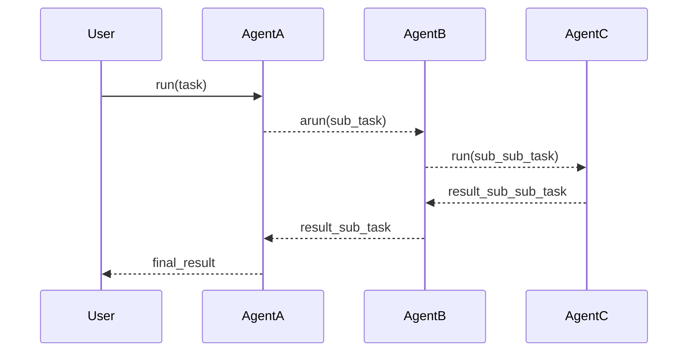
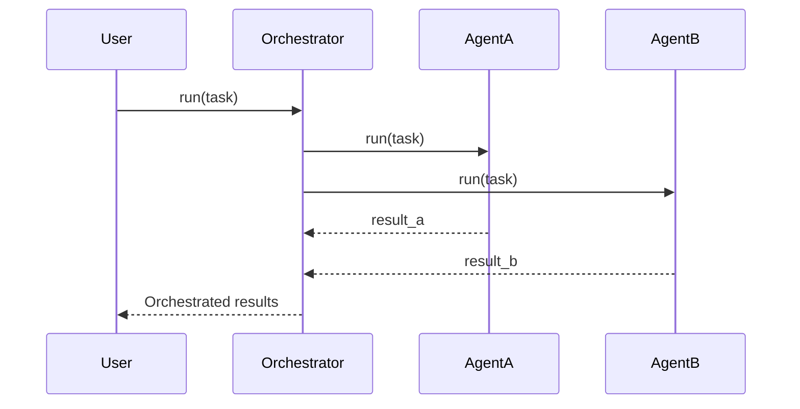

# Our Philosophy: Simplifying Multi-Agent Collaboration Through Readable Code and Performance Optimization

Our mission is to streamline multi-agent collaboration by emphasizing simplicity, readability, and performance in our codebase. This document outlines our core tactics:

- **Readable Code with Type Annotations, Documentation, and Logging**
- **Bleeding-Edge Performance via Concurrency and Parallelism**
- **Simplified Abstractions for Multi-Agent Collaboration**

By adhering to these principles, we aim to make our systems more maintainable, scalable, and efficient, facilitating easier integration and collaboration among developers and agents alike.

---

## 1. Emphasizing Readable Code

Readable code is the cornerstone of maintainable and scalable systems. It ensures that developers can easily understand, modify, and extend the codebase.

### 1.1 Use of Type Annotations

Type annotations enhance code readability and catch errors early in the development process.

```python
def process_data(data: List[str]) -> Dict[str, int]:
    result = {}
    for item in data:
        result[item] = len(item)
    return result
```

### 1.2 Code Style Guidelines

Adhering to consistent code style guidelines, such as PEP 8 for Python, ensures uniformity across the codebase.

- **Indentation:** Use 4 spaces per indentation level.
- **Variable Naming:** Use `snake_case` for variables and functions.
- **Class Naming:** Use `PascalCase` for class names.

### 1.3 Importance of Documentation

Comprehensive documentation helps new developers understand the purpose and functionality of code modules.

```python
def fetch_user_profile(user_id: str) -> UserProfile:
    """
    Fetches the user profile from the database.

    Args:
        user_id (str): The unique identifier of the user.

    Returns:
        UserProfile: An object containing user profile data.
    """
    # Function implementation
```

### 1.4 Consistent Naming Conventions

Consistent naming reduces confusion and makes the code self-explanatory.

- **Functions:** Should be verbs (e.g., `calculate_total`).
- **Variables:** Should be nouns (e.g., `total_amount`).
- **Constants:** Should be uppercase (e.g., `MAX_RETRIES`).

---

## 2. Effective Logging Practices

Logging is essential for debugging and monitoring the health of applications.

### 2.1 Why Logging is Important

- **Debugging:** Helps identify issues during development and after deployment.
- **Monitoring:** Provides insights into the system's behavior in real-time.
- **Audit Trails:** Keeps a record of events for compliance and analysis.

### 2.2 Best Practices for Logging

- **Use Appropriate Log Levels:** DEBUG, INFO, WARNING, ERROR, CRITICAL.
- **Consistent Log Formatting:** Include timestamps, log levels, and messages.
- **Avoid Sensitive Information:** Do not log passwords or personal data.

### 2.3 Logging Examples

```python
import logging

logging.basicConfig(level=logging.INFO, format='%(asctime)s %(levelname)s:%(message)s')

def connect_to_service(url: str) -> bool:
    logging.debug(f"Attempting to connect to {url}")
    try:
        # Connection logic
        logging.info(f"Successfully connected to {url}")
        return True
    except ConnectionError as e:
        logging.error(f"Connection failed to {url}: {e}")
        return False
```

---

## 3. Achieving Bleeding-Edge Performance

Performance is critical, especially when dealing with multiple agents and large datasets.

### 3.1 Concurrency and Parallelism

Utilizing concurrency and parallelism can significantly improve performance.

- **Concurrency:** Dealing with multiple tasks by managing multiple threads.
- **Parallelism:** Executing multiple tasks simultaneously on multiple CPU cores.

### 3.2 Asynchronous Programming

Asynchronous programming allows for non-blocking operations, leading to better resource utilization.

```python
import asyncio

async def fetch_data(endpoint: str) -> dict:
    async with aiohttp.ClientSession() as session:
        async with session.get(endpoint) as response:
            return await response.json()

async def main():
    endpoints = ['https://api.example.com/data1', 'https://api.example.com/data2']
    tasks = [fetch_data(url) for url in endpoints]
    results = await asyncio.gather(*tasks)
    print(results)

asyncio.run(main())
```

### 3.3 Utilizing Modern Hardware Capabilities

Leverage multi-core processors and GPUs for computationally intensive tasks.

- **Multi-threading:** Use threads for I/O-bound tasks.
- **Multi-processing:** Use processes for CPU-bound tasks.
- **GPU Acceleration:** Utilize GPUs for tasks like machine learning model training.

### 3.4 Code Example: Parallel Processing

```python
from concurrent.futures import ThreadPoolExecutor

def process_item(item):
    # Processing logic
    return result

items = [1, 2, 3, 4, 5]
with ThreadPoolExecutor(max_workers=5) as executor:
    results = list(executor.map(process_item, items))
```

---

## 4. Simplifying Multi-Agent Collaboration

Simplifying the abstraction of multi-agent collaboration makes it accessible and manageable.

### 4.1 Importance of Simple Abstractions

- **Ease of Use:** Simple interfaces make it easier for developers to integrate agents.
- **Maintainability:** Reduces complexity, making the codebase easier to maintain.
- **Scalability:** Simple abstractions can be extended without significant overhauls.

### 4.2 Standardizing Agent Interfaces

Every agent should adhere to a standard interface for consistency.

#### 4.2.1 Agent Base Class

```python
from abc import ABC, abstractmethod

class BaseAgent(ABC):
    @abstractmethod
    def run(self, task: str) -> Any:
        pass

    def __call__(self, task: str) -> Any:
        return self.run(task)

    @abstractmethod
    async def arun(self, task: str) -> Any:
        pass
```

#### 4.2.2 Example Agent Implementation

```python
class DataProcessingAgent(BaseAgent):
    def run(self, task: str) -> str:
        # Synchronous processing logic
        return f"Processed {task}"

    async def arun(self, task: str) -> str:
        # Asynchronous processing logic
        return f"Processed {task} asynchronously"
```

#### 4.2.3 Usage Example

```python
agent = DataProcessingAgent()

# Synchronous call
result = agent.run("data_task")
print(result)  # Output: Processed data_task

# Asynchronous call
async def main():
    result = await agent.arun("data_task")
    print(result)  # Output: Processed data_task asynchronously

asyncio.run(main())
```

### 4.3 Mermaid Diagram: Agent Interaction



*Agents collaborating to fulfill a user's task.*

### 4.4 Simplified Collaboration Workflow

```mermaid
graph TD
    UserRequest[User Request] --> Agent1[Agent 1]
    Agent1 -->|run(task)| Agent2[Agent 2]
    Agent2 -->|arun(task)| Agent3[Agent 3]
    Agent3 -->|result| Agent2
    Agent2 -->|result| Agent1
    Agent1 -->|result| UserResponse[User Response]
```

*Workflow demonstrating how agents process a task collaboratively.*

---

## 5. Bringing It All Together

By integrating these principles, we create a cohesive system where agents can efficiently collaborate while maintaining code quality and performance.

### 5.1 Example: Multi-Agent System

#### 5.1.1 Agent Definitions

```python
class AgentA(BaseAgent):
    def run(self, task: str) -> str:
        # Agent A processing
        return f"AgentA processed {task}"

    async def arun(self, task: str) -> str:
        # Agent A asynchronous processing
        return f"AgentA processed {task} asynchronously"

class AgentB(BaseAgent):
    def run(self, task: str) -> str:
        # Agent B processing
        return f"AgentB processed {task}"

    async def arun(self, task: str) -> str:
        # Agent B asynchronous processing
        return f"AgentB processed {task} asynchronously"
```

#### 5.1.2 Orchestrator Agent

```python
class OrchestratorAgent(BaseAgent):
    def __init__(self):
        self.agent_a = AgentA()
        self.agent_b = AgentB()

    def run(self, task: str) -> str:
        result_a = self.agent_a.run(task)
        result_b = self.agent_b.run(task)
        return f"Orchestrated results: {result_a} & {result_b}"

    async def arun(self, task: str) -> str:
        result_a = await self.agent_a.arun(task)
        result_b = await self.agent_b.arun(task)
        return f"Orchestrated results: {result_a} & {result_b}"
```

#### 5.1.3 Execution

```python
orchestrator = OrchestratorAgent()

# Synchronous execution
result = orchestrator.run("task1")
print(result)
# Output: Orchestrated results: AgentA processed task1 & AgentB processed task1

# Asynchronous execution
async def main():
    result = await orchestrator.arun("task1")
    print(result)
    # Output: Orchestrated results: AgentA processed task1 asynchronously & AgentB processed task1 asynchronously

asyncio.run(main())
```

### 5.2 Mermaid Diagram: Orchestrator Workflow



*Orchestrator coordinating between Agent A and Agent B.*

---

## 6. Conclusion

Our philosophy centers around making multi-agent collaboration as simple and efficient as possible by:

- **Writing Readable Code:** Through type annotations, consistent styling, and thorough documentation.
- **Implementing Effective Logging:** To aid in debugging and monitoring.
- **Optimizing Performance:** Leveraging concurrency, parallelism, and modern hardware capabilities.
- **Simplifying Abstractions:** Standardizing agent interfaces to `run`, `__call__`, and `arun` methods.

By adhering to these principles, we create a robust foundation for scalable and maintainable systems that can adapt to evolving technological landscapes.

