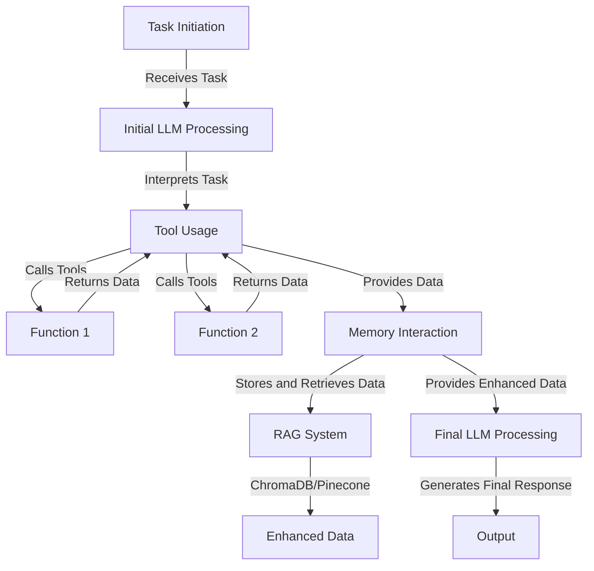

# An Analysis of Agents

In the Swarms framework, agents are designed to perform tasks autonomously by leveraging large language models (LLMs), various tools, and long-term memory systems. This guide provides an extensive conceptual walkthrough of how an agent operates, detailing the sequence of actions it takes to complete a task and how it utilizes its internal components.

#### Agent Components Overview
- **LLM (Large Language Model)**: The core component responsible for understanding and generating natural language.
- **Tools**: External functions and services that the agent can call to perform specific tasks, such as querying databases or interacting with APIs.
- **Long-term Memory**: Systems like ChromaDB or Pinecone that store and retrieve information over extended periods, enabling the agent to remember past interactions and contexts.

#### Agent Workflow
The workflow of an agent can be divided into several stages: task initiation, initial LLM processing, tool usage, memory interaction, and final LLM processing.

##### Stage 1: Task Initiation
- **Input**: The task or query that the agent needs to address.
- **Output**: A structured plan or approach for handling the task.

##### Stage 2: Initial LLM Processing
- **Input**: The task or query.
- **Process**: The LLM interprets the task, understanding the context and requirements.
- **Output**: An initial response or action plan.

##### Stage 3: Tool Usage
- **Input**: The action plan or specific sub-tasks identified by the LLM.
- **Process**: The agent calls various tools to gather information, perform calculations, or interact with external systems.
  - **Function Calling as Tools**: Tools are called as functions with specific inputs and outputs, enabling the agent to perform a wide range of tasks.
- **Output**: Data or results from the tools.

##### Stage 4: Memory Interaction
- **Input**: Intermediate results and context from the tools.
- **Process**: The agent interacts with long-term memory systems to store new information and retrieve relevant past data.
  - **RAG Systems (ChromaDB, Pinecone)**: These systems are used to enhance the agent’s responses by providing relevant historical data and context.
- **Output**: Enhanced context and data for final processing.

##### Stage 5: Final LLM Processing
- **Input**: Comprehensive data and context from the tools and memory systems.
- **Process**: The LLM generates the final response or completes the task using the enriched data.
- **Output**: The final output or action taken by the agent.

### Detailed Workflow with Mermaid Diagrams

#### Agent Components and Workflow

### Explanation of Each Stage

#### Stage 1: Task Initiation
- **Task**: The agent receives a task or query from an external source (e.g., a user query, a system trigger).
- **Objective**: To understand what needs to be done and prepare an initial approach.

#### Stage 2: Initial LLM Processing
- **Interpretation**: The LLM processes the task to comprehend its context and requirements.
- **Planning**: The LLM generates an initial plan or identifies the sub-tasks required to complete the task.

#### Stage 3: Tool Usage
- **Function Calls**: The agent uses predefined functions (tools) to perform specific actions, such as querying a database or making API calls.
- **Tool Integration**: Each tool is called with specific parameters, and the results are collected for further processing.

#### Stage 4: Memory Interaction
- **Long-term Memory**: Systems like ChromaDB and Pinecone store and retrieve long-term data, providing the agent with historical context and past interactions.
- **Retrieval-Augmented Generation (RAG)**: The agent uses RAG systems to enhance the current context with relevant past data, improving the quality and relevance of the final output.

#### Stage 5: Final LLM Processing
- **Enhanced Processing**: The LLM processes the enriched data and context provided by the tools and memory systems.
- **Final Output**: The LLM generates a comprehensive response or completes the task using the enhanced information.

### Conclusion

The Swarms framework's agents are powerful units that combine LLMs, tools, and long-term memory systems to perform complex tasks efficiently. By leveraging function calling for tools and RAG systems like ChromaDB and Pinecone, agents can enhance their capabilities and deliver highly relevant and accurate results. This conceptual guide and walkthrough provide a detailed understanding of how agents operate within the Swarms framework, enabling the development of sophisticated and collaborative AI systems.