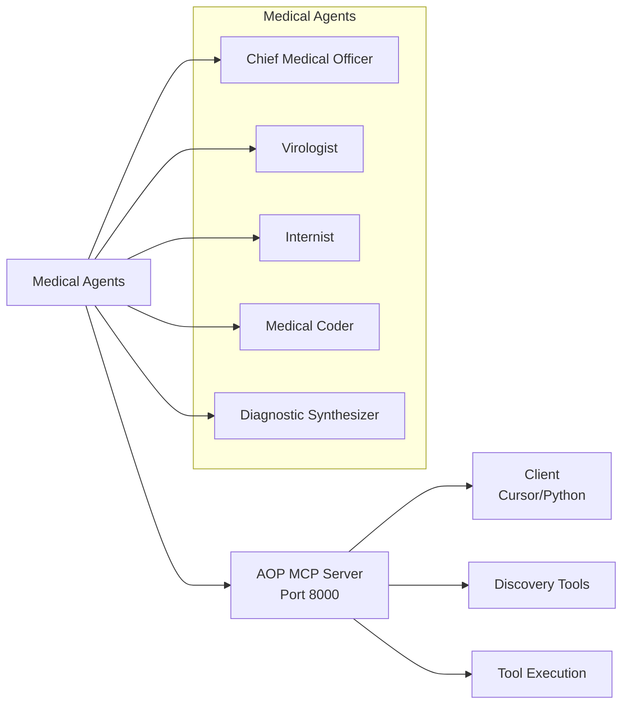

# Medical AOP Example

A real-world demonstration of the Agent Orchestration Protocol (AOP) using medical agents deployed as MCP tools.

## Overview

This example showcases how to:
- Deploy multiple medical agents as MCP tools via AOP
- Use discovery tools for dynamic agent collaboration
- Execute real tool calls with structured schemas
- Integrate with keyless APIs for enhanced context

## Architecture



### Medical Agents
- **Chief Medical Officer**: Coordination, diagnosis, triage
- **Virologist**: Viral disease analysis and ICD-10 coding
- **Internist**: Internal medicine evaluation and HCC tagging
- **Medical Coder**: ICD-10 code assignment and compliance
- **Diagnostic Synthesizer**: Final report synthesis with confidence levels

## Files

| File | Description |
|------|-------------|
| `medical_aop/server.py` | AOP server exposing medical agents as MCP tools |
| `medical_aop/client.py` | Discovery client with real tool execution |
| `README.md` | This documentation |

## Usage

### 1. Start the AOP Server
```bash
python -m examples.aop_examples.medical_aop.server
```

### 2. Configure Cursor MCP Integration

Add to `~/.cursor/mcp.json`:

```json
{
  "mcpServers": {
    "Medical AOP": {
      "type": "http",
      "url": "http://localhost:8000/mcp"
    }
  }
}
```

### 3. Use in Cursor

Enable "Medical AOP" in Cursor's MCP settings, then:

#### Discover agents:
```
Call tool discover_agents with: {}
```

#### Execute medical coding:
```
Call tool Medical Coder with: {"task":"Patient: 45M, egfr 59 ml/min/1.73; non-African American. Provide ICD-10 suggestions and coding notes.","priority":"normal","include_images":false}
```

#### Review infection control:
```
Call tool Chief Medical Officer with: {"task":"Review current hospital infection control protocols in light of recent MRSA outbreak in ICU. Provide executive summary, policy adjustment recommendations, and estimated implementation costs.","priority":"high"}
```

### 4. Run Python Client
```bash
python -m examples.aop_examples.medical_aop.client
```

## Features

### Structured Schemas
- Custom input/output schemas with validation
- Priority levels (low/normal/high)
- Image processing support
- Confidence scoring

### Discovery Tools
| Tool | Description |
|------|-------------|
| `discover_agents` | List all available agents |
| `get_agent_details` | Detailed agent information |
| `search_agents` | Keyword-based agent search |
| `list_agents` | Simple agent name list |

### Real-world Integration
- Keyless API integration (disease.sh for epidemiology data)
- Structured medical coding workflows
- Executive-level policy recommendations
- Cost estimation and implementation timelines

## Response Format

All tools return consistent JSON:
```json
{
  "result": "Agent response text",
  "success": true,
  "error": null,
  "confidence": 0.95,
  "codes": ["N18.3", "Z51.11"]
}
```

## Configuration

### Server Settings
| Setting | Value |
|---------|-------|
| Port | 8000 |
| Transport | streamable-http |
| Timeouts | 40-50 seconds per agent |
| Logging | INFO level with traceback enabled |

### Agent Metadata
Each agent includes:
- Tags for categorization
- Capabilities for matching
- Role classification
- Model configuration

## Best Practices

1. **Use structured inputs**: Leverage the custom schemas for better results
2. **Chain agents**: Pass results between agents for comprehensive analysis
3. **Monitor timeouts**: Adjust based on task complexity
4. **Validate responses**: Check the `success` field in all responses
5. **Use discovery**: Query available agents before hardcoding tool names

## Troubleshooting

| Issue | Solution |
|-------|----------|
| Connection refused | Ensure server is running on port 8000 |
| Tool not found | Use `discover_agents` to verify available tools |
| Timeout errors | Increase timeout values for complex tasks |
| Schema validation | Ensure input matches the defined JSON schema |

## References

- [AOP Reference](https://docs.swarms.world/en/latest/swarms/structs/aop/)
- [MCP Integration](https://docs.swarms.ai/examples/mcp-integration)
- [Protocol Overview](https://docs.swarms.world/en/latest/protocol/overview/)
