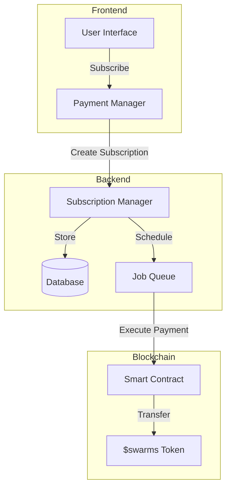
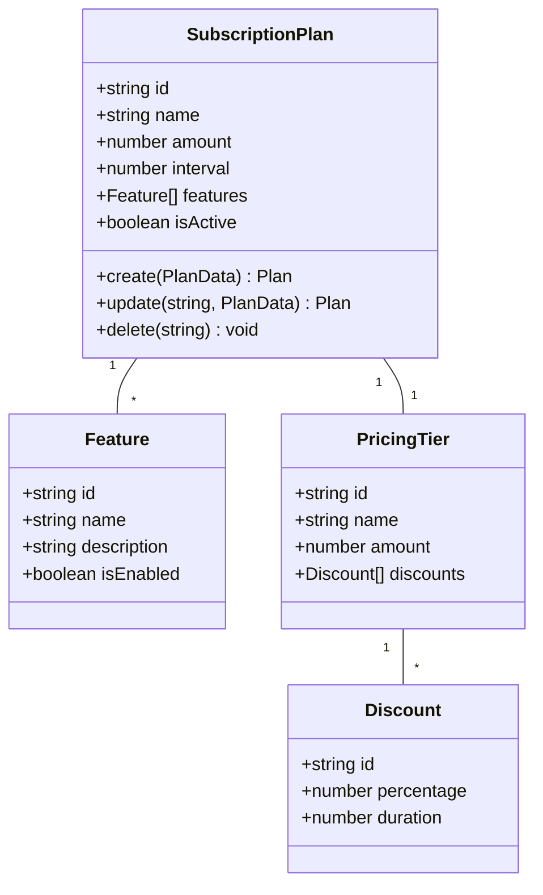
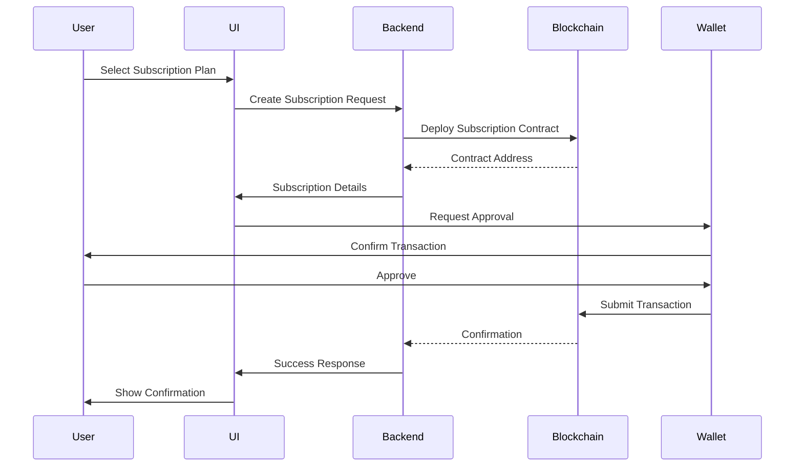
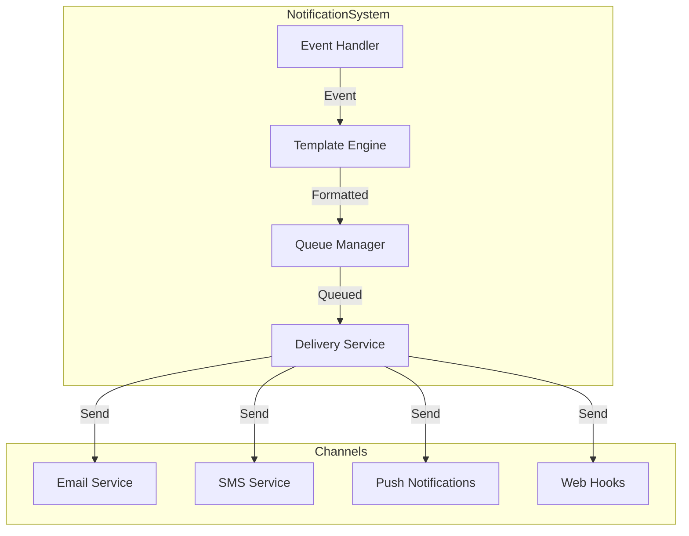
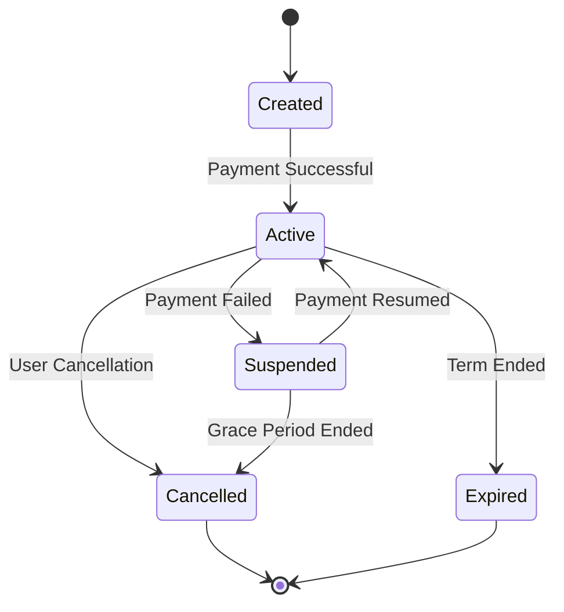
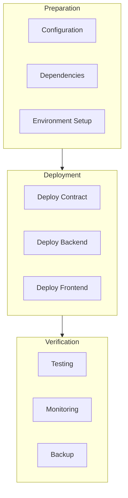

# $swarms Token Subscription Payment System

## Overview
This documentation covers the implementation of subscription-based payments using $swarms tokens on the Solana blockchain.

## System Architecture



## Core Components

### 1. Subscription Smart Contract

```typescript
import { Program, web3 } from '@project-serum/anchor';
import { PublicKey, SystemProgram } from '@solana/web3.js';

interface SubscriptionAccount {
    subscriber: PublicKey;
    merchant: PublicKey;
    amount: number;
    interval: number;
    nextPaymentDate: number;
    active: boolean;
}

class SubscriptionContract {
    program: Program;
    
    constructor(program: Program) {
        this.program = program;
    }
    
    async createSubscription(
        subscriber: PublicKey,
        merchant: PublicKey,
        amount: number,
        interval: number
    ): Promise<string> {
        const subscription = web3.Keypair.generate();
        const currentTimestamp = Math.floor(Date.now() / 1000);
        
        await this.program.rpc.createSubscription(
            new BN(amount),
            new BN(interval),
            new BN(currentTimestamp + interval),
            {
                accounts: {
                    subscription: subscription.publicKey,
                    subscriber,
                    merchant,
                    systemProgram: SystemProgram.programId,
                },
                signers: [subscription],
            }
        );
        
        return subscription.publicKey.toString();
    }
    
    async processPayment(subscriptionAddress: string): Promise<string> {
        const subscription = await this.program.account.subscription.fetch(
            new PublicKey(subscriptionAddress)
        );
        
        // Transfer tokens
        const signature = await this.transferTokens(
            subscription.subscriber,
            subscription.merchant,
            subscription.amount
        );
        
        // Update next payment date
        await this.updateNextPaymentDate(
            subscriptionAddress,
            subscription.nextPaymentDate + subscription.interval
        );
        
        return signature;
    }
}
```

### 2. Subscription Manager Service

```typescript
class SubscriptionManager {
    private contract: SubscriptionContract;
    private db: Database;
    private queue: Queue;
    
    constructor(
        contract: SubscriptionContract,
        db: Database,
        queue: Queue
    ) {
        this.contract = contract;
        this.db = db;
        this.queue = queue;
    }
    
    async createSubscription(
        subscriberAddress: string,
        merchantAddress: string,
        amount: number,
        interval: number,
        planDetails: SubscriptionPlan
    ): Promise<SubscriptionResponse> {
        // Create blockchain subscription
        const subscriptionAddress = await this.contract.createSubscription(
            new PublicKey(subscriberAddress),
            new PublicKey(merchantAddress),
            amount,
            interval
        );
        
        // Store subscription details
        const subscription = await this.db.subscriptions.create({
            address: subscriptionAddress,
            subscriber: subscriberAddress,
            merchant: merchantAddress,
            amount,
            interval,
            planDetails,
            status: 'active',
            createdAt: new Date()
        });
        
        // Schedule first payment
        await this.scheduleNextPayment(subscription);
        
        return {
            subscriptionId: subscription.id,
            address: subscriptionAddress,
            status: 'active'
        };
    }
    
    async cancelSubscription(
        subscriptionId: string,
        reason?: string
    ): Promise<void> {
        // Update blockchain state
        await this.contract.deactivateSubscription(subscriptionId);
        
        // Update database
        await this.db.subscriptions.update({
            where: { id: subscriptionId },
            data: {
                status: 'cancelled',
                cancelledAt: new Date(),
                cancelReason: reason
            }
        });
        
        // Remove scheduled payments
        await this.queue.removeScheduledJobs(subscriptionId);
    }
}
```

### 3. Payment Processing System

```typescript
class PaymentProcessor {
    private connection: Connection;
    private subscriptionManager: SubscriptionManager;
    
    async processSubscriptionPayment(
        subscriptionId: string
    ): Promise<PaymentResult> {
        const subscription = await this.subscriptionManager.get(subscriptionId);
        
        try {
            // Create and send transaction
            const signature = await this.createAndExecutePayment(subscription);
            
            // Update payment history
            await this.recordPayment({
                subscriptionId,
                amount: subscription.amount,
                signature,
                status: 'success'
            });
            
            // Schedule next payment
            await this.subscriptionManager.scheduleNextPayment(subscription);
            
            return { success: true, signature };
            
        } catch (error) {
            await this.handlePaymentFailure(subscription, error);
            return { success: false, error };
        }
    }
    
    private async createAndExecutePayment(
        subscription: Subscription
    ): Promise<string> {
        const transaction = await this.buildPaymentTransaction(subscription);
        return await this.sendAndConfirmTransaction(transaction);
    }
}
```

## Subscription Plans and Pricing



### Implementation Example

```typescript
interface SubscriptionPlan {
    id: string;
    name: string;
    amount: number;
    interval: number;
    features: Feature[];
    isActive: boolean;
}

class PlanManager {
    async createPlan(planData: CreatePlanDTO): Promise<SubscriptionPlan> {
        // Validate plan data
        this.validatePlanData(planData);
        
        // Create plan in database
        const plan = await this.db.plans.create({
            data: {
                ...planData,
                isActive: true,
                createdAt: new Date()
            }
        });
        
        // Create on-chain representation
        await this.contract.registerPlan(plan.id, plan.amount, plan.interval);
        
        return plan;
    }
    
    async updatePlan(
        planId: string,
        updates: UpdatePlanDTO
    ): Promise<SubscriptionPlan> {
        // Validate updates
        this.validatePlanUpdates(updates);
        
        // Update in database
        const updatedPlan = await this.db.plans.update({
            where: { id: planId },
            data: updates
        });
        
        // Update on-chain if necessary
        if (updates.amount || updates.interval) {
            await this.contract.updatePlan(
                planId,
                updates.amount,
                updates.interval
            );
        }
        
        return updatedPlan;
    }
}
```

## Payment Flow



## Error Handling and Recovery

```typescript
class SubscriptionErrorHandler {
    async handlePaymentFailure(
        subscription: Subscription,
        error: Error
    ): Promise<void> {
        // Log error
        await this.logError({
            subscriptionId: subscription.id,
            error,
            timestamp: new Date()
        });
        
        // Determine retry strategy
        const retryStrategy = this.determineRetryStrategy(
            subscription,
            error
        );
        
        if (retryStrategy.shouldRetry) {
            await this.scheduleRetry(
                subscription,
                retryStrategy.retryAfter
            );
        } else {
            await this.handleSubscriptionFailure(subscription);
        }
        
        // Notify relevant parties
        await this.sendNotifications(subscription, error);
    }
    
    private async handleSubscriptionFailure(
        subscription: Subscription
    ): Promise<void> {
        // Update subscription status
        await this.subscriptionManager.updateStatus(
            subscription.id,
            'failed'
        );
        
        // Notify merchant
        await this.notifyMerchant(subscription);
        
        // Create recovery task
        await this.createRecoveryTask(subscription);
    }
}
```

## Analytics and Reporting

```typescript
class SubscriptionAnalytics {
    async generateMetrics(
        timeframe: TimeFrame
    ): Promise<SubscriptionMetrics> {
        const metrics = {
            activeSubscriptions: await this.countActiveSubscriptions(),
            recurringRevenue: await this.calculateMRR(),
            churnRate: await this.calculateChurnRate(timeframe),
            lifetimeValue: await this.calculateLTV(),
            conversionRate: await this.calculateConversionRate()
        };
        
        return metrics;
    }
    
    async generateReport(
        options: ReportOptions
    ): Promise<SubscriptionReport> {
        const report = {
            metrics: await this.generateMetrics(options.timeframe),
            subscriptionsByPlan: await this.aggregateByPlan(),
            revenueProjection: await this.projectRevenue(options.months),
            churnAnalysis: await this.analyzeChurn()
        };
        
        return report;
    }
}
```

## Security Measures

```typescript
class SubscriptionSecurity {
    validateSubscription(subscription: Subscription): boolean {
        return this.validateSignature(subscription.signature) &&
               this.validatePermissions(subscription.subscriber) &&
               this.validateLimits(subscription.amount);
    }
    
    async monitorTransactions(): Promise<void> {
        // Monitor for suspicious activity
        const transactions = await this.getRecentTransactions();
        
        for (const tx of transactions) {
            if (this.isAnomalous(tx)) {
                await this.flagTransaction(tx);
                await this.notifyAdmin(tx);
            }
        }
    }
}
```

## Testing Framework

```typescript
describe('Subscription System', () => {
    let subscriptionManager: SubscriptionManager;
    let paymentProcessor: PaymentProcessor;
    
    beforeEach(async () => {
        // Setup test environment
        subscriptionManager = new SubscriptionManager(
            mockContract,
            mockDb,
            mockQueue
        );
        
        paymentProcessor = new PaymentProcessor(
            mockConnection,
            subscriptionManager
        );
    });
    
    describe('Subscription Creation', () => {
        it('should create a new subscription', async () => {
            const subscription = await subscriptionManager.createSubscription(
                testData.subscriber,
                testData.merchant,
                testData.amount,
                testData.interval,
                testData.plan
            );
            
            expect(subscription).to.have.property('id');
            expect(subscription.status).to.equal('active');
        });
    });
    
    describe('Payment Processing', () => {
        it('should process recurring payments', async () => {
            const result = await paymentProcessor.processSubscriptionPayment(
                testData.subscriptionId
            );
            
            expect(result.success).to.be.true;
            expect(result).to.have.property('signature');
        });
    });
});
```

## Migration and Upgrades

```typescript
class SubscriptionMigrationManager {
    async migrateSubscriptions(
        fromVersion: string,
        toVersion: string
    ): Promise<MigrationResult> {
        const subscriptions = await this.getSubscriptionsForMigration(
            fromVersion
        );
        
        const results = await Promise.allSettled(
            subscriptions.map(sub => this.migrateSubscription(sub, toVersion))
        );
        
        return this.generateMigrationReport(results);
    }
    
    private async migrateSubscription(
        subscription: Subscription,
        newVersion: string
    ): Promise<void> {
        // Create new subscription with updated structure
        const newSubscription = await this.createNewVersionSubscription(
            subscription,
            newVersion
        );
        
        // Migrate payment history
        await this.migratePaymentHistory(
            subscription.id,
            newSubscription.id
        );
        
        // Update references
        await this.updateSubscriptionReferences(
            subscription.id,
            newSubscription.id
        );
        
        // Archive old subscription
        await this.archiveSubscription(subscription.id);
    }
}
```

## Compliance and Audit

```typescript
class SubscriptionAuditor {
    async auditSubscription(
        subscriptionId: string
    ): Promise<AuditReport> {
        const subscription = await this.getSubscription(subscriptionId);
        const payments = await this.getPaymentHistory(subscriptionId);
        
        return {
            subscription: this.validateSubscriptionData(subscription),
            payments: this.validatePayments(payments),
            compliance: await this.checkCompliance(subscription),
            recommendations: this.generateRecommendations(subscription)
        };
    }
    
    async generateComplianceReport(): Promise<ComplianceReport> {
        return {
            totalSubscriptions: await this.countSubscriptions(),
            activeSubscriptions: await this.countActiveSubscriptions(),
            riskAssessment: await this.assessRisk(),
            complianceStatus: await this.checkComplianceStatus(),
            regulatoryRequirements: await this.checkRegulatory()
        };
    }
}
```

## Performance Optimization

```typescript
class SubscriptionOptimizer {
    async optimizePerformance(): Promise<OptimizationResult> {
        const metrics = await this.gatherPerformanceMetrics();
        const bottlenecks = this.identifyBottlenecks(metrics);
        
        // Optimize database queries
        await this.optimizeDatabaseQueries();
        
        // Optimize blockchain interactions
        await this.optimizeBlockchainCalls();
        
        // Cache frequently accessed data
        await this.setupCaching();
        
        return {
            beforeMetrics: metrics,
            afterMetrics: await this.gatherPerformanceMetrics(),
            improvements: this.calculateImprovements(),
            recommendations: this.generateOptimizationRecommendations()
        };
    }
    
    private async optimizeDatabaseQueries(): Promise<void> {
        await this.createIndexes();
        await this.optimizeJoins();
        await this.implementQueryCaching();
    }
    
    private async optimizeBlockchainCalls(): Promise<void> {
        await this.implementBatchProcessing();
        await this.setupWebSocketConnections();
        await this.cacheBlockchainState();
    }
}

## Webhook Integration

```typescript
class SubscriptionWebhooks {
    private endpoints: Map<string, WebhookEndpoint>;
    
    async registerWebhook(
        event: WebhookEvent,
        endpoint: string,
        secret: string
    ): Promise<string> {
        const webhookId = generateUniqueId();
        
        await this.db.webhooks.create({
            id: webhookId,
            event,
            endpoint,
            secret,
            status: 'active'
        });
        
        return webhookId;
    }
    
    async triggerWebhook(
        event: WebhookEvent,
        data: any
    ): Promise<void> {
        const webhooks = await this.getWebhooksForEvent(event);
        
        for (const webhook of webhooks) {
            try {
                const payload = this.createWebhookPayload(event, data);
                const signature = this.signPayload(payload, webhook.secret);
                
                await this.sendWebhookRequest(
                    webhook.endpoint,
                    payload,
                    signature
                );
                
            } catch (error) {
                await this.handleWebhookError(webhook, error);
            }
        }
    }
}
```

## Notification System



```typescript
class SubscriptionNotifier {
    async notify(
        event: SubscriptionEvent,
        subscription: Subscription
    ): Promise<void> {
        const template = await this.getNotificationTemplate(event);
        const recipients = await this.getRecipients(subscription);
        
        const notifications = recipients.map(recipient =>
            this.createNotification(template, recipient, subscription)
        );
        
        await this.queueNotifications(notifications);
    }
    
    private async createNotification(
        template: Template,
        recipient: Recipient,
        subscription: Subscription
    ): Promise<Notification> {
        return {
            recipient,
            content: this.renderTemplate(template, {
                subscription,
                recipient
            }),
            channel: recipient.preferredChannel,
            priority: this.determinePriority(template.event)
        };
    }
}
```

## Usage Analytics Dashboard

```typescript
interface SubscriptionAnalytics {
    totalRevenue: number;
    activeSubscriptions: number;
    churnRate: number;
    averageLifetime: number;
    topPlans: PlanAnalytics[];
}

class AnalyticsDashboard {
    async generateDashboardData(
        timeframe: TimeFrame
    ): Promise<DashboardData> {
        return {
            overview: await this.generateOverview(timeframe),
            trends: await this.analyzeTrends(timeframe),
            forecasts: await this.generateForecasts(),
            recommendations: await this.generateRecommendations()
        };
    }
    
    private async generateOverview(
        timeframe: TimeFrame
    ): Promise<Overview> {
        return {
            totalRevenue: await this.calculateRevenue(timeframe),
            activeSubscriptions: await this.countActiveSubscriptions(),
            growthRate: await this.calculateGrowthRate(timeframe),
            churnMetrics: await this.analyzeChurn(timeframe)
        };
    }
}
```

## Rate Limiting and Throttling

```typescript
class RateLimiter {
    private readonly redis: Redis;
    private readonly limits: Map<string, RateLimit>;
    
    async checkLimit(
        key: string,
        operation: string
    ): Promise<boolean> {
        const limit = this.limits.get(operation);
        if (!limit) return true;
        
        const current = await this.redis.incr(key);
        if (current === 1) {
            await this.redis.expire(key, limit.windowSeconds);
        }
        
        return current <= limit.maxRequests;
    }
    
    async handleRateLimit(
        subscription: Subscription,
        operation: string
    ): Promise<void> {
        const key = `${subscription.id}:${operation}`;
        
        if (!await this.checkLimit(key, operation)) {
            throw new RateLimitError(
                `Rate limit exceeded for ${operation}`
            );
        }
    }
}
```

## Disaster Recovery

```typescript
class DisasterRecovery {
    async backupData(): Promise<BackupResult> {
        const backup = {
            subscriptions: await this.backupSubscriptions(),
            payments: await this.backupPayments(),
            metadata: await this.backupMetadata()
        };
        
        await this.storeBackup(backup);
        return backup;
    }
    
    async restore(
        backupId: string,
        options: RestoreOptions
    ): Promise<RestoreResult> {
        const backup = await this.loadBackup(backupId);
        
        // Validate backup integrity
        this.validateBackup(backup);
        
        // Perform restoration
        const result = await this.performRestore(backup, options);
        
        // Verify restoration
        await this.verifyRestoration(result);
        
        return result;
    }
}
```

## Subscription Lifecycle Events



## Future Enhancements

1. Smart Contract Upgrades
```typescript
class ContractUpgrader {
    async upgradeContract(
        newVersion: string
    ): Promise<UpgradeResult> {
        // Validate new version
        await this.validateNewVersion(newVersion);
        
        // Deploy new contract
        const newContract = await this.deployNewVersion(newVersion);
        
        // Migrate state
        await this.migrateState(newContract);
        
        // Switch over
        await this.switchToNewContract(newContract);
        
        return {
            newContractAddress: newContract.address,
            migrationStatus: 'success'
        };
    }
}
```

2. Multi-Token Support
```typescript
interface TokenConfig {
    address: string;
    decimals: number;
    symbol: string;
}

class MultiTokenSubscription {
    private supportedTokens: Map<string, TokenConfig>;
    
    async addToken(
        config: TokenConfig
    ): Promise<void> {
        await this.validateToken(config);
        this.supportedTokens.set(config.symbol, config);
    }
    
    async createMultiTokenSubscription(
        subscriber: string,
        token: string,
        amount: number
    ): Promise<string> {
        const config = this.supportedTokens.get(token);
        if (!config) throw new Error('Unsupported token');
        
        return await this.createSubscription(
            subscriber,
            config,
            amount
        );
    }
}
```

## API Documentation

### REST Endpoints

```typescript
interface SubscriptionAPI {
    // Subscription Management
    'POST /subscriptions': {
        body: CreateSubscriptionDTO;
        response: SubscriptionResponse;
    };
    
    'GET /subscriptions/:id': {
        params: { id: string };
        response: SubscriptionDetails;
    };
    
    'PATCH /subscriptions/:id': {
        params: { id: string };
        body: UpdateSubscriptionDTO;
        response: SubscriptionResponse;
    };
    
    'DELETE /subscriptions/:id': {
        params: { id: string };
        response: void;
    };
    
    // Payment Management
    'GET /subscriptions/:id/payments': {
        params: { id: string };
        query: PaymentQueryParams;
        response: PaymentHistory;
    };
    
    // Analytics
    'GET /subscriptions/analytics': {
        query: AnalyticsParams;
        response: AnalyticsResponse;
    };
}
```

## Complete Implementation Checklist

1. Core Infrastructure
   - [ ] Smart Contract Development
   - [ ] Database Schema Design
   - [ ] API Layer Implementation
   - [ ] Payment Processing System
   
2. Security Measures
   - [ ] Authentication System
   - [ ] Authorization Rules
   - [ ] Rate Limiting
   - [ ] Input Validation
   
3. Integration Features
   - [ ] Webhook System
   - [ ] Notification Service
   - [ ] Analytics Dashboard
   - [ ] Reporting System
   
4. Maintenance Tools
   - [ ] Monitoring System
   - [ ] Backup Solution
   - [ ] Migration Tools
   - [ ] Testing Framework

## Deployment Guide



## Support and Resources

### Documentation
- [Smart Contract Specification](docs/contract-spec.md)
- [API Documentation](docs/api-docs.md)
- [Integration Guide](docs/integration-guide.md)

### Support Channels
- Technical Support: support@swarms.world
- Developer Discord: discord.gg/swarms
- Documentation Site: docs.swarms.world

## Version History
- v1.0.0: Initial Release
- v1.1.0: Added Multi-Token Support
- v1.2.0: Enhanced Analytics
- v1.3.0: Improved Error Handling