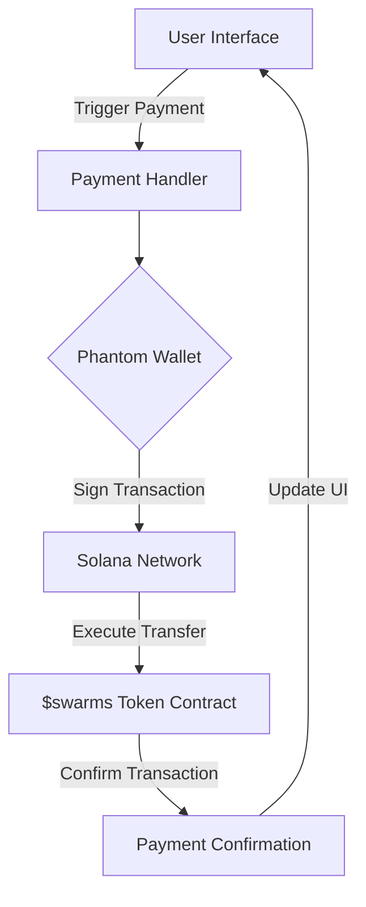
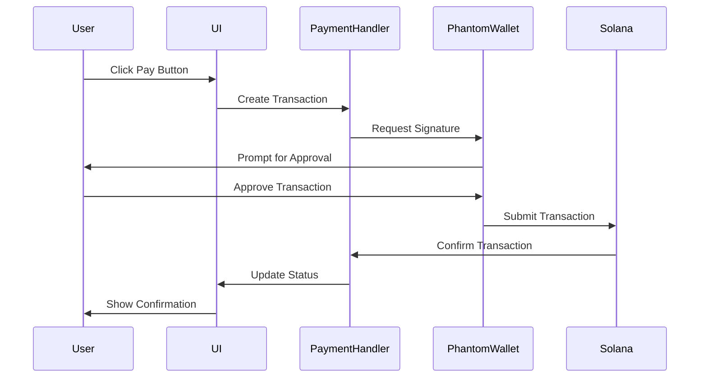

# $swarms Token Integration Guide

## Overview
This guide covers the integration of $swarms token (74SBV4zDXxTRgv1pEMoECskKBkZHc2yGPnc7GYVepump) payments into your platform using Solana and Phantom wallet. The $swarms token offers numerous benefits on the Solana blockchain, including high transaction per second (TPS) capabilities, low transaction fees, and more.

## Table of Contents
- [Prerequisites](#prerequisites)
- [Installation](#installation)
- [Architecture Overview](#architecture-overview)
- [Setup Guide](#setup-guide)
- [Integration Examples](#integration-examples)
- [One-Click Payment Implementation](#one-click-payment-implementation)
- [Security Considerations](#security-considerations)
- [Troubleshooting](#troubleshooting)

## Prerequisites
- Node.js v16.x or higher
- TypeScript 4.x or higher
- Phantom Wallet browser extension
- Solana development environment

## Installation

```bash
npm install @solana/web3.js @solana/spl-token @project-serum/anchor @solana/wallet-adapter-react @solana/wallet-adapter-phantom
```

## Architecture Overview



## Setup Guide

### 1. Initialize Solana Connection

```typescript
import { Connection, clusterApiUrl } from '@solana/web3.js';
import { PhantomWalletAdapter } from '@solana/wallet-adapter-phantom';

const connection = new Connection(clusterApiUrl('mainnet-beta'));
const wallet = new PhantomWalletAdapter();

// Initialize wallet connection
await wallet.connect();
```

### 2. Configure Token Parameters

```typescript
const SWARMS_TOKEN_ADDRESS = '74SBV4zDXxTRgv1pEMoECskKBkZHc2yGPnc7GYVepump';

interface TokenConfig {
  mint: PublicKey;
  decimals: number;
}

const swarmTokenConfig: TokenConfig = {
  mint: new PublicKey(SWARMS_TOKEN_ADDRESS),
  decimals: 9
};
```

### 3. Create Payment Handler

```typescript
export class SwarmPaymentHandler {
  private connection: Connection;
  private wallet: PhantomWalletAdapter;
  
  constructor(connection: Connection, wallet: PhantomWalletAdapter) {
    this.connection = connection;
    this.wallet = wallet;
  }

  async createTransferTransaction(
    amount: number,
    recipientAddress: string
  ): Promise<Transaction> {
    const transaction = new Transaction();
    
    const transferInstruction = createTransferInstruction(
      await getAssociatedTokenAddress(swarmTokenConfig.mint, this.wallet.publicKey),
      await getAssociatedTokenAddress(swarmTokenConfig.mint, new PublicKey(recipientAddress)),
      this.wallet.publicKey,
      amount * Math.pow(10, swarmTokenConfig.decimals)
    );

    transaction.add(transferInstruction);
    return transaction;
  }
}
```

## One-Click Payment Implementation

### React Component Example

```typescript
import React, { useState } from 'react';
import { useWallet } from '@solana/wallet-adapter-react';

const SwarmPaymentButton: React.FC<{
  amount: number;
  recipientAddress: string;
}> = ({ amount, recipientAddress }) => {
  const [loading, setLoading] = useState(false);
  const wallet = useWallet();
  const paymentHandler = new SwarmPaymentHandler(connection, wallet);

  const handlePayment = async () => {
    try {
      setLoading(true);
      
      const transaction = await paymentHandler.createTransferTransaction(
        amount,
        recipientAddress
      );

      const signature = await wallet.sendTransaction(transaction, connection);
      await connection.confirmTransaction(signature);
      
      // Handle success
      console.log('Payment successful:', signature);
    } catch (error) {
      console.error('Payment failed:', error);
    } finally {
      setLoading(false);
    }
  };

  return (
    <button 
      onClick={handlePayment}
      disabled={loading || !wallet.connected}
      className="payment-button"
    >
      {loading ? 'Processing...' : `Pay ${amount} $swarms`}
    </button>
  );
};
```

### Payment Flow Sequence



## Security Considerations

### Transaction Validation

```typescript
function validateTransaction(
  transaction: Transaction,
  expectedAmount: number,
  expectedRecipient: PublicKey
): boolean {
  try {
    const instruction = transaction.instructions[0];
    const decodedData = TOKEN_PROGRAM_ID.decode(instruction.data);
    
    return (
      decodedData.amount === expectedAmount &&
      instruction.keys[1].pubkey.equals(expectedRecipient)
    );
  } catch (error) {
    console.error('Transaction validation failed:', error);
    return false;
  }
}
```

### Error Handling

```typescript
class PaymentError extends Error {
  constructor(
    message: string,
    public code: string,
    public transaction?: string
  ) {
    super(message);
    this.name = 'PaymentError';
  }
}

async function handlePaymentError(error: any): Promise<void> {
  if (error instanceof WalletError) {
    // Handle wallet-specific errors
    throw new PaymentError(
      'Wallet error occurred',
      'WALLET_ERROR',
      error.message
    );
  } else if (error.code === 'TransactionError') {
    // Handle Solana transaction errors
    throw new PaymentError(
      'Transaction failed',
      'TRANSACTION_ERROR',
      error.txid
    );
  }
  // Handle other errors...
}
```

## Testing

### Unit Test Example

```typescript
import { expect } from 'chai';
import { SwarmPaymentHandler } from './payment-handler';

describe('SwarmPaymentHandler', () => {
  let paymentHandler: SwarmPaymentHandler;
  
  beforeEach(() => {
    // Setup test environment
  });

  it('should create valid transfer transaction', async () => {
    const amount = 100;
    const recipientAddress = 'recipient_address';
    
    const transaction = await paymentHandler.createTransferTransaction(
      amount,
      recipientAddress
    );
    
    expect(transaction.instructions).to.have.lengthOf(1);
    // Add more assertions...
  });
});
```

## Troubleshooting

### Common Issues and Solutions

1. **Insufficient Balance**
```typescript
async function checkBalance(
  connection: Connection,
  walletAddress: PublicKey
): Promise<boolean> {
  const balance = await connection.getTokenAccountBalance(
    await getAssociatedTokenAddress(swarmTokenConfig.mint, walletAddress)
  );
  
  return parseInt(balance.value.amount) > 0;
}
```

2. **Transaction Timeout**
```typescript
async function submitWithRetry(
  transaction: Transaction,
  maxRetries = 3
): Promise<string> {
  let attempt = 0;
  
  while (attempt < maxRetries) {
    try {
      const signature = await wallet.sendTransaction(transaction, connection);
      const confirmation = await connection.confirmTransaction(signature);
      
      if (confirmation.value.err) {
        throw new Error('Transaction failed');
      }
      
      return signature;
    } catch (error) {
      attempt++;
      if (attempt === maxRetries) throw error;
      await new Promise(resolve => setTimeout(resolve, 1000 * attempt));
    }
  }
}
```

## Monitoring and Analytics

### Transaction Monitoring

```typescript
interface TransactionMetrics {
  timestamp: number;
  amount: number;
  success: boolean;
  duration: number;
}

class TransactionMonitor {
  private metrics: TransactionMetrics[] = [];
  
  logTransaction(metric: TransactionMetrics): void {
    this.metrics.push(metric);
    // Add your analytics implementation
  }
  
  getAverageSuccessRate(): number {
    return (
      this.metrics.filter(m => m.success).length / this.metrics.length * 100
    );
  }
}
```

## Advanced Features

### Batch Payments

```typescript
async function createBatchPayment(
  recipients: Array<{ address: string; amount: number }>
): Promise<Transaction> {
  const transaction = new Transaction();
  
  for (const recipient of recipients) {
    const transferInstruction = createTransferInstruction(/* ... */);
    transaction.add(transferInstruction);
  }
  
  return transaction;
}
```

### Subscription Payments

```typescript
class SubscriptionManager {
  async createSubscription(
    amount: number,
    interval: number,
    recipientAddress: string
  ): Promise<string> {
    // Implementation for recurring payments
  }
  
  async cancelSubscription(subscriptionId: string): Promise<void> {
    // Implementation for cancellation
  }
}
```

## Support and Resources

For additional support:
- Solana Documentation: https://docs.solana.com
- Phantom Wallet Docs: https://docs.phantom.app
- $swarms Token Contract: 74SBV4zDXxTRgv1pEMoECskKBkZHc2yGPnc7GYVepump

## Version History

- v1.0.0 - Initial release
- v1.0.1 - Added batch payment support
- v1.0.2 - Enhanced error handling
- v1.0.3 - Added subscription payment feature