### Understanding Agent Evaluation Mechanisms

Agent evaluation mechanisms play a crucial role in ensuring that autonomous agents, particularly in multi-agent systems, perform their tasks effectively and efficiently. This blog delves into the intricacies of agent evaluation, the importance of accuracy tracking, and the methodologies used to measure and visualize agent performance. We'll use Mermaid graphs to provide clear visual representations of these processes.

#### 1. Introduction to Agent Evaluation Mechanisms

Agent evaluation mechanisms refer to the processes and criteria used to assess the performance of agents within a system. These mechanisms are essential for:

- **Ensuring Reliability:** Agents must consistently perform their designated tasks correctly.
- **Improving Performance:** Evaluation helps in identifying areas where agents can improve.
- **Maintaining Accountability:** It provides a way to hold agents accountable for their actions.

### 2. Key Components of Agent Evaluation

To effectively evaluate agents, several components and metrics are considered:

#### a. Performance Metrics

These are quantitative measures used to assess how well an agent is performing. Common performance metrics include:

- **Accuracy:** The percentage of correct actions or decisions made by the agent.
- **Precision and Recall:** Precision measures the number of true positive results divided by the number of all positive results, while recall measures the number of true positive results divided by the number of positives that should have been retrieved.
- **F1 Score:** The harmonic mean of precision and recall.
- **Response Time:** How quickly an agent responds to a given task or query.

#### b. Evaluation Criteria

Evaluation criteria define the standards or benchmarks against which agent performance is measured. These criteria are often task-specific and may include:

- **Task Completion Rate:** The percentage of tasks successfully completed by the agent.
- **Error Rate:** The frequency of errors made by the agent during task execution.
- **Resource Utilization:** How efficiently an agent uses resources such as memory and CPU.

### 3. The Process of Agent Evaluation

The evaluation process involves several steps, which can be visualized using Mermaid graphs:

#### a. Define Evaluation Metrics

The first step is to define the metrics that will be used to evaluate the agent. This involves identifying the key performance indicators (KPIs) relevant to the agent's tasks.

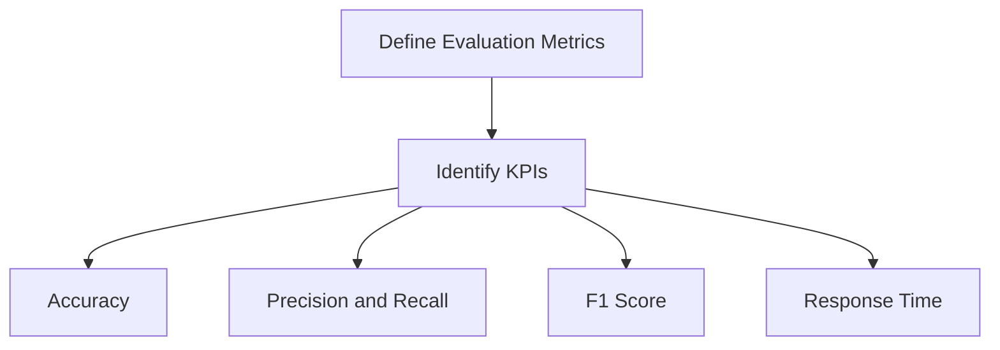

#### b. Collect Data

Data collection involves gathering information on the agent's performance. This data can come from logs, user feedback, or direct observations.

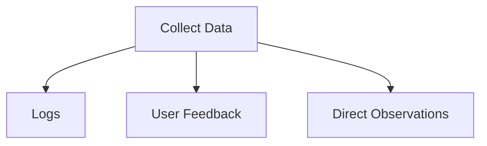

#### c. Analyze Performance

Once data is collected, it is analyzed to assess the agent's performance against the defined metrics. This step may involve statistical analysis, machine learning models, or other analytical techniques.

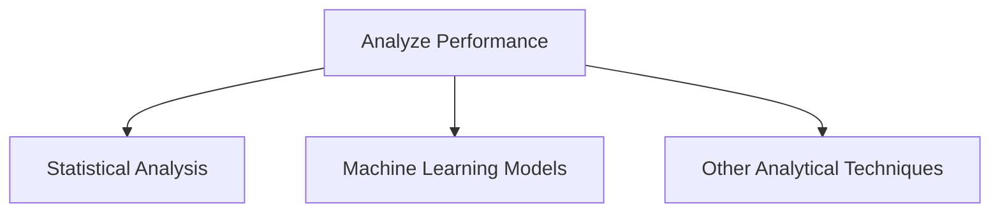

#### d. Generate Reports

After analysis, performance reports are generated. These reports provide insights into how well the agent is performing and identify areas for improvement.

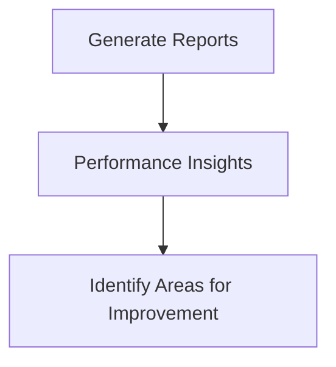

### 4. Tracking Agent Accuracy

Accuracy tracking is a critical aspect of agent evaluation. It involves measuring how often an agent's actions or decisions are correct. The following steps outline the process of tracking agent accuracy:

#### a. Define Correctness Criteria

The first step is to define what constitutes a correct action or decision for the agent.

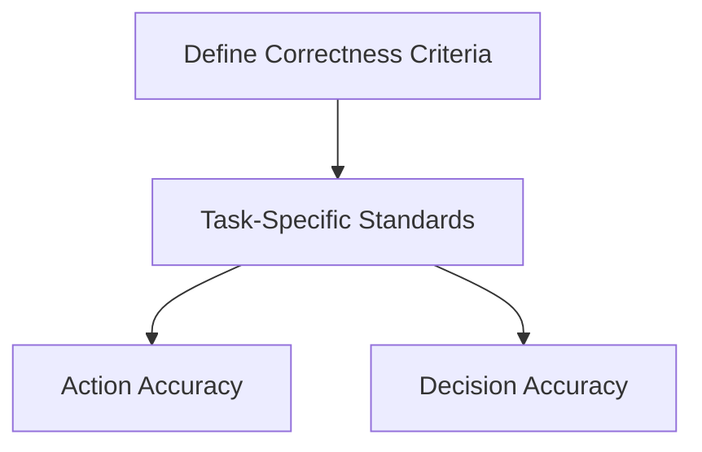

#### b. Monitor Agent Actions

Agents' actions are continuously monitored to track their performance. This monitoring can be done in real-time or through periodic evaluations.

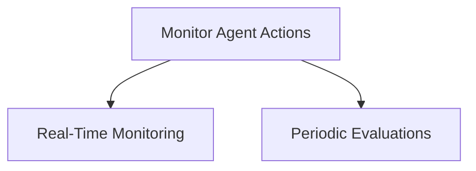

#### c. Compare Against Correctness Criteria

Each action or decision made by the agent is compared against the defined correctness criteria to determine its accuracy.

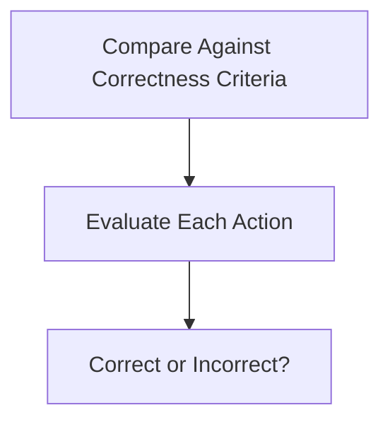

#### d. Calculate Accuracy Metrics

Accuracy metrics are calculated based on the comparison results. These metrics provide a quantitative measure of the agent's accuracy.

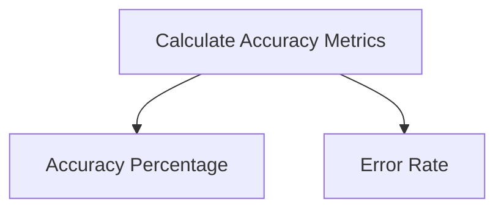

### 5. Measuring Agent Accuracy

Measuring agent accuracy involves several steps and considerations:

#### a. Data Labeling

To measure accuracy, the data used for evaluation must be accurately labeled. This involves annotating the data with the correct actions or decisions.

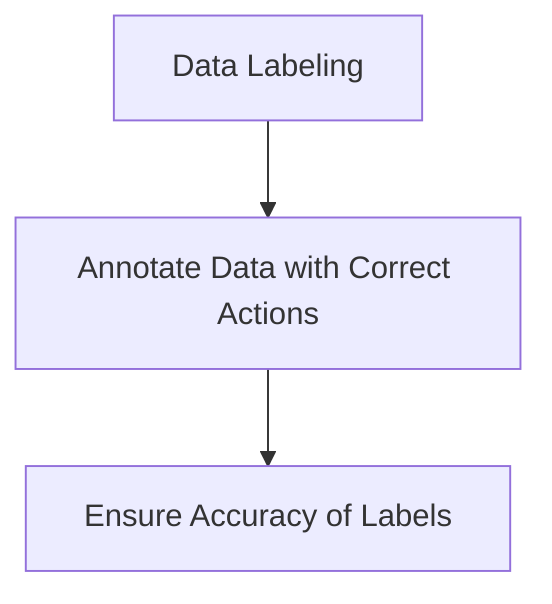

#### b. Establish Baseline Performance

A baseline performance level is established by evaluating a sample set of data. This baseline serves as a reference point for measuring improvements or declines in accuracy.

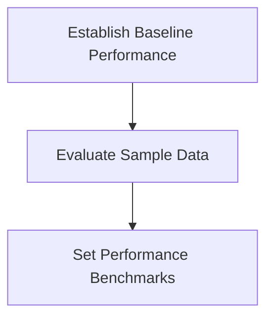

#### c. Regular Evaluations

Agents are regularly evaluated to measure their accuracy over time. This helps in tracking performance trends and identifying any deviations from the expected behavior.

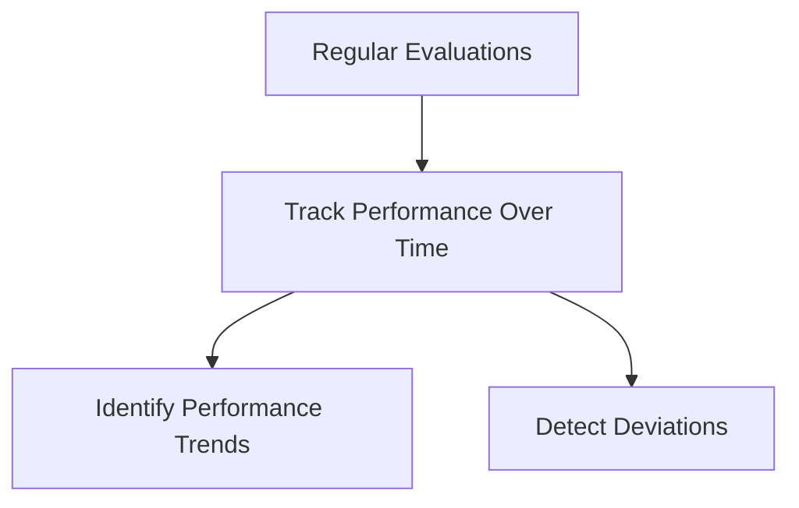

#### d. Feedback and Improvement

Feedback from evaluations is used to improve the agent's performance. This may involve retraining the agent, adjusting its algorithms, or refining its decision-making processes.

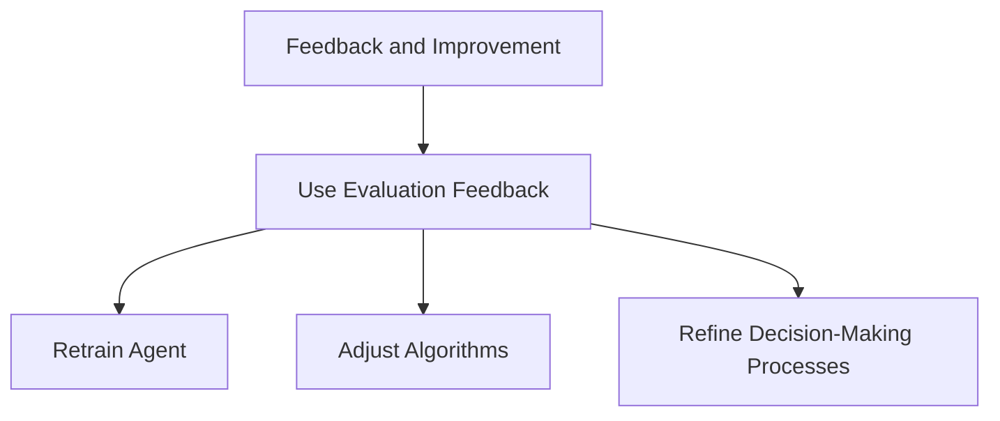

### 6. Visualizing Agent Evaluation with Mermaid Graphs

Mermaid graphs provide a clear and concise way to visualize the agent evaluation process. Here are some examples of how Mermaid graphs can be used:

#### a. Overall Evaluation Process

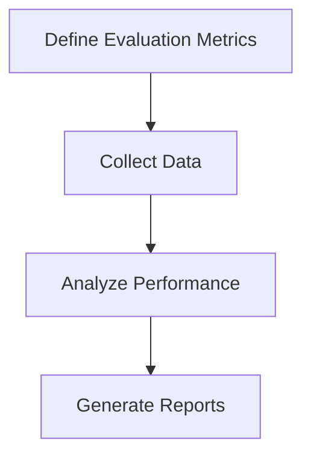

#### b. Accuracy Tracking

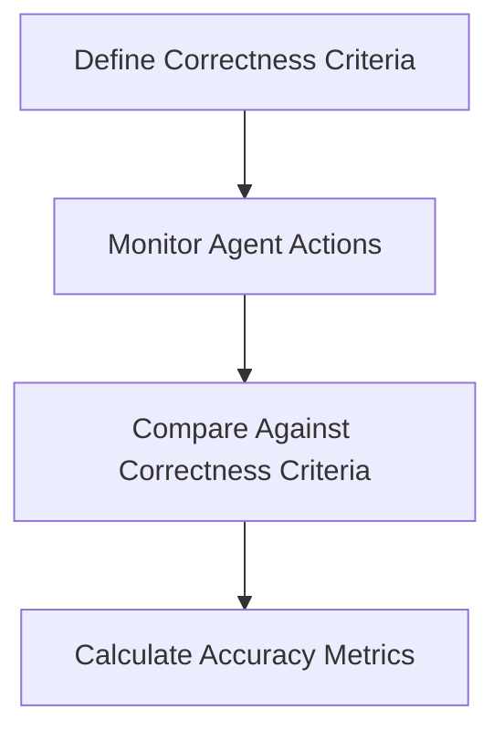

#### c. Continuous Improvement Cycle

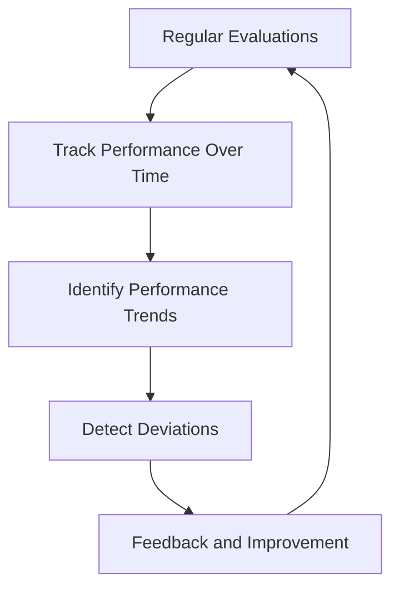

### 7. Case Study: Evaluating a Chatbot Agent

To illustrate the agent evaluation process, let's consider a case study involving a chatbot agent designed to assist customers in an e-commerce platform.

#### a. Define Evaluation Metrics

For the chatbot, key performance metrics might include:

- **Response Accuracy:** The percentage of correct responses provided by the chatbot.
- **Response Time:** The average time taken by the chatbot to respond to user queries.
- **Customer Satisfaction:** Measured through user feedback and ratings.

#### b. Collect Data

Data is collected from chatbot interactions, including user queries, responses, and feedback.

#### c. Analyze Performance

Performance analysis involves comparing the chatbot's responses against a predefined set of correct responses and calculating accuracy metrics.

#### d. Generate Reports

Reports are generated to provide insights into the chatbot's performance, highlighting areas where it excels and areas needing improvement.

### 8. Best Practices for Agent Evaluation

Here are some best practices to ensure effective agent evaluation:

#### a. Use Realistic Scenarios

Evaluate agents in realistic scenarios that closely mimic real-world conditions. This ensures that the evaluation results are relevant and applicable.

#### b. Continuous Monitoring

Continuously monitor agent performance to detect and address issues promptly. This helps in maintaining high performance levels.

#### c. Incorporate User Feedback

User feedback is invaluable for improving agent performance. Incorporate feedback into the evaluation process to identify and rectify shortcomings.

#### d. Regular Updates

Regularly update the evaluation metrics and criteria to keep pace with evolving tasks and requirements.

### Conclusion

Agent evaluation mechanisms are vital for ensuring the reliability, efficiency, and effectiveness of autonomous agents. By defining clear evaluation metrics, continuously monitoring performance, and using feedback for improvement, we can develop agents that consistently perform at high levels. Visualizing the evaluation process with tools like Mermaid graphs further aids in understanding and communication. Through diligent evaluation and continuous improvement, we can harness the full potential of autonomous agents in various applications.