# SwarmShield Integration Guide

## Overview

SwarmShield is an enterprise-grade security system that has been fully integrated into the Swarms framework. It provides comprehensive security features for all swarm architectures, including encryption, input validation, output filtering, safety checking, and rate limiting.

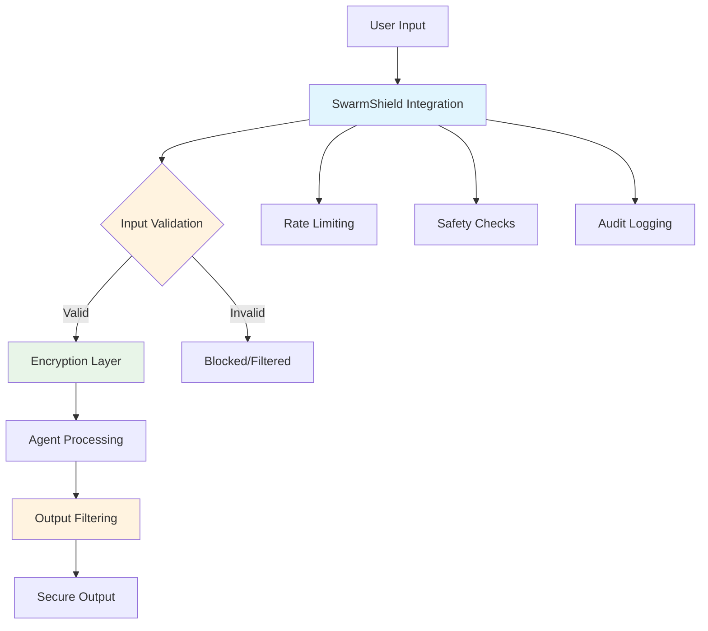

## Features

### Enterprise Security
- **Multi-layer encryption** with AES-256-GCM
- **Automatic key rotation** for enhanced security
- **HMAC authentication** for message integrity
- **Secure conversation storage** with encrypted persistence
- **Comprehensive error handling** and advanced rate limiting
- **Real-time monitoring integration** and detailed audit logging
- **Role-based access control** and data encryption & privacy

### Input Validation & Sanitization
- **XSS prevention** with HTML escaping
- **SQL injection detection** with pattern matching
- **Input length validation** with configurable limits
- **Custom pattern blocking** for specific threats

### Output Filtering & Protection
- **Sensitive data filtering** (SSN, credit cards, emails, IP addresses, phone numbers, IBAN)
- **API key protection** with automatic masking
- **Malicious content detection** and removal
- **Configurable filtering levels** (low, moderate, high)

### Rate Limiting & Abuse Prevention
- **Per-agent rate limiting** with configurable limits
- **Token-based limiting** for resource protection
- **Automatic blocking** of abusive agents
- **Request tracking** and monitoring

### Safety & Ethical AI
- **Content safety assessment** with harmful content detection
- **Bias detection** and filtering
- **Age-appropriate content filtering**
- **Ethical AI compliance** features

## Security Architecture

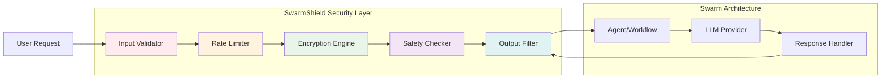

## Quick Start

### Basic Integration

```python
from swarms import Agent, SequentialWorkflow
from swarms.security import ShieldConfig

# Create agents
agents = [
    Agent(
        agent_name="SecureAgent1",
        system_prompt="You are a secure agent.",
        model_name="gpt-4o-mini"
    ),
    Agent(
        agent_name="SecureAgent2",
        system_prompt="You are a secure agent.",
        model_name="gpt-4o-mini"
    )
]

# Create workflow with basic security
workflow = SequentialWorkflow(
    name="SecureWorkflow",
    agents=agents,
    enable_security=True,
    security_level="standard"  # basic, standard, enhanced, maximum
)

# Run with security
result = workflow.run("Process this task securely")
```

### Advanced Configuration

```python
from swarms.security import ShieldConfig

# Create custom security configuration
config = ShieldConfig(
    enabled=True,
    security_level="enhanced",
    enable_input_validation=True,
    enable_output_filtering=True,
    enable_safety_checks=True,
    enable_rate_limiting=True,
    max_requests_per_minute=30,
    filter_sensitive_data=True,
    integrate_with_conversation=True,
    protect_agent_communications=True,
    encrypt_storage=True,
    # Custom patterns
    custom_blocked_patterns=[
        r"password\s*=\s*\w+",
        r"api_key\s*=\s*\w+"
    ],
    custom_sensitive_patterns=[
        r"\b\d{3}-\d{2}-\d{4}\b",  # SSN
        r"\b[A-Za-z0-9._%+-]+@[A-Za-z0-9.-]+\.[A-Z|a-z]{2,}\b"  # Email
    ]
)

# Use with any swarm architecture
workflow = SequentialWorkflow(
    name="CustomSecureWorkflow",
    agents=agents,
    shield_config=config,
    enable_security=True
)
```

## Security Levels

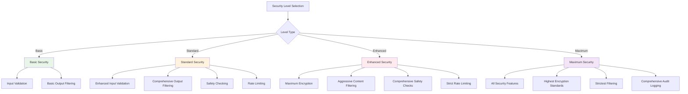

### Basic Security
- Input validation and sanitization
- Basic output filtering
- Minimal performance impact

```python
workflow = SequentialWorkflow(
    agents=agents,
    enable_security=True,
    security_level="basic"
)
```

### Standard Security (Default)
- Enhanced input validation
- Comprehensive output filtering
- Safety checking
- Rate limiting

```python
workflow = SequentialWorkflow(
    agents=agents,
    enable_security=True,
    security_level="standard"
)
```

### Enhanced Security
- Maximum encryption strength
- Aggressive content filtering
- Comprehensive safety checks
- Strict rate limiting

```python
workflow = SequentialWorkflow(
    agents=agents,
    enable_security=True,
    security_level="enhanced"
)
```

### Maximum Security
- All security features enabled
- Highest encryption standards
- Strictest filtering and validation
- Comprehensive audit logging

```python
workflow = SequentialWorkflow(
    agents=agents,
    enable_security=True,
    security_level="maximum"
)
```

## Supported Swarm Architectures

SwarmShield is integrated into all swarm architectures:

### SequentialWorkflow

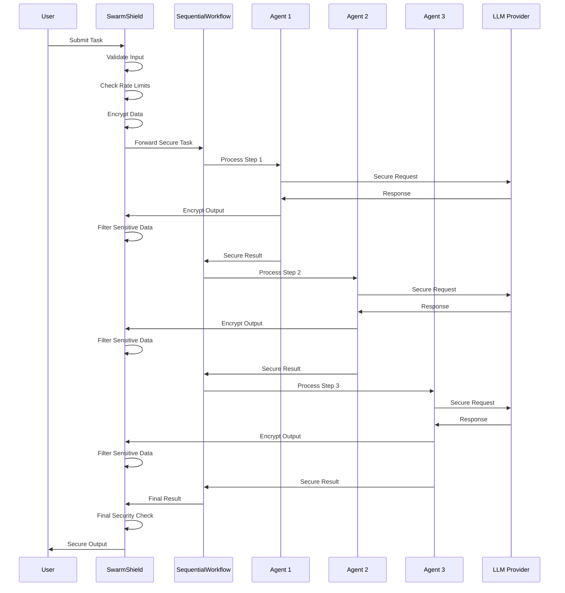

```python
from swarms import SequentialWorkflow

workflow = SequentialWorkflow(
    agents=agents,
    enable_security=True,
    security_level="enhanced"
)
```

### ConcurrentWorkflow

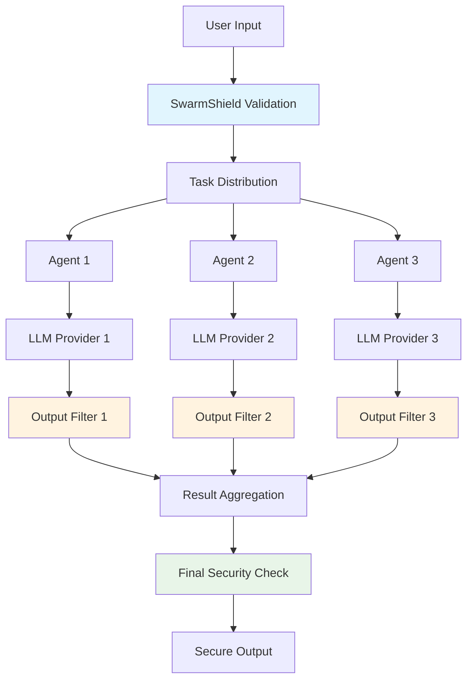

```python
from swarms import ConcurrentWorkflow

workflow = ConcurrentWorkflow(
    agents=agents,
    enable_security=True,
    security_level="enhanced"
)
```

### SwarmRouter

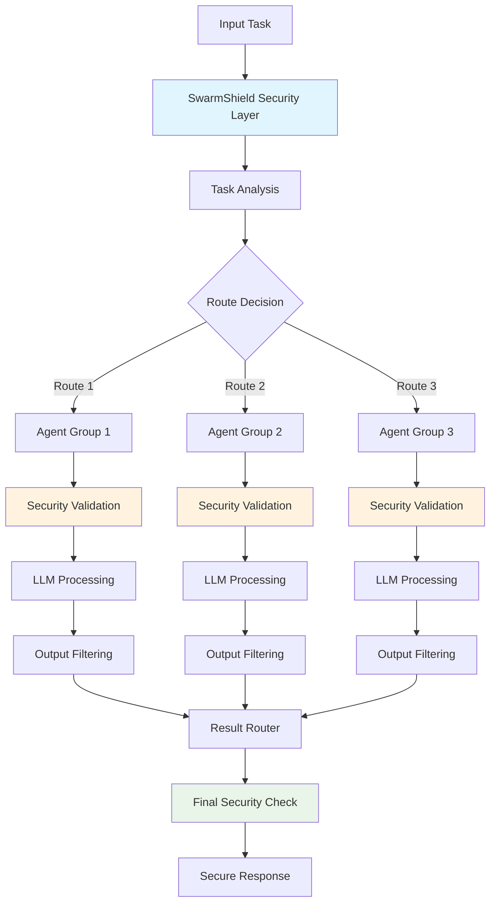

```python
from swarms import SwarmRouter

router = SwarmRouter(
    agents=agents,
    enable_security=True,
    security_level="enhanced"
)
```

### GroupChat

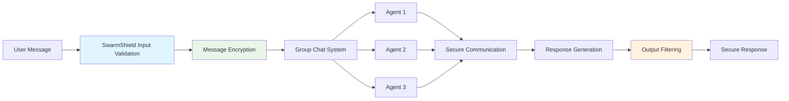

```python
from swarms import GroupChat

chat = GroupChat(
    agents=agents,
    enable_security=True,
    security_level="enhanced"
)
```

### InteractiveGroupChat

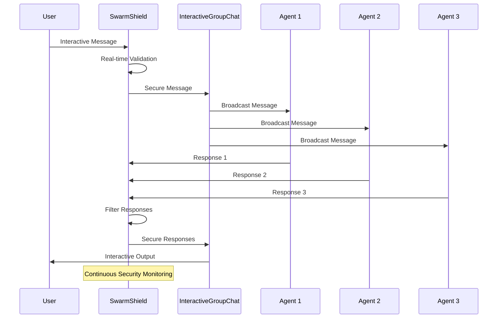

```python
from swarms import InteractiveGroupChat

chat = InteractiveGroupChat(
    agents=agents,
    enable_security=True,
    security_level="enhanced"
)
```

### MajorityVoting

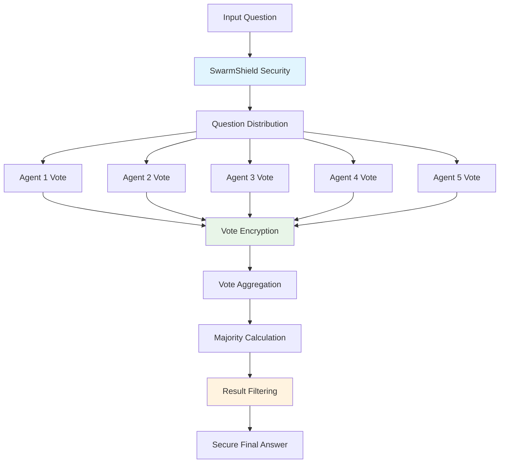

```python
from swarms import MajorityVoting

voting = MajorityVoting(
    agents=agents,
    enable_security=True,
    security_level="enhanced"
)
```

### Agent

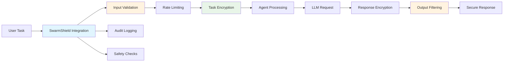

```python
from swarms import Agent

agent = Agent(
    agent_name="SecureAgent",
    system_prompt="You are a secure agent.",
    model_name="gpt-4o-mini",
    enable_security=True,
    security_level="enhanced"
)
```

## Security Methods

All swarm architectures inherit security methods from BaseSwarm:

### Input Validation
```python
# Validate task input
validated_task = workflow.validate_task_with_shield(
    "Process sensitive data: user@example.com", 
    "SecureAgent1"
)

# Validate agent configuration
is_valid, validated_config, error = workflow.validate_agent_config_with_shield(
    {"api_key": "sk-123..."}, 
    "SecureAgent1"
)
```

### Communication Processing
```python
# Process outbound communication
is_valid, processed_message, error = workflow.process_agent_communication_with_shield(
    "SecureAgent1", 
    "Hello, this is a message", 
    "outbound"
)

# Process inbound communication
is_valid, processed_message, error = workflow.process_agent_communication_with_shield(
    "SecureAgent1", 
    "Received message", 
    "inbound"
)
```

### Rate Limiting
```python
# Check rate limits
is_allowed = workflow.check_rate_limit_with_shield("SecureAgent1", 1)

# Check token limits
is_allowed = workflow.check_rate_limit_with_shield("SecureAgent1", 1000)
```

### Secure Communication
```python
# Add secure message to encrypted conversation
success = workflow.add_secure_message("SecureAgent1", "Secret message")

# Get secure messages (requires conversation_id)
messages = workflow.get_secure_messages(conversation_id="conv_123")
for agent, message, timestamp in messages:
    print(f"{timestamp}: {agent}: {message}")
```

### Security Monitoring
```python
# Get comprehensive security statistics
stats = workflow.get_security_stats()
print(f"Security level: {stats['config']['security_level']}")
print(f"Rate limiting: {stats['rate_limiting']['total_agents']} agents")
print(f"Input validation: {stats['input_validation']['blocked_patterns_count']} patterns")
```

## Configuration Options

### ShieldConfig Parameters

| Parameter | Type | Default | Description |
|-----------|------|---------|-------------|
| `enabled` | bool | True | Enable/disable all security features |
| `security_level` | str | "standard" | Security level (basic, standard, enhanced, maximum) |
| `encryption_strength` | str | "maximum" | Encryption strength (standard, enhanced, maximum) |
| `key_rotation_interval` | int | 3600 | Key rotation interval in seconds |
| `enable_input_validation` | bool | True | Enable input validation |
| `max_input_length` | int | 10000 | Maximum input length |
| `enable_output_filtering` | bool | True | Enable output filtering |
| `filter_sensitive_data` | bool | True | Filter sensitive data from outputs |
| `enable_safety_checks` | bool | True | Enable safety checking |
| `enable_rate_limiting` | bool | True | Enable rate limiting |
| `max_requests_per_minute` | int | 60 | Maximum requests per minute |
| `enable_audit_logging` | bool | True | Enable audit logging |
| `integrate_with_conversation` | bool | True | Integrate with conversation management |
| `protect_agent_communications` | bool | True | Protect inter-agent communications |

### Custom Patterns

```python
config = ShieldConfig(
    # Block specific patterns
    custom_blocked_patterns=[
        r"password\s*=\s*\w+",
        r"api_key\s*=\s*\w+",
        r"secret\s*=\s*\w+",
        r"<script.*?>.*?</script>"
    ],
    
    # Filter sensitive data patterns
    custom_sensitive_patterns=[
        r"\b\d{3}-\d{2}-\d{4}\b",  # SSN
        r"\b\d{4}[\s-]?\d{4}[\s-]?\d{4}[\s-]?\d{4}\b",  # Credit card
        r"\b[A-Za-z0-9._%+-]+@[A-Za-z0-9.-]+\.[A-Z|a-z]{2,}\b",  # Email
        r"\b\d{1,3}\.\d{1,3}\.\d{1,3}\.\d{1,3}\b"  # IP address
    ]
)
```

## Complete Examples

### Multi-Agent Security System

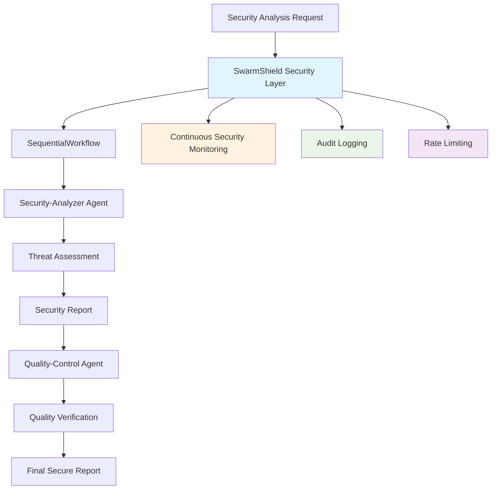

```python
from swarms import Agent, SequentialWorkflow
from swarms.security import ShieldConfig

def security_analysis(danger_level: str) -> str:
    """Analyze security danger level and return appropriate response."""
    responses = {
        "low": "No immediate danger detected - Safe to proceed",
        "medium": "Moderate security concern - Requires attention",
        "high": "Critical security threat - Immediate action required",
        None: "No danger level assessment available"
    }
    return responses.get(danger_level, "Unknown danger level")

def quality_assessment(quality_score: int) -> str:
    """Assess quality based on numerical score (1-10)."""
    if quality_score >= 8:
        return "Excellent quality - Meets all standards"
    elif quality_score >= 6:
        return "Good quality - Minor improvements needed"
    elif quality_score >= 4:
        return "Poor quality - Significant issues identified"
    else:
        return "Critical quality failure - Immediate attention required"

# Create secure agents
agents = [
    Agent(
        agent_name="Security-Analyzer",
        agent_description="Analyzes security threats and vulnerabilities",
        system_prompt="You are a security analyst. Assess security risks and provide threat analysis.",
        model_name="gpt-4o-mini",
        max_loops=1,
        enable_security=True,
        security_level="enhanced"
    ),
    Agent(
        agent_name="Quality-Control",
        agent_description="Ensures quality standards are met",
        system_prompt="You are a quality control specialist. Verify content quality and compliance.",
        model_name="gpt-4o-mini",
        max_loops=1,
        enable_security=True,
        security_level="enhanced"
    )
]

# Create secure workflow
workflow = SequentialWorkflow(
    name="Secure-Quality-System",
    agents=agents,
    enable_security=True,
    security_level="enhanced"
)

# Run secure analysis
result = workflow.run("Analyze the security posture of our new API endpoint")
```

### Agent with Dynamic Security

```python
from swarms import Agent

# Agent with enhanced security features
secure_agent = Agent(
    agent_name="Secure-Agent",
    agent_description="Agent with comprehensive security measures",
    system_prompt="You are a helpful, harmless, and honest AI assistant.",
    model_name="gpt-4o-mini",
    enable_security=True,
    security_level="maximum",
    max_loops=1,
    temperature=0.3  # Lower temperature for more consistent, safe responses
)
```

### Output Type Configurations with Security

```python
# Different output type examples with security
json_agent = Agent(
    agent_name="JSON-Secure-Agent",
    system_prompt="Always respond in valid JSON format",
    output_type="json",
    enable_security=True,
    security_level="standard"
)

streaming_agent = Agent(
    agent_name="Streaming-Secure-Agent", 
    system_prompt="Provide detailed streaming responses",
    output_type="str-all-except-first",
    enable_security=True,
    security_level="standard"
)

final_only_agent = Agent(
    agent_name="Final-Only-Secure-Agent",
    system_prompt="Provide only the final result",
    output_type="final",
    enable_security=True,
    security_level="standard"
)
```

## Security Flow Diagram

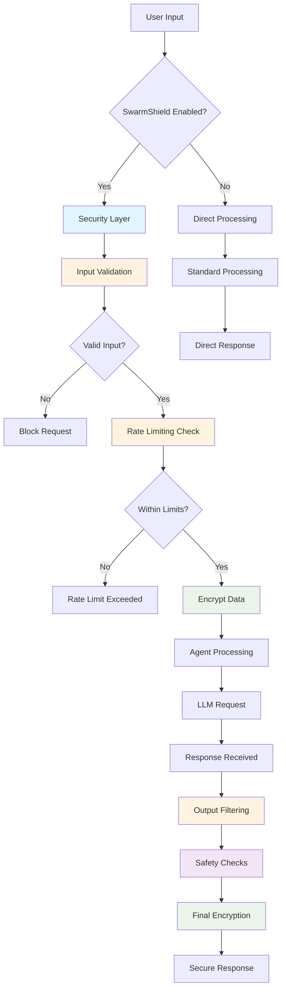

## Best Practices

### 1. Choose Appropriate Security Level
- Use `basic` for development and testing
- Use `standard` for most production applications
- Use `enhanced` for sensitive data processing
- Use `maximum` for highly regulated environments

### 2. Configure Rate Limits
```python
config = ShieldConfig(
    max_requests_per_minute=30,  # Adjust based on your needs
    max_tokens_per_request=5000,  # Limit resource usage
    rate_limit_window=60  # 1-minute window
)
```

### 3. Customize Patterns
```python
config = ShieldConfig(
    custom_blocked_patterns=[
        # Add your organization-specific patterns
        r"internal\s+server\s+error",
        r"debug\s+mode",
        r"test\s+environment"
    ],
    custom_sensitive_patterns=[
        # Add your data-specific patterns
        r"\b[A-Z]{2}\d{2}[A-Z0-9]{10,30}\b",  # IBAN
        r"\b\d{3}[\s-]?\d{3}[\s-]?\d{4}\b"  # Phone number
    ]
)
```

### 4. Monitor Security
```python
# Regular security monitoring
stats = workflow.get_security_stats()
if stats['rate_limiting']['blocked_agents'] > 0:
    print("Warning: Some agents are being rate limited")

# Check for security events
if stats['input_validation']['blocked_patterns_count'] > 0:
    print("Warning: Blocked patterns detected")
```

### 5. Handle Security Errors
```python
# Validate input before processing
validated_task = workflow.validate_task_with_shield(task, agent_name)
if not validated_task:
    print("Security validation failed")
    return

# Check rate limits
is_allowed = workflow.check_rate_limit_with_shield(agent_name)
if not is_allowed:
    print("Rate limit exceeded")
    return
```

### 6. Error Handling and Robustness
```python
import logging
from swarms import Agent

# Configure logging for security events
logging.basicConfig(level=logging.INFO)
logger = logging.getLogger(__name__)

# Create agent with error handling
agent = Agent(
    agent_name="Robust-Secure-Agent",
    system_prompt="You are a secure and robust agent.",
    model_name="gpt-4o-mini",
    enable_security=True,
    security_level="enhanced",
    max_loops=1
)

try:
    result = agent.run("Process this task securely")
    logger.info("Task completed successfully")
except Exception as e:
    logger.error(f"Security error: {e}")
    # Handle security-related errors appropriately
```

## Troubleshooting

### Common Issues

1. **Security Initialization Failed**
   ```python
   # Check if cryptography is installed
   pip install cryptography
   
   # Use basic security as fallback
   workflow = SequentialWorkflow(
       agents=agents,
       enable_security=True,
       security_level="basic"
   )
   ```

2. **Rate Limiting Too Strict**
   ```python
   # Increase rate limits
   config = ShieldConfig(
       max_requests_per_minute=100,  # Increase from default 60
       rate_limit_window=120  # Increase window
   )
   ```

3. **Pattern Blocking Legitimate Content**
   ```python
   # Review and adjust patterns
   config = ShieldConfig(
       custom_blocked_patterns=[
           # Remove or modify problematic patterns
           r"javascript:",  # Too broad, consider more specific
       ]
   )
   ```

### Performance Optimization

1. **Disable Unnecessary Features**
   ```python
   config = ShieldConfig(
       enable_audit_logging=False,  # Disable if not needed
       log_input_output=False,  # Disable for performance
       enable_caching=True  # Enable caching
   )
   ```

2. **Use Appropriate Security Level**
   ```python
   # Use basic for high-throughput scenarios
   workflow = SequentialWorkflow(
       agents=agents,
       enable_security=True,
       security_level="basic"  # Minimal overhead
   )
   ```

## Migration Guide

### From Standalone SwarmShield

If you were using the standalone SwarmShield package:

```python
# Old standalone usage
from swarm_shield import SwarmShield
shield = SwarmShield(encryption_strength="maximum")

# New integrated usage
from swarms import SequentialWorkflow
from swarms.security import ShieldConfig

config = ShieldConfig.create_maximum_config()
workflow = SequentialWorkflow(
    agents=agents,
    shield_config=config,
    enable_security=True
)
```

### From No Security

If you're adding security to existing swarms:

```python
# Old usage without security
workflow = SequentialWorkflow(agents=agents)

# New usage with security
workflow = SequentialWorkflow(
    agents=agents,
    enable_security=True,
    security_level="standard"
)
```

## Examples

See the complete examples in `example_swarm_with_shield.py` for:

- Basic security configuration
- Enhanced security features
- Maximum security setup
- Custom security patterns
- Security monitoring
- Async operations with security

## Support

For issues and questions:

1. Check the troubleshooting section above
2. Review the security statistics for insights
3. Use basic security level for debugging
4. Check the logs in the `security/` folder

## Security Considerations

- **Key Management**: Keys are automatically rotated, but ensure secure storage
- **Pattern Updates**: Regularly update blocked and sensitive patterns
- **Rate Limits**: Monitor and adjust based on your application needs
- **Audit Logs**: Review logs regularly for security insights
- **Updates**: Keep the Swarms framework updated for security patches 
