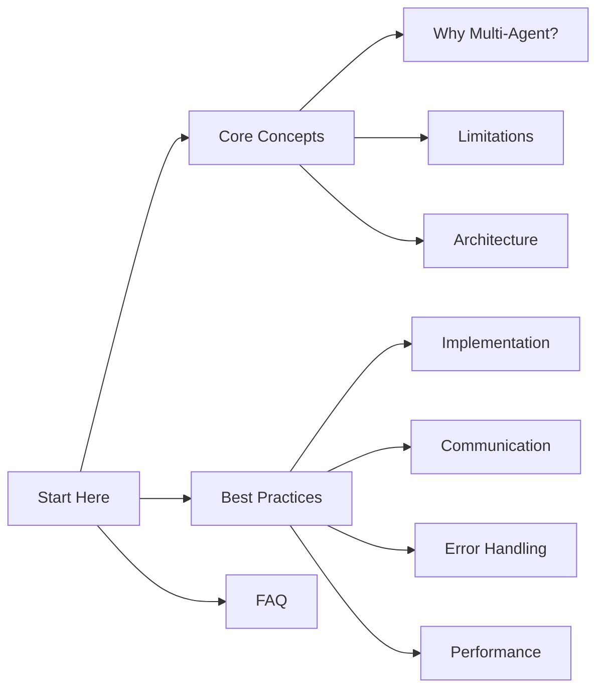

# Multi-Agent LLM Systems Best Practices Guide

Welcome to the comprehensive guide on building and managing multi-agent Large Language Model (LLM) systems. This documentation provides tactical insights, best practices, and practical solutions for implementing reliable and efficient multi-agent systems.

## Overview

Multi-agent LLM systems represent a paradigm shift in artificial intelligence, enabling complex problem-solving through collaborative intelligence. This guide will help you understand:

- Why multi-agent systems are necessary
- Common limitations and how to overcome them
- Best practices for implementation
- Communication protocols and error handling
- Performance optimization techniques

## Quick Navigation



## Key Features

- 🚀 **Comprehensive Coverage**: From basic concepts to advanced implementation details
- 🔧 **Practical Examples**: Real-world scenarios and solutions
- 📈 **Performance Optimization**: Tips and techniques for scaling
- 🛡️ **Error Handling**: Robust protocols for system reliability
- 🤝 **Communication Patterns**: Effective agent collaboration strategies

## Getting Started

1. Start with [Why Multi-Agent Systems?](concepts/why-multi-agent.md) to understand the fundamentals
2. Review [Limitations of Individual Agents](concepts/limitations.md) to learn about common challenges
3. Explore [Implementation Guide](best-practices/implementation.md) for practical setup instructions
4. Check the [FAQ](faq.md) for quick answers to common questions

## Core Principles

1. **Reliability Through Collaboration**
   - Multiple agents working together
   - Cross-verification of results
   - Redundancy for critical tasks

2. **Efficient Communication**
   - Clear protocols
   - Minimal overhead
   - Effective coordination

3. **Scalable Architecture**
   - Modular design
   - Flexible deployment
   - Resource optimization

4. **Robust Error Handling**
   - Graceful failure recovery
   - Systematic error detection
   - Proactive monitoring

## Contributing

We welcome contributions to this guide! Please see our [contribution guidelines](contributing.md) for more information on how to help improve this documentation.

## Support

If you need help or have questions:

1. Check the [FAQ](faq.md) section
2. Review [Tips & Troubleshooting](tips.md)
3. Raise an issue on our GitHub repository

Let's build better multi-agent systems together! 🚀

# Welcome to Swarms Docs Home

[](https://discord.gg/jM3Z6M9uMq) [](https://www.youtube.com/@kyegomez3242) [](https://www.linkedin.com/in/kye-g-38759a207/) [](https://x.com/kyegomezb)

## Swarms Installation

```bash
pip3 install swarms
```

## Update Swarms


```bash
pip3 install -U swarms
```

### **Get Started Building Production-Grade Multi-Agent Applications**

## Onboarding

| Section              | Links                                                                                      |
|----------------------|--------------------------------------------------------------------------------------------|
| Installation    | [Installation](https://docs.swarms.world/en/latest/swarms/install/install/)                                                            |
| Quickstart | [Get Started](https://docs.swarms.world/en/latest/swarms/install/quickstart/)                                                 |
| Environment Setup | [Environment Configuration](https://docs.swarms.world/en/latest/swarms/install/workspace_manager/)                                                 |
| Environment Variables | [Environment Variables](https://docs.swarms.world/en/latest/swarms/install/env/)                                                 |
| Swarms CLI | [CLI Documentation](https://docs.swarms.world/en/latest/swarms/cli/main/)                                                 |
| Agent Internal Mechanisms | [Agent Architecture](https://docs.swarms.world/en/latest/swarms/framework/agents_explained/)                                                 |
| Agent API | [Agent API](https://docs.swarms.world/en/latest/swarms/structs/agent/)                                                 |
| Managing Prompts in Production | [Prompts Management](https://docs.swarms.world/en/latest/swarms/prompts/main/)                                                 |
| Integrating External Agents | [External Agents Integration](https://docs.swarms.world/en/latest/swarms/agents/external_party_agents/)                                                 |
| Creating Agents from YAML | [YAML Agent Creation](https://docs.swarms.world/en/latest/swarms/agents/create_agents_yaml/)                                                 |
| Why You Need Swarms | [Why MultiAgent Collaboration](https://docs.swarms.world/en/latest/swarms/concept/why/)                                                 |
| Swarm Architectures Analysis | [Swarm Architectures](https://docs.swarms.world/en/latest/swarms/concept/swarm_architectures/)                                                 |
| Choosing the Right Swarm | [How to Choose Swarms](https://docs.swarms.world/en/latest/swarms/concept/how_to_choose_swarms/)                                                 |
| Full API Reference | [API Reference](https://docs.swarms.world/en/latest/swarms/framework/reference/)                                                 |
| AgentRearrange Docs | [AgentRearrange](https://docs.swarms.world/en/latest/swarms/structs/agent_rearrange/)                                                 |


## Ecosystem

Here you'll find references about the Swarms framework, marketplace, community, and more to enable you to build your multi-agent applications.

| Section              | Links                                                                                      |
|----------------------|--------------------------------------------------------------------------------------------|
| Swarms Python Framework Docs     | [Framework Docs](https://docs.swarms.world/en/latest/swarms/install/install/)                                                            |
| Swarms Cloud API     | [Cloud API](https://docs.swarms.world/en/latest/swarms_cloud/launch/)                                                            |
| Swarms Marketplace API     | [Marketplace API](https://docs.swarms.world/en/latest/swarms_platform/)                                                            |
| Swarms Memory Systems     | [Memory Systems](https://docs.swarms.world/en/latest/swarms_memory/)                                                            |
| Available Models     | [Models Overview](https://docs.swarms.world/en/latest/swarms/models/)                                                            |
| Swarms Tools     | [Tools Overview](https://docs.swarms.world/en/latest/swarms_tools/overview/)                                                            |
| Example Applications     | [Examples](https://docs.swarms.world/en/latest/swarms/examples/unique_swarms/)                                                            |
| Swarms Corp Github     | [Swarms Corp GitHub](https://github.com/The-Swarm-Corporation)                      |


## Community
| Section              | Links                                                                                      |
|----------------------|--------------------------------------------------------------------------------------------|
| Community            | [Discord](https://discord.gg/swarms)                            |
| Blog                 | [Blog](https://medium.com/@kyeg)                                                           |
| Event Calendar       | [LUMA](https://lu.ma/swarms_calendar)                                                       |
| Twitter     | [Twitter](https://x.com/swarms_corp)                                                       |
| Agent Marketplace     | [Website](https://swarms.world)                                                       |
| Docs     | [Website](https://docs.swarms.world)                                                       |
| Swarms Website   | [Website](https://swarms.ai)                                                       |

## Get Support

Want to get in touch with the Swarms team? Open an issue on [GitHub](https://github.com/kyegomez/swarms/issues/new) or reach out to us via [email](mailto:kye@swarms.world). We're here to help!
