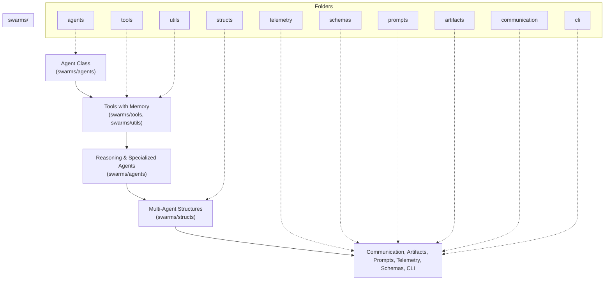

# Swarms Protocol Overview & Architecture

This document provides a comprehensive overview of the Swarms protocol architecture, illustrating the flow from agent classes to multi-agent structures, and showcasing the main components and folders within the `swarms/` package. The Swarms framework is designed for extensibility, modularity, and production-readiness, enabling the orchestration of intelligent agents, tools, memory, and complex multi-agent systems.

---

## Introduction

Swarms is an enterprise-grade, production-ready multi-agent orchestration framework. It enables developers and organizations to build, deploy, and manage intelligent agents that can reason, collaborate, and solve complex tasks autonomously or in groups. The architecture is inspired by the principles of modularity, composability, and scalability, ensuring that each component can be extended or replaced as needed.

The protocol is structured to support a wide range of use cases, from simple single-agent automations to sophisticated multi-agent workflows involving memory, tool use, and advanced reasoning.

For a high-level introduction and installation instructions, see the [Swarms Docs Home](https://docs.swarms.world/en/latest/).

---

## High-Level Architecture Flow

The Swarms protocol is organized into several key layers, each responsible for a specific aspect of the system. The typical flow is as follows:

1. **Agent Class (`swarms/agents`)**
    
    - The core building block of the framework. Agents encapsulate logic, state, and behavior. They can be simple (stateless) or complex 
    (stateful, with memory and reasoning capabilities).
    
    - Agents can be specialized for different tasks (e.g., reasoning agents, tool agents, judge agents, etc.).
    
    - Example: A `ReasoningAgent` that can analyze data and make decisions, or a `ToolAgent` that wraps external APIs.
    
    - [Quickstart for Agents](https://docs.swarms.world/en/latest/swarms/agents/)
    
    - [Agent API Reference](https://docs.swarms.world/en/latest/swarms/structs/agent/)

2. **Tools with Memory (`swarms/tools`, `swarms/utils`)**
    - Tools are modular components that agents use to interact with the outside world, perform computations, or access resources (APIs, 
    databases, files, etc.).

    - Memory modules and utility functions allow agents to retain context, cache results, and manage state across interactions.
    
    - Example: A tool for calling an LLM API, a memory cache for conversation history, or a utility for parsing and formatting data.
    
    - [Tools Overview](https://docs.swarms.world/en/latest/swarms_tools/overview/)
    
    - [BaseTool Reference](https://docs.swarms.world/en/latest/swarms/tools/base_tool/)

3. **Reasoning & Specialized Agents (`swarms/agents`)**
    - These agents build on the base agent class, adding advanced reasoning, self-consistency, and specialized logic for tasks like 
    planning, evaluation, or multi-step workflows.

    - Includes agents for self-reflection, iterative improvement, and domain-specific expertise.

    - Example: A `SelfConsistencyAgent` that aggregates multiple reasoning paths, or a `JudgeAgent` that evaluates outputs from other 
    agents.

    - [Reasoning Agents Overview](https://docs.swarms.world/en/latest/swarms/agents/reasoning_agents_overview/)
    
    - [Self Consistency Agent](https://docs.swarms.world/en/latest/swarms/agents/consistency_agent/)
    
    - [Agent Judge](https://docs.swarms.world/en/latest/swarms/agents/agent_judge/)

4. **Multi-Agent Structures (`swarms/structs`)**
    - Agents are composed into higher-order structures for collaboration, voting, parallelism, and workflow orchestration.

    - Includes swarms for majority voting, round-robin execution, hierarchical delegation, and more.

    - Example: A `MajorityVotingSwarm` that aggregates outputs from several agents, or a `HierarchicalSwarm` that delegates tasks to 
    sub-agents.

    - [Multi-Agent Architectures Overview](https://docs.swarms.world/en/latest/swarms/concept/swarm_architectures/)
    
    - [MajorityVotingSwarm](https://docs.swarms.world/en/latest/swarms/structs/majorityvoting/)
    
    - [HierarchicalSwarm](https://docs.swarms.world/en/latest/swarms/structs/hierarchical_swarm/)
    
    - [Sequential Workflow](https://docs.swarms.world/en/latest/swarms/structs/sequential_workflow/)
    
    - [Concurrent Workflow](https://docs.swarms.world/en/latest/swarms/structs/concurrentworkflow/)

5. **Supporting Components**

    - **Communication (`swarms/communication`)**: Provides wrappers for inter-agent communication, database access, message passing, and 
    integration with external systems (e.g., Redis, DuckDB, Pulsar). See [Communication Structure](https://docs.swarms.world/en/latest/swarms/structs/conversation/)
    
    - **Artifacts (`swarms/artifacts`)**: Manages the creation, storage, and retrieval of artifacts (outputs, files, logs) generated by 
    agents and swarms.
    
    - **Prompts (`swarms/prompts`)**: Houses prompt templates, system prompts, and agent-specific prompts for LLM-based agents. See 
    [Prompts Management](https://github.com/kyegomez/swarms/tree/master/swarms/prompts/)
    
    - **Telemetry (`swarms/telemetry`)**: Handles logging, monitoring, and bootup routines for observability and debugging.
    
    - **Schemas (`swarms/schemas`)**: Defines data schemas for agents, tools, completions, and communication protocols, ensuring type 
    safety and consistency.
    
    - **CLI (`swarms/cli`)**: Provides command-line utilities for agent creation, management, and orchestration. See [CLI Documentation]
    (https://docs.swarms.world/en/latest/swarms/cli/cli_reference/)

---

## Proposing Large Improvements or Enhancements: Swarms Improvement Proposals (SIPs)

For significant changes, new agent architectures, or radical new features, Swarms uses a formal process called **Swarms Improvement Proposals (SIPs)**. SIPs are design documents that describe new features, enhancements, or changes to the Swarms framework. They ensure that major changes are well-documented, discussed, and reviewed by the community before implementation.

**When to use a SIP:**

- Proposing new agent types, swarm patterns, or coordination mechanisms

- Core framework changes or breaking changes

- New integrations (LLM providers, tools, external services)

- Any complex or multi-component feature

**SIP Process Overview:**

1. Discuss your idea in [GitHub Discussions](https://github.com/kyegomez/swarms/discussions)

2. Submit a SIP as a GitHub Issue using the SIP template

3. Engage with the community and iterate on your proposal

4. Undergo review and, if accepted, proceed to implementation

**Learn more:** See the full [SIP Guidelines and Template](https://docs.swarms.world/en/latest/protocol/sip/)

---

## Detailed Architecture Diagram

The following Mermaid diagram visualizes the protocol flow and the relationship between the main folders in the `swarms/` package:

---

## Folder-by-Folder Breakdown

### `agents/`

**Purpose:** Defines all agent classes, including base agents, reasoning agents, tool agents, judge agents, and more.

**Highlights:**

- Modular agent design for extensibility.

- Support for YAML-based agent creation and configuration. See [YAML Agent Creation](https://docs.swarms.world/en/latest/swarms/
agents/create_agents_yaml/)

- Specialized agents for self-consistency, evaluation, and domain-specific tasks.

- **Example:**

- `ReasoningAgent`, `ToolAgent`, `JudgeAgent`, `ConsistencyAgent`, `OpenAIAssistant`, etc.

- [Agents Overview](https://docs.swarms.world/en/latest/swarms/framework/agents_explained/)

### `tools/`

**Purpose:** Houses all tool-related logic, including tool registry, function calling, tool schemas, and integration with external 
APIs.

**Highlights:**

- Tools can be dynamically registered and called by agents.

- Support for OpenAI function calling, Cohere, and custom tool schemas.

- Utilities for parsing, formatting, and executing tool calls.

- **Example:**

- `base_tool.py`, `tool_registry.py`, `mcp_client_call.py`, `func_calling_utils.py`, etc.

- [Tools Reference](https://docs.swarms.world/en/latest/swarms/tools/tools_examples/)

- [What are tools?](https://docs.swarms.world/en/latest/swarms/tools/build_tool/)

### `structs/`
**Purpose:** Implements multi-agent structures, workflows, routers, registries, and orchestration logic.

**Highlights:**

- Swarms for majority voting, round-robin, hierarchical delegation, spreadsheet processing, and more.

- Workflow orchestration (sequential, concurrent, graph-based).

- Utilities for agent matching, rearrangement, and evaluation.

- **Example:**

- `MajorityVotingSwarm`, `HierarchicalSwarm`, `SwarmRouter`, `SequentialWorkflow`, `ConcurrentWorkflow`, etc.

- [Custom Multi Agent Architectures](https://docs.swarms.world/en/latest/swarms/structs/custom_swarm/)

- [SwarmRouter](https://docs.swarms.world/en/latest/swarms/structs/swarm_router/)

- [AgentRearrange](https://docs.swarms.world/en/latest/swarms/structs/agent_rearrange/)

### `utils/`

**Purpose:** Provides utility functions, memory management, caching, wrappers, and helpers used throughout the framework.

**Highlights:**

- Memory and caching for agents and tools. See [Integrating RAG with Agents](https://docs.swarms.world/en/latest/swarms/memory/
diy_memory/)

- Wrappers for concurrency, logging, and data processing.

- General-purpose utilities for string, file, and data manipulation.

**Example:**

- `agent_cache.py`, `file_processing.py`, `formatter.py`, etc.

### `telemetry/`

**Purpose:** Handles telemetry, logging, monitoring, and bootup routines for the framework.

**Highlights:**

- Centralized logging and execution tracking.

- Bootup routines for initializing the framework.

- Utilities for monitoring agent and swarm performance.

- **Example:**

- `bootup.py`, `log_executions.py`, `main.py`.

### `schemas/`

**Purpose:** Defines data schemas for agents, tools, completions, and communication protocols.

**Highlights:**

- Ensures type safety and consistency across the framework.

- Pydantic-based schemas for validation and serialization.

- Schemas for agent classes, tool calls, completions, and more.

**Example:**

- `agent_class_schema.py`, `tool_schema_base_model.py`, `agent_completion_response.py`, etc.

### `prompts/`

**Purpose:** Contains prompt templates, system prompts, and agent-specific prompts for LLM-based agents.

**Highlights:**

- Modular prompt design for easy customization.

- Support for multi-modal, collaborative, and domain-specific prompts.

- Templates for system, task, and conversational prompts.

**Example:**

- `prompt.py`, `reasoning_prompt.py`, `multi_agent_collab_prompt.py`, etc.

- [Prompts Management](https://github.com/kyegomez/swarms/tree/master/swarms/prompts/)

### `artifacts/`

**Purpose:** Manages the creation, storage, and retrieval of artifacts (outputs, files, logs) generated by agents and swarms.

**Highlights:**

- Artifact management for reproducibility and traceability.
- Support for various output types and formats.

**Example:**

- `main_artifact.py`.

### `communication/`

**Purpose:** Provides wrappers for inter-agent communication, database access, message passing, and integration with external systems.

**Highlights:**

- Support for Redis, DuckDB, Pulsar, Supabase, and more.
- Abstractions for message passing and data exchange between agents.

**Example:**

- `redis_wrap.py`, `duckdb_wrap.py`, `base_communication.py`, etc.

- [Communication Structure](https://docs.swarms.world/en/latest/swarms/structs/conversation/)

### `cli/`

**Purpose:** Command-line utilities for agent creation, management, and orchestration.

**Highlights:**

- Scripts for onboarding, agent creation, and management.

- CLI entry points for interacting with the framework.

**Example:**

- `main.py`, `create_agent.py`, `onboarding_process.py`.

- [CLI Documentation](https://docs.swarms.world/en/latest/swarms/cli/cli_reference/)

---

## How the System Works Together

The Swarms protocol is designed for composability. Agents can be created and configured independently, then composed into larger structures (swarms) for collaborative or competitive workflows. Tools and memory modules are injected into agents as needed, enabling them to perform complex tasks and retain context. Multi-agent structures orchestrate the flow of information and decision-making, while supporting components (communication, telemetry, artifacts, etc.) ensure robustness, observability, and extensibility.

For example, a typical workflow might involve:

- Creating a set of specialized agents (e.g., data analyst, summarizer, judge).

- Registering tools (e.g., LLM API, database access, web search) and memory modules.

- Composing agents into a `MajorityVotingSwarm` for collaborative decision-making.

- Using communication wrappers to exchange data between agents and external systems.

- Logging all actions and outputs for traceability and debugging.

For more advanced examples, see the [Examples Overview](https://docs.swarms.world/en/latest/examples/).

---

## Swarms Framework Philosophy

Swarms is built on the following principles:

- **Modularity:** Every component (agent, tool, prompt, schema) is a module that can be extended or replaced.

- **Composability:** Agents and tools can be composed into larger structures for complex workflows.

- **Observability:** Telemetry and artifact management ensure that all actions are traceable and debuggable.

- **Extensibility:** New agents, tools, and workflows can be added with minimal friction.

- **Production-Readiness:** The framework is designed for reliability, scalability, and real-world deployment.

For more on the philosophy and architecture, see [Development Philosophy & Principles](https://docs.swarms.world/en/latest/swarms/concept/philosophy/) and [Understanding Swarms Architecture](https://docs.swarms.world/en/latest/swarms/concept/framework_architecture/).

---

## Further Reading & References

| Resource Name                        | Link                                                                                   | Description                                      |
|-------------------------------------- |----------------------------------------------------------------------------------------|--------------------------------------------------|
| Swarms Docs Home                     | [Swarms Docs Home](https://docs.swarms.world/en/latest/)                               | Main documentation homepage                      |
| Quickstart for Agents                | [Quickstart for Agents](https://docs.swarms.world/en/latest/swarms/agents/)            | Getting started with Swarms agents               |
| Agent API Reference                  | [Agent API Reference](https://docs.swarms.world/en/latest/swarms/structs/agent/)       | API reference for Agent class                    |
| Tools Overview                       | [Tools Overview](https://docs.swarms.world/en/latest/swarms_tools/overview/)           | Overview of available tools                      |
| BaseTool Reference                   | [BaseTool Reference](https://docs.swarms.world/en/latest/swarms/tools/base_tool/)      | Reference for the BaseTool class                 |
| Reasoning Agents Overview            | [Reasoning Agents Overview](https://docs.swarms.world/en/latest/swarms/agents/reasoning_agents_overview/) | Overview of reasoning agents                     |
| Multi-Agent Architectures Overview   | [Multi-Agent Architectures Overview](https://docs.swarms.world/en/latest/swarms/concept/swarm_architectures/) | Multi-agent system architectures                 |
| Examples Overview                    | [Examples Overview](https://docs.swarms.world/en/latest/examples/)               | Example projects and use cases                   |
| CLI Documentation                    | [CLI Documentation](https://docs.swarms.world/en/latest/swarms/cli/cli_reference/)              | Command-line interface documentation             |
| Prompts Management                   | [Prompts Management](https://github.com/kyegomez/swarms/tree/master/swarms/prompts/)         | Managing and customizing prompts                 |
| Development Philosophy & Principles  | [Development Philosophy & Principles](https://docs.swarms.world/en/latest/swarms/concept/philosophy/) | Framework philosophy and guiding principles      |
| Understanding Swarms Architecture    | [Understanding Swarms Architecture](https://docs.swarms.world/en/latest/swarms/concept/framework_architecture/) | In-depth look at Swarms architecture             |
| SIP Guidelines and Template          | [SIP Guidelines and Template](https://docs.swarms.world/en/latest/protocol/sip/)       | Swarms Improvement Proposal process and template |

# Conclusion

The Swarms protocol provides a robust foundation for building intelligent, collaborative, and autonomous systems. By organizing the codebase into clear, modular folders and defining a logical flow from agents to multi-agent structures, Swarms enables rapid development and deployment of advanced AI solutions. Whether you are building a simple automation or a complex multi-agent application, the Swarms architecture provides the tools and abstractions you need to succeed.

