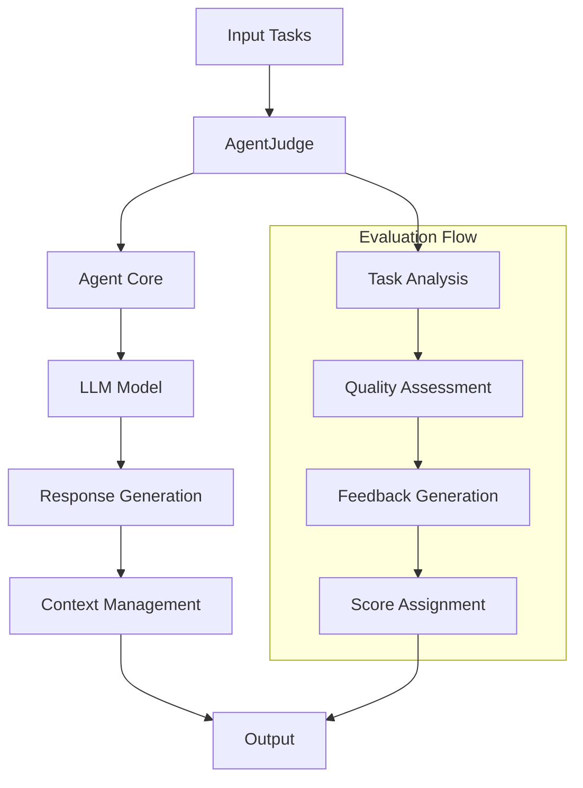

# Agent Judge

The AgentJudge is a specialized agent designed to evaluate and judge outputs from other agents or systems. It acts as a quality control mechanism, providing objective assessments and feedback on various types of content, decisions, or outputs. This implementation is based on the research paper "Agents as Judges: Using LLMs to Evaluate LLMs".

## Research Background

The AgentJudge implementation is inspired by recent research in LLM-based evaluation systems. Key findings from the research include:

- LLMs can effectively evaluate other LLM outputs with high accuracy

- Multi-agent evaluation systems can provide more reliable assessments

- Structured evaluation criteria improve consistency

- Context-aware evaluation leads to better results

## Overview

The AgentJudge serves as an impartial evaluator that can:


- Assess the quality and correctness of agent outputs

- Provide structured feedback and scoring

- Maintain context across multiple evaluations

- Generate detailed analysis reports


## Architecture



## Configuration

### Parameters

| Parameter | Type | Default | Description |
|-----------|------|---------|-------------|
| `agent_name` | str | "agent-judge-01" | Unique identifier for the judge agent |
| `system_prompt` | str | AGENT_JUDGE_PROMPT | System instructions for the agent |
| `model_name` | str | "openai/o1" | LLM model to use for evaluation |
| `max_loops` | int | 1 | Maximum number of evaluation iterations |

### Methods

| Method | Description | Parameters | Returns |
|--------|-------------|------------|---------|
| `step()` | Processes a single batch of tasks | `tasks: List[str]` | `str` |
| `run()` | Executes multiple evaluation iterations | `tasks: List[str]` | `List[str]` |

## Usage

### Basic Example

```python
from swarms import AgentJudge

# Initialize the judge
judge = AgentJudge(
    model_name="gpt-4o",
    max_loops=1
)

# Example outputs to evaluate
outputs = [
   "1. Agent CalculusMaster: After careful evaluation, I have computed the integral of the polynomial function. The result is ∫(x^2 + 3x + 2)dx = (1/3)x^3 + (3/2)x^2 + 5, where I applied the power rule for integration and added the constant of integration.",
   "2. Agent DerivativeDynamo: In my analysis of the function sin(x), I have derived it with respect to x. The derivative is d/dx (sin(x)) = cos(x). However, I must note that the additional term '+ 2' is not applicable in this context as it does not pertain to the derivative of sin(x).",
   "3. Agent LimitWizard: Upon evaluating the limit as x approaches 0 for the function (sin(x)/x), I conclude that lim (x -> 0) (sin(x)/x) = 1. The additional '+ 3' is incorrect and should be disregarded as it does not relate to the limit calculation.",
]

# Run evaluation
results = judge.run(outputs)
print(results)
```

## Applications

### Code Review Automation

!!! success "Features"
    - Evaluate code quality
    - Check for best practices
    - Assess documentation completeness

### Content Quality Control

!!! info "Use Cases"
    - Review marketing copy
    - Validate technical documentation
    - Assess user support responses

### Decision Validation

!!! warning "Applications"
    - Evaluate business decisions
    - Assess risk assessments
    - Review compliance reports

### Performance Assessment

!!! tip "Metrics"
    - Evaluate agent performance
    - Assess system outputs
    - Review automated processes

## Best Practices

### Task Formulation

1. Provide clear, specific evaluation criteria
2. Include context when necessary
3. Structure tasks for consistent evaluation

### System Configuration

1. Use appropriate model for task complexity
2. Adjust max_loops based on evaluation depth needed
3. Customize system prompt for specific use cases

### Output Management

1. Store evaluation results systematically
2. Track evaluation patterns over time
3. Use results for continuous improvement

### Integration Tips

1. Implement as part of CI/CD pipelines
2. Use for automated quality gates
3. Integrate with monitoring systems

## Implementation Guide

### Step 1: Setup

```python
from swarms import AgentJudge

# Initialize with custom parameters
judge = AgentJudge(
    agent_name="custom-judge",
    model_name="gpt-4",
    max_loops=3
)
```

### Step 2: Configure Evaluation Criteria

```python
# Define evaluation criteria
criteria = {
    "accuracy": 0.4,
    "completeness": 0.3,
    "clarity": 0.3
}

# Set criteria
judge.set_evaluation_criteria(criteria)
```

### Step 3: Run Evaluations

```python
# Single task evaluation
result = judge.step(task)

# Batch evaluation
results = judge.run(tasks)
```

## Troubleshooting

### Common Issues

??? question "Evaluation Inconsistencies"
   If you notice inconsistent evaluations:
   
   1. Check the evaluation criteria
   2. Verify the model configuration
   3. Review the input format

??? question "Performance Issues"
   For slow evaluations:
   
   1. Reduce max_loops
   2. Optimize batch size
   3. Consider model selection

## Additional Resources

## References

## "Agent-as-a-Judge: Evaluate Agents with Agents" - [Paper Link](https://arxiv.org/abs/2410.10934)

```bibtex
@misc{zhuge2024agentasajudgeevaluateagentsagents,
   title={Agent-as-a-Judge: Evaluate Agents with Agents}, 
   author={Mingchen Zhuge and Changsheng Zhao and Dylan Ashley and Wenyi Wang and Dmitrii Khizbullin and Yunyang Xiong and Zechun Liu and Ernie Chang and Raghuraman Krishnamoorthi and Yuandong Tian and Yangyang Shi and Vikas Chandra and Jürgen Schmidhuber},
   year={2024},
   eprint={2410.10934},
   archivePrefix={arXiv},
   primaryClass={cs.AI},
   url={https://arxiv.org/abs/2410.10934}, 
}
```