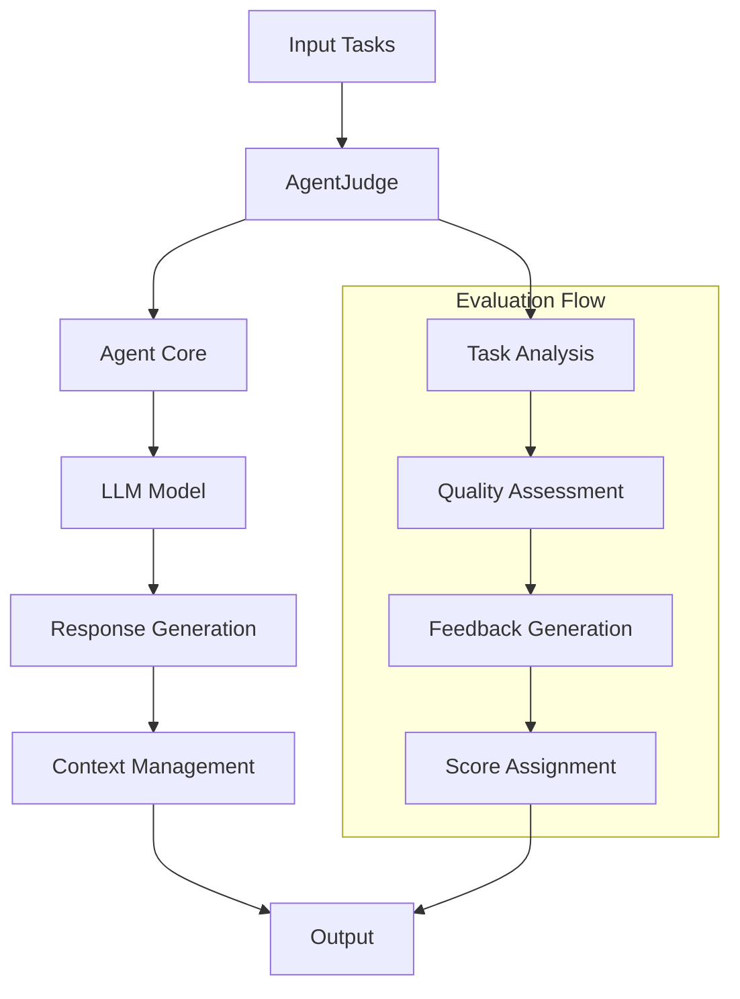
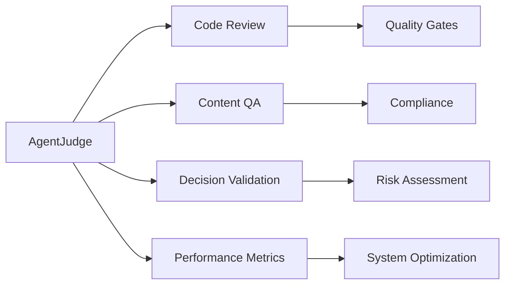

# Agent Judge

The AgentJudge is a specialized agent designed to evaluate and judge outputs from other agents or systems. It acts as a quality control mechanism, providing objective assessments and feedback on various types of content, decisions, or outputs.


The AgentJudge serves as an impartial evaluator that can:
- Assess the quality and correctness of agent outputs

- Provide structured feedback and scoring

- Maintain context across multiple evaluations

- Generate detailed analysis reports

## Architecture



## Parameters

| Parameter | Type | Default | Description |
|-----------|------|---------|-------------|
| `agent_name` | str | "agent-judge-01" | Unique identifier for the judge agent |
| `system_prompt` | str | AGENT_JUDGE_PROMPT | System instructions for the agent |
| `model_name` | str | "openai/o1" | LLM model to use for evaluation |
| `max_loops` | int | 1 | Maximum number of evaluation iterations |

## Methods

| Method | Description | Parameters | Returns |
|--------|-------------|------------|---------|
| `step()` | Processes a single batch of tasks | `tasks: List[str]` | `str` |
| `run()` | Executes multiple evaluation iterations | `tasks: List[str]` | `List[str]` |

## Code Example

```python
from swarms import AgentJudge


judge = AgentJudge(model_name="gpt-4o", max_loops=1)


outputs = [
    "1. Agent CalculusMaster: After careful evaluation, I have computed the integral of the polynomial function. The result is ∫(x^2 + 3x + 2)dx = (1/3)x^3 + (3/2)x^2 + 5, where I applied the power rule for integration and added the constant of integration.",
    "2. Agent DerivativeDynamo: In my analysis of the function sin(x), I have derived it with respect to x. The derivative is d/dx (sin(x)) = cos(x). However, I must note that the additional term '+ 2' is not applicable in this context as it does not pertain to the derivative of sin(x).",
    "3. Agent LimitWizard: Upon evaluating the limit as x approaches 0 for the function (sin(x)/x), I conclude that lim (x -> 0) (sin(x)/x) = 1. The additional '+ 3' is incorrect and should be disregarded as it does not relate to the limit calculation.",
    "4. Agent IntegralGenius: I have computed the integral of the exponential function e^x. The result is ∫(e^x)dx = e^x + C, where C is the constant of integration. The extra '+ 1' is unnecessary and does not belong in the final expression.",
    "5. Agent FunctionFreak: Analyzing the cubic function f(x) = x^3 - 3x + 2, I determined that it has a maximum at x = 1. However, the additional '+ 2' is misleading and should not be included in the maximum value statement.",
]

print(judge.run(outputs))

```

## Enterprise Applications

1. **Code Review Automation**
   - Evaluate code quality

   - Check for best practices
   
   - Assess documentation completeness

2. **Content Quality Control**
   
   - Review marketing copy
   
   - Validate technical documentation
   
   - Assess user support responses

3. **Decision Validation**
   - Evaluate business decisions
   
   - Assess risk assessments
   
   - Review compliance reports

4. **Performance Assessment**
   
   - Evaluate agent performance
   
   - Assess system outputs
   
   - Review automated processes

## Best Practices

1. **Task Formulation**
   - Provide clear, specific evaluation criteria
   
   - Include context when necessary

   - Structure tasks for consistent evaluation

2. **System Configuration**
   
   - Use appropriate model for task complexity
   
   - Adjust max_loops based on evaluation depth needed
   
   - Customize system prompt for specific use cases

3. **Output Management**
   
   - Store evaluation results systematically
   
   - Track evaluation patterns over time
   
   - Use results for continuous improvement

4. **Integration Tips**
   - Implement as part of CI/CD pipelines

   - Use for automated quality gates
   
   - Integrate with monitoring systems

## Use Cases



## Tips for Implementation

1. Start with simple evaluation tasks and gradually increase complexity

2. Maintain consistent evaluation criteria across similar tasks

3. Use the context management feature for multi-step evaluations

4. Implement proper error handling and logging

5. Regular calibration of evaluation criteria
