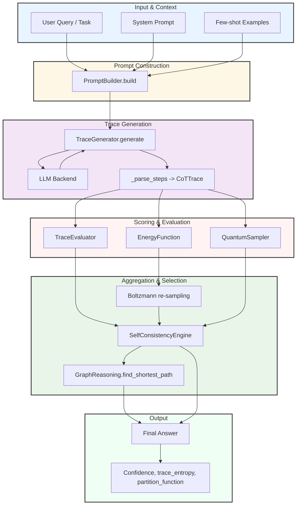

# Chain-of-Thought (CoT) Reasoning Agent

A comprehensive Chain-of-Thought reasoning framework that implements explicit latent reasoning traces between input and output, enabling step-by-step problem solving with multiple decoding strategies, self-consistency aggregation, and advanced mathematical formulations.

## Overview

The Chain-of-Thought (CoT) Agent implements a formal framework where an explicit latent sequence of reasoning tokens is introduced between input and output, and inference searches over that latent space. Unlike standard language model inference, CoT makes the reasoning process explicit and traceable.

**Key Capabilities:**

| Capability | Description |
|------------|-------------|
| **Multiple Decoding Strategies** | Greedy, sampling, nucleus (top-p), and quantum-inspired superposition sampling |
| **Self-Consistency Aggregation** | Combines multiple reasoning traces using majority voting or weighted aggregation |
| **Trace Verification** | Scores reasoning traces using heuristic, regex, or learned verifiers |
| **Information-Theoretic Analysis** | Computes entropy, mutual information, and trace diversity metrics |
| **Energy-Based Reweighting** | Uses Boltzmann distribution for principled trace sampling and selection |
| **Graph-Based Path Finding** | Finds shortest reasoning paths using graph-theoretic methods |

### Mathematical Foundation

Chain-of-Thought (CoT) introduces an explicit latent reasoning trace \(r = (r_1, \ldots, r_T)\) between input \(x\) and answer \(y\), treating inference as marginalizing or searching over the reasoning space:

\[
p_\theta(y \mid x) = \sum_r p_\theta(r \mid x) \cdot p_\theta(y \mid x, r)
\]

This formulation enables:
- **Explicit reasoning traces**: Each step \(r_t\) in the reasoning chain is made explicit
- **Marginalization over paths**: Multiple reasoning paths can be explored and aggregated
- **Traceable inference**: The reasoning process becomes interpretable and debuggable

## Getting Started

### Installation

The Chain-of-Thought Agent is included in the Swarms framework:

```bash
pip install swarms
```

### Basic Usage

**Example 1: Simple reasoning task**

```python
from swarms.agents.chain_of_thought import CoTAgent

agent = CoTAgent(agent_name="cot-agent", model_name="gpt-4o")
answer = agent.run("Solve step by step: What is 15 * 23?")
print(answer)
```

**Example 2: Self-consistency with multiple traces**

```python
from swarms.agents.chain_of_thought import CoTAgent, CoTConfig

config = CoTConfig(
    num_samples=5,
    use_self_consistency=True,
    temperature=0.7
)
agent = CoTAgent(agent_name="cot-agent", model_name="gpt-4o", config=config)
result = agent.run("Prove that 17 is prime", return_reasoning=True)

print("Final answer:", result.final_answer)
print("Confidence:", result.confidence)
print("\nReasoning trace:")
print(result.traces[0].raw_text[:400])
```

## Architecture

The CoT framework consists of several interconnected components that work together to generate, evaluate, and aggregate reasoning traces:



## Usage Examples

### Example 1: High-Reliability Arithmetic (Regex Verifier + Self-Consistency)

For mathematical problems where correctness is critical, combine regex verification with self-consistency:

```python
from swarms.agents.chain_of_thought import CoTAgent, CoTConfig, TraceEvaluator

cfg = CoTConfig(
    num_samples=7,
    temperature=0.0,               # Greedy sampling for reproducible traces
    use_self_consistency=True,
    decoding_strategy="GREEDY"
)

verifier = TraceEvaluator(evaluator_type="regex")  # Checks arithmetic consistency
agent = CoTAgent(agent_name="math-cot", model_name="gpt-4o", config=cfg, verifier=verifier)

res = agent.run("Compute 12345 * 6789 step-by-step", return_reasoning=True)
print("Final answer:", res.final_answer)
print("Confidence:", res.confidence)
for i, t in enumerate(res.traces[:3]):
    print(f"\nTrace {i+1} snippet:\n", t.raw_text[:400])
```

### Example 2: Wrap an Existing Agent

Apply CoT reasoning to an existing Agent instance:

```python
from swarms.structs.agent import Agent
from swarms.agents.chain_of_thought import apply_cot_to_agent, CoTConfig

# Suppose you already have an Agent in your system
base = Agent(agent_name="base", model_name="gpt-4o")
cfg = CoTConfig(num_samples=5, temperature=0.7, use_self_consistency=True)
answer = apply_cot_to_agent(base, "Explain why the harmonic series diverges", cot_config=cfg)
print(answer)
```

### Example 3: Technical Support Triage

Real-world application: Convert unstructured support tickets into structured diagnosis and remediation plans:

```python
from swarms.agents.chain_of_thought import CoTAgent, CoTConfig, TraceEvaluator

cfg = CoTConfig(num_samples=5, temperature=0.7, use_self_consistency=True)
verifier = TraceEvaluator(evaluator_type="heuristic")
agent = CoTAgent(agent_name="support-cot", model_name="gpt-4o", config=cfg, verifier=verifier)

task = (
    "Customer reports: 'Service X returns 500 when calling /process with payload Y. "
    "Logs show NullPointerException at module Z.' "
    "Identify likely causes and propose a 3-step remediation plan."
)

res = agent.run(task, return_reasoning=True)
print("Proposed remediation:", res.final_answer)
print("Confidence:", res.confidence)
print("\nTop reasoning trace (snippet):")
print(res.traces[0].raw_text[:800])
```

This example demonstrates how CoT can convert unstructured support tickets into structured diagnosis and remediation plans with traceable reasoning and confidence scores.

## API Reference

### CoTAgent

Main entry point for Chain-of-Thought reasoning.

```python
CoTAgent(
    agent_name: str = "cot-agent",
    model_name: str = "gpt-4o",
    system_prompt: Optional[str] = None,
    config: Optional[CoTConfig] = None,
    verifier: Optional[TraceEvaluator] = None,
    agent: Optional[Any] = None,
    **kwargs
)
```

**Methods:**

- `run(task: str, return_reasoning: Optional[bool] = None) -> Union[str, CoTResult]`
  - Execute CoT reasoning on a task
  - Returns final answer string or full `CoTResult` with traces

### CoTConfig

Configuration for CoT reasoning behavior.

```python
CoTConfig(
    num_samples: int = 1,
    temperature: float = 0.7,
    top_p: float = 0.9,
    max_reasoning_length: int = 1000,
    max_answer_length: int = 500,
    stop_tokens: List[str] = ["Final answer:", "Answer:"],
    return_reasoning: bool = True,
    decoding_strategy: DecodingStrategy = DecodingStrategy.SAMPLING,
    use_self_consistency: bool = False,
    few_shot_examples: Optional[List[Dict[str, str]]] = None,
    reasoning_prefix: str = "Let's think step by step.",
    answer_prefix: str = "Final answer:"
)
```

### DecodingStrategy (Enum)

Decoding modes for trace generation:

- `GREEDY`: Deterministic, highest probability token selection
- `SAMPLING`: Stochastic sampling with temperature
- `NUCLEUS`: Top-p (nucleus) sampling
- `QUANTUM`: Quantum-inspired superposition sampling

**Usage:**

```python
from swarms.agents.chain_of_thought import DecodingStrategy

cfg = CoTConfig(decoding_strategy=DecodingStrategy.NUCLEUS)
```

### Utility Classes

#### InformationTheory

Information-theoretic utilities for analyzing reasoning traces.

**Methods:**
- `entropy(probabilities: List[float]) -> float`: Calculate Shannon entropy
- `conditional_entropy(joint_probs, marginal_probs) -> float`: Calculate conditional entropy
- `mutual_information(joint_probs, x_marginal, y_marginal) -> float`: Calculate mutual information
- `calculate_trace_entropy(traces: List[CoTTrace]) -> float`: Calculate entropy of reasoning traces

**Mathematical Formulation:**

\[
H(X) = -\sum_i p(x_i) \log_2 p(x_i)
\]

**Example:**

```python
from swarms.agents.chain_of_thought import InformationTheory

H = InformationTheory.entropy([0.5, 0.5])  # Returns 1.0
```

#### EnergyFunction

Energy-based utilities for Boltzmann sampling.

**Methods:**
- `calculate_energy(logprob: float) -> float`: Convert log probability to energy
- `boltzmann_weight(energy: float, temperature: float) -> float`: Calculate Boltzmann weight
- `partition_function(energies: List[float], temperature: float) -> float`: Calculate partition function
- `free_energy(partition_function: float, temperature: float) -> float`: Calculate free energy
- `boltzmann_sampling(traces: List[CoTTrace], temperature: float, num_samples: int) -> List[CoTTrace]`: Sample traces using Boltzmann distribution

**Mathematical Formulation:**

\[
E(r, x) = -\log p_\theta(r \mid x)
\]

\[
w(r) = \frac{\exp(-E(r, x) / T)}{Z(x)}
\]

where \(Z(x) = \sum_r \exp(-E(r, x) / T)\) is the partition function.

**Example:**

```python
from swarms.agents.chain_of_thought import EnergyFunction

energies = [EnergyFunction.calculate_energy(t.logprob) for t in traces]
z = EnergyFunction.partition_function(energies, temperature=0.7)
```

#### QuantumSampler

Quantum-inspired sampling for reasoning paths.

**Methods:**
- `calculate_amplitudes(probabilities: List[float]) -> List[float]`: Calculate quantum amplitudes \(\alpha_r = \sqrt{p(r \mid x)}\)
- `measure_state(traces, answers, probabilities) -> Tuple[str, float]`: Quantum measurement \(P(y \mid x) = |\sum_{r: y_r=y} \alpha_r|^2\)
- `quantum_sampling(traces, probabilities, num_samples) -> List[CoTTrace]`: Sample traces using quantum-inspired superposition

**Use Case:** Combine multiple traces into a "measurement" instead of simple majority voting.

#### GraphReasoning

Graph-theoretic representation and path finding for reasoning.

**Methods:**
- `build_reasoning_graph(trace: CoTTrace) -> Dict[int, List[int]]`: Build graph representation from trace
- `calculate_path_probability(trace: CoTTrace, step_probs: Optional[List[float]]) -> float`: Calculate path probability
- `find_shortest_path(traces: List[CoTTrace], lambda_reg: float = 0.1) -> Optional[CoTTrace]`: Find shortest reasoning path

**Mathematical Formulation:**

\[
r^* = \arg\min_r \left[-\log p_\theta(r \mid x) + \lambda \cdot L(r)\right]
\]

where \(L(r)\) is the length penalty and \(\lambda\) is regularization.

#### TraceEvaluator

Verifier/scorer for reasoning traces.

```python
TraceEvaluator(evaluator_type: str = "heuristic")
```

**Modes:**
- `heuristic`: Structural checks, step lengths, energy combination
- `regex`: Arithmetic consistency checks
- `llm`: Placeholder for learned scorer

**Methods:**
- `score(question: str, trace: CoTTrace) -> float`: Score trace quality (0.0 to 1.0)

#### SelfConsistencyEngine

Aggregates multiple reasoning traces using self-consistency.

```python
SelfConsistencyEngine(
    use_verifier: bool = False,
    verifier: Optional[TraceEvaluator] = None
)
```

**Mathematical Formulation:**

\[
p(y \mid x) \approx \frac{1}{N} \sum_{i=1}^N p_\theta(y \mid x, r_i)
\]

Supports weighted voting by verifier score and entropy-based confidence.

**Methods:**
- `aggregate(question: str, traces: List[CoTTrace]) -> Tuple[str, float]`: Aggregate traces into final answer and confidence

**Example:**

```python
from swarms.agents.chain_of_thought import SelfConsistencyEngine, TraceEvaluator

engine = SelfConsistencyEngine(use_verifier=True, verifier=TraceEvaluator())
final_answer, confidence = engine.aggregate(question, traces)
```

### Data Classes

#### CoTStep

Represents a single step in a reasoning trace.

```python
@dataclass
class CoTStep:
    index: int
    text: str
    action: Optional[Dict[str, Any]] = None
    observation: Optional[str] = None
```

#### CoTTrace

Represents a complete reasoning trace.

```python
@dataclass
class CoTTrace:
    steps: List[CoTStep]
    raw_text: str
    logprob: float = 0.0
    score: Optional[float] = None
```

#### CoTResult

Final result of CoT reasoning.

```python
@dataclass
class CoTResult:
    question: Question
    traces: List[CoTTrace]
    final_answer: str
    confidence: float = 0.0
    extra_metrics: Dict[str, Any] = field(default_factory=dict)
```

## Mathematical Formulations

### Core Probabilistic Model

The fundamental CoT model:

\[
p_\theta(y, r \mid x) = p_\theta(r \mid x) \cdot p_\theta(y \mid x, r)
\]

Marginalizing over reasoning traces:

\[
p_\theta(y \mid x) = \sum_r p_\theta(r \mid x) \cdot p_\theta(y \mid x, r)
\]

### Variational Lower Bound (ELBO)

\[
\log p_\theta(y \mid x) \geq \mathbb{E}_{q_\phi(r \mid x, y)}\left[\log p_\theta(y \mid x, r)\right] - \text{KL}(q_\phi(r \mid x, y) \parallel p_\theta(r \mid x))
\]

where \(q_\phi(r \mid x, y)\) is the variational posterior.

### Self-Consistency

With \(N\) independent samples:

\[
p(y \mid x) \approx \frac{1}{N} \sum_{i=1}^N p_\theta(y \mid x, r_i)
\]

Variance reduction:

\[
\text{Var}[\hat{y}] = \frac{1}{N} \text{Var}[y] \to 0 \text{ as } N \to \infty
\]

### Statistical Mechanics Formulation

Boltzmann distribution:

\[
p_\theta(r \mid x) = \frac{1}{Z(x)} \exp\left(-\frac{E_\theta(r, x)}{T}\right)
\]

where:
- \(E_\theta(r, x) = -\log p_\theta(r \mid x)\) is the energy function
- \(T\) is the temperature parameter
- \(Z(x) = \sum_r \exp(-E_\theta(r, x) / T)\) is the partition function

Free energy:

\[
F(x) = -T \log Z(x)
\]


## Best Practices

### When to Use Self-Consistency

Self-consistency is most beneficial for:
- **High-stakes decisions**: When accuracy is critical
- **Complex reasoning tasks**: Multi-step problems that benefit from multiple perspectives
- **Mathematical problems**: Where verification is possible

**Trade-off**: Self-consistency requires N× inference calls, increasing cost and latency.

### Choosing Decoding Strategies

- **GREEDY**: Fast, deterministic, good for simple tasks
- **SAMPLING**: More diverse traces, better for exploration
- **NUCLEUS (top-p)**: Balanced diversity and quality
- **QUANTUM**: Experimental, useful for ensemble diversity

### Trace Verification

Always use a `TraceEvaluator` when:
- You have domain-specific verification rules (regex patterns)
- You want to weight traces by quality
- You need to filter out low-quality reasoning paths

## Limitations

1. **Computational Cost**: Multiple traces require multiple LLM calls
2. **Latency**: Self-consistency increases response time linearly with `num_samples`
3. **Quantum Sampling**: Experimental feature, not guaranteed to improve results
4. **Prompt Dependency**: Quality heavily depends on prompt engineering and few-shot examples

## References

- See the in-file mathematical comments in `swarms/agents/chain_of_thought.py` for detailed derivations
- Key papers:
  - "Self-Consistency Improves Chain of Thought Reasoning" (Wang et al., 2022)
  - "Chain-of-Thought Prompting Elicits Reasoning in Large Language Models" (Wei et al., 2022)

