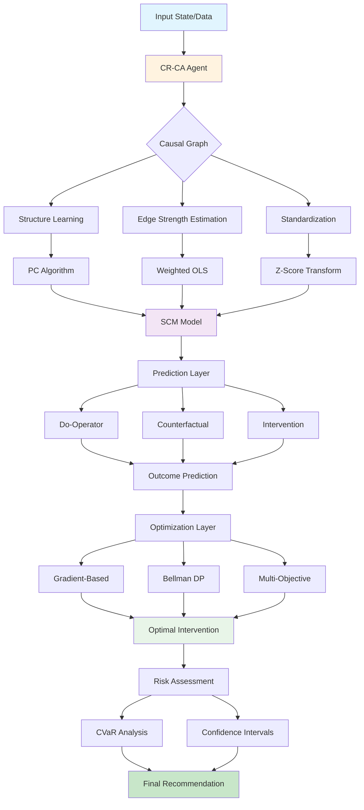

# CR-CA Agent

A revolutionary causal reasoning and counterfactual analysis agent that performs sophisticated causal inference to understand cause-and-effect relationships, predict outcomes of interventions, and explore alternative scenarios. The CR-CA Agent transforms resource management by enabling proactive issue resolution through deep causal analysis.

## Overview

The CR-CA (Causal Reasoning with Counterfactual Analysis) Agent implements advanced causal inference techniques based on Pearl's Structural Causal Model (SCM) framework. Unlike correlation-based approaches, the CR-CA Agent identifies true causal relationships, enabling reliable predictions about the effects of interventions and counterfactual reasoning about "what-if" scenarios.

**Key Capabilities:**

| Capability | Description |
|------------|-------------|
| **Causal Graph Construction** | Builds and maintains directed acyclic graphs (DAGs) representing causal relationships |
| **Structural Causal Modeling** | Implements linear and non-linear structural equation models with standardized coefficients |
| **Counterfactual Reasoning** | Performs Pearl's three-step abduction-action-prediction for counterfactual analysis |
| **Deep Root Cause Analysis** | Traces causal chains backward to identify ultimate root causes of problems |
| **Multi-Layer What-If Analysis** | Nests causal reasoning across multiple layers to predict cascading effects |
| **Optimal Intervention Planning** | Uses gradient-based optimization, dynamic programming, and multi-objective methods to find optimal interventions |
| **Risk-Aware Decision Making** | Quantifies uncertainty using CVaR, bootstrap confidence intervals, and Bayesian inference |
| **Temporal Causal Analysis** | Models distributed lag effects and vector autoregression for time-dependent systems |

## Architecture



## Getting Started

### Installation

The CR-CA Agent is included in the Swarms framework. Install Swarms:

```bash
pip install swarms
```

### Basic Usage Workflow

The typical workflow for using the CR-CA Agent involves:

1. **Initialize the agent** with a causal graph structure
2. **Fit the model** from historical data
3. **Make predictions** about intervention effects
4. **Optimize interventions** to achieve desired outcomes

### Step-by-Step Tutorial

#### Step 1: Import and Initialize

```python

from swarms.agents import CRCAAgent
import pandas as pd
import numpy as np

# Initialize the CR-CA agent
agent = CRCAAgent(
    name="my-causal-agent",
    description="Causal analysis for business decisions",
    model_name="gpt-4o-mini"  # For narrative generation
)
```

#### Step 2: Define Your Causal Graph

Define the causal relationships between variables. You can either:

**Option A: Build graph manually from domain knowledge**

```python
# Add variables
variables = ["price", "demand", "inventory", "cost", "profit"]

# Add causal relationships
agent.causal_graph.add_nodes_from(variables)
agent.causal_graph.add_edges_from([
    ("price", "demand"),      # Price affects demand
    ("demand", "inventory"),  # Demand affects inventory
    ("cost", "profit"),       # Cost affects profit
    ("demand", "profit"),     # Demand affects profit
    ("price", "cost")         # Price affects cost (indirectly)
])

# Add edge sign constraints (optional but recommended)
# +1 means positive effect, -1 means negative effect
agent.edge_sign_constraints = {
    ("price", "demand"): -1,      # Higher price → lower demand
    ("demand", "inventory"): -1,  # Higher demand → lower inventory
    ("cost", "profit"): -1,       # Higher cost → lower profit
    ("demand", "profit"): +1      # Higher demand → higher profit
}
```

**Option B: Discover structure from data**

```python
# If you have data but aren't sure about causal structure
historical_data = pd.DataFrame({
    "price": [...],
    "demand": [...],
    "inventory": [...],
    "cost": [...],
    "profit": [...]
})

# Discover causal structure using PC algorithm
learned_graph = agent.causal_discovery_pc_algorithm(
    df=historical_data,
    variables=["price", "demand", "inventory", "cost", "profit"],
    alpha=0.05
)

# Use the learned graph
agent.causal_graph = learned_graph["learned_dag"]
```

#### Step 3: Fit the Model from Data

Load your historical data and fit the causal model:

```python

# Prepare your historical data
historical_data = pd.DataFrame({
    "price": [100, 105, 110, 108, 112, 115, 110, 105, 100, 95],
    "demand": [1000, 950, 900, 920, 880, 850, 900, 950, 1000, 1050],
    "inventory": [5000, 4500, 4000, 4200, 3800, 3500, 4000, 4500, 5000, 5500],
    "cost": [80, 82, 85, 83, 87, 90, 85, 82, 80, 78],
    "profit": [20000, 19950, 19900, 19920, 19880, 19850, 19900, 19950, 20000, 20050]
})

# Fit the model (learns edge strengths from data)
agent.fit_from_dataframe(
    df=historical_data,
    variables=["price", "demand", "inventory", "cost", "profit"],
    window=10,           # Use last 10 observations
    decay_alpha=0.9,     # Weight recent data more (90% weight)
    ridge_lambda=0.01,   # Small regularization
    enforce_signs=True   # Respect sign constraints
)

# Check learned edge strengths
for u, v in agent.causal_graph.edges():
    strength = agent.causal_graph[u][v].get('strength', 0.0)
    print(f"{u} → {v}: strength = {strength:.3f}")
```

#### Step 4: Make Predictions

Predict outcomes given current state and interventions:

```python
# Current state
current_state = {
    "price": 100.0,
    "demand": 1000.0,
    "inventory": 5000.0,
    "cost": 80.0,
    "profit": 20000.0
}

# Scenario 1: What if we reduce price by 10%?
intervention = {"price": 90.0}

predicted = agent._predict_outcomes(current_state, intervention)
print(f"Predicted demand: {predicted['demand']:.2f}")
print(f"Predicted profit: {predicted['profit']:.2f}")

# Scenario 2: What if we reduce price AND increase inventory?
intervention = {"price": 90.0, "inventory": 6000.0}
predicted = agent._predict_outcomes(current_state, intervention)
```

#### Step 5: Counterfactual Analysis

Answer "what-if" questions using counterfactual reasoning:

```python
# What would have happened if price was 90 instead of 100?
factual_state = {"price": 100.0, "demand": 1000.0}
counterfactual_intervention = {"price": 90.0}

counterfactual_result = agent.counterfactual_abduction_action_prediction(
    factual_state=factual_state,
    interventions=counterfactual_intervention
)

print(f"Counterfactual demand: {counterfactual_result['demand']:.2f}")
```

#### Step 6: Find Optimal Interventions

Use optimization to find the best intervention:

```python
# Find optimal price to maximize profit
optimal = agent.gradient_based_intervention_optimization(
    initial_state=current_state,
    target="profit",              # What to maximize
    intervention_vars=["price"],  # What we can control
    constraints={"price": (80.0, 120.0)},  # Price bounds
    method="L-BFGS-B"
)

print(f"Optimal price: {optimal['optimal_intervention']['price']:.2f}")
print(f"Predicted profit: {optimal['optimal_target_value']:.2f}")
```

#### Step 7: Analyze Root Causes

Find root causes of problems:

```python
# Why is profit low?
root_causes = agent.deep_root_cause_analysis(
    problem_variable="profit",
    max_depth=10,
    min_path_strength=0.05
)

print("Ultimate root causes:")
for rc in root_causes["ultimate_root_causes"][:5]:
    print(f"  - {rc['root_cause']}: path strength = {rc['path_strength']:.3f}")
```

#### Step 8: Analyze Cascading Effects

Understand chain reactions from interventions:

```python
# Analyze cascading effects of price reduction
chain_reaction = agent.analyze_cascading_chain_reaction(
    initial_intervention={"price": 0.9},  # 10% reduction
    target_outcomes=["demand", "inventory", "profit"],
    max_hops=5,
    include_feedback_loops=True
)

print(f"Found {len(chain_reaction['causal_paths'])} causal paths")
print(f"Detected {len(chain_reaction['feedback_loops'])} feedback loops")
```

### Complete Example: Supply Chain Optimization

Here's a complete example for supply chain management:

```python
from swarms.agents import CRCAAgent
import pandas as pd
import numpy as np

# Step 1: Initialize
agent = CRCAAgent(name="supply-chain-optimizer")

# Step 2: Build causal graph
variables = ["lead_time", "supplier_capacity", "inventory", 
             "backlog", "price", "demand", "cost"]

agent.causal_graph.add_nodes_from(variables)
agent.causal_graph.add_edges_from([
    ("supplier_capacity", "inventory"),
    ("lead_time", "inventory"),
    ("inventory", "backlog"),
    ("backlog", "price"),
    ("price", "demand"),
    ("demand", "backlog"),
    ("lead_time", "cost"),
    ("inventory", "cost")
])

# Step 3: Load historical data
historical_data = pd.DataFrame({
    "lead_time": np.random.normal(10, 2, 100),
    "supplier_capacity": np.random.normal(1000, 100, 100),
    "inventory": np.random.normal(5000, 500, 100),
    "backlog": np.random.normal(100, 20, 100),
    "price": np.random.normal(100, 10, 100),
    "demand": np.random.normal(1000, 100, 100),
    "cost": np.random.normal(80, 8, 100)
})

# Step 4: Fit model
agent.fit_from_dataframe(
    df=historical_data,
    variables=variables,
    window=30,
    decay_alpha=0.9
)

# Step 5: Current state
current_state = {
    "lead_time": 12.0,
    "supplier_capacity": 950.0,
    "inventory": 4500.0,
    "backlog": 150.0,
    "price": 105.0,
    "demand": 900.0,
    "cost": 85.0
}

# Step 6: Find optimal safety stock (inventory level)
optimal_inventory = agent.gradient_based_intervention_optimization(
    initial_state=current_state,
    target="cost",  # Minimize cost
    intervention_vars=["inventory"],
    constraints={"inventory": (3000.0, 7000.0)}
)

print(f"Optimal inventory level: {optimal_inventory['optimal_intervention']['inventory']:.2f}")
print(f"Predicted cost: {optimal_inventory['optimal_target_value']:.2f}")

# Step 7: Analyze what-if scenarios
scenarios = [
    {"lead_time": 15.0},  # What if lead time increases?
    {"supplier_capacity": 800.0},  # What if supplier capacity decreases?
]

for scenario in scenarios:
    predicted = agent._predict_outcomes(current_state, scenario)
    print(f"\nScenario {scenario}:")
    print(f"  Predicted backlog: {predicted['backlog']:.2f}")
    print(f"  Predicted cost: {predicted['cost']:.2f}")

# Step 8: Root cause analysis for high backlog
backlog_roots = agent.deep_root_cause_analysis(
    problem_variable="backlog",
    max_depth=10,
    min_path_strength=0.05
)

print("\nRoot causes of high backlog:")
for rc in backlog_roots["ultimate_root_causes"][:3]:
    print(f"  - {rc['root_cause']}: {rc['path_string']}")
```

### Creating Custom Causal Models

#### For Financial Analysis

```python
# Cryptocurrency price analysis
agent = CRCAAgent(name="crypto-analyzer")

agent.causal_graph.add_edges_from([
    ("volume", "price"),
    ("volatility", "price"),
    ("rsi", "price"),
    ("market_sentiment", "price"),
    ("btc_correlation", "price")
])

# Fit from historical price data
agent.fit_from_dataframe(
    df=crypto_data,
    variables=["volume", "volatility", "rsi", "market_sentiment", 
               "btc_correlation", "price"],
    window=30
)

# Predict price impact of volume increase
prediction = agent._predict_outcomes(
    factual_state={"volume": 1000.0, "price": 3000.0},
    interventions={"volume": 1500.0}
)
```

#### For Policy Analysis

```python
# Government policy simulation
agent = CRCAAgent(name="policy-simulator")

agent.causal_graph.add_edges_from([
    ("tax_rate", "disposable_income"),
    ("disposable_income", "consumption"),
    ("consumption", "gdp"),
    ("cash_transfer", "disposable_income"),
    ("education_spending", "human_capital"),
    ("human_capital", "productivity")
])

# Fit from economic data
agent.fit_from_dataframe(
    df=economic_data,
    variables=["tax_rate", "cash_transfer", "disposable_income",
               "consumption", "gdp", "education_spending", 
               "human_capital", "productivity"],
    window=60
)

# Multi-objective optimization: maximize GDP and minimize inequality
pareto = agent.evolutionary_multi_objective_optimization(
    initial_state={"tax_rate": 0.3, "cash_transfer": 0.0},
    objectives={"gdp": 0.7, "inequality": -0.3},
    constraints={
        "tax_rate": (0.0, 0.5),
        "cash_transfer": (0.0, 1000.0)
    },
    intervention_vars=["tax_rate", "cash_transfer"]
)
```

### Next Steps

After creating your causal model:

1. **Validate the model** using cross-validation:
   ```python
   cv_result = agent.cross_validate_edge_strength(
       df=historical_data,
       parent="price",
       child="demand",
       n_folds=5
   )
   ```

2. **Quantify uncertainty** using bootstrap:
   ```python
   uncertainty = agent.quantify_uncertainty(
       df=historical_data,
       variables=variables,
       windows=200,
       alpha=0.95
   )
   ```

3. **Use explainability** to understand predictions:
   ```python
   attribution = agent.shapley_value_attribution(
       baseline_state=current_state,
       target_state=optimal_state,
       target="profit"
   )
   ```

## Mathematical Foundation

### Structural Causal Models (SCM)

The CR-CA Agent implements Pearl's Structural Causal Model framework, where each variable is defined by a structural equation:

\[
y = f(\text{parents}(y), \varepsilon_y)
\]

For linear SCMs:

\[
y = \sum_{i} \beta_i \cdot x_i + \varepsilon
\]

where \(\beta_i\) are structural coefficients representing causal effects, and \(\varepsilon\) is an error term representing unobserved confounders.

**Standardization:**

To ensure numerical stability and scale-invariance, all variables are standardized to z-scores:

\[
z = \frac{x - \mu}{\sigma}
\]

where \(\mu\) is the mean and \(\sigma\) is the standard deviation. This transformation allows the agent to work with variables of different scales while preserving causal relationships.

**Prediction in Z-Space:**

\[
z_y = \sum_{i} \beta_i \cdot z_{x_i} + z_\varepsilon
\]

After prediction, values are de-standardized:

\[
x = z \cdot \sigma + \mu
\]

### Do-Operator

The do-operator, \(do(X = x)\), represents an intervention that sets variable \(X\) to value \(x\), breaking its dependence on its parents. This is fundamentally different from conditioning \(P(Y \mid X = x)\), as it represents active manipulation rather than passive observation.

**Mathematical Definition:**

\[
P(Y \mid do(X = x)) \neq P(Y \mid X = x)
\]

The do-operator enables answering interventional questions: "What would happen if we set \(X\) to \(x\)?"

### Counterfactual Reasoning

Pearl's three-step counterfactual reasoning process:

**1. Abduction:**
Infer latent noise terms from factual observations:

\[
\varepsilon = y_{\text{factual}} - \sum_i \beta_i \cdot x_{\text{factual},i}
\]

**2. Action:**
Apply do-operator to set intervention values:

\[
do(X = x^*)
\]

**3. Prediction:**
Predict counterfactual outcome using new values but old noise:

\[
y_{\text{cf}} = \sum_i \beta_i \cdot x_{\text{cf},i} + \varepsilon
\]

This answers: "What would have happened if \(X\) had been \(x^*\) instead of \(x_{\text{factual}}\)?"

## Class Reference

### Constructor

```python
from swarms.agents import CRCAAgent

agent = CRCAAgent(
    name: str = "cr-ca-agent",
    description: str = "Causal Reasoning with Counterfactual Analysis agent",
    model_name: str = "openai/gpt-4o",
    max_loops: int = 3,
    causal_graph: Optional[nx.DiGraph] = None,
    variables: Optional[List[str]] = None,
    causal_edges: Optional[List[Tuple[str, str]]] = None,
)
```

#### Parameters

| Parameter | Type | Default | Description |
|-----------|------|---------|-------------|
| `name` | `str` | `"cr-ca-agent"` | Unique identifier for the agent instance |
| `description` | `str` | `"Causal Reasoning..."` | Human-readable description of agent capabilities |
| `model_name` | `str` | `"openai/gpt-4o"` | LLM model for narrative generation and reasoning |
| `max_loops` | `int` | `3` | Maximum iterations for causal reasoning loops |
| `causal_graph` | `Optional[nx.DiGraph]` | `None` | Pre-built NetworkX directed graph (DAG) |
| `variables` | `Optional[List[str]]` | `None` | List of variable names to initialize graph |
| `causal_edges` | `Optional[List[Tuple[str, str]]]` | `None` | List of (source, target) tuples for causal edges |

### Core Methods

#### fit_from_dataframe()

Fit edge strengths and standardization statistics from historical data using weighted least squares regression.

```python
fit_from_dataframe(
    df: pd.DataFrame,
    variables: List[str],
    window: int = 30,
    decay_alpha: float = 0.9,
    ridge_lambda: float = 0.0,
    enforce_signs: bool = True
) -> None
```

**Mathematical Formulation:**

For each child variable \(y\) with parents \(\{x_1, x_2, \ldots, x_k\}\), the agent estimates coefficients \(\beta_i\) using weighted least squares:

\[
\beta = (X' W X + \lambda I)^{-1} X' W y
\]

where:
- \(X\) is the standardized design matrix of parents
- \(W\) is a diagonal matrix of exponential decay weights: \(w_i = \alpha^{n-1-i}\) (newer data weighted more)
- \(\lambda\) is ridge regularization parameter
- \(y\) is the standardized target variable

**Exponential Decay Weights:**

\[
w_i = \frac{\alpha^{n-1-i}}{\sum_{j=0}^{n-1} \alpha^{n-1-j}}
\]

This emphasizes recent observations, making the model adaptive to regime changes.

**Example:**

```python
import pandas as pd
from swarms.agents import CRCAAgent

# Initialize agent
agent = CRCAAgent()

# Build causal graph
agent.causal_graph.add_edges_from([
    ("price", "demand"),
    ("demand", "orders"),
    ("orders", "inventory")
])

# Fit from historical data
df = pd.DataFrame({
    "price": [100, 105, 110, 108, 112],
    "demand": [1000, 950, 900, 920, 880],
    "orders": [1000, 950, 900, 920, 880],
    "inventory": [5000, 4500, 4000, 4200, 3800]
})

agent.fit_from_dataframe(
    df=df,
    variables=["price", "demand", "orders", "inventory"],
    window=5,
    decay_alpha=0.9
)
```

#### _predict_outcomes()

Predict outcomes given interventions using standardized linear propagation through the causal graph.

```python
_predict_outcomes(
    factual_state: Dict[str, float],
    interventions: Dict[str, float],
    use_cache: bool = True
) -> Dict[str, float]
```

**Mathematical Process:**

1. **Standardize inputs:** Convert all variables to z-scores
2. **Topological propagation:** For each node in topological order:
   - If intervened: set \(z_{\text{node}} = z_{\text{intervention}}\) (do-operator)
   - Otherwise: compute \(z_{\text{node}} = \sum_i \beta_i \cdot z_{\text{parent}_i}\)
3. **De-standardize outputs:** Convert z-scores back to raw values

**Example:**

```python
# Current state
factual_state = {
    "price": 100.0,
    "demand": 1000.0,
    "orders": 1000.0
}

# Intervention: reduce price by 10%
interventions = {"price": 90.0}

# Predict outcomes
predicted = agent._predict_outcomes(factual_state, interventions)
# Result: {"price": 90.0, "demand": 1100.0, "orders": 1100.0, ...}
```

#### counterfactual_abduction_action_prediction()

Perform Pearl's three-step counterfactual reasoning for "what-if" analysis.

```python
counterfactual_abduction_action_prediction(
    factual_state: Dict[str, float],
    interventions: Dict[str, float]
) -> Dict[str, float]
```

**Example:**

```python
# What if we had set price to 90 instead of 100?
factual = {"price": 100.0, "demand": 1000.0}
counterfactual = {"price": 90.0}

result = agent.counterfactual_abduction_action_prediction(
    factual_state=factual,
    interventions=counterfactual
)
# Result shows what demand would have been if price was 90
```

### Advanced Causal Analysis

#### deep_root_cause_analysis()

Trace causal chains backward to identify ultimate root causes of problems.

```python
deep_root_cause_analysis(
    problem_variable: str,
    max_depth: int = 20,
    min_path_strength: float = 0.01
) -> Dict[str, Any]
```

**Mathematical Formulation:**

Path strength is computed as the product of edge strengths along the path:

\[
\text{Path Strength} = \prod_{(i,j) \in \text{Path}} \beta_{ij}
\]

Root causes are ranked using multi-objective criteria:

\[
f(\text{rc}) = w_1 \cdot I_{\text{exo}}(\text{rc}) + w_2 \cdot S_{\text{path}}(\text{rc}) - w_3 \cdot D(\text{rc})
\]

where:
- \(I_{\text{exo}}\) is indicator for exogenous nodes (true root causes)
- \(S_{\text{path}}\) is path strength
- \(D\) is depth (distance from problem)

**Example:**

```python
# Find root causes of high backlog
root_causes = agent.deep_root_cause_analysis(
    problem_variable="backlog",
    max_depth=15,
    min_path_strength=0.05
)

# Returns:
# {
#     "ultimate_root_causes": [
#         {
#             "root_cause": "supplier_capacity",
#             "is_exogenous": True,
#             "path_strength": 0.85,
#             "depth": 3
#         }
#     ],
#     "intervention_opportunities": [...]
# }
```

#### multi_layer_whatif_analysis()

Perform nested counterfactual reasoning across multiple layers to predict cascading effects.

```python
multi_layer_whatif_analysis(
    scenarios: List[Dict[str, float]],
    depth: int = 3
) -> Dict[str, Any]
```

**Process:**

1. **Layer 1:** Direct effects of intervention
2. **Layer 2:** Effects of affected variables on other variables
3. **Layer 3+:** Deep cascade analysis using chain reaction detection

**Example:**

```python
scenarios = [{"price": 90.0}]  # What if price drops to 90?

result = agent.multi_layer_whatif_analysis(
    scenarios=scenarios,
    depth=5
)

# Analyzes:
# - Layer 1: Direct effect on demand
# - Layer 2: How demand affects inventory, lead times
# - Layer 3+: Cascading effects through entire system
```

#### analyze_cascading_chain_reaction()

Analyze multi-layer cascading chain reactions from an intervention, including feedback loops.

```python
analyze_cascading_chain_reaction(
    initial_intervention: Dict[str, float],
    target_outcomes: List[str],
    max_hops: int = 5,
    include_feedback_loops: bool = True,
    num_iterations: int = 3
) -> Dict[str, Any]
```

**Mathematical Formulation:**

For each causal path from intervention variables to outcomes:

\[
\text{Path Strength} = \prod_{(i,j) \in \text{Path}} \beta_{ij}
\]

Cascade probability is estimated using softmax-style normalization:

\[
P(\text{cascade}) = \min(0.95, \text{Path Strength} \cdot 0.5 + 0.05)
\]

**Example:**

```python
# Analyze chain reaction from price reduction
chain_reaction = agent.analyze_cascading_chain_reaction(
    initial_intervention={"price": 0.9},  # 10% reduction
    target_outcomes=["demand", "inventory", "cost"],
    max_hops=5,
    include_feedback_loops=True
)

# Identifies:
# - All causal paths from price to outcomes
# - Feedback loops that could amplify effects
# - Cascade probabilities and cumulative effects
```

### Optimization Methods

#### gradient_based_intervention_optimization()

Find optimal interventions using gradient-based optimization.

```python
gradient_based_intervention_optimization(
    initial_state: Dict[str, float],
    target: str,
    intervention_vars: List[str],
    constraints: Optional[Dict[str, Tuple[float, float]]] = None,
    method: str = "L-BFGS-B"
) -> Dict[str, Any]
```

**Mathematical Formulation:**

Objective: maximize predicted outcome

\[
\max_{\theta} y(\theta)
\]

where \(\theta\) is the intervention vector and \(y(\theta)\) is the predicted outcome.

Gradient computation using finite differences:

\[
\frac{\partial y}{\partial \theta_i} \approx \frac{y(\theta + \varepsilon \cdot e_i) - y(\theta)}{\varepsilon}
\]

Update rule (gradient descent):

\[
\theta_{k+1} = \theta_k - \alpha \cdot \nabla_\theta y(\theta_k)
\]

**Example:**

```python
# Find optimal price to maximize profit
optimal = agent.gradient_based_intervention_optimization(
    initial_state={"price": 100.0, "demand": 1000.0},
    target="profit",
    intervention_vars=["price"],
    constraints={"price": (80.0, 120.0)},
    method="L-BFGS-B"
)

# Returns optimal price and predicted profit
```

#### bellman_optimal_intervention()

Dynamic programming (Bellman optimality) for optimal intervention sequences.

```python
bellman_optimal_intervention(
    initial_state: Dict[str, float],
    target: str,
    intervention_vars: List[str],
    horizon: int = 5,
    discount: float = 0.9
) -> Dict[str, Any]
```

**Mathematical Formulation:**

Value function (Bellman equation):

\[
V^*(x_t) = \max_{u_t} \left[ r(x_t, u_t) + \gamma \cdot V^*(f(x_t, u_t)) \right]
\]

Optimal policy:

\[
\pi^*(x_t) = \arg\max_{u_t} \left[ r(x_t, u_t) + \gamma \cdot V^*(f(x_t, u_t)) \right]
\]

where:
- \(r(x_t, u_t)\) is immediate reward
- \(\gamma \in [0,1]\) is discount factor
- \(f(x_t, u_t)\) is system dynamics (next state)

**Example:**

```python
# Find optimal sequence of price adjustments over 5 periods
sequence = agent.bellman_optimal_intervention(
    initial_state={"price": 100.0, "demand": 1000.0},
    target="total_profit",
    intervention_vars=["price"],
    horizon=5,
    discount=0.9
)

# Returns optimal price trajectory: [100, 95, 92, 90, 88]
```

#### evolutionary_multi_objective_optimization()

Evolutionary algorithm (NSGA-II inspired) for multi-objective optimization.

```python
evolutionary_multi_objective_optimization(
    initial_state: Dict[str, float],
    objectives: Dict[str, float],  # {var: weight}
    constraints: Dict[str, Tuple[float, float]],
    intervention_vars: List[str],
    population_size: int = 50,
    generations: int = 100
) -> Dict[str, Any]
```

**Mathematical Formulation:**

Weighted sum scalarization:

\[
F(x) = \sum_i w_i \cdot f_i(x)
\]

Pareto dominance: solution \(x_1\) dominates \(x_2\) if:

\[
\forall i: f_i(x_1) \geq f_i(x_2) \quad \land \quad \exists j: f_j(x_1) > f_j(x_2)
\]

**Example:**

```python
# Optimize for both profit and customer satisfaction
pareto = agent.evolutionary_multi_objective_optimization(
    initial_state={"price": 100.0},
    objectives={"profit": 0.7, "satisfaction": 0.3},
    constraints={"price": (80.0, 120.0)},
    intervention_vars=["price"],
    population_size=50,
    generations=100
)

# Returns Pareto frontier of non-dominated solutions
```

### Information Theory Methods

#### compute_information_theoretic_measures()

Compute entropy, mutual information, and conditional mutual information.

```python
compute_information_theoretic_measures(
    df: pd.DataFrame,
    variables: List[str]
) -> Dict[str, Any]
```

**Mathematical Formulations:**

**Shannon Entropy:**

\[
H(X) = -\sum_i p(x_i) \log_2 p(x_i)
\]

**Mutual Information:**

\[
I(X;Y) = H(X) + H(Y) - H(X,Y) = \sum_{x,y} p(x,y) \log_2 \frac{p(x,y)}{p(x)p(y)}
\]

**Conditional Mutual Information:**

\[
I(X;Y|Z) = H(X,Z) + H(Y,Z) - H(X,Y,Z) - H(Z)
\]

**Example:**

```python
measures = agent.compute_information_theoretic_measures(
    df=historical_data,
    variables=["price", "demand", "inventory"]
)

# Returns:
# {
#     "entropies": {"price": 3.2, "demand": 4.1, ...},
#     "mutual_information": {"price;demand": 0.85, ...},
#     "conditional_mi": {...}
# }
```

### Time Series Analysis

#### granger_causality_test()

Test whether one variable Granger-causes another (helps predict it).

```python
granger_causality_test(
    df: pd.DataFrame,
    var1: str,
    var2: str,
    max_lag: int = 4
) -> Dict[str, Any]
```

**Mathematical Formulation:**

Restricted model (without var1):

\[
y_t = \alpha + \sum_{i=1}^m \beta_i y_{t-i} + \varepsilon_t
\]

Unrestricted model (with var1):

\[
y_t = \alpha + \sum_{i=1}^m \beta_i y_{t-i} + \sum_{i=1}^m \gamma_i x_{t-i} + \varepsilon_t
\]

F-statistic:

\[
F = \frac{(RSS_r - RSS_u)/m}{RSS_u/(n-2m-1)}
\]

**Example:**

```python
# Test if price changes Granger-cause demand changes
result = agent.granger_causality_test(
    df=time_series_data,
    var1="price",
    var2="demand",
    max_lag=4
)

# Returns F-statistic, p-value, and causality decision
```

#### vector_autoregression_estimation()

Estimate Vector Autoregression (VAR) model for multivariate time series.

```python
vector_autoregression_estimation(
    df: pd.DataFrame,
    variables: List[str],
    max_lag: int = 2
) -> Dict[str, Any]
```

**Mathematical Formulation:**

VAR(p) model:

\[
\mathbf{x}_t = \mathbf{A}_1 \mathbf{x}_{t-1} + \mathbf{A}_2 \mathbf{x}_{t-2} + \ldots + \mathbf{A}_p \mathbf{x}_{t-p} + \boldsymbol{\varepsilon}_t
\]

where \(\mathbf{A}_i\) are coefficient matrices and \(\boldsymbol{\varepsilon}_t\) is white noise.

**Example:**

```python
var_model = agent.vector_autoregression_estimation(
    df=time_series_data,
    variables=["price", "demand", "inventory"],
    max_lag=2
)

# Returns coefficient matrices and residuals
```

### Causal Discovery

#### causal_discovery_pc_algorithm()

PC algorithm for causal structure discovery from data.

```python
causal_discovery_pc_algorithm(
    df: pd.DataFrame,
    variables: List[str],
    alpha: float = 0.05
) -> Dict[str, Any]
```

**Algorithm Steps:**

1. Start with complete undirected graph
2. Remove edges if variables are conditionally independent given any subset
3. Orient edges using v-structure detection
4. Apply orientation rules (Meek's rules)

**Example:**

```python
# Learn causal structure from data
learned_graph = agent.causal_discovery_pc_algorithm(
    df=historical_data,
    variables=["price", "demand", "inventory", "cost"],
    alpha=0.05
)

# Returns learned DAG structure
```

### Risk and Uncertainty Quantification

#### quantify_uncertainty()

Bootstrap edge strengths and produce confidence intervals.

```python
quantify_uncertainty(
    df: pd.DataFrame,
    variables: List[str],
    windows: int = 200,
    alpha: float = 0.95
) -> Dict[str, Any]
```

**Bootstrap Process:**

1. Sample data with replacement
2. Re-estimate edge strengths
3. Compute confidence intervals from bootstrap distribution

**Confidence Interval:**

\[
CI_{1-\alpha} = [Q_{\alpha/2}, Q_{1-\alpha/2}]
\]

where \(Q_p\) is the p-th quantile of bootstrap distribution.

**Example:**

```python
uncertainty = agent.quantify_uncertainty(
    df=historical_data,
    variables=["price", "demand"],
    windows=200,
    alpha=0.95
)

# Returns 95% confidence intervals for all edge strengths
```

#### bayesian_edge_inference()

Bayesian inference for edge strength using conjugate prior.

```python
bayesian_edge_inference(
    df: pd.DataFrame,
    parent: str,
    child: str,
    prior_mu: float = 0.0,
    prior_sigma: float = 1.0
) -> Dict[str, Any]
```

**Mathematical Formulation:**

Prior: \(\beta \sim N(\mu_0, \sigma_0^2)\)

Posterior: \(\beta \mid \text{data} \sim N(\mu_n, \sigma_n^2)\)

Posterior mean:

\[
\mu_n = \frac{\tau_0 \mu_0 + \tau_{\text{likelihood}} \cdot n \cdot \hat{\beta}_{\text{OLS}}}{\tau_0 + \tau_{\text{likelihood}} \cdot n}
\]

where \(\tau = 1/\sigma^2\) is precision.

**Example:**

```python
# Bayesian inference for price -> demand effect
posterior = agent.bayesian_edge_inference(
    df=historical_data,
    parent="price",
    child="demand",
    prior_mu=0.0,
    prior_sigma=1.0
)

# Returns posterior mean, variance, and credible intervals
```

## Real-World Applications

### Supply Chain Management

The CR-CA Agent revolutionizes supply chain management by identifying root causes of disruptions and optimizing inventory policies.

**Example: Supply Shock Analysis**

```python
from swarms.agents import CRCAAgent

# Initialize agent for supply chain
agent = CRCAAgent(
    name="supply-chain-crca",
    description="Supply chain causal analysis"
)

# Build causal graph
agent.causal_graph.add_edges_from([
    ("lead_time", "receipts"),
    ("survivability", "receipts"),
    ("capacity", "receipts"),
    ("receipts", "inventory"),
    ("backlog", "price"),
    ("price", "demand"),
    ("demand", "orders")
])

# Fit from historical data
agent.fit_from_dataframe(
    df=supply_chain_data,
    variables=["lead_time", "receipts", "inventory", "backlog", "price", "demand"],
    window=30,
    decay_alpha=0.9
)

# Analyze port disruption scenario
disruption_analysis = agent.analyze_cascading_chain_reaction(
    initial_intervention={"lead_time": 1.5},  # 50% increase
    target_outcomes=["inventory", "backlog", "cost"],
    max_hops=5,
    include_feedback_loops=True
)

# Find optimal safety stock policy
optimal_policy = agent.gradient_based_intervention_optimization(
    initial_state={"safety_stock": 100.0, "backlog": 50.0},
    target="cost",  # Minimize total cost
    intervention_vars=["safety_stock"],
    constraints={"safety_stock": (50.0, 200.0)}
)
```

**Key Benefits:**

1. **Proactive Issue Resolution:** Identifies root causes before they escalate
2. **Optimized Resource Allocation:** Uses causal understanding to allocate safety stock efficiently
3. **Predictive Insights:** Anticipates supply shocks and their cascading effects
4. **Risk-Aware Decisions:** Quantifies uncertainty using CVaR and confidence intervals

### Financial Market Analysis

The CR-CA Agent enables sophisticated causal analysis of market dynamics, going beyond correlation to understand true causal drivers.

**Example: Cryptocurrency Price Analysis**

```python
# Build causal graph for ETH price analysis
agent = CRCAAgent(name="eth-price-analyzer")

agent.causal_graph.add_edges_from([
    ("volume", "price"),
    ("volatility", "price"),
    ("rsi", "price"),
    ("momentum", "price"),
    ("market_sentiment", "price"),
    ("btc_eth_corr", "price")
])

# Fit from historical price data
agent.fit_from_dataframe(
    df=eth_price_data,
    variables=["volume", "volatility", "rsi", "momentum", "market_sentiment", "btc_eth_corr", "price"],
    window=30
)

# Perform causal analysis
causal_analysis = agent.causal_analysis()

# Test Granger causality
granger_result = agent.granger_causality_test(
    df=eth_price_data,
    var1="volume",
    var2="price",
    max_lag=4
)

# Find optimal trading intervention
optimal_trade = agent.gradient_based_intervention_optimization(
    initial_state={"holdings": 0.0},
    target="expected_return",
    intervention_vars=["position_size"],
    constraints={"position_size": (-1.0, 1.0)}
)
```

**Key Benefits:**

1. **Causal Understanding:** Distinguishes true causal drivers from spurious correlations
2. **Predictive Power:** Forecasts price movements based on causal relationships
3. **Risk Management:** Quantifies uncertainty in predictions using confidence intervals
4. **Optimal Strategies:** Finds trading strategies that maximize risk-adjusted returns

### Government Policy Simulation

The CR-CA Agent enables sophisticated policy analysis by modeling causal relationships between policy interventions and social outcomes.

**Example: Economic Policy Analysis**

```python
# Government policy simulation
agent = CRCAAgent(name="policy-simulator")

# Build comprehensive causal graph
agent.causal_graph.add_edges_from([
    ("income_tax_rate", "disposable_income"),
    ("disposable_income", "consumption"),
    ("consumption", "gdp"),
    ("cash_transfer", "disposable_income"),
    ("carbon_tax", "emissions"),
    ("emissions", "health_outcomes"),
    ("education_spending", "human_capital"),
    ("human_capital", "productivity")
])

# Fit from economic data
agent.fit_from_dataframe(
    df=economic_data,
    variables=["income_tax_rate", "cash_transfer", "carbon_tax", 
               "disposable_income", "consumption", "gdp", 
               "emissions", "health_outcomes", "inequality"],
    window=60
)

# Multi-objective optimization: maximize welfare while minimizing inequality
pareto_frontier = agent.evolutionary_multi_objective_optimization(
    initial_state={"income_tax_rate": 0.3, "cash_transfer": 0.0},
    objectives={"welfare": 0.7, "inequality": -0.3},  # Negative for minimization
    constraints={
        "income_tax_rate": (0.0, 0.5),
        "cash_transfer": (0.0, 1000.0)
    },
    intervention_vars=["income_tax_rate", "cash_transfer"],
    population_size=100,
    generations=200
)

# Deep root cause analysis of poverty
poverty_roots = agent.deep_root_cause_analysis(
    problem_variable="poverty_rate",
    max_depth=20,
    min_path_strength=0.05
)
```

**Key Benefits:**

1. **Evidence-Based Policy:** Uses causal inference to evaluate policy effectiveness
2. **Multi-Objective Optimization:** Balances competing objectives (growth vs. equality)
3. **Counterfactual Analysis:** Answers "what-if" questions about policy alternatives
4. **Root Cause Identification:** Traces social problems to their fundamental causes

## Advanced Features

### Explainability

#### shapley_value_attribution()

Fair attribution of causal effects using Shapley values from cooperative game theory.

```python
shapley_value_attribution(
    baseline_state: Dict[str, float],
    target_state: Dict[str, float],
    target: str
) -> Dict[str, float]
```

**Mathematical Formulation:**

Shapley value for variable \(i\):

\[
\phi_i = \sum_{S \subseteq N \setminus \{i\}} \frac{|S|!(n-|S|-1)!}{n!} \left[v(S \cup \{i\}) - v(S)\right]
\]

where \(v(S)\) is the outcome when variables in \(S\) are set to target values.

**Properties:**
- **Efficiency:** \(\sum_i \phi_i = v(N) - v(\emptyset)\)
- **Symmetry:** Variables with identical contributions have equal Shapley values
- **Dummy:** Variables with no effect have zero Shapley value
- **Additivity:** Shapley values are additive across games

#### integrated_gradients_attribution()

Path-integrated gradients for causal attribution.

```python
integrated_gradients_attribution(
    baseline_state: Dict[str, float],
    target_state: Dict[str, float],
    target: str,
    n_steps: int = 50
) -> Dict[str, float]
```

**Mathematical Formulation:**

Integrated gradient along path from baseline \(x^0\) to target \(x\):

\[
IG_i = (x_i - x_i^0) \cdot \int_0^1 \frac{\partial f}{\partial x_i}(x^0 + t \cdot (x - x^0)) \, dt
\]

Approximated using Riemann sum:

\[
IG_i \approx (x_i - x_i^0) \cdot \frac{1}{m} \sum_{j=1}^m \frac{\partial f}{\partial x_i}\left(x^0 + \frac{j}{m}(x - x^0)\right)
\]

### Non-Linear Extensions

#### nonlinear_scm_prediction()

Non-linear SCM with interaction terms.

```python
nonlinear_scm_prediction(
    factual_state: Dict[str, float],
    interventions: Dict[str, float],
    include_interactions: bool = True
) -> Dict[str, float]
```

**Mathematical Formulation:**

Extended model with interactions:

\[
y = \sum_i \beta_i \cdot x_i + \sum_{i,j} \gamma_{ij} \cdot x_i \cdot x_j + \varepsilon
\]

where \(\gamma_{ij}\) are interaction coefficients.

**Example:**

```python
# Add interaction term: price × advertising
agent.add_interaction_term(
    node="demand",
    parent1="price",
    parent2="advertising",
    interaction_strength=0.15
)

# Predict with interactions
predicted = agent.nonlinear_scm_prediction(
    factual_state={"price": 100.0, "advertising": 1000.0},
    interventions={},
    include_interactions=True
)
```

### Temporal Causal Analysis

#### temporal_causal_chain_analysis()

Model distributed lag effects in causal systems.

```python
temporal_causal_chain_analysis(
    initial_intervention: Dict[str, float],
    target: str,
    time_horizon: int = 10,
    lag_structure: Optional[Dict[Tuple[str, str], int]] = None
) -> Dict[str, Any]
```

**Mathematical Formulation:**

Distributed lag model:

\[
y_j(t + \tau_{ij}) = \beta_{ij} \cdot x_i(t)
\]

where \(\tau_{ij}\) is the lag for edge \((i,j)\).

Accumulated effect:

\[
y(t) = \sum_i \sum_k \beta_{ij} \cdot x_i(t - \tau_k)
\]

**Example:**

```python
# Model that policy changes take 2 periods to affect economy
lag_structure = {
    ("tax_rate", "gdp"): 2,
    ("spending", "gdp"): 1
}

temporal_analysis = agent.temporal_causal_chain_analysis(
    initial_intervention={"tax_rate": 0.25},
    target="gdp",
    time_horizon=10,
    lag_structure=lag_structure
)

# Shows GDP trajectory over 10 periods with delayed effects
```

## Best Practices

### 1. Causal Graph Construction

**Start with domain knowledge:** Use expert knowledge to initialize the causal graph before data-driven refinement.

```python
# Good: Start with known causal structure
agent.causal_graph.add_edges_from([
    ("cause", "effect"),  # Known from domain knowledge
])

# Then refine with data
agent.fit_from_dataframe(df, variables)
```

**Validate with data:** Use `causal_discovery_pc_algorithm()` to validate and refine the graph structure.

### 2. Data Preparation

**Ensure sufficient data:** The agent requires at least 30 observations per variable for reliable estimation.

**Handle missing values:** The agent automatically handles missing values, but ensure sufficient complete cases.

**Standardize scales:** While the agent standardizes internally, ensure variables are in reasonable ranges.

### 3. Model Validation

**Cross-validation:** Use `cross_validate_edge_strength()` to validate edge strength estimates.

```python
cv_result = agent.cross_validate_edge_strength(
    df=historical_data,
    parent="price",
    child="demand",
    n_folds=5
)

# Lower CV error indicates more reliable estimates
```

**Bootstrap confidence intervals:** Use `quantify_uncertainty()` to assess estimation uncertainty.

### 4. Intervention Design

**Use constraints:** Always specify realistic constraints for interventions.

```python
optimal = agent.gradient_based_intervention_optimization(
    initial_state=current_state,
    target="profit",
    intervention_vars=["price"],
    constraints={"price": (min_price, max_price)}  # Always specify bounds
)
```

**Consider risk:** Use CVaR-based risk metrics for high-stakes decisions.

### 5. Interpretation

**Use explainability methods:** Leverage Shapley values and integrated gradients to understand model decisions.

```python
# Understand why model recommends specific intervention
attribution = agent.shapley_value_attribution(
    baseline_state=current_state,
    target_state=recommended_state,
    target="profit"
)

# Shows contribution of each variable to predicted profit
```

## Performance Considerations

### Caching

The agent automatically caches prediction results to improve performance:

```python
# Enable/disable caching
agent._cache_enabled = True
agent._cache_max_size = 1000  # Maximum cache entries

# Clear cache when needed
agent.clear_cache()
```

### Vectorization

For batch predictions, use `vectorized_batch_prediction()`:

```python
# Process multiple interventions efficiently
interventions = [
    {"price": 90.0},
    {"price": 95.0},
    {"price": 100.0}
]

predictions = agent.vectorized_batch_prediction(
    initial_state=base_state,
    intervention_batch=interventions
)
```

### Computational Complexity

- **Graph fitting:** O(n × m × k) where n is window size, m is number of edges, k is number of variables
- **Prediction:** O(k) where k is number of variables (linear in graph size)
- **Root cause analysis:** O(k × d) where d is maximum depth
- **Optimization:** Varies by method (gradient: O(iterations × k), evolutionary: O(population × generations × k))

## Limitations and Considerations

1. **DAG Assumption:** The agent assumes acyclic causal graphs. Cycles are automatically removed by eliminating weakest edges.

2. **Linearity:** Default model assumes linear relationships. Use `nonlinear_scm_prediction()` for non-linear effects.

3. **Confounders:** Unobserved confounders can bias estimates. Use domain knowledge to identify and adjust for known confounders.

4. **Sample Size:** Requires sufficient data (typically 30+ observations per variable) for reliable estimation.

5. **Causal Discovery:** Structure learning (PC algorithm) is simplified. For complex discovery, consider external tools like TETRAD or PC-stable.

## Conclusion

The CR-CA Agent represents a paradigm shift in decision-making systems, moving from correlation-based predictions to causal understanding. By implementing Pearl's Structural Causal Model framework with advanced optimization and risk quantification, it enables:

- **Proactive Problem Solving:** Identify root causes before issues escalate
- **Evidence-Based Decisions:** Use causal inference to evaluate interventions
- **Optimal Resource Allocation:** Optimize policies based on causal understanding
- **Risk-Aware Planning:** Quantify and manage uncertainty in predictions

Whether applied to supply chain management, financial analysis, or policy simulation, the CR-CA Agent transforms how organizations understand and manage complex systems.

## References

- Pearl, J. (2009). *Causality: Models, Reasoning, and Inference*. Cambridge University Press.
- Pearl, J., & Mackenzie, D. (2018). *The Book of Why: The New Science of Cause and Effect*. Basic Books.
- Spirtes, P., Glymour, C., & Scheines, R. (2000). *Causation, Prediction, and Search*. MIT Press.
- Peters, J., Janzing, D., & Schölkopf, B. (2017). *Elements of Causal Inference*. MIT Press.

