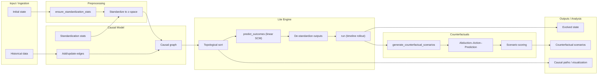

# CRCAgent

Short summary
-------------
CRCAgent is a lightweight, auditable causal simulation core implemented in
pure Python and intended as the deterministic CR‑CA engine for Swarms.
It focuses on the core ASTT primitives: a causal DAG, a linear structural
evolution operator (in z-space), and compact counterfactual generation.

Key properties
- Minimal dependencies (numpy + stdlib)
- Pure-Python causal graph (adjacency dicts)
- Linear SCM evolution by default (overrideable)
- Agent-first `run()` entrypoint (accepts dict or JSON payloads)

Canonical import
----------------
Use the canonical agent import in application code:

```python
from swarms.agents.cr_ca_agent import CRCAgent
```

Quickstart
----------
Minimal example — initialize, add edges, evolve state and get counterfactuals:

```python
from swarms.agents.cr_ca_agent import CRCAgent

agent = CRCAgent(variables=["price", "demand", "inventory"])
agent.add_causal_relationship("price", "demand", strength=-0.5)
agent.add_causal_relationship("demand", "inventory", strength=-0.2)

state = {"price": 100.0, "demand": 1000.0, "inventory": 5000.0}
out = agent.run(state, target_variables=["price", "demand"], max_steps=1)

print("Evolved:", out["evolved_state"])            # evolved world state
for sc in out["counterfactual_scenarios"][:5]:      # candidate CFs
    print(sc.name, sc.interventions, sc.probability)
```

Agent-style JSON payload example (orchestrators)
------------------------------------------------

```python
import json
from swarms.agents.cr_ca_agent import CRCAgent

agent = CRCAgent(variables=["price","demand","inventory"])
payload = json.dumps({"price": 100.0, "demand": 1000.0})
out = agent.run(payload, target_variables=["price"], max_steps=1)
print(out["evolved_state"])
```

Why use `run()`
--------------
- Accepts both dict and JSON payloads for flexible integration.
- Evolves the world state for `max_steps` using the deterministic evolution
  operator, then generates counterfactuals from the evolved state (consistent timelines).
- Returns a compact result dict used across Swarms agents.

Architecture (high level)
-------------------------



Complete method index (quick)
-----------------------------
The following is the public surface implemented by `CRCAgent` in
`swarms/agents/cr_ca_agent.py`. See the code for full docstrings and math.

Core graph & state
- `_ensure_node_exists(node)` — ensure node present in internal maps
- `add_causal_relationship(source, target, strength=1.0, ...)` — add/update edge
- `_get_parents(node)`, `_get_children(node)` — graph accessors
- `_topological_sort()` — Kahn's algorithm
- `get_nodes()`, `get_edges()`, `is_dag()` — graph introspection

Standardization & prediction
- `set_standardization_stats(var, mean, std)` — set z-stats
- `ensure_standardization_stats(state)` — auto-fill sensible stats
- `_standardize_state(state)` / `_destandardize_value(var, z)` — z-score transforms
- `_predict_outcomes(factual_state, interventions)` — evolution operator (linear SCM)
- `_predict_outcomes_cached(...)` — cached wrapper

Counterfactuals & reasoning
- `generate_counterfactual_scenarios(factual_state, target_variables, max_scenarios=5)`
- `_calculate_scenario_probability(factual_state, interventions)` — heuristic plausibility
- `counterfactual_abduction_action_prediction(factual_state, interventions)` — abduction–action–prediction (Pearl)

Estimation, analysis & utilities
- `fit_from_dataframe(df, variables, window=30, ...)` — WLS edge estimation and stats
- `quantify_uncertainty(df, variables, windows=200, ...)` — bootstrap CIs
- `analyze_causal_strength(source, target)` — path/edge summary
- `identify_causal_chain(start, end)` — BFS shortest path
- `detect_change_points(series, threshold=2.5)` — simple detector

Advanced functions (Restricted((Does exist)))
- `learn_structure(...)`, `plan_interventions(...)`, `gradient_based_intervention_optimization(...)`,
  `convex_intervention_optimization(...)`, `evolutionary_multi_objective_optimization(...)`,
  `probabilistic_nested_simulation(...)`, `deep_root_cause_analysis(...)`, and more.

Return shape from `run()`
-------------------------
`run()` returns a dictionary with at least the following keys:
- `initial_state`: the provided input state (dict)
- `evolved_state`: state after applying `max_steps` of the evolution operator
- `counterfactual_scenarios`: list of `CounterfactualScenario` with name/interventions/expected_outcomes/probability/reasoning
- `causal_graph_info`: {"nodes": [...], "edges": [...], "is_dag": bool}
- `steps`: `max_steps` used

Usage patterns & examples
-------------------------
1) Script-style (preferred for simple programs)

```python
agent = CRCAgent(variables=["a","b","c"])
agent.add_causal_relationship("a","b", strength=0.8)
state = {"a":1.0, "b":2.0, "c":3.0}
res = agent.run(state, max_steps=2)
print(res["evolved_state"])
```

2) Orchestration / agent-style (JSON payloads)

```python
payload = '{"a":1.0,"b":2.0,"c":3.0}'
res = agent.run(payload, max_steps=1)
if "error" in res:
    print("Bad payload:", res["error"])
else:
    print("Evolved:", res["evolved_state"])
```

3) Lower-level testing & research

```python
pred = agent._predict_outcomes({"a":1.0,"b":2.0},{"a":0.0})
print(pred)
```

Design notes & limitations
--------------------------
- Linearity: default `_predict_outcomes` is linear in standardized z-space. To model non-linear dynamics, subclass `CRCAgent` and override `_predict_outcomes`.
- Probabilities: scenario probability is a heuristic proximity measure (Mahalanobis-like) — not a formal posterior.
- Stats: the engine auto-fills standardization stats with sensible defaults (`mean=observed`, `std=1.0`) via `ensure_standardization_stats` to avoid degenerate std=0 cases.
- Dependencies: Lite intentionally avoids heavy libs (pandas/scipy/cvxpy/LLM) in the core file.

Extending & integration
-----------------------
For advanced capabilities (structure learning, Bayesian inference, optimization,
LLM-driven analysis), build separate modules that import `CRCAgent` as the
deterministic simulation core and add the richer logic there (keeps Lite auditable).

References
----------
- Pearl, J. (2009). *Causality: Models, Reasoning, and Inference*.
- Pearl, J., & Mackenzie, D. (2018). *The Book of Why*.

