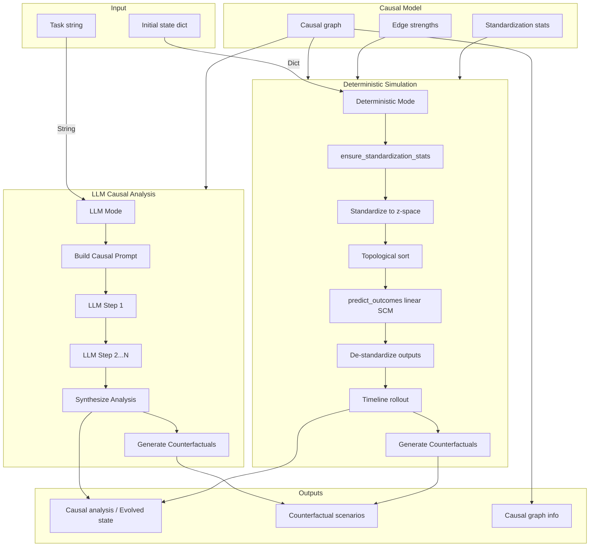

<!-- swarms/agents/cr_ca_agent.py — CRCAAgent (CR‑CA Lite) -->
# CRCAAgent 

Short summary
-------------
CRCAAgent is a lightweight causal reasoning Agent with LLM integration,
implemented in pure Python and intended as a flexible CR‑CA engine for Swarms.
It provides both LLM-based causal analysis and deterministic causal simulation,
focusing on the core ASTT primitives: a causal DAG, a linear structural
evolution operator (in z-space), and compact counterfactual generation.

Key properties
- LLM integration for sophisticated causal reasoning (like full CRCAAgent)
- Dual-mode operation: LLM-based analysis and deterministic simulation
- Minimal dependencies (numpy + swarms Agent base)
- Pure-Python causal graph (adjacency dicts)
- Linear SCM evolution by default (overrideable)
- Agent-first `run()` entrypoint (accepts task string or dict/JSON payloads)

Canonical import
----------------
Use the canonical agent import in application code:

```python
from path.to.crca_agent import CRCAAgent
```

Quickstart
----------
Minimal example — deterministic mode: initialize, add edges, evolve state and get counterfactuals:

```python
from path.to.crca_agent import CRCAAgent

agent = CRCAAgent(variables=["price", "demand", "inventory"])
agent.add_causal_relationship("price", "demand", strength=-0.5)
agent.add_causal_relationship("demand", "inventory", strength=-0.2)

state = {"price": 100.0, "demand": 1000.0, "inventory": 5000.0}
out = agent.run(initial_state=state, target_variables=["price", "demand"], max_steps=1)

print("Evolved:", out["evolved_state"])            # evolved world state
for sc in out["counterfactual_scenarios"][:5]:      # candidate CFs
    print(sc.name, sc.interventions, sc.probability)
```

LLM-based causal analysis example
----------------------------------

```python
from path.to.crca_agent import CRCAAgent

agent = CRCAAgent(
    variables=["price", "demand", "inventory"],
    model_name="gpt-4o",
    max_loops=3
)
agent.add_causal_relationship("price", "demand", strength=-0.5)

# LLM mode: pass task as string
task = "Analyze how increasing price affects demand and inventory levels"
result = agent.run(task=task)

print("Causal Analysis:", result["causal_analysis"])
print("Counterfactual Scenarios:", result["counterfactual_scenarios"])
print("Analysis Steps:", result["analysis_steps"])
```

Agent-style JSON payload example (orchestrators)
------------------------------------------------

```python
import json
from path.to.crca_agent import CRCAAgent

agent = CRCAAgent(variables=["price","demand","inventory"])
payload = json.dumps({"price": 100.0, "demand": 1000.0})
out = agent.run(initial_state=payload, target_variables=["price"], max_steps=1)
print(out["evolved_state"])
```

Complete example: Full workflow with system prompt
--------------------------------------------------
This example demonstrates a complete workflow from imports to execution, including
system prompt configuration, causal graph construction, and both LLM and deterministic modes.

```python
"""
Complete CRCAAgent example: Full workflow from initialization to execution
"""

# 1. Imports
from typing import Dict, Any
from path.to.crca_agent import CRCAAgent

# 2. System prompt configuration
# Define a custom system prompt for domain-specific causal reasoning
SYSTEM_PROMPT = """You are an expert causal reasoning analyst specializing in economic systems.
Your role is to:
- Identify causal relationships between economic variables
- Analyze how interventions affect system outcomes
- Generate plausible counterfactual scenarios
- Provide clear, evidence-based causal explanations

When analyzing causal relationships:
1. Consider both direct and indirect causal paths
2. Account for confounding factors
3. Evaluate intervention plausibility
4. Quantify expected causal effects when possible

Always ground your analysis in the provided causal graph structure and observed data."""

# 3. Agent initialization with system prompt
agent = CRCAAgent(
    variables=["price", "demand", "inventory", "supply", "competition"],
    agent_name="economic-causal-analyst",
    agent_description="Expert economic causal reasoning agent",
    model_name="gpt-4o",  # or "gpt-4o-mini" for faster/cheaper analysis
    max_loops=3,  # Number of reasoning loops for LLM-based analysis
    system_prompt=SYSTEM_PROMPT,
    verbose=True,  # Enable detailed logging
)

# 4. Build causal graph: Add causal relationships
# Price negatively affects demand (higher price → lower demand)
agent.add_causal_relationship("price", "demand", strength=-0.5)

# Demand negatively affects inventory (higher demand → lower inventory)
agent.add_causal_relationship("demand", "inventory", strength=-0.2)

# Supply positively affects inventory (higher supply → higher inventory)
agent.add_causal_relationship("supply", "inventory", strength=0.3)

# Competition negatively affects price (more competition → lower price)
agent.add_causal_relationship("competition", "price", strength=-0.4)

# Price positively affects supply (higher price → more supply)
agent.add_causal_relationship("price", "supply", strength=0.2)

# 5. Verify graph structure
print("Causal Graph Nodes:", agent.get_nodes())
print("Causal Graph Edges:", agent.get_edges())
print("Is DAG:", agent.is_dag())

# 6. Example 1: LLM-based causal analysis (sophisticated reasoning)
print("\n" + "="*80)
print("EXAMPLE 1: LLM-Based Causal Analysis")
print("="*80)

task = """
Analyze the causal relationship between price increases and inventory levels.
Consider both direct and indirect causal paths. What interventions could
stabilize inventory while maintaining profitability?
"""

result = agent.run(task=task)

print("\n--- Causal Analysis Report ---")
print(result["causal_analysis"])

print("\n--- Counterfactual Scenarios ---")
for i, scenario in enumerate(result["counterfactual_scenarios"][:3], 1):
    print(f"\nScenario {i}: {scenario.name}")
    print(f"  Interventions: {scenario.interventions}")
    print(f"  Expected Outcomes: {scenario.expected_outcomes}")
    print(f"  Probability: {scenario.probability:.3f}")
    print(f"  Reasoning: {scenario.reasoning}")

print("\n--- Causal Graph Info ---")
print(f"Nodes: {result['causal_graph_info']['nodes']}")
print(f"Edges: {result['causal_graph_info']['edges']}")
print(f"Is DAG: {result['causal_graph_info']['is_dag']}")

# 7. Example 2: Deterministic simulation (script-style)
print("\n" + "="*80)
print("EXAMPLE 2: Deterministic Causal Simulation")
print("="*80)

# Initial state
initial_state = {
    "price": 100.0,
    "demand": 1000.0,
    "inventory": 5000.0,
    "supply": 2000.0,
    "competition": 5.0,
}

# Run deterministic evolution
simulation_result = agent.run(
    initial_state=initial_state,
    target_variables=["price", "demand", "inventory"],
    max_steps=3,  # Evolve for 3 time steps
)

print("\n--- Initial State ---")
for var, value in initial_state.items():
    print(f"  {var}: {value}")

print("\n--- Evolved State (after 3 steps) ---")
for var, value in simulation_result["evolved_state"].items():
    print(f"  {var}: {value:.2f}")

print("\n--- Counterfactual Scenarios ---")
for i, scenario in enumerate(simulation_result["counterfactual_scenarios"][:3], 1):
    print(f"\nScenario {i}: {scenario.name}")
    print(f"  Interventions: {scenario.interventions}")
    print(f"  Expected Outcomes: {scenario.expected_outcomes}")
    print(f"  Probability: {scenario.probability:.3f}")

# 8. Example 3: Causal chain identification
print("\n" + "="*80)
print("EXAMPLE 3: Causal Chain Analysis")
print("="*80)

chain = agent.identify_causal_chain("competition", "inventory")
if chain:
    print(f"Causal chain from 'competition' to 'inventory': {' → '.join(chain)}")
else:
    print("No direct causal chain found")

# 9. Example 4: Analyze causal strength
print("\n" + "="*80)
print("EXAMPLE 4: Causal Strength Analysis")
print("="*80)

strength_analysis = agent.analyze_causal_strength("price", "inventory")
print(f"Direct edge strength: {strength_analysis.get('direct_strength', 'N/A')}")
print(f"Path strength: {strength_analysis.get('path_strength', 'N/A')}")

# 10. Example 5: Custom intervention prediction
print("\n" + "="*80)
print("EXAMPLE 5: Custom Intervention Prediction")
print("="*80)

# What if we reduce price by 20%?
interventions = {"price": 80.0}  # 20% reduction from 100
predicted = agent._predict_outcomes(initial_state, interventions)

print("\nIntervention: Reduce price from 100 to 80 (20% reduction)")
print("Predicted outcomes:")
for var, value in predicted.items():
    if var in initial_state:
        change = value - initial_state[var]
        change_pct = (change / initial_state[var]) * 100 if initial_state[var] != 0 else 0
        print(f"  {var}: {initial_state[var]:.2f} → {value:.2f} ({change_pct:+.1f}%)")

print("\n" + "="*80)
print("Example execution complete!")
print("="*80)
```

Expected output structure
-------------------------
The `run()` method returns different structures depending on the mode:

**LLM Mode** (task string):
```python
{
    "task": str,  # The provided task string
    "causal_analysis": str,  # Synthesized analysis report
    "counterfactual_scenarios": List[CounterfactualScenario],  # Generated scenarios
    "causal_graph_info": {
        "nodes": List[str],
        "edges": List[Tuple[str, str]],
        "is_dag": bool
    },
    "analysis_steps": List[Dict[str, Any]]  # Step-by-step reasoning history
}
```

**Deterministic Mode** (initial_state dict):
```python
{
    "initial_state": Dict[str, float],  # Input state
    "evolved_state": Dict[str, float],  # State after max_steps evolution
    "counterfactual_scenarios": List[CounterfactualScenario],  # Generated scenarios
    "causal_graph_info": {
        "nodes": List[str],
        "edges": List[Tuple[str, str]],
        "is_dag": bool
    },
    "steps": int  # Number of evolution steps applied
}
```

System prompt best practices
-----------------------------
1. **Domain-specific guidance**: Include domain knowledge relevant to your causal model
2. **Causal reasoning principles**: Reference Pearl's causal hierarchy (association, intervention, counterfactual)
3. **Output format**: Specify desired analysis structure and detail level
4. **Plausibility constraints**: Guide the agent on what interventions are realistic
5. **Quantification**: Encourage numerical estimates when appropriate

Example system prompt template:
```python
SYSTEM_PROMPT = """You are a {domain} causal reasoning expert.
Your analysis should:
- Identify {specific_relationships}
- Consider {relevant_factors}
- Generate {scenario_types}
- Provide {output_format}

Ground your reasoning in the causal graph structure provided."""
```

Why use `run()`
--------------
- **Dual-mode operation**: Automatically selects LLM mode (task string) or deterministic mode (initial_state dict)
- **LLM mode**: Performs sophisticated multi-loop causal reasoning with structured output
- **Deterministic mode**: Evolves the world state for `max_steps` using the deterministic evolution
  operator, then generates counterfactuals from the evolved state (consistent timelines)
- Accepts both dict and JSON payloads for flexible integration
- Returns a compact result dict used across Swarms agents

Architecture (high level)
-------------------------



Complete method index (quick)
-----------------------------
The following is the public surface implemented by `CRCAAgent` (Lite) in
`ceca_lite/crca-lite.py`.

LLM integration
- `_get_cr_ca_schema()` — CR-CA function calling schema for structured reasoning
- `step(task)` — Execute a single step of LLM-based causal reasoning
- `_build_causal_prompt(task)` — Build causal analysis prompt with graph context
- `_build_memory_context()` — Build memory context from previous analysis steps
- `_synthesize_causal_analysis(task)` — Synthesize final causal analysis using LLM
- `_run_llm_causal_analysis(task)` — Run multi-loop LLM-based causal analysis

Core graph & state
- `_ensure_node_exists(node)` — ensure node present in internal maps
- `add_causal_relationship(source, target, strength=1.0, ...)` — add/update edge
- `_get_parents(node)`, `_get_children(node)` — graph accessors
- `_topological_sort()` — Kahn's algorithm
- `get_nodes()`, `get_edges()`, `is_dag()` — graph introspection

Standardization & prediction
- `set_standardization_stats(var, mean, std)` — set z-stats
- `ensure_standardization_stats(state)` — auto-fill sensible stats
- `_standardize_state(state)` / `_destandardize_value(var, z)` — z-score transforms
- `_predict_outcomes(factual_state, interventions)` — evolution operator (linear SCM)
- `_predict_outcomes_cached(...)` — cached wrapper

Counterfactuals & reasoning
- `generate_counterfactual_scenarios(factual_state, target_variables, max_scenarios=5)`
- `_calculate_scenario_probability(factual_state, interventions)` — heuristic plausibility
- `counterfactual_abduction_action_prediction(factual_state, interventions)` — abduction–action–prediction (Pearl)

Estimation, analysis & utilities
- `fit_from_dataframe(df, variables, window=30, ...)` — WLS edge estimation and stats
- `quantify_uncertainty(df, variables, windows=200, ...)` — bootstrap CIs
- `analyze_causal_strength(source, target)` — path/edge summary
- `identify_causal_chain(start, end)` — BFS shortest path
- `detect_change_points(series, threshold=2.5)` — simple detector

Advanced (optional / Pro)
- `learn_structure(...)`, `plan_interventions(...)`, `gradient_based_intervention_optimization(...)`,
  `convex_intervention_optimization(...)`, `evolutionary_multi_objective_optimization(...)`,
  `probabilistic_nested_simulation(...)`, `deep_root_cause_analysis(...)`, and more.

Return shape from `run()`
-------------------------
`run()` returns a dictionary with different keys depending on mode:

**LLM Mode** (when `task` is a string):
- `task`: the provided task/problem string
- `causal_analysis`: synthesized causal analysis report (string)
- `counterfactual_scenarios`: list of `CounterfactualScenario` objects
- `causal_graph_info`: {"nodes": [...], "edges": [...], "is_dag": bool}
- `analysis_steps`: list of analysis steps with memory context

**Deterministic Mode** (when `initial_state` is a dict):
- `initial_state`: the provided input state (dict)
- `evolved_state`: state after applying `max_steps` of the evolution operator
- `counterfactual_scenarios`: list of `CounterfactualScenario` with name/interventions/expected_outcomes/probability/reasoning
- `causal_graph_info`: {"nodes": [...], "edges": [...], "is_dag": bool}
- `steps`: `max_steps` used

Usage patterns & examples
-------------------------
1) LLM-based causal analysis (sophisticated reasoning)

```python
agent = CRCAAgent(
    variables=["a","b","c"],
    model_name="gpt-4o",
    max_loops=3
)
agent.add_causal_relationship("a","b", strength=0.8)

# LLM mode: pass task as string
task = "Analyze the causal relationship between a and b"
res = agent.run(task=task)
print(res["causal_analysis"])
print(res["analysis_steps"])
```

2) Deterministic simulation (script-style)

```python
agent = CRCAAgent(variables=["a","b","c"])
agent.add_causal_relationship("a","b", strength=0.8)
state = {"a":1.0, "b":2.0, "c":3.0}
res = agent.run(initial_state=state, max_steps=2)
print(res["evolved_state"])
```

3) Orchestration / agent-style (JSON payloads)

```python
payload = '{"a":1.0,"b":2.0,"c":3.0}'
res = agent.run(initial_state=payload, max_steps=1)
if "error" in res:
    print("Bad payload:", res["error"])
else:
    print("Evolved:", res["evolved_state"])
```

4) Lower-level testing & research

```python
pred = agent._predict_outcomes({"a":1.0,"b":2.0},{"a":0.0})
print(pred)
```

Design notes & limitations
--------------------------
- **LLM Integration**: Uses swarms Agent infrastructure for LLM calls. Configure model via `model_name` parameter. Multi-loop reasoning enabled by default.
- **Dual-mode operation**: Automatically selects LLM mode (task string) or deterministic mode (initial_state dict). Both modes generate counterfactuals using deterministic methods.
- **Linearity**: default `_predict_outcomes` is linear in standardized z-space. To model non-linear dynamics, subclass `CRCAAgent` and override `_predict_outcomes`.
- **Probabilities**: scenario probability is a heuristic proximity measure (Mahalanobis-like) — not a formal posterior.
- **Stats**: the engine auto-fills standardization stats with sensible defaults (`mean=observed`, `std=1.0`) via `ensure_standardization_stats` to avoid degenerate std=0 cases.
- **Dependencies**: Lite intentionally avoids heavy libs (pandas/scipy/cvxpy) but includes LLM integration via swarms Agent base.

Extending & integration
-----------------------
For advanced capabilities (structure learning, Bayesian inference, optimization,
extensive statistical methods), use the full CRCA Agent featured [WIP]
The Lite version provides core causal reasoning with LLM support while maintaining minimal dependencies.

References
----------
- Pearl, J. (2009). *Causality: Models, Reasoning, and Inference*.
- Pearl, J., & Mackenzie, D. (2018). *The Book of Why*.


