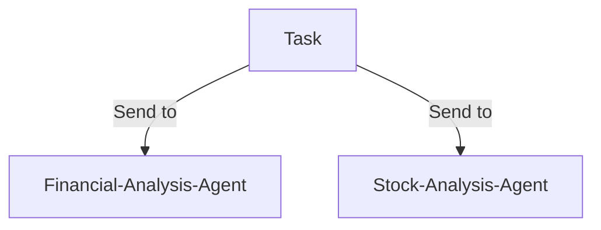

# Building Agents from a YAML File

The `create_agents_from_yaml` function is designed to dynamically create agents and orchestrate swarms based on configurations defined in a YAML file. It is particularly suited for enterprise use-cases, offering scalability and reliability for agent-based workflows.

### Key Features:
- **Multi-Agent Creation**: Automatically instantiate multiple agents from a YAML file.
- **Swarm Architecture**: Supports swarm architectures where agents collaborate to solve complex tasks.
- **Logging with Loguru**: Includes robust logging for tracking operations and diagnosing issues.
- **Flexible Return Types**: Offers several return types based on the requirements of the system.
- **Customizable**: Supports additional arguments (`*args` and `**kwargs`) for fine-tuning agent behavior.
- **Error Handling**: Handles missing configurations and invalid inputs with meaningful error messages.

---

### Parameters

| Parameter    | Description                                                                                                                                       | Type        | Default Value | Example                             |
|--------------|---------------------------------------------------------------------------------------------------------------------------------------------------|-------------|---------------|-------------------------------------|
| `model`      | A callable representing the model (LLM or other) that agents will use.                                                                             | Callable    | None          | `OpenAIChat(model_name="gpt-4")`    |
| `yaml_file`  | Path to the YAML file containing agent configurations.                                                                                            | String      | "agents.yaml" | `"config/agents.yaml"`              |
| `return_type`| Determines the type of return object. Options: `"auto"`, `"swarm"`, `"agents"`, `"both"`, `"tasks"`, `"run_swarm"`.                                | String      | "auto"        | `"both"`                            |
| `*args`      | Additional positional arguments for further customization (e.g., agent behavior).                                                                  | List        | N/A           | N/A                                 |
| `**kwargs`   | Additional keyword arguments for customization (e.g., specific parameters passed to the agents or swarm).                                           | Dict        | N/A           | N/A                                 |

---

### Return Types

| Return Type     | Description                                                                                                                                   |
|-----------------|-----------------------------------------------------------------------------------------------------------------------------------------------|
| `SwarmRouter`   | Returns a `SwarmRouter` object, orchestrating the created agents, only if swarm architecture is defined in YAML.                               |
| `Agent`         | Returns a single agent if only one is defined.                                                                                                |
| `List[Agent]`   | Returns a list of agents if multiple are defined.                                                                                             |
| `Tuple`         | If both agents and a swarm are present, returns both as a tuple (`SwarmRouter, List[Agent]`).                                                  |
| `List[Dict]`    | Returns a list of task results if tasks were executed.                                                                                        |
| `None`          | Returns nothing if an invalid return type is provided or an error occurs.                                                                     |

---

### Detailed Return Types

| Return Type        | Condition                                                          | Example Return Value                          |
|--------------------|---------------------------------------------------------------------|-----------------------------------------------|
| `"auto"`           | Automatically determines the return based on YAML content.          | `SwarmRouter` if swarm architecture is defined, otherwise `Agent` or `List[Agent]`. |
| `"swarm"`          | Returns `SwarmRouter` if present; otherwise returns agents.         | `<SwarmRouter>`                               |
| `"agents"`         | Returns a list of agents (or a single agent if only one is defined).| `[<Agent>, <Agent>]` or `<Agent>`             |
| `"both"`           | Returns both `SwarmRouter` and agents in a tuple.                  | `(<SwarmRouter>, [<Agent>, <Agent>])`         |
| `"tasks"`          | Returns the task results, if tasks were executed by agents.         | `[{'task': 'task_output'}, {'task2': 'output'}]` |
| `"run_swarm"`      | Executes the swarm (if defined) and returns the result.             | `'Swarm task output here'`                    |

---

### Example Use Cases

1. **Creating Multiple Agents for Financial Analysis**

```yaml
agents:
  - agent_name: "Financial-Analysis-Agent"
    system_prompt: "Analyze the best investment strategy for 2024."
    max_loops: 1
    autosave: true
    verbose: false
    context_length: 100000
    output_type: "str"
    task: "Analyze stock options for long-term gains."

  - agent_name: "Risk-Analysis-Agent"
    system_prompt: "Evaluate the risk of tech stocks in 2024."
    max_loops: 2
    autosave: false
    verbose: true
    context_length: 50000
    output_type: "json"
    task: "What are the riskiest stocks in the tech sector?"
```

```python
from swarms.structs.agent import Agent
from swarms.structs.swarm_router import SwarmRouter

# Model representing your LLM
def model(prompt):
    return f"Processed: {prompt}"

# Create agents and return them as a list
agents = create_agents_from_yaml(model=model, yaml_file="agents.yaml", return_type="agents")
print(agents)
```

2. **Running a Swarm of Agents to Solve a Complex Task**

```yaml
agents:
  - agent_name: "Legal-Agent"
    system_prompt: "Provide legal advice on corporate structuring."
    task: "How to incorporate a business as an LLC?"

swarm_architecture:
  name: "Corporate-Swarm"
  description: "A swarm for helping businesses with legal and tax advice."
  swarm_type: "ConcurrentWorkflow"
  task: "How can we optimize a business structure for maximum tax efficiency?"
  max_loops: 3
```

```python
import os

from dotenv import load_dotenv
from loguru import logger
from swarm_models import OpenAIChat

from swarms.agents.create_agents_from_yaml import (
    create_agents_from_yaml,
)

# Load environment variables
load_dotenv()

# Path to your YAML file
yaml_file = "agents_multi_agent.yaml"


# Get the OpenAI API key from the environment variable
api_key = os.getenv("GROQ_API_KEY")

# Model
model = OpenAIChat(
    openai_api_base="https://api.groq.com/openai/v1",
    openai_api_key=api_key,
    model_name="llama-3.1-70b-versatile",
    temperature=0.1,
)

try:
    # Create agents and run tasks (using 'both' to return agents and task results)
    task_results = create_agents_from_yaml(
        model=model, yaml_file=yaml_file, return_type="run_swarm"
    )

    logger.info(f"Results from agents: {task_results}")
except Exception as e:
    logger.error(f"An error occurred: {e}")

```

3. **Returning Both Agents and Tasks**

```yaml
agents:
  - agent_name: "Market-Research-Agent"
    system_prompt: "What are the latest trends in AI?"
    task: "Provide a market analysis for AI technologies in 2024."
```

```python
from swarms.structs.agent import Agent

# Model representing your LLM
def model(prompt):
    return f"Processed: {prompt}"

# Create agents and run tasks, return both agents and task results
swarm, agents = create_agents_from_yaml(model=model, yaml_file="agents.yaml", return_type="both")
print(swarm, agents)
```

---


---

### YAML Schema Overview:

Below is a breakdown of the attributes expected in the YAML configuration file, which governs how agents and swarms are created.

### YAML Attributes Table:

| Attribute Name                   | Description                                                | Type          | Required | Default/Example Value                    |
|-----------------------------------|------------------------------------------------------------|---------------|----------|------------------------------------------|
| `agents`                          | List of agents to be created. Each agent must have specific configurations. | List of dicts | Yes      |                                          |
| `agent_name`                      | The name of the agent.                                     | String        | Yes      | `"Stock-Analysis-Agent"`                 |
| `system_prompt`                   | The system prompt that the agent will use.                 | String        | Yes      | `"Your full system prompt here"`         |
| `max_loops`                       | Maximum number of iterations or loops for the agent.       | Integer       | No       | 1                                        |
| `autosave`                        | Whether the agent should automatically save its state.     | Boolean       | No       | `true`                                   |
| `dashboard`                       | Whether to enable a dashboard for the agent.               | Boolean       | No       | `false`                                  |
| `verbose`                         | Whether to run the agent in verbose mode (for debugging).  | Boolean       | No       | `false`                                  |
| `dynamic_temperature_enabled`     | Enable dynamic temperature adjustments during agent execution. | Boolean       | No       | `false`                                  |
| `saved_state_path`                | Path where the agent's state is saved for recovery.        | String        | No       | `"path_to_save_state.json"`              |
| `user_name`                       | Name of the user interacting with the agent.               | String        | No       | `"default_user"`                         |
| `retry_attempts`                  | Number of times to retry an operation in case of failure.  | Integer       | No       | 1                                        |
| `context_length`                  | Maximum context length for agent interactions.             | Integer       | No       | 100000                                   |
| `return_step_meta`                | Whether to return metadata for each step of the task.      | Boolean       | No       | `false`                                  |
| `output_type`                     | The type of output the agent will return (e.g., `str`, `json`). | String        | No       | `"str"`                                  |
| `task`                            | Task to be executed by the agent (optional).               | String        | No       | `"What is the best strategy for long-term stock investment?"` |

#### Swarm Architecture (Optional):

| Attribute Name                   | Description                                                | Type          | Required | Default/Example Value                    |
|-----------------------------------|------------------------------------------------------------|---------------|----------|------------------------------------------|
| `swarm_architecture`              | Defines the swarm configuration. For more information on what can be added to the swarm architecture, please refer to the [Swarm Router documentation](https://docs.swarms.world/en/latest/swarms/structs/swarm_router/). | Dict          | No       |                                          |
| `name`                            | The name of the swarm.                                     | String        | Yes      | `"MySwarm"`                              |
| `description`                     | Description of the swarm and its purpose.                  | String        | No       | `"A swarm for collaborative task solving"`|
| `max_loops`                       | Maximum number of loops for the swarm.                     | Integer       | No       | 5                                        |
| `swarm_type`                      | The type of swarm (e.g., `ConcurrentWorkflow`) `SequentialWorkflow`.            | String        | Yes      | `"ConcurrentWorkflow"`                   |
| `task`                            | The primary task assigned to the swarm.                    | String        | No       | `"How can we trademark concepts as a delaware C CORP for free?"` |

---
### YAML Schema Example:

Below is an updated YAML schema that conforms to the function's expectations:

```yaml
agents:
  - agent_name: "Financial-Analysis-Agent"
    system_prompt: "Your full system prompt here"
    max_loops: 1
    autosave: true
    dashboard: false
    verbose: true
    dynamic_temperature_enabled: true
    saved_state_path: "finance_agent.json"
    user_name: "swarms_corp"
    retry_attempts: 1
    context_length: 200000
    return_step_meta: false
    output_type: "str"
    # task: "How can I establish a ROTH IRA to buy stocks and get a tax break?" # Turn off if using swarm

  - agent_name: "Stock-Analysis-Agent"
    system_prompt: "Your full system prompt here"
    max_loops: 2
    autosave: true
    dashboard: false
    verbose: true
    dynamic_temperature_enabled: false
    saved_state_path: "stock_agent.json"
    user_name: "stock_user"
    retry_attempts: 3
    context_length: 150000
    return_step_meta: true
    output_type: "json"
    # task: "What is the best strategy for long-term stock investment?"

# Optional Swarm Configuration
swarm_architecture:
  name: "MySwarm"
  description: "A swarm for collaborative task solving"
  max_loops: 5
  swarm_type: "ConcurrentWorkflow"
  task: "How can we trademark concepts as a delaware C CORP for free?" # Main task 
```

# Diagram


---

### How to Use `create_agents_from_yaml` Function with YAML:

- You need to plug in your specific model until we can create a model router that can fetch any model and set specific settings

#### Example Code:
```python
import os

from dotenv import load_dotenv
from loguru import logger
from swarm_models import OpenAIChat

from swarms.agents.create_agents_from_yaml import (
    create_agents_from_yaml,
)

# Load environment variables
load_dotenv()

# Path to your YAML file
yaml_file = "agents.yaml"


# Get the OpenAI API key from the environment variable
api_key = os.getenv("GROQ_API_KEY")

# Model
model = OpenAIChat(
    openai_api_base="https://api.groq.com/openai/v1",
    openai_api_key=api_key,
    model_name="llama-3.1-70b-versatile",
    temperature=0.1,
)

try:
    # Create agents and run tasks (using 'both' to return agents and task results)
    task_results = create_agents_from_yaml(
        model=model, yaml_file=yaml_file, return_type="run_swarm" # 
    )

    logger.info(f"Results from agents: {task_results}")
except Exception as e:
    logger.error(f"An error occurred: {e}")

```

---

### Error Handling:

1. **FileNotFoundError**: If the specified YAML file does not exist.
2. **ValueError**: Raised if there are invalid or missing configurations in the YAML file.
3. **Invalid Return Type**: If an invalid return type is specified, the function will raise a `ValueError`.

### Conclusion:
The `create_agents_from_yaml` function provides a flexible and powerful way to dynamically configure and execute agents, supporting a wide range of tasks and configurations for enterprise-level use cases. By following the YAML schema and function signature, users can easily define and manage their agents and swarms.