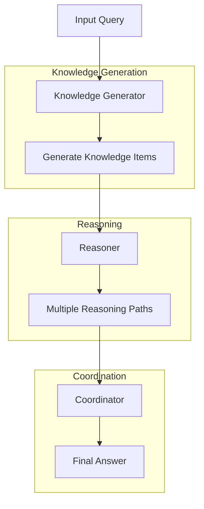
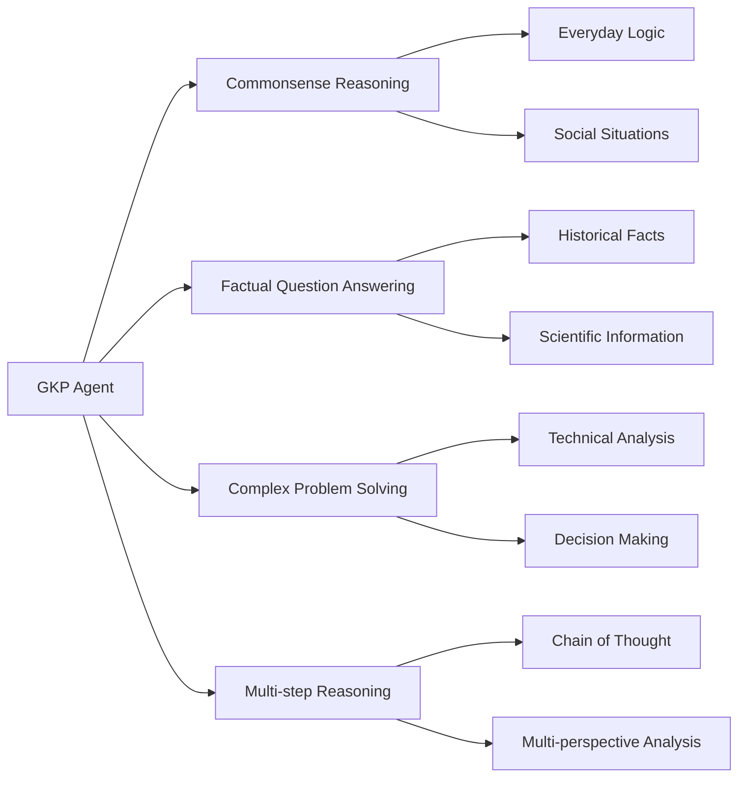

# Generated Knowledge Prompting (GKP) Agent

The GKP Agent is a sophisticated reasoning system that enhances its capabilities by generating relevant knowledge before answering queries. This approach, inspired by Liu et al. 2022, is particularly effective for tasks requiring commonsense reasoning and factual information.

## Overview

The GKP Agent consists of three main components:
1. Knowledge Generator - Creates relevant factual information
2. Reasoner - Uses generated knowledge to form answers
3. Coordinator - Synthesizes multiple reasoning paths into a final answer

## Architecture



## Use Cases



## API Reference

### GKPAgent

The main agent class that orchestrates the knowledge generation and reasoning process.

#### Initialization Parameters

| Parameter | Type | Default | Description |
|-----------|------|---------|-------------|
| agent_name | str | "gkp-agent" | Name identifier for the agent |
| model_name | str | "openai/o1" | LLM model to use for all components |
| num_knowledge_items | int | 6 | Number of knowledge snippets to generate per query |

#### Methods

| Method | Description | Parameters | Returns |
|--------|-------------|------------|---------|
| process(query: str) | Process a single query through the GKP pipeline | query: str | Dict[str, Any] containing full processing results |
| run(queries: List[str], detailed_output: bool = False) | Process multiple queries | queries: List[str], detailed_output: bool | Union[List[str], List[Dict[str, Any]]] |

### KnowledgeGenerator

Component responsible for generating relevant knowledge for queries.

#### Initialization Parameters

| Parameter | Type | Default | Description |
|-----------|------|---------|-------------|
| agent_name | str | "knowledge-generator" | Name identifier for the knowledge generator agent |
| model_name | str | "openai/o1" | Model to use for knowledge generation |
| num_knowledge_items | int | 2 | Number of knowledge items to generate per query |

#### Methods

| Method | Description | Parameters | Returns |
|--------|-------------|------------|---------|
| generate_knowledge(query: str) | Generate relevant knowledge for a query | query: str | List[str] of generated knowledge statements |

### Reasoner

Component that uses generated knowledge to reason about and answer queries.

#### Initialization Parameters

| Parameter | Type | Default | Description |
|-----------|------|---------|-------------|
| agent_name | str | "knowledge-reasoner" | Name identifier for the reasoner agent |
| model_name | str | "openai/o1" | Model to use for reasoning |

#### Methods

| Method | Description | Parameters | Returns |
|--------|-------------|------------|---------|
| reason_and_answer(query: str, knowledge: str) | Reason about a query using provided knowledge | query: str, knowledge: str | Dict[str, str] containing explanation, confidence, and answer |

## Example Usage

```python
from swarms.agents.gkp_agent import GKPAgent

# Initialize the GKP Agent
agent = GKPAgent(
    agent_name="gkp-agent",
    model_name="gpt-4",  # Using OpenAI's model
    num_knowledge_items=6,  # Generate 6 knowledge items per query
)

# Example queries
queries = [
    "What are the implications of quantum entanglement on information theory?",
]

# Run the agent
results = agent.run(queries)

# Print results
for i, result in enumerate(results):
    print(f"\nQuery {i+1}: {queries[i]}")
    print(f"Answer: {result}")
```

## Best Practices

1. **Knowledge Generation**
   - Set appropriate number of knowledge items based on query complexity
   - Monitor knowledge quality and relevance
   - Adjust model parameters for optimal performance

2. **Reasoning Process**
   - Ensure diverse reasoning paths for complex queries
   - Validate confidence levels
   - Consider multiple perspectives

3. **Coordination**
   - Review coordination logic for complex scenarios
   - Validate final answers against source knowledge
   - Monitor processing time and optimize if needed

## Performance Considerations

- Processing time increases with number of knowledge items
- Complex queries may require more knowledge items
- Consider caching frequently used knowledge
- Monitor token usage for cost optimization

## Error Handling

The agent includes robust error handling for:
- Invalid queries
- Failed knowledge generation
- Reasoning errors
- Coordination failures
