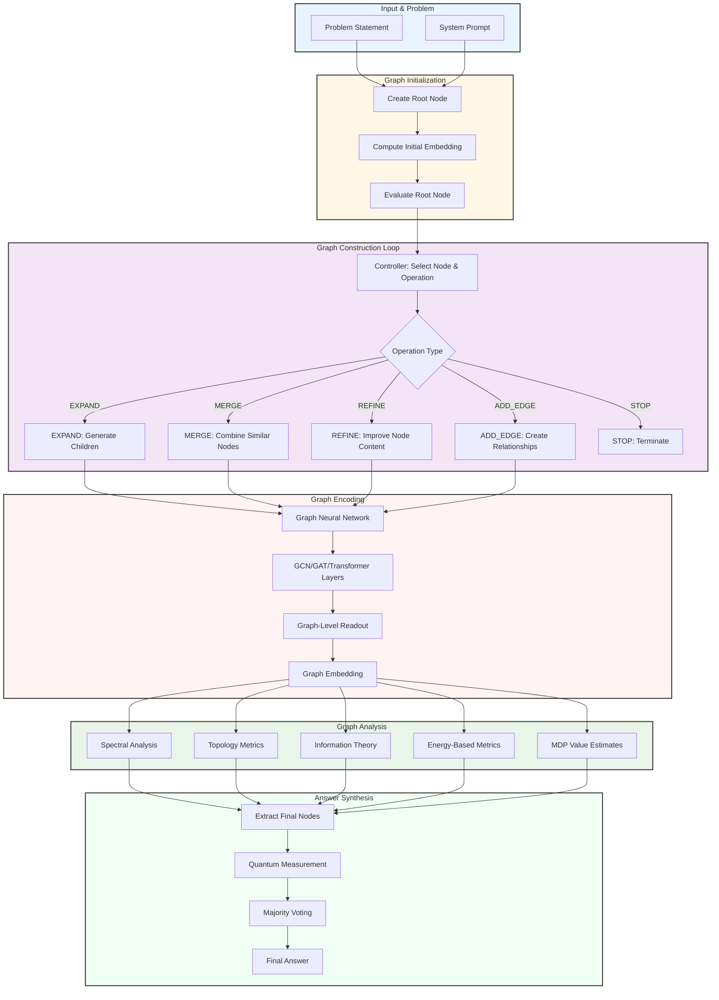

# Graph-of-Thought (GoT) Reasoning Agent

A revolutionary graph-based reasoning framework that models reasoning as a labeled directed graph with probabilistic semantics, enabling sophisticated multi-path exploration, node merging, refinement, and graph neural network-based encoding.

## Overview

The Graph-of-Thought (GoT) Agent implements a formal framework where reasoning is modeled as a labeled directed graph \(G = (V, E, \tau, \ell, \sigma)\) with probabilistic semantics. Unlike linear chain-of-thought or tree structures, GoT allows arbitrary graph topologies, enabling operations like merging similar thoughts, refining nodes, and exploring complex reasoning relationships.

**Key Capabilities:**

| Capability | Description |
|------------|-------------|
| **Graph-Based Reasoning** | Models reasoning as a directed graph with nodes (thoughts) and edges (relationships) |
| **Node Operations** | EXPAND, MERGE, REFINE, ADD_EDGE operations for dynamic graph construction |
| **Graph Neural Networks** | GCN, GAT, and Graph Transformer layers for node embedding and graph encoding |
| **Spectral Graph Theory** | Laplacian eigenvalues, graph Fourier transform, and spectral analysis |
| **Quantum Graph Superposition** | Quantum-inspired superposition of multiple graphs with measurement |
| **MDP Formulation** | Markov Decision Process framework for optimal graph construction |
| **Information-Theoretic Analysis** | Graph entropy, mutual information, and node information gain |
| **Statistical Mechanics** | Boltzmann distribution, partition function, and free energy for graph ensembles |
| **Graph Topology Analysis** | Centrality measures, clustering coefficients, and path analysis |

## Architecture



## Getting Started

### Installation

The GoT Agent is included in the Swarms framework:

```bash
pip install swarms
```

### Basic Usage

**Example 1: Simple problem solving**

```python
from swarms.agents import GoTAgent

agent = GoTAgent(
    agent_name="got-agent",
    model_name="gpt-4o"
)

answer = agent.run("If a train travels 120 miles in 2 hours, what is its average speed?")
print(answer)
```

**Example 2: With custom configuration**

```python
from swarms.agents import GoTAgent, _GoTConfig

config = _GoTConfig(
    max_nodes=100,
    max_iterations=30,
    expansion_branch_factor=5,
    enable_merging=True,
    enable_refinement=True,
    gnn_layers=3
)

agent = GoTAgent(
    agent_name="advanced-got",
    model_name="gpt-4o",
    config=config
)

result = agent.run("Prove that the square root of 2 is irrational", return_graph=True)
print("Answer:", result["answer"])
print("Graph nodes:", len(result["graph"]["nodes"]))
print("Graph edges:", len(result["graph"]["edges"]))
```

**Example 3: Using an existing Agent**

```python
from swarms.structs.agent import Agent
from swarms.agents import GoTAgent

# Wrap an existing agent
base_agent = Agent(
    agent_name="base",
    model_name="gpt-4o",
    description="Base reasoning agent"
)

got_agent = GoTAgent(
    agent_name="got-wrapper",
    agent=base_agent
)

answer = got_agent.run("Explain quantum entanglement in simple terms")
print(answer)
```

## Mathematical Foundation

### Core Probabilistic Model

The fundamental GoT model:

\[
p_\theta(y, G \mid x) = p_\theta(G \mid x) \cdot p_\theta(y \mid G, x)
\]

where:
- \(x \in X\): input (problem, task description)
- \(y \in Y\): final answer (possibly a node in \(V\) with type "final")
- \(G = (V, E, \tau, \ell, \sigma)\): thought graph
  - \(V = \{v_1, \ldots, v_n\}\): vertices, each a thought unit
  - \(E \subseteq V \times V \times R\): directed, typed edges with relations \(r \in R\)
  - \(\tau: V \to T\): node type map (\(T = \{\text{problem}, \text{hypothesis}, \text{subproblem}, \ldots\}\))
  - \(\ell: V \to S^*\): node label (text of the thought)
  - \(\sigma: V \to \mathbb{R}^d\): embedding / latent state
- \(\theta\): parameters for LLM + controller

### Graph Factorization

Factorization over graph (topological order):

\[
p_\theta(G \mid x) = \prod_{v_i \in V} p_\theta(\ell(v_i), \text{Pa}(v_i), \tau(v_i) \mid x, G_{<i})
\]

where \(\text{Pa}(v_i) = \{v_j : (v_j, v_i, r) \in E\}\) are the parents of \(v_i\).

### Graph Neural Network Message Passing

**General GNN Update:**

\[
H^{(k+1)} = \sigma(A H^{(k)} W^{(k)} + B H^{(k)})
\]

where:
- \(H^{(k)} \in \mathbb{R}^{n \times d}\): node embeddings at layer \(k\)
- \(A \in \mathbb{R}^{n \times n}\): adjacency matrix (possibly normalized)
- \(W^{(k)} \in \mathbb{R}^{d \times d}\): learnable weight matrix
- \(B \in \mathbb{R}^{d \times d}\): residual connection weight
- \(\sigma\): nonlinearity (ReLU, GELU, etc.)

**Graph Convolutional Network (GCN):**

\[
H^{(k+1)} = \sigma(\tilde{A} H^{(k)} W^{(k)})
\]

where \(\tilde{A} = D^{-1/2} A D^{-1/2}\) is the normalized adjacency matrix.

**Graph Attention Network (GAT):**

\[
h_v^{(k+1)} = \sigma\left(\sum_{u \in \mathcal{N}(v)} \alpha_{vu} W^{(k)} h_u^{(k)}\right)
\]

where \(\alpha_{vu} = \text{softmax}(\text{LeakyReLU}(a^T [W h_v \| W h_u]))\) is the attention weight.

**Graph Transformer:**

\[
H^{(k+1)} = \text{LayerNorm}(H^{(k)} + \text{MultiHeadAttention}(H^{(k)}, H^{(k)}, H^{(k)}))
\]

\[
H^{(k+1)} = \text{LayerNorm}(H^{(k+1)} + \text{FFN}(H^{(k+1)}))
\]

**Graph-Level Readout:**

\[
h_G = \text{READOUT}(\{h_v : v \in V\}) = \text{Mean/Max/Sum pooling or attention}
\]

### Spectral Graph Theory

**Graph Laplacian:**

\[
L = D - A
\]

where \(D\) is the degree matrix.

**Normalized Laplacian:**

\[
L_{\text{norm}} = D^{-1/2} L D^{-1/2}
\]

**Eigenvalue Decomposition:**

\[
L = \Phi \Lambda \Phi^T
\]

where:
- \(\Lambda = \text{diag}(\lambda_1, \ldots, \lambda_n)\): eigenvalues (spectrum)
- \(\Phi\): eigenvectors (graph Fourier basis)

**Graph Fourier Transform:**

\[
F(\lambda) = \sum_{v} h_v \cdot \varphi_v(\lambda)
\]

### Quantum Graph Superposition

**Quantum State:**

\[
|\psi_G\rangle = \sum_{G \in \mathcal{G}} \alpha_G |G\rangle \otimes |y_G\rangle
\]

where:
- \(|\psi_G\rangle\): quantum state representing superposition of graphs
- \(\alpha_G = \sqrt{p_\theta(G \mid x)}\): amplitude for graph \(G\)
- \(|G\rangle\): basis state for graph structure
- \(|y_G\rangle\): answer state conditioned on \(G\)

**Measurement Probability:**

\[
P(y \mid x) = |\langle y \mid \psi_G\rangle|^2 = \left|\sum_{G: y_G=y} \alpha_G\right|^2
\]

**Quantum Graph Operations:**

\[
U_{\text{expand}} |G\rangle = |G \cup \{v_{\text{new}}\}\rangle
\]

\[
U_{\text{merge}} |G\rangle = |G / \{v_i, v_j\} \cup \{v_{\text{merged}}\}\rangle
\]

### Markov Decision Process (MDP) Formulation

**State Space:**

\[
\mathcal{S} = \{G : G \text{ is a valid thought graph}\}
\]

**Action Space:**

\[
\mathcal{A} = \{\text{EXPAND}, \text{MERGE}, \text{REFINE}, \text{ADD\_EDGE}, \text{STOP}\}
\]

**Transition:**

\[
P(S_{t+1} \mid S_t, a_t) = f_\theta(S_t, a_t)
\]

**Reward:**

\[
R(S_T) = \text{quality}(y \mid G_T, x)
\]

**Policy:**

\[
\pi_\theta(a_t \mid S_t, x) = \text{softmax}(\text{Controller}_\theta(\text{Enc}_\phi(S_t, x)))
\]

**Value Function:**

\[
V^\pi(S_t) = \mathbb{E}_\pi\left[\sum_{k=t}^T \gamma^{k-t} R(S_k) \mid S_t\right]
\]

**Q-Function:**

\[
Q^\pi(S_t, a_t) = \mathbb{E}_\pi\left[\sum_{k=t}^T \gamma^{k-t} R(S_k) \mid S_t, a_t\right]
\]

**Optimal Policy:**

\[
\pi^*(a \mid S) = \arg\max_a Q^*(S, a)
\]

### Information-Theoretic Graph Properties

**Graph Entropy:**

\[
H(G \mid X) = -\sum_{G} p_\theta(G \mid x) \log p_\theta(G \mid x)
\]

**Mutual Information:**

\[
I(G; Y \mid X) = H(Y \mid X) - H(Y \mid G, X)
\]

**Node Information Gain:**

\[
I(v; Y \mid G, X) = H(Y \mid G, X) - H(Y \mid G \cup \{v\}, X)
\]

**Graph Complexity:**

\[
C(G) = |V| \log |V| + |E| \log |E| + \sum_{v} |\ell(v)|
\]

### Statistical Mechanics of Graphs

**Energy Function:**

\[
E(G, x) = -\log p_\theta(G \mid x) = -\sum_{v_i} \log p_\theta(v_i \mid \text{Pa}(v_i), x)
\]

**Boltzmann Distribution:**

\[
p_\theta(G \mid x) = \frac{1}{Z(x)} \exp\left(-\frac{E(G, x)}{T}\right)
\]

**Partition Function:**

\[
Z(x) = \sum_{G \in \mathcal{G}} \exp\left(-\frac{E(G, x)}{T}\right)
\]

**Free Energy:**

\[
F(x) = -T \log Z(x)
\]

**Graph Ensemble Average:**

\[
\langle f(G) \rangle = \frac{1}{Z} \sum_{G} f(G) \exp\left(-\frac{E(G, x)}{T}\right)
\]

### Graph Topology and Structure

**Degree Distribution:**

\[
P(k) = \frac{1}{|V|} \sum_{v} \mathbf{1}[\deg(v) = k]
\]

**Clustering Coefficient:**

\[
C(v) = \frac{2e_v}{k_v(k_v - 1)}
\]

where \(e_v\) = edges among neighbors of \(v\), \(k_v\) = degree of \(v\).

**Path Length:**

\[
d(v_i, v_j) = \text{shortest path length between } v_i \text{ and } v_j
\]

**Graph Diameter:**

\[
D(G) = \max_{v_i, v_j} d(v_i, v_j)
\]

**Centrality Measures:**

- **Degree:** \(C_{\text{deg}}(v) = \frac{\deg(v)}{|V| - 1}\)
- **Betweenness:** \(C_{\text{bet}}(v) = \sum_{i \neq j \neq v} \frac{\sigma_{ij}(v)}{\sigma_{ij}}\)
- **Closeness:** \(C_{\text{clo}}(v) = \frac{|V| - 1}{\sum_{u \neq v} d(v, u)}\)
- **Eigenvector:** \(C_{\text{eig}}(v) = \frac{1}{\lambda} \sum_{u} A_{vu} C_{\text{eig}}(u)\)

### Graph Matching and Similarity

**Graph Edit Distance:**

\[
d_{\text{edit}}(G_1, G_2) = \min_{\text{ops}} \text{cost}(\text{ops})
\]

where ops = {insert, delete, substitute} operations.

**Weisfeiler-Lehman Kernel:**

\[
K_{\text{WL}}(G_1, G_2) = \sum_{k} \sum_{v_1, v_2} \mathbf{1}[\text{WL}_k(v_1) = \text{WL}_k(v_2)]
\]

**Graph Kernel:**

\[
K(G_1, G_2) = \langle \phi(G_1), \phi(G_2) \rangle
\]

where \(\phi\) is a graph embedding function.

### Optimization and Learning

**Variational Inference (ELBO):**

\[
\log p_\theta(y \mid x) \geq \mathbb{E}_{q_\phi(G \mid x, y)}[\log p_\theta(y \mid G, x)] - \text{KL}(q_\phi(G \mid x, y) \parallel p_\theta(G \mid x))
\]

**Policy Gradient:**

\[
\nabla_\theta J(\pi_\theta) = \mathbb{E}_\pi\left[\sum_{t} \nabla_\theta \log \pi_\theta(a_t \mid S_t) \cdot R_t\right]
\]

**Actor-Critic:**

\[
\nabla_\theta J(\pi_\theta) = \mathbb{E}_\pi\left[\sum_{t} \nabla_\theta \log \pi_\theta(a_t \mid S_t) \cdot A^\pi(S_t, a_t)\right]
\]

where \(A^\pi(S, a) = Q^\pi(S, a) - V^\pi(S)\) is the advantage function.

### Computational Complexity

- **Graph construction:** \(O(|V| \cdot (\text{expand\_cost} + \text{eval\_cost}))\)
- **GNN forward pass:** \(O(|E| \cdot d^2)\) per layer
- **Graph matching:** \(O(|V|! \cdot |E|!)\) in worst case
- **Topological sort:** \(O(|V| + |E|)\)

**With MDP search (T steps):**
- **Time:** \(O(T \cdot (|V| \cdot \text{expand\_cost} + |E| \cdot d^2))\)
- **Space:** \(O(|V| \cdot d + |E|)\)

## Class Reference

### GoTAgent

Main entry point for Graph-of-Thought reasoning.

```python
GoTAgent(
    agent_name: str = "got-agent",
    description: Optional[str] = None,
    model_name: Optional[str] = "gpt-4o",
    llm: Optional[Any] = None,
    system_prompt: Optional[str] = None,
    global_system_prompt: Optional[str] = None,
    secondary_system_prompt: Optional[str] = None,
    config: Optional[_GoTConfig] = None,
    agent: Optional[Any] = None,
    **kwargs
)
```

#### Parameters

| Parameter | Type | Default | Description |
|-----------|------|---------|-------------|
| `agent_name` | `str` | `"got-agent"` | Name of the agent |
| `description` | `Optional[str]` | `None` | Description of the agent |
| `model_name` | `Optional[str]` | `"gpt-4o"` | LLM model name (used if agent/llm not provided) |
| `llm` | `Optional[Any]` | `None` | Optional LLM instance or callable |
| `system_prompt` | `Optional[str]` | `None` | Optional custom system prompt |
| `global_system_prompt` | `Optional[str]` | `None` | Optional global system prompt |
| `secondary_system_prompt` | `Optional[str]` | `None` | Optional secondary system prompt |
| `config` | `Optional[_GoTConfig]` | `None` | GoT configuration (uses defaults if None) |
| `agent` | `Optional[Any]` | `None` | Optional Agent instance to use |
| `**kwargs` | `Any` | - | Additional arguments passed to Agent if creating one |

#### Methods

**`run(problem: str, return_graph: Optional[bool] = None) -> Union[str, Dict[str, Any]]`**

Run the Graph-of-Thought reasoning process.

**Mathematical Process:**

1. **Graph Initialization:** Create root node \(v_{\text{root}}\) with problem text
2. **Iterative Construction:** For \(t = 1, \ldots, T\):
   - Select node \(v_t\) using policy \(\pi_\theta(a_t \mid S_t, x)\)
   - Select operation \(a_t \in \{\text{EXPAND}, \text{MERGE}, \text{REFINE}, \text{ADD\_EDGE}, \text{STOP}\}\)
   - Apply operation: \(S_{t+1} = f_\theta(S_t, a_t)\)
3. **Graph Encoding:** Compute \(h_G = \text{Enc}_\phi(G)\)
4. **Answer Synthesis:** Extract final answer from final nodes

**Returns:**
- If `return_graph=False`: Final answer string
- If `return_graph=True`: Dictionary with:
  - `"answer"`: Final answer string
  - `"graph"`: Graph structure with nodes and edges
  - `"metrics"`: Comprehensive mathematical metrics

**Example:**

```python
agent = GoTAgent(agent_name="got-agent", model_name="gpt-4o")

# Simple usage
answer = agent.run("What is the capital of France?")
print(answer)

# With graph structure
result = agent.run("Prove that 2+2=4", return_graph=True)
print("Answer:", result["answer"])
print("Nodes:", len(result["graph"]["nodes"]))
print("Metrics:", result["metrics"])
```

**`step(task: str, *args, **kwargs) -> str`**

Execute a single step of the GoT reasoning process.

**Returns:** Final answer string

### _GoTConfig

Configuration for Graph-of-Thought reasoning.

```python
@dataclass
class _GoTConfig:
    max_nodes: int = 50
    max_iterations: int = 20
    expansion_branch_factor: int = 3
    merge_similarity_threshold: float = 0.85
    evaluation_temperature: float = 0.3
    expansion_temperature: float = 0.7
    refinement_temperature: float = 0.5
    enable_merging: bool = True
    enable_refinement: bool = True
    enable_feedback: bool = True
    embedding_dim: int = 128
    gnn_layers: int = 2
    gnn_hidden_dim: int = 256
    system_prompt: str = "You are an expert problem solver using graph-based reasoning."
    answer_prefix: str = "Final answer:"
    return_graph: bool = False
```

#### Parameters

| Parameter | Type | Default | Description |
|-----------|------|---------|-------------|
| `max_nodes` | `int` | `50` | Maximum number of nodes in the graph |
| `max_iterations` | `int` | `20` | Maximum number of graph construction iterations |
| `expansion_branch_factor` | `int` | `3` | Number of children to create per expansion |
| `merge_similarity_threshold` | `float` | `0.85` | Threshold for merging similar nodes (cosine similarity) |
| `evaluation_temperature` | `float` | `0.3` | Temperature for evaluation prompts |
| `expansion_temperature` | `float` | `0.7` | Temperature for expansion prompts |
| `refinement_temperature` | `float` | `0.5` | Temperature for refinement prompts |
| `enable_merging` | `bool` | `True` | Whether to enable node merging |
| `enable_refinement` | `bool` | `True` | Whether to enable node refinement |
| `enable_feedback` | `bool` | `True` | Whether to enable feedback loops |
| `embedding_dim` | `int` | `128` | Dimension of node embeddings |
| `gnn_layers` | `int` | `2` | Number of GNN message passing layers |
| `gnn_hidden_dim` | `int` | `256` | Hidden dimension for GNN |
| `system_prompt` | `str` | `"..."` | System prompt for LLM interactions |
| `answer_prefix` | `str` | `"Final answer:"` | Prefix for final answer extraction |
| `return_graph` | `bool` | `False` | Whether to return the full graph structure |

### Utility Classes

#### GraphInformationTheory

Information-theoretic utilities for graph reasoning analysis.

**Methods:**

**`graph_entropy(graph_probs: List[float]) -> float`**

Calculate graph entropy: \(H(G \mid X) = -\sum p_\theta(G \mid x) \log p_\theta(G \mid x)\).

**Mathematical Formulation:**

\[
H(G \mid X) = -\sum_{G} p_\theta(G \mid x) \log_2 p_\theta(G \mid x)
\]

**Example:**

```python
from swarms.agents import GraphInformationTheory

probs = [0.3, 0.4, 0.2, 0.1]
entropy = GraphInformationTheory.graph_entropy(probs)
print(f"Graph entropy: {entropy:.3f} bits")
```

**`mutual_information(prior_entropy: float, conditional_entropy: float) -> float`**

Calculate mutual information: \(I(G; Y \mid X) = H(Y \mid X) - H(Y \mid G, X)\).

**Mathematical Formulation:**

\[
I(G; Y \mid X) = H(Y \mid X) - H(Y \mid G, X)
\]

**Example:**

```python
prior_h = 3.5  # H(Y | X)
conditional_h = 2.1  # H(Y | G, X)
mi = GraphInformationTheory.mutual_information(prior_h, conditional_h)
print(f"Mutual information: {mi:.3f} bits")
```

**`node_information_gain(entropy_before: float, entropy_after: float) -> float`**

Calculate node information gain: \(I(v; Y \mid G, X) = H(Y \mid G, X) - H(Y \mid G \cup \{v\}, X)\).

**Mathematical Formulation:**

\[
I(v; Y \mid G, X) = H(Y \mid G, X) - H(Y \mid G \cup \{v\}, X)
\]

**Example:**

```python
h_before = 2.5  # H(Y | G, X)
h_after = 1.8   # H(Y | G ∪ {v}, X)
gain = GraphInformationTheory.node_information_gain(h_before, h_after)
print(f"Information gain: {gain:.3f} bits")
```

**`graph_complexity(num_nodes: int, num_edges: int, total_text_length: int) -> float`**

Calculate graph complexity: \(C(G) = |V| \log |V| + |E| \log |E| + \sum_v |\ell(v)|\).

**Mathematical Formulation:**

\[
C(G) = |V| \log_2 |V| + |E| \log_2 |E| + \sum_{v \in V} |\ell(v)|
\]

**Example:**

```python
complexity = GraphInformationTheory.graph_complexity(
    num_nodes=20,
    num_edges=35,
    total_text_length=5000
)
print(f"Graph complexity: {complexity:.2f}")
```

#### QuantumGraphOperations

Quantum-inspired graph operations and superposition.

**Methods:**

**`calculate_graph_amplitudes(graph_probs: List[float]) -> List[float]`**

Calculate quantum amplitudes: \(\alpha_G = \sqrt{p_\theta(G \mid x)}\).

**Mathematical Formulation:**

\[
\alpha_G = \sqrt{p_\theta(G \mid x)}
\]

**Example:**

```python
from swarms.agents import QuantumGraphOperations

probs = [0.25, 0.5, 0.15, 0.1]
amplitudes = QuantumGraphOperations.calculate_graph_amplitudes(probs)
print(f"Amplitudes: {amplitudes}")
# Output: [0.5, 0.707, 0.387, 0.316]
```

**`quantum_graph_measurement(graphs: List[Any], answers: List[str], graph_probs: Optional[List[float]] = None) -> Tuple[str, float]`**

Quantum measurement: \(P(y \mid x) = |\langle y \mid \psi_G\rangle|^2 = |\sum_{G: y_G=y} \alpha_G|^2\).

**Mathematical Formulation:**

\[
P(y \mid x) = \left|\sum_{G: y_G=y} \alpha_G\right|^2
\]

where \(\alpha_G = \sqrt{p_\theta(G \mid x)}\) is the amplitude for graph \(G\).

**Example:**

```python
graphs = [graph1, graph2, graph3]
answers = ["42", "42", "43"]
probs = [0.4, 0.3, 0.3]

answer, confidence = QuantumGraphOperations.quantum_graph_measurement(
    graphs=graphs,
    answers=answers,
    graph_probs=probs
)
print(f"Most likely answer: {answer} (confidence: {confidence:.3f})")
```

**`quantum_graph_sampling(graphs: List[Any], graph_probs: List[float], num_samples: int = 1) -> List[Any]`**

Sample graphs using quantum-inspired superposition.

**Example:**

```python
sampled = QuantumGraphOperations.quantum_graph_sampling(
    graphs=[g1, g2, g3, g4],
    graph_probs=[0.3, 0.3, 0.2, 0.2],
    num_samples=2
)
```

#### GraphEnergyFunction

Energy-based functions for graph reasoning (statistical mechanics).

**Methods:**

**`calculate_graph_energy(graph_logprob: float) -> float`**

Calculate graph energy: \(E(G, x) = -\log p_\theta(G \mid x)\).

**Mathematical Formulation:**

\[
E(G, x) = -\log p_\theta(G \mid x)
\]

**Example:**

```python
from swarms.agents import GraphEnergyFunction

logprob = -2.5  # log p(G | x)
energy = GraphEnergyFunction.calculate_graph_energy(logprob)
print(f"Graph energy: {energy:.3f}")
```

**`boltzmann_graph_weight(energy: float, temperature: float) -> float`**

Calculate Boltzmann weight: \(w(G) = \exp(-E(G, x) / T)\).

**Mathematical Formulation:**

\[
w(G) = \exp\left(-\frac{E(G, x)}{T}\right)
\]

**Example:**

```python
weight = GraphEnergyFunction.boltzmann_graph_weight(
    energy=2.5,
    temperature=0.7
)
print(f"Boltzmann weight: {weight:.3f}")
```

**`graph_partition_function(graph_energies: List[float], temperature: float) -> float`**

Calculate partition function: \(Z(x) = \sum_G \exp(-E(G, x) / T)\).

**Mathematical Formulation:**

\[
Z(x) = \sum_{G \in \mathcal{G}} \exp\left(-\frac{E(G, x)}{T}\right)
\]

**Example:**

```python
energies = [2.1, 2.5, 3.0, 2.8]
z = GraphEnergyFunction.graph_partition_function(energies, temperature=0.7)
print(f"Partition function: {z:.3f}")
```

**`graph_free_energy(partition_function: float, temperature: float) -> float`**

Calculate free energy: \(F(x) = -T \log Z(x)\).

**Mathematical Formulation:**

\[
F(x) = -T \log Z(x)
\]

**Example:**

```python
free_energy = GraphEnergyFunction.graph_free_energy(
    partition_function=15.3,
    temperature=0.7
)
print(f"Free energy: {free_energy:.3f}")
```

**`graph_ensemble_average(graph_values: List[float], graph_energies: List[float], temperature: float) -> float`**

Calculate graph ensemble average: \(\langle f(G) \rangle = (1/Z) \sum_G f(G) \exp(-E(G, x) / T)\).

**Mathematical Formulation:**

\[
\langle f(G) \rangle = \frac{1}{Z(x)} \sum_{G \in \mathcal{G}} f(G) \exp\left(-\frac{E(G, x)}{T}\right)
\]

**Example:**

```python
values = [0.8, 0.9, 0.7, 0.85]
energies = [2.1, 2.5, 3.0, 2.8]
avg = GraphEnergyFunction.graph_ensemble_average(values, energies, temperature=0.7)
print(f"Ensemble average: {avg:.3f}")
```

#### SpectralGraphTheory

Spectral graph theory utilities.

**Methods:**

**`compute_laplacian(adjacency_matrix: np.ndarray) -> np.ndarray`**

Compute graph Laplacian: \(L = D - A\).

**Mathematical Formulation:**

\[
L = D - A
\]

where \(D\) is the degree matrix and \(A\) is the adjacency matrix.

**Example:**

```python
from swarms.agents import SpectralGraphTheory
import numpy as np

A = np.array([[0, 1, 1], [1, 0, 1], [1, 1, 0]])
L = SpectralGraphTheory.compute_laplacian(A)
print("Laplacian matrix:\n", L)
```

**`compute_normalized_laplacian(adjacency_matrix: np.ndarray) -> np.ndarray`**

Compute normalized Laplacian: \(L_{\text{norm}} = D^{-1/2} L D^{-1/2}\).

**Mathematical Formulation:**

\[
L_{\text{norm}} = D^{-1/2} L D^{-1/2}
\]

**Example:**

```python
L_norm = SpectralGraphTheory.compute_normalized_laplacian(A)
print("Normalized Laplacian:\n", L_norm)
```

**`compute_spectrum(laplacian: np.ndarray, k: Optional[int] = None, which: str = "SM") -> Tuple[np.ndarray, np.ndarray]`**

Compute eigenvalue decomposition: \(L = \Phi \Lambda \Phi^T\).

**Mathematical Formulation:**

\[
L = \Phi \Lambda \Phi^T
\]

where:
- \(\Lambda = \text{diag}(\lambda_1, \ldots, \lambda_n)\): eigenvalues (spectrum)
- \(\Phi\): eigenvectors (graph Fourier basis)

**Example:**

```python
eigenvalues, eigenvectors = SpectralGraphTheory.compute_spectrum(
    laplacian=L,
    k=5,  # Compute top 5 eigenvalues
    which="SM"  # Smallest magnitude
)
print(f"Eigenvalues: {eigenvalues}")
print(f"Eigenvectors shape: {eigenvectors.shape}")
```

**`graph_fourier_transform(node_embeddings: np.ndarray, eigenvectors: np.ndarray) -> np.ndarray`**

Graph Fourier Transform: \(F(\lambda) = \sum_v h_v \cdot \varphi_v(\lambda)\).

**Mathematical Formulation:**

\[
F(\lambda) = \sum_{v \in V} h_v \cdot \varphi_v(\lambda)
\]

In matrix form: \(F = \Phi^T H\) where \(H \in \mathbb{R}^{n \times d}\) is the node embedding matrix.

**Example:**

```python
H = np.random.randn(10, 128)  # 10 nodes, 128-dim embeddings
F = SpectralGraphTheory.graph_fourier_transform(H, eigenvectors)
print(f"Fourier coefficients shape: {F.shape}")
```

#### GraphTopology

Graph topology and structure analysis.

**Methods:**

**`degree_centrality(adjacency_matrix: np.ndarray, node_idx: int) -> float`**

Calculate degree centrality: \(C_{\text{deg}}(v) = \deg(v) / (|V| - 1)\).

**Mathematical Formulation:**

\[
C_{\text{deg}}(v) = \frac{\deg(v)}{|V| - 1}
\]

**Example:**

```python
from swarms.agents import GraphTopology

centrality = GraphTopology.degree_centrality(A, node_idx=0)
print(f"Degree centrality: {centrality:.3f}")
```

**`clustering_coefficient(adjacency_matrix: np.ndarray, node_idx: int) -> float`**

Calculate clustering coefficient: \(C(v) = (2e_v) / (k_v(k_v - 1))\).

**Mathematical Formulation:**

\[
C(v) = \frac{2e_v}{k_v(k_v - 1)}
\]

where \(e_v\) is the number of edges among neighbors of \(v\) and \(k_v = \deg(v)\).

**Example:**

```python
clustering = GraphTopology.clustering_coefficient(A, node_idx=0)
print(f"Clustering coefficient: {clustering:.3f}")
```

**`shortest_path_length(adjacency_matrix: np.ndarray, source: int, target: int, weighted: bool = False) -> float`**

Calculate shortest path length: \(d(v_i, v_j)\).

**Mathematical Formulation:**

\[
d(v_i, v_j) = \min_{\text{path } P: v_i \to v_j} |P|
\]

**Example:**

```python
path_length = GraphTopology.shortest_path_length(
    adjacency_matrix=A,
    source=0,
    target=2,
    weighted=False
)
print(f"Shortest path length: {path_length}")
```

**`all_pairs_shortest_paths(adjacency_matrix: np.ndarray) -> np.ndarray`**

Compute all-pairs shortest paths using Floyd-Warshall algorithm.

**Mathematical Formulation:**

\[
d_{ij}^{(k)} = \min(d_{ij}^{(k-1)}, d_{ik}^{(k-1)} + d_{kj}^{(k-1)})
\]

**Example:**

```python
distances = GraphTopology.all_pairs_shortest_paths(A)
print(f"Distance matrix shape: {distances.shape}")
```

**`graph_diameter(adjacency_matrix: np.ndarray) -> float`**

Calculate graph diameter: \(D(G) = \max_{v_i, v_j} d(v_i, v_j)\).

**Mathematical Formulation:**

\[
D(G) = \max_{v_i, v_j \in V} d(v_i, v_j)
```

**Example:**

```python
diameter = GraphTopology.graph_diameter(A)
print(f"Graph diameter: {diameter}")
```

**`closeness_centrality(adjacency_matrix: np.ndarray, node_idx: int, normalized: bool = True) -> float`**

Calculate closeness centrality: \(C_{\text{clo}}(v) = (|V| - 1) / \sum_{u \neq v} d(v, u)\).

**Mathematical Formulation:**

\[
C_{\text{clo}}(v) = \frac{|V| - 1}{\sum_{u \neq v} d(v, u)}
\]

**Example:**

```python
closeness = GraphTopology.closeness_centrality(A, node_idx=0, normalized=True)
print(f"Closeness centrality: {closeness:.3f}")
```

**`betweenness_centrality(adjacency_matrix: np.ndarray, node_idx: int, normalized: bool = True) -> float`**

Calculate betweenness centrality: \(C_{\text{bet}}(v) = \sum_{i \neq j \neq v} \sigma_{ij}(v) / \sigma_{ij}\).

**Mathematical Formulation:**

\[
C_{\text{bet}}(v) = \sum_{i \neq j \neq v} \frac{\sigma_{ij}(v)}{\sigma_{ij}}
\]

where \(\sigma_{ij}\) is the number of shortest paths from \(i\) to \(j\), and \(\sigma_{ij}(v)\) is the number of those paths passing through \(v\).

**Example:**

```python
betweenness = GraphTopology.betweenness_centrality(A, node_idx=0, normalized=True)
print(f"Betweenness centrality: {betweenness:.3f}")
```

**`eigenvector_centrality(adjacency_matrix: np.ndarray, max_iter: int = 100, tol: float = 1e-6) -> np.ndarray`**

Calculate eigenvector centrality: \(C_{\text{eig}}(v) = (1/\lambda) \sum_{u} A_{vu} C_{\text{eig}}(u)\).

**Mathematical Formulation:**

\[
C_{\text{eig}}(v) = \frac{1}{\lambda} \sum_{u \in V} A_{vu} C_{\text{eig}}(u)
\]

This is equivalent to finding the principal eigenvector of the adjacency matrix.

**Example:**

```python
eigenvector_cent = GraphTopology.eigenvector_centrality(A, max_iter=100, tol=1e-6)
print(f"Eigenvector centrality: {eigenvector_cent}")
```

**`degree_distribution(adjacency_matrix: np.ndarray) -> Dict[int, float]`**

Calculate degree distribution: \(P(k) = (1/|V|) \sum_v \mathbf{1}[\deg(v) = k]\).

**Mathematical Formulation:**

\[
P(k) = \frac{1}{|V|} \sum_{v \in V} \mathbf{1}[\deg(v) = k]
```

**Example:**

```python
dist = GraphTopology.degree_distribution(A)
print(f"Degree distribution: {dist}")
```

#### MDPFormulation

Markov Decision Process utilities for graph construction.

**Methods:**

**`value_function_estimate(rewards: List[float], gamma: float = 0.99, use_gae: bool = False, lambda_gae: float = 0.95) -> Union[float, np.ndarray]`**

Estimate value function: \(V^\pi(S_t) = \mathbb{E}_\pi[\sum_{k=t}^T \gamma^{k-t} R(S_k) \mid S_t]\).

**Mathematical Formulation:**

\[
V^\pi(S_t) = \mathbb{E}_\pi\left[\sum_{k=t}^T \gamma^{k-t} R(S_k) \mid S_t\right]
\]

With Generalized Advantage Estimation (GAE):

\[
A_t^{\text{GAE}} = \sum_{l=0}^{\infty} (\gamma \lambda)^l \delta_{t+l}
\]

where \(\delta_t = R_t + \gamma V(S_{t+1}) - V(S_t)\).

**Example:**

```python
from swarms.agents import MDPFormulation

rewards = [0.5, 0.7, 0.9, 1.0]
value = MDPFormulation.value_function_estimate(rewards, gamma=0.99)
print(f"Value estimate: {value:.3f}")
```

**`q_function_estimate(state_value: float, action_reward: float, next_state_value: float, gamma: float = 0.99) -> float`**

Estimate Q-function: \(Q^\pi(S_t, a_t) = R(S_t, a_t) + \gamma V^\pi(S_{t+1})\).

**Mathematical Formulation:**

\[
Q^\pi(S_t, a_t) = R(S_t, a_t) + \gamma V^\pi(S_{t+1})
```

**Example:**

```python
q_value = MDPFormulation.q_function_estimate(
    state_value=0.8,
    action_reward=0.5,
    next_state_value=0.9,
    gamma=0.99
)
print(f"Q-value: {q_value:.3f}")
```

**`advantage_function(q_value: float, value: float) -> float`**

Calculate advantage function: \(A^\pi(S, a) = Q^\pi(S, a) - V^\pi(S)\).

**Mathematical Formulation:**

\[
A^\pi(S, a) = Q^\pi(S, a) - V^\pi(S)
```

**Example:**

```python
advantage = MDPFormulation.advantage_function(q_value=1.2, value=1.0)
print(f"Advantage: {advantage:.3f}")
```

**`policy_gradient_estimate(log_probs: List[float], rewards: List[float], gamma: float = 0.99) -> float`**

Estimate policy gradient: \(\nabla_\theta J(\pi_\theta) = \mathbb{E}_\pi[\sum_t \nabla_\theta \log \pi_\theta(a_t \mid S_t) \cdot R_t]\).

**Mathematical Formulation:**

\[
\nabla_\theta J(\pi_\theta) = \mathbb{E}_\pi\left[\sum_{t} \nabla_\theta \log \pi_\theta(a_t \mid S_t) \cdot R_t\right]
```

**Example:**

```python
log_probs = [-0.5, -0.3, -0.2]
rewards = [0.5, 0.7, 0.9]
grad = MDPFormulation.policy_gradient_estimate(log_probs, rewards, gamma=0.99)
print(f"Policy gradient estimate: {grad:.3f}")
```

#### GraphMatching

Graph matching and similarity utilities.

**Methods:**

**`graph_edit_distance(graph1_nodes: List[str], graph1_edges: List[Tuple[int, int]], graph2_nodes: List[str], graph2_edges: List[Tuple[int, int]], node_sub_cost: Optional[Callable] = None, edge_sub_cost: float = 1.0, node_ins_cost: float = 1.0, node_del_cost: float = 1.0) -> float`**

Calculate graph edit distance: \(d_{\text{edit}}(G_1, G_2) = \min_{\text{ops}} \text{cost}(\text{ops})\).

**Mathematical Formulation:**

\[
d_{\text{edit}}(G_1, G_2) = \min_{\text{ops}} \sum_{\text{op} \in \text{ops}} \text{cost}(\text{op})
\]

where ops = {insert, delete, substitute} operations.

**Example:**

```python
from swarms.agents import GraphMatching

nodes1 = ["A", "B", "C"]
edges1 = [(0, 1), (1, 2)]
nodes2 = ["A", "B", "D"]
edges2 = [(0, 1), (1, 2)]

distance = GraphMatching.graph_edit_distance(
    graph1_nodes=nodes1,
    graph1_edges=edges1,
    graph2_nodes=nodes2,
    graph2_edges=edges2
)
print(f"Graph edit distance: {distance}")
```

**`weisfeiler_lehman_kernel(graph1_nodes: List[str], graph1_edges: List[Tuple[int, int]], graph2_nodes: List[str], graph2_edges: List[Tuple[int, int]], num_iterations: int = 3) -> float`**

Calculate Weisfeiler-Lehman kernel: \(K_{\text{WL}}(G_1, G_2) = \sum_k \sum_{v_1, v_2} \mathbf{1}[\text{WL}_k(v_1) = \text{WL}_k(v_2)]\).

**Mathematical Formulation:**

\[
K_{\text{WL}}(G_1, G_2) = \sum_{k=0}^{K} \sum_{v_1 \in V_1, v_2 \in V_2} \mathbf{1}[\text{WL}_k(v_1) = \text{WL}_k(v_2)]
\]

where \(\text{WL}_k(v)\) is the Weisfeiler-Lehman label at iteration \(k\).

**Example:**

```python
kernel = GraphMatching.weisfeiler_lehman_kernel(
    graph1_nodes=nodes1,
    graph1_edges=edges1,
    graph2_nodes=nodes2,
    graph2_edges=edges2,
    num_iterations=3
)
print(f"WL kernel value: {kernel:.3f}")
```

**`graph_kernel(graph1_embedding: np.ndarray, graph2_embedding: np.ndarray, kernel_type: str = "rbf", gamma: float = 1.0) -> float`**

Calculate graph kernel: \(K(G_1, G_2) = \langle \phi(G_1), \phi(G_2) \rangle\).

**Mathematical Formulation:**

For RBF kernel:

\[
K(G_1, G_2) = \exp(-\gamma \| \phi(G_1) - \phi(G_2) \|^2)
\]

**Example:**

```python
emb1 = np.random.randn(128)
emb2 = np.random.randn(128)
kernel = GraphMatching.graph_kernel(emb1, emb2, kernel_type="rbf", gamma=1.0)
print(f"Graph kernel: {kernel:.3f}")
```

#### GraphNeuralNetwork

Graph Neural Network layer implementations.

**Methods:**

**`gcn_layer(node_embeddings: np.ndarray, adjacency_matrix: np.ndarray, weight_matrix: Optional[np.ndarray] = None, bias: Optional[np.ndarray] = None, activation: str = "relu", dropout: float = 0.0, use_layer_norm: bool = False) -> np.ndarray`**

Graph Convolutional Network layer: \(H^{(k+1)} = \sigma(\tilde{A} H^{(k)} W^{(k)})\).

**Mathematical Formulation:**

\[
H^{(k+1)} = \sigma(\tilde{A} H^{(k)} W^{(k)})
\]

where \(\tilde{A} = D^{-1/2} A D^{-1/2}\) is the normalized adjacency matrix.

**Example:**

```python
from swarms.agents import GraphNeuralNetwork

H = np.random.randn(10, 128)  # 10 nodes, 128-dim embeddings
A = np.random.randn(10, 10)   # Adjacency matrix
H_new = GraphNeuralNetwork.gcn_layer(
    node_embeddings=H,
    adjacency_matrix=A,
    activation="relu"
)
print(f"Output shape: {H_new.shape}")
```

**`gat_layer(node_embeddings: np.ndarray, adjacency_matrix: np.ndarray, num_heads: int = 4, attention_dropout: float = 0.0) -> np.ndarray`**

Graph Attention Network layer: \(h_v^{(k+1)} = \sigma(\sum_{u \in \mathcal{N}(v)} \alpha_{vu} W^{(k)} h_u^{(k)})\).

**Mathematical Formulation:**

\[
h_v^{(k+1)} = \sigma\left(\sum_{u \in \mathcal{N}(v)} \alpha_{vu} W^{(k)} h_u^{(k)}\right)
\]

where:

\[
\alpha_{vu} = \text{softmax}(\text{LeakyReLU}(a^T [W h_v \| W h_u]))
\]

**Example:**

```python
H_new = GraphNeuralNetwork.gat_layer(
    node_embeddings=H,
    adjacency_matrix=A,
    num_heads=4
)
print(f"GAT output shape: {H_new.shape}")
```

**`graph_transformer_layer(node_embeddings: np.ndarray, adjacency_matrix: np.ndarray, num_heads: int = 4, ff_dim: Optional[int] = None, dropout: float = 0.0) -> np.ndarray`**

Graph Transformer layer with multi-head attention.

**Mathematical Formulation:**

\[
H^{(k+1)} = \text{LayerNorm}(H^{(k)} + \text{MultiHeadAttention}(H^{(k)}, H^{(k)}, H^{(k)}))
\]

\[
H^{(k+1)} = \text{LayerNorm}(H^{(k+1)} + \text{FFN}(H^{(k+1)}))
\]

**Example:**

```python
H_new = GraphNeuralNetwork.graph_transformer_layer(
    node_embeddings=H,
    adjacency_matrix=A,
    num_heads=8,
    ff_dim=512
)
print(f"Transformer output shape: {H_new.shape}")
```

**`graph_readout(node_embeddings: np.ndarray, method: str = "mean", attention_weights: Optional[np.ndarray] = None) -> np.ndarray`**

Graph-level readout: \(h_G = \text{READOUT}(\{h_v : v \in V\})\).

**Mathematical Formulation:**

- **Mean pooling:** \(h_G = \frac{1}{|V|} \sum_{v \in V} h_v\)
- **Max pooling:** \(h_G = \max_{v \in V} h_v\)
- **Sum pooling:** \(h_G = \sum_{v \in V} h_v\)
- **Attention:** \(h_G = \sum_{v \in V} \alpha_v h_v\) where \(\alpha_v = \text{softmax}(a^T h_v)\)

**Example:**

```python
graph_embedding = GraphNeuralNetwork.graph_readout(
    node_embeddings=H,
    method="mean"
)
print(f"Graph embedding shape: {graph_embedding.shape}")
```

### Internal Classes

#### _NodeExpander

Implements EXPAND operation to generate child nodes.

**Methods:**

**`expand(graph: _ThoughtGraph, node_id: UUID, problem: str) -> List[str]`**

Expand a node by generating candidate thoughts.

**Example:**

```python
# Internal use - called by controller
expander = _NodeExpander(llm, config)
thoughts = expander.expand(graph, node_id, problem)
```

#### _NodeMerger

Implements MERGE operation to combine similar nodes.

**Methods:**

**`find_similar_pairs(graph: _ThoughtGraph) -> List[Tuple[UUID, UUID, float]]`**

Find pairs of similar nodes that could be merged using cosine similarity.

**Mathematical Formulation:**

\[
\text{similarity}(v_i, v_j) = \frac{\sigma(v_i) \cdot \sigma(v_j)}{\|\sigma(v_i)\| \|\sigma(v_j)\|} = \cos(\theta)
\]

**`merge(graph: _ThoughtGraph, node_id1: UUID, node_id2: UUID, problem: str) -> Optional[UUID]`**

Merge two similar nodes into one synthesized node.

#### _NodeRefiner

Implements REFINE operation to improve node content.

**Methods:**

**`refine(graph: _ThoughtGraph, node_id: UUID, problem: str) -> bool`**

Refine a node's text content to improve quality.

#### _NodeEvaluator

Evaluates nodes using LLM as a heuristic.

**Methods:**

**`evaluate(graph: _ThoughtGraph, node_id: UUID, problem: str) -> float`**

Evaluate a node's quality, returning a score from 0.0 to 1.0.

#### _GraphEncoder

Encodes graphs using Graph Neural Networks.

**Methods:**

**`encode(graph: _ThoughtGraph) -> np.ndarray`**

Encode the entire graph into a fixed-size embedding vector.

**`compute_node_embeddings(graph: _ThoughtGraph, input_embedding: Optional[np.ndarray] = None) -> None`**

Compute embeddings for all nodes in the graph using GNN layers.

#### _GoTController

Controller that orchestrates graph construction operations.

**Methods:**

**`select_node(graph: _ThoughtGraph, problem: str) -> Optional[UUID]`**

Select a node to operate on using MDP-based selection with information gain and centrality measures.

**Mathematical Formulation:**

\[
\text{score}(v) = w_1 \cdot I(v; Y \mid G, X) + w_2 \cdot C_{\text{centrality}}(v) + w_3 \cdot \text{uncertainty}(v)
\]

**`select_operation(graph: _ThoughtGraph, node_id: UUID, problem: str) -> _GraphOperation`**

Select which operation to apply: EXPAND, MERGE, REFINE, ADD_EDGE, or STOP.

**`step(graph: _ThoughtGraph, problem: str) -> _ThoughtGraph`**

Execute one step of graph construction: select node, select operation, apply operation.

#### _AnswerSynthesizer

Synthesizes final answer from the graph.

**Methods:**

**`synthesize(graph: _ThoughtGraph, problem: str) -> str`**

Synthesize final answer from final nodes in the graph.

## Usage Examples

### Example 1: Mathematical Problem Solving

```python
from swarms.agents import GoTAgent, _GoTConfig

config = _GoTConfig(
    max_nodes=50,
    max_iterations=25,
    expansion_branch_factor=4,
    enable_merging=True,
    enable_refinement=True
)

agent = GoTAgent(
    agent_name="math-got",
    model_name="gpt-4o",
    config=config
)

problem = "Prove that the sum of the first n natural numbers is n(n+1)/2"
result = agent.run(problem, return_graph=True)

print("Answer:", result["answer"])
print("Graph metrics:", result["metrics"])
```

### Example 2: Complex Reasoning with Graph Analysis

```python
agent = GoTAgent(agent_name="complex-got", model_name="gpt-4o")

problem = """
Given a chessboard with 8x8 squares, if we remove two opposite corners,
can we cover the remaining 62 squares with 31 dominoes (each covering 2 squares)?
Explain your reasoning step by step.
"""

result = agent.run(problem, return_graph=True)

# Analyze graph structure
graph = result["graph"]
print(f"Total nodes: {len(graph['nodes'])}")
print(f"Total edges: {len(graph['edges'])}")

# Check metrics
metrics = result["metrics"]
print(f"Graph entropy: {metrics.get('information_theory', {}).get('graph_entropy', 0):.3f}")
print(f"Graph complexity: {metrics.get('complexity', 0):.2f}")
print(f"Partition function: {metrics.get('energy', {}).get('partition_function', 0):.3f}")
```

### Example 3: Research Question with Multiple Perspectives

```python
config = _GoTConfig(
    max_nodes=100,
    max_iterations=40,
    expansion_branch_factor=5,
    merge_similarity_threshold=0.8,
    enable_merging=True,
    enable_refinement=True,
    enable_feedback=True,
    gnn_layers=3
)

agent = GoTAgent(
    agent_name="research-got",
    model_name="gpt-4o",
    config=config
)

question = """
What are the potential impacts of artificial general intelligence (AGI) 
on society, economy, and human well-being? Consider multiple perspectives 
including technological, ethical, economic, and social dimensions.
"""

answer = agent.run(question)
print(answer)
```

### Example 4: Code Generation with Graph Structure

```python
agent = GoTAgent(
    agent_name="code-got",
    model_name="gpt-4o",
    description="Code generation with graph-based reasoning"
)

task = """
Design a Python class for a binary search tree with the following methods:
- insert(value)
- delete(value)
- search(value)
- inorder_traversal()
Explain the design decisions and time complexity for each operation.
"""

result = agent.run(task, return_graph=True)
print("Generated code and explanation:")
print(result["answer"])
```

## Advanced Features

### Graph Operations

The GoT framework supports four main graph operations:

1. **EXPAND:** Create new child nodes from a parent node
   - Mathematical: \(G' = G \cup \{v_{\text{new}}\}\) with edges from selected parent
   
2. **MERGE:** Combine two similar nodes into one
   - Mathematical: \(G' = G / \{v_i, v_j\} \cup \{v_{\text{merged}}\}\) with merged edges
   - Uses cosine similarity: \(\text{sim}(v_i, v_j) = \cos(\theta) = \frac{\sigma(v_i) \cdot \sigma(v_j)}{\|\sigma(v_i)\| \|\sigma(v_j)\|}\)
   
3. **REFINE:** Improve the content of an existing node
   - Mathematical: \(G' = G\) with \(\ell(v)\) updated
   
4. **ADD_EDGE:** Create new relationships between nodes
   - Mathematical: \(G' = G \cup \{(v_i, v_j, r)\}\)

### Graph Neural Network Encoding

The framework supports multiple GNN architectures:

**Graph Convolutional Network (GCN):**
- Normalized adjacency: \(\tilde{A} = D^{-1/2} A D^{-1/2}\)
- Update: \(H^{(k+1)} = \sigma(\tilde{A} H^{(k)} W^{(k)})\)

**Graph Attention Network (GAT):**
- Attention mechanism: \(\alpha_{vu} = \text{softmax}(\text{LeakyReLU}(a^T [W h_v \| W h_u]))\)
- Update: \(h_v^{(k+1)} = \sigma(\sum_{u \in \mathcal{N}(v)} \alpha_{vu} W^{(k)} h_u^{(k)})\)

**Graph Transformer:**
- Multi-head self-attention with layer normalization
- Feed-forward networks with residual connections

### Quantum Graph Superposition

The framework implements quantum-inspired superposition for combining multiple graphs:

\[
|\psi_G\rangle = \sum_{G \in \mathcal{G}} \alpha_G |G\rangle \otimes |y_G\rangle
\]

Measurement probability:

\[
P(y \mid x) = \left|\sum_{G: y_G=y} \alpha_G\right|^2
\]

This allows combining multiple reasoning graphs into a single answer with quantum interference effects.

### MDP-Based Graph Construction

The graph construction process is formulated as a Markov Decision Process:

- **State:** Current graph \(G_t\)
- **Action:** Graph operation (EXPAND, MERGE, REFINE, ADD_EDGE, STOP)
- **Reward:** Quality of final answer
- **Policy:** \(\pi_\theta(a_t \mid S_t, x) = \text{softmax}(\text{Controller}_\theta(\text{Enc}_\phi(S_t, x)))\)

The controller uses value function estimates and advantage functions to select optimal operations.

## Best Practices

### 1. Configuration Tuning

**For Simple Problems:**
```python
config = _GoTConfig(
    max_nodes=30,
    max_iterations=15,
    expansion_branch_factor=3,
    enable_merging=False,
    enable_refinement=False
)
```

**For Complex Problems:**
```python
config = _GoTConfig(
    max_nodes=100,
    max_iterations=40,
    expansion_branch_factor=5,
    enable_merging=True,
    enable_refinement=True,
    merge_similarity_threshold=0.85,
    gnn_layers=3
)
```

### 2. Graph Size Management

- Use `max_nodes` to control graph size and prevent memory issues
- Enable merging for large graphs to reduce redundancy
- Use `max_iterations` to limit computation time

### 3. Temperature Settings

- **Expansion:** Higher temperature (0.7-0.9) for diverse thoughts
- **Evaluation:** Lower temperature (0.1-0.3) for consistent scoring
- **Refinement:** Medium temperature (0.5-0.7) for balanced improvement

### 4. Graph Analysis

Always check graph metrics when `return_graph=True`:

```python
result = agent.run(problem, return_graph=True)
metrics = result["metrics"]

# Check graph health
if metrics["complexity"] > 1000:
    print("Graph is very complex, consider reducing max_nodes")

# Check information content
entropy = metrics.get("information_theory", {}).get("graph_entropy", 0)
if entropy < 1.0:
    print("Low graph entropy - reasoning may be too focused")
```

## Limitations

1. **Computational Cost:** Graph construction requires multiple LLM calls per iteration
2. **Memory Usage:** Large graphs can consume significant memory
3. **Graph Matching:** Exact graph matching is computationally expensive
4. **GNN Training:** GNN layers use fixed weights (not learned from data)
5. **MDP Policy:** Policy is heuristic-based, not optimized through reinforcement learning

## Real-World Applications

### Example: Research Paper Analysis

```python
agent = GoTAgent(
    agent_name="paper-analyzer",
    model_name="gpt-4o",
    description="Analyze research papers with graph-based reasoning"
)

paper_analysis = """
Analyze the following research paper abstract and identify:
1. Main research question
2. Methodology
3. Key findings
4. Limitations
5. Future directions

Abstract: [Your abstract here]
"""

result = agent.run(paper_analysis, return_graph=True)
print("Analysis:", result["answer"])
print("Reasoning graph nodes:", len(result["graph"]["nodes"]))
```

### Example: Multi-Step Problem Solving

```python
config = _GoTConfig(
    max_nodes=80,
    max_iterations=30,
    expansion_branch_factor=4,
    enable_merging=True,
    enable_refinement=True
)

agent = GoTAgent(
    agent_name="multi-step-solver",
    model_name="gpt-4o",
    config=config
)

problem = """
A company wants to optimize its supply chain. They have:
- 5 warehouses
- 10 distribution centers
- 50 retail stores
- Variable demand at each store
- Transportation costs between locations

Design an optimization strategy considering:
1. Inventory costs
2. Transportation costs
3. Service level requirements
4. Demand uncertainty
"""

answer = agent.run(problem)
print(answer)
```

## References

- Besta, M., et al. (2023). "Graph of Thoughts: Solving Elaborate Problems with Large Language Models." *arXiv preprint arXiv:2308.09687*.
- Kipf, T. N., & Welling, M. (2017). "Semi-Supervised Classification with Graph Convolutional Networks." *ICLR*.
- Veličković, P., et al. (2018). "Graph Attention Networks." *ICLR*.
- Pearl, J. (2009). *Causality: Models, Reasoning, and Inference*. Cambridge University Press.

