# Iterative Reflective Expansion (IRE) Algorithm Documentation

The Iterative Reflective Expansion (IRE) Algorithm is a sophisticated reasoning framework that employs iterative hypothesis generation, simulation, and refinement to solve complex problems. It leverages a multi-step approach where an AI agent generates initial solution paths, evaluates their effectiveness through simulation, reflects on errors, and dynamically revises reasoning strategies. Through continuous cycles of hypothesis testing and meta-cognitive reflection, the algorithm progressively converges on optimal solutions by learning from both successful and unsuccessful reasoning attempts.


## Architecture

```mermaid
graph TD
    Problem_Input["🧩 Problem Input"] --> Generate_Hypotheses
    Generate_Hypotheses["Generate Initial Hypotheses"] --> Simulate
    subgraph Iterative Reflective Expansion Loop
        Simulate["Simulate Reasoning Paths"] --> Evaluate
        Evaluate["Evaluate Outcomes"] --> Reflect{Is solution satisfactory?}
        Reflect -->|No, issues found| Meta_Reflect
        Reflect -->|Yes| Promising
        Meta_Reflect["Meta-Cognitive Reflection"] --> Revise_Paths
        Meta_Reflect --> Memory[(Reasoning Memory)]
        Meta_Reflect --> Memory
        Revise_Paths["Revise Paths Based on Feedback"] --> Expand_Paths
        Meta_Reflect --> Revise_Path
        Revise_Path["Revise Paths"] --> Expand_Paths
        Expand_Paths["Iterative Expansion & Pruning"] --> Simulate
    end
    Promising["Promising Paths Selected"] --> Memory
    Memory["Memory Integration"] --> Synthesize
    Synthesize["Synthesize Final Solution"] --> Final["Final Solution ✅"]
```



----

## Workflow

1. Generate initial hypotheses
2. Simulate paths
3. Reflect on errors
4. Revise paths
5. Select promising paths
6. Synthesize solution

## Class: IterativeReflectiveExpansion

### Arguments

| Argument       | Type   | Default | Description |
|----------------|--------|---------|-------------|
| agent          | Agent  | None    | The Swarms agent instance used to perform reasoning tasks. |
| max_iterations | int    | 5       | Maximum number of iterations for the reasoning process. |
| return_list    | bool   | False   | If True, returns the conversation as a list of messages. |
| return_dict    | bool   | False   | If True, returns the conversation as a dictionary of messages. |
| prompt         | str    | GENERAL_REASONING_AGENT_SYS_PROMPT | The system prompt for the agent. |

### Methods

| Method                        | Description |
|-------------------------------|-------------|
| generate_initial_hypotheses   | Generates an initial set of reasoning hypotheses based on the problem input. |
| simulate_path                 | Simulates a given reasoning path and evaluates its effectiveness. |
| meta_reflect                  | Performs meta-cognitive reflection on the provided error information. |
| revise_path                   | Revises the reasoning path based on the provided feedback. |
| select_promising_paths        | Selects the most promising reasoning paths from a list of candidates. |
| synthesize_solution           | Synthesizes a final solution from the promising reasoning paths and historical memory. |
| run                           | Executes the Iterative Reflective Expansion process on the provided problem. |

## Use-Cases

### Example 1: Solving a Mathematical Problem

```python
from swarms import IterativeReflectiveExpansion

agent = IterativeReflectiveExpansion(
    max_iterations=3,
)

agent.run("What is the 40th prime number?")
```

## Conclusion

The Iterative Reflective Expansion (IRE) Algorithm is a powerful tool for solving complex problems through iterative reasoning and reflection. By leveraging the capabilities of a Swarms agent, it can dynamically adapt and refine its approach to converge on optimal solutions.
