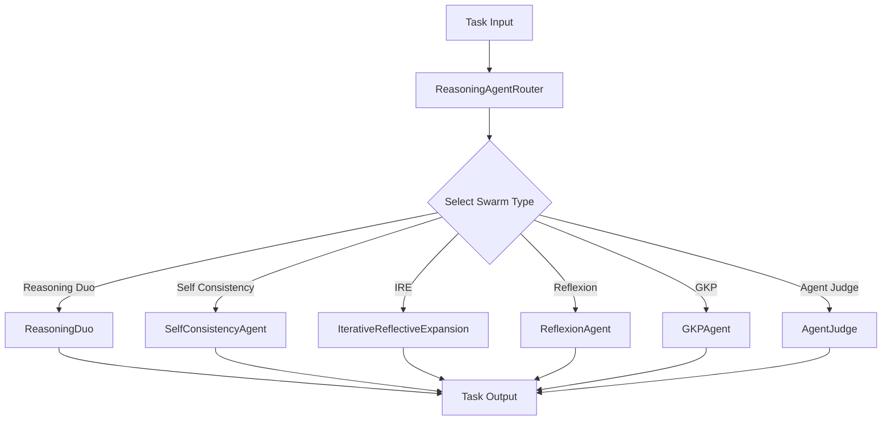

# ReasoningAgentRouter

!!! abstract "Overview"
    The ReasoningAgentRouter is a sophisticated agent routing system that enables dynamic selection and execution of different reasoning strategies based on the task requirements. It provides a flexible interface to work with multiple reasoning approaches including Reasoning Duo, Self-Consistency, IRE (Iterative Reflective Expansion), Reflexion, GKP (Generated Knowledge Prompting), and Agent Judge.

## Architecture



## Configuration

### Arguments

!!! info "Constructor Parameters"

    | Argument | Type | Default | Description |
    |----------|------|---------|-------------|
    | `agent_name` | str | "reasoning_agent" | Name identifier for the agent |
    | `description` | str | "A reasoning agent..." | Description of the agent's capabilities |
    | `model_name` | str | "gpt-4o-mini" | The underlying language model to use |
    | `system_prompt` | str | "You are a helpful..." | System prompt for the agent |
    | `max_loops` | int | 1 | Maximum number of reasoning loops |
    | `swarm_type` | agent_types | "reasoning_duo" | Type of reasoning swarm to use |
    | `num_samples` | int | 1 | Number of samples for self-consistency |
    | `output_type` | OutputType | "dict-all-except-first" | Format of the output |
    | `num_knowledge_items` | int | 6 | Number of knowledge items for GKP agent |
    | `memory_capacity` | int | 6 | Memory capacity for agents that support it |
    | `eval` | bool | False | Enable evaluation mode for self-consistency |
    | `random_models_on` | bool | False | Enable random model selection for diversity |
    | `majority_voting_prompt` | Optional[str] | None | Custom prompt for majority voting |
    | `reasoning_model_name` | Optional[str] | "claude-3-5-sonnet-20240620" | Model to use for reasoning in ReasoningDuo |

### Available Agent Types

!!! note "Supported Types"
    The following agent types are supported through the `swarm_type` parameter:

    - `"reasoning-duo"` or `"reasoning-agent"`
    - `"self-consistency"` or `"consistency-agent"` 
    - `"ire"` or `"ire-agent"`
    - `"ReflexionAgent"`
    - `"GKPAgent"`
    - `"AgentJudge"`

### Agent Types Comparison

=== "Reasoning Duo"
    **Key Features**
    
    - Dual agent system
    - Collaborative reasoning
    - Split between reasoning and execution
    
    **Best Use Cases**
    
    - Complex tasks requiring both analysis and action
    - Multi-step problem solving
    - Tasks needing verification
    
    **Required Parameters**
    
    - model_name
    - system_prompt
    
    **Optional Parameters**
    
    - output_type
    - reasoning_model_name (default: "claude-3-5-sonnet-20240620")
    - max_loops
    - img (for image input support)

=== "Self Consistency"
    **Key Features**
    
    - Multiple solution generation
    - Consensus building
    - Solution verification
    - Concurrent execution
    - AI-powered aggregation
    
    **Best Use Cases**
    
    - Tasks requiring high reliability
    - Problems with multiple approaches
    - Validation-heavy tasks
    - Mathematical problem solving
    - Decision making scenarios
    
    **Required Parameters**
    
    - model_name
    - system_prompt
    
    **Optional Parameters**
    
    - num_samples (default: 5)
    - max_loops (default: 1)
    - output_type (default: "dict")
    - eval (default: False) - Enable answer validation
    - random_models_on (default: False) - Enable model diversity
    - majority_voting_prompt (default: None) - Custom aggregation prompt

=== "IRE"
    **Key Features**
    
    - Iterative improvement
    - Self-reflection
    - Progressive refinement
    
    **Best Use Cases**
    
    - Complex reasoning tasks
    - Problems requiring refinement
    - Learning from previous iterations
    
    **Required Parameters**
    
    - model_name
    - system_prompt
    
    **Optional Parameters**

    - max_loops
    - output_type

=== "ReflexionAgent"
    **Key Features**
    
    - Self-reflection capabilities
    - Learning from experience
    - Adaptive reasoning
    
    **Best Use Cases**
    
    - Tasks requiring introspection
    - Continuous improvement scenarios
    - Learning-based tasks
    
    **Required Parameters**
    
    - model_name
    - system_prompt
    
    **Optional Parameters**
    
    - max_loops

=== "GKPAgent"
    **Key Features**
    
    - Knowledge generation
    - Information synthesis
    - Knowledge base management
    
    **Best Use Cases**
    
    - Knowledge-intensive tasks
    - Information gathering
    - Research-based problems
    
    **Required Parameters**
    
    - model_name
    - num_knowledge_items
    
    **Optional Parameters**
    
    - memory_capacity

=== "AgentJudge"
    **Key Features**
    
    - Solution evaluation
    - Quality assessment
    - Decision making
    
    **Best Use Cases**
    
    - Quality control tasks
    - Solution validation
    - Performance evaluation
    
    **Required Parameters**
    
    - model_name
    - system_prompt
    
    **Optional Parameters**
    
    - max_loops

## Usage

### Methods

!!! tip "Available Methods"
    | Method | Description |
    |--------|-------------|
    | `select_swarm()` | Selects and initializes the appropriate reasoning swarm based on specified type |
    | `run(task: str, img: Optional[str] = None, **kwargs)` | Executes the selected swarm's reasoning process on the given task |
    | `batched_run(tasks: List[str], imgs: Optional[List[str]] = None, **kwargs)` | Executes the reasoning process on a batch of tasks |

### Image Support

!!! info "Multi-modal Capabilities"
    The ReasoningAgentRouter supports image inputs for compatible agent types:

    **Supported Parameters:**
    
    - `img` (str, optional): Path or URL to a single image file for single task execution
    - `imgs` (List[str], optional): List of image paths/URLs for batch task execution

    **Compatible Agent Types:**
    
    - `reasoning-duo` / `reasoning-agent`: Full image support for both reasoning and execution phases
    - Other agent types may have varying levels of image support depending on their underlying implementation

    **Usage Example:**
    ```python
    # Single image with task
    router = ReasoningAgentRouter(swarm_type="reasoning-duo")
    result = router.run(
        task="Describe what you see in this image",
        img="path/to/image.jpg"
    )

    # Batch processing with images
    results = router.batched_run(
        tasks=["Analyze this chart", "Describe this photo"],
        imgs=["chart.png", "photo.jpg"]
    )
    ```

### Code Examples

=== "Basic Usage"
    ```python
    from swarms.agents.reasoning_agent_router import ReasoningAgentRouter

    # Initialize the router
    router = ReasoningAgentRouter(
        agent_name="reasoning-agent",
        description="A reasoning agent that can answer questions and help with tasks.",
        model_name="gpt-4o-mini",
        system_prompt="You are a helpful assistant that can answer questions and help with tasks.",
        max_loops=1,
        swarm_type="self-consistency",
        num_samples=3,
        eval=False,
        random_models_on=False,
        majority_voting_prompt=None
    )

    # Run a single task
    result = router.run("What is the best approach to solve this problem?")
    
    # Run with image input
    result_with_image = router.run(
        "Analyze this image and provide insights",
        img="path/to/image.jpg"
    )
    ```

=== "Self-Consistency Examples"
    ```python
    # Basic self-consistency
    router = ReasoningAgentRouter(
        swarm_type="self-consistency",
        num_samples=3,
        model_name="gpt-4o-mini"
    )
    
    # Self-consistency with evaluation mode
    router = ReasoningAgentRouter(
        swarm_type="self-consistency",
        num_samples=5,
        model_name="gpt-4o-mini",
        eval=True,
        random_models_on=True
    )
    
    # Self-consistency with custom majority voting
    router = ReasoningAgentRouter(
        swarm_type="self-consistency",
        num_samples=3,
        model_name="gpt-4o-mini",
        majority_voting_prompt="Analyze the responses and provide the most accurate answer."
    )
    ```

=== "ReflexionAgent"
    ```python
    router = ReasoningAgentRouter(
        swarm_type="ReflexionAgent",
        max_loops=3,
        model_name="gpt-4o-mini"
    )
    ```

=== "GKPAgent"
    ```python
    router = ReasoningAgentRouter(
        swarm_type="GKPAgent",
        model_name="gpt-4o-mini",
        num_knowledge_items=6
    )
    ```

=== "ReasoningDuo Examples"
    ```python
    # Basic ReasoningDuo
    router = ReasoningAgentRouter(
        swarm_type="reasoning-duo",
        model_name="gpt-4o-mini",
        reasoning_model_name="claude-3-5-sonnet-20240620"
    )
    
    # ReasoningDuo with image support
    router = ReasoningAgentRouter(
        swarm_type="reasoning-duo",
        model_name="gpt-4o-mini",
        reasoning_model_name="gpt-4-vision-preview",
        max_loops=2
    )
    
    result = router.run(
        "Analyze this image and explain the patterns you see",
        img="data_visualization.png"
    )
    ```

=== "AgentJudge"
    ```python
    router = ReasoningAgentRouter(
        swarm_type="AgentJudge",
        model_name="gpt-4o-mini",
        max_loops=2
    )
    ```

## Best Practices

!!! tip "Optimization Tips"
    1. **Swarm Type Selection**
        - Use ReasoningDuo for tasks requiring both analysis and action
        
        - Use SelfConsistency for tasks requiring high reliability
        
        - Use IRE for complex problem-solving requiring iterative refinement

    2. **Performance Optimization**
        - Adjust max_loops based on task complexity
        
        - Increase num_samples for higher reliability (3-7 for most tasks)
        
        - Choose appropriate model_name based on task requirements
        
        - Enable random_models_on for diverse reasoning approaches
        
        - Use eval mode for validation tasks with known answers

    3. **Output Handling**
        - Use appropriate output_type for your needs
        
        - Process batched results appropriately
        
        - Handle errors gracefully
        
    4. **Self-Consistency Specific**
        - Use 3-5 samples for most tasks, 7+ for critical decisions
        
        - Enable eval mode when you have expected answers for validation
        
        - Customize majority_voting_prompt for domain-specific aggregation
        
        - Consider random_models_on for diverse model perspectives

    5. **Multi-modal and Reasoning Configuration**
        - Use vision-capable models when processing images (e.g., "gpt-4-vision-preview")
        
        - For ReasoningDuo, set different models for reasoning vs execution via reasoning_model_name
        
        - Ensure image paths are accessible and in supported formats (JPG, PNG, etc.)
        
        - Consider using reasoning_model_name with specialized reasoning models for complex tasks

## Limitations

!!! warning "Known Limitations"
    1. Processing time increases with:
        - Higher num_samples
        
        - Larger max_loops
        
        - More complex tasks

    2. Model-specific limitations based on:
        - Token limits
        
        - Model capabilities
        
        - API rate limits

## Contributing

!!! note "Development Guidelines"
    When extending the ReasoningAgentRouter:
    
    1. Follow the existing swarm interface
    2. Add comprehensive tests
    3. Update documentation
    4. Maintain error handling
