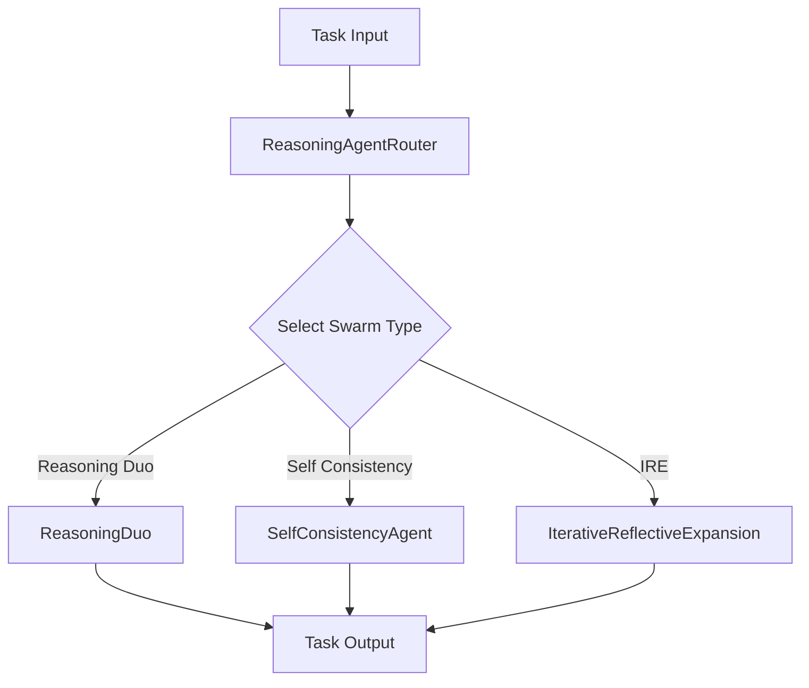

# ReasoningAgentRouter Documentation

The ReasoningAgentRouter is a sophisticated agent routing system that enables dynamic selection and execution of different reasoning strategies based on the task requirements. It provides a flexible interface to work with multiple reasoning approaches including Reasoning Duo, Self-Consistency, and Iterative Reflective Expansion (IRE).

## Architecture



## Class: ReasoningAgentRouter

### Arguments

| Argument | Type | Default | Description |
|----------|------|---------|-------------|
| agent_name | str | "reasoning_agent" | Name identifier for the agent |
| description | str | "A reasoning agent..." | Description of the agent's capabilities |
| model_name | str | "gpt-4o-mini" | The underlying language model to use |
| system_prompt | str | "You are a helpful..." | System prompt for the agent |
| max_loops | int | 1 | Maximum number of reasoning loops |
| swarm_type | agent_types | "reasoning_duo" | Type of reasoning swarm to use |
| num_samples | int | 1 | Number of samples for self-consistency |
| output_type | OutputType | "dict" | Format of the output |

### Methods

| Method | Description |
|--------|-------------|
| select_swarm() | Selects and initializes the appropriate reasoning swarm based on specified type |
| run(task: str) | Executes the selected swarm's reasoning process on the given task |
| batched_run(tasks: List[str]) | Executes the reasoning process on a batch of tasks |

### Swarm Types

1. **ReasoningDuo**
   - Uses two agents working together
   - One for reasoning, one for execution
   - Best for tasks requiring both analysis and action

2. **SelfConsistencyAgent**
   - Generates multiple samples
   - Ensures consistency across reasoning paths
   - Ideal for tasks requiring high reliability

3. **IterativeReflectiveExpansion (IRE)**
   - Uses iterative refinement
   - Reflects on and improves reasoning paths
   - Best for complex problem-solving

## Usage Examples

### Basic Usage

```python
from swarms.agents.reasoning_agents import ReasoningAgentRouter

# Initialize the router
router = ReasoningAgentRouter(
    agent_name="reasoning-agent",
    description="A reasoning agent that can answer questions and help with tasks.",
    model_name="gpt-4o-mini",
    system_prompt="You are a helpful assistant that can answer questions and help with tasks.",
    max_loops=1,
    swarm_type="self-consistency",
    num_samples=1,
    output_type="list"
)

# Run a single task
result = router.run("What is the best approach to solve this problem?")
```

### Batch Processing

```python
# Process multiple tasks
tasks = [
    "What is the optimal solution for X?",
    "How should we approach problem Y?"
]
results = router.batched_run(tasks)
```

### Using Different Swarm Types

#### ReasoningDuo

```python
router = ReasoningAgentRouter(
    swarm_type="reasoning-duo",
    model_name="gpt-4o-mini"
)
```

#### Self-Consistency

```python
router = ReasoningAgentRouter(
    swarm_type="self-consistency",
    num_samples=3,
    model_name="gpt-4o-mini"
)
```

#### IRE

```python
router = ReasoningAgentRouter(
    swarm_type="ire",
    max_loops=5,
    model_name="gpt-4o-mini"
)
```

## Best Practices

1. **Swarm Type Selection**
   - Use ReasoningDuo for tasks requiring both analysis and action
   - Use SelfConsistency for tasks requiring high reliability
   - Use IRE for complex problem-solving requiring iterative refinement

2. **Performance Optimization**
   - Adjust max_loops based on task complexity
   - Increase num_samples for higher reliability
   - Choose appropriate model_name based on task requirements

3. **Output Handling**
   - Use appropriate output_type for your needs
   - Process batched results appropriately
   - Handle errors gracefully

## Error Handling

The ReasoningAgentRouter includes built-in error handling for:
- Invalid swarm types
- Model execution failures
- Task processing errors

## Limitations

1. Processing time increases with:
   - Higher num_samples
   - Larger max_loops
   - More complex tasks

2. Model-specific limitations based on:
   - Token limits
   - Model capabilities
   - API rate limits

## Contributing

When extending the ReasoningAgentRouter:
1. Follow the existing swarm interface
2. Add comprehensive tests
3. Update documentation
4. Maintain error handling
