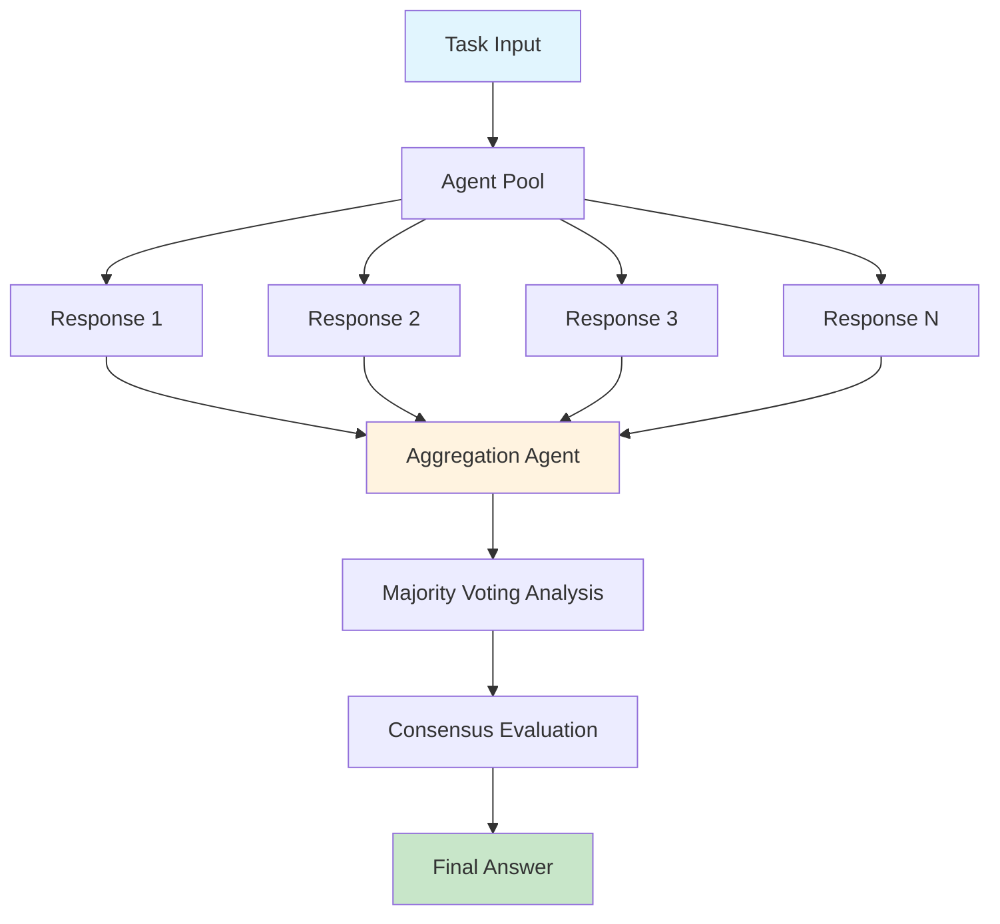
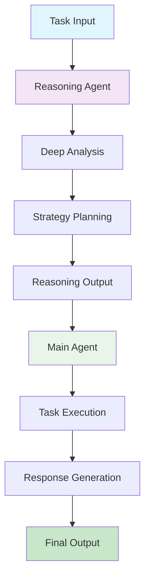
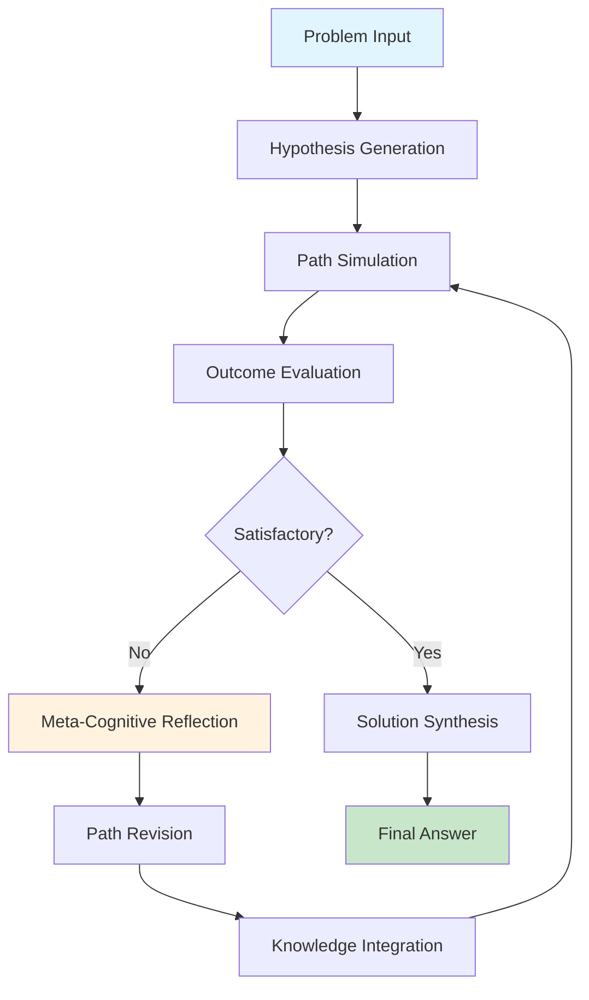
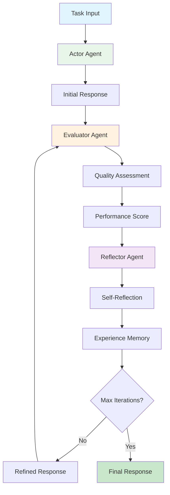
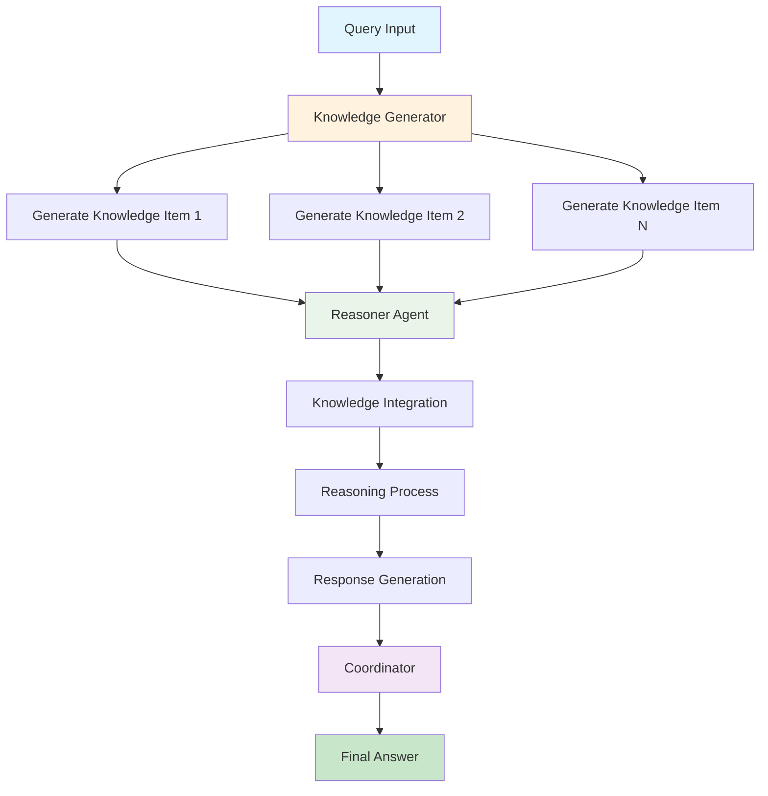
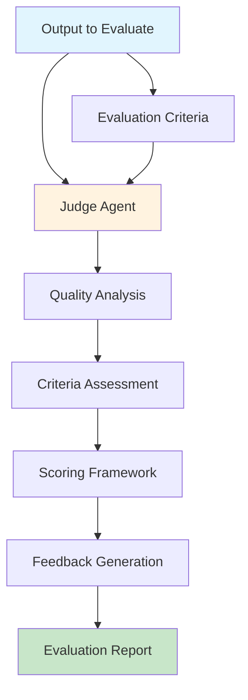
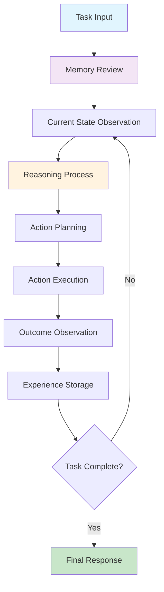

# Reasoning Agents Overview


Reasoning agents are sophisticated agents that employ advanced cognitive strategies to improve problem-solving performance beyond standard language model capabilities. Unlike traditional prompt-based approaches, reasoning agents implement structured methodologies that enable them to think more systematically, self-reflect, collaborate, and iteratively refine their responses.

These agents are inspired by cognitive science and human reasoning processes, incorporating techniques such as:

- **Multi-step reasoning**: Breaking down complex problems into manageable components

- **Self-reflection**: Evaluating and critiquing their own outputs

- **Iterative refinement**: Progressively improving solutions through multiple iterations

- **Collaborative thinking**: Using multiple reasoning pathways or agent perspectives

- **Memory integration**: Learning from past experiences and building knowledge over time

- **Meta-cognitive awareness**: Understanding their own thinking processes and limitations


## Available Reasoning Agents

| Agent Name | Type | Research Paper | Key Features | Best Use Cases | Implementation | Documentation |
|------------|------|----------------|---------------|----------------|----------------|---------------|
| **Self-Consistency Agent** | Consensus-based | [Self-Consistency Improves Chain of Thought Reasoning](https://arxiv.org/abs/2203.07870) (Wang et al., 2022) | • Multiple independent reasoning paths<br/>• Majority voting aggregation<br/>• Concurrent execution<br/>• Validation mode | • Mathematical problem solving<br/>• High-accuracy requirements<br/>• Decision making scenarios<br/>• Answer validation | `SelfConsistencyAgent` | [Guide](consistency_agent.md) |
| **Reasoning Duo** | Collaborative | Novel dual-agent architecture | • Separate reasoning and execution agents<br/>• Collaborative problem solving<br/>• Task decomposition<br/>• Cross-validation | • Complex analysis tasks<br/>• Multi-step problem solving<br/>• Tasks requiring verification<br/>• Research and planning | `ReasoningDuo` | [Guide](reasoning_duo.md) |
| **IRE Agent** | Iterative | Iterative Reflective Expansion framework | • Hypothesis generation<br/>• Path simulation<br/>• Error reflection<br/>• Dynamic revision | • Complex reasoning tasks<br/>• Research problems<br/>• Learning scenarios<br/>• Strategy development | `IterativeReflectiveExpansion` | [Guide](iterative_agent.md) |
| **Reflexion Agent** | Self-reflective | [Reflexion: Language Agents with Verbal Reinforcement Learning](https://arxiv.org/abs/2303.11366) (Shinn et al., 2023) | • Self-evaluation<br/>• Experience memory<br/>• Adaptive improvement<br/>• Learning from failures | • Continuous improvement tasks<br/>• Long-term projects<br/>• Learning scenarios<br/>• Quality refinement | `ReflexionAgent` | [Guide](reflexion_agent.md) |
| **GKP Agent** | Knowledge-based | [Generated Knowledge Prompting](https://arxiv.org/abs/2110.08387) (Liu et al., 2022) | • Knowledge generation<br/>• Multi-perspective reasoning<br/>• Information synthesis<br/>• Fact integration | • Knowledge-intensive tasks<br/>• Research questions<br/>• Fact-based reasoning<br/>• Information synthesis | `GKPAgent` | [Guide](gkp_agent.md) |
| **Agent Judge** | Evaluation | [Agent-as-a-Judge: Evaluate Agents with Agents](https://arxiv.org/abs/2410.10934) | • Quality assessment<br/>• Structured evaluation<br/>• Performance metrics<br/>• Feedback generation | • Quality control<br/>• Output evaluation<br/>• Performance assessment<br/>• Model comparison | `AgentJudge` | [Guide](agent_judge.md) |
| **REACT Agent** | Action-based | [ReAct: Synergizing Reasoning and Acting](https://arxiv.org/abs/2210.03629) (Yao et al., 2022) | • Reason-Act-Observe cycle<br/>• Memory integration<br/>• Action planning<br/>• Experience building | • Interactive tasks<br/>• Tool usage scenarios<br/>• Planning problems<br/>• Learning environments | `ReactAgent` | [Guide](react_agent.md) |

## Agent Architectures

### Self-Consistency Agent

**Description**: Implements multiple independent reasoning paths with consensus-building to improve response reliability and accuracy through majority voting mechanisms.

**Key Features**:

- Concurrent execution of multiple reasoning instances

- AI-powered aggregation and consensus analysis

- Validation mode for answer verification

- Configurable sample sizes and output formats


**Architecture Diagram**:



**Use Cases**: Mathematical problem solving, high-stakes decision making, answer validation, quality assurance processes

**Implementation**: `SelfConsistencyAgent`

**Documentation**: [Self-Consistency Agent Guide](consistency_agent.md)

---

### Reasoning Duo

**Description**: Dual-agent collaborative system that separates reasoning and execution phases, enabling specialized analysis and task completion through coordinated agent interaction.

**Key Features**:

- Separate reasoning and execution agents

- Collaborative problem decomposition

- Cross-validation between agents

- Configurable model selection for each agent


**Architecture Diagram**:



**Use Cases**: Complex analysis tasks, multi-step problem solving, research and planning, verification workflows

**Implementation**: `ReasoningDuo`

**Documentation**: [Reasoning Duo Guide](reasoning_duo.md)

---

### IRE Agent (Iterative Reflective Expansion)

**Description**: Sophisticated reasoning framework employing iterative hypothesis generation, simulation, and refinement through continuous cycles of testing and meta-cognitive reflection.

**Key Features**:

- Hypothesis generation and testing

- Path simulation and evaluation

- Meta-cognitive reflection capabilities

- Dynamic strategy revision based on feedback


**Architecture Diagram**:



**Use Cases**: Complex reasoning tasks, research problems, strategy development, iterative learning scenarios

**Implementation**: `IterativeReflectiveExpansion`

**Documentation**: [IRE Agent Guide](iterative_agent.md)

---

### Reflexion Agent

**Description**: Advanced self-reflective system implementing actor-evaluator-reflector architecture for continuous improvement through experience-based learning and memory integration.

**Key Features**:

- Actor-evaluator-reflector sub-agent architecture

- Self-evaluation and quality assessment

- Experience memory and learning capabilities

- Adaptive improvement through reflection


**Architecture Diagram**:



**Use Cases**: Continuous improvement tasks, long-term projects, adaptive learning, quality refinement processes

**Implementation**: `ReflexionAgent`

**Documentation**: [Reflexion Agent Guide](reflexion_agent.md)

---

### GKP Agent (Generated Knowledge Prompting)

**Description**: Knowledge-driven reasoning system that generates relevant information before answering queries, implementing multi-perspective analysis through coordinated knowledge synthesis.

**Key Features**:

- Dynamic knowledge generation

- Multi-perspective reasoning coordination

- Information synthesis and integration

- Configurable knowledge item generation


**Architecture Diagram**:



**Use Cases**: Knowledge-intensive tasks, research questions, fact-based reasoning, information synthesis

**Implementation**: `GKPAgent`

**Documentation**: [GKP Agent Guide](gkp_agent.md)

---

### Agent Judge

**Description**: Specialized evaluation system for assessing agent outputs and system performance, providing structured feedback and quality metrics through comprehensive assessment frameworks.

**Key Features**:

- Structured evaluation methodology

- Quality assessment and scoring

- Performance metrics generation

- Configurable evaluation criteria


**Architecture Diagram**:



**Use Cases**: Quality control, output evaluation, performance assessment, model comparison

**Implementation**: `AgentJudge`

**Documentation**: [Agent Judge Guide](agent_judge.md)

---

### REACT Agent (Reason-Act-Observe)

**Description**: Action-oriented reasoning system implementing iterative reason-act-observe cycles with memory integration for interactive task completion and environmental adaptation.

**Key Features**:

- Reason-Act-Observe cycle implementation

- Memory integration and experience building

- Action planning and execution

- Environmental state observation


**Architecture Diagram**:



**Use Cases**: Interactive tasks, tool usage scenarios, planning problems, learning environments

**Implementation**: `ReactAgent`

**Documentation**: [REACT Agent Guide](react_agent.md)


## Implementation Guide

### Unified Interface via Reasoning Agent Router

The `ReasoningAgentRouter` provides a centralized interface for accessing all reasoning agent implementations:

```python
from swarms.agents import ReasoningAgentRouter

# Initialize router with specific reasoning strategy
router = ReasoningAgentRouter(
    swarm_type="self-consistency",  # Select reasoning methodology
    model_name="gpt-4o-mini",
    num_samples=5,                  # Configuration for consensus-based methods
    max_loops=3                     # Configuration for iterative methods
)

# Execute reasoning process
result = router.run("Analyze the optimal solution for this complex business problem")
print(result)
```

### Direct Agent Implementation

```python
from swarms.agents import SelfConsistencyAgent, ReasoningDuo, ReflexionAgent

# Self-Consistency Agent for high-accuracy requirements
consistency_agent = SelfConsistencyAgent(
    model_name="gpt-4o-mini",
    num_samples=5
)

# Reasoning Duo for collaborative analysis workflows
duo_agent = ReasoningDuo(
    model_names=["gpt-4o-mini", "gpt-4.1"]
)

# Reflexion Agent for adaptive learning scenarios
reflexion_agent = ReflexionAgent(
    model_name="gpt-4o-mini",
    max_loops=3,
    memory_capacity=100
)
```

## Choosing the Right Reasoning Agent

| Scenario | Recommended Agent | Why? |
|----------|------------------|-------|
| **High-stakes decisions** | Self-Consistency | Multiple validation paths ensure reliability |
| **Complex research tasks** | Reasoning Duo + GKP | Collaboration + knowledge synthesis |
| **Learning & improvement** | Reflexion | Built-in self-improvement mechanisms |
| **Mathematical problems** | Self-Consistency | Proven effectiveness on logical reasoning |
| **Quality assessment** | Agent Judge | Specialized evaluation capabilities |
| **Interactive planning** | REACT | Action-oriented reasoning cycle |
| **Iterative refinement** | IRE | Designed for progressive improvement |


## Technical Documentation

For comprehensive technical documentation on each reasoning agent implementation:

- [Self-Consistency Agent](consistency_agent.md)

- [Reasoning Duo](reasoning_duo.md)

- [IRE Agent](iterative_agent.md)

- [Reflexion Agent](reflexion_agent.md)

- [GKP Agent](gkp_agent.md)

- [Agent Judge](agent_judge.md)

- [Reasoning Agent Router](reasoning_agent_router.md)


---

Reasoning agents represent a significant advancement in enterprise agent capabilities, implementing sophisticated cognitive architectures that deliver enhanced reliability, consistency, and performance compared to traditional language model implementations. 