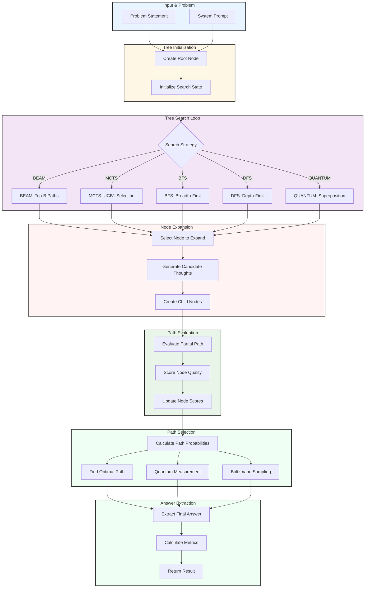

# Tree-of-Thought (ToT) Reasoning Agent

A comprehensive tree-based reasoning framework that introduces a tree-structured latent variable representing multiple candidate reasoning paths, enabling systematic exploration of solution spaces using beam search, MCTS, and quantum-inspired sampling.

## Overview

The Tree-of-Thought (ToT) Agent implements a formal framework where reasoning is modeled as a tree structure \(T = (V, E)\) with multiple candidate reasoning paths. Unlike linear chain-of-thought, ToT allows branching at each step, enabling exploration of diverse solution approaches and systematic search through the reasoning space.

**Key Capabilities:**

| Capability | Description |
|------------|-------------|
| **Tree-Based Reasoning** | Models reasoning as a tree with nodes (thoughts) and edges (transitions) |
| **Multiple Search Strategies** | Beam search, BFS, DFS, MCTS, and quantum-inspired search |
| **Path Evaluation** | Scores partial reasoning paths using LLM-based heuristics |
| **Information-Theoretic Analysis** | Computes path entropy, information gain, and tree diversity |
| **Monte Carlo Tree Search** | UCB1-based exploration-exploitation for optimal path finding |
| **Quantum Tree Superposition** | Quantum-inspired superposition of multiple paths with measurement |
| **Statistical Mechanics** | Boltzmann distribution, partition function, and free energy for path selection |
| **Optimal Path Finding** | Regularized path optimization balancing score and length |

### Mathematical Foundation

Tree-of-Thought (ToT) introduces a tree-structured latent variable \(R\) representing multiple candidate reasoning paths:

\[
p_\theta(y \mid x) = \sum_{R \in \mathcal{T}} p_\theta(R \mid x) \cdot p_\theta(y \mid R, x)
\]

where:
- \(x \in X\): input (question, task description)
- \(y \in Y\): final answer
- \(R = \{r^{(1)}, r^{(2)}, \ldots, r^{(k)}\}\): set of candidate reasoning paths
- \(\mathcal{T}\): set of reasoning trees
- \(\theta\): model parameters

## Architecture



## Getting Started

### Installation

The ToT Agent is included in the Swarms framework:

```bash
pip install swarms
```

### Basic Usage

**Example 1: Simple problem solving**

```python
from swarms.agents import ToTAgent

agent = ToTAgent(
    agent_name="tot-agent",
    model_name="gpt-4o"
)

answer = agent.run("If a train travels 120 miles in 2 hours, what is its average speed?")
print(answer)
```

**Example 2: With custom configuration**

```python
from swarms.agents import ToTAgent, ToTConfig, SearchStrategy

config = ToTConfig(
    max_depth=7,
    branch_factor=5,
    beam_width=10,
    search_strategy=SearchStrategy.BEAM,
    temperature=0.7,
    evaluation_temperature=0.3
)

agent = ToTAgent(
    agent_name="advanced-tot",
    model_name="gpt-4o",
    config=config
)

result = agent.run("Prove that the square root of 2 is irrational", return_tree=True)
print("Answer:", result["final_answer"])
print("Confidence:", result["confidence"])
print("Tree depth:", result["tree_metrics"]["max_depth"])
```

**Example 3: Using MCTS search**

```python
config = ToTConfig(
    max_depth=10,
    branch_factor=3,
    search_strategy=SearchStrategy.MCTS,
    mcts_simulations=200,
    mcts_exploration=1.414  # sqrt(2)
)

agent = ToTAgent(
    agent_name="mcts-tot",
    model_name="gpt-4o",
    config=config
)

answer = agent.run("Design an algorithm to find the longest increasing subsequence")
print(answer)
```

**Example 4: Using an existing Agent**

```python
from swarms.structs.agent import Agent
from swarms.agents import ToTAgent

# Wrap an existing agent
base_agent = Agent(
    agent_name="base",
    model_name="gpt-4o",
    description="Base reasoning agent"
)

tot_agent = ToTAgent(
    agent_name="tot-wrapper",
    agent=base_agent
)

answer = tot_agent.run("Explain quantum entanglement in simple terms")
print(answer)
```

## Mathematical Foundation

### Core Probabilistic Model

The fundamental ToT model:

\[
p_\theta(y \mid x) = \sum_{R \in \mathcal{T}} p_\theta(R \mid x) \cdot p_\theta(y \mid R, x)
\]

where:
- \(x \in X\): input (question, task description)
- \(y \in Y\): final answer
- \(R = \{r^{(1)}, r^{(2)}, \ldots, r^{(k)}\}\): set of candidate reasoning paths
- \(\mathcal{T}\): set of reasoning trees
- \(\theta\): model parameters

### Tree Structure

\[
T = (V, E)
\]

where:
- \(V = \{v_1, v_2, \ldots, v_n\}\): nodes (thoughts)
- \(E = \{(v_i, v_j) \mid v_i \to v_j\}\): edges (reasoning transitions)
- **Root:** \(v_{\text{root}} =\) initial problem state
- **Leaves:** \(L = \{v \mid \text{children}(v) = \emptyset\}\)

### Path Probability

\[
P(\text{path} = (v_0, v_1, \ldots, v_k)) = \prod_{i=0}^{k-1} P(v_{i+1} \mid v_i, x)
\]

where \(P(v_{i+1} \mid v_i, x)\) is the transition probability.

### Marginalization over Tree

\[
p_\theta(y \mid x) = \sum_{\text{path} \in \text{paths}(T)} P(\text{path}) \cdot p_\theta(y \mid \text{path}, x)
\]

where \(\text{paths}(T)\) is the set of all root-to-leaf paths.

### Information-Theoretic Tree Search

**Information gain at node \(v\):**

\[
I(v; Y \mid x) = H(Y \mid x) - H(Y \mid v, x)
\]

**Expected information gain:**

\[
\mathbb{E}[I(v; Y \mid x)] = \sum_{\text{child}} P(\text{child} \mid v) \cdot I(\text{child}; Y \mid x)
\]

### Quantum Tree Superposition

**Quantum State:**

\[
|\psi_{\text{tree}}\rangle = \sum_{\text{path}} \alpha_{\text{path}} |\text{path}\rangle \otimes |y_{\text{path}}\rangle
\]

where:
- \(\alpha_{\text{path}} = \sqrt{P(\text{path})}\): amplitude for path
- \(|\text{path}\rangle\): quantum state representing reasoning path
- \(|y_{\text{path}}\rangle\): answer state for path

**Measurement Probability:**

\[
P(y \mid x) = |\langle y \mid \psi_{\text{tree}}\rangle|^2 = \left|\sum_{\text{path}: y_{\text{path}}=y} \alpha_{\text{path}}\right|^2
\]

### Monte Carlo Tree Search (MCTS)

**UCB1 Formula:**

\[
\text{UCB1}(v) = Q(v) + c \cdot \sqrt{\frac{\ln(N(v_{\text{parent}}))}{N(v)}}
\]

where:
- \(Q(v) = \frac{1}{N(v)} \sum_{i=1}^{N(v)} V_i\): average value
- \(N(v)\): visit count
- \(c = \sqrt{2}\): exploration constant (typically)
- \(V_i\): evaluation value from simulation \(i\)

**Value Backpropagation:**

\[
Q(v) \leftarrow \frac{N(v) \cdot Q(v) + V_{\text{new}}}{N(v) + 1}
\]

\[
N(v) \leftarrow N(v) + 1
\]

**Selection Policy:**

\[
v^* = \arg\max_{v \in \text{children}(v_{\text{parent}})} \text{UCB1}(v)
\]

### Beam Search (Pruned Tree Search)

**Beam Width \(B\):** Keep top-\(B\) nodes at each depth:

\[
\text{Beam}_d = \{v \mid v \in \text{Top}_B(\text{score}(v), v \in \text{candidates}_d)\}
\]

**Score Function:**

\[
\text{score}(v) = \alpha \cdot \text{heuristic}(v) + \beta \cdot \text{depth\_penalty}(v) + \gamma \cdot \text{path\_prob}(v)
\]

where:
- \(\text{heuristic}(v)\): evaluator score
- \(\text{depth\_penalty}(v) = -\lambda \cdot \text{depth}(v)\)
- \(\text{path\_prob}(v) = \log P(\text{path\_to\_}v)\)

### Statistical Mechanics (Tree Energy)

**Energy of Path:**

\[
E(\text{path}, x) = -\log P(\text{path} \mid x) = -\sum_{i} \log P(v_{i+1} \mid v_i, x)
\]

**Boltzmann Distribution over Paths:**

\[
P(\text{path} \mid x) = \frac{1}{Z(x)} \exp\left(-\frac{E(\text{path}, x)}{T}\right)
\]

**Partition Function:**

\[
Z(x) = \sum_{\text{path} \in \text{paths}(T)} \exp\left(-\frac{E(\text{path}, x)}{T}\right)
\]

**Free Energy:**

\[
F(x) = -T \log Z(x)
\]

### Graph-Theoretic Properties

**Tree Depth:**

\[
D = \max_{\text{path}} |\text{path}|
\]

**Branching Factor:**

\[
b = \text{avg}_v |\text{children}(v)|
\]

**Tree Size (for balanced tree):**

\[
|T| = \sum_{d=0}^D b^d
\]

**Path Diversity:**

\[
\text{Diversity}(T) = \frac{1}{|L|} \sum_{l_1, l_2 \in L} \text{distance}(l_1, l_2)
\]

where distance is edit distance or semantic distance.

### Optimization Objective

**Best Path Selection:**

\[
\text{path}^* = \arg\max_{\text{path}} \left[\log p_\theta(y \mid \text{path}, x) + \lambda \cdot \log P(\text{path} \mid x)\right]
\]

**Multi-Objective:**

\[
\text{path}^* = \arg\max_{\text{path}} [w_1 \cdot \text{correctness} + w_2 \cdot \text{efficiency} + w_3 \cdot \text{diversity}]
\]

### Computational Complexity

**Time Complexity:**

\[
O(b^D \cdot (\text{expand\_cost} + \text{eval\_cost}))
\]

where:
- \(b\): branching factor
- \(D\): max depth
- \(\text{expand\_cost}\): cost to generate children
- \(\text{eval\_cost}\): cost to evaluate node

**With Beam Search (width \(B\)):**

\[
O(B \cdot D \cdot (\text{expand\_cost} + \text{eval\_cost}))
\]

**With MCTS (\(N\) simulations):**

\[
O(N \cdot (\text{selection\_cost} + \text{expand\_cost} + \text{eval\_cost} + \text{backprop\_cost}))
\]

### Variational Tree Inference

**ELBO for Tree Search:**

\[
\log p_\theta(y \mid x) \geq \mathbb{E}_{q_\phi(\text{path} \mid x, y)}[\log p_\theta(y \mid \text{path}, x)] - \text{KL}(q_\phi(\text{path} \mid x, y) \parallel p_\theta(\text{path} \mid x))
\]

where \(q_\phi\) is the search policy (beam search, MCTS, etc.).

## Class Reference

### ToTAgent

Main entry point for Tree-of-Thought reasoning.

```python
ToTAgent(
    agent_name: str = "tot-agent",
    description: Optional[str] = None,
    model_name: Optional[str] = "gpt-4o",
    llm: Optional[Any] = None,
    system_prompt: Optional[str] = None,
    global_system_prompt: Optional[str] = None,
    secondary_system_prompt: Optional[str] = None,
    config: Optional[ToTConfig] = None,
    agent: Optional[Any] = None,
    **kwargs
)
```

#### Parameters

| Parameter | Type | Default | Description |
|-----------|------|---------|-------------|
| `agent_name` | `str` | `"tot-agent"` | Name of the agent |
| `description` | `Optional[str]` | `None` | Description of the agent |
| `model_name` | `Optional[str]` | `"gpt-4o"` | LLM model name (used if agent/llm not provided) |
| `llm` | `Optional[Any]` | `None` | Optional LLM instance or callable |
| `system_prompt` | `Optional[str]` | `None` | Optional custom system prompt |
| `global_system_prompt` | `Optional[str]` | `None` | Optional global system prompt |
| `secondary_system_prompt` | `Optional[str]` | `None` | Optional secondary system prompt |
| `config` | `Optional[ToTConfig]` | `None` | ToT configuration (uses defaults if None) |
| `agent` | `Optional[Any]` | `None` | Optional Agent instance to use |
| `**kwargs` | `Any` | - | Additional arguments passed to Agent if creating one |

#### Methods

**`run(task: str, return_tree: Optional[bool] = None) -> Union[str, Dict[str, Any]]`**

Run the Tree-of-Thought agent on a task.

**Mathematical Process:**

1. **Tree Initialization:** Create root node \(v_{\text{root}}\) with problem text
2. **Tree Search:** For \(t = 1, \ldots, T\):
   - Select node \(v_t\) using search strategy
   - Expand: Generate \(b\) candidate thoughts
   - Evaluate: Score each candidate
   - Prune: Keep top-\(B\) nodes (beam search) or select using UCB1 (MCTS)
3. **Path Selection:** Find optimal path using:
   - Path probability: \(P(\text{path}) = \prod_i P(v_{i+1} \mid v_i, x)\)
   - Regularized objective: \(\text{score}(\text{path}) - \lambda \cdot \text{length}(\text{path})\)
4. **Answer Extraction:** Extract final answer from best leaf node

**Returns:**
- If `return_tree=False`: Final answer string
- If `return_tree=True`: Dictionary with:
  - `"final_answer"`: Final answer string
  - `"reasoning"`: Complete reasoning path
  - `"score"`: Score of best path
  - `"confidence"`: Confidence in answer
  - `"tree_metrics"`: Tree structure metrics
  - `"path_entropy"`: Entropy of path distribution
  - `"tree_diversity"`: Diversity of leaf paths
  - `"partition_function"`: Partition function value
  - `"free_energy"`: Free energy value
  - `"tree"`: Full tree structure (if `return_tree=True`)

**Example:**

```python
agent = ToTAgent(agent_name="tot-agent", model_name="gpt-4o")

# Simple usage
answer = agent.run("What is the capital of France?")
print(answer)

# With tree structure
result = agent.run("Prove that 2+2=4", return_tree=True)
print("Answer:", result["final_answer"])
print("Confidence:", result["confidence"])
print("Tree depth:", result["tree_metrics"]["max_depth"])
print("Path entropy:", result["path_entropy"])
```

**`step(task: str, *args, **kwargs) -> str`**

Execute a single step of the ToT reasoning process.

**Returns:** Final answer string

### ToTConfig

Configuration for Tree-of-Thought reasoning.

```python
@dataclass
class ToTConfig:
    max_depth: int = 5
    branch_factor: int = 3
    beam_width: int = 5
    temperature: float = 0.7
    top_p: float = 0.9
    max_thought_length: int = 200
    search_strategy: SearchStrategy = SearchStrategy.BEAM
    mcts_simulations: int = 100
    mcts_exploration: float = 1.414  # sqrt(2)
    evaluation_temperature: float = 0.3
    answer_prefix: str = "Final answer:"
    return_tree: bool = False
```

#### Parameters

| Parameter | Type | Default | Description |
|-----------|------|---------|-------------|
| `max_depth` | `int` | `5` | Maximum depth of the reasoning tree |
| `branch_factor` | `int` | `3` | Number of candidate thoughts to generate per node |
| `beam_width` | `int` | `5` | Number of nodes to keep in beam search |
| `temperature` | `float` | `0.7` | Sampling temperature for thought generation |
| `top_p` | `float` | `0.9` | Nucleus sampling parameter |
| `max_thought_length` | `int` | `200` | Maximum length of a single thought in tokens |
| `search_strategy` | `SearchStrategy` | `SearchStrategy.BEAM` | Search strategy (BEAM, BFS, DFS, MCTS, QUANTUM) |
| `mcts_simulations` | `int` | `100` | Number of MCTS simulations (if using MCTS) |
| `mcts_exploration` | `float` | `1.414` | Exploration constant for UCB1 (if using MCTS) |
| `evaluation_temperature` | `float` | `0.3` | Temperature for evaluation prompts |
| `answer_prefix` | `str` | `"Final answer:"` | Prefix for final answer extraction |
| `return_tree` | `bool` | `False` | Whether to return the full tree structure |

### SearchStrategy (Enum)

Search strategies for exploring the reasoning tree.

- `BEAM`: Beam search (top-\(B\) paths at each depth)
- `BFS`: Breadth-first search
- `DFS`: Depth-first search
- `MCTS`: Monte Carlo Tree Search with UCB1
- `QUANTUM`: Quantum-inspired superposition sampling

### Utility Classes

#### TreeInformationTheory

Information-theoretic utilities for tree reasoning analysis.

**Methods:**

**`path_entropy(path_probs: List[float]) -> float`**

Calculate entropy of path distribution: \(H(\text{Path} \mid X) = -\sum P(\text{path}) \log P(\text{path})\).

**Mathematical Formulation:**

\[
H(\text{Path} \mid X) = -\sum_{\text{path}} P(\text{path}) \log_2 P(\text{path})
\]

**Example:**

```python
from swarms.agents import TreeInformationTheory

probs = [0.3, 0.4, 0.2, 0.1]
entropy = TreeInformationTheory.path_entropy(probs)
print(f"Path entropy: {entropy:.3f} bits")
```

**`information_gain(prior_entropy: float, conditional_entropy: float) -> float`**

Calculate information gain: \(I(V; Y \mid X) = H(Y \mid X) - H(Y \mid V, X)\).

**Mathematical Formulation:**

\[
I(V; Y \mid X) = H(Y \mid X) - H(Y \mid V, X)
\]

**Example:**

```python
prior_h = 3.5  # H(Y | X)
conditional_h = 2.1  # H(Y | V, X)
gain = TreeInformationTheory.information_gain(prior_h, conditional_h)
print(f"Information gain: {gain:.3f} bits")
```

**`expected_information_gain(node_probs: List[float], child_entropies: List[float]) -> float`**

Calculate expected information gain: \(\mathbb{E}[I(v; Y \mid x)] = \sum P(\text{child}) \cdot I(\text{child}; Y \mid x)\).

**Mathematical Formulation:**

\[
\mathbb{E}[I(v; Y \mid x)] = \sum_{\text{child}} P(\text{child} \mid v) \cdot I(\text{child}; Y \mid x)
\]

**Example:**

```python
node_probs = [0.4, 0.3, 0.3]
child_entropies = [0.5, 0.7, 0.6]
expected_gain = TreeInformationTheory.expected_information_gain(node_probs, child_entropies)
print(f"Expected information gain: {expected_gain:.3f} bits")
```

**`tree_diversity(leaf_paths: List[List[str]]) -> float`**

Calculate tree diversity: \(\text{Diversity}(T) = (1/|L|) \sum \text{distance}(l_1, l_2)\).

**Mathematical Formulation:**

\[
\text{Diversity}(T) = \frac{1}{|L|} \sum_{l_1, l_2 \in L} \text{distance}(l_1, l_2)
\]

where distance is edit distance or semantic distance.

**Example:**

```python
leaf_paths = [
    ["Step 1", "Step 2", "Answer A"],
    ["Step 1", "Step 3", "Answer B"],
    ["Step 1", "Step 2", "Answer C"]
]
diversity = TreeInformationTheory.tree_diversity(leaf_paths)
print(f"Tree diversity: {diversity:.3f}")
```

#### QuantumTreeSearch

Quantum-inspired tree search with superposition of paths.

**Methods:**

**`calculate_path_amplitudes(path_probs: List[float]) -> List[float]`**

Calculate quantum amplitudes: \(\alpha_{\text{path}} = \sqrt{P(\text{path})}\).

**Mathematical Formulation:**

\[
\alpha_{\text{path}} = \sqrt{P(\text{path})}
\]

**Example:**

```python
from swarms.agents import QuantumTreeSearch

probs = [0.25, 0.5, 0.15, 0.1]
amplitudes = QuantumTreeSearch.calculate_path_amplitudes(probs)
print(f"Amplitudes: {amplitudes}")
# Output: [0.5, 0.707, 0.387, 0.316]
```

**`quantum_measurement(paths: List[List[str]], answers: List[str], path_probs: Optional[List[float]] = None) -> Tuple[str, float]`**

Quantum measurement: \(P(y \mid x) = |\langle y \mid \psi_{\text{tree}}\rangle|^2 = |\sum_{\text{path}: y_{\text{path}}=y} \alpha_{\text{path}}|^2\).

**Mathematical Formulation:**

\[
P(y \mid x) = \left|\sum_{\text{path}: y_{\text{path}}=y} \alpha_{\text{path}}\right|^2
\]

**Example:**

```python
paths = [["path1"], ["path2"], ["path3"]]
answers = ["42", "42", "43"]
probs = [0.4, 0.3, 0.3]

answer, confidence = QuantumTreeSearch.quantum_measurement(
    paths=paths,
    answers=answers,
    path_probs=probs
)
print(f"Most likely answer: {answer} (confidence: {confidence:.3f})")
```

**`quantum_tree_sampling(nodes: List[Any], path_probs: List[float], num_samples: int = 1) -> List[Any]`**

Sample nodes using quantum-inspired superposition.

**Example:**

```python
sampled = QuantumTreeSearch.quantum_tree_sampling(
    nodes=[node1, node2, node3, node4],
    path_probs=[0.3, 0.3, 0.2, 0.2],
    num_samples=2
)
```

#### TreeEnergyFunction

Energy-based functions for tree reasoning (statistical mechanics).

**Methods:**

**`calculate_path_energy(path_logprob: float) -> float`**

Calculate energy of path: \(E(\text{path}, x) = -\log P(\text{path} \mid x)\).

**Mathematical Formulation:**

\[
E(\text{path}, x) = -\log P(\text{path} \mid x)
\]

**Example:**

```python
from swarms.agents import TreeEnergyFunction

logprob = -2.5  # log P(path | x)
energy = TreeEnergyFunction.calculate_path_energy(logprob)
print(f"Path energy: {energy:.3f}")
```

**`boltzmann_path_weight(energy: float, temperature: float) -> float`**

Calculate Boltzmann weight: \(w(\text{path}) = \exp(-E(\text{path}, x) / T)\).

**Mathematical Formulation:**

\[
w(\text{path}) = \exp\left(-\frac{E(\text{path}, x)}{T}\right)
\]

**Example:**

```python
weight = TreeEnergyFunction.boltzmann_path_weight(
    energy=2.5,
    temperature=0.7
)
print(f"Boltzmann weight: {weight:.3f}")
```

**`tree_partition_function(path_energies: List[float], temperature: float) -> float`**

Calculate partition function: \(Z(x) = \sum_{\text{path}} \exp(-E(\text{path}, x) / T)\).

**Mathematical Formulation:**

\[
Z(x) = \sum_{\text{path} \in \text{paths}(T)} \exp\left(-\frac{E(\text{path}, x)}{T}\right)
\]

**Example:**

```python
energies = [2.1, 2.5, 3.0, 2.8]
z = TreeEnergyFunction.tree_partition_function(energies, temperature=0.7)
print(f"Partition function: {z:.3f}")
```

**`tree_free_energy(partition_function: float, temperature: float) -> float`**

Calculate free energy: \(F(x) = -T \log Z(x)\).

**Mathematical Formulation:**

\[
F(x) = -T \log Z(x)
\]

**Example:**

```python
free_energy = TreeEnergyFunction.tree_free_energy(
    partition_function=15.3,
    temperature=0.7
)
print(f"Free energy: {free_energy:.3f}")
```

**`boltzmann_path_sampling(paths: List[Any], path_logprobs: List[float], temperature: float, num_samples: int = 1) -> List[Any]`**

Sample paths using Boltzmann distribution.

**Mathematical Formulation:**

\[
P(\text{path}_i) = \frac{\exp(-E(\text{path}_i, x) / T)}{Z(x)}
\]

**Example:**

```python
paths = [path1, path2, path3, path4]
logprobs = [-2.1, -2.5, -3.0, -2.8]
sampled = TreeEnergyFunction.boltzmann_path_sampling(
    paths=paths,
    path_logprobs=logprobs,
    temperature=0.7,
    num_samples=2
)
```

#### TreeGraphTheory

Graph-theoretic utilities for tree reasoning.

**Methods:**

**`calculate_path_probability(node_scores: List[float], normalize: bool = True) -> float`**

Calculate path probability: \(P(\text{path}) = \prod P(v_{i+1} \mid v_i, x)\).

**Mathematical Formulation:**

\[
P(\text{path}) = \prod_{i=0}^{k-1} P(v_{i+1} \mid v_i, x)
\]

**Example:**

```python
from swarms.agents import TreeGraphTheory

scores = [0.8, 0.9, 0.7, 0.85]
path_prob = TreeGraphTheory.calculate_path_probability(scores, normalize=True)
print(f"Path probability: {path_prob:.3f}")
```

**`find_optimal_path(paths: List[List[Any]], path_scores: List[float], path_lengths: List[int], lambda_reg: float = 0.1) -> Optional[List[Any]]`**

Find optimal path: \(\text{path}^* = \arg\max [\text{score}(\text{path}) - \lambda \cdot \text{length}(\text{path})]\).

**Mathematical Formulation:**

\[
\text{path}^* = \arg\max_{\text{path}} [\text{score}(\text{path}) - \lambda \cdot |\text{path}|]
\]

**Example:**

```python
paths = [[node1, node2, node3], [node1, node4, node5]]
scores = [0.8, 0.9]
lengths = [3, 3]
optimal = TreeGraphTheory.find_optimal_path(paths, scores, lengths, lambda_reg=0.1)
```

**`calculate_tree_metrics(nodes: List[Any], get_depth: Callable, get_children: Callable) -> Dict[str, float]`**

Calculate tree metrics: depth, branching factor, size.

**Mathematical Formulation:**

- **Max depth:** \(D = \max_{\text{path}} |\text{path}|\)
- **Avg branching factor:** \(b = \text{avg}_v |\text{children}(v)|\)
- **Tree size:** \(|T| = |V|\)

**Example:**

```python
metrics = TreeGraphTheory.calculate_tree_metrics(
    nodes=all_nodes,
    get_depth=lambda n: n.depth,
    get_children=lambda n: n.children
)
print(f"Max depth: {metrics['max_depth']}")
print(f"Avg branching: {metrics['avg_branching_factor']}")
```

#### EnhancedMCTS

Enhanced MCTS with mathematical foundations.

**Methods:**

**`calculate_ucb1(node_value: float, node_visits: int, parent_visits: int, exploration_constant: float = math.sqrt(2)) -> float`**

Calculate UCB1 value: \(\text{UCB1}(v) = Q(v) + c \cdot \sqrt{\ln(N(v_{\text{parent}})) / N(v)}\).

**Mathematical Formulation:**

\[
\text{UCB1}(v) = Q(v) + c \cdot \sqrt{\frac{\ln(N(v_{\text{parent}}))}{N(v)}}
\]

where:
- \(Q(v) = \frac{1}{N(v)} \sum_{i=1}^{N(v)} V_i\): average value
- \(c = \sqrt{2}\): exploration constant
- \(N(v)\): visit count

**Example:**

```python
from swarms.agents import EnhancedMCTS

ucb1 = EnhancedMCTS.calculate_ucb1(
    node_value=0.8,
    node_visits=10,
    parent_visits=50,
    exploration_constant=1.414
)
print(f"UCB1 value: {ucb1:.3f}")
```

**`update_value(current_value: float, current_visits: int, new_value: float) -> Tuple[float, int]`**

Update node value: \(Q(v) \leftarrow (N(v) \cdot Q(v) + V_{\text{new}}) / (N(v) + 1)\).

**Mathematical Formulation:**

\[
Q(v) \leftarrow \frac{N(v) \cdot Q(v) + V_{\text{new}}}{N(v) + 1}
\]

\[
N(v) \leftarrow N(v) + 1
\]

**Example:**

```python
new_value, new_visits = EnhancedMCTS.update_value(
    current_value=0.8,
    current_visits=10,
    new_value=0.9
)
print(f"Updated value: {new_value:.3f}, visits: {new_visits}")
```

### Internal Classes

#### ThoughtNode

Represents a node in the Tree of Thought reasoning structure.

```python
@dataclass
class ThoughtNode:
    id: UUID
    depth: int
    text: str
    score: float = 0.0
    children: List["ThoughtNode"] = field(default_factory=list)
    parent: Optional["ThoughtNode"] = None
    is_leaf: bool = True
    visit_count: int = 0
    value_sum: float = 0.0
```

**Methods:**

**`get_path() -> str`**

Get the full reasoning path from root to this node.

**`get_average_value() -> float`**

Get the average value for MCTS: \(Q(v) = \text{value\_sum} / \text{visit\_count}\).

#### NodeExpander

Expands nodes by generating candidate thoughts using the LLM.

**Methods:**

**`expand(problem: str, node: ThoughtNode) -> List[str]`**

Expand a node by generating candidate thoughts.

**Example:**

```python
# Internal use - called by search controller
expander = NodeExpander(llm, config, prompt_builder)
thoughts = expander.expand(problem, node)
```

#### Evaluator

Evaluates partial reasoning paths using the LLM as a heuristic.

**Methods:**

**`evaluate(problem: str, node: ThoughtNode) -> float`**

Evaluate a node's partial reasoning path, returning a score from 1.0 to 10.0.

#### AnswerExtractor

Extracts the final answer from a complete reasoning path.

**Methods:**

**`extract(problem: str, reasoning: str) -> str`**

Extract final answer from reasoning path.

#### SearchController

Implements search algorithms for exploring the reasoning tree.

**Methods:**

**`search(problem: str, root: ThoughtNode) -> List[ThoughtNode]`**

Search the tree using the configured strategy (BEAM, BFS, DFS, MCTS, QUANTUM).

**`_beam_search(problem: str, root: ThoughtNode) -> List[ThoughtNode]`**

Beam search: keep top-\(B\) nodes at each depth.

**Mathematical Formulation:**

\[
\text{Beam}_d = \{v \mid v \in \text{Top}_B(\text{score}(v), v \in \text{candidates}_d)\}
\]

**`_mcts_search(problem: str, root: ThoughtNode) -> List[ThoughtNode]`**

Monte Carlo Tree Search with UCB1 selection.

**Process:**
1. **Selection:** Choose node using UCB1
2. **Expansion:** Generate children
3. **Simulation:** Evaluate leaf node
4. **Backpropagation:** Update values up the tree

**`_quantum_search(problem: str, root: ThoughtNode) -> List[ThoughtNode]`**

Quantum-inspired search using superposition and measurement.

## Usage Examples

### Example 1: Mathematical Problem Solving with Beam Search

```python
from swarms.agents import ToTAgent, ToTConfig, SearchStrategy

config = ToTConfig(
    max_depth=7,
    branch_factor=4,
    beam_width=8,
    search_strategy=SearchStrategy.BEAM,
    temperature=0.7
)

agent = ToTAgent(
    agent_name="math-tot",
    model_name="gpt-4o",
    config=config
)

problem = "Prove that the sum of the first n natural numbers is n(n+1)/2"
result = agent.run(problem, return_tree=True)

print("Answer:", result["final_answer"])
print("Confidence:", result["confidence"])
print("Tree metrics:", result["tree_metrics"])
```

### Example 2: Complex Reasoning with MCTS

```python
config = ToTConfig(
    max_depth=10,
    branch_factor=3,
    search_strategy=SearchStrategy.MCTS,
    mcts_simulations=200,
    mcts_exploration=1.414
)

agent = ToTAgent(
    agent_name="mcts-tot",
    model_name="gpt-4o",
    config=config
)

problem = """
Design an efficient algorithm to find the longest common subsequence 
between two strings. Explain the time and space complexity.
"""

result = agent.run(problem, return_tree=True)
print("Answer:", result["final_answer"])
print("Path entropy:", result["path_entropy"])
print("Tree diversity:", result["tree_diversity"])
```

### Example 3: Quantum-Inspired Search

```python
config = ToTConfig(
    max_depth=6,
    branch_factor=5,
    search_strategy=SearchStrategy.QUANTUM,
    temperature=0.8
)

agent = ToTAgent(
    agent_name="quantum-tot",
    model_name="gpt-4o",
    config=config
)

question = "What are the ethical implications of artificial general intelligence?"
answer = agent.run(question)
print(answer)
```

### Example 4: High-Reliability Problem Solving

```python
config = ToTConfig(
    max_depth=8,
    branch_factor=5,
    beam_width=10,
    search_strategy=SearchStrategy.BEAM,
    temperature=0.5,  # Lower temperature for more focused reasoning
    evaluation_temperature=0.1  # Very low for consistent evaluation
)

agent = ToTAgent(
    agent_name="reliable-tot",
    model_name="gpt-4o",
    config=config
)

problem = "Calculate 12345 * 6789 step by step, showing all intermediate steps"
result = agent.run(problem, return_tree=True)

print("Final answer:", result["final_answer"])
print("Confidence:", result["confidence"])
print("Partition function:", result.get("partition_function", 0))
```

### Example 5: Research Question with Multiple Perspectives

```python
config = ToTConfig(
    max_depth=10,
    branch_factor=4,
    beam_width=12,
    search_strategy=SearchStrategy.BEAM,
    temperature=0.8  # Higher temperature for diverse perspectives
)

agent = ToTAgent(
    agent_name="research-tot",
    model_name="gpt-4o",
    config=config
)

question = """
Analyze the potential impacts of quantum computing on cryptography.
Consider:
1. Current cryptographic methods
2. Quantum algorithms (Shor's, Grover's)
3. Post-quantum cryptography
4. Timeline and practical implications
"""

result = agent.run(question, return_tree=True)
print("Analysis:", result["final_answer"])
print("Tree size:", result["tree_metrics"]["tree_size"])
print("Max depth:", result["tree_metrics"]["max_depth"])
```

## Advanced Features

### Search Strategies

The ToT framework supports five search strategies:

1. **Beam Search:** Keep top-\(B\) nodes at each depth
   - Score: \(\text{score}(v) = \alpha \cdot \text{heuristic}(v) + \beta \cdot \text{depth\_penalty}(v) + \gamma \cdot \text{path\_prob}(v)\)
   - Time: \(O(B \cdot D \cdot (\text{expand\_cost} + \text{eval\_cost}))\)

2. **BFS (Breadth-First Search):** Explore all nodes at depth \(d\) before depth \(d+1\)
   - Exhaustive but expensive: \(O(b^D)\)

3. **DFS (Depth-First Search):** Explore to maximum depth before backtracking
   - Memory efficient but may miss optimal paths

4. **MCTS (Monte Carlo Tree Search):** UCB1-based exploration-exploitation
   - UCB1: \(\text{UCB1}(v) = Q(v) + c \cdot \sqrt{\ln(N(v_{\text{parent}})) / N(v)}\)
   - Time: \(O(N \cdot (\text{selection} + \text{expand} + \text{eval} + \text{backprop}))\)

5. **Quantum Search:** Superposition of all paths with measurement
   - Measurement: \(P(y \mid x) = |\sum_{\text{path}: y_{\text{path}}=y} \alpha_{\text{path}}|^2\)

### Path Evaluation

Each node is evaluated using an LLM-based heuristic that estimates the likelihood that extending this path will yield a correct answer. The evaluation score is used for:

- **Beam Search:** Pruning low-scoring paths
- **MCTS:** Value backpropagation
- **Path Selection:** Finding optimal paths

### Information-Theoretic Analysis

The framework computes several information-theoretic metrics:

- **Path Entropy:** \(H(\text{Path} \mid X) = -\sum P(\text{path}) \log P(\text{path})\)
- **Information Gain:** \(I(v; Y \mid x) = H(Y \mid x) - H(Y \mid v, x)\)
- **Tree Diversity:** Measures how different the leaf paths are

### Statistical Mechanics

The framework uses statistical mechanics for principled path selection:

- **Energy:** \(E(\text{path}, x) = -\log P(\text{path} \mid x)\)
- **Boltzmann Distribution:** \(P(\text{path} \mid x) = (1/Z(x)) \exp(-E(\text{path}, x) / T)\)
- **Partition Function:** \(Z(x) = \sum_{\text{path}} \exp(-E(\text{path}, x) / T)\)
- **Free Energy:** \(F(x) = -T \log Z(x)\)

### Optimal Path Finding

The framework finds optimal paths using regularized optimization:

\[
\text{path}^* = \arg\max_{\text{path}} [\text{score}(\text{path}) - \lambda \cdot |\text{path}|]
\]

This balances path quality (score) with efficiency (length).

## Best Practices

### 1. Choosing Search Strategy

**For Simple Problems:**
- Use **BEAM** with small `beam_width` (3-5)
- Lower `max_depth` (3-5)

**For Complex Problems:**
- Use **MCTS** with more simulations (200-500)
- Higher `max_depth` (7-10)

**For Exploration:**
- Use **QUANTUM** for diverse reasoning paths
- Higher `temperature` (0.8-1.0)

### 2. Configuration Tuning

**For Accuracy-Critical Tasks:**
```python
config = ToTConfig(
    max_depth=8,
    branch_factor=5,
    beam_width=10,
    temperature=0.5,  # Lower for focused reasoning
    evaluation_temperature=0.1  # Very low for consistent evaluation
)
```

**For Creative/Exploratory Tasks:**
```python
config = ToTConfig(
    max_depth=10,
    branch_factor=5,
    beam_width=15,
    temperature=0.9,  # Higher for diverse thoughts
    evaluation_temperature=0.5
)
```

### 3. MCTS Configuration

For MCTS, tune the exploration constant:

- **Higher \(c\) (e.g., 2.0):** More exploration, better for unknown spaces
- **Lower \(c\) (e.g., 1.0):** More exploitation, better for known good paths
- **Default \(c = \sqrt{2}\):** Balanced exploration-exploitation

### 4. Tree Size Management

- Use `max_depth` to control tree depth and prevent infinite loops
- Use `beam_width` to limit memory usage in beam search
- Monitor `tree_metrics["tree_size"]` to understand search space

## Limitations

1. **Computational Cost:** Tree search requires multiple LLM calls (expand + evaluate per node)
2. **Memory Usage:** Large trees can consume significant memory
3. **Search Space:** Exponential growth with depth and branching factor
4. **Evaluation Quality:** Depends on LLM's ability to score partial reasoning
5. **Path Selection:** Optimal path finding is heuristic-based

## Real-World Applications

### Example: Algorithm Design

```python
agent = ToTAgent(
    agent_name="algorithm-designer",
    model_name="gpt-4o",
    description="Design algorithms with tree-based reasoning"
)

task = """
Design an efficient algorithm to solve the traveling salesman problem 
for small instances (n < 20). Consider:
1. Exact algorithms (brute force, dynamic programming)
2. Approximation algorithms (nearest neighbor, 2-opt)
3. Hybrid approaches
Explain trade-offs between solution quality and computation time.
"""

result = agent.run(task, return_tree=True)
print("Algorithm design:", result["final_answer"])
```

### Example: Multi-Step Planning

```python
config = ToTConfig(
    max_depth=12,
    branch_factor=4,
    beam_width=10,
    search_strategy=SearchStrategy.BEAM
)

agent = ToTAgent(
    agent_name="planner-tot",
    model_name="gpt-4o",
    config=config
)

planning_task = """
Plan a 7-day trip to Japan considering:
- Budget: $3000
- Must visit: Tokyo, Kyoto, Osaka
- Interests: Technology, History, Food
- Constraints: No more than 2 cities per day
Create a detailed day-by-day itinerary with estimated costs.
"""

result = agent.run(planning_task, return_tree=True)
print("Travel plan:", result["final_answer"])
print("Planning depth:", result["tree_metrics"]["max_depth"])
```

## References

- Yao, L., et al. (2023). "Tree of Thoughts: Deliberate Problem Solving with Large Language Models." *arXiv preprint arXiv:2305.10601*.
- Silver, D., et al. (2016). "Mastering the game of Go with deep neural networks and tree search." *Nature*.
- Kocsis, L., & Szepesvári, C. (2006). "Bandit based monte-carlo planning." *ECML*.
- Auer, P., et al. (2002). "Finite-time analysis of the multiarmed bandit problem." *Machine learning*.

