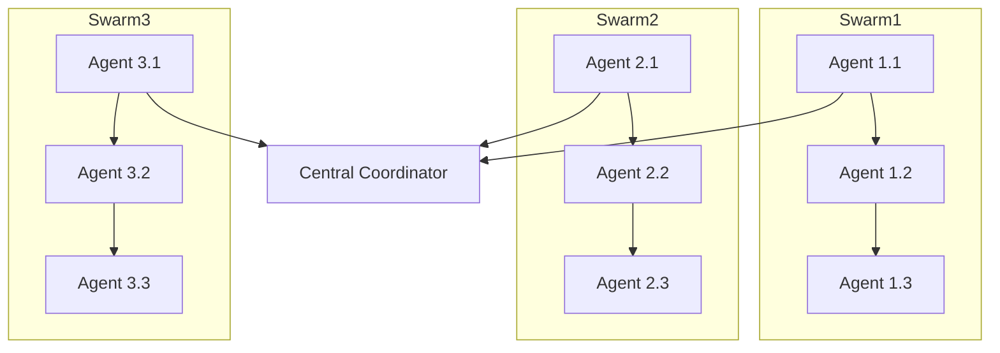
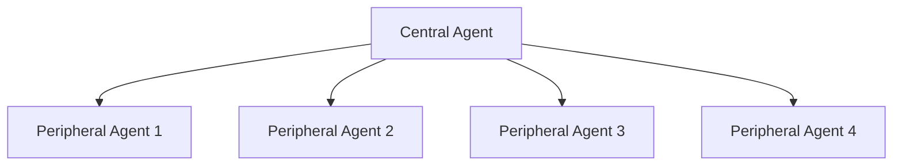
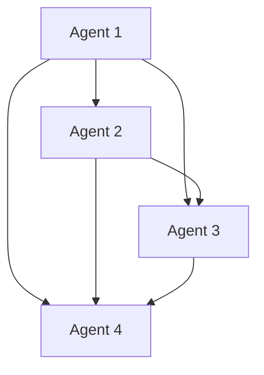
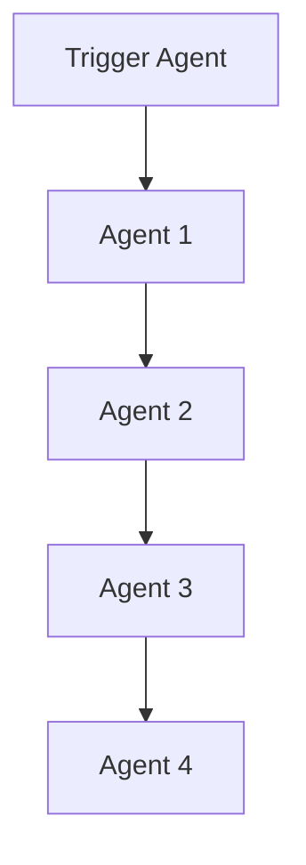
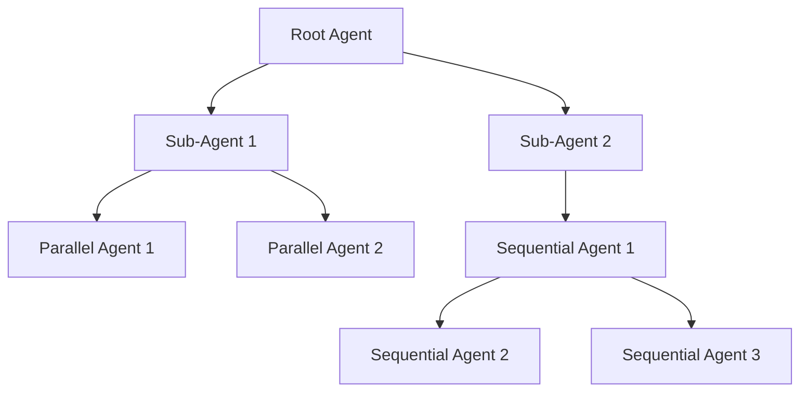

---

### Federated Swarm

**Overview:**
A Federated Swarm architecture involves multiple independent swarms collaborating to complete a task. Each swarm operates autonomously but can share information and results with other swarms.

**Use-Cases:**
- Distributed learning systems where data is processed across multiple nodes.

- Scenarios requiring collaboration between different teams or departments.

---

### Star Swarm

**Overview:**
A Star Swarm architecture features a central agent that coordinates the activities of several peripheral agents. The central agent assigns tasks to the peripheral agents and aggregates their results.

**Use-Cases:**
- Centralized decision-making processes.

- Scenarios requiring a central authority to coordinate multiple workers.

---

### Mesh Swarm

**Overview:**
A Mesh Swarm architecture allows for a fully connected network of agents where each agent can communicate with any other agent. This setup provides high flexibility and redundancy.

**Use-Cases:**
- Complex systems requiring high fault tolerance and redundancy.

- Scenarios involving dynamic and frequent communication between agents.

---

### Cascade Swarm

**Overview:**
A Cascade Swarm architecture involves a chain of agents where each agent triggers the next one in a cascade effect. This is useful for scenarios where tasks need to be processed in stages, and each stage initiates the next.

**Use-Cases:**
- Multi-stage processing tasks such as data transformation pipelines.

- Event-driven architectures where one event triggers subsequent actions.

---

### Hybrid Swarm

**Overview:**
A Hybrid Swarm architecture combines elements of various architectures to suit specific needs. It might integrate hierarchical and parallel components, or mix sequential and round robin patterns.

**Use-Cases:**
- Complex workflows requiring a mix of different processing strategies.

- Custom scenarios tailored to specific operational requirements.

---

These swarm architectures provide different models for organizing and orchestrating large language models (LLMs) to perform various tasks efficiently. Depending on the specific requirements of your project, you can choose the appropriate architecture or even combine elements from multiple architectures to create a hybrid solution.