# Choosing the Right Multi-Agent Architecture: A Comprehensive Guide

Welcome to the definitive guide on selecting the optimal multi-agent architecture for your projects. This comprehensive tutorial covers all major architectures in the Swarms framework, providing detailed explanations, visual diagrams, and practical code examples for each approach.

If you're building a simple sequential workflow or orchestrating complex hierarchical systems with dozens of agents, this guide will help you make informed decisions about which architecture best fits your use case.

## Understanding Multi-Agent Architectures

Before diving into specific architectures, it's important to understand the fundamental concepts: an Agent is an autonomous entity powered by an LLM + Tools + Memory, a Swarm consists of multiple agents working together toward a common goal, an Architecture represents the organizational pattern that governs how agents interact and collaborate, and a Workflow defines the sequence of operations that agents perform to complete tasks. Each architecture has unique strengths, trade-offs, and ideal use cases. The key is matching the architecture to your specific requirements for task complexity, coordination needs, and performance goals.

---

## 1. SequentialWorkflow: Linear Task Processing

[📖 Documentation](https://docs.swarms.world/en/latest/swarms/structs/sequential_workflow/)

SequentialWorkflow is the simplest multi-agent architecture, where agents execute tasks in a strict linear chain. Each agent receives input from the previous agent, processes it, and passes the output to the next agent. This architecture ensures complete task dependencies and predictable execution flow.

Best For: SequentialWorkflow is ideal for step-by-step processes with clear dependencies, data transformation pipelines, document processing workflows, quality assurance chains, and research and writing pipelines.

Advantages: This architecture is simple to understand and implement, provides predictable execution order, is easy to debug and trace, and guarantees task completion in sequence.

Trade-offs: SequentialWorkflow offers no parallelism which makes it slower for independent tasks, has a single point of failure that blocks the entire workflow, and is not suitable for tasks requiring simultaneous processing.

### Architecture Diagram

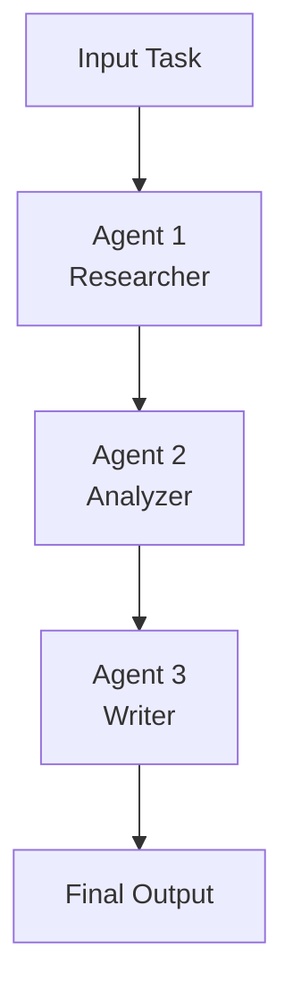

### Code Example

```python
from swarms import Agent, SequentialWorkflow

# Create specialized agents for a content creation pipeline
researcher = Agent(
    agent_name="Researcher",
    system_prompt="You are an expert researcher. Gather comprehensive information on the given topic.",
    model_name="anthropic/claude-sonnet-4-5",
    top_p=None,
    max_loops=1,
    dynamic_temperature_enabled=True,
)

analyzer = Agent(
    agent_name="Analyzer",
    system_prompt="You are a data analyst. Identify key trends, patterns, and insights from research data.",
    model_name="anthropic/claude-sonnet-4-5",
    top_p=None,
    max_loops=1,
    dynamic_temperature_enabled=True,
)

writer = Agent(
    agent_name="Writer",
    system_prompt="You are a professional writer. Create engaging content based on research and analysis.",
    model_name="anthropic/claude-sonnet-4-5",
    top_p=None,
    max_loops=1,
    dynamic_temperature_enabled=True,
)

# Create the sequential workflow
workflow = SequentialWorkflow(agents=[researcher, analyzer, writer])

# Execute the workflow
result = workflow.run("The impact of artificial intelligence on healthcare")
print(result)
```

---

## 2. ConcurrentWorkflow: Parallel Task Execution

[📖 Documentation](https://docs.swarms.world/en/latest/swarms/structs/concurrentworkflow/)

ConcurrentWorkflow enables multiple agents to process tasks simultaneously, dramatically reducing execution time for independent operations. All agents receive the same initial task and work in parallel, with results collected at the end.

Best For: ConcurrentWorkflow is ideal for batch processing operations, independent analysis tasks, high-throughput scenarios, parallel data analysis, and competitive evaluations.

Advantages: This architecture provides maximum parallelism for speed, enables efficient resource utilization, scales well with independent tasks, and allows multiple perspectives on the same problem.

Trade-offs: ConcurrentWorkflow offers no inter-agent communication during execution, can result in complex results aggregation, is not suitable for dependent tasks, and may cause potential resource contention.

### Architecture Diagram

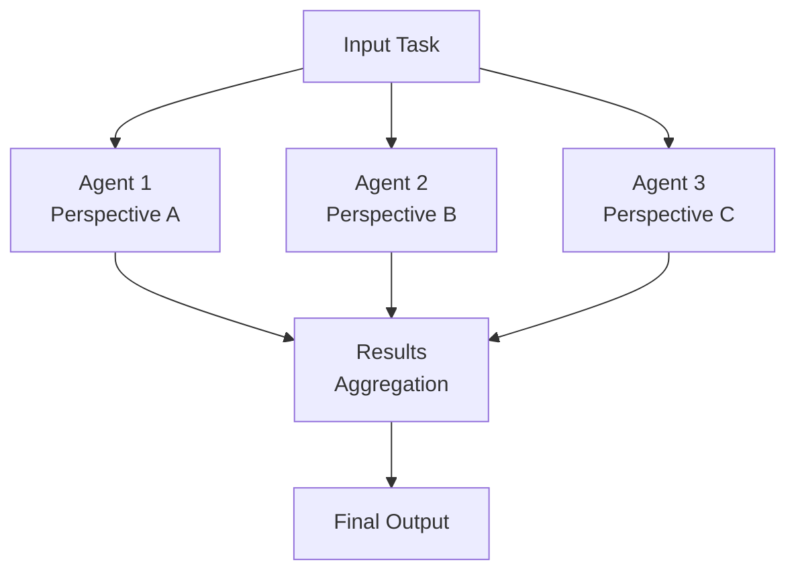

### Code Example

```python
from swarms import Agent, ConcurrentWorkflow

# Create multiple analyst agents for parallel processing
market_analyst = Agent(
    agent_name="Market-Analyst",
    system_prompt="Analyze market trends and provide insights on the given topic.",
    model_name="anthropic/claude-sonnet-4-5",
    top_p=None,
    max_loops=1,
    dynamic_temperature_enabled=True,
)

financial_analyst = Agent(
    agent_name="Financial-Analyst",
    system_prompt="Provide financial analysis and recommendations on the given topic.",
    model_name="anthropic/claude-sonnet-4-5",
    top_p=None,
    max_loops=1,
    dynamic_temperature_enabled=True,
)

risk_analyst = Agent(
    agent_name="Risk-Analyst",
    system_prompt="Assess risks and provide risk management strategies for the given topic.",
    model_name="anthropic/claude-sonnet-4-5",
    top_p=None,
    max_loops=1,
    dynamic_temperature_enabled=True,
)

# Create concurrent workflow
concurrent_workflow = ConcurrentWorkflow(
    agents=[market_analyst, financial_analyst, risk_analyst],
    max_loops=1,
)

# Run all agents concurrently on the same task
results = concurrent_workflow.run(
    "Analyze the potential impact of AI technology on the healthcare industry"
)

print("Concurrent Results:")
for agent_name, output in results.items():
    print(f"\n--- {agent_name} ---")
    print(output)
```

---

## 3. AgentRearrange: Dynamic Agent Routing

[📖 Documentation](https://docs.swarms.world/en/latest/swarms/structs/agent_rearrange/)

AgentRearrange provides the most flexible agent orchestration using a simple string-based syntax inspired by einsum notation. Define complex relationships between agents using expressions like `"researcher -> writer, editor"` to create dynamic workflows where agents can work in parallel, sequence, or any custom pattern.

Best For: AgentRearrange is ideal for complex, non-linear workflows, dynamic task routing, flexible agent relationships, custom orchestration patterns, and adaptive workflows.

Advantages: This architecture provides extremely flexible routing syntax, supports complex agent relationships, makes it easy to modify workflows, and combines sequential and parallel execution.

Trade-offs: The syntax can be complex for very intricate workflows, it requires careful planning of agent relationships, and debugging complex arrangements can be challenging.

### Architecture Diagram

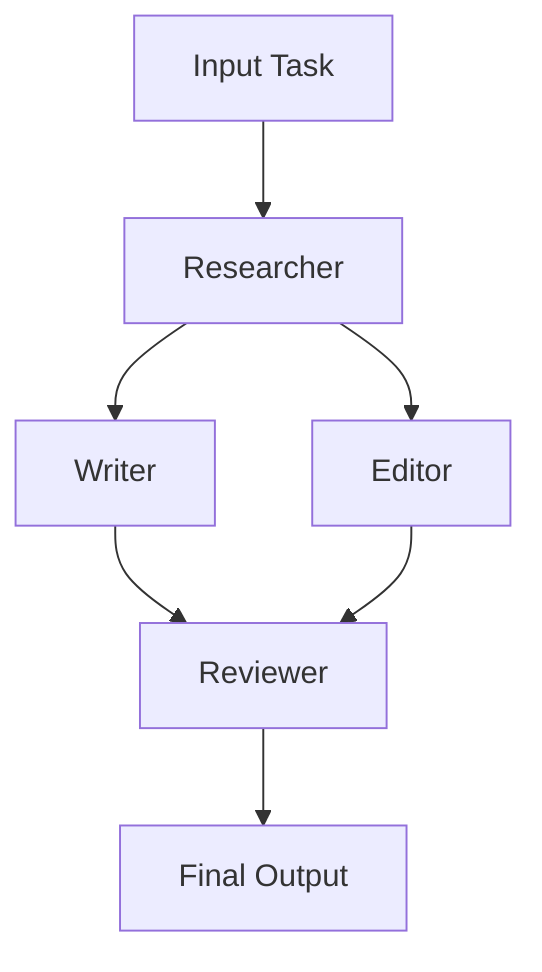

### Code Example

```python
from swarms import Agent, AgentRearrange

# Define agents with different roles
researcher = Agent(
    agent_name="researcher",
    system_prompt="Conduct thorough research on the given topic.",
    model_name="anthropic/claude-sonnet-4-5",
    top_p=None,
    max_loops=1,
    dynamic_temperature_enabled=True,
)

writer = Agent(
    agent_name="writer",
    system_prompt="Create engaging content based on research.",
    model_name="anthropic/claude-sonnet-4-5",
    top_p=None,
    max_loops=1,
    dynamic_temperature_enabled=True,
)

editor = Agent(
    agent_name="editor",
    system_prompt="Edit and polish written content for clarity and quality.",
    model_name="anthropic/claude-sonnet-4-5",
    top_p=None,
    max_loops=1,
    dynamic_temperature_enabled=True,
)

reviewer = Agent(
    agent_name="reviewer",
    system_prompt="Review final content and provide feedback.",
    model_name="anthropic/claude-sonnet-4-5",
    top_p=None,
    max_loops=1,
    dynamic_temperature_enabled=True,
)

# Define a complex flow: researcher sends work to both writer and editor simultaneously
# Both writer and editor send their work to the reviewer
flow = "researcher -> writer, editor -> reviewer"

# Create the rearrangement system
rearrange_system = AgentRearrange(
    agents=[researcher, writer, editor, reviewer],
    flow=flow,
)

# Run the dynamic workflow
outputs = rearrange_system.run("Analyze the impact of AI on modern cinema.")
print(outputs)
```

---

## 4. GraphWorkflow: Complex Dependency Management

[📖 Documentation](https://docs.swarms.world/en/latest/swarms/structs/graph_workflow/)

GraphWorkflow orchestrates agents as nodes in a Directed Acyclic Graph (DAG), allowing complex dependency management where tasks can have multiple predecessors and successors. This architecture is perfect for intricate projects with sophisticated interdependencies.

Best For: GraphWorkflow is ideal for complex project management, software development pipelines, multi-stage processing with dependencies, research workflows with prerequisites, and manufacturing or production processes.

Advantages: This architecture handles complex dependencies elegantly, optimizes parallel execution where possible, provides visual representation of workflows, and supports conditional branching.

Trade-offs: GraphWorkflow is complex to set up and configure, requires careful dependency mapping, can make debugging challenging, and is overkill for simple linear workflows.

### Architecture Diagram

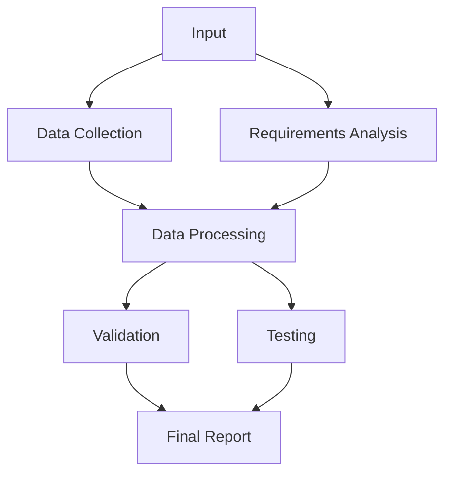

### Code Example

```python
from swarms import Agent, GraphWorkflow, Node, Edge, NodeType

# Define specialized agents
data_collector = Agent(
    agent_name="DataCollector",
    system_prompt="Gather and organize relevant data for the project.",
    model_name="anthropic/claude-sonnet-4-5",
    top_p=None,
    max_loops=1,
    dynamic_temperature_enabled=True,
)

requirements_analyst = Agent(
    agent_name="RequirementsAnalyst",
    system_prompt="Analyze project requirements and constraints.",
    model_name="anthropic/claude-sonnet-4-5",
    top_p=None,
    max_loops=1,
    dynamic_temperature_enabled=True,
)

data_processor = Agent(
    agent_name="DataProcessor",
    system_prompt="Process and analyze collected data.",
    model_name="anthropic/claude-sonnet-4-5",
    top_p=None,
    max_loops=1,
    dynamic_temperature_enabled=True,
)

validator = Agent(
    agent_name="Validator",
    system_prompt="Validate processed data and results.",
    model_name="anthropic/claude-sonnet-4-5",
    top_p=None,
    max_loops=1,
    dynamic_temperature_enabled=True,
)

tester = Agent(
    agent_name="Tester",
    system_prompt="Test all components and ensure quality.",
    model_name="anthropic/claude-sonnet-4-5",
    top_p=None,
    max_loops=1,
    dynamic_temperature_enabled=True,
)

final_reporter = Agent(
    agent_name="FinalReporter",
    system_prompt="Create comprehensive final report.",
    model_name="anthropic/claude-sonnet-4-5",
    top_p=None,
    max_loops=1,
    dynamic_temperature_enabled=True,
)

# Create nodes for the graph
nodes = [
    Node(id="data_collection", agent=data_collector),
    Node(id="requirements", agent=requirements_analyst),
    Node(id="processing", agent=data_processor),
    Node(id="validation", agent=validator),
    Node(id="testing", agent=tester),
    Node(id="reporting", agent=final_reporter),
]

# Create the graph and define dependencies
graph = GraphWorkflow()
graph.add_nodes(nodes)

# Define edges (dependencies)
edges = [
    Edge(source="data_collection", target="processing"),
    Edge(source="requirements", target="processing"),
    Edge(source="processing", target="validation"),
    Edge(source="processing", target="testing"),
    Edge(source="validation", target="reporting"),
    Edge(source="testing", target="reporting"),
]

graph.add_edges(edges)
graph.set_entry_points(["data_collection", "requirements"])
graph.set_end_points(["reporting"])

# Run the complex workflow
results = graph.run("Develop a comprehensive market analysis for electric vehicles")
print(results)
```

---

## 5. MixtureOfAgents (MoA): Expert Collaboration

[📖 Documentation](https://docs.swarms.world/en/latest/swarms/structs/moa/)

MixtureOfAgents processes tasks by feeding them to multiple expert agents in parallel, then synthesizes their diverse outputs through a specialized aggregator agent. This architecture excels at complex problem-solving by combining multiple perspectives and expertise areas.

Best For: MixtureOfAgents is ideal for complex problem-solving requiring multiple viewpoints, expert consensus building, state-of-the-art performance through collaboration, research and analysis tasks, and strategic decision-making.

Advantages: This architecture combines diverse expertise for better results, reduces individual agent biases, improves overall solution quality, and offers flexible expert agent composition.

Trade-offs: MixtureOfAgents requires careful expert agent selection, has aggregator agent quality that is critical, can be resource-intensive, and adds latency through the synthesis step.

### Architecture Diagram

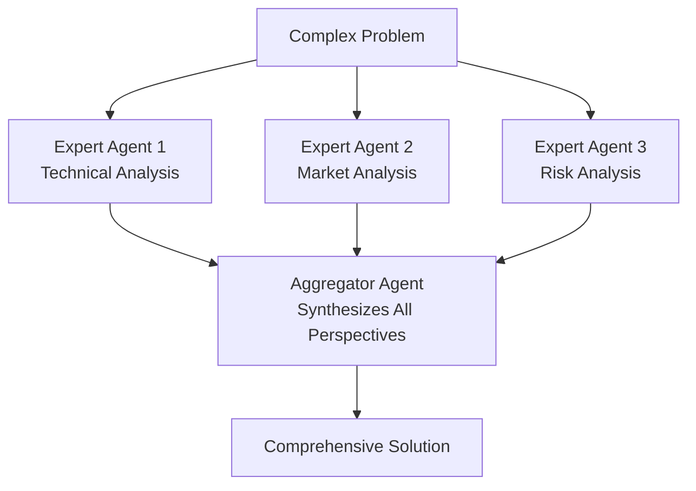

### Code Example

```python
from swarms import Agent, MixtureOfAgents

# Define expert agents with different specializations
technical_analyst = Agent(
    agent_name="TechnicalAnalyst",
    system_prompt="Analyze technical aspects, feasibility, and implementation details.",
    model_name="anthropic/claude-sonnet-4-5",
    top_p=None,
    max_loops=1,
    dynamic_temperature_enabled=True,
)

market_analyst = Agent(
    agent_name="MarketAnalyst",
    system_prompt="Analyze market trends, competition, and business opportunities.",
    model_name="anthropic/claude-sonnet-4-5",
    top_p=None,
    max_loops=1,
    dynamic_temperature_enabled=True,
)

risk_analyst = Agent(
    agent_name="RiskAnalyst",
    system_prompt="Identify potential risks, challenges, and mitigation strategies.",
    model_name="anthropic/claude-sonnet-4-5",
    top_p=None,
    max_loops=1,
    dynamic_temperature_enabled=True,
)

financial_analyst = Agent(
    agent_name="FinancialAnalyst",
    system_prompt="Analyze financial implications, costs, and ROI projections.",
    model_name="anthropic/claude-sonnet-4-5",
    top_p=None,
    max_loops=1,
    dynamic_temperature_enabled=True,
)

# Define the aggregator agent that synthesizes all perspectives
aggregator = Agent(
    agent_name="StrategicAdvisor",
    system_prompt="Synthesize all expert analyses into a comprehensive strategic recommendation with clear action items.",
    model_name="anthropic/claude-sonnet-4-5",
    top_p=None,
    max_loops=1,
    dynamic_temperature_enabled=True,
)

# Create the Mixture of Agents swarm
moa_swarm = MixtureOfAgents(
    agents=[technical_analyst, market_analyst, risk_analyst, financial_analyst],
    aggregator_agent=aggregator,
)

# Run the swarm on a complex business decision
recommendation = moa_swarm.run(
    "Should our company invest $50M in developing an AI-powered healthcare diagnostics platform? "
    "Consider technical feasibility, market potential, financial viability, and risks."
)
print(recommendation)
```

---

## 6. GroupChat: Conversational Collaboration

[📖 Documentation](https://docs.swarms.world/en/latest/swarms/structs/group_chat/)

GroupChat creates a conversational environment where multiple agents can interact, discuss, and collaboratively solve problems. Agents take turns in conversation, building on each other's ideas and reaching consensus through dialogue. This architecture is ideal for brainstorming, negotiation, and complex decision-making requiring iterative discussion.

Best For: GroupChat is ideal for brainstorming sessions, negotiation and debate, collaborative problem-solving, real-time decision-making, creative ideation, and contract or agreement drafting.

Advantages: This architecture enables natural conversational interaction, builds on collective intelligence, allows for clarification and follow-up, and mimics human collaborative processes.

Trade-offs: GroupChat can be unpredictable in direction, may require careful moderation, has conversation length that can be variable, and is not suitable for time-critical tasks.

### Architecture Diagram

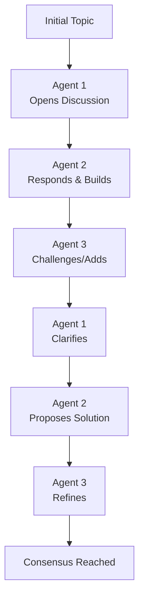

### Code Example

```python
from swarms import Agent, GroupChat

# Define agents with different perspectives for a debate
optimist = Agent(
    agent_name="TechnologyOptimist",
    system_prompt="Argue for the benefits and opportunities of AI advancement. Focus on positive impacts.",
    model_name="anthropic/claude-sonnet-4-5",
    top_p=None,
    max_loops=1,
    dynamic_temperature_enabled=True,
)

critic = Agent(
    agent_name="TechnologyCritic",
    system_prompt="Critically examine AI development challenges, risks, and potential negative consequences.",
    model_name="anthropic/claude-sonnet-4-5",
    top_p=None,
    max_loops=1,
    dynamic_temperature_enabled=True,
)

ethicist = Agent(
    agent_name="EthicsSpecialist",
    system_prompt="Focus on ethical implications, responsible AI development, and societal considerations.",
    model_name="anthropic/claude-sonnet-4-5",
    top_p=None,
    max_loops=1,
    dynamic_temperature_enabled=True,
)

moderator = Agent(
    agent_name="Moderator",
    system_prompt="Facilitate constructive dialogue, ensure all voices are heard, and help reach balanced conclusions.",
    model_name="anthropic/claude-sonnet-4-5",
    top_p=None,
    max_loops=1,
    dynamic_temperature_enabled=True,
)

# Create the group chat with controlled conversation length
chat = GroupChat(
    agents=[optimist, critic, ethicist, moderator],
    max_loops=6,  # Limit conversation turns for focused discussion
    speaker_selection_method="round_robin"  # Alternating turns
)

# Run the collaborative discussion
conversation_history = chat.run(
    "Discuss the societal impact of artificial intelligence development and deployment. "
    "Consider economic effects, ethical concerns, and potential mitigation strategies."
)

# Display the full conversation
print("=== Group Chat Discussion ===\n")
for i, message in enumerate(conversation_history, 1):
    print(f"Turn {i}: [{message['agent_name']}]")
    print(f"{message['content']}\n")
    print("-" * 50)
```

---

## 7. HierarchicalSwarm: Director-Worker Pattern

[📖 Documentation](https://docs.swarms.world/en/latest/swarms/structs/hierarchical_swarm/)

HierarchicalSwarm implements a director-worker pattern where a central director agent creates comprehensive plans and distributes specific tasks to specialized worker agents. The director evaluates results and can issue new orders in feedback loops, making it ideal for complex project management and team coordination.

Best For: HierarchicalSwarm is ideal for complex project management, team coordination and oversight, multi-phase projects, quality control with feedback loops, and strategic planning and execution.

Advantages: This architecture provides clear leadership and coordination, enables quality control through director oversight, supports scalable team structures, and includes feedback loops for refinement.

Trade-offs: HierarchicalSwarm has director agent quality that is critical, can create bottlenecks if the director is overloaded, is more complex than flat structures, and requires careful task decomposition.

### Architecture Diagram

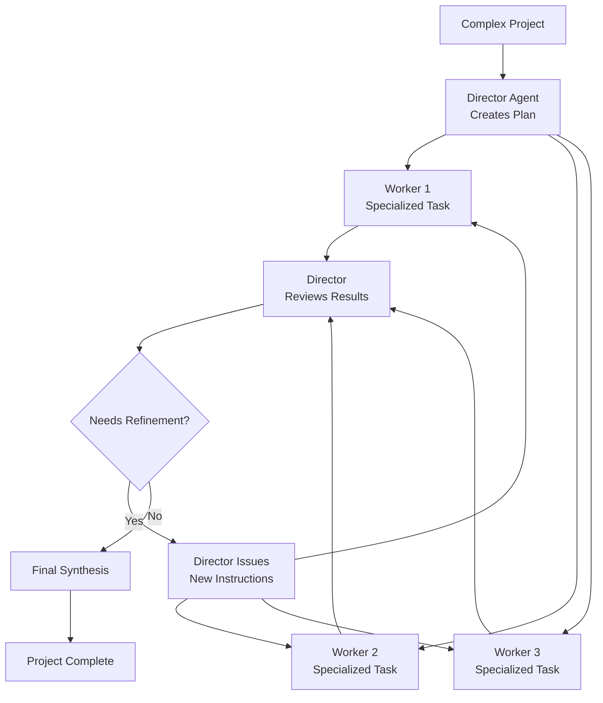

### Code Example

```python
from swarms import Agent, HierarchicalSwarm

# Define specialized worker agents
market_researcher = Agent(
    agent_name="MarketResearcher",
    system_prompt="Conduct comprehensive market research, analyze trends, and identify opportunities.",
    model_name="anthropic/claude-sonnet-4-5",
    top_p=None,
    max_loops=1,
    dynamic_temperature_enabled=True,
)

financial_planner = Agent(
    agent_name="FinancialPlanner",
    system_prompt="Analyze financial implications, create budgets, and project ROI.",
    model_name="anthropic/claude-sonnet-4-5",
    top_p=None,
    max_loops=1,
    dynamic_temperature_enabled=True,
)

technical_architect = Agent(
    agent_name="TechnicalArchitect",
    system_prompt="Design technical solutions, evaluate technology stacks, and plan implementation.",
    model_name="anthropic/claude-sonnet-4-5",
    top_p=None,
    max_loops=1,
    dynamic_temperature_enabled=True,
)

legal_reviewer = Agent(
    agent_name="LegalReviewer",
    system_prompt="Review legal implications, contracts, and compliance requirements.",
    model_name="anthropic/claude-sonnet-4-5",
    top_p=None,
    max_loops=1,
    dynamic_temperature_enabled=True,
)

risk_assessor = Agent(
    agent_name="RiskAssessor",
    system_prompt="Identify potential risks, assess impact, and develop mitigation strategies.",
    model_name="anthropic/claude-sonnet-4-5",
    top_p=None,
    max_loops=1,
    dynamic_temperature_enabled=True,
)

# Create the hierarchical swarm
project_swarm = HierarchicalSwarm(
    name="ProductLaunchTeam",
    description="A comprehensive team for planning and executing a new product launch",
    agents=[
        market_researcher,
        financial_planner,
        technical_architect,
        legal_reviewer,
        risk_assessor
    ],
    max_loops=3,  # Allow for feedback and refinement
    verbose=True
)

# Run a complex project requiring coordinated expertise
project_plan = project_swarm.run(
    "Plan the launch of a revolutionary AI-powered fitness tracking wearable device. "
    "Consider market positioning, technical requirements, financial projections, "
    "legal compliance, and risk management. Create a comprehensive 6-month launch strategy."
)

print("=== Final Project Plan ===")
print(project_plan)
```

---

## 8. HeavySwarm: Advanced Research Framework

[📖 Documentation](https://docs.swarms.world/en/latest/swarms/structs/heavy_swarm/)

HeavySwarm implements a sophisticated 5-phase workflow inspired by advanced AI research methodologies. It uses specialized agents for question generation, research, analysis, alternatives exploration, and verification to provide comprehensive task analysis through intelligent parallel execution and synthesis.

Best For: HeavySwarm is ideal for complex research and analysis tasks, financial analysis and strategic planning, comprehensive reporting requirements, deep investigation with multiple perspectives, and academic or professional research projects.

Advantages: This architecture provides thorough and comprehensive analysis, includes multiple verification layers, follows a structured research methodology, and delivers high-quality outputs with validation.

Trade-offs: HeavySwarm is a resource-intensive process, has longer execution times, requires complex coordination, and is overkill for simple tasks.

### Architecture Diagram

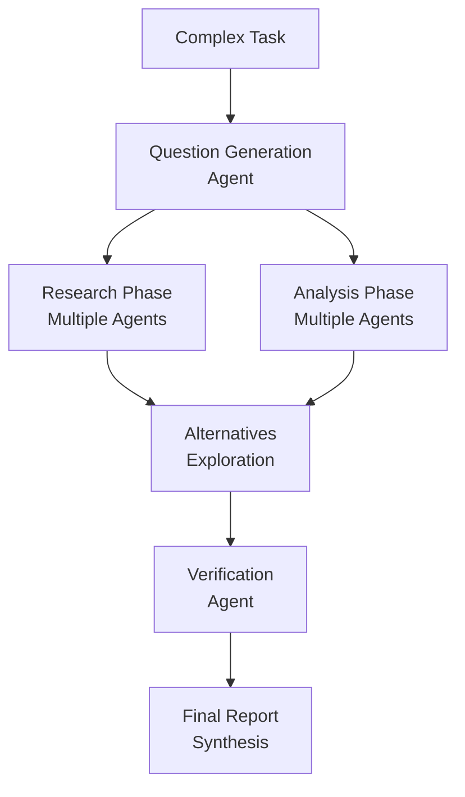

### Code Example

```python
from swarms import HeavySwarm

# Create HeavySwarm for comprehensive analysis
research_swarm = HeavySwarm(
    name="StrategicInvestmentAnalysis",
    description="Comprehensive analysis team for investment decisions",
    worker_model_name="anthropic/claude-sonnet-4-5",
    top_p=None,
    show_dashboard=False,  # Set to True for visual progress tracking
    question_agent_model_name="anthropic/claude-sonnet-4-5",
    top_p=None,
    loops_per_agent=2,
    agent_prints_on=False,
    random_loops_per_agent=False,
)

# Run complex multi-phase analysis
investment_analysis = research_swarm.run(
    "Conduct a comprehensive analysis of investing in renewable energy infrastructure. "
    "Evaluate market conditions, technological advancements, regulatory landscape, "
    "competitive positioning, financial projections, and risk factors. "
    "Provide specific investment recommendations with timeline and expected returns."
)

print("=== Comprehensive Investment Analysis ===")
print(investment_analysis)
```

---

## 9. SwarmRouter: Universal Orchestrator

[📖 Documentation](https://docs.swarms.world/en/latest/swarms/structs/swarm_router/)

SwarmRouter provides a single interface to run any type of swarm architecture with dynamic selection. Instead of importing and managing different swarm classes, you can dynamically select the optimal collaborative strategy by changing a single parameter.

Best For: SwarmRouter is ideal for simplifying complex workflows, switching between swarm strategies, unified multi-agent management, A/B testing different architectures, and flexible production deployments.

Advantages: This architecture provides a single API for all architectures, enables easy strategy switching, simplifies codebase management, and supports architecture experimentation.

Trade-offs: The abstraction can hide architecture specifics, it may not expose all advanced features, and involves configuration complexity for some architectures.

### Architecture Diagram

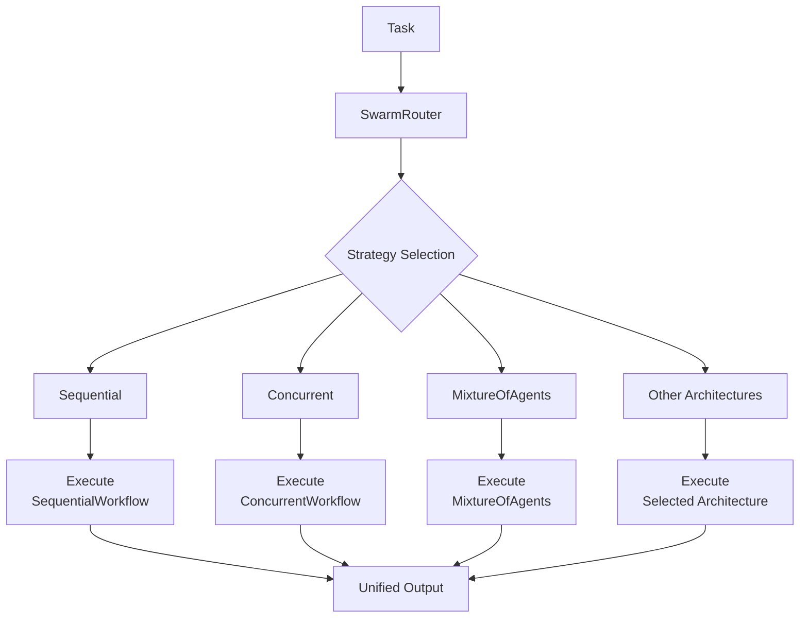

### Code Example

```python
from swarms import Agent
from swarms.structs.swarm_router import SwarmRouter, SwarmType

# Define a set of versatile agents
strategic_planner = Agent(
    agent_name="StrategicPlanner",
    system_prompt="Develop comprehensive strategies and long-term plans.",
    model_name="anthropic/claude-sonnet-4-5",
    top_p=None,
    max_loops=1,
    dynamic_temperature_enabled=True,
)

market_analyst = Agent(
    agent_name="MarketAnalyst",
    system_prompt="Analyze market conditions, trends, and competitive landscape.",
    model_name="anthropic/claude-sonnet-4-5",
    top_p=None,
    max_loops=1,
    dynamic_temperature_enabled=True,
)

financial_expert = Agent(
    agent_name="FinancialExpert",
    system_prompt="Provide financial analysis, projections, and investment recommendations.",
    model_name="anthropic/claude-sonnet-4-5",
    top_p=None,
    max_loops=1,
    dynamic_temperature_enabled=True,
)

risk_manager = Agent(
    agent_name="RiskManager",
    system_prompt="Identify risks, assess impacts, and develop mitigation strategies.",
    model_name="anthropic/claude-sonnet-4-5",
    top_p=None,
    max_loops=1,
    dynamic_temperature_enabled=True,
)

# Common agents and task for all examples
agents = [strategic_planner, market_analyst, financial_expert, risk_manager]
task = "Develop a comprehensive business strategy for launching an AI-powered education platform"

print("=== Testing Different SwarmRouter Strategies ===\n")

# Strategy 1: Sequential Processing
print("1. SequentialWorkflow Strategy:")
sequential_router = SwarmRouter(
    swarm_type=SwarmType.SequentialWorkflow,
    agents=agents
)
sequential_result = sequential_router.run(task)
print(f"Result length: {len(sequential_result)} characters\n")

# Strategy 2: Concurrent Processing
print("2. ConcurrentWorkflow Strategy:")
concurrent_router = SwarmRouter(
    swarm_type=SwarmType.ConcurrentWorkflow,
    agents=agents
)
concurrent_results = concurrent_router.run(task)
print(f"Number of agent outputs: {len(concurrent_results)}\n")

# Strategy 3: Mixture of Agents
print("3. MixtureOfAgents Strategy:")
aggregator = Agent(
    agent_name="StrategySynthesizer",
    system_prompt="Synthesize multiple strategic perspectives into a cohesive business plan.",
    model_name="anthropic/claude-sonnet-4-5",
    top_p=None,
    max_loops=1,
    dynamic_temperature_enabled=True,
)

moa_router = SwarmRouter(
    swarm_type=SwarmType.MixtureOfAgents,
    agents=agents,
    aggregator_agent=aggregator
)
moa_result = moa_router.run(task)
print(f"Synthesized result length: {len(moa_result)} characters\n")

print("=== SwarmRouter enables easy architecture switching! ===")
```

---

## 10. Social Algorithms: Custom Communication Patterns

[📖 Documentation](https://docs.swarms.world/en/latest/swarms/structs/social_algorithms/)

Social Algorithms provide a flexible framework for defining custom communication patterns between agents. Upload any arbitrary social algorithm as a callable that defines the sequence of communication, enabling agents to interact in sophisticated, custom ways beyond predefined architectures.

Best For: Social Algorithms are ideal for custom communication protocols, complex collaborative workflows, domain-specific interaction patterns, research into agent communication, and specialized coordination requirements.

Advantages: This architecture enables complete customization of agent interactions, supports novel communication patterns, is research and experimentation friendly, and provides an extensible framework.

Trade-offs: Social Algorithms require programming custom logic, can make debugging complex algorithms challenging, are less standardized than built-in architectures, and have a steeper learning curve.

### Architecture Diagram

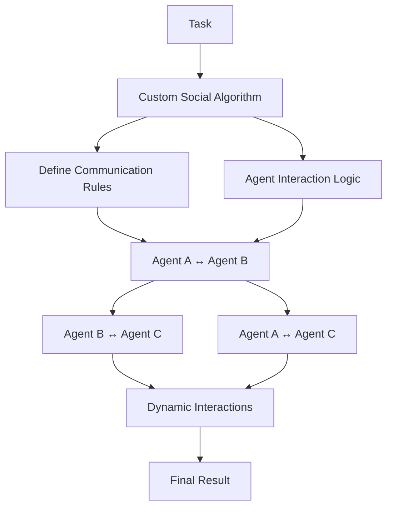

### Code Example

```python
from swarms import Agent, SocialAlgorithms

# Define custom social algorithm for research-analysis-synthesis workflow
def research_analysis_synthesis_algorithm(agents, task, **kwargs):
    """
    Custom algorithm where:
    1. Agent 1 researches the topic
    2. Agent 2 analyzes the research with feedback to Agent 1
    3. Agent 3 synthesizes findings from both
    """
    # Phase 1: Research
    research_result = agents[0].run(f"Research this topic comprehensively: {task}")

    # Phase 2: Analysis with feedback loop
    analysis_feedback = agents[1].run(
        f"Analyze this research and provide specific feedback for improvement: {research_result}"
    )

    # Researcher refines based on feedback
    refined_research = agents[0].run(
        f"Refine your research based on this feedback: {analysis_feedback}. Original research: {research_result}"
    )

    # Phase 3: Synthesis
    synthesis = agents[2].run(
        f"Synthesize insights from both research and analysis into a comprehensive report: "
        f"Research: {refined_research} | Analysis: {analysis_feedback}"
    )

    return {
        "research": refined_research,
        "analysis": analysis_feedback,
        "synthesis": synthesis,
        "final_report": synthesis
    }

# Create specialized agents
researcher = Agent(
    agent_name="Researcher",
    system_prompt="Expert in comprehensive research and information gathering.",
    model_name="anthropic/claude-sonnet-4-5",
    top_p=None,
    max_loops=1,
    dynamic_temperature_enabled=True,
)

analyst = Agent(
    agent_name="Analyst",
    system_prompt="Specialist in analyzing and interpreting data with critical feedback.",
    model_name="anthropic/claude-sonnet-4-5",
    top_p=None,
    max_loops=1,
    dynamic_temperature_enabled=True,
)

synthesizer = Agent(
    agent_name="Synthesizer",
    system_prompt="Focused on synthesizing and integrating research insights into coherent narratives.",
    model_name="anthropic/claude-sonnet-4-5",
    top_p=None,
    max_loops=1,
    dynamic_temperature_enabled=True,
)

# Create social algorithm swarm
social_alg = SocialAlgorithms(
    name="Research-Analysis-Synthesis",
    agents=[researcher, analyst, synthesizer],
    social_algorithm=research_analysis_synthesis_algorithm,
    verbose=True
)

# Run the custom collaborative workflow
result = social_alg.run("The impact of artificial intelligence on future employment")
print("=== Custom Social Algorithm Results ===")
print(f"Research: {result['research'][:200]}...")
print(f"Analysis: {result['analysis'][:200]}...")
print(f"Final Synthesis: {result['synthesis'][:300]}...")
```

---

## 11. Agent Orchestration Protocol (AOP): Distributed Services

[📖 Documentation](https://docs.swarms.world/en/latest/swarms/structs/aop/)

The Agent Orchestration Protocol (AOP) is a powerful framework for deploying and managing agents as distributed services. AOP enables agents to be discovered, managed, and executed through a standardized protocol, making it perfect for building scalable multi-agent systems across distributed infrastructure.

Best For: The Agent Orchestration Protocol is ideal for distributed agent deployment, service-oriented architectures, large-scale multi-agent systems, enterprise agent management, and cloud-native agent orchestration.

Advantages: This protocol provides standardized agent discovery and management, enables scalable distributed deployment, follows a service-oriented architecture, and offers enterprise-grade reliability.

Trade-offs: The AOP involves complex infrastructure requirements, has network latency considerations, includes service discovery complexity, and requires higher operational overhead.

### Architecture Diagram

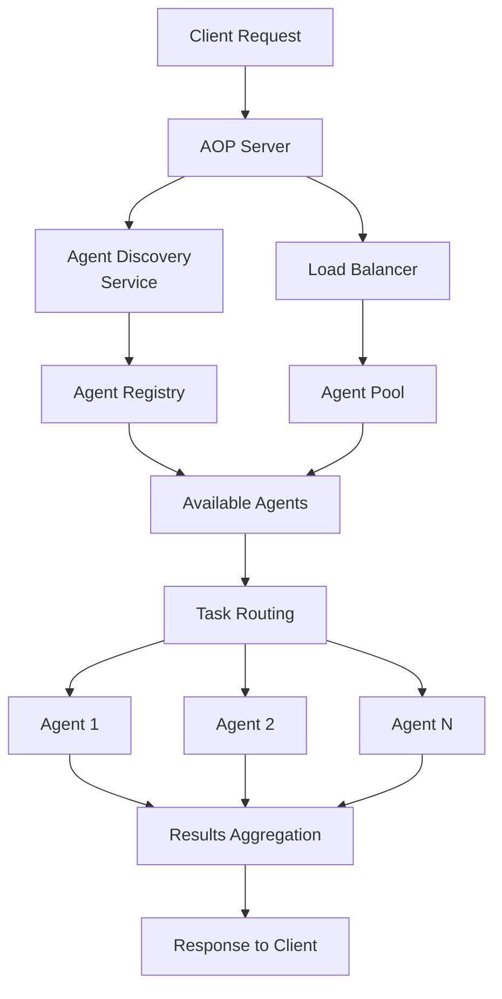

### Code Example

```python
from swarms import Agent
from swarms.structs.aop import AOP

# Create specialized agents for distributed deployment
data_analyst = Agent(
    agent_name="DataAnalyst",
    system_prompt="Expert in data analysis, statistical modeling, and insights generation.",
    model_name="anthropic/claude-sonnet-4-5",
    top_p=None,
    max_loops=1,
    dynamic_temperature_enabled=True,
    tags=["analysis", "data", "statistics"],
    capabilities=["data_processing", "statistical_analysis", "visualization"]
)

market_intelligence = Agent(
    agent_name="MarketIntelligence",
    system_prompt="Specialist in market research, competitive analysis, and trend identification.",
    model_name="anthropic/claude-sonnet-4-5",
    top_p=None,
    max_loops=1,
    dynamic_temperature_enabled=True,
    tags=["market", "research", "intelligence"],
    capabilities=["market_analysis", "competitive_intelligence", "trend_analysis"]
)

strategic_planner = Agent(
    agent_name="StrategicPlanner",
    system_prompt="Expert in strategic planning, business development, and long-term vision.",
    model_name="anthropic/claude-sonnet-4-5",
    top_p=None,
    max_loops=1,
    dynamic_temperature_enabled=True,
    tags=["strategy", "planning", "business"],
    capabilities=["strategic_planning", "business_development", "foresight"]
)

# Create AOP server for distributed agent management
aop_server = AOP(
    server_name="EnterpriseAnalyticsCluster",
    port=8000,
    verbose=True
)

# Register agents as distributed services
aop_server.add_agent(
    agent=data_analyst,
    tool_name="data_analysis_service",
    tool_description="Comprehensive data analysis and statistical modeling service",
    timeout=30,
    max_retries=3
)

aop_server.add_agent(
    agent=market_intelligence,
    tool_name="market_intelligence_service",
    tool_description="Market research and competitive intelligence service",
    timeout=30,
    max_retries=3
)

aop_server.add_agent(
    agent=strategic_planner,
    tool_name="strategic_planning_service",
    tool_description="Strategic planning and business development service",
    timeout=30,
    max_retries=3
)

print("=== AOP Server Status ===")
print(f"Registered agents: {aop_server.list_agents()}")
print("AOP server ready for distributed agent orchestration")

# Note: In production, you would call aop_server.run() to start the server
# For demonstration, we'll show how to interact with registered agents
print("\n=== Example Agent Interaction ===")
# This would typically be done through HTTP requests to the AOP server
# aop_server.run()  # Uncomment to start the server
```

---

## Agent Handoffs: Seamless Transitions Between Agents

Agent handoffs are a crucial pattern for building sophisticated multi-agent workflows. They enable smooth transitions between agents, allowing each agent to specialize in specific aspects of a task while maintaining context and continuity. Unlike predefined workflows, handoffs allow agents to make intelligent routing decisions during execution.

### How Agent Handoffs Work

Swarms supports built-in agent handoffs through the `handoffs` parameter in the Agent constructor. When an agent receives a task, it can autonomously decide to delegate specific subtasks to other agents based on the work requirements.

### Key Handoff Patterns

Key handoff patterns include sequential handoffs for clean transitions where one agent completes its work and hands off to the next, conditional handoffs that occur based on task requirements or agent capabilities, parallel handoffs where multiple agents work simultaneously with coordinated transitions, and feedback loop handoffs where agents provide feedback to previous agents for refinement.

### Code Example: Built-in Agent Handoffs

```python
from swarms.structs.agent import Agent

# Agent 1: Risk Metrics Calculator
risk_metrics_agent = Agent(
    agent_name="Risk-Metrics-Calculator",
    agent_description="Calculates key risk metrics like VaR, Sharpe ratio, and volatility",
    system_prompt="""You are a risk metrics specialist. Calculate and explain:
    - Value at Risk (VaR)
    - Sharpe ratio
    - Volatility
    - Maximum drawdown
    - Beta coefficient

    Provide clear, numerical results with brief explanations.""",
    max_loops=1,
    model_name="anthropic/claude-sonnet-4-5",
    top_p=None,
    dynamic_temperature_enabled=True,
)

# Agent 2: Market Risk Monitor
market_risk_agent = Agent(
    agent_name="Market-Risk-Monitor",
    agent_description="Monitors market conditions and identifies risk factors",
    system_prompt="""You are a market risk monitor. Identify and assess:
    - Market volatility trends
    - Economic risk factors
    - Geopolitical risks
    - Interest rate risks
    - Currency risks

    Provide current risk alerts and trends.""",
    max_loops=1,
    model_name="anthropic/claude-sonnet-4-5",
    top_p=None,
    dynamic_temperature_enabled=True,
)

# Agent 3: Portfolio Risk Analyzer (with handoffs)
portfolio_risk_agent = Agent(
    agent_name="Portfolio-Risk-Analyzer",
    agent_description="Analyzes portfolio diversification and concentration risk",
    system_prompt="""You are a portfolio risk analyst. Coordinate comprehensive risk analysis by:

    1. Analyzing portfolio diversification and concentration risk
    2. Delegating quantitative calculations to the Risk Metrics Calculator
    3. Consulting market conditions with the Market Risk Monitor
    4. Providing final integrated risk assessment

    Use handoffs when specific technical calculations or market monitoring is needed.""",
    max_loops=1,
    model_name="anthropic/claude-sonnet-4-5",
    top_p=None,
    dynamic_temperature_enabled=True,
    handoffs=[
        risk_metrics_agent,
        market_risk_agent,
    ],
)

# Execute the analysis with intelligent handoffs
result = portfolio_risk_agent.run(
    "Perform comprehensive risk analysis for a $10M tech portfolio. Calculate VaR, assess market risks, "
    "and provide investment recommendations. Use specialized agents for technical calculations and market monitoring."
)

print("=== Portfolio Risk Analysis with Agent Handoffs ===")
print(result)
```

---

## Available Architectures

| Name | Description | Docs |
|------|-------------|------|
| SequentialWorkflow | Simple linear task processing with step-by-step execution for workflows with clear dependencies. Ideal for content creation, data pipelines, and QA chains. | [learn more](https://docs.swarms.world/en/latest/swarms/structs/sequential_workflow/) |
| ConcurrentWorkflow | Parallel task execution enabling maximum parallelism for independent operations. Best for batch processing, market analysis, and parallel research. | [learn more](https://docs.swarms.world/en/latest/swarms/structs/concurrentworkflow/) |
| AgentRearrange | Flexible agent routing using dynamic syntax for complex non-linear relationships. Perfect for adaptive workflows and multi-path processing. | [learn more](https://docs.swarms.world/en/latest/swarms/structs/agent_rearrange/) |
| GraphWorkflow | Complex dependency management using DAG orchestration for intricate projects. Suitable for software builds, project management, and complex pipelines. | [learn more](https://docs.swarms.world/en/latest/swarms/structs/graph_workflow/) |
| MixtureOfAgents | Expert collaboration through parallel analysis and synthesis for consensus building. Excellent for strategic decisions, comprehensive analysis, and risk assessment. | [learn more](https://docs.swarms.world/en/latest/swarms/structs/moa/) |
| GroupChat | Conversational collaboration enabling multi-agent dialogue and brainstorming. Great for negotiations, creative ideation, and debate. | [learn more](https://docs.swarms.world/en/latest/swarms/structs/group_chat/) |
| HierarchicalSwarm | Director-worker pattern for complex project management with feedback loops. Perfect for team coordination, strategic planning, and quality control. | [learn more](https://docs.swarms.world/en/latest/swarms/structs/hierarchical_swarm/) |
| HeavySwarm | Advanced research framework with multi-phase investigation and verification. Designed for academic research, strategic planning, and comprehensive reports. | [learn more](https://docs.swarms.world/en/latest/swarms/structs/heavy_swarm/) |
| SwarmRouter | Universal orchestrator providing single interface for all architectures. Enables easy architecture switching and A/B testing. | [learn more](https://docs.swarms.world/en/latest/swarms/structs/swarm_router/) |
| Social Algorithms | Custom communication patterns with programmable agent interactions. Suitable for research protocols and domain-specific workflows. | [learn more](https://docs.swarms.world/en/latest/swarms/structs/social_algorithms/) |
| Agent Orchestration Protocol | Distributed services framework for scalable multi-agent systems. Built for large-scale deployments and cloud-native applications. | [learn more](https://docs.swarms.world/en/latest/swarms/structs/aop/) |

### Advanced Considerations

When considering task complexity, simple tasks work well with Sequential or Concurrent architectures while complex tasks benefit from MoA, HeavySwarm, or Hierarchical approaches. For time requirements, speed-critical tasks should use Concurrent or SwarmRouter while quality-critical tasks work better with MoA or HeavySwarm. Regarding coordination needs, high coordination scenarios benefit from Hierarchical or GroupChat architectures while low coordination situations work well with Concurrent or AgentRearrange. For scalability requirements, high scale deployments should use AOP or SwarmRouter while moderate scale applications can work with most architectures. Finally, when dealing with resource constraints, limited resources are best served by Sequential or simple Concurrent approaches while abundant resources enable the use of HeavySwarm or complex hierarchies.

### Performance Optimization Tips

For optimal performance, implement agent result caching for repeated tasks, use SwarmRouter for optimal resource distribution through load balancing, implement observability for performance tracking and monitoring, design fallback strategies for agent failures to ensure reliability, and use ConcurrentWorkflow for non-blocking operations through async processing.

### Common Pitfalls to Avoid

To avoid common pitfalls, remember not to over-engineer by using HeavySwarm for simple tasks, ensure proper handoffs to avoid under-coordination in complex workflows, match architecture complexity to task requirements to prevent resource waste, design redundancy for critical workflows to avoid single points of failure, and consider network delays when working with distributed architectures to avoid ignoring latency issues.

---

## Conclusion

Choosing the right multi-agent architecture is crucial for building effective, scalable, and maintainable AI systems. Each architecture offers unique strengths and trade-offs that should be carefully matched to your specific use case, performance requirements, and operational constraints.

Start with the decision framework above to narrow down your options, then prototype with 2-3 architectures to find the best fit. Remember that the most sophisticated architecture isn't always the best choice—sometimes simplicity and reliability trump complexity.

The Swarms framework provides all these architectures through a unified, production-ready platform, making it easy to experiment, deploy, and scale your multi-agent applications. Whether you're building a simple sequential workflow or a complex distributed agent network, Swarms has the tools and patterns you need to succeed.

Happy building! 🤖🚀