# Swarm Architectures

Swarms was designed to faciliate the communication between many different and specialized agents from a vast array of other frameworks such as langchain, autogen, crew, and more.

In traditional swarm theory, there are many types of swarms usually for very specialized use-cases and problem sets. Such as Hiearchical and sequential are great for accounting and sales, because there is usually a boss coordinator agent that distributes a workload to other specialized agents.


| **Name**                      | **Description**                                                                                                                                                         | **Code Link**               | **Use Cases**                                                                                     |
|-------------------------------|-------------------------------------------------------------------------------------------------------------------------------------------------------------------------|-----------------------------|---------------------------------------------------------------------------------------------------|
| Hierarchical Swarms           | A system where agents are organized in a hierarchy, with higher-level agents coordinating lower-level agents to achieve complex tasks.                                   | [Code Link](#)              | Manufacturing process optimization, multi-level sales management, healthcare resource coordination |
| Agent Rearrange               | A setup where agents rearrange themselves dynamically based on the task requirements and environmental conditions.                                                       | [Code Link](https://docs.swarms.world/en/latest/swarms/structs/agent_rearrange/)              | Adaptive manufacturing lines, dynamic sales territory realignment, flexible healthcare staffing  |
| Concurrent Workflows          | Agents perform different tasks simultaneously, coordinating to complete a larger goal.                                                                                  | [Code Link](#)              | Concurrent production lines, parallel sales operations, simultaneous patient care processes       |
| Sequential Coordination       | Agents perform tasks in a specific sequence, where the completion of one task triggers the start of the next.                                                           | [Code Link](https://docs.swarms.world/en/latest/swarms/structs/sequential_workflow/)              | Step-by-step assembly lines, sequential sales processes, stepwise patient treatment workflows     |
| Parallel Processing           | Agents work on different parts of a task simultaneously to speed up the overall process.                                                                                | [Code Link](#)              | Parallel data processing in manufacturing, simultaneous sales analytics, concurrent medical tests  |


### Hierarchical Swarm

**Overview:**
A Hierarchical Swarm architecture organizes the agents in a tree-like structure. Higher-level agents delegate tasks to lower-level agents, which can further divide tasks among themselves. This structure allows for efficient task distribution and scalability.

**Use-Cases:**

- Complex decision-making processes where tasks can be broken down into subtasks.

- Multi-stage workflows such as data processing pipelines or hierarchical reinforcement learning.

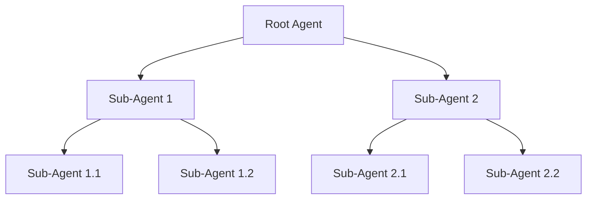

---

### Parallel Swarm

**Overview:**
In a Parallel Swarm architecture, multiple agents operate independently and simultaneously on different tasks. Each agent works on its own task without dependencies on the others. [Learn more here in the docs:](https://docs.swarms.world/en/latest/swarms/structs/agent_rearrange/)


**Use-Cases:**
- Tasks that can be processed independently, such as parallel data analysis.
- Large-scale simulations where multiple scenarios are run in parallel.

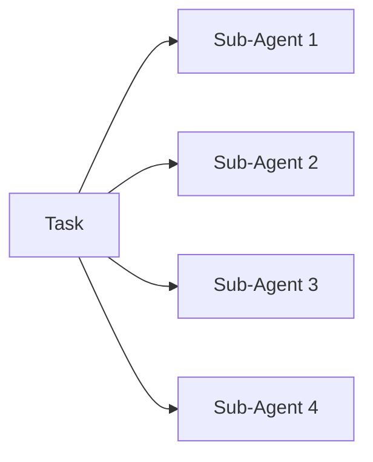

---

### Sequential Swarm

**Overview:**
A Sequential Swarm architecture processes tasks in a linear sequence. Each agent completes its task before passing the result to the next agent in the chain. This architecture ensures orderly processing and is useful when tasks have dependencies. [Learn more here in the docs:](https://docs.swarms.world/en/latest/swarms/structs/agent_rearrange/)

**Use-Cases:**
- Workflows where each step depends on the previous one, such as assembly lines or sequential data processing.

- Scenarios requiring strict order of operations.

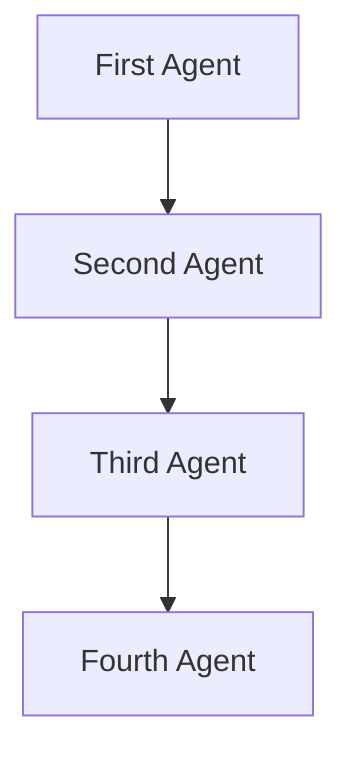

---

### Round Robin Swarm

**Overview:**
In a Round Robin Swarm architecture, tasks are distributed cyclically among a set of agents. Each agent takes turns handling tasks in a rotating order, ensuring even distribution of workload.

**Use-Cases:**

- Load balancing in distributed systems.

- Scenarios requiring fair distribution of tasks to avoid overloading any single agent.

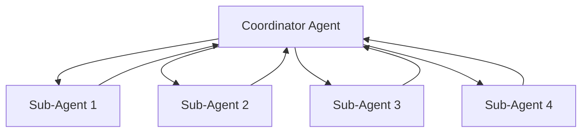


### SpreadSheet Swarm

**Overview:**
The SpreadSheet Swarm makes it easy to manage thousands of agents all in one place: a csv file. You can initialize any number of agents and then there is a loop parameter to run the loop of agents on the task. Learn more in the [docs here](https://docs.swarms.world/en/latest/swarms/structs/spreadsheet_swarm/)

**Use-Cases:**

- Multi-threaded execution: Execution agents on multiple threads 

- Save agent outputs into CSV file

- One place to analyze agent outputs


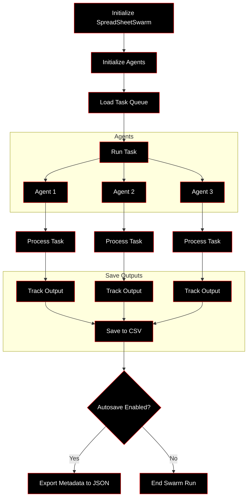


### Mixture of Agents Architecture


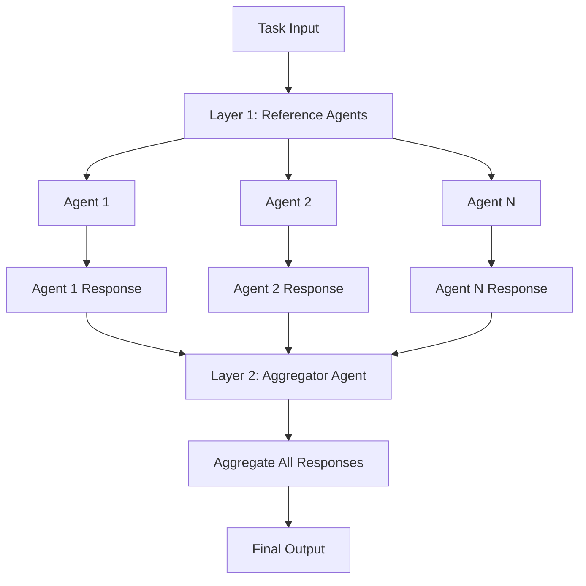


## Alternative Experimental Architectures

### **1. Circular Swarm**

#### Input Arguments:
- **name** (str): Name of the swarm.
- **description** (str): Description of the swarm.
- **goal** (str): Goal of the swarm.
- **agents** (AgentListType): List of agents involved.
- **tasks** (List[str]): List of tasks for the agents.
- **return_full_history** (bool): Whether to return the full conversation history.

#### Functionality:
Agents pass tasks in a circular manner, where each agent works on the next task in the list.

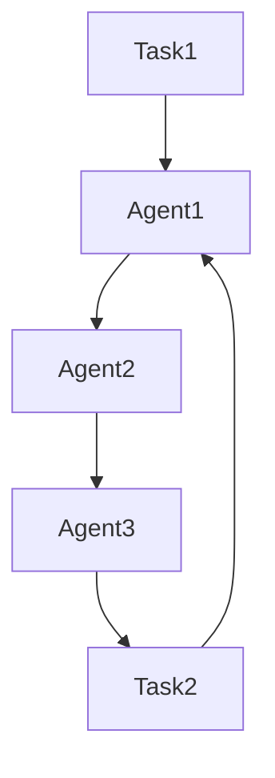

---

### **2. Linear Swarm**

#### Input Arguments:
- **name** (str): Name of the swarm.
- **description** (str): Description of the swarm.
- **agents** (AgentListType): List of agents involved.
- **tasks** (List[str]): List of tasks for the agents.
- **conversation** (Conversation): Conversation object.
- **return_full_history** (bool): Whether to return the full conversation history.

#### Functionality:
Agents pass tasks in a linear fashion, each agent working on one task sequentially.

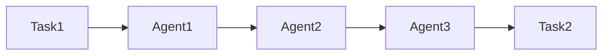

---

### **3. Star Swarm**

#### Input Arguments:
- **agents** (AgentListType): List of agents involved.
- **tasks** (List[str]): List of tasks for the agents.

#### Functionality:
A central agent (Agent 1) executes the tasks first, followed by the other agents working in parallel.

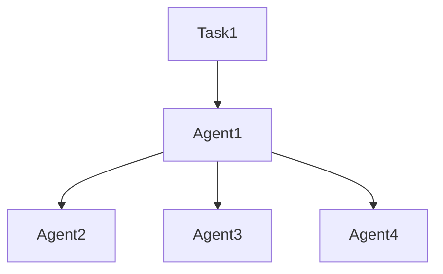

---

### **4. Mesh Swarm**

#### Input Arguments:
- **agents** (AgentListType): List of agents involved.
- **tasks** (List[str]): List of tasks for the agents.

#### Functionality:
Each agent works on tasks randomly from a task queue, until the task queue is empty.

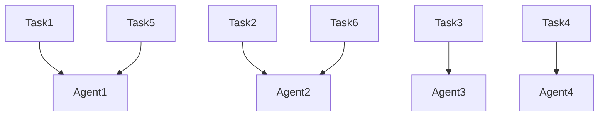

---

### **5. Grid Swarm**

#### Input Arguments:
- **agents** (AgentListType): List of agents involved.
- **tasks** (List[str]): List of tasks for the agents.

#### Functionality:
Agents are structured in a grid, and tasks are distributed accordingly.

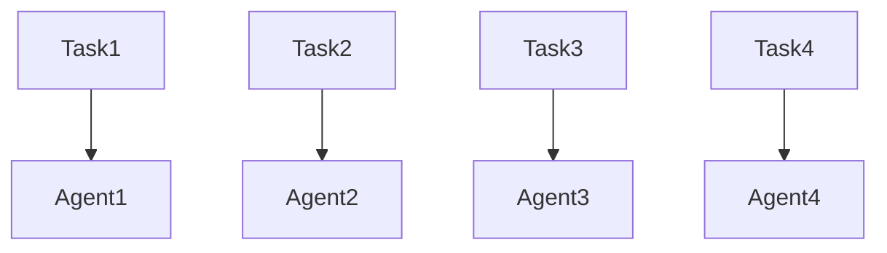

---

### **6. Pyramid Swarm**

#### Input Arguments:
- **agents** (AgentListType): List of agents involved.
- **tasks** (List[str]): List of tasks for the agents.

#### Functionality:
Agents are arranged in a pyramid structure. Each level of agents works in sequence.

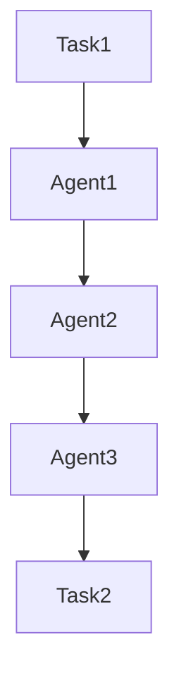

---

### **7. Fibonacci Swarm**

#### Input Arguments:
- **agents** (AgentListType): List of agents involved.
- **tasks** (List[str]): List of tasks for the agents.

#### Functionality:
Agents work according to the Fibonacci sequence, where the number of agents working on tasks follows this progression.

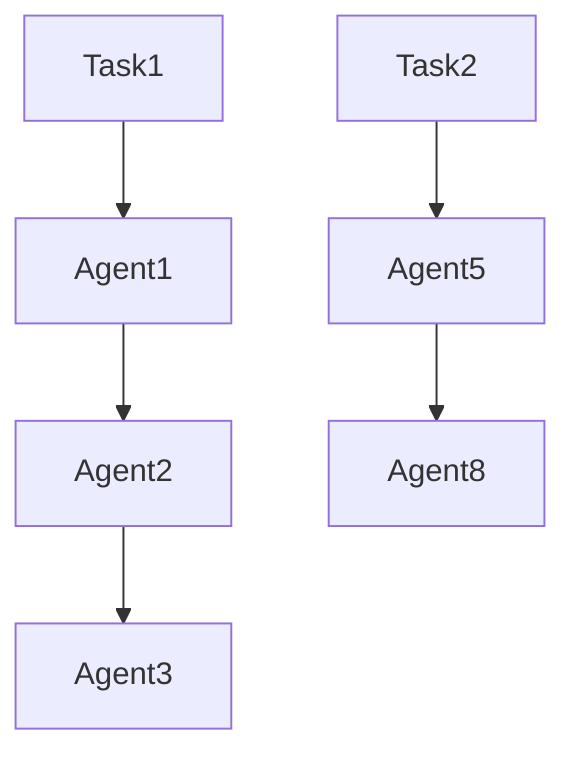

---

### **8. Prime Swarm**

#### Input Arguments:
- **agents** (AgentListType): List of agents involved.
- **tasks** (List[str]): List of tasks for the agents.

#### Functionality:
Agents are assigned tasks based on prime number indices in the list of agents.

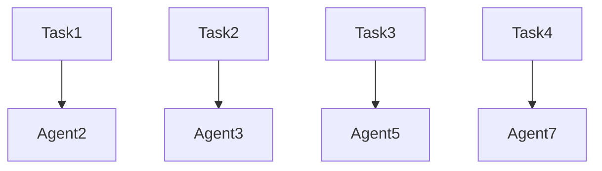

---

### **9. Power Swarm**

#### Input Arguments:
- **agents** (AgentListType): List of agents involved.
- **tasks** (List[str]): List of tasks for the agents.

#### Functionality:
Agents work on tasks following powers of two.

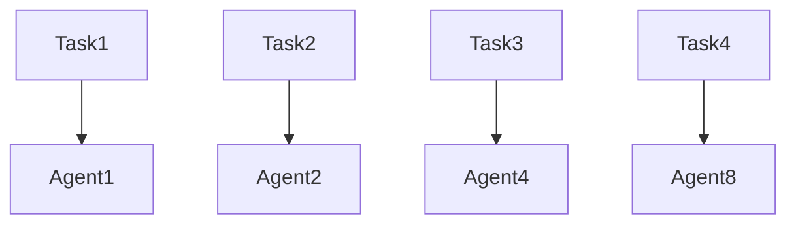

---

### **10. Sigmoid Swarm**

#### Input Arguments:
- **agents** (AgentListType): List of agents involved.
- **tasks** (List[str]): List of tasks for the agents.

#### Functionality:
Agents are selected based on the sigmoid function, with higher-indexed agents handling more complex tasks.


---

### **11. Sinusoidal Swarm**

#### Input Arguments:
- **agents** (AgentListType): List of agents involved.
- **task** (str): Task for the agents to work on.

#### Functionality:
Agents are assigned tasks based on a sinusoidal pattern.

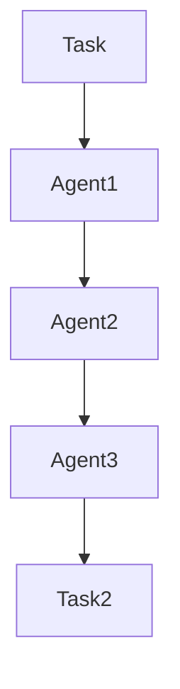

---

Each of these swarm architectures enables different task distribution and agent coordination strategies, making it possible to select the right architecture for specific types of agent-based problem-solving scenarios.


## Examples

```python

import asyncio
import os

from dotenv import load_dotenv
from loguru import logger
from swarm_models import OpenAIChat
from tickr_agent.main import TickrAgent

from swarms.structs.swarming_architectures import (
    circular_swarm,
    linear_swarm,
    mesh_swarm,
    pyramid_swarm,
    star_swarm,
)

# Load environment variables (API keys)
load_dotenv()
api_key = os.getenv("OPENAI_API_KEY")

# Initialize the OpenAI model
model = OpenAIChat(
    openai_api_key=api_key, model_name="gpt-4", temperature=0.1
)

# Custom Financial Agent System Prompts
STOCK_ANALYSIS_PROMPT = """
You are an expert financial analyst. Your task is to analyze stock market data for a company 
and provide insights on whether to buy, hold, or sell. Analyze trends, financial ratios, and market conditions.
"""

NEWS_SUMMARIZATION_PROMPT = """
You are a financial news expert. Summarize the latest news related to a company and provide insights on 
how it could impact its stock price. Be concise and focus on the key takeaways.
"""

RATIO_CALCULATION_PROMPT = """
You are a financial ratio analyst. Your task is to calculate key financial ratios for a company 
based on the available data, such as P/E ratio, debt-to-equity ratio, and return on equity. 
Explain what each ratio means for investors.
"""

# Example Usage
# Define stock tickers
stocks = ["AAPL", "TSLA"]


# Initialize Financial Analysis Agents
stock_analysis_agent = TickrAgent(
    agent_name="Stock-Analysis-Agent",
    system_prompt=STOCK_ANALYSIS_PROMPT,
    stocks=stocks,
)

news_summarization_agent = TickrAgent(
    agent_name="News-Summarization-Agent",
    system_prompt=NEWS_SUMMARIZATION_PROMPT,
    stocks=stocks,

)

ratio_calculation_agent = TickrAgent(
    agent_name="Ratio-Calculation-Agent",
    system_prompt=RATIO_CALCULATION_PROMPT,
    stocks=stocks,

)
# Create a list of agents for swarming
agents = [
    stock_analysis_agent,
    news_summarization_agent,
    ratio_calculation_agent,
]

# Define financial analysis tasks
tasks = [
    "Analyze the stock performance of Apple (AAPL) in the last 6 months.",
    "Summarize the latest financial news on Tesla (TSLA).",
    "Calculate the P/E ratio and debt-to-equity ratio for Amazon (AMZN).",
]

# -------------------------------# Showcase Circular Swarm
# -------------------------------
logger.info("Starting Circular Swarm for financial analysis.")
circular_result = circular_swarm(agents, tasks)
logger.info(f"Circular Swarm Result:\n{circular_result}\n")


# -------------------------------
# Showcase Linear Swarm
# -------------------------------
logger.info("Starting Linear Swarm for financial analysis.")
linear_result = linear_swarm(agents, tasks)
logger.info(f"Linear Swarm Result:\n{linear_result}\n")


# -------------------------------
# Showcase Star Swarm
# -------------------------------
logger.info("Starting Star Swarm for financial analysis.")
star_result = star_swarm(agents, tasks)
logger.info(f"Star Swarm Result:\n{star_result}\n")


# -------------------------------
# Showcase Mesh Swarm
# -------------------------------
logger.info("Starting Mesh Swarm for financial analysis.")
mesh_result = mesh_swarm(agents, tasks)
logger.info(f"Mesh Swarm Result:\n{mesh_result}\n")


# -------------------------------
# Showcase Pyramid Swarm
# -------------------------------
logger.info("Starting Pyramid Swarm for financial analysis.")
pyramid_result = pyramid_swarm(agents, tasks)
logger.info(f"Pyramid Swarm Result:\n{pyramid_result}\n")


# -------------------------------
# Example: One-to-One Communication between Agents
# -------------------------------
logger.info(
    "Starting One-to-One communication between Stock and News agents."
)
one_to_one_result = stock_analysis_agent.run(
    "Analyze Apple stock performance, and then send the result to the News Summarization Agent"
)
news_summary_result = news_summarization_agent.run(one_to_one_result)
logger.info(
    f"One-to-One Communication Result:\n{news_summary_result}\n"
)


# -------------------------------
# Example: Broadcasting to all agents
# -------------------------------
async def broadcast_task():
    logger.info("Broadcasting task to all agents.")
    task = "Summarize the overall stock market performance today."
    await asyncio.gather(*[agent.run(task) for agent in agents])


asyncio.run(broadcast_task())


# -------------------------------
# Deep Comments & Explanations
# -------------------------------

"""
Explanation of Key Components:

1. **Agents**:
   - We created three specialized agents for financial analysis: Stock Analysis, News Summarization, and Ratio Calculation.
   - Each agent is provided with a custom system prompt that defines their unique task in analyzing stock data.

2. **Swarm Examples**:
   - **Circular Swarm**: Agents take turns processing tasks in a circular manner.
   - **Linear Swarm**: Tasks are processed sequentially by each agent.
   - **Star Swarm**: The first agent (Stock Analysis) processes all tasks before distributing them to other agents.
   - **Mesh Swarm**: Agents work on random tasks from the task queue.
   - **Pyramid Swarm**: Agents are arranged in a pyramid structure, processing tasks layer by layer.

3. **One-to-One Communication**:
   - This showcases how one agent can pass its result to another agent for further processing, useful for complex workflows where agents depend on each other.

4. **Broadcasting**:
   - The broadcasting function demonstrates how a single task can be sent to all agents simultaneously. This can be useful for situations like summarizing daily stock market performance across multiple agents.

5. **Logging with Loguru**:
   - We use `loguru` for detailed logging throughout the swarms. This helps to track the flow of information and responses from each agent.
"""


```