# Multi-Agent Architectures

### What is a Multi-Agent Architecture?

A multi-agent architecture refers to a group of more than two agents working collaboratively to achieve a common goal. These agents can be software entities, such as LLMs that interact with each other to perform complex tasks. The concept of multi-agent architectures is inspired by how humans communicate and work together in teams, organizations, and communities, where individual contributions combine to create sophisticated collaborative problem-solving capabilities.

### How Multi-Agent Architectures Facilitate Communication

Multi-agent architectures are designed to establish and manage communication between agents within a system. These architectures define how agents interact, share information, and coordinate their actions to achieve the desired outcomes. Here are some key aspects of multi-agent architectures:

1. **Hierarchical Communication**: In hierarchical architectures, communication flows from higher-level agents to lower-level agents. Higher-level agents act as coordinators, distributing tasks and aggregating results. This structure is efficient for tasks that require top-down control and decision-making.

2. **Concurrent Communication**: In concurrent architectures, agents operate independently and simultaneously on different tasks. This architecture is suitable for tasks that can be processed concurrently without dependencies, allowing for faster execution and scalability.

3. **Sequential Communication**: Sequential architectures process tasks in a linear order, where each agent's output becomes the input for the next agent. This ensures that tasks with dependencies are handled in the correct sequence, maintaining the integrity of the workflow.

4. **Mesh Communication**: In mesh architectures, agents are fully connected, allowing any agent to communicate with any other agent. This setup provides high flexibility and redundancy, making it ideal for complex systems requiring dynamic interactions.

5. **Federated Communication**: Federated architectures involve multiple independent systems that collaborate by sharing information and results. Each system operates autonomously but can contribute to a larger task, enabling distributed problem-solving across different nodes.

Multi-agent architectures leverage these communication patterns to ensure that agents work together efficiently, adapting to the specific requirements of the task at hand. By defining clear communication protocols and interaction models, multi-agent architectures enable the seamless orchestration of multiple agents, leading to enhanced performance and problem-solving capabilities.

## Core Multi-Agent Architectures

| **Name**                          | **Description**                                                                                                                                                         | **Documentation**                                                                                      | **Use Cases**                                                                                     |
|-----------------------------------|-------------------------------------------------------------------------------------------------------------------------------------------------------------------------|-------------------------------------------------------------------------------------------------------|---------------------------------------------------------------------------------------------------|
| Hierarchical Architecture         | A system where agents are organized in a hierarchy, with higher-level agents coordinating lower-level agents to achieve complex tasks.                                   | [Learn More](https://docs.swarms.world/en/latest/swarms/structs/hierarchical_swarm/)                | Manufacturing process optimization, multi-level sales management, healthcare resource coordination |
| Agent Rearrange                   | A setup where agents rearrange themselves dynamically based on the task requirements and environmental conditions.                                                       | [Learn More](https://docs.swarms.world/en/latest/swarms/structs/agent_rearrange/)                   | Adaptive manufacturing lines, dynamic sales territory realignment, flexible healthcare staffing  |
| Concurrent Workflows              | Agents perform different tasks simultaneously, coordinating to complete a larger goal.                                                                                  | [Learn More](https://docs.swarms.world/en/latest/swarms/structs/concurrentworkflow/)               | Concurrent production lines, parallel sales operations, simultaneous patient care processes       |
| Sequential Coordination           | Agents perform tasks in a specific sequence, where the completion of one task triggers the start of the next.                                                           | [Learn More](https://docs.swarms.world/en/latest/swarms/structs/sequential_workflow/)               | Step-by-step assembly lines, sequential sales processes, stepwise patient treatment workflows     |
| Mixture of Agents                 | A heterogeneous architecture where agents with different capabilities are combined to solve complex problems.                                                           | [Learn More](https://docs.swarms.world/en/latest/swarms/structs/moa/)                               | Financial forecasting, complex problem-solving requiring diverse skills                           |
| Graph Workflow                    | Agents collaborate in a directed acyclic graph (DAG) format to manage dependencies and parallel tasks.                                                                  | [Learn More](https://docs.swarms.world/en/latest/swarms/structs/graph_workflow/)                    | AI-driven software development pipelines, complex project management                              |
| Group Chat                        | Agents engage in a chat-like interaction to reach decisions collaboratively.                                                                                           | [Learn More](https://docs.swarms.world/en/latest/swarms/structs/group_chat/)                        | Real-time collaborative decision-making, contract negotiations                                    |
| Interactive Group Chat           | Enhanced group chat with dynamic speaker selection and interaction patterns.                                                                                           | [Learn More](https://docs.swarms.world/en/latest/swarms/structs/interactive_groupchat/)             | Advanced collaborative decision-making, dynamic team coordination                                 |
| SpreadSheet                       | Manages tasks at scale, tracking agent outputs in a structured format like CSV files.                                                                                   | [Learn More](https://docs.swarms.world/en/latest/swarms/structs/spreadsheet_swarm/)                 | Large-scale marketing analytics, financial audits                                                 |
| Router                            | Routes and chooses the architecture based on the task requirements and available agents.                                                                               | [Learn More](https://docs.swarms.world/en/latest/swarms/structs/swarm_router/)                       | Dynamic task routing, adaptive architecture selection, optimized agent allocation                 |
| Heavy                             | High-performance architecture for handling intensive computational tasks with multiple agents.                                                                         | [Learn More](https://docs.swarms.world/en/latest/swarms/structs/heavy_swarm/)                       | Large-scale data processing, intensive computational workflows                                    |
| Council as Judge                  | Multiple agents act as a council to evaluate and judge outputs or decisions.                                                                                           | [Learn More](https://docs.swarms.world/en/latest/swarms/structs/council_of_judges/)                     | Quality assessment, decision validation, peer review processes                                    |
| Majority Voting                   | Agents vote on decisions with the majority determining the final outcome.                                                                                              | [Learn More](https://docs.swarms.world/en/latest/swarms/structs/majorityvoting/)                   | Democratic decision-making, consensus building, error reduction                                   |
| Round Robin                       | Tasks are distributed cyclically among agents in a rotating order.                                                                                                     | [Learn More](https://docs.swarms.world/en/latest/swarms/structs/round_robin_swarm/)                       | Load balancing, fair task distribution, resource optimization                                     |
| Auto-Builder                      | Automatically constructs and configures multi-agent systems based on requirements.                                                                                    | [Learn More](https://docs.swarms.world/en/latest/swarms/structs/auto_swarm_builder/)                | Dynamic system creation, adaptive architectures, rapid prototyping                               |
| Hybrid Hierarchical Cluster      | Combines hierarchical and peer-to-peer communication patterns for complex workflows.                                                                                   | [Learn More](https://docs.swarms.world/en/latest/swarms/structs/hhcs/)     | Complex enterprise workflows, multi-department coordination                                       |
| Batched Grid Workflow             | Executes tasks in a batched grid format, where each agent processes a different task simultaneously in parallel.                                                       | [Learn More](https://docs.swarms.world/en/latest/swarms/structs/batched_grid_workflow/)              | Parallel task processing, batch operations, grid-based task distribution                         |
| LLM Council                       | Orchestrates multiple specialized LLM agents to collaboratively answer queries through structured peer review and synthesis.                                            | [Learn More](https://docs.swarms.world/en/latest/swarms/structs/llm_council/)                        | Multi-model evaluation, peer review systems, collaborative AI decision-making                    |
| Debate with Judge                 | A debate architecture with Pro and Con agents debating topics, evaluated by a Judge. Supports preset agents, agent lists, or individual configuration for flexible setup.   | [Learn More](https://docs.swarms.world/en/latest/swarms/structs/debate_with_judge/)                 | Argument analysis, decision refinement, structured debates, iterative improvement                |
| Self MoA Seq                      | Sequential self-mixture of agents that generates multiple candidate responses and synthesizes them sequentially using a sliding window approach.                      | [Learn More](https://docs.swarms.world/en/latest/swarms/structs/self_moa_seq/)                       | High-quality response generation, ensemble methods, sequential synthesis                          |
| Swarm Rearrange                   | Orchestrates multiple swarms in sequential or parallel flow patterns, providing thread-safe operations for managing swarm execution.                                     | [Learn More](https://docs.swarms.world/en/latest/swarms/structs/swarm_rearrange/)                    | Multi-swarm coordination, complex workflow orchestration, swarm composition                       |

---

## Architectural Patterns

### Hierarchical Architecture

**Overview:**
Organizes agents in a tree-like structure. Higher-level agents delegate tasks to lower-level agents, which can further divide tasks among themselves. This structure allows for efficient task distribution and scalability.

**Use Cases:**

- Complex decision-making processes where tasks can be broken down into subtasks

- Multi-stage workflows such as data processing pipelines or hierarchical reinforcement learning

**[Learn More](https://docs.swarms.world/en/latest/swarms/structs/hierarchical_swarm/)**

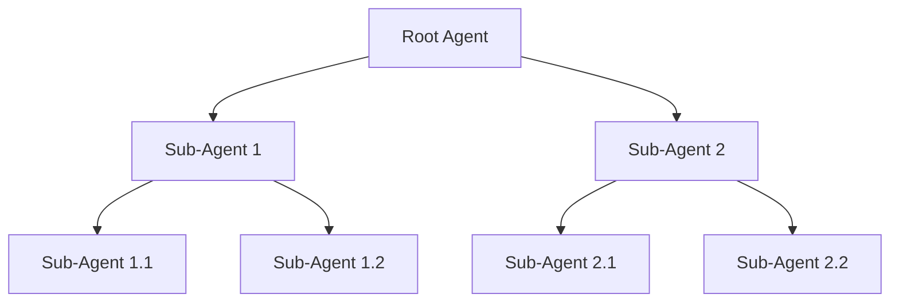
```mermaid
graph TD
    A[Root Agent] --> B1[Sub-Agent 1]
    A --> B2[Sub-Agent 2]
    B1 --> C1[Sub-Agent 1.1]
    B1 --> C2[Sub-Agent 1.2]
    B2 --> C3[Sub-Agent 2.1]
    B2 --> C4[Sub-Agent 2.2]
```

---

### Agent Rearrange

**Overview:**
A dynamic architecture where agents rearrange themselves based on task requirements and environmental conditions. Agents can adapt their roles, positions, and relationships to optimize performance for different scenarios.

**Use Cases:**

- Adaptive manufacturing lines that reconfigure based on product requirements

- Dynamic sales territory realignment based on market conditions

- Flexible healthcare staffing that adjusts to patient needs

**[Learn More](https://docs.swarms.world/en/latest/swarms/structs/agent_rearrange/)**

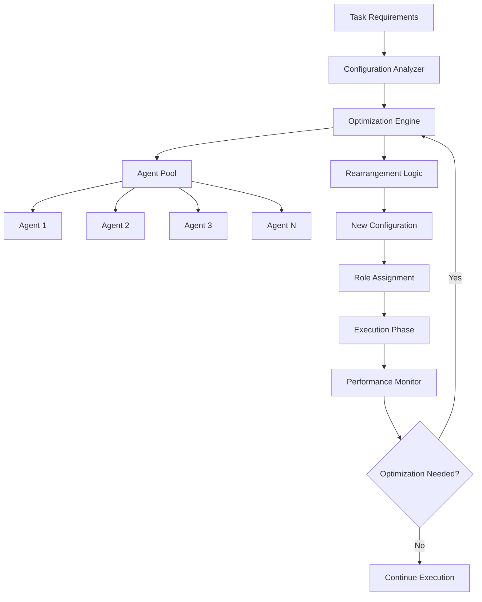
```mermaid
graph TD
    A[Task Requirements] --> B[Configuration Analyzer]
    B --> C[Optimization Engine]
    
    C --> D[Agent Pool]
    D --> E[Agent 1]
    D --> F[Agent 2]
    D --> G[Agent 3]
    D --> H[Agent N]
    
    C --> I[Rearrangement Logic]
    I --> J[New Configuration]
    J --> K[Role Assignment]
    K --> L[Execution Phase]
    
    L --> M[Performance Monitor]
    M --> N{Optimization Needed?}
    N -->|Yes| C
    N -->|No| O[Continue Execution]
```

---

### Concurrent Architecture

**Overview:**
Multiple agents operate independently and simultaneously on different tasks. Each agent works on its own task without dependencies on the others.

**Use Cases:**

- Tasks that can be processed independently, such as parallel data analysis

- Large-scale simulations where multiple scenarios are run simultaneously

**[Learn More](https://docs.swarms.world/en/latest/swarms/structs/concurrentworkflow/)**

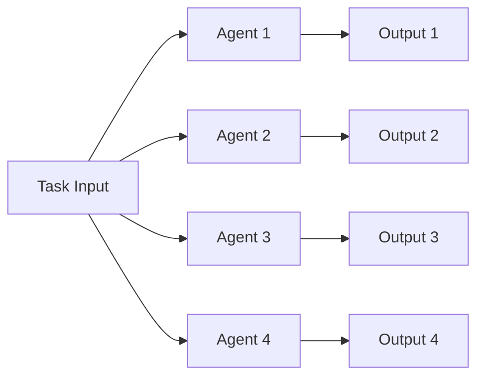
```mermaid
graph LR
    A[Task Input] --> B1[Agent 1]
    A --> B2[Agent 2]
    A --> B3[Agent 3]
    A --> B4[Agent 4]
    B1 --> C1[Output 1]
    B2 --> C2[Output 2]
    B3 --> C3[Output 3]
    B4 --> C4[Output 4]
```

---

### Sequential Architecture

**Overview:**
Processes tasks in a linear sequence. Each agent completes its task before passing the result to the next agent in the chain. Ensures orderly processing and is useful when tasks have dependencies.

**Use Cases:**

- Workflows where each step depends on the previous one, such as assembly lines or sequential data processing

- Scenarios requiring strict order of operations

**[Learn More](https://docs.swarms.world/en/latest/swarms/structs/sequential_workflow/)**

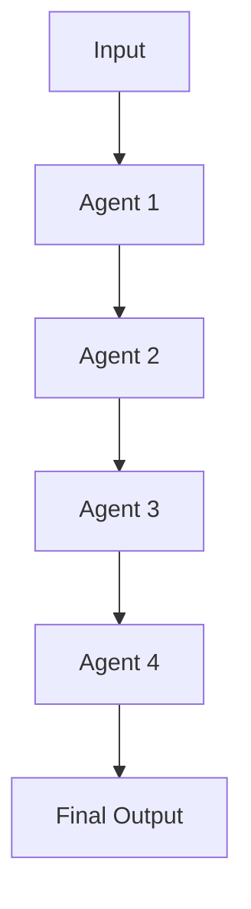
```mermaid
graph TD
    A[Input] --> B[Agent 1]
    B --> C[Agent 2]
    C --> D[Agent 3]
    D --> E[Agent 4]
    E --> F[Final Output]
```

---

### Round Robin Architecture

**Overview:**
Tasks are distributed cyclically among a set of agents. Each agent takes turns handling tasks in a rotating order, ensuring even distribution of workload.

**Use Cases:**

- Load balancing in distributed systems

- Scenarios requiring fair distribution of tasks to avoid overloading any single agent

**[Learn More](https://docs.swarms.world/en/latest/swarms/structs/round_robin_swarm/)**

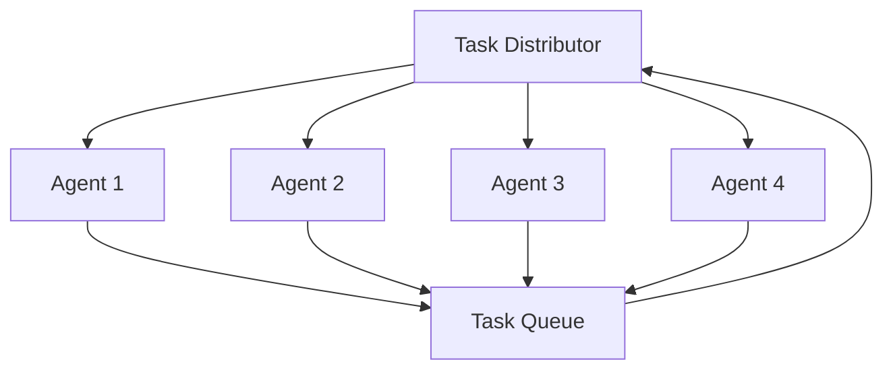
```mermaid
graph TD
    A[Task Distributor] --> B1[Agent 1]
    A --> B2[Agent 2]
    A --> B3[Agent 3]
    A --> B4[Agent 4]
    B1 --> C[Task Queue]
    B2 --> C
    B3 --> C
    B4 --> C
    C --> A
```

---

### SpreadSheet Architecture

**Overview:**
Makes it easy to manage thousands of agents in one place: a CSV file. Initialize any number of agents and run loops of agents on tasks.

**Use Cases:**

- Multi-threaded execution: Execute agents on multiple threads

- Save agent outputs into CSV file

- One place to analyze agent outputs

**[Learn More](https://docs.swarms.world/en/latest/swarms/structs/spreadsheet_swarm/)**

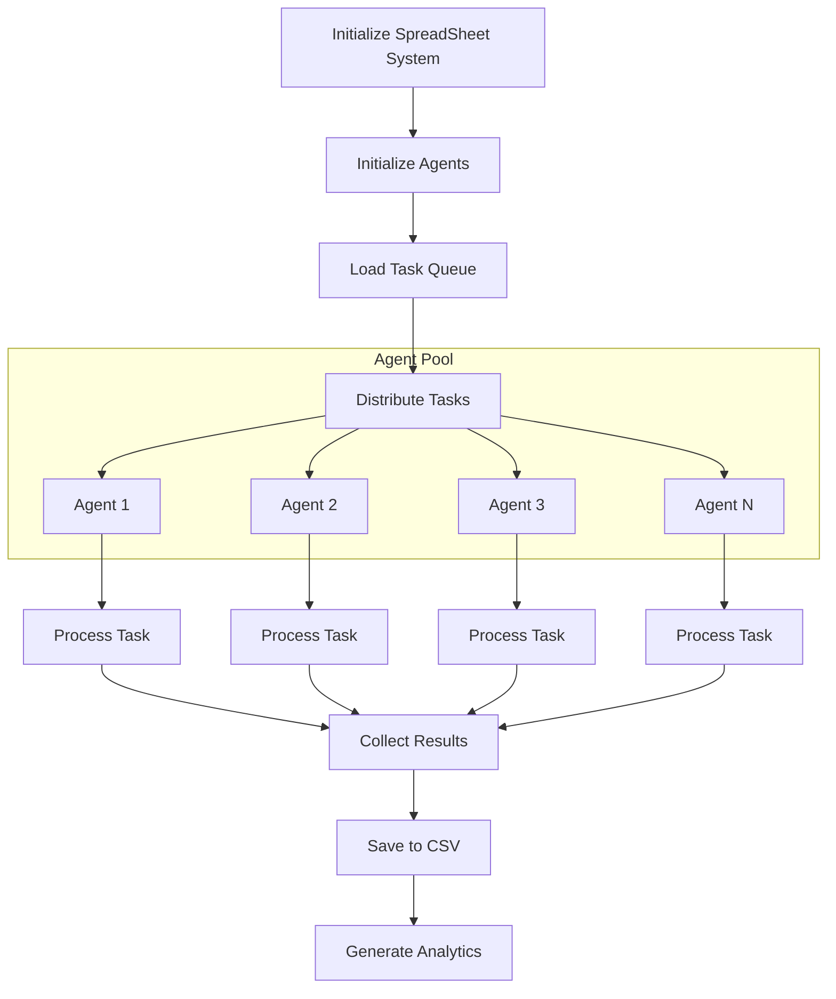
```mermaid
graph TD
    A[Initialize SpreadSheet System] --> B[Initialize Agents]
    B --> C[Load Task Queue]
    C --> D[Distribute Tasks]

    subgraph Agent_Pool[Agent Pool]
        D --> E1[Agent 1]
        D --> E2[Agent 2]
        D --> E3[Agent 3]
        D --> E4[Agent N]
    end

    E1 --> F1[Process Task]
    E2 --> F2[Process Task]
    E3 --> F3[Process Task]
    E4 --> F4[Process Task]

    F1 --> G[Collect Results]
    F2 --> G
    F3 --> G
    F4 --> G

    G --> H[Save to CSV]
    H --> I[Generate Analytics]
```

---

### Batched Grid Workflow

**Overview:**
Multi-agent orchestration pattern that executes tasks in a batched grid format, where each agent processes different tasks simultaneously. Provides structured parallel processing with conversation state management.

**Use Cases:**

- Parallel task processing

- Grid-based agent execution

- Batch operations

- Multi-task multi-agent coordination

**[Learn More](https://docs.swarms.world/en/latest/swarms/structs/batched_grid_workflow/)**

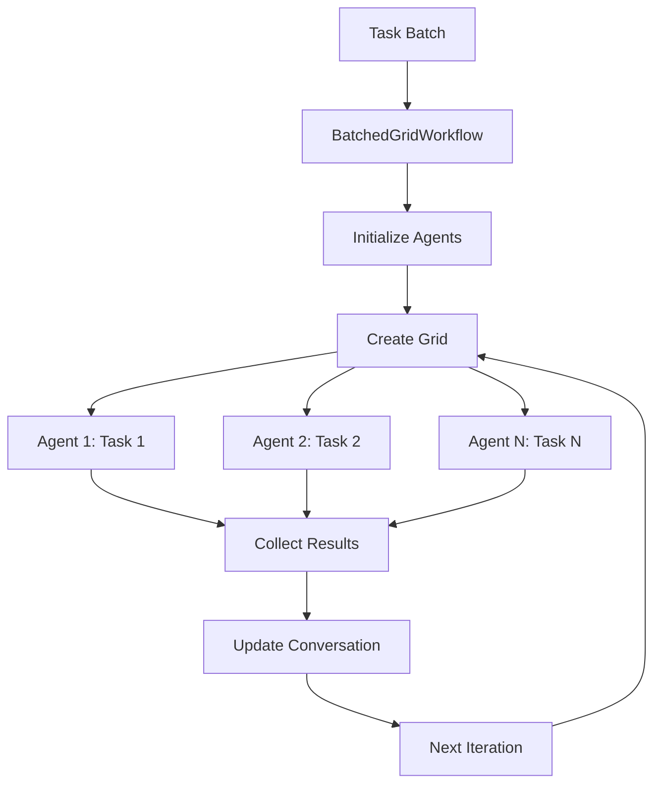
```mermaid
graph TD
    A[Task Batch] --> B[BatchedGridWorkflow]
    B --> C[Initialize Agents]
    C --> D[Create Grid]
    
    D --> E[Agent 1: Task 1]
    D --> F[Agent 2: Task 2]
    D --> G[Agent N: Task N]
    
    E --> H[Collect Results]
    F --> H
    G --> H
    
    H --> I[Update Conversation]
    I --> J[Next Iteration]
    J --> D
```

---

### Mixture of Agents

**Overview:**
Combines multiple agents with different capabilities and expertise to solve complex problems that require diverse skill sets.

**Use Cases:**

- Financial forecasting requiring different analytical approaches

- Complex problem-solving needing diverse expertise

- Multi-domain analysis tasks

**[Learn More](https://docs.swarms.world/en/latest/swarms/structs/moa/)**

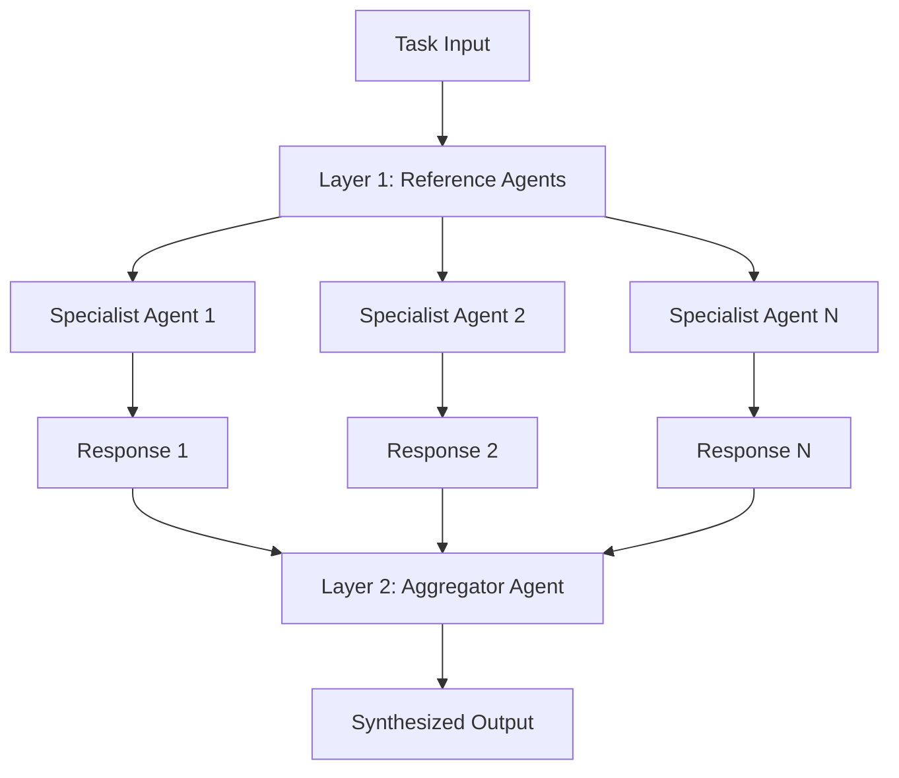
```mermaid
graph TD
    A[Task Input] --> B[Layer 1: Reference Agents]
    B --> C[Specialist Agent 1]
    B --> D[Specialist Agent 2]
    B --> E[Specialist Agent N]

    C --> F[Response 1]
    D --> G[Response 2]
    E --> H[Response N]

    F --> I[Layer 2: Aggregator Agent]
    G --> I
    H --> I
    I --> J[Synthesized Output]
```

---

### Graph Workflow

**Overview:**
Organizes agents in a directed acyclic graph (DAG) format, enabling complex dependencies and parallel execution paths.

**Use Cases:**

- AI-driven software development pipelines

- Complex project management with dependencies

- Multi-step data processing workflows

**[Learn More](https://docs.swarms.world/en/latest/swarms/structs/graph_workflow/)**

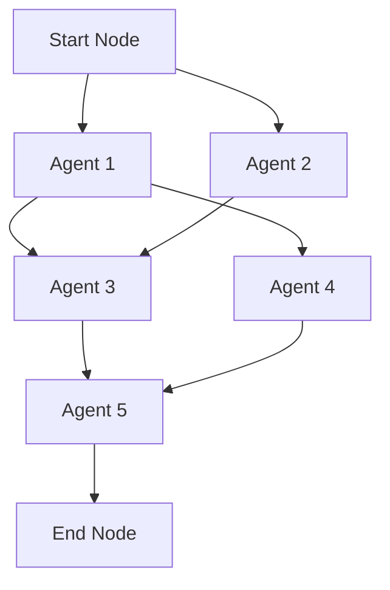
```mermaid
graph TD
    A[Start Node] --> B[Agent 1]
    A --> C[Agent 2]
    B --> D[Agent 3]
    C --> D
    B --> E[Agent 4]
    D --> F[Agent 5]
    E --> F
    F --> G[End Node]
```

---

### Group Chat

**Overview:**
Enables agents to engage in chat-like interactions to reach decisions collaboratively through discussion and consensus building.

**Use Cases:**

- Real-time collaborative decision-making

- Contract negotiations

- Brainstorming sessions

**[Learn More](https://docs.swarms.world/en/latest/swarms/structs/group_chat/)**

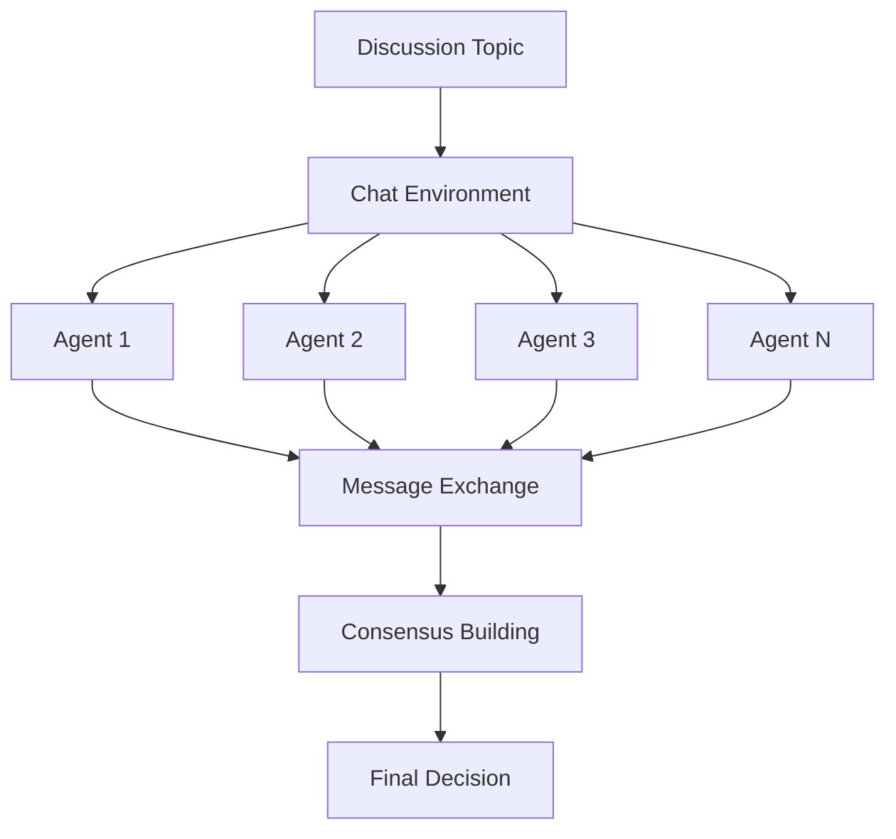
```mermaid
graph TD
    A[Discussion Topic] --> B[Chat Environment]
    B --> C[Agent 1]
    B --> D[Agent 2]
    B --> E[Agent 3]
    B --> F[Agent N]
    
    C --> G[Message Exchange]
    D --> G
    E --> G
    F --> G
    
    G --> H[Consensus Building]
    H --> I[Final Decision]
```

---

### Interactive Group Chat

**Overview:**
Enhanced version of Group Chat with dynamic speaker selection, priority-based communication, and advanced interaction patterns.

**Use Cases:**

- Advanced collaborative decision-making

- Dynamic team coordination

- Adaptive conversation management

**[Learn More](https://docs.swarms.world/en/latest/swarms/structs/interactive_groupchat/)**

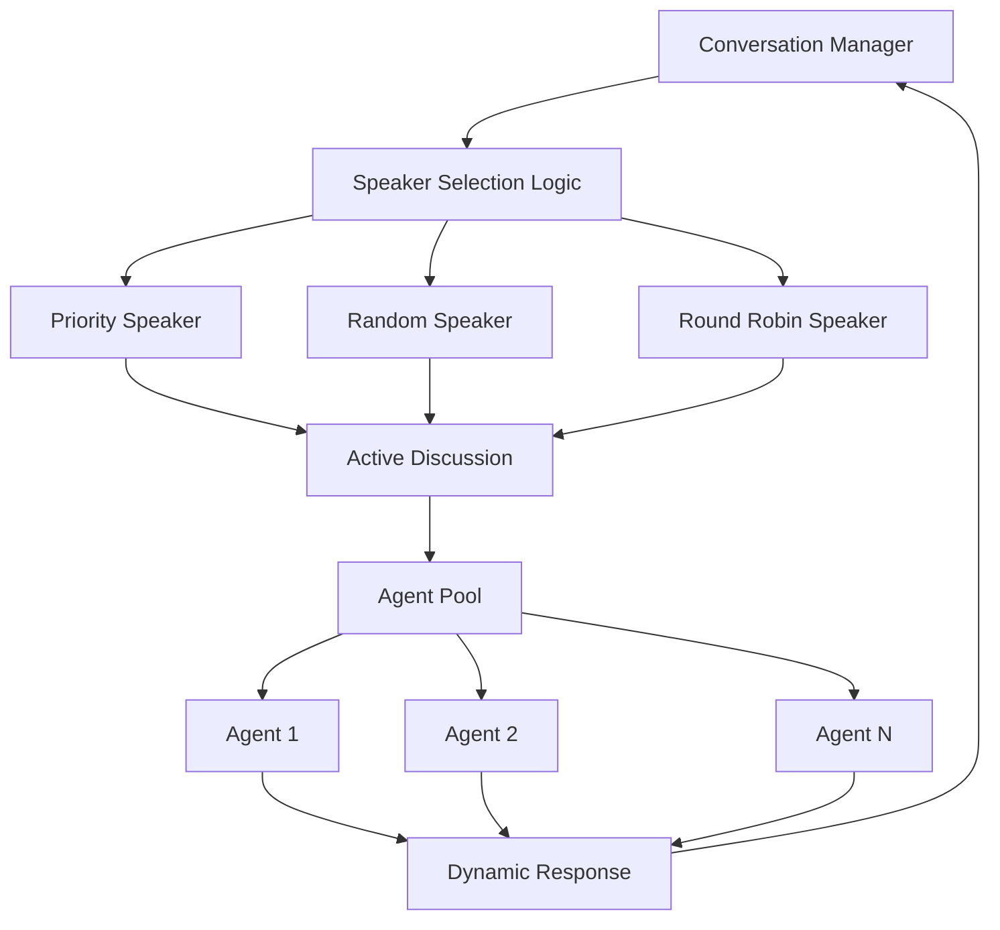
```mermaid
graph TD
    A[Conversation Manager] --> B[Speaker Selection Logic]
    B --> C[Priority Speaker]
    B --> D[Random Speaker]
    B --> E[Round Robin Speaker]
    
    C --> F[Active Discussion]
    D --> F
    E --> F
    
    F --> G[Agent Pool]
    G --> H[Agent 1]
    G --> I[Agent 2]
    G --> J[Agent N]
    
    H --> K[Dynamic Response]
    I --> K
    J --> K
    K --> A
```

---

### Router Architecture

**Overview:**
Intelligently routes tasks to the most appropriate agents or architectures based on task requirements and agent capabilities.

**Use Cases:**

- Dynamic task routing

- Adaptive architecture selection

- Optimized agent allocation

**[Learn More](https://docs.swarms.world/en/latest/swarms/structs/swarm_router/)**

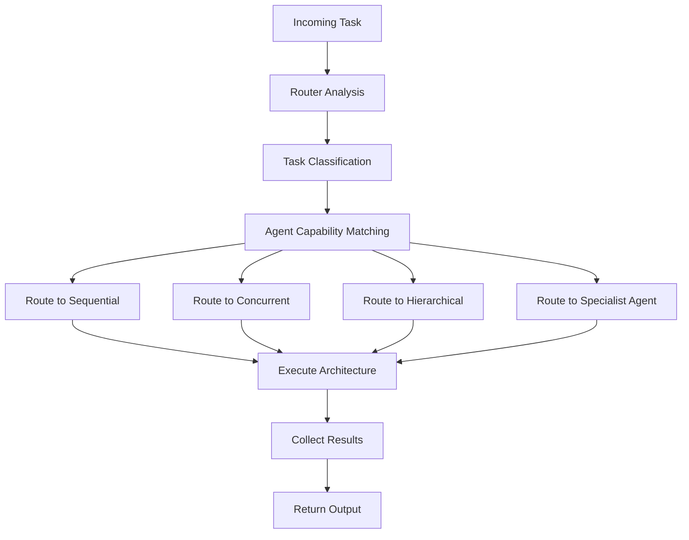
```mermaid
graph TD
    A[Incoming Task] --> B[Router Analysis]
    B --> C[Task Classification]
    C --> D[Agent Capability Matching]
    
    D --> E[Route to Sequential]
    D --> F[Route to Concurrent]
    D --> G[Route to Hierarchical]
    D --> H[Route to Specialist Agent]
    
    E --> I[Execute Architecture]
    F --> I
    G --> I
    H --> I
    
    I --> J[Collect Results]
    J --> K[Return Output]
```

---

### Heavy Architecture

**Overview:**
High-performance architecture designed for handling intensive computational tasks with multiple agents working on resource-heavy operations.

**Use Cases:**

- Large-scale data processing

- Intensive computational workflows

- High-throughput task execution

**[Learn More](https://docs.swarms.world/en/latest/swarms/structs/heavy_swarm/)**

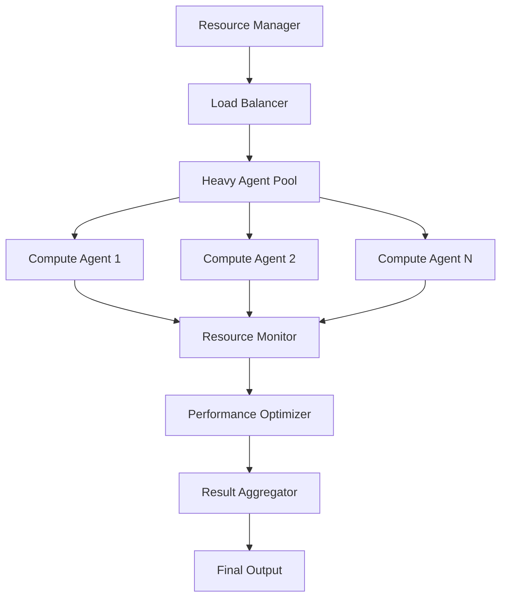
```mermaid
graph TD
    A[Resource Manager] --> B[Load Balancer]
    B --> C[Heavy Agent Pool]
    
    C --> D[Compute Agent 1]
    C --> E[Compute Agent 2]
    C --> F[Compute Agent N]
    
    D --> G[Resource Monitor]
    E --> G
    F --> G
    
    G --> H[Performance Optimizer]
    H --> I[Result Aggregator]
    I --> J[Final Output]
```

---

### Deep Research Architecture

**Overview:**
Specialized architecture for conducting comprehensive research tasks across multiple domains with iterative refinement and cross-validation.

**Use Cases:**

- Academic research projects

- Market analysis and intelligence

- Comprehensive data investigation

**[Learn More](https://docs.swarms.world/en/latest/swarms/structs/deep_research_swarm/)**

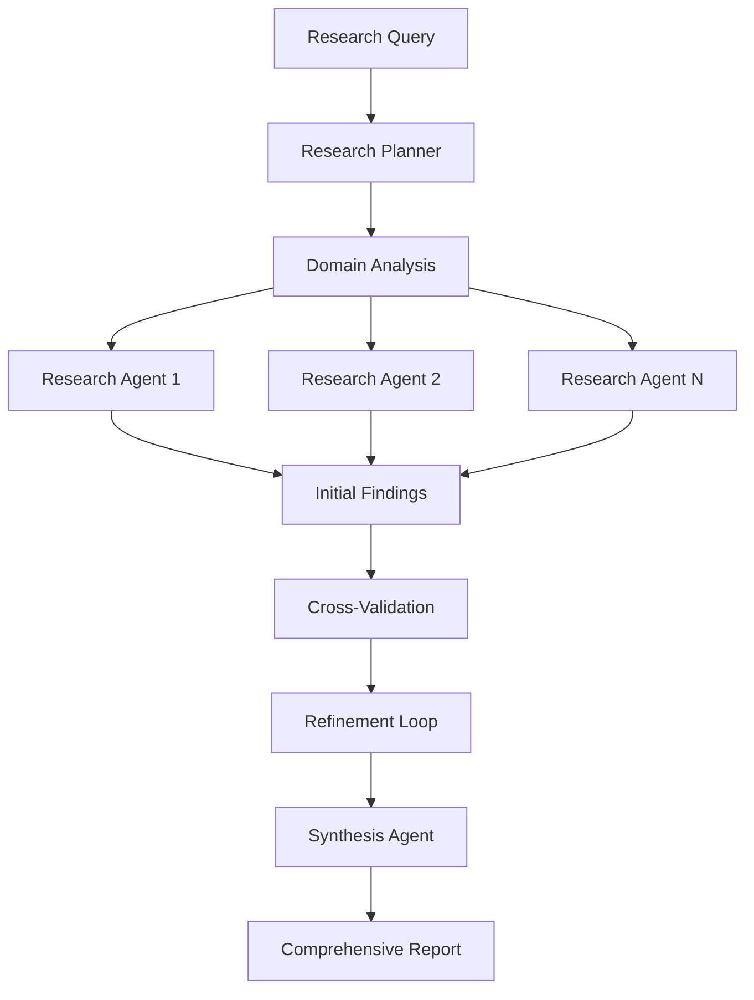
```mermaid
graph TD
    A[Research Query] --> B[Research Planner]
    B --> C[Domain Analysis]
    C --> D[Research Agent 1]
    C --> E[Research Agent 2]
    C --> F[Research Agent N]
    
    D --> G[Initial Findings]
    E --> G
    F --> G
    
    G --> H[Cross-Validation]
    H --> I[Refinement Loop]
    I --> J[Synthesis Agent]
    J --> K[Comprehensive Report]
```

---

### De-Hallucination Architecture

**Overview:**
Architecture specifically designed to reduce and eliminate hallucinations in AI outputs through consensus mechanisms and fact-checking protocols.

**Use Cases:**

- Fact-checking and verification

- Content validation

- Reliable information generation

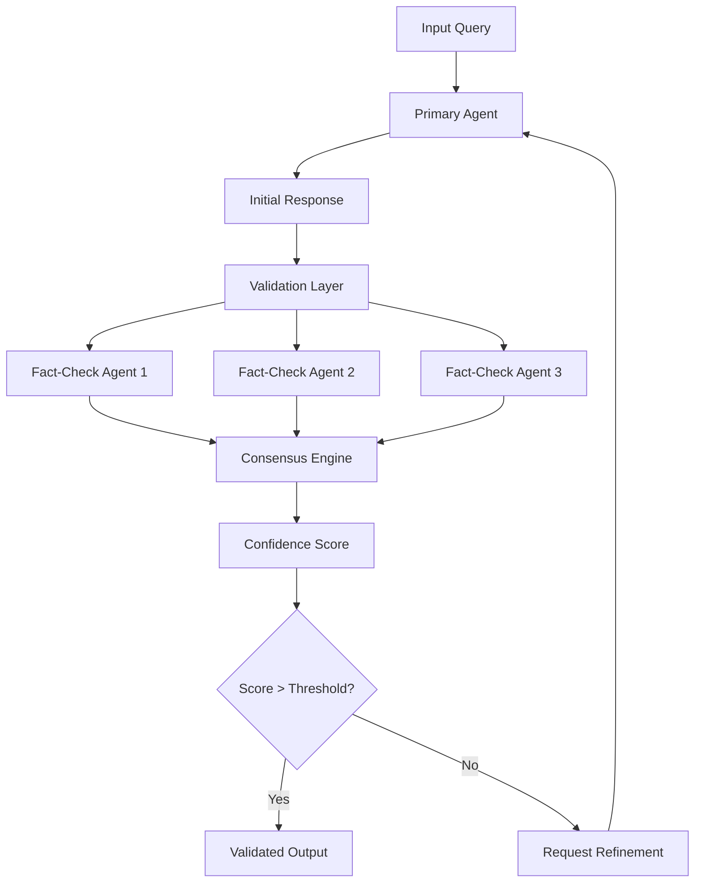
```mermaid
graph TD
    A[Input Query] --> B[Primary Agent]
    B --> C[Initial Response]
    C --> D[Validation Layer]
    
    D --> E[Fact-Check Agent 1]
    D --> F[Fact-Check Agent 2]
    D --> G[Fact-Check Agent 3]
    
    E --> H[Consensus Engine]
    F --> H
    G --> H
    
    H --> I[Confidence Score]
    I --> J{Score > Threshold?}
    J -->|Yes| K[Validated Output]
    J -->|No| L[Request Refinement]
    L --> B
```

---

### Self MoA Seq

**Overview:**
Ensemble method that generates multiple candidate responses from a single high-performing model and synthesizes them sequentially using a sliding window approach. Keeps context within bounds while leveraging diversity across samples.

**Use Cases:**

- Response synthesis

- Ensemble methods

- Sequential aggregation

- Quality improvement through diversity

**[Learn More](https://docs.swarms.world/en/latest/swarms/structs/self_moa_seq/)**

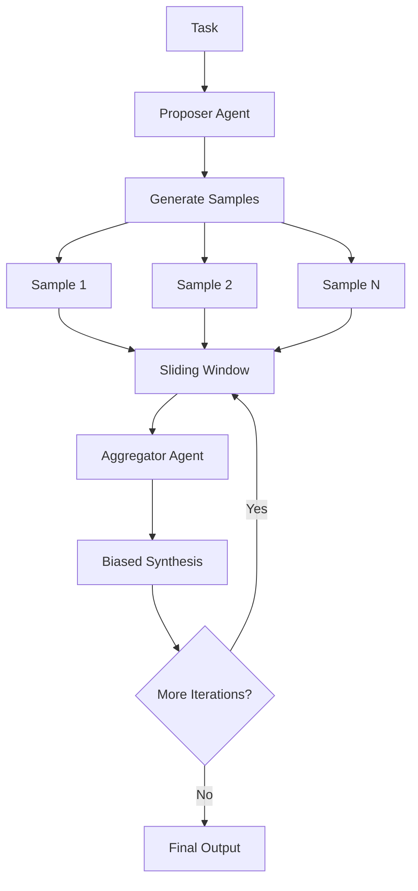
```mermaid
graph TD
    A[Task] --> B[Proposer Agent]
    B --> C[Generate Samples]
    C --> D[Sample 1]
    C --> E[Sample 2]
    C --> F[Sample N]
    
    D --> G[Sliding Window]
    E --> G
    F --> G
    
    G --> H[Aggregator Agent]
    H --> I[Biased Synthesis]
    I --> J{More Iterations?}
    J -->|Yes| G
    J -->|No| K[Final Output]
```

---

### Council as Judge

**Overview:**
Multiple agents act as a council to evaluate, judge, and validate outputs or decisions through collaborative assessment.

**Use Cases:**

- Quality assessment and validation

- Decision validation processes

- Peer review systems

**[Learn More](https://docs.swarms.world/en/latest/swarms/structs/council_of_judges/)**

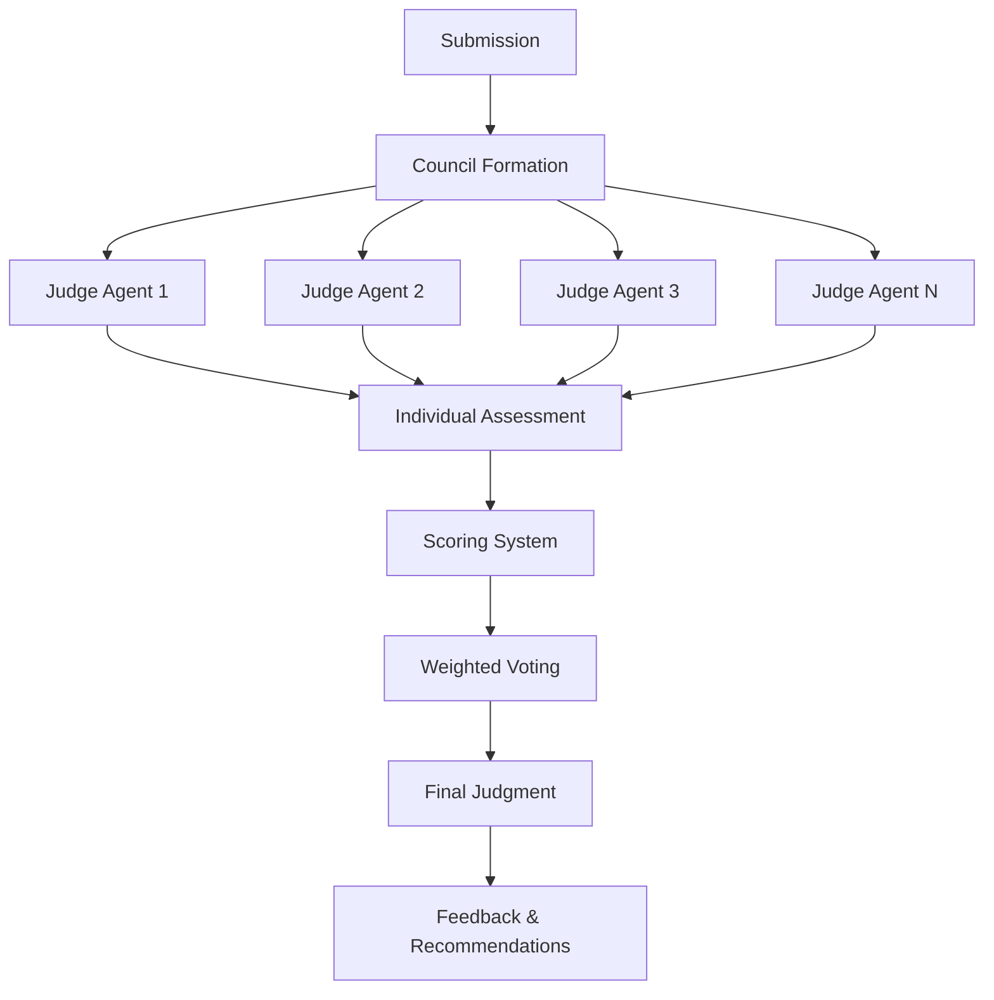
```mermaid
graph TD
    A[Submission] --> B[Council Formation]
    B --> C[Judge Agent 1]
    B --> D[Judge Agent 2]
    B --> E[Judge Agent 3]
    B --> F[Judge Agent N]
    
    C --> G[Individual Assessment]
    D --> G
    E --> G
    F --> G
    
    G --> H[Scoring System]
    H --> I[Weighted Voting]
    I --> J[Final Judgment]
    J --> K[Feedback & Recommendations]
```

---

### LLM Council

**Overview:**
Orchestrates multiple specialized LLM agents to collaboratively answer queries through structured peer review and synthesis. Different models evaluate and rank each other's work, often selecting responses from other models as superior.

**Use Cases:**

- Multi-model collaboration

- Peer review processes

- Model evaluation and synthesis

- Cross-model consensus building

**[Learn More](https://docs.swarms.world/en/latest/swarms/structs/llm_council/)**

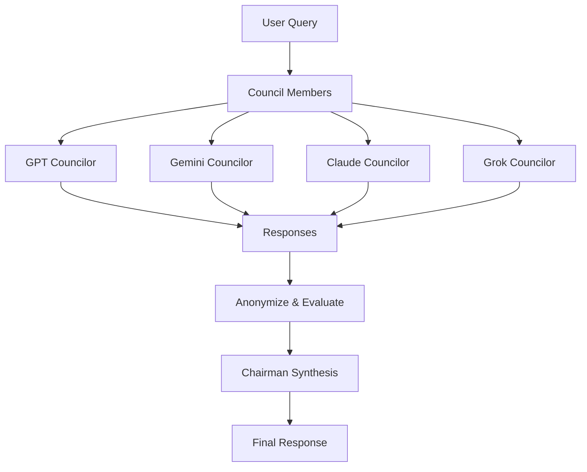
```mermaid
graph TD
    A[User Query] --> B[Council Members]
    
    B --> C[GPT Councilor]
    B --> D[Gemini Councilor]
    B --> E[Claude Councilor]
    B --> F[Grok Councilor]
    
    C --> G[Responses]
    D --> G
    E --> G
    F --> G
    
    G --> H[Anonymize & Evaluate]
    H --> I[Chairman Synthesis]
    I --> J[Final Response]
```

---

### Debate with Judge

**Overview:**
Debate architecture with self-refinement through a judge agent, enabling Pro and Con agents to debate a topic with iterative refinement. The judge evaluates arguments and provides synthesis for progressive improvement. Supports preset agents for quick setup, agent lists, or individual agent configuration.

**Use Cases:**

- Structured debates

- Argument evaluation

- Iterative refinement of positions

- Multi-perspective analysis

**Initialization Options:**

- `preset_agents=True`: Use built-in optimized agents (simplest)
- `agents=[pro, con, judge]`: Provide a list of 3 agents
- Individual parameters: `pro_agent`, `con_agent`, `judge_agent`

**[Learn More](https://docs.swarms.world/en/latest/swarms/structs/debate_with_judge/)**

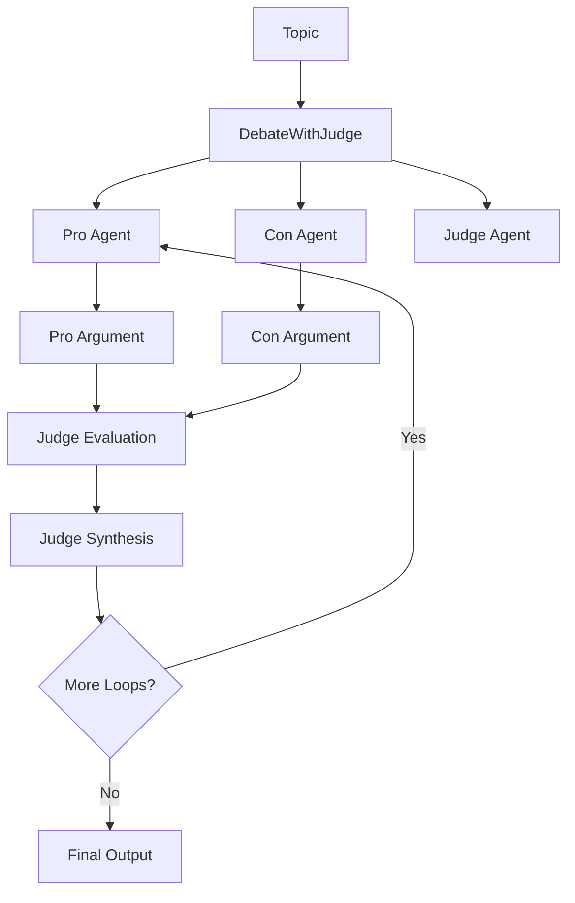
```mermaid
graph TD
    A[Topic] --> B[DebateWithJudge]
    B --> C[Pro Agent]
    B --> D[Con Agent]
    B --> E[Judge Agent]
    
    C --> F[Pro Argument]
    D --> G[Con Argument]
    
    F --> H[Judge Evaluation]
    G --> H
    
    H --> I[Judge Synthesis]
    I --> J{More Loops?}
    J -->|Yes| C
    J -->|No| K[Final Output]
```

---

### Majority Voting

**Overview:**
Agents vote on decisions with the majority determining the final outcome, providing democratic decision-making and error reduction through consensus.

**Use Cases:**

- Democratic decision-making processes

- Consensus building

- Error reduction through voting

**[Learn More](https://docs.swarms.world/en/latest/swarms/structs/majorityvoting/)**

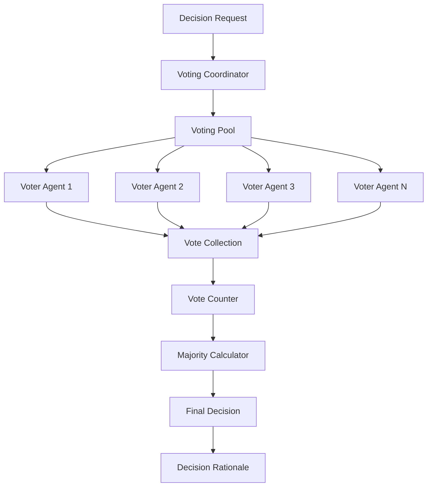
```mermaid
graph TD
    A[Decision Request] --> B[Voting Coordinator]
    B --> C[Voting Pool]
    
    C --> D[Voter Agent 1]
    C --> E[Voter Agent 2]
    C --> F[Voter Agent 3]
    C --> G[Voter Agent N]
    
    D --> H[Vote Collection]
    E --> H
    F --> H
    G --> H
    
    H --> I[Vote Counter]
    I --> J[Majority Calculator]
    J --> K[Final Decision]
    K --> L[Decision Rationale]
```

---

### Auto-Builder

**Overview:**
Automatically constructs and configures multi-agent systems based on requirements, enabling dynamic system creation and adaptation.

**Use Cases:**

- Dynamic system creation

- Adaptive architectures

- Rapid prototyping of multi-agent systems

**[Learn More](https://docs.swarms.world/en/latest/swarms/structs/auto_swarm_builder/)**

```mermaid
graph TD
    A[Requirements Input] --> B[System Analyzer]
    B --> C[Architecture Selector]
    C --> D[Agent Configuration]
    
    D --> E[Agent Builder 1]
    D --> F[Agent Builder 2]
    D --> G[Agent Builder N]
    
    E --> H[System Assembler]
    F --> H
    G --> H
    
    H --> I[Configuration Validator]
    I --> J[System Deployment]
    J --> K[Performance Monitor]
    K --> L[Adaptive Optimizer]
```

---

### Swarm Rearrange

**Overview:**
Orchestrates multiple swarms in sequential or parallel flow patterns with thread-safe operations and flow validation. Provides comprehensive swarm management and coordination capabilities.

**Use Cases:**

- Multi-swarm orchestration

- Flow pattern management

- Swarm coordination

- Sequential and parallel swarm execution

**[Learn More](https://docs.swarms.world/en/latest/swarms/structs/swarm_rearrange/)**

```mermaid
graph TD
    A[Swarm Pool] --> B[SwarmRearrange]
    B --> C[Flow Pattern]
    
    C --> D[Sequential Flow]
    C --> E[Parallel Flow]
    
    D --> F[Swarm 1]
    F --> G[Swarm 2]
    G --> H[Swarm N]
    
    E --> I[Swarm 1]
    E --> J[Swarm 2]
    E --> K[Swarm N]
    
    H --> L[Result Aggregation]
    I --> L
    J --> L
    K --> L
```

---

### Hybrid Hierarchical Cluster

**Overview:**
Combines hierarchical and peer-to-peer communication patterns for complex workflows that require both centralized coordination and distributed collaboration.

**Use Cases:**

- Complex enterprise workflows

- Multi-department coordination

- Hybrid organizational structures

**[Learn More](https://docs.swarms.world/en/latest/swarms/structs/hhcs/)**

```mermaid
graph TD
    A[Central Coordinator] --> B[Cluster 1 Leader]
    A --> C[Cluster 2 Leader]
    A --> D[Cluster 3 Leader]
    
    B --> E[Peer Agent 1.1]
    B --> F[Peer Agent 1.2]
    E <--> F
    
    C --> G[Peer Agent 2.1]
    C --> H[Peer Agent 2.2]
    G <--> H
    
    D --> I[Peer Agent 3.1]
    D --> J[Peer Agent 3.2]
    I <--> J
    
    E --> K[Inter-Cluster Communication]
    G --> K
    I --> K
    K --> A
```

---

### Election Architecture

**Overview:**
Agents participate in democratic voting processes to select leaders or make collective decisions.

**Use Cases:**

- Democratic governance

- Consensus building

- Leadership selection

**[Learn More](https://docs.swarms.world/en/latest/swarms/structs/election_swarm/)**

```mermaid
graph TD
    A[Voting Process] --> B[Candidate Agents]
    B --> C[Voting Mechanism]
    
    C --> D[Voter Agent 1]
    C --> E[Voter Agent 2]
    C --> F[Voter Agent N]
    
    D --> G[Vote Collection]
    E --> G
    F --> G
    
    G --> H[Vote Counting]
    H --> I[Majority Check]
    I --> J{Majority?}
    J -->|Yes| K[Leader Selected]
    J -->|No| L[Continue Voting]
    L --> B
```

---

---

### Dynamic Conversational Architecture

**Overview:**
Adaptive conversation management with dynamic agent selection and interaction patterns.

**Use Cases:**

- Adaptive chatbots

- Dynamic customer service

- Contextual conversations

**[Learn More](https://docs.swarms.world/en/latest/swarms/structs/dynamic_conversational_swarm/)**

```mermaid
graph TD
    A[Conversation Manager] --> B[Speaker Selection Logic]
    B --> C[Priority Speaker]
    B --> D[Random Speaker]
    B --> E[Round Robin Speaker]
    
    C --> F[Active Discussion]
    D --> F
    E --> F
    
    F --> G[Agent Pool]
    G --> H[Agent 1]
    G --> I[Agent 2]
    G --> J[Agent N]
    
    H --> K[Dynamic Response]
    I --> K
    J --> K
    K --> A
```

---

### Tree Architecture

**Overview:**
Hierarchical tree structure for organizing agents in parent-child relationships.

**Use Cases:**

- Organizational hierarchies

- Decision trees

- Taxonomic classification

**[Learn More](https://docs.swarms.world/en/latest/swarms/structs/tree_swarm/)**

```mermaid
graph TD
    A[Root] --> B[Child 1]
    A --> C[Child 2]
    B --> D[Grandchild 1]
    B --> E[Grandchild 2]
    C --> F[Grandchild 3]
    C --> G[Grandchild 4]
```
