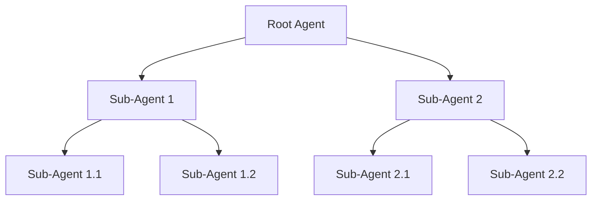
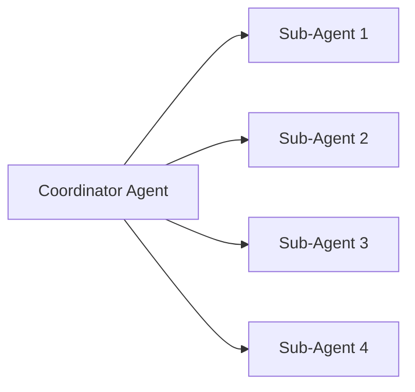
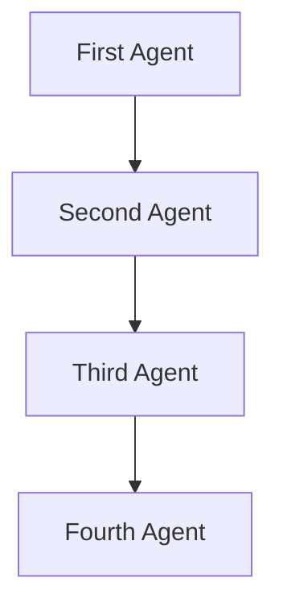
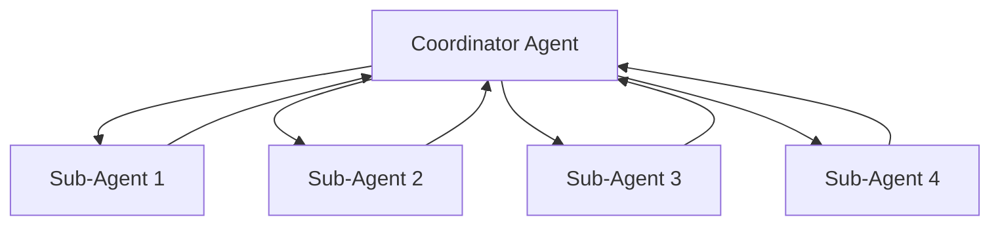

# Swarm Architectures

Swarms was designed to faciliate the communication between many different and specialized agents from a vast array of other frameworks such as langchain, autogen, crew, and more.

In traditional swarm theory, there are many types of swarms usually for very specialized use-cases and problem sets. Such as Hiearchical and sequential are great for accounting and sales, because there is usually a boss coordinator agent that distributes a workload to other specialized agents.

| **Name**                      | **Description**                                                                                                                                                         | **Code Link**               | **Use Cases**                                                                                     |
|-------------------------------|-------------------------------------------------------------------------------------------------------------------------------------------------------------------------|-----------------------------|---------------------------------------------------------------------------------------------------|
| Hierarchical Swarms           | A system where agents are organized in a hierarchy, with higher-level agents coordinating lower-level agents to achieve complex tasks.                                   | [Code Link](#)              | Manufacturing process optimization, multi-level sales management, healthcare resource coordination |
| Agent Rearrange               | A setup where agents rearrange themselves dynamically based on the task requirements and environmental conditions.                                                       | [Code Link](https://docs.swarms.world/en/latest/swarms/structs/agent_rearrange/)              | Adaptive manufacturing lines, dynamic sales territory realignment, flexible healthcare staffing  |
| Concurrent Workflows          | Agents perform different tasks simultaneously, coordinating to complete a larger goal.                                                                                  | [Code Link](#)              | Concurrent production lines, parallel sales operations, simultaneous patient care processes       |
| Sequential Coordination       | Agents perform tasks in a specific sequence, where the completion of one task triggers the start of the next.                                                           | [Code Link](https://docs.swarms.world/en/latest/swarms/structs/sequential_workflow/)              | Step-by-step assembly lines, sequential sales processes, stepwise patient treatment workflows     |
| Parallel Processing           | Agents work on different parts of a task simultaneously to speed up the overall process.                                                                                | [Code Link](#)              | Parallel data processing in manufacturing, simultaneous sales analytics, concurrent medical tests  |

### Hierarchical Swarm

**Overview:**
A Hierarchical Swarm architecture organizes the agents in a tree-like structure. Higher-level agents delegate tasks to lower-level agents, which can further divide tasks among themselves. This structure allows for efficient task distribution and scalability.

**Use-Cases:**

- Complex decision-making processes where tasks can be broken down into subtasks.

- Multi-stage workflows such as data processing pipelines or hierarchical reinforcement learning.

---

### Parallel Swarm

**Overview:**
In a Parallel Swarm architecture, multiple agents operate independently and simultaneously on different tasks. Each agent works on its own task without dependencies on the others.

**Use-Cases:**
- Tasks that can be processed independently, such as parallel data analysis.
- Large-scale simulations where multiple scenarios are run in parallel.

---

### Sequential Swarm

**Overview:**
A Sequential Swarm architecture processes tasks in a linear sequence. Each agent completes its task before passing the result to the next agent in the chain. This architecture ensures orderly processing and is useful when tasks have dependencies.

**Use-Cases:**
- Workflows where each step depends on the previous one, such as assembly lines or sequential data processing.

- Scenarios requiring strict order of operations.

---

### Round Robin Swarm

**Overview:**
In a Round Robin Swarm architecture, tasks are distributed cyclically among a set of agents. Each agent takes turns handling tasks in a rotating order, ensuring even distribution of workload.

**Use-Cases:**
- Load balancing in distributed systems.

- Scenarios requiring fair distribution of tasks to avoid overloading any single agent.

