**Maximizing Enterprise Automation: Overcoming the Limitations of Individual AI Agents Through Multi-Agent Collaboration**


In today's rapidly evolving business landscape, enterprises are constantly seeking innovative solutions to enhance efficiency, reduce operational costs, and maintain a competitive edge. Automation has emerged as a critical strategy for achieving these objectives, with artificial intelligence (AI) playing a pivotal role. AI agents, particularly those powered by advanced machine learning models, have shown immense potential in automating a variety of tasks. However, individual AI agents come with inherent limitations that hinder their ability to fully automate complex enterprise operations at scale.

This essay dives into the specific limitations of individual AI agents—context window limits, hallucination, single-task execution, lack of collaboration, lack of accuracy, and slow processing speed—and explores how multi-agent collaboration can overcome these challenges. By tailoring our discussion to the needs of enterprises aiming to automate operations at scale, we highlight practical strategies and frameworks that can be adopted to unlock the full potential of AI-driven automation.

---

### Part 1: The Limitations of Individual AI Agents

Despite significant advancements, individual AI agents face several obstacles that limit their effectiveness in enterprise automation. Understanding these limitations is crucial for organizations aiming to implement AI solutions that are both efficient and scalable.

#### 1. Context Window Limits

**Explanation**

AI agents, especially those based on language models like GPT-3 or GPT-4, operate within a fixed context window. This means they can only process and consider a limited amount of information (tokens) at a time. In practical terms, this restricts the agent's ability to handle large documents, long conversations, or complex datasets that exceed their context window.

**Impact on Enterprises**

For enterprises, this limitation poses significant challenges. Business operations often involve processing extensive documents such as legal contracts, technical manuals, or large datasets. An AI agent with a limited context window may miss crucial information located outside its immediate context, leading to incomplete analyses or erroneous conclusions.

**Illustration**

```mermaid
graph LR
    Subgraph[Context Window Limit]
    Input[Large Document]
    Agent[AI Agent]
    Output[Partial Understanding]
    Input -- Truncated Data --> Agent
    Agent -- Generates --> Output
    end
```

*An AI agent processes only a portion of a large document due to context window limits, resulting in partial understanding.*

#### 2. Hallucination

**Explanation**

Hallucination refers to the tendency of AI agents to produce outputs that are not grounded in the input data or reality. They may generate plausible-sounding but incorrect or nonsensical information, especially when uncertain or when the input data is ambiguous.

**Impact on Enterprises**

In enterprise settings, hallucinations can lead to misinformation, poor decision-making, and a lack of trust in AI systems. For instance, if an AI agent generates incorrect financial forecasts or misinterprets regulatory requirements, the consequences could be financially damaging and legally problematic.

**Illustration**

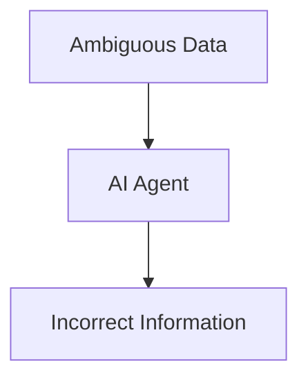

*An AI agent generates incorrect information (hallucination) when processing ambiguous data.*

#### 3. Single Task Execution

**Explanation**

Many AI agents are designed to excel at a specific task or a narrow set of functions. They lack the flexibility to perform multiple tasks simultaneously or adapt to new tasks without significant reconfiguration or retraining.

**Impact on Enterprises**

Enterprises require systems that can handle a variety of tasks, often concurrently. Relying on single-task agents necessitates deploying multiple separate agents, which can lead to integration challenges, increased complexity, and higher maintenance costs.

**Illustration**

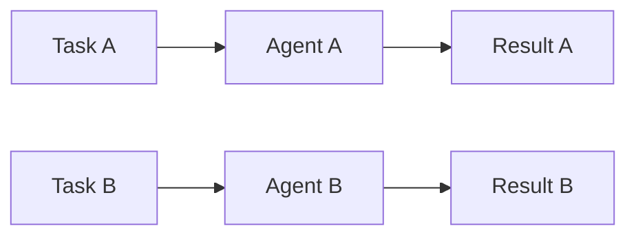

*Separate agents handle different tasks independently, lacking integration.*

#### 4. Lack of Collaboration

**Explanation**

Individual AI agents typically operate in isolation, without the ability to communicate or collaborate with other agents. This siloed operation prevents them from sharing insights, learning from each other, or coordinating actions to achieve a common goal.

**Impact on Enterprises**

Complex enterprise operations often require coordinated efforts across different functions and departments. The inability of AI agents to collaborate limits their effectiveness in such environments, leading to disjointed processes and suboptimal outcomes.

**Illustration**

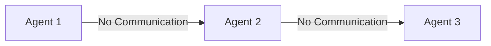

*Agents operate without collaboration, resulting in isolated efforts.*

#### 5. Lack of Accuracy

**Explanation**

AI agents may produce inaccurate results due to limitations in their training data, algorithms, or inability to fully understand complex inputs. Factors such as data bias, overfitting, or lack of domain-specific knowledge contribute to this inaccuracy.

**Impact on Enterprises**

Inaccurate outputs can have serious ramifications for businesses, including flawed strategic decisions, customer dissatisfaction, and compliance risks. High accuracy is essential for tasks like financial analysis, customer service, and regulatory compliance.

**Illustration**

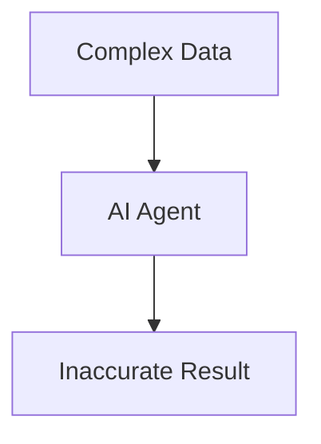

*An AI agent produces an inaccurate result when handling complex data.*

#### 6. Slow Processing Speed

**Explanation**

Some AI agents require significant computational resources and time to process data and generate outputs. Factors like model complexity, inefficient algorithms, or hardware limitations can contribute to slow processing speeds.

**Impact on Enterprises**

Slow processing impedes real-time decision-making and responsiveness. In fast-paced business environments, delays can lead to missed opportunities, reduced productivity, and competitive disadvantages.

**Illustration**

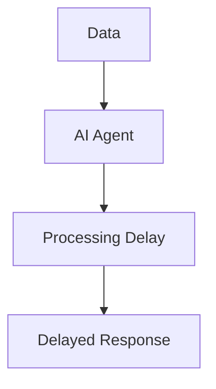

*An AI agent's slow processing leads to delayed responses.*

---

### Part 2: Overcoming Limitations Through Multi-Agent Collaboration

To address the challenges posed by individual AI agents, enterprises can adopt a multi-agent collaboration approach. By orchestrating multiple agents with complementary skills and functionalities, organizations can enhance performance, accuracy, and scalability in their automation efforts.

#### 1. Extending Context Window Through Distributed Processing

**Solution**

By dividing large inputs into smaller segments, multiple agents can process different parts simultaneously. A coordinating agent can then aggregate the results to form a comprehensive understanding.

**Implementation in Enterprises**

- **Document Analysis:** For lengthy legal contracts, agents can each analyze specific sections, and a master agent can compile insights and ensure consistency.
- **Customer Interaction History:** In customer service, agents can handle different segments of a customer's history to provide personalized support.

**Illustration**

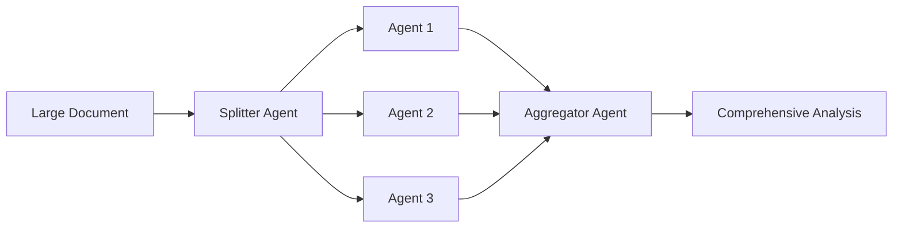

*Multiple agents process segments of a large document, and results are aggregated.*

#### 2. Reducing Hallucination Through Cross-Verification

**Solution**

Agents can verify each other's outputs by cross-referencing information and flagging inconsistencies. Implementing consensus mechanisms ensures that only accurate information is accepted.

**Implementation in Enterprises**

- **Data Validation:** In data entry automation, one agent inputs data while another validates it against source documents.
- **Decision Support Systems:** Multiple agents evaluate options and agree on recommendations, reducing the risk of incorrect advice.

**Illustration**

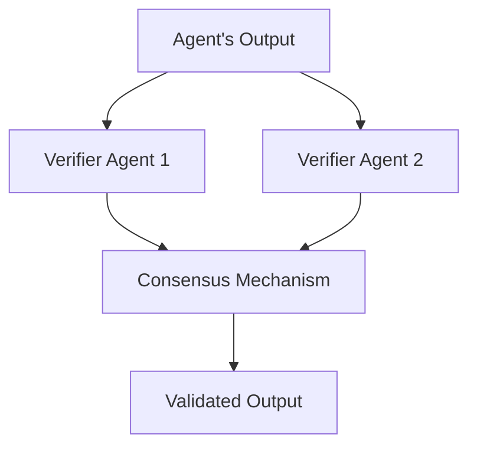

*Agents verify outputs through cross-verification and consensus.*

#### 3. Enhancing Multi-Tasking Through Specialized Agents

**Solution**

Deploy specialized agents for different tasks and enable them to work concurrently. An orchestrator agent manages task allocation and workflow integration.

**Implementation in Enterprises**

- **Automated Workflows:** In supply chain management, one agent handles inventory analysis, another manages logistics, and a third forecasts demand.
- **IT Operations:** In IT automation, separate agents manage network monitoring, security scanning, and system updates.

**Illustration**

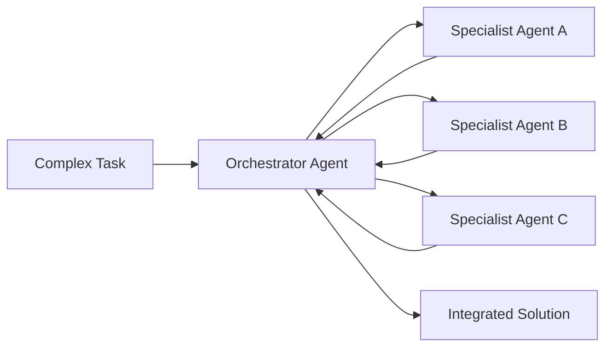

*Specialized agents handle different tasks under the management of an orchestrator agent.*

#### 4. Facilitating Collaboration Through Communication Protocols

**Solution**

Implement communication protocols that allow agents to share information, request assistance, and coordinate actions. This fosters a collaborative environment where agents complement each other's capabilities.

**Implementation in Enterprises**

- **Customer Service:** Chatbots and virtual assistants share customer data to provide seamless support across channels.
- **Project Management:** Agents managing different aspects of a project (scheduling, resource allocation, risk assessment) coordinate to keep the project on track.

**Illustration**

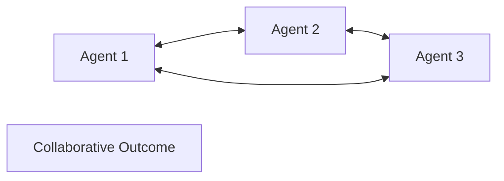

*Agents communicate and collaborate to achieve a common goal.*

#### 5. Improving Accuracy Through Ensemble Learning

**Solution**

Use ensemble methods where multiple agents provide predictions or analyses, and a meta-agent combines these to produce a more accurate result.

**Implementation in Enterprises**

- **Risk Assessment:** Different agents assess risks from various perspectives (financial, operational, compliance), and their insights are combined.
- **Market Analysis:** Agents analyze market trends, customer behavior, and competitor actions, leading to a comprehensive market strategy.

**Illustration**

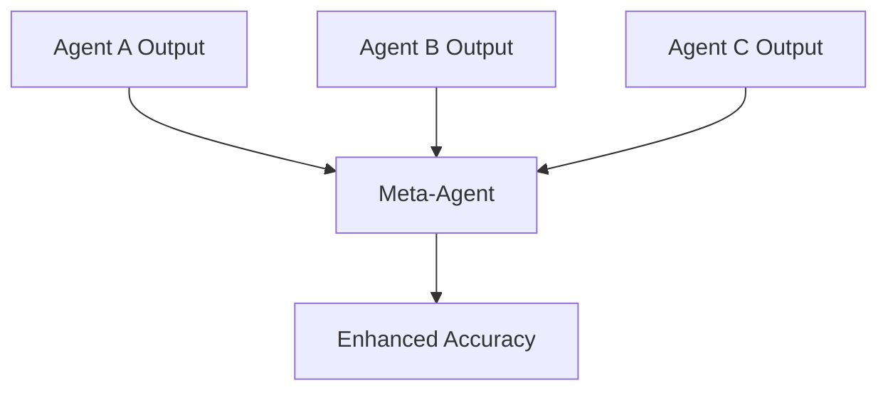

*Meta-agent combines outputs from multiple agents to improve accuracy.*

#### 6. Increasing Processing Speed Through Parallelization

**Solution**

By distributing workloads among multiple agents operating in parallel, processing times are significantly reduced, enabling real-time responses.

**Implementation in Enterprises**

- **Data Processing:** Large datasets are partitioned and processed simultaneously by different agents.
- **Customer Requests:** Multiple customer inquiries are handled at once by separate agents, improving response times.

**Illustration**

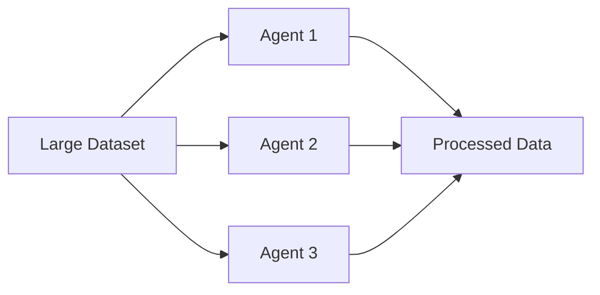

*Parallel processing by agents leads to faster completion times.*

---

### Part 3: Tailoring Multi-Agent Systems for Enterprise Automation at Scale

Implementing multi-agent systems in an enterprise context requires careful planning and consideration of organizational needs, technical infrastructure, and strategic goals. Below are key considerations and steps for enterprises aiming to adopt multi-agent collaboration for automation at scale.

#### 1. Identifying Automation Opportunities

Enterprises should start by identifying processes and tasks that are suitable for automation through multi-agent systems. Prioritize areas where:

- **Complexity Requires Specialization:** Tasks that involve multiple steps or require diverse expertise.
- **Scalability Is Essential:** Operations that need to handle increasing workloads efficiently.
- **Speed and Accuracy Are Critical:** Processes where delays or errors have significant impacts.

#### 2. Designing the Multi-Agent Architecture

Develop a robust architecture that defines how agents will interact, communicate, and collaborate. Key components include:

- **Agent Specialization:** Define the roles and responsibilities of each agent.
- **Communication Protocols:** Establish standards for information exchange.
- **Coordination Mechanisms:** Implement orchestrator agents or decentralized coordination strategies.
- **Integration with Existing Systems:** Ensure compatibility with current IT infrastructure.

#### 3. Ensuring Data Security and Compliance

Data security is paramount when agents handle sensitive enterprise information. Implement measures such as:

- **Encryption:** Secure communication channels between agents.
- **Access Control:** Define permissions for data access and agent capabilities.
- **Compliance Checks:** Ensure the system adheres to relevant regulations (e.g., GDPR, HIPAA).

#### 4. Monitoring and Performance Management

Establish monitoring tools to track agent performance, system health, and outcomes. Key metrics may include:

- **Processing Speed:** Measure how quickly tasks are completed.
- **Accuracy Rates:** Track the correctness of outputs.
- **Resource Utilization:** Monitor computational resources used by agents.
- **Error Logs:** Identify and address failures or exceptions.

#### 5. Scaling Strategies

Develop strategies for scaling the system as enterprise needs grow, including:

- **Dynamic Resource Allocation:** Adjust computational resources based on workload.
- **Agent Addition or Removal:** Add new agents or deactivate others to meet changing demands.
- **Load Balancing:** Distribute tasks evenly to prevent bottlenecks.

#### 6. Continuous Improvement

Implement feedback loops for ongoing enhancement of the multi-agent system:

- **User Feedback:** Gather input from users interacting with the system.
- **Performance Analytics:** Analyze data to identify areas for optimization.
- **Updating Agents:** Regularly update agent algorithms and knowledge bases.

---

### Part 4: Case Studies and Real-World Applications

To illustrate the practical benefits of multi-agent collaboration in enterprise automation, let's explore several real-world examples.

#### Case Study 1: Financial Services Automation

**Challenge**

A financial institution needs to process large volumes of loan applications, requiring data verification, risk assessment, compliance checks, and decision-making.

**Solution**

- **Specialized Agents:**
  - **Data Extraction Agent:** Extracts data from application forms.
  - **Verification Agent:** Confirms the accuracy of applicant information.
  - **Risk Assessment Agent:** Evaluates credit risk using predictive models.
  - **Compliance Agent:** Ensures all regulatory requirements are met.
  - **Decision Agent:** Aggregates inputs and makes approval decisions.

- **Collaboration:**
  - Agents communicate to share data and findings.
  - The Decision Agent coordinates the workflow.

**Outcome**

- **Increased Processing Speed:** Applications are processed in minutes instead of days.
- **Improved Accuracy:** Cross-verification reduces errors.
- **Scalability:** System handles fluctuating application volumes efficiently.

#### Case Study 2: Manufacturing Supply Chain Optimization

**Challenge**

A manufacturing company wants to optimize its supply chain to reduce costs and improve delivery times.

**Solution**

- **Specialized Agents:**
  - **Demand Forecasting Agent:** Predicts product demand.
  - **Inventory Management Agent:** Monitors stock levels and orders materials.
  - **Logistics Agent:** Plans shipping routes and schedules.
  - **Supplier Evaluation Agent:** Assesses supplier performance and reliability.

- **Collaboration:**
  - Agents share data on demand forecasts and inventory levels.
  - Logistics Agent adjusts plans based on input from other agents.

**Outcome**

- **Cost Reduction:** Optimized inventory levels reduce holding costs.
- **Efficiency Gains:** Improved logistics planning enhances delivery times.
- **Adaptability:** System responds quickly to changes in demand or supply disruptions.

#### Case Study 3: Healthcare Patient Management

**Challenge**

A hospital aims to improve patient care coordination, managing appointments, medical records, billing, and treatment plans.

**Solution**

- **Specialized Agents:**
  - **Appointment Scheduling Agent:** Manages patient appointments.
  - **Medical Records Agent:** Updates and retrieves patient records.
  - **Billing Agent:** Handles invoicing and insurance claims.
  - **Treatment Planning Agent:** Assists in developing patient care plans.

- **Collaboration:**
  - Agents coordinate to ensure seamless patient experiences.
  - Data is securely shared while maintaining patient confidentiality.

**Outcome**

- **Enhanced Patient Care:** Improved coordination leads to better treatment outcomes.
- **Operational Efficiency:** Administrative tasks are streamlined.
- **Compliance:** System adheres to healthcare regulations (e.g., HIPAA).

---

### Part 5: Implementing Multi-Agent Systems – Best Practices for Enterprises

For enterprises embarking on the journey of multi-agent automation, adhering to best practices ensures successful implementation.

#### 1. Start Small and Scale Gradually

- **Pilot Projects:** Begin with a specific process or department to test the multi-agent system.
- **Learn and Adapt:** Use insights from initial deployments to refine the system.

#### 2. Invest in Training and Change Management

- **Employee Education:** Train staff on interacting with and managing multi-agent systems.
- **Change Management:** Prepare the organization for changes in workflows and roles.

#### 3. Leverage Cloud and Edge Computing

- **Scalable Infrastructure:** Utilize cloud services for flexible resource allocation.
- **Edge Computing:** Deploy agents closer to data sources for faster processing.

#### 4. Foster Interoperability

- **Standards Compliance:** Use industry standards for data formats and communication protocols.
- **API Integration:** Ensure agents can integrate with existing enterprise applications.

#### 5. Prioritize Ethical Considerations

- **Transparency:** Maintain clear documentation of how agents make decisions.
- **Bias Mitigation:** Implement strategies to prevent and correct algorithmic biases.
- **Accountability:** Establish protocols for human oversight and intervention.

---

### Conclusion

Enterprises seeking to automate operations at scale face the limitations inherent in individual AI agents. Context window limits, hallucinations, single-task execution, lack of collaboration, lack of accuracy, and slow processing speed hinder the full potential of automation efforts. Multi-agent collaboration emerges as a robust solution to these challenges, offering a pathway to enhanced efficiency, accuracy, scalability, and adaptability.

By adopting multi-agent systems, enterprises can:

- **Extend Capabilities:** Overcome individual agent limitations through collective intelligence.
- **Improve Outcomes:** Achieve higher accuracy and faster processing by leveraging specialized agents.
- **Enhance Flexibility:** Adapt to changing business needs with scalable and versatile agent architectures.
- **Drive Innovation:** Foster a culture of continuous improvement and technological advancement.

Implementing multi-agent systems requires thoughtful planning, adherence to best practices, and a commitment to ongoing management and optimization. Enterprises that successfully navigate this journey will position themselves at the forefront of automation, unlocking new levels of productivity and competitive advantage in an increasingly digital world.

---

**References**

While this essay synthesizes concepts relevant to enterprise automation and multi-agent systems, organizations are encouraged to consult specialized literature, case studies, and industry experts to tailor solutions to their specific contexts. Collaboration with technology partners and investment in research and development can further enhance the successful adoption of multi-agent systems.