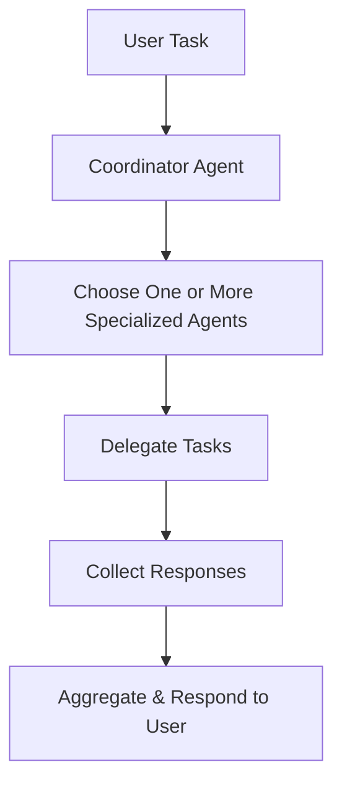

# Agent Handoff Tutorial

The handoff feature enables agents to delegate tasks to other specialized agents, creating a collaborative multi-agent system where each agent can leverage the expertise of others. This allows for efficient task distribution, parallel processing, and specialized problem-solving without manual coordination.


Agent handoffs are designed for scenarios where a task requires multiple areas of expertise or can benefit from parallel processing. When an agent has access to other agents through the `handoffs` parameter, it can dynamically delegate subtasks to the most appropriate specialized agents using the `handoff_task` tool.

The handoff mechanism operates through a coordinator pattern:

1. **Coordinator Agent**: An agent that receives the main task and analyzes it to determine which specialized agents should handle different parts
2. **Specialized Agents**: Agents with specific expertise (research, coding, writing, etc.) that can be delegated to
3. **Task Delegation**: The coordinator uses the `handoff_task` tool to send tasks to one or more specialized agents
4. **Response Aggregation**: Results from all delegated agents are collected and returned to the coordinator

### Key Benefits

| Feature                    | Description                                                                                          |
|----------------------------|------------------------------------------------------------------------------------------------------|
| **Task Specialization**     | Leverage agents with specific expertise for different aspects of a task                              |
| **Parallel Processing**     | Delegate multiple independent tasks to different agents simultaneously                                |
| **Resource Optimization**  | Efficiently distribute work across specialized agents instead of one generalist agent                |
| **Scalability**            | Easily add new specialized agents to expand capabilities without modifying existing agents             |
| **Flexibility**            | Coordinator can delegate to one or multiple agents based on task complexity                           |
| **Collaboration**          | Enable agents to work together on complex multi-faceted tasks                                        |

## Handoff Architecture




## How It Works

### Setting Up Handoffs

To enable handoffs, you need to:

1. **Create Specialized Agents**: Define agents with specific expertise and clear descriptions
2. **Create Coordinator Agent**: Create an agent with the `handoffs` parameter containing the list of specialized agents
3. **Configure System Prompt**: Provide the coordinator with instructions on when and how to delegate

### The Handoff Process

1. **Task Analysis**: The coordinator receives a task and analyzes its requirements
2. **Agent Selection**: The coordinator identifies which specialized agents are best suited for different parts of the task
3. **Task Delegation**: Using the `handoff_task` tool, the coordinator sends tasks to selected agents
4. **Parallel Execution**: Multiple agents can work simultaneously on different tasks
5. **Response Collection**: Results from all delegated agents are collected
6. **Result Aggregation**: The coordinator receives and can process all responses

### The handoff_task Tool

The `handoff_task` tool is automatically available to agents that have the `handoffs` parameter set. It accepts:

- **handoffs**: A list of handoff requests, each containing:

  - `agent_name`: The name of the agent to delegate to

  - `task`: The specific task to be delegated

  - `reasoning`: Explanation of why this agent was selected

The tool can handle:

- **Single Agent Delegation**: Send a task to one specialized agent

- **Multiple Agent Delegation**: Send different tasks to multiple agents in parallel

- **Parallel Processing**: All delegated tasks execute simultaneously for efficiency

## Complete Example: Multi-Agent Collaboration

This comprehensive example demonstrates a coordinator agent delegating tasks to specialized research, coding, and writing agents:

### Environment Setup

First, set up your environment variables. Create a `.env` file in your project root:

```bash
# .env file
OPENAI_API_KEY="your_openai_api_key_here"
WORKSPACE_DIR="agent_workspace"
```

### Code Example

```python
from swarms.structs.agent import Agent


def main():
    # Create specialized agents
    research_agent = Agent(
        agent_name="ResearchAgent",
        agent_description="Specializes in researching topics and providing detailed, factual information",
        model_name="gpt-4o-mini",
        max_loops=1,
        system_prompt="You are a research specialist. Provide detailed, well-researched information about any topic, citing sources when possible.",
    )

    code_agent = Agent(
        agent_name="CodeExpertAgent",
        agent_description="Expert in writing, reviewing, and explaining code across multiple programming languages",
        model_name="gpt-4o-mini",
        max_loops=1,
        system_prompt="You are a coding expert. Write, review, and explain code with a focus on best practices and clean code principles.",
    )

    writing_agent = Agent(
        agent_name="WritingAgent",
        agent_description="Skilled in creative and technical writing, content creation, and editing",
        model_name="gpt-4o-mini",
        max_loops=1,
        system_prompt="You are a writing specialist. Create, edit, and improve written content while maintaining appropriate tone and style.",
    )

    # Create a coordinator agent with handoffs enabled
    coordinator = Agent(
        agent_name="CoordinatorAgent",
        agent_description="Coordinates tasks and delegates to specialized agents",
        model_name="gpt-4o-mini",
        max_loops=1,
        handoffs=[research_agent, code_agent, writing_agent],
        system_prompt="You are a coordinator agent. Analyze tasks and delegate them to the most appropriate specialized agent using the handoff_task tool. You can delegate to multiple agents if needed.",
        output_type="all",
    )

    # Complex task that requires multiple agents
    task = "Call all the agents available to you and ask them how they are doing"
    result = coordinator.run(task=task)
    print(result)


if __name__ == "__main__":
    main()
```

### Example Use Cases

**Research and Writing Task**:
```python
task = """
Research the latest developments in quantum computing and write a comprehensive article about it.
Include code examples where relevant.
"""
```

**Multi-Expert Consultation**:

```python
task = """
I need to build a web scraper. Please:
1. Research best practices for web scraping
2. Write the Python code for the scraper
3. Create documentation explaining how it works
"""
```

## Best Practices

| Best Practice                 | Description                                                                                                 |
|-------------------------------|-------------------------------------------------------------------------------------------------------------|
| **Clear Agent Descriptions**  | Provide specific, detailed descriptions for each specialized agent to help the coordinator make good decisions |
| **Specialized System Prompts** | Give each specialized agent a focused system prompt that matches their expertise area                          |
| **Coordinator Instructions**  | Provide clear instructions to the coordinator on when to delegate and how to structure tasks                  |
| **Task Clarity**              | Ensure tasks are clear and can be broken down into components that match agent specializations                |
| **Output Type Configuration**  | Use `output_type="all"` on the coordinator to see all agent responses and handoff details                      |
| **Monitor Handoffs**          | Enable `verbose=True` to see detailed information about handoff decisions and execution                       |

## Troubleshooting

**Coordinator Not Delegating**: Ensure the coordinator's system prompt explicitly mentions using the `handoff_task` tool. Check that agent descriptions are clear and match the task requirements.

**Wrong Agent Selected**: Improve agent descriptions to be more specific about their capabilities. Provide more context in the coordinator's system prompt about when to use each agent.

**Handoff Errors**: Verify that all agent names in handoffs match exactly. Ensure all specialized agents are properly initialized before creating the coordinator.

**No Responses from Agents**: Check that specialized agents have valid model configurations and API keys. Enable verbose mode to see detailed error messages.

## Key Takeaways

1. **Handoff Setup**: Create specialized agents first, then pass them to the coordinator via the `handoffs` parameter
2. **Automatic Tool**: The `handoff_task` tool is automatically available to agents with handoffs configured
3. **Parallel Execution**: Multiple agents can work simultaneously on different tasks for efficiency
4. **Clear Descriptions**: Agent descriptions are crucial for the coordinator to make good delegation decisions
5. **Flexible Delegation**: The coordinator can delegate to one or multiple agents based on task complexity
6. **Response Aggregation**: All agent responses are collected and returned to the coordinator

## Next Steps

| Resource                                                      | Description                                      |
|---------------------------------------------------------------|--------------------------------------------------|
| [Agent Reference Documentation](../structs/agent.md)           | Complete API details for Agents and handoffs     |
| [Multi-Agent Architectures](../concept/swarm_architectures.md) | Advanced multi-agent patterns and architectures  |
| [Agent Router](../structs/agent_router.md)                    | Alternative routing mechanisms for agent selection |
| [Multi-Agent Communication](../structs/agent_multi_agent_communication.md) | Other methods for agent-to-agent communication   |

## Conclusion

Agent handoffs represent a powerful pattern for building collaborative multi-agent systems where tasks can be intelligently distributed across specialized agents. By enabling dynamic task delegation, handoffs allow you to:

- **Leverage Specialization**: Each agent can focus on what they do best, improving overall quality

- **Scale Efficiently**: Add new specialized agents without modifying existing ones

- **Process in Parallel**: Execute multiple tasks simultaneously for faster completion

- **Optimize Resources**: Distribute work efficiently across available agents

The handoff mechanism provides a flexible foundation for building complex multi-agent workflows where coordination and specialization work together to solve challenging problems. Whether you're building research teams, development workflows, or content creation pipelines, handoffs enable agents to collaborate effectively and leverage each other's strengths.

Start with the example above, customize it for your use case, and explore how different combinations of specialized agents can tackle increasingly complex tasks through intelligent delegation and collaboration.
