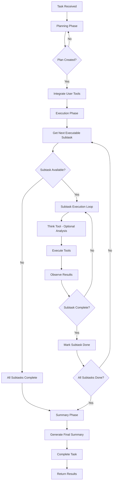

# Autonomous Agent Tutorial

The autonomous agent mode (`max_loops="auto"`) is a powerful feature that enables agents to automatically plan, execute, and summarize complex multi-step tasks without manual intervention. Unlike traditional agents that require you to specify the number of loops, autonomous agents intelligently break down tasks, manage dependencies, and complete work systematically.

Autonomous agents are designed for complex tasks that require multiple steps, research, analysis, and file operations. When `max_loops="auto"` and `interactive=False`, the agent operates in a structured three-phase cycle that ensures thorough task completion:

1. **Planning Phase**: The agent analyzes the task and creates a comprehensive plan with subtasks, priorities, and dependencies. This ensures logical execution order and proper task breakdown.

2. **Execution Phase**: For each subtask, the agent enters a loop of thinking, tool execution, and observation until the subtask is complete. The agent respects dependencies and only executes subtasks when their prerequisites are satisfied.

3. **Summary Phase**: Once all subtasks are complete, the agent generates a comprehensive final summary that includes all accomplishments, results, and insights from the entire task execution.

### Key Benefits

| Feature                       | Description                                                                                          |
|-------------------------------|------------------------------------------------------------------------------------------------------|
| **Automatic Task Breakdown**  | No need to manually specify steps – the agent creates an optimal plan                                |
| **Dependency Management**     | Subtasks are executed in the correct order based on dependencies                                     |
| **Built-in File Operations**  | Access to file creation, reading, updating, and directory management                                 |
| **Progress Tracking**         | Clear visibility into which subtasks are completed, in progress, or pending                          |
| **Comprehensive Summaries**   | Final summaries include all subtask results and overall task completion status                       |
| **Error Recovery**            | Built-in retry logic and graceful error handling for robust execution                                |

## Autonomous Loop Architecture



## How It Works

### Phase 1: Planning

The agent analyzes the task and creates a structured plan using the `create_plan` tool:

- **Input**: Main task description

- **Output**: List of subtasks with:
  - `step_id`: Unique identifier
  
  - `description`: What needs to be done
  
  - `priority`: critical, high, medium, or low
  
  - `dependencies`: Other subtasks that must complete first

### Phase 2: Execution

For each subtask, the agent follows this loop:

1. **Think** (optional): Brief analysis using the `think` tool (max 2 consecutive calls)
2. **Action**: Execute tools to complete the work
3. **Observe**: Review tool outputs
4. **Complete**: Mark subtask as done using `subtask_done`

The agent respects dependencies and only executes subtasks when their dependencies are satisfied.

### Phase 3: Summary

Once all subtasks are complete, the agent:

- Generates a comprehensive summary

- Uses the `complete_task` tool to finalize

- Returns the complete results

## Built-in Tools

Autonomous agents have access to specialized tools:

| Tool | Purpose | Example Use Case |
|------|---------|------------------|
| `create_plan` | Break down task into subtasks | Initial planning |
| `think` | Analyze situation before action | Complex decision-making |
| `subtask_done` | Mark subtask as complete | Progress tracking |
| `complete_task` | Finalize main task | Task completion |
| `respond_to_user` | Communicate with user | Status updates, questions |
| `create_file` | Create new files | Save reports, documents |
| `update_file` | Modify existing files | Update reports, append data |
| `read_file` | Read file contents | Review previous work |
| `list_directory` | List directory contents | Explore workspace |
| `delete_file` | Delete files | Cleanup temporary files |

## Complete Example: Research Report with Exa Search

This comprehensive example demonstrates an autonomous agent using Exa search to research a topic and create a report file:

### Environment Setup

First, set up your environment variables. Create a `.env` file in your project root:

```bash
# .env file
OPENAI_API_KEY=your_openai_api_key_here
EXA_API_KEY=your_exa_api_key_here
WORKSPACE_DIR="agent_workspace"
```

### Code Example

```python
import os
from swarms import Agent
from dotenv import load_dotenv
import httpx

# Load environment variables from .env file
load_dotenv()

def exa_search(query: str) -> str:
    """
    Search the web using Exa API.
    
    Args:
        query: Search query
        
    Returns:
        str: Search results
    """
    api_key = os.getenv("EXA_API_KEY")
    
    headers = {
        "x-api-key": api_key,
        "content-type": "application/json",
    }
    
    payload = {
        "query": query,
        "type": "auto",
        "numResults": 3,
        "contents": {"text": True},
    }
    
    try:
        response = httpx.post(
            "https://api.exa.ai/search",
            json=payload,
            headers=headers,
            timeout=30,
        )
        response.raise_for_status()
        return str(response.json())
    except Exception as e:
        return f"Search failed: {str(e)}"

# Initialize autonomous agent
agent = Agent(
    agent_name="Research-Report-Agent",
    agent_description="Creates comprehensive research reports",
    model_name="gpt-4.1",
    max_loops="auto",
    tools=[exa_search],
    autosave=True,
    verbose=True,
    system_prompt="""
    You are an expert research analyst.
    Create detailed, well-structured reports.
    Always save your work to files.
    """,
)

# Complex research task
task = """
Create a comprehensive research report on quantum computing:
1. Research current quantum computing technologies
2. Identify major companies and research institutions
3. Analyze recent breakthroughs
4. Predict future trends
5. Create a detailed markdown report
6. Save the report to a file
7. Send a message to the user when complete

Complete this in 4-5 steps.
"""

# Execute task
result = agent.run(task)

# Access results
print("\n=== Final Result ===")
print(result)

# Check workspace
workspace = agent._get_agent_workspace_dir()
print(f"\n=== Workspace ===")
print(f"Files saved to: {workspace}")

# List created files
if os.path.exists(workspace):
    files = os.listdir(workspace)
    print(f"\nCreated files: {files}")
```

## Workspace and File Management

All file operations use the agent's workspace directory, which is automatically created at `workspace_dir/agents/{agent-name}-{uuid}/`. Files created by the agent (using `create_file`, `update_file`, etc.) are saved in this directory. The workspace location is controlled by the `WORKSPACE_DIR` environment variable.

## Best Practices

| Best Practice                 | Description                                                                                                 |
|-------------------------------|-------------------------------------------------------------------------------------------------------------|
| **Clear Task Descriptions**   | Provide specific, actionable task descriptions with clear goals                                             |
| **Specify Subtask Count**     | Guide the agent by suggesting how many steps the task should take (e.g., "Complete this in 3-4 steps")      |
| **Use Appropriate Tools**     | Provide tools that match your task requirements (e.g., search tools for research tasks)                     |
| **Monitor Progress**          | Enable `verbose=True` and `print_on=True` to see detailed progress and formatted output                     |
| **Autosave**                  | Enable `autosave=True` to save configuration at each step for recovery and debugging                        |

## Troubleshooting

**Agent Stuck in Planning**: Provide more specific task instructions or break down the task in the prompt. Ensure `interactive=False`.

**Subtasks Not Completing**: Check that tools are working correctly, review error messages in verbose mode, and verify dependencies are correctly set.

**File Operations Failing**: Ensure `WORKSPACE_DIR` environment variable is set, verify write permissions, or use absolute paths if needed.

## Key Takeaways

1. **Autonomous Mode**: Set `max_loops="auto"` and `interactive=False`
2. **Automatic Planning**: Agent creates plans with subtasks and dependencies
3. **Built-in Tools**: File operations and user communication tools are available
4. **Workspace Management**: All files are organized in agent-specific directories
5. **Progress Tracking**: Subtasks are tracked and dependencies are respected
6. **Comprehensive Summaries**: Final summaries include all subtask results

## Next Steps

| Resource                                     | Description                                      |
|-----------------------------------------------|--------------------------------------------------|
| [Agent Reference Documentation](../structs/agent.md) | Complete API details for Agents                  |
| [Tool Integration Examples](agent_with_tools.md)      | Examples of integrating and creating custom tools |
| [File Operations](../structs/agent.md#autonomous-agent-examples) | Using file operations in autonomous mode          |
| [Best Practices](../structs/agent.md#best-practices)          | Optimal configuration and usage recommendations   |

## Conclusion

Autonomous agents represent a significant advancement in agent capabilities, enabling complex multi-step tasks to be completed automatically with minimal configuration. By setting `max_loops="auto"` and `interactive=False`, you unlock a powerful system that:

- **Intelligently Plans**: Automatically breaks down complex tasks into manageable subtasks with proper dependencies

- **Executes Systematically**: Follows a structured workflow of thinking, action, and observation for each subtask

- **Manages Files**: Provides built-in tools for file operations, all organized in agent-specific workspace directories

- **Tracks Progress**: Maintains clear visibility into task completion status and progress

- **Summarizes Comprehensively**: Generates detailed final summaries that capture all work completed

The autonomous loop architecture ensures that tasks are completed thoroughly, with proper error handling, dependency management, and progress tracking. Combined with custom tools (like Exa search in our example), autonomous agents can tackle complex research, analysis, and content creation tasks that would otherwise require significant manual coordination.

Whether you're building research agents, content creators, data analysts, or any other type of autonomous system, the autonomous agent mode provides a robust foundation for reliable, systematic task completion. Start with the example above, customize it for your use case, and leverage the built-in tools and workspace management to build powerful autonomous systems.

