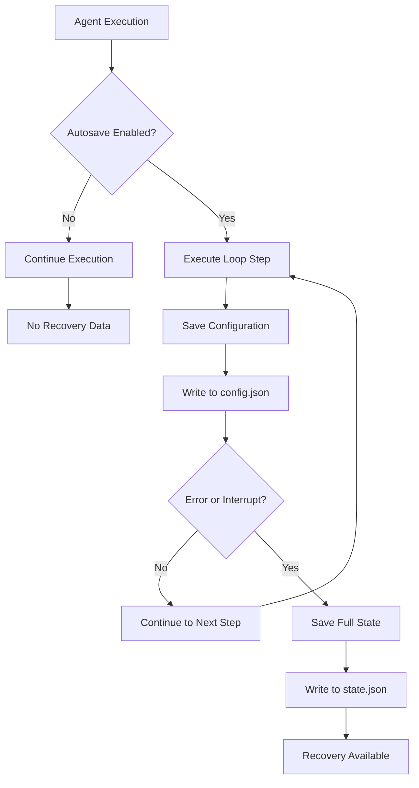

# Autosave Tutorial

The autosave feature enables agents to automatically save their configuration and state at each step of execution, ensuring your work is preserved even if the agent encounters errors, is interrupted, or needs to be resumed later. This provides a safety net for long-running tasks and enables seamless recovery and debugging.

Autosave automatically protects your agent's progress by regularly saving its configuration and state. This enables easy recovery from interruptions, supports debugging, preserves long-running tasks, and organizes all files in dedicated agent directories. When enabled, autosave ensures configuration is saved at each step, full state is captured on errors or when requested, files are written safely to prevent corruption, and important metadata is tracked for recovery and analysis.

## Key Benefits

| Feature                    | Description                                                                                          |
|----------------------------|------------------------------------------------------------------------------------------------------|
| **Automatic Checkpointing** | Configuration saved at each step without manual intervention                                        |
| **Error Recovery**         | Resume execution from the last saved state after errors or interruptions                            |
| **Debugging Support**      | Inspect agent configuration and state at any point to understand behavior                           |
| **Workspace Organization** | Each agent's files are organized in isolated directories for easy management                        |
| **Atomic Operations**       | Safe file writes prevent corruption even if interrupted during save                                 |
| **Metadata Tracking**      | Timestamps and loop counts help track execution progress and timing                                 |

## Autosave Architecture



## How It Works

### Enabling Autosave

To enable autosave, simply set `autosave=True` when creating an agent:

```python
from swarms import Agent

agent = Agent(
    model_name="gpt-4o-mini",
    agent_name="my-agent",
    max_loops=5,
    autosave=True,  # Enable autosave
)
```

### What Gets Saved

**Configuration (`config.json`)**:

- Agent configuration (model, prompts, tools, etc.)

- Current loop count

- Agent metadata (name, ID, description)

- Timestamp of save

- All agent parameters and settings

**State (`{agent_name}_state.json`)**:

- Full conversation history

- Tool execution results

- Memory contents

- Current task context

- Complete agent state for recovery

### Workspace Directory Structure

Files are saved in an agent-specific workspace directory:

```
workspace_dir/
└── agents/
    └── {agent-name}-{uuid}/
        ├── config.json              # Configuration at each step
        ├── {agent_name}_state.json  # Full state on save()
        └── [other files created by agent tools]
```

The workspace directory is controlled by the `WORKSPACE_DIR` environment variable, defaulting to `agent_workspace` in the current directory.

### Save Timing

- **Configuration**: Saved automatically at each loop step

- **State**: Saved on errors, interruptions, or when `save()` is called explicitly

- **Atomic Writes**: Files are written to temporary files first, then renamed atomically

## Complete Example: Using Autosave

This comprehensive example demonstrates autosave functionality with configuration inspection and recovery:

### Environment Setup

First, set up your environment variables. Create a `.env` file in your project root:

```bash
# .env file
OPENAI_API_KEY="your_openai_api_key_here"
WORKSPACE_DIR="agent_workspace"
```

### Code Example

```python
import os
import json
from swarms import Agent
from dotenv import load_dotenv

load_dotenv()

# Create an agent with autosave enabled
agent = Agent(
    model_name="gpt-4o-mini",
    agent_name="autosave-demo",
    max_loops=5,
    autosave=True,  # Enable autosave
    verbose=True,
)

# Get the agent-specific workspace directory
agent_workspace = agent._get_agent_workspace_dir()
print(f"Agent workspace: {agent_workspace}")

# Run a task - configuration is saved at each step
task = "Write a comprehensive guide on Python best practices. Include 5 sections."
response = agent.run(task)

# Inspect the saved configuration
config_path = os.path.join(agent_workspace, "config.json")
if os.path.exists(config_path):
    with open(config_path, "r") as f:
        config = json.load(f)
        
    # Check autosave metadata
    if "_autosave_metadata" in config:
        metadata = config["_autosave_metadata"]
        print(f"\n=== Autosave Metadata ===")
        print(f"Timestamp: {metadata.get('timestamp')}")
        print(f"Loop Count: {metadata.get('loop_count')}")
        print(f"Agent ID: {metadata.get('agent_id')}")
        print(f"Agent Name: {metadata.get('agent_name')}")

# Save full state explicitly
agent.save()

# Check for state file
state_files = [
    f for f in os.listdir(agent_workspace) 
    if f.endswith("_state.json")
]
print(f"\n=== State Files ===")
print(f"Found {len(state_files)} state file(s): {state_files}")

# Access the final response
print(f"\n=== Final Response ===")
print(response)
```

### Recovery Example

```python
from swarms import Agent
import os

# Create agent with same name to potentially resume
agent = Agent(
    model_name="gpt-4o-mini",
    agent_name="autosave-demo",
    autosave=True,
)

# Check if previous state exists
agent_workspace = agent._get_agent_workspace_dir()
state_path = os.path.join(agent_workspace, "autosave-demo_state.json")

if os.path.exists(state_path):
    # Load previous state
    agent.load(state_path)
    print("Resumed from saved state")
    
    # Continue with task
    response = agent.run("Continue from where you left off")
else:
    print("No previous state found, starting fresh")
    response = agent.run("Start a new task")
```

## Best Practices

| Best Practice                | Description                                                                                                 |
|------------------------------|-------------------------------------------------------------------------------------------------------------|
| **Enable for Long Tasks**    | Always enable autosave for tasks that take significant time or have multiple steps                            |
| **Use Descriptive Names**    | Provide clear agent names to easily identify workspace directories                                          |
| **Monitor Workspace**        | Regularly check workspace directories to manage disk space and review saved configurations                   |
| **Explicit State Saves**     | Call `agent.save()` explicitly before important operations or when you want to checkpoint manually          |
| **Workspace Cleanup**        | Periodically clean up old workspace directories if you don't need historical data                           |
| **Environment Configuration** | Set `WORKSPACE_DIR` environment variable to control where all agent workspaces are stored                   |
| **Inspect Configurations**   | Review saved `config.json` files to understand agent behavior and debug issues                               |

## Troubleshooting

**Autosave Not Working**: Ensure `autosave=True` is set when creating the agent. Check that the workspace directory is writable and `WORKSPACE_DIR` environment variable is set correctly.

**Files Not Appearing**: Verify the agent workspace directory exists and has write permissions. Enable `verbose=True` to see autosave debug messages.

**Large Workspace Directories**: Autosave creates files at each step. For very long-running tasks, consider periodic cleanup or adjust save frequency if needed.

**State Recovery Issues**: Ensure you're using the same agent name when trying to resume. The workspace directory is based on agent name and UUID.

**Permission Errors**: Check that the workspace directory and parent directories have appropriate write permissions for the user running the agent.

## Key Takeaways

1. **Simple Enablement**: Just set `autosave=True` when creating an agent
2. **Automatic Saving**: Configuration is saved at each loop step automatically
3. **Workspace Isolation**: Each agent gets its own directory based on name and UUID
4. **Recovery Support**: Load saved state to resume execution after interruptions
5. **Metadata Tracking**: Each save includes timestamp and loop count for debugging
6. **Atomic Writes**: Safe file operations prevent corruption during saves


## Conclusion

Autosave provides a robust safety net for agent execution, ensuring that your work is preserved and can be recovered even in the face of errors or interruptions. By automatically saving configuration at each step and state on critical events, autosave enables:

- **Reliable Execution**: Never lose progress on long-running tasks

- **Easy Debugging**: Inspect agent state and configuration at any point

- **Seamless Recovery**: Resume execution from the last saved checkpoint

- **Organized Workspaces**: Each agent's files are neatly organized in isolated directories

The autosave mechanism is designed to be transparent and non-intrusive, working in the background to protect your work while maintaining performance. Whether you're running simple tasks or complex multi-step workflows, enabling autosave provides peace of mind and valuable debugging capabilities.

Start with the example above, enable autosave for your agents, and explore how automatic checkpointing can improve the reliability and debuggability of your agent workflows.

