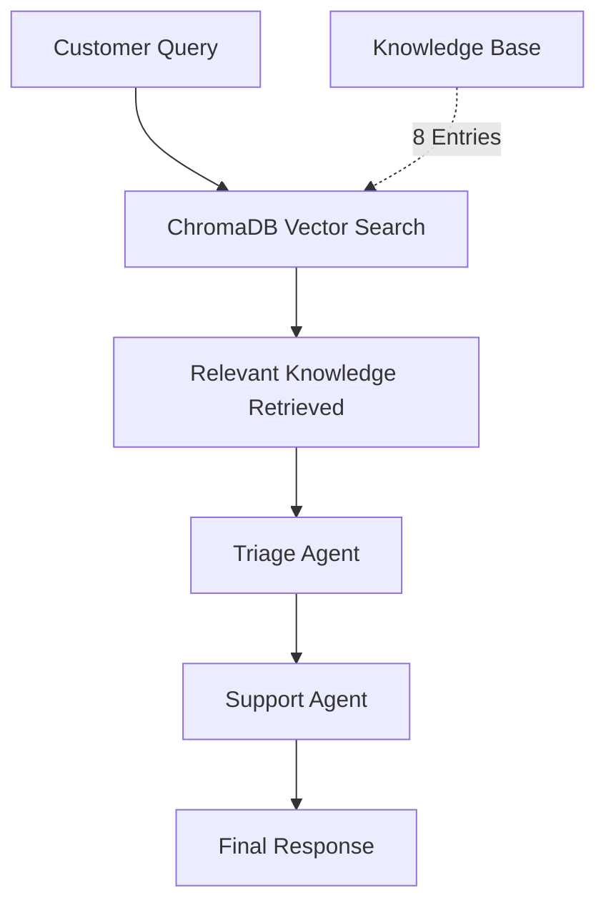

# Customer Support Agent Swarm

An interactive, console-based customer support system using multi-agents and free vector database (ChromaDB).

## Overview

This example demonstrates a practical customer support system with:

- **Console-Based Interface**: Simple terminal interaction, no web services required
- **Free Vector Database**: ChromaDB for knowledge storage and retrieval
- **Multi-Agent Workflow**: Triage and support agents working together
- **Real-Time Knowledge Retrieval**: Agents query relevant information from vector DB
- **Interactive & Demo Modes**: Test with your own queries or use pre-defined examples

## Key Features

✅ **No Cloud Services**: Runs completely locally
✅ **Free Dependencies**: ChromaDB is open-source and free
✅ **Semantic Search**: Vector similarity for intelligent knowledge retrieval
✅ **Production-Ready**: Easy to extend and deploy

## Architecture



**Workflow:**
1. Customer asks a question via console
2. System queries ChromaDB for relevant knowledge
3. Triage agent categorizes the inquiry
4. Support agent formulates response using retrieved knowledge
5. Customer receives answer

## Components

### 1. ChromaDB Vector Database
**Purpose**: Stores and retrieves company knowledge using semantic search

**Contents**:
- **Products**: CloudSync Pro ($29.99/mo), DataVault Enterprise ($99.99/mo)
- **Troubleshooting**: Login issues, sync problems
- **Billing**: Refunds, upgrades, pricing
- **Policies**: Privacy (GDPR/SOC2), SLA (99.9% uptime)

**Features**:
- Free and open-source
- Runs locally (no cloud required)
- In-memory or persistent storage
- Semantic similarity search

### 2. Triage Agent
**Purpose**: First point of contact, categorizes inquiries

**Capabilities**:
- Understands customer issues
- Categorizes by type (technical, billing, product)
- Provides concise summary
- Uses knowledge base context

### 3. Support Agent
**Purpose**: Provides solutions using retrieved knowledge

**Capabilities**:
- Technical troubleshooting
- Billing assistance
- Product information
- Contextual responses from vector DB

## Quick Start

### Installation

```bash
# Install ChromaDB (free vector database)
pip install chromadb

# Install Swarms (if not already installed)
pip install swarms
```

### Setup

```bash
# Set your OpenAI API key
export OPENAI_API_KEY="your-api-key-here"
```

### Run Interactive Mode

```bash
cd examples/multi_agent
python customer_support_swarm.py
```

This starts an interactive console where you can ask questions:

```
🎯 TECHCORP CUSTOMER SUPPORT - INTERACTIVE CONSOLE
================================================================================

Powered by:
  • Multi-Agent System (Swarms)
  • ChromaDB Vector Database (free, local)
  • Real-time Knowledge Retrieval

Type 'quit' or 'exit' to end the session
Type 'help' to see example questions
================================================================================

--------------------------------------------------------------------------------

👤 You: I can't log into my account

🔍 Searching knowledge base...
🤖 Processing with support agents...

================================================================================
🤖 SUPPORT AGENT:
================================================================================

I understand you're having trouble logging in. Here's how to resolve this:

DIAGNOSIS: Login authentication issue

SOLUTION:
1. Clear your browser cache and cookies
2. Use the password reset feature at cloudpro.com/reset
3. Verify your email address is correct
4. Ensure your account is still active

FOLLOW_UP: If these steps don't resolve the issue, contact support@techcorp.com
Our 24/7 support team is available via chat, email, or phone.

================================================================================
```

### Run Demo Mode

```bash
python customer_support_swarm.py --demo
```

Runs 3 pre-defined queries to demonstrate the system

## Code Overview

### Initialize ChromaDB

```python
import chromadb
from chromadb.config import Settings

# Initialize ChromaDB (in-memory, free, no setup)
chroma_client = chromadb.Client(Settings(
    anonymized_telemetry=False,
    allow_reset=True
))

# Create collection for company knowledge
knowledge_collection = chroma_client.get_or_create_collection(
    name="company_knowledge",
    metadata={"description": "TechCorp product information"}
)
```

### Load Knowledge into Vector DB

```python
KNOWLEDGE_ENTRIES = [
    {
        "id": "product_cloudsync",
        "text": "CloudSync Pro is priced at $29.99/month with unlimited storage...",
        "metadata": {"category": "product", "product": "CloudSync Pro"}
    },
    # ... more entries
]

# Populate database
for entry in KNOWLEDGE_ENTRIES:
    knowledge_collection.add(
        ids=[entry["id"]],
        documents=[entry["text"]],
        metadatas=[entry["metadata"]]
    )
```

### Query Vector Database

```python
def query_knowledge_base(query: str, n_results: int = 3) -> str:
    """Query the vector database for relevant knowledge"""
    results = knowledge_collection.query(
        query_texts=[query],
        n_results=n_results
    )

    # Format and return relevant knowledge
    knowledge = "Relevant Knowledge Base Information:\n\n"
    for doc, metadata in zip(results["documents"][0], results["metadatas"][0]):
        knowledge += f"[{metadata['category']}] {doc}\n\n"

    return knowledge
```

### Create Agents

```python
from swarms import Agent

def create_support_agents():
    triage_agent = Agent(
        agent_name="Triage-Agent",
        system_prompt="You are a customer support triage specialist...",
        max_loops=1,
        verbose=False,
    )

    support_agent = Agent(
        agent_name="Support-Agent",
        system_prompt="You are a TechCorp support specialist...",
        max_loops=1,
        verbose=False,
    )

    return [triage_agent, support_agent]
```

### Handle Support Query

```python
from swarms.structs.sequential_workflow import SequentialWorkflow

def handle_support_query(customer_query: str, agents: list) -> str:
    # Step 1: Query vector database
    relevant_knowledge = query_knowledge_base(customer_query, n_results=3)

    # Step 2: Enrich query with knowledge
    enriched_query = f"""Customer Query: {customer_query}

{relevant_knowledge}

Based on the customer query and knowledge base information, provide a response."""

    # Step 3: Run through agent workflow
    workflow = SequentialWorkflow(
        name="Support-Workflow",
        agents=agents,
        max_loops=1,
    )

    return workflow.run(enriched_query)
```

## Example Queries

The system can handle various types of customer support queries:

### Technical Support
```
👤 You: I can't log into my account
```

**Vector DB Retrieves**:
- Troubleshooting guide for login issues
- Account verification steps
- Contact information for support

**Agent Response**:
- Diagnoses the issue
- Provides step-by-step solution
- Offers escalation path

### Product Information
```
👤 You: What's the difference between CloudSync Pro and DataVault Enterprise?
```

**Vector DB Retrieves**:
- Product specifications
- Pricing information
- Feature comparisons

**Agent Response**:
- Explains key differences
- Recommends based on user needs
- Mentions pricing and trials

### Billing Questions
```
👤 You: How do I get a refund?
```

**Vector DB Retrieves**:
- Refund policy
- Process steps
- Timeline expectations

**Agent Response**:
- Explains 30-day money-back guarantee
- Provides refund request steps
- Sets timeline expectations

## Customization

### Adding More Knowledge

Expand the knowledge base with more entries:

```python
KNOWLEDGE_ENTRIES.append({
    "id": "feature_api_access",
    "text": "API access is available on DataVault Enterprise plan. Includes REST API, webhooks, and 10,000 requests/month. Documentation at api.techcorp.com",
    "metadata": {"category": "product", "feature": "api"}
})
```

### Adding More Agents

Create specialized agents for specific needs:

```python
def create_expanded_support_agents():
    # ... existing agents ...

    escalation_agent = Agent(
        agent_name="Escalation-Agent",
        system_prompt="Review cases and determine if human intervention is needed.",
        max_loops=1,
    )

    return [triage_agent, support_agent, escalation_agent]
```

### Persistent Storage

For production, save ChromaDB to disk:

```python
from chromadb import PersistentClient

# Use persistent storage instead of in-memory
chroma_client = PersistentClient(path="./chroma_db")

# Database persists between runs
```

### Load Knowledge from Files

```python
import json

# Load knowledge from JSON file
with open("knowledge_base.json", "r") as f:
    knowledge_entries = json.load(f)

# Populate database
for entry in knowledge_entries:
    knowledge_collection.add(
        ids=[entry["id"]],
        documents=[entry["text"]],
        metadatas=[entry["metadata"]]
    )
```

## Production Considerations

### 1. Knowledge Management
- **Regular Updates**: Keep knowledge base current with product changes
- **Version Control**: Track knowledge base changes in Git
- **Quality Control**: Review and validate new entries before adding
- **Categorization**: Use consistent metadata categories for better retrieval

### 2. Performance Optimization
- **Batch Loading**: Load knowledge in batches for faster startup
- **Cache Results**: Cache frequently queried knowledge
- **Index Optimization**: ChromaDB handles indexing automatically
- **Retrieval Tuning**: Adjust `n_results` based on query complexity

### 3. Monitoring & Analytics
- **Track Queries**: Log all customer queries for analysis
- **Measure Accuracy**: Monitor if retrieved knowledge is relevant
- **Response Time**: Track end-to-end response latency
- **User Feedback**: Collect satisfaction ratings

### 4. Security
- **API Key Protection**: Never hardcode API keys
- **Input Validation**: Sanitize user inputs
- **Rate Limiting**: Prevent abuse with rate limits
- **Data Privacy**: Don't store sensitive customer data in logs

## Best Practices

### 1. Vector Database
- Start with in-memory for development
- Use persistent storage for production
- Regularly backup your database
- Monitor database size and performance

### 2. Agent Design
- Keep prompts focused and specific
- Use verbose=False in production for cleaner output
- Test agents independently before integration
- Monitor agent response quality

### 3. Knowledge Base
- Structure entries clearly and consistently
- Use meaningful IDs and metadata
- Include examples in knowledge entries
- Update based on common queries

## Why ChromaDB?

**Advantages:**
- ✅ Free and open-source
- ✅ No external dependencies
- ✅ Simple 3-line setup
- ✅ Fast semantic search
- ✅ Works offline
- ✅ Perfect for prototypes and production

**Alternatives:**
- FAISS (Facebook) - Faster for very large datasets
- Pinecone - Managed cloud service (paid)
- Weaviate - Full-featured vector DB (more complex)
- Qdrant - Open-source with advanced features

## Next Steps

1. **Try the demo**: Run `python customer_support_swarm.py --demo`
2. **Interactive mode**: Run without flags for console chat
3. **Customize**: Add your own knowledge entries
4. **Extend**: Add more specialized agents
5. **Deploy**: Switch to persistent storage for production

## Related Examples

- [Sequential Workflow](./sequential_workflow.md) - Linear agent workflows
- [Agent Rearrange](./agent_rearrange.md) - Dynamic agent routing
- [Multi-Agent Collaboration](../structs/swarms/multi_agent_collaboration/) - Team coordination patterns

## Support

- **Documentation**: [docs.swarms.world](https://docs.swarms.world)
- **Discord**: [Join the community](https://discord.gg/EamjgSaEQf)
- **GitHub**: [Report issues](https://github.com/kyegomez/swarms)

---

Built with ❤️ using Swarms and ChromaDB
