# GraphWorkflow with Rustworkx: Complete Patterns Guide

A comprehensive guide to implementing various agentic patterns using GraphWorkflow with the rustworkx backend for optimal performance.

## Table of Contents

1. [Introduction](#introduction)
2. [Basic Patterns](#basic-patterns)
3. [Hierarchical Patterns](#hierarchical-patterns)
4. [Concurrent/Parallel Patterns](#concurrentparallel-patterns)
5. [Majority Voting Patterns](#majority-voting-patterns)
6. [Fan-Out/Fan-In Patterns](#fan-outfan-in-patterns)
7. [Sequential Patterns](#sequential-patterns)
8. [Advanced Patterns](#advanced-patterns)
9. [Performance Optimization](#performance-optimization)

## Introduction

GraphWorkflow with rustworkx backend provides a high-performance framework for orchestrating complex multi-agent workflows. This guide demonstrates how to implement various agentic patterns that are commonly used in production systems.

### Why Rustworkx?

- **Performance**: 2-10x faster for large graphs (1000+ nodes)
- **Memory Efficiency**: Optimized for large-scale workflows
- **Scalability**: Better performance with complex graph operations
- **API Compatibility**: Drop-in replacement for NetworkX backend

### Installation

```bash
pip install rustworkx
```

## Basic Patterns

### Simple Sequential Workflow

The most basic pattern - agents execute one after another in sequence.

**Architecture Diagram:**

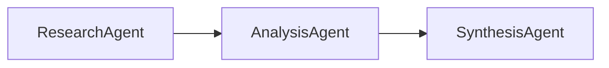

```python
from swarms import Agent, GraphWorkflow

# Create agents
research_agent = Agent(
    agent_name="ResearchAgent",
    model_name="gpt-4o-mini",
    max_loops=1,
)

analysis_agent = Agent(
    agent_name="AnalysisAgent",
    model_name="gpt-4o-mini",
    max_loops=1,
)

synthesis_agent = Agent(
    agent_name="SynthesisAgent",
    model_name="gpt-4o-mini",
    max_loops=1,
)

# Build sequential workflow
workflow = GraphWorkflow(
    name="Sequential-Workflow",
    backend="rustworkx",
    verbose=True,
)

workflow.add_node(research_agent)
workflow.add_node(analysis_agent)
workflow.add_node(synthesis_agent)

# Create sequential chain
workflow.add_edge(research_agent, analysis_agent)
workflow.add_edge(analysis_agent, synthesis_agent)

# Execute
results = workflow.run("Analyze the impact of AI on healthcare")
```

**Use Case**: When each agent needs the previous agent's output before proceeding.

## Hierarchical Patterns

### Multi-Level Hierarchy

Hierarchical patterns organize agents into levels, where higher-level agents coordinate lower-level agents.

**Architecture Diagram:**

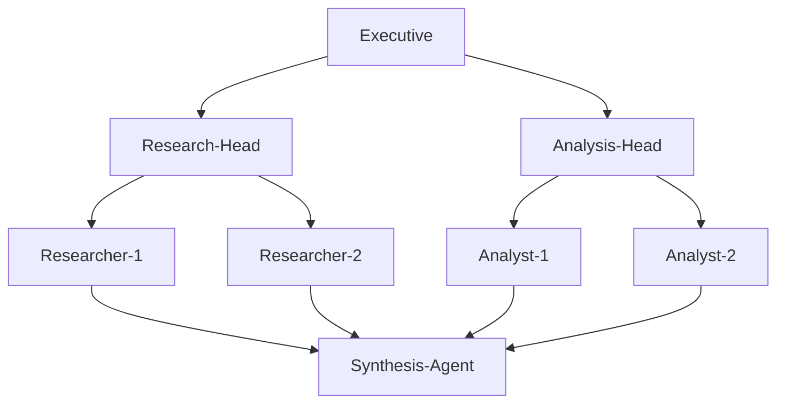

```python
from swarms import Agent, GraphWorkflow

# Level 1: Executive/Coordinator
executive = Agent(
    agent_name="Executive",
    agent_description="Coordinates overall strategy",
    model_name="gpt-4o-mini",
    max_loops=1,
)

# Level 2: Department Heads
research_head = Agent(
    agent_name="Research-Head",
    agent_description="Leads research department",
    model_name="gpt-4o-mini",
    max_loops=1,
)

analysis_head = Agent(
    agent_name="Analysis-Head",
    agent_description="Leads analysis department",
    model_name="gpt-4o-mini",
    max_loops=1,
)

# Level 3: Specialists
researcher_1 = Agent(
    agent_name="Researcher-1",
    agent_description="Market research specialist",
    model_name="gpt-4o-mini",
    max_loops=1,
)

researcher_2 = Agent(
    agent_name="Researcher-2",
    agent_description="Technical research specialist",
    model_name="gpt-4o-mini",
    max_loops=1,
)

analyst_1 = Agent(
    agent_name="Analyst-1",
    agent_description="Data analyst",
    model_name="gpt-4o-mini",
    max_loops=1,
)

analyst_2 = Agent(
    agent_name="Analyst-2",
    agent_description="Financial analyst",
    model_name="gpt-4o-mini",
    max_loops=1,
)

# Level 4: Synthesis
synthesis_agent = Agent(
    agent_name="Synthesis-Agent",
    agent_description="Synthesizes all outputs",
    model_name="gpt-4o-mini",
    max_loops=1,
)

# Build hierarchical workflow
workflow = GraphWorkflow(
    name="Hierarchical-Workflow",
    backend="rustworkx",
    verbose=True,
)

# Add all agents
all_agents = [
    executive,
    research_head,
    analysis_head,
    researcher_1,
    researcher_2,
    analyst_1,
    analyst_2,
    synthesis_agent,
]

for agent in all_agents:
    workflow.add_node(agent)

# Level 1 -> Level 2
workflow.add_edge(executive, research_head)
workflow.add_edge(executive, analysis_head)

# Level 2 -> Level 3
workflow.add_edges_from_source(
    research_head,
    [researcher_1, researcher_2],
)

workflow.add_edges_from_source(
    analysis_head,
    [analyst_1, analyst_2],
)

# Level 3 -> Level 4 (convergence)
workflow.add_edges_to_target(
    [researcher_1, researcher_2, analyst_1, analyst_2],
    synthesis_agent,
)

# Execute
results = workflow.run("Conduct a comprehensive market analysis")
```

**Use Case**: Organizational structures, multi-level decision making, hierarchical data processing.

### Tree Structure Hierarchy

A tree-like hierarchy where one root agent branches into multiple specialized branches.

**Architecture Diagram:**

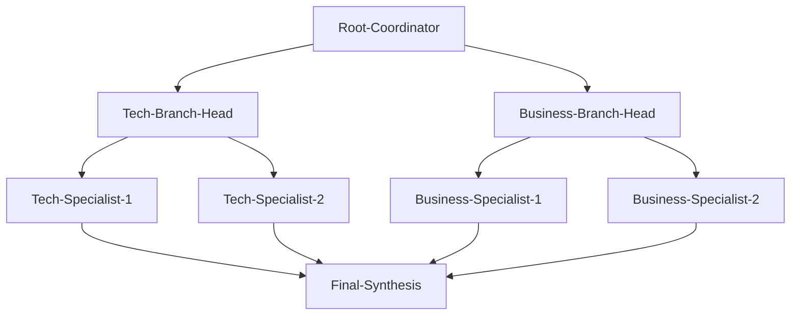

```python
from swarms import Agent, GraphWorkflow

# Root agent
root_coordinator = Agent(
    agent_name="Root-Coordinator",
    model_name="gpt-4o-mini",
    max_loops=1,
)

# Branch 1: Technical Analysis
tech_branch_head = Agent(
    agent_name="Tech-Branch-Head",
    model_name="gpt-4o-mini",
    max_loops=1,
)

tech_specialist_1 = Agent(
    agent_name="Tech-Specialist-1",
    model_name="gpt-4o-mini",
    max_loops=1,
)

tech_specialist_2 = Agent(
    agent_name="Tech-Specialist-2",
    model_name="gpt-4o-mini",
    max_loops=1,
)

# Branch 2: Business Analysis
business_branch_head = Agent(
    agent_name="Business-Branch-Head",
    model_name="gpt-4o-mini",
    max_loops=1,
)

business_specialist_1 = Agent(
    agent_name="Business-Specialist-1",
    model_name="gpt-4o-mini",
    max_loops=1,
)

business_specialist_2 = Agent(
    agent_name="Business-Specialist-2",
    model_name="gpt-4o-mini",
    max_loops=1,
)

# Convergence point
final_synthesis = Agent(
    agent_name="Final-Synthesis",
    model_name="gpt-4o-mini",
    max_loops=1,
)

workflow = GraphWorkflow(
    name="Tree-Hierarchy-Workflow",
    backend="rustworkx",
)

all_agents = [
    root_coordinator,
    tech_branch_head,
    tech_specialist_1,
    tech_specialist_2,
    business_branch_head,
    business_specialist_1,
    business_specialist_2,
    final_synthesis,
]

for agent in all_agents:
    workflow.add_node(agent)

# Root -> Branch heads
workflow.add_edge(root_coordinator, tech_branch_head)
workflow.add_edge(root_coordinator, business_branch_head)

# Branch heads -> Specialists
workflow.add_edges_from_source(
    tech_branch_head,
    [tech_specialist_1, tech_specialist_2],
)

workflow.add_edges_from_source(
    business_branch_head,
    [business_specialist_1, business_specialist_2],
)

# All specialists -> Final synthesis
workflow.add_edges_to_target(
    [
        tech_specialist_1,
        tech_specialist_2,
        business_specialist_1,
        business_specialist_2,
    ],
    final_synthesis,
)

results = workflow.run("Analyze a technology startup from multiple perspectives")
```

## Concurrent/Parallel Patterns

### Full Parallel Execution

All agents execute simultaneously without dependencies.

**Architecture Diagram:**

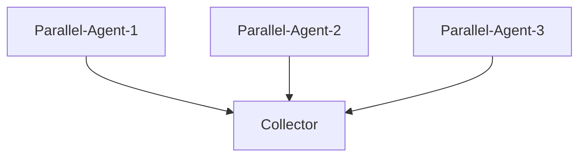

```python
from swarms import Agent, GraphWorkflow

# Create independent parallel agents
parallel_agent_1 = Agent(
    agent_name="Parallel-Agent-1",
    agent_description="Independent analysis 1",
    model_name="gpt-4o-mini",
    max_loops=1,
)

parallel_agent_2 = Agent(
    agent_name="Parallel-Agent-2",
    agent_description="Independent analysis 2",
    model_name="gpt-4o-mini",
    max_loops=1,
)

parallel_agent_3 = Agent(
    agent_name="Parallel-Agent-3",
    agent_description="Independent analysis 3",
    model_name="gpt-4o-mini",
    max_loops=1,
)

# Convergence agent
collector = Agent(
    agent_name="Collector",
    agent_description="Collects all parallel results",
    model_name="gpt-4o-mini",
    max_loops=1,
)

workflow = GraphWorkflow(
    name="Full-Parallel-Workflow",
    backend="rustworkx",
)

for agent in [parallel_agent_1, parallel_agent_2, parallel_agent_3, collector]:
    workflow.add_node(agent)

# All parallel agents feed into collector
workflow.add_edges_to_target(
    [parallel_agent_1, parallel_agent_2, parallel_agent_3],
    collector,
)

results = workflow.run("Analyze three different aspects of renewable energy")
```

**Use Case**: Independent analyses, parallel data collection, multi-perspective evaluation.

### Layer-Based Parallel Execution

Agents execute in layers, with all agents in a layer running in parallel.

**Architecture Diagram:**

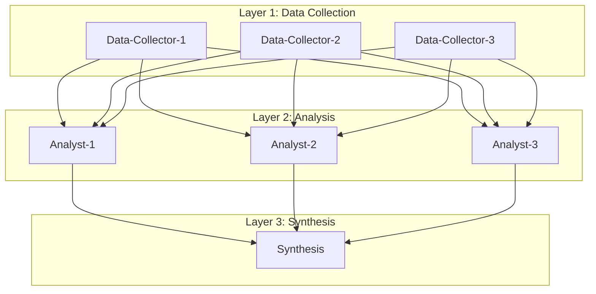

```python
from swarms import Agent, GraphWorkflow

# Layer 1: Data Collection (parallel)
data_collector_1 = Agent(
    agent_name="Data-Collector-1",
    model_name="gpt-4o-mini",
    max_loops=1,
)

data_collector_2 = Agent(
    agent_name="Data-Collector-2",
    model_name="gpt-4o-mini",
    max_loops=1,
)

data_collector_3 = Agent(
    agent_name="Data-Collector-3",
    model_name="gpt-4o-mini",
    max_loops=1,
)

# Layer 2: Analysis (parallel, depends on Layer 1)
analyst_1 = Agent(
    agent_name="Analyst-1",
    model_name="gpt-4o-mini",
    max_loops=1,
)

analyst_2 = Agent(
    agent_name="Analyst-2",
    model_name="gpt-4o-mini",
    max_loops=1,
)

analyst_3 = Agent(
    agent_name="Analyst-3",
    model_name="gpt-4o-mini",
    max_loops=1,
)

# Layer 3: Synthesis (depends on Layer 2)
synthesis = Agent(
    agent_name="Synthesis",
    model_name="gpt-4o-mini",
    max_loops=1,
)

workflow = GraphWorkflow(
    name="Layer-Based-Parallel-Workflow",
    backend="rustworkx",
)

all_agents = [
    data_collector_1,
    data_collector_2,
    data_collector_3,
    analyst_1,
    analyst_2,
    analyst_3,
    synthesis,
]

for agent in all_agents:
    workflow.add_node(agent)

# Layer 1 -> Layer 2: Full mesh connection
workflow.add_parallel_chain(
    [data_collector_1, data_collector_2, data_collector_3],
    [analyst_1, analyst_2, analyst_3],
)

# Layer 2 -> Layer 3: Convergence
workflow.add_edges_to_target(
    [analyst_1, analyst_2, analyst_3],
    synthesis,
)

results = workflow.run("Process and analyze data in parallel layers")
```

**Use Case**: Pipeline processing, multi-stage analysis, batch processing workflows.

## Majority Voting Patterns

### Simple Majority Vote

Multiple agents vote on a decision, with a majority vote aggregator.

**Architecture Diagram:**

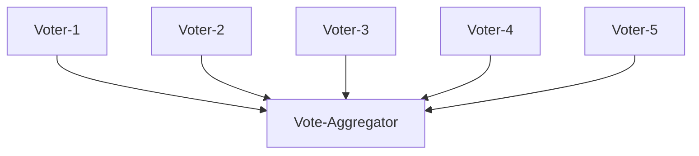

```python
from swarms import Agent, GraphWorkflow

# Voting agents
voter_1 = Agent(
    agent_name="Voter-1",
    agent_description="Provides vote/opinion 1",
    model_name="gpt-4o-mini",
    max_loops=1,
)

voter_2 = Agent(
    agent_name="Voter-2",
    agent_description="Provides vote/opinion 2",
    model_name="gpt-4o-mini",
    max_loops=1,
)

voter_3 = Agent(
    agent_name="Voter-3",
    agent_description="Provides vote/opinion 3",
    model_name="gpt-4o-mini",
    max_loops=1,
)

voter_4 = Agent(
    agent_name="Voter-4",
    agent_description="Provides vote/opinion 4",
    model_name="gpt-4o-mini",
    max_loops=1,
)

voter_5 = Agent(
    agent_name="Voter-5",
    agent_description="Provides vote/opinion 5",
    model_name="gpt-4o-mini",
    max_loops=1,
)

# Vote aggregator (implements majority voting logic)
vote_aggregator = Agent(
    agent_name="Vote-Aggregator",
    agent_description="Aggregates votes and determines majority decision",
    system_prompt="""You are a vote aggregator. Analyze all the votes/opinions provided 
    and determine the majority consensus. Provide a clear summary of the majority decision.""",
    model_name="gpt-4o-mini",
    max_loops=1,
)

workflow = GraphWorkflow(
    name="Majority-Voting-Workflow",
    backend="rustworkx",
)

all_agents = [voter_1, voter_2, voter_3, voter_4, voter_5, vote_aggregator]

for agent in all_agents:
    workflow.add_node(agent)

# All voters -> Aggregator
workflow.add_edges_to_target(
    [voter_1, voter_2, voter_3, voter_4, voter_5],
    vote_aggregator,
)

results = workflow.run(
    "Should we invest in renewable energy stocks? Provide your vote and reasoning."
)
```

**Use Case**: Decision making, consensus building, quality assurance, validation.

### Weighted Majority Vote

Similar to simple majority vote but with weighted voters.

**Architecture Diagram:**

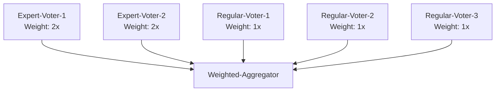

```python
from swarms import Agent, GraphWorkflow

# Expert voters (higher weight)
expert_voter_1 = Agent(
    agent_name="Expert-Voter-1",
    agent_description="Senior expert with high weight",
    model_name="gpt-4o-mini",
    max_loops=1,
)

expert_voter_2 = Agent(
    agent_name="Expert-Voter-2",
    agent_description="Senior expert with high weight",
    model_name="gpt-4o-mini",
    max_loops=1,
)

# Regular voters (standard weight)
regular_voter_1 = Agent(
    agent_name="Regular-Voter-1",
    agent_description="Regular voter",
    model_name="gpt-4o-mini",
    max_loops=1,
)

regular_voter_2 = Agent(
    agent_name="Regular-Voter-2",
    agent_description="Regular voter",
    model_name="gpt-4o-mini",
    max_loops=1,
)

regular_voter_3 = Agent(
    agent_name="Regular-Voter-3",
    agent_description="Regular voter",
    model_name="gpt-4o-mini",
    max_loops=1,
)

# Weighted aggregator
weighted_aggregator = Agent(
    agent_name="Weighted-Aggregator",
    agent_description="Aggregates votes with expert weighting",
    system_prompt="""You are a weighted vote aggregator. Expert voters (Expert-Voter-1, Expert-Voter-2) 
    have 2x weight compared to regular voters. Analyze all votes and determine the weighted majority decision.""",
    model_name="gpt-4o-mini",
    max_loops=1,
)

workflow = GraphWorkflow(
    name="Weighted-Majority-Voting-Workflow",
    backend="rustworkx",
)

all_agents = [
    expert_voter_1,
    expert_voter_2,
    regular_voter_1,
    regular_voter_2,
    regular_voter_3,
    weighted_aggregator,
]

for agent in all_agents:
    workflow.add_node(agent)

# All voters -> Weighted aggregator
workflow.add_edges_to_target(
    [
        expert_voter_1,
        expert_voter_2,
        regular_voter_1,
        regular_voter_2,
        regular_voter_3,
    ],
    weighted_aggregator,
)

results = workflow.run(
    "Evaluate a business proposal. Experts should provide detailed analysis, regular voters provide standard evaluation."
)
```

## Fan-Out/Fan-In Patterns

### Simple Fan-Out

One source agent distributes work to multiple target agents.

**Architecture Diagram:**

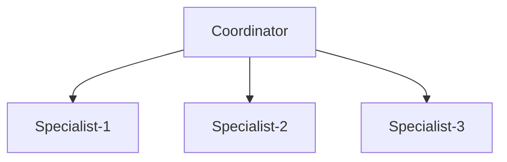

```python
from swarms import Agent, GraphWorkflow

# Source agent
coordinator = Agent(
    agent_name="Coordinator",
    agent_description="Distributes tasks to specialists",
    model_name="gpt-4o-mini",
    max_loops=1,
)

# Target agents (specialists)
specialist_1 = Agent(
    agent_name="Specialist-1",
    agent_description="Technical specialist",
    model_name="gpt-4o-mini",
    max_loops=1,
)

specialist_2 = Agent(
    agent_name="Specialist-2",
    agent_description="Business specialist",
    model_name="gpt-4o-mini",
    max_loops=1,
)

specialist_3 = Agent(
    agent_name="Specialist-3",
    agent_description="Financial specialist",
    model_name="gpt-4o-mini",
    max_loops=1,
)

workflow = GraphWorkflow(
    name="Fan-Out-Workflow",
    backend="rustworkx",
)

for agent in [coordinator, specialist_1, specialist_2, specialist_3]:
    workflow.add_node(agent)

# Fan-out: One source to multiple targets
workflow.add_edges_from_source(
    coordinator,
    [specialist_1, specialist_2, specialist_3],
)

results = workflow.run("Analyze a startup from technical, business, and financial perspectives")
```

**Use Case**: Task distribution, parallel specialization, workload splitting.

### Simple Fan-In

Multiple source agents converge to a single target agent.

**Architecture Diagram:**

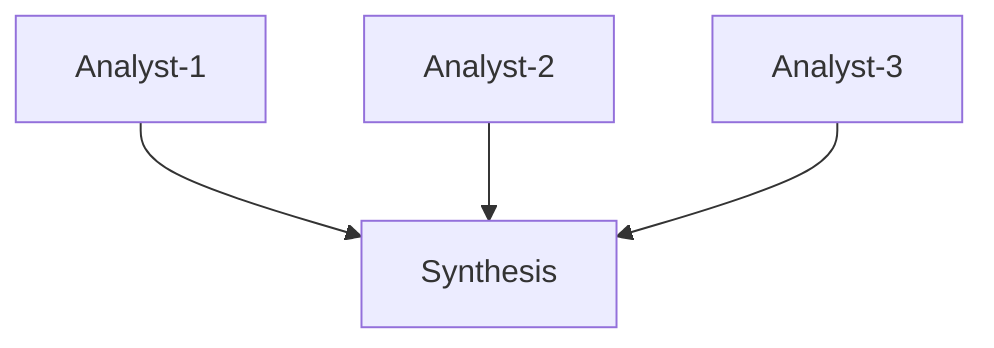

```python
from swarms import Agent, GraphWorkflow

# Source agents
analyst_1 = Agent(
    agent_name="Analyst-1",
    agent_description="Technical analyst",
    model_name="gpt-4o-mini",
    max_loops=1,
)

analyst_2 = Agent(
    agent_name="Analyst-2",
    agent_description="Market analyst",
    model_name="gpt-4o-mini",
    max_loops=1,
)

analyst_3 = Agent(
    agent_name="Analyst-3",
    agent_description="Financial analyst",
    model_name="gpt-4o-mini",
    max_loops=1,
)

# Target agent (synthesis)
synthesis = Agent(
    agent_name="Synthesis",
    agent_description="Synthesizes all analyses",
    model_name="gpt-4o-mini",
    max_loops=1,
)

workflow = GraphWorkflow(
    name="Fan-In-Workflow",
    backend="rustworkx",
)

for agent in [analyst_1, analyst_2, analyst_3, synthesis]:
    workflow.add_node(agent)

# Fan-in: Multiple sources to one target
workflow.add_edges_to_target(
    [analyst_1, analyst_2, analyst_3],
    synthesis,
)

results = workflow.run("Provide comprehensive analysis from multiple perspectives")
```

**Use Case**: Result aggregation, synthesis, convergence of parallel work.

### Fan-Out Followed by Fan-In

A common pattern: distribute work, then aggregate results.

**Architecture Diagram:**

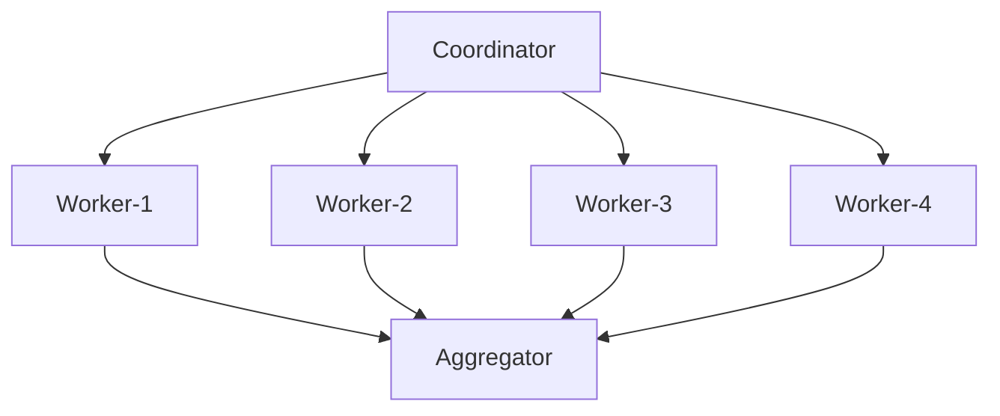

```python
from swarms import Agent, GraphWorkflow

# Initial coordinator
coordinator = Agent(
    agent_name="Coordinator",
    model_name="gpt-4o-mini",
    max_loops=1,
)

# Parallel workers
worker_1 = Agent(
    agent_name="Worker-1",
    model_name="gpt-4o-mini",
    max_loops=1,
)

worker_2 = Agent(
    agent_name="Worker-2",
    model_name="gpt-4o-mini",
    max_loops=1,
)

worker_3 = Agent(
    agent_name="Worker-3",
    model_name="gpt-4o-mini",
    max_loops=1,
)

worker_4 = Agent(
    agent_name="Worker-4",
    model_name="gpt-4o-mini",
    max_loops=1,
)

# Final aggregator
aggregator = Agent(
    agent_name="Aggregator",
    model_name="gpt-4o-mini",
    max_loops=1,
)

workflow = GraphWorkflow(
    name="Fan-Out-Fan-In-Workflow",
    backend="rustworkx",
)

all_agents = [
    coordinator,
    worker_1,
    worker_2,
    worker_3,
    worker_4,
    aggregator,
]

for agent in all_agents:
    workflow.add_node(agent)

# Fan-out: Coordinator -> Workers
workflow.add_edges_from_source(
    coordinator,
    [worker_1, worker_2, worker_3, worker_4],
)

# Fan-in: Workers -> Aggregator
workflow.add_edges_to_target(
    [worker_1, worker_2, worker_3, worker_4],
    aggregator,
)

results = workflow.run("Distribute research tasks and synthesize results")
```

**Use Case**: Map-reduce patterns, parallel processing with aggregation, distributed analysis.

## Sequential Patterns

### Linear Chain

Simple sequential execution where each agent depends on the previous one.

**Architecture Diagram:**

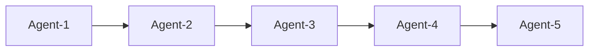

```python
from swarms import Agent, GraphWorkflow

agents = [
    Agent(
        agent_name=f"Agent-{i+1}",
        model_name="gpt-4o-mini",
        max_loops=1,
    )
    for i in range(5)
]

workflow = GraphWorkflow(
    name="Linear-Chain-Workflow",
    backend="rustworkx",
)

for agent in agents:
    workflow.add_node(agent)

# Create linear chain
for i in range(len(agents) - 1):
    workflow.add_edge(agents[i], agents[i + 1])

results = workflow.run("Process data through a linear pipeline")
```

### Sequential with Branching

Sequential flow with conditional branching.

**Architecture Diagram:**

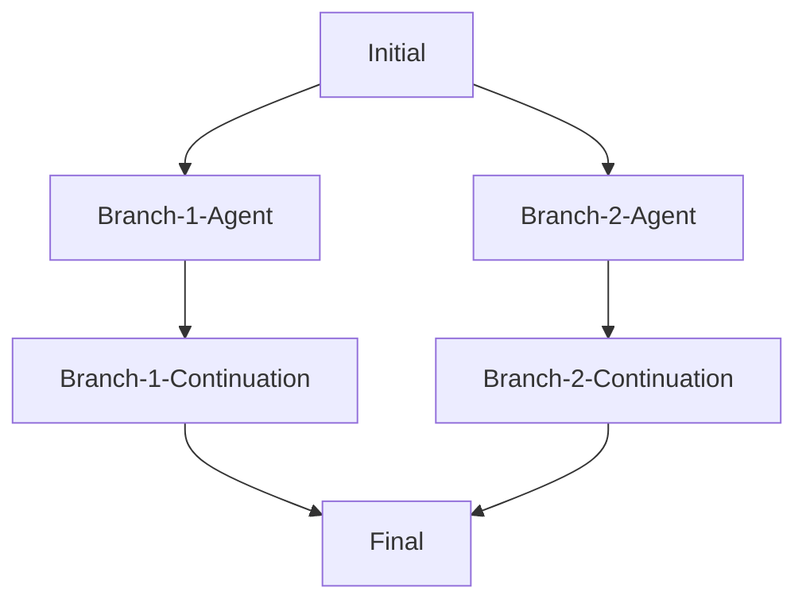

```python
from swarms import Agent, GraphWorkflow

# Initial agent
initial = Agent(
    agent_name="Initial",
    model_name="gpt-4o-mini",
    max_loops=1,
)

# Branch 1
branch_1_agent = Agent(
    agent_name="Branch-1-Agent",
    model_name="gpt-4o-mini",
    max_loops=1,
)

branch_1_continuation = Agent(
    agent_name="Branch-1-Continuation",
    model_name="gpt-4o-mini",
    max_loops=1,
)

# Branch 2
branch_2_agent = Agent(
    agent_name="Branch-2-Agent",
    model_name="gpt-4o-mini",
    max_loops=1,
)

branch_2_continuation = Agent(
    agent_name="Branch-2-Continuation",
    model_name="gpt-4o-mini",
    max_loops=1,
)

# Convergence
final = Agent(
    agent_name="Final",
    model_name="gpt-4o-mini",
    max_loops=1,
)

workflow = GraphWorkflow(
    name="Sequential-Branching-Workflow",
    backend="rustworkx",
)

all_agents = [
    initial,
    branch_1_agent,
    branch_1_continuation,
    branch_2_agent,
    branch_2_continuation,
    final,
]

for agent in all_agents:
    workflow.add_node(agent)

# Initial -> Branches
workflow.add_edge(initial, branch_1_agent)
workflow.add_edge(initial, branch_2_agent)

# Branch continuations
workflow.add_edge(branch_1_agent, branch_1_continuation)
workflow.add_edge(branch_2_agent, branch_2_continuation)

# Convergence
workflow.add_edge(branch_1_continuation, final)
workflow.add_edge(branch_2_continuation, final)

results = workflow.run("Process through branching paths")
```

## Advanced Patterns

### Pipeline with Validation

Sequential pipeline with validation checkpoints.

**Architecture Diagram:**

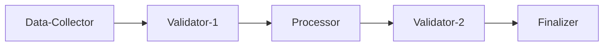

```python
from swarms import Agent, GraphWorkflow

# Pipeline stages
data_collector = Agent(
    agent_name="Data-Collector",
    model_name="gpt-4o-mini",
    max_loops=1,
)

validator_1 = Agent(
    agent_name="Validator-1",
    agent_description="Validates data quality",
    model_name="gpt-4o-mini",
    max_loops=1,
)

processor = Agent(
    agent_name="Processor",
    model_name="gpt-4o-mini",
    max_loops=1,
)

validator_2 = Agent(
    agent_name="Validator-2",
    agent_description="Validates processing results",
    model_name="gpt-4o-mini",
    max_loops=1,
)

finalizer = Agent(
    agent_name="Finalizer",
    model_name="gpt-4o-mini",
    max_loops=1,
)

workflow = GraphWorkflow(
    name="Pipeline-With-Validation",
    backend="rustworkx",
)

for agent in [data_collector, validator_1, processor, validator_2, finalizer]:
    workflow.add_node(agent)

# Sequential pipeline with validation checkpoints
workflow.add_edge(data_collector, validator_1)
workflow.add_edge(validator_1, processor)
workflow.add_edge(processor, validator_2)
workflow.add_edge(validator_2, finalizer)

results = workflow.run("Process data with quality checkpoints")
```

### Multi-Stage Review Process

Multiple review stages before final approval.

**Architecture Diagram:**

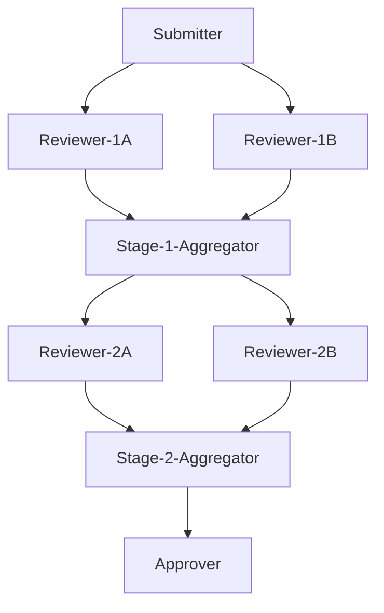

```python
from swarms import Agent, GraphWorkflow

# Initial submission
submitter = Agent(
    agent_name="Submitter",
    model_name="gpt-4o-mini",
    max_loops=1,
)

# Review stage 1 (parallel reviewers)
reviewer_1a = Agent(
    agent_name="Reviewer-1A",
    model_name="gpt-4o-mini",
    max_loops=1,
)

reviewer_1b = Agent(
    agent_name="Reviewer-1B",
    model_name="gpt-4o-mini",
    max_loops=1,
)

# Stage 1 aggregator
stage_1_aggregator = Agent(
    agent_name="Stage-1-Aggregator",
    model_name="gpt-4o-mini",
    max_loops=1,
)

# Review stage 2
reviewer_2a = Agent(
    agent_name="Reviewer-2A",
    model_name="gpt-4o-mini",
    max_loops=1,
)

reviewer_2b = Agent(
    agent_name="Reviewer-2B",
    model_name="gpt-4o-mini",
    max_loops=1,
)

# Stage 2 aggregator
stage_2_aggregator = Agent(
    agent_name="Stage-2-Aggregator",
    model_name="gpt-4o-mini",
    max_loops=1,
)

# Final approver
approver = Agent(
    agent_name="Approver",
    model_name="gpt-4o-mini",
    max_loops=1,
)

workflow = GraphWorkflow(
    name="Multi-Stage-Review",
    backend="rustworkx",
)

all_agents = [
    submitter,
    reviewer_1a,
    reviewer_1b,
    stage_1_aggregator,
    reviewer_2a,
    reviewer_2b,
    stage_2_aggregator,
    approver,
]

for agent in all_agents:
    workflow.add_node(agent)

# Stage 1: Parallel review
workflow.add_edge(submitter, reviewer_1a)
workflow.add_edge(submitter, reviewer_1b)
workflow.add_edges_to_target([reviewer_1a, reviewer_1b], stage_1_aggregator)

# Stage 2: Parallel review
workflow.add_edge(stage_1_aggregator, reviewer_2a)
workflow.add_edge(stage_1_aggregator, reviewer_2b)
workflow.add_edges_to_target([reviewer_2a, reviewer_2b], stage_2_aggregator)

# Final approval
workflow.add_edge(stage_2_aggregator, approver)

results = workflow.run("Review and approve a proposal through multiple stages")
```

### Circular/Iterative Pattern

Agents form a cycle for iterative refinement.

**Architecture Diagram:**

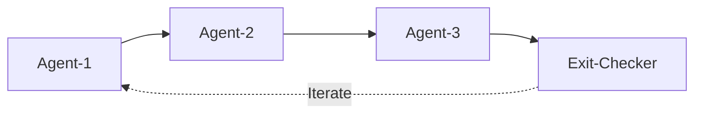

```python
from swarms import Agent, GraphWorkflow

# Create iterative refinement agents
agent_1 = Agent(
    agent_name="Agent-1",
    agent_description="First refinement stage",
    model_name="gpt-4o-mini",
    max_loops=1,
)

agent_2 = Agent(
    agent_name="Agent-2",
    agent_description="Second refinement stage",
    model_name="gpt-4o-mini",
    max_loops=1,
)

agent_3 = Agent(
    agent_name="Agent-3",
    agent_description="Third refinement stage",
    model_name="gpt-4o-mini",
    max_loops=1,
)

# Exit condition checker
exit_checker = Agent(
    agent_name="Exit-Checker",
    agent_description="Checks if refinement is complete",
    model_name="gpt-4o-mini",
    max_loops=1,
)

workflow = GraphWorkflow(
    name="Iterative-Refinement",
    backend="rustworkx",
    max_loops=3,  # Limit iterations
)

for agent in [agent_1, agent_2, agent_3, exit_checker]:
    workflow.add_node(agent)

# Circular refinement
workflow.add_edge(agent_1, agent_2)
workflow.add_edge(agent_2, agent_3)
workflow.add_edge(agent_3, exit_checker)
# Note: For true iteration, you'd need to add edge back to agent_1
# This is a simplified example

results = workflow.run("Iteratively refine a document")
```

### Star Pattern

Central hub agent coordinates with multiple spoke agents.

**Architecture Diagram:**

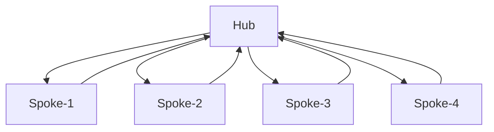

```python
from swarms import Agent, GraphWorkflow

# Central hub
hub = Agent(
    agent_name="Hub",
    agent_description="Central coordinator",
    model_name="gpt-4o-mini",
    max_loops=1,
)

# Spoke agents
spoke_1 = Agent(
    agent_name="Spoke-1",
    model_name="gpt-4o-mini",
    max_loops=1,
)

spoke_2 = Agent(
    agent_name="Spoke-2",
    model_name="gpt-4o-mini",
    max_loops=1,
)

spoke_3 = Agent(
    agent_name="Spoke-3",
    model_name="gpt-4o-mini",
    max_loops=1,
)

spoke_4 = Agent(
    agent_name="Spoke-4",
    model_name="gpt-4o-mini",
    max_loops=1,
)

workflow = GraphWorkflow(
    name="Star-Pattern-Workflow",
    backend="rustworkx",
)

for agent in [hub, spoke_1, spoke_2, spoke_3, spoke_4]:
    workflow.add_node(agent)

# Hub -> Spokes (fan-out)
workflow.add_edges_from_source(
    hub,
    [spoke_1, spoke_2, spoke_3, spoke_4],
)

# Spokes -> Hub (fan-in)
workflow.add_edges_to_target(
    [spoke_1, spoke_2, spoke_3, spoke_4],
    hub,
)

results = workflow.run("Coordinate work through a central hub")
```

## Performance Optimization

### Compilation Best Practices

Always compile workflows before execution for optimal performance:

```python
workflow = GraphWorkflow(
    name="Optimized-Workflow",
    backend="rustworkx",
    auto_compile=True,  # Automatic compilation
)

# Or manually compile
workflow.compile()

# Check compilation status
status = workflow.get_compilation_status()
print(f"Compiled: {status['is_compiled']}")
print(f"Layers: {status['cached_layers_count']}")
```

### Large-Scale Workflow Tips

For workflows with 100+ agents:

1. **Use rustworkx backend** for better performance
2. **Compile before execution** to cache topological layers
3. **Use parallel patterns** to maximize throughput
4. **Monitor compilation status** to ensure optimization

```python
# Large-scale workflow example
workflow = GraphWorkflow(
    name="Large-Scale-Workflow",
    backend="rustworkx",  # Essential for large graphs
    auto_compile=True,
    verbose=True,  # Monitor performance
)

# Add many agents...
# Use parallel patterns for efficiency

# Check performance
status = workflow.get_compilation_status()
print(f"Max workers: {status['max_workers']}")
print(f"Layers: {status['cached_layers_count']}")
```

### Visualization for Debugging

Visualize workflows to understand structure and optimize:

```python
# Generate visualization
output_file = workflow.visualize(
    format="png",
    show_summary=True,  # Shows parallel patterns
    view=True,
)

# Or simple text visualization
workflow.visualize_simple()
```

## Conclusion

GraphWorkflow with rustworkx backend provides a powerful framework for implementing complex multi-agent patterns. Key takeaways:

1. **Choose the right pattern** for your use case
2. **Use rustworkx** for large-scale workflows (100+ nodes)
3. **Leverage parallel patterns** for performance
4. **Compile workflows** before execution
5. **Visualize** to understand and debug workflows

For more examples, see the [rustworkx examples directory](https://github.com/kyegomez/swarms/tree/master/examples/multi_agent/graphworkflow_examples/rustworkx_examples).
