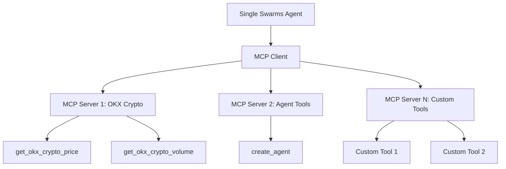

# Multi-MCP Agent Integration

This guide demonstrates how to use multiple MCP (Model Context Protocol) servers with a single Swarms agent, enabling powerful tool orchestration and cross-server functionality.

## Overview

The Multi-MCP integration allows a single agent to access tools from multiple MCP servers simultaneously. This is particularly useful when you need to combine different capabilities, such as:

- **Financial data** from crypto exchanges
- **Agent creation** tools for dynamic agent spawning
- **Custom business logic** from specialized servers
- **External APIs** through dedicated MCP servers

## Architecture



## Setup

### 1. Install Dependencies

```bash
pip install swarms mcp requests
```

### 2. Create MCP Servers

#### OKX Crypto Server (`okx_crypto_server.py`)

```python
from mcp.server.fastmcp import FastMCP
import requests

mcp = FastMCP("OKXCryptoPrice")
mcp.settings.port = 8001

@mcp.tool(
    name="get_okx_crypto_price",
    description="Get the current price and basic information for a given cryptocurrency from OKX exchange.",
)
def get_okx_crypto_price(symbol: str) -> str:
    """
    Get the current price and basic information for a given cryptocurrency using OKX API.

    Args:
        symbol (str): The cryptocurrency trading pair (e.g., 'BTC-USDT', 'ETH-USDT')

    Returns:
        str: A formatted string containing the cryptocurrency information
    """
    try:
        if not symbol:
            return "Please provide a valid trading pair (e.g., 'BTC-USDT')"

        # Convert to uppercase and ensure proper format
        symbol = symbol.upper()
        if not symbol.endswith("-USDT"):
            symbol = f"{symbol}-USDT"

        # OKX API endpoint for ticker information
        url = f"https://www.okx.com/api/v5/market/ticker?instId={symbol}"

        # Make the API request
        response = requests.get(url)
        response.raise_for_status()

        data = response.json()

        if data.get("code") != "0":
            return f"Error: {data.get('msg', 'Unknown error')}"

        ticker_data = data.get("data", [{}])[0]
        if not ticker_data:
            return f"Could not find data for {symbol}. Please check the trading pair."

        price = float(ticker_data.get("last", 0))
        change_percent = float(ticker_data.get("change24h", 0))

        base_currency = symbol.split("-")[0]
        return f"Current price of {base_currency}/USDT: ${price:,.2f}\n24h Change: {change_percent:.2f}%"

    except requests.exceptions.RequestException as e:
        return f"Error fetching OKX data: {str(e)}"
    except Exception as e:
        return f"Error: {str(e)}"

@mcp.tool(
    name="get_okx_crypto_volume",
    description="Get the 24-hour trading volume for a given cryptocurrency from OKX exchange.",
)
def get_okx_crypto_volume(symbol: str) -> str:
    """
    Get the 24-hour trading volume for a given cryptocurrency using OKX API.

    Args:
        symbol (str): The cryptocurrency trading pair (e.g., 'BTC-USDT', 'ETH-USDT')

    Returns:
        str: A formatted string containing the trading volume information
    """
    try:
        if not symbol:
            return "Please provide a valid trading pair (e.g., 'BTC-USDT')"

        # Convert to uppercase and ensure proper format
        symbol = symbol.upper()
        if not symbol.endswith("-USDT"):
            symbol = f"{symbol}-USDT"

        # OKX API endpoint for ticker information
        url = f"https://www.okx.com/api/v5/market/ticker?instId={symbol}"

        # Make the API request
        response = requests.get(url)
        response.raise_for_status()

        data = response.json()

        if data.get("code") != "0":
            return f"Error: {data.get('msg', 'Unknown error')}"

        ticker_data = data.get("data", [{}])[0]
        if not ticker_data:
            return f"Could not find data for {symbol}. Please check the trading pair."

        volume_24h = float(ticker_data.get("vol24h", 0))
        base_currency = symbol.split("-")[0]
        return f"24h Trading Volume for {base_currency}/USDT: ${volume_24h:,.2f}"

    except requests.exceptions.RequestException as e:
        return f"Error fetching OKX data: {str(e)}"
    except Exception as e:
        return f"Error: {str(e)}"

if __name__ == "__main__":
    mcp.run(transport="streamable-http")
```

#### Agent Tools Server (`mcp_agent_tool.py`)

```python
from mcp.server.fastmcp import FastMCP
from swarms import Agent

mcp = FastMCP("MCPAgentTool")

@mcp.tool(
    name="create_agent",
    description="Create an agent with the specified name, system prompt, and model, then run a task.",
)
def create_agent(
    agent_name: str, system_prompt: str, model_name: str, task: str
) -> str:
    """
    Create an agent with the given parameters and execute the specified task.

    Args:
        agent_name (str): The name of the agent to create.
        system_prompt (str): The system prompt to initialize the agent with.
        model_name (str): The model name to use for the agent.
        task (str): The task for the agent to perform.

    Returns:
        str: The result of the agent running the given task.
    """
    agent = Agent(
        agent_name=agent_name,
        system_prompt=system_prompt,
        model_name=model_name,
    )
    return agent.run(task)

if __name__ == "__main__":
    mcp.run(transport="streamable-http")
```

### 3. Start MCP Servers

Start each MCP server in separate terminals:

```bash
# Terminal 1 - OKX Crypto Server
python okx_crypto_server.py

# Terminal 2 - Agent Tools Server  
python mcp_agent_tool.py
```

## Usage Examples

### Basic Multi-MCP Agent

```python
from swarms import Agent
from swarms.prompts.finance_agent_sys_prompt import (
    FINANCIAL_AGENT_SYS_PROMPT,
)

# Initialize the agent with multiple MCP servers
agent = Agent(
    agent_name="Financial-Analysis-Agent",
    agent_description="Personal finance advisor agent",
    system_prompt=FINANCIAL_AGENT_SYS_PROMPT,
    max_loops=1,
    mcp_urls=[
        "http://0.0.0.0:8001/mcp",  # OKX Crypto Server
        "http://0.0.0.0:8000/mcp",  # Agent Tools Server
    ],
    model_name="gpt-4o-mini",
    output_type="all",
)

# Use tools from multiple servers
result = agent.run(
    "Get the current price of Bitcoin and then create a new agent to analyze the market trends"
)
print(result)
```

### Advanced Multi-MCP Workflow

```python
from swarms import Agent

# Custom system prompt for multi-tool coordination
MULTI_MCP_SYSTEM_PROMPT = """
You are a sophisticated financial analysis agent with access to multiple tools:

1. OKX Crypto Tools:
   - get_okx_crypto_price: Get current cryptocurrency prices
   - get_okx_crypto_volume: Get 24h trading volumes

2. Agent Creation Tools:
   - create_agent: Create specialized agents for specific tasks

Use these tools strategically to provide comprehensive financial analysis.
When creating agents, ensure they have specific, focused tasks.
"""

agent = Agent(
    agent_name="Multi-MCP-Financial-Agent",
    system_prompt=MULTI_MCP_SYSTEM_PROMPT,
    mcp_urls=[
        "http://0.0.0.0:8001/mcp",  # OKX Crypto
        "http://0.0.0.0:8000/mcp",  # Agent Tools
    ],
    model_name="gpt-4o-mini",
    max_loops=3,
)

# Complex multi-step analysis
result = agent.run("""
1. Get the current price and volume for Bitcoin, Ethereum, and Solana
2. Create a technical analysis agent to analyze these prices
3. Create a market sentiment agent to provide additional insights
4. Summarize the findings from all agents
""")

print(result)
```

## Configuration Options

### MCP URL Configuration

```python
# Multiple MCP servers
mcp_urls = [
    "http://localhost:8000/mcp",  # Server 1
    "http://localhost:8001/mcp",  # Server 2
    "http://localhost:8002/mcp",  # Server 3
    # Add more servers as needed
]

agent = Agent(
    mcp_urls=mcp_urls,
    # ... other parameters
)
```

### Error Handling

```python
from swarms import Agent

agent = Agent(
    agent_name="Robust-Multi-MCP-Agent",
    mcp_urls=[
        "http://0.0.0.0:8001/mcp",
        "http://0.0.0.0:8000/mcp",
    ],
    model_name="gpt-4o-mini",
    max_loops=1,
    # The agent will gracefully handle MCP server failures
    # and continue with available tools
)

try:
    result = agent.run("Use available tools to analyze the market")
    print(result)
except Exception as e:
    print(f"Error: {e}")
```

## Best Practices

### 1. Server Organization

- **Dedicated servers**: Create separate MCP servers for different domains (finance, data processing, etc.)
- **Port management**: Use different ports for each server to avoid conflicts
- **Error isolation**: If one server fails, others continue to work

### 2. Tool Naming

- Use descriptive, unique tool names across servers
- Avoid naming conflicts between different MCP servers
- Include server context in tool descriptions

### 3. System Prompts

- Clearly document available tools from each server
- Provide guidance on when to use which tools
- Include error handling instructions

### 4. Performance Optimization

- Start with essential servers first
- Use connection pooling for multiple servers
- Monitor server health and response times

## Troubleshooting

### Common Issues

1. **Connection Refused**: Ensure MCP servers are running on correct ports
2. **Tool Not Found**: Check tool names and server availability
3. **Timeout Errors**: Increase timeout settings for slow servers
4. **Authentication**: Some servers may require API keys


## Conclusion

Multi-MCP integration provides powerful capabilities for creating sophisticated agents that can leverage tools from multiple specialized servers. This approach enables:

- **Modularity**: Separate concerns into different MCP servers
- **Scalability**: Add new capabilities without modifying existing code
- **Reliability**: Fault tolerance through multiple server support
- **Flexibility**: Mix and match tools from different domains

By following the patterns and best practices outlined in this guide, you can build robust, multi-capability agents that can handle complex, multi-step tasks across different domains.
