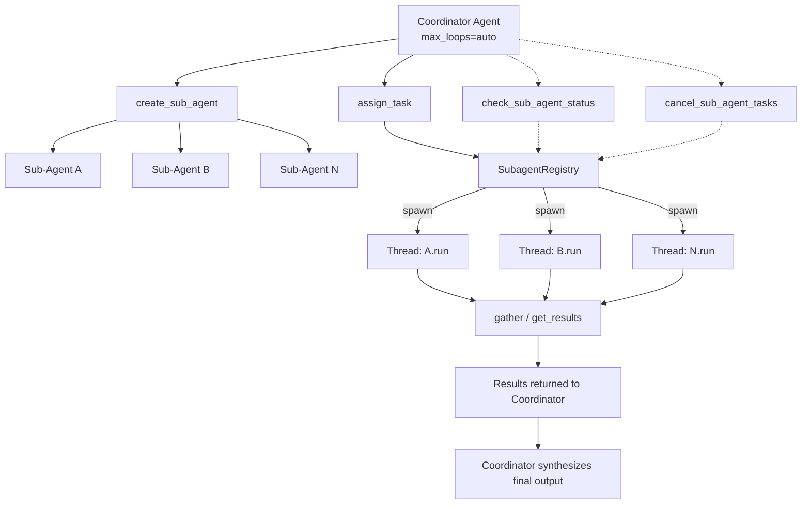
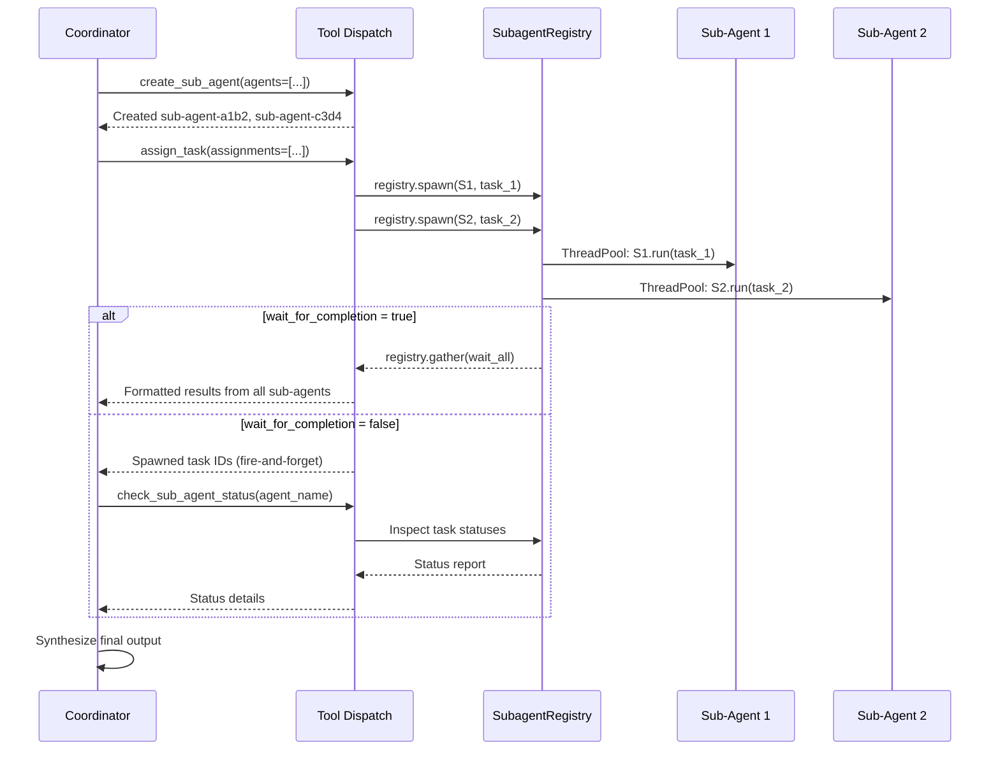

# Sub-Agent Delegation

Sub-agent delegation enables an autonomous agent to dynamically create specialized child agents, dispatch tasks to them concurrently, and aggregate results — all at runtime. When an agent runs with `max_loops="auto"`, it gains access to a suite of sub-agent tools that let the LLM orchestrate parallel workstreams without any manual wiring.

| Feature | Description |
|---------|-------------|
| **Parallel Execution** | Sub-agents run concurrently in background threads via a `ThreadPoolExecutor` |
| **Dynamic Specialization** | Each sub-agent gets its own name, description, and optional system prompt |
| **Async Task Registry** | A per-agent `SubagentRegistry` tracks every spawned task with status, retries, and timing |
| **Fire-and-Forget Mode** | Dispatch tasks without blocking, then poll status or cancel later |
| **Retry Policies** | Configurable retry count and exception-type filtering per task |
| **Depth-Limited Recursion** | Prevents infinite nesting with a configurable `max_subagent_depth` (default 3) |
| **Agent Reuse** | Sub-agents are cached by ID and can be assigned multiple tasks across the session |

## Architecture



## How It Works

Sub-agent delegation runs in three phases inside the autonomous loop:



### Phase 1: Create Sub-Agents

The coordinator calls the `create_sub_agent` tool to spawn specialized agents. Each sub-agent:

- Inherits the parent's `model_name`
- Runs with `max_loops=1` (single-pass execution)
- Gets a unique ID in the format `sub-agent-{uuid_hex[:8]}`
- Is cached in `agent.sub_agents` for reuse across multiple task assignments

### Phase 2: Assign Tasks

The coordinator calls the `assign_task` tool to dispatch work. Behind the scenes:

1. `_find_registry(agent)` lazily creates a `SubagentRegistry` (stored as `agent._subagent_registry`)
2. For each assignment, `registry.spawn()` submits the sub-agent's `.run()` call to a `ThreadPoolExecutor`
3. A `SubagentTask` dataclass tracks each task's status, result, errors, retries, and timing

Two execution modes are available:

- **Wait mode** (`wait_for_completion=true`, default): Calls `registry.gather(strategy="wait_all")`, blocks until all tasks finish, and returns formatted results
- **Fire-and-forget** (`wait_for_completion=false`): Returns immediately with spawned task IDs for later polling

### Phase 3: Aggregate Results

All results are added to the coordinator's `short_memory`, giving the LLM full context to synthesize a final output.

## Prerequisites

```bash
pip install -U swarms
```

Set your API key for the model provider you intend to use:

```python
import os
os.environ["OPENAI_API_KEY"] = "your-api-key"
```

## Quick Start

```python
from swarms.structs.agent import Agent

coordinator = Agent(
    agent_name="Research-Coordinator",
    agent_description="Coordinates parallel research across multiple domains",
    model_name="gpt-4.1",
    max_loops="auto",
    interactive=False,
)

task = """
Research three topics in parallel:
1. Latest trends in artificial intelligence
2. Recent quantum computing breakthroughs
3. Advances in renewable energy

Create a sub-agent for each topic, assign research tasks to them,
and compile a comprehensive summary of all findings.
"""

result = coordinator.run(task)
print(result)
```

When this runs, the coordinator autonomously:

1. Plans the overall task
2. Calls `create_sub_agent` to create three specialized agents
3. Calls `assign_task` to dispatch research tasks concurrently
4. Receives aggregated results
5. Synthesizes a final comprehensive report

## Tool Reference

All four sub-agent tools are available when `max_loops="auto"`. You can control tool availability with the `selected_tools` parameter — set it to `"all"` (default) or pass a list of specific tool names.

### create_sub_agent

Creates one or more sub-agents and caches them on the coordinator.

**Parameters:**

| Parameter | Type | Required | Description |
|-----------|------|----------|-------------|
| `agents` | array | Yes | List of sub-agent specifications (see fields below) |

**Fields for each item in `agents`:**

| Field | Type | Required | Description |
|-------|------|----------|-------------|
| `agent_name` | string | Yes | Descriptive name for the sub-agent |
| `agent_description` | string | Yes | Role and capabilities of the sub-agent |
| `system_prompt` | string | No | Custom system prompt. If omitted, a default based on the description is used |

**What happens internally:**

For each spec, a new `Agent` is created with `id=sub-agent-{uuid.hex[:8]}`, the parent's `model_name`, `max_loops=1`, and `print_on=True`. It is stored in `agent.sub_agents[agent_id]` with keys: `agent`, `name`, `description`, `system_prompt`, `created_at`.

**Returns:** A success message listing created agents and their IDs.

### assign_task

Dispatches tasks to sub-agents for concurrent execution via the `SubagentRegistry`.

**Parameters:**

| Parameter | Type | Required | Default | Description |
|-----------|------|----------|---------|-------------|
| `assignments` | array | Yes | — | List of task assignments (see fields below) |
| `wait_for_completion` | boolean | No | `true` | Wait for all tasks or return immediately |

**Fields for each item in `assignments`:**

| Field | Type | Required | Default | Description |
|-------|------|----------|---------|-------------|
| `agent_id` | string | Yes | — | ID of the sub-agent (from `create_sub_agent` output) |
| `task` | string | Yes | — | Task description for the sub-agent |
| `task_id` | string | No | `task-{idx+1}` | User-friendly identifier for this assignment |

**What happens internally:**

1. Validates all `agent_id` values exist in `agent.sub_agents`
2. Calls `registry.spawn()` for each assignment, submitting `sub_agent.run(task)` to the thread pool
3. If `wait_for_completion=true`: calls `registry.gather(strategy="wait_all")`, then formats and returns all results
4. If `wait_for_completion=false`: returns spawned task IDs immediately

**Returns (wait mode):**

```
Completed 3 task assignment(s):

[AI-Research-Agent] Task ai-research:
Result: Recent AI trends include...

[Quantum-Research-Agent] Task quantum-research:
Result: Major quantum computing breakthroughs...

[Energy-Research-Agent] Task energy-research:
Result: Renewable energy advances...
```

**Returns (fire-and-forget mode):**

```
Dispatched 3 task(s) to sub-agents (registry async mode).
Spawned task IDs:
- [AI-Research-Agent] task-1 -> task-a1b2c3d4
- [Quantum-Research-Agent] task-2 -> task-e5f6g7h8
- [Energy-Research-Agent] task-3 -> task-i9j0k1l2
```

### check_sub_agent_status

Inspects the async task status for a sub-agent by name.

**Parameters:**

| Parameter | Type | Required | Description |
|-----------|------|----------|-------------|
| `agent_name` | string | Yes | Name of the sub-agent to inspect |

**Returns:** A status report for all tasks associated with that sub-agent:

```
Async status for sub-agent 'AI-Research-Agent':

Sub-agent: AI-Research-Agent
- Task ID: task-a1b2c3d4 | status=completed | depth=0 | retries=0/0 | duration=12.34s
```

Each task entry includes: task ID, current status (`pending`, `running`, `completed`, `failed`, `cancelled`), recursion depth, retry count, and duration.

### cancel_sub_agent_tasks

Cancels any pending or running tasks for a sub-agent by name.

**Parameters:**

| Parameter | Type | Required | Description |
|-----------|------|----------|-------------|
| `agent_name` | string | Yes | Name of the sub-agent whose tasks to cancel |

**Returns:** A summary of how many tasks were cancelled and how many were already finished.

```
Cancelled 1 async task(s) and skipped 2 already finished or non-cancellable task(s) for sub-agent 'AI-Research-Agent'.
```

!!! note
    Only tasks with status `pending` or `running` can be cancelled. Tasks that are already `completed`, `failed`, or `cancelled` are skipped.

## SubagentRegistry Reference

The `SubagentRegistry` is the execution engine behind sub-agent task management. It is lazily created per coordinator agent and stored as `agent._subagent_registry`.

```python
from swarms.structs.async_subagent import SubagentRegistry, SubagentTask, TaskStatus
```

### TaskStatus

| Value | Description |
|-------|-------------|
| `PENDING` | Task created but not yet submitted |
| `RUNNING` | Task currently executing in the thread pool |
| `COMPLETED` | Task finished successfully |
| `FAILED` | Task raised an exception after all retries exhausted |
| `CANCELLED` | Task was cancelled before completion |

### SubagentTask

Dataclass tracking a single async task:

| Field | Type | Description |
|-------|------|-------------|
| `id` | `str` | Unique task identifier (`task-{uuid_hex[:8]}`) |
| `agent` | `Any` | The `Agent` instance executing this task |
| `task_str` | `str` | The task description |
| `status` | `TaskStatus` | Current lifecycle status |
| `result` | `Any` | Return value from `agent.run()` on success |
| `error` | `Optional[Exception]` | Exception instance on failure |
| `future` | `Optional[Future]` | The `concurrent.futures.Future` handle |
| `parent_id` | `Optional[str]` | ID of the parent task (for nested sub-agents) |
| `depth` | `int` | Recursion depth (0 = top-level) |
| `retries` | `int` | Number of retries attempted so far |
| `max_retries` | `int` | Maximum retries allowed |
| `retry_on` | `Optional[List[Type[Exception]]]` | Exception types that trigger a retry |
| `created_at` | `float` | Timestamp when the task was created |
| `completed_at` | `Optional[float]` | Timestamp when the task finished |

### SubagentRegistry Methods

| Method | Parameters | Returns | Description |
|--------|------------|---------|-------------|
| `spawn()` | `agent`, `task`, `parent_id=None`, `depth=0`, `max_retries=0`, `retry_on=None`, `fail_fast=True` | `str` (task ID) | Submit a task to the thread pool |
| `get_task()` | `task_id` | `SubagentTask` | Retrieve a task by ID |
| `get_results()` | — | `Dict[str, Any]` | Collect results from all completed/failed tasks |
| `gather()` | `strategy="wait_all"`, `timeout=None` | `List[Any]` | Block until tasks complete. Strategy: `"wait_all"` or `"wait_first"` |
| `cancel()` | `task_id` | `bool` | Cancel a pending/running task |
| `shutdown()` | — | `None` | Shut down the thread pool executor |

### Constructor Parameters

| Parameter | Type | Default | Description |
|-----------|------|---------|-------------|
| `max_depth` | `int` | `3` | Maximum recursion depth for nested sub-agents |
| `max_workers` | `Optional[int]` | `None` | Thread pool size (defaults to Python's `ThreadPoolExecutor` default) |

## Examples

### Parallel Research with Wait Mode

The most common pattern — create sub-agents, assign tasks, and wait for all results:

```python
from swarms.structs.agent import Agent

coordinator = Agent(
    agent_name="Market-Research-Lead",
    agent_description="Coordinates parallel market research across sectors",
    model_name="gpt-4.1",
    max_loops="auto",
    interactive=False,
)

task = """
Analyze three market sectors in parallel:

1. Create a sub-agent named "Tech-Analyst" specializing in technology sector analysis
2. Create a sub-agent named "Healthcare-Analyst" specializing in healthcare sector analysis
3. Create a sub-agent named "Energy-Analyst" specializing in energy sector analysis

Assign each analyst a task to research:
- Current market trends and key players
- Growth projections for the next 5 years
- Major risks and opportunities

Wait for all results and compile a unified market overview report.
"""

result = coordinator.run(task)
print(result)
```

### Fire-and-Forget with Status Polling

For long-running tasks, dispatch without blocking and check status later:

```python
from swarms.structs.agent import Agent

coordinator = Agent(
    agent_name="Data-Pipeline-Manager",
    agent_description="Manages long-running data processing pipelines",
    model_name="gpt-4.1",
    max_loops="auto",
    interactive=False,
)

task = """
Process three large datasets concurrently using fire-and-forget mode:

1. Create sub-agents: "ETL-Agent-Sales", "ETL-Agent-Marketing", "ETL-Agent-Support"
2. Assign each agent a data processing task with wait_for_completion=false
3. Check the status of each sub-agent using check_sub_agent_status
4. If any agent is taking too long, cancel its tasks using cancel_sub_agent_tasks
5. Report final status of all tasks
"""

result = coordinator.run(task)
print(result)
```

### Custom System Prompts

Give sub-agents specialized instructions:

```python
from swarms.structs.agent import Agent

coordinator = Agent(
    agent_name="Content-Director",
    agent_description="Directs content creation across formats and audiences",
    model_name="gpt-4.1",
    max_loops="auto",
    interactive=False,
)

task = """
Create a content suite for a product launch:

1. Create a sub-agent named "Blog-Writer" with system_prompt:
   "You are a technical blog writer. Write in a clear, informative style
   with code examples where relevant. Target audience: developers."

2. Create a sub-agent named "Social-Media-Writer" with system_prompt:
   "You write punchy, engaging social media posts. Keep posts under
   280 characters for Twitter. Use hashtags strategically."

3. Create a sub-agent named "Email-Writer" with system_prompt:
   "You write professional marketing emails. Use a conversational
   but polished tone. Include a clear call-to-action."

Assign each agent to create content about our new AI-powered code review tool.
Compile all content into a launch package.
"""

result = coordinator.run(task)
print(result)
```

### Selective Tool Access

Restrict the coordinator to only sub-agent tools:

```python
from swarms.structs.agent import Agent

coordinator = Agent(
    agent_name="Delegation-Only-Coordinator",
    agent_description="Coordinates work purely through sub-agent delegation",
    model_name="gpt-4.1",
    max_loops="auto",
    interactive=False,
    selected_tools=[
        "create_plan",
        "think",
        "subtask_done",
        "complete_task",
        "respond_to_user",
        "create_sub_agent",
        "assign_task",
        "check_sub_agent_status",
        "cancel_sub_agent_tasks",
    ],
)

result = coordinator.run("Research AI safety approaches using sub-agents.")
print(result)
```

## Agent Configuration

These `Agent` constructor parameters control sub-agent behavior:

| Parameter | Type | Default | Description |
|-----------|------|---------|-------------|
| `max_loops` | `Union[int, str]` | `1` | Set to `"auto"` to enable autonomous mode with sub-agent tools |
| `max_subagent_depth` | `int` | `3` | Maximum recursion depth for nested sub-agent hierarchies |
| `selected_tools` | `Union[str, List[str]]` | `"all"` | Controls which autonomous loop tools are available. Set to `"all"` or a list of tool names |
| `interactive` | `bool` | `False` | Set to `False` for fully autonomous execution |
| `verbose` | `bool` | `False` | Enable detailed logging of sub-agent creation and execution |

## Best Practices

| Practice | Recommendation |
|----------|----------------|
| **Sub-agent count** | 3-5 agents is ideal for most tasks. Beyond 10, coordination overhead increases |
| **Task granularity** | Give each sub-agent a focused, self-contained task. Avoid inter-agent dependencies |
| **Naming** | Use descriptive agent names (e.g., `"Financial-Analyst"`, not `"Agent-1"`) so the coordinator can reason about delegation |
| **System prompts** | Provide custom system prompts when sub-agents need specific expertise, tone, or output format |
| **Wait vs fire-and-forget** | Use wait mode for tasks that must complete before synthesis. Use fire-and-forget for long-running tasks where you want to check progress incrementally |
| **Error handling** | The registry catches exceptions per-task. Failed tasks are reported alongside successful ones rather than crashing the coordinator |

## Troubleshooting

### Sub-agents not being created

Ensure the coordinator is running with `max_loops="auto"`. The sub-agent tools are only available in autonomous mode. Also verify that `selected_tools` includes `"create_sub_agent"` (or is set to `"all"`).

### "No sub-agents have been created" error

The `assign_task` tool requires sub-agents to exist first. The coordinator must call `create_sub_agent` before `assign_task`. If the LLM skips creation, make the task prompt explicit about creating sub-agents first.

### "Sub-agent with ID '...' not found" error

The `agent_id` in the assignment doesn't match any cached sub-agent. Sub-agent IDs are returned by `create_sub_agent` in the format `sub-agent-{hex}` (e.g., `sub-agent-a1b2c3d4`). The coordinator LLM must use the exact IDs from the creation response.

### "Subagent depth exceeds max_depth" error

A sub-agent attempted to spawn its own sub-agents beyond the allowed recursion depth. Increase `max_subagent_depth` on the coordinator agent, or restructure the task to avoid deep nesting.

### Fire-and-forget tasks never checked

When using `wait_for_completion=false`, the coordinator must explicitly call `check_sub_agent_status` to retrieve results. Make the task prompt explicit about polling for status after dispatching.

## Next Steps

| Resource | Description |
|----------|-------------|
| [Autonomous Agent Tutorial](autonomous_agent_tutorial.md) | Full guide to autonomous mode and the planning/execution loop |
| [Agent Reference](../structs/agent.md) | Complete `Agent` class API documentation |
| [Agent Handoff Tutorial](agent_handoff_tutorial.md) | Transfer tasks between agents based on specialization |
