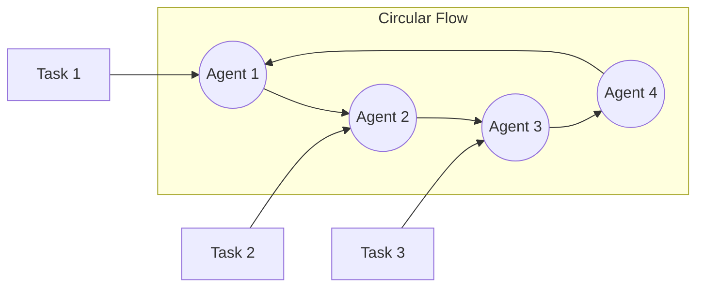
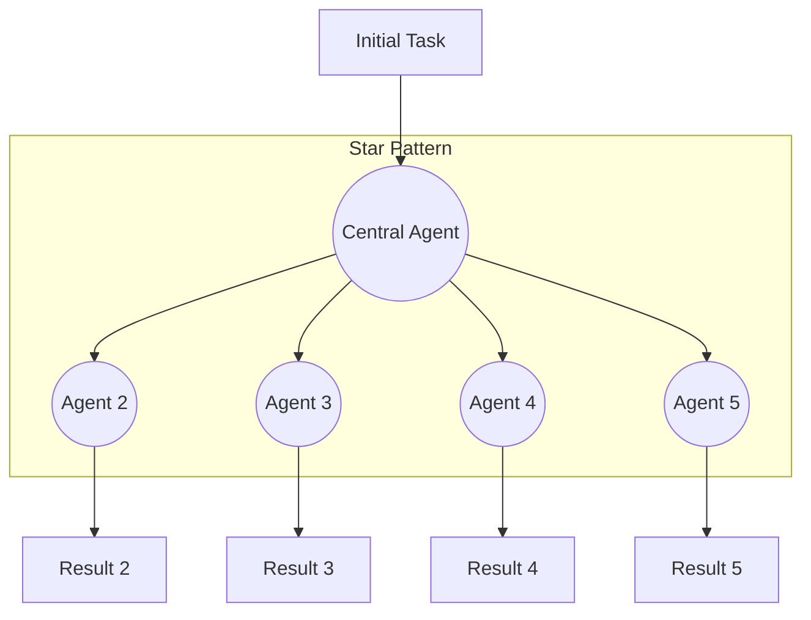
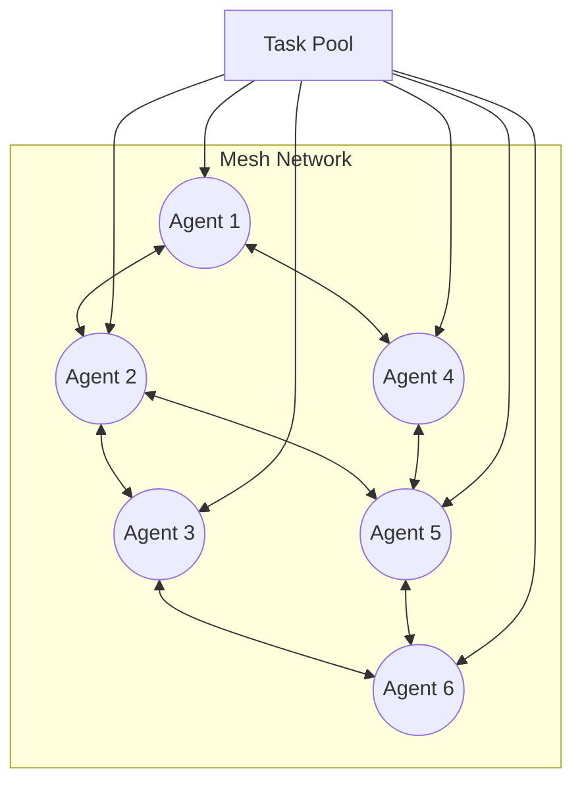
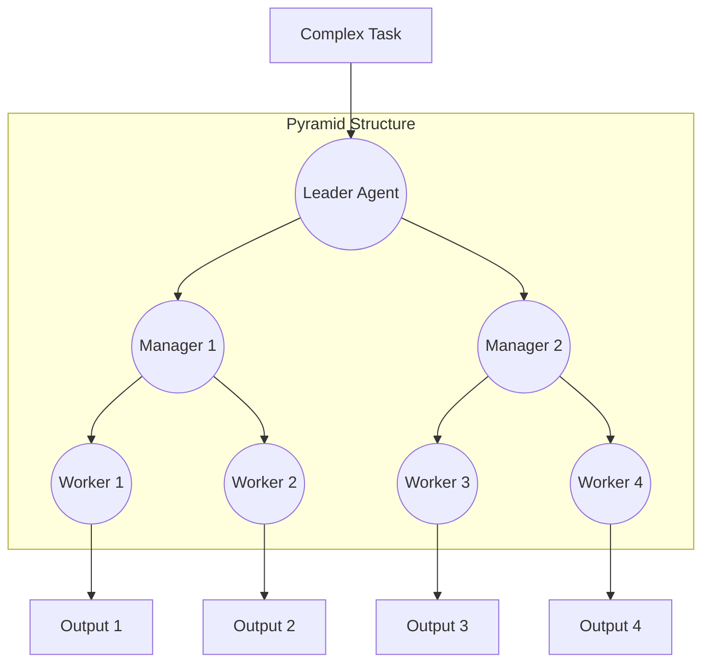
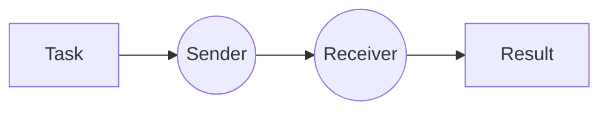
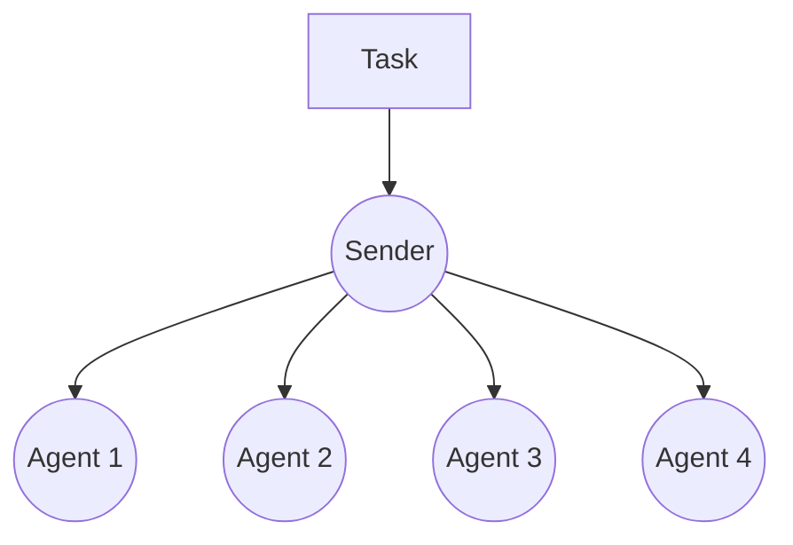

In this section, we present a diverse collection of unique swarms, each with its own distinct characteristics and applications. These examples are designed to illustrate the versatility and potential of swarm intelligence in various domains. By exploring these examples, you can gain a deeper understanding of how swarms can be leveraged to solve complex problems and improve decision-making processes.

# Documentation

## Table of Contents
1. [Common Parameters](#common-parameters)
2. [Basic Swarm Patterns](#basic-swarm-patterns)
3. [Mathematical Swarm Patterns](#mathematical-swarm-patterns)
4. [Advanced Swarm Patterns](#advanced-swarm-patterns)
5. [Communication Patterns](#communication-patterns)
6. [Best Practices](#best-practices)
7. [Common Use Cases](#common-use-cases)

## Common Parameters

All swarm architectures accept these base parameters:

- `agents: AgentListType` - List of Agent objects to participate in the swarm
- `tasks: List[str]` - List of tasks to be processed by the agents
- `return_full_history: bool` (optional) - If True, returns conversation history. Defaults to True

Return types are generally `Union[dict, List[str]]`, where:
- If `return_full_history=True`: Returns a dictionary containing the full conversation history
- If `return_full_history=False`: Returns a list of agent responses

## Basic Swarm Patterns

### Circular Swarm
```python
def circular_swarm(agents: AgentListType, tasks: List[str], return_full_history: bool = True)
```

**Information Flow:**


**Best Used When:**

- You need continuous processing of tasks

- Tasks need to be processed by every agent in sequence

- You want predictable, ordered task distribution

**Key Features:**

- Tasks move in a circular pattern through all agents

- Each agent processes each task once

- Maintains strict ordering of task processing

### Star Swarm
```python
def star_swarm(agents: AgentListType, tasks: List[str], return_full_history: bool = True)
```

**Information Flow:**


**Best Used When:**

- You need centralized control

- Tasks require coordination or oversight

- You want to maintain a single point of task distribution

### Mesh Swarm
```python
def mesh_swarm(agents: AgentListType, tasks: List[str], return_full_history: bool = True)
```

**Information Flow:**


**Best Used When:**

- You need maximum flexibility

- Task processing order isn't critical

- You want fault tolerance

## Mathematical Swarm Patterns

### Pyramid Swarm

### Pyramid Swarm
```python
def pyramid_swarm(agents: AgentListType, tasks: List[str], return_full_history: bool = True)
```

**Information Flow:**


**Best Used When:**

- You need hierarchical task processing

- Tasks require multiple levels of oversight

- You want organized task delegation

### Grid Swarm

## Communication Patterns

### One-to-One Communication
```python
def one_to_one(sender: Agent, receiver: Agent, task: str, max_loops: int = 1) -> str
```

**Information Flow:**


**Best Used When:**

- Direct agent communication is needed

- Tasks require back-and-forth interaction

- You need controlled message exchange

### Broadcast Communication
```python
async def broadcast(sender: Agent, agents: AgentListType, task: str) -> None
```

**Information Flow:**


**Best Used When:**

- Information needs to reach all agents

- Tasks require global coordination

- You need system-wide updates

## Best Practices

1. **Choose the Right Pattern:**
   - Consider your task's natural structure
   - Think about scaling requirements
   - Consider fault tolerance needs

2. **Performance Considerations:**
   - More complex patterns have higher overhead
   - Consider communication costs
   - Match pattern to available resources

3. **Error Handling:**
   - All patterns include basic error checking
   - Consider adding additional error handling for production
   - Monitor agent performance and task completion

4. **Scaling:**
   - Different patterns scale differently
   - Consider future growth needs
   - Test with expected maximum load

## Common Use Cases

1. **Data Processing Pipelines**
   - Circular Swarm

2. **Distributed Computing**
   - Mesh Swarm
   - Grid Swarm

3. **Hierarchical Systems**
   - Pyramid Swarm
   - Star Swarm

4. **Dynamic Workloads**
   - Mesh Swarm

5. **Conflict-Free Processing**
   - Broadcast

```python
import asyncio
from typing import List

from swarms.structs.agent import Agent
from swarms.structs.swarming_architectures import (
    broadcast,
    circular_swarm,
    grid_swarm,
    mesh_swarm,
    star_swarm,
)


def create_finance_agents() -> List[Agent]:
    """Create specialized finance agents"""
    return [
        Agent(
            agent_name="MarketAnalyst",
            system_prompt="You are a market analysis expert. Analyze market trends and provide insights.",
            model_name="gpt-4o-mini"
        ),
        Agent(
            agent_name="RiskManager",
            system_prompt="You are a risk management specialist. Evaluate risks and provide mitigation strategies.",
            model_name="gpt-4o-mini"
        ),
        Agent(
            agent_name="PortfolioManager",
            system_prompt="You are a portfolio management expert. Optimize investment portfolios and asset allocation.",
            model_name="gpt-4o-mini"
        ),
        Agent(
            agent_name="ComplianceOfficer",
            system_prompt="You are a financial compliance expert. Ensure regulatory compliance and identify issues.",
            model_name="gpt-4o-mini"
        )
    ]

def create_healthcare_agents() -> List[Agent]:
    """Create specialized healthcare agents"""
    return [
        Agent(
            agent_name="Diagnostician",
            system_prompt="You are a medical diagnostician. Analyze symptoms and suggest potential diagnoses.",
            model_name="gpt-4o-mini"
        ),
        Agent(
            agent_name="Treatment_Planner",
            system_prompt="You are a treatment planning specialist. Develop comprehensive treatment plans.",
            model_name="gpt-4o-mini"
        ),
        Agent(
            agent_name="MedicalResearcher",
            system_prompt="You are a medical researcher. Analyze latest research and provide evidence-based recommendations.",
            model_name="gpt-4o-mini"
        ),
        Agent(
            agent_name="PatientCareCoordinator",
            system_prompt="You are a patient care coordinator. Manage patient care workflow and coordination.",
            model_name="gpt-4o-mini"
        )
    ]

def print_separator():
    print("\n" + "="*50 + "\n")

def run_finance_circular_swarm():
    """Investment analysis workflow using circular swarm"""
    print_separator()
    print("FINANCE - INVESTMENT ANALYSIS (Circular Swarm)")
    
    agents = create_finance_agents()
    tasks = [
        "Analyze Tesla stock performance for Q4 2024",
        "Assess market risks and potential hedging strategies",
        "Recommend portfolio adjustments based on analysis"
    ]
    
    print("\nTasks:")
    for i, task in enumerate(tasks, 1):
        print(f"{i}. {task}")
    
    result = circular_swarm(agents, tasks)
    print("\nResults:")
    for log in result['history']:
        print(f"\n{log['agent_name']}:")
        print(f"Task: {log['task']}")
        print(f"Response: {log['response']}")

def run_healthcare_grid_swarm():
    """Patient diagnosis and treatment planning using grid swarm"""
    print_separator()
    print("HEALTHCARE - PATIENT DIAGNOSIS (Grid Swarm)")
    
    agents = create_healthcare_agents()
    tasks = [
        "Review patient symptoms: fever, fatigue, joint pain",
        "Research latest treatment protocols",
        "Develop preliminary treatment plan",
        "Coordinate with specialists"
    ]
    
    print("\nTasks:")
    for i, task in enumerate(tasks, 1):
        print(f"{i}. {task}")
        
    result = grid_swarm(agents, tasks)
    print("\nGrid swarm processing completed")
    print(result)

def run_healthcare_star_swarm():
    """Complex medical case management using star swarm"""
    print_separator()
    print("HEALTHCARE - COMPLEX CASE MANAGEMENT (Star Swarm)")
    
    agents = create_healthcare_agents()
    tasks = [
        "Complex case: Patient with multiple chronic conditions",
        "Develop integrated care plan"
    ]
    
    print("\nTasks:")
    for i, task in enumerate(tasks, 1):
        print(f"{i}. {task}")
    
    result = star_swarm(agents, tasks)
    print("\nResults:")
    for log in result['history']:
        print(f"\n{log['agent_name']}:")
        print(f"Task: {log['task']}")
        print(f"Response: {log['response']}")

def run_finance_mesh_swarm():
    """Market risk assessment using mesh swarm"""
    print_separator()
    print("FINANCE - MARKET RISK ASSESSMENT (Mesh Swarm)")
    
    agents = create_finance_agents()
    tasks = [
        "Analyze global market conditions",
        "Assess currency exchange risks",
        "Evaluate sector-specific risks",
        "Review portfolio exposure"
    ]
    
    print("\nTasks:")
    for i, task in enumerate(tasks, 1):
        print(f"{i}. {task}")
    
    result = mesh_swarm(agents, tasks)
    print("\nResults:")
    for log in result['history']:
        print(f"\n{log['agent_name']}:")
        print(f"Task: {log['task']}")
        print(f"Response: {log['response']}")

async def run_communication_examples():
    """Communication patterns for emergency scenarios"""
    print_separator()
    print("EMERGENCY COMMUNICATION PATTERNS")
    
    # Finance market alert
    finance_sender = create_finance_agents()[0]
    finance_receivers = create_finance_agents()[1:]
    market_alert = "URGENT: Major market volatility detected - immediate risk assessment required"
    
    print("\nFinance Market Alert:")
    print(f"Alert: {market_alert}")
    result = await broadcast(finance_sender, finance_receivers, market_alert)
    print("\nBroadcast Results:")
    for log in result['history']:
        print(f"\n{log['agent_name']}:")
        print(f"Response: {log['response']}")
    
    # Healthcare emergency
    health_sender = create_healthcare_agents()[0]
    health_receivers = create_healthcare_agents()[1:4]
    emergency_case = "EMERGENCY: Trauma patient with multiple injuries - immediate consultation required"
    
    print("\nHealthcare Emergency:")
    print(f"Case: {emergency_case}")
    result = await broadcast(health_sender, health_receivers, emergency_case)
    print("\nConsultation Results:")
    for log in result['history']:
        print(f"\n{log['agent_name']}:")
        print(f"Response: {log['response']}")

async def run_all_examples():
    """Execute all swarm examples"""
    print("\n=== SWARM ARCHITECTURE EXAMPLES ===\n")
    
    # Finance examples
    run_finance_circular_swarm()
    run_finance_mesh_swarm()
    # Healthcare examples
    run_healthcare_grid_swarm()
    run_healthcare_star_swarm()
    
    # Communication examples
    await run_communication_examples()
    
    print("\n=== ALL EXAMPLES COMPLETED ===")

if __name__ == "__main__":
    asyncio.run(run_all_examples())
```