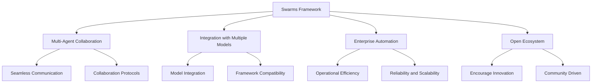
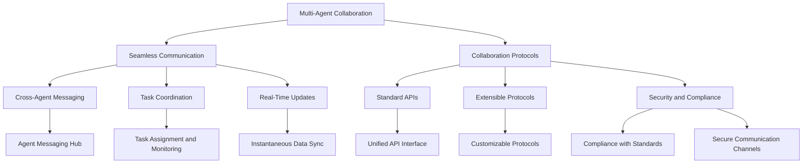
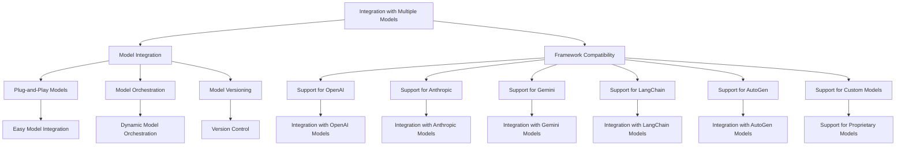
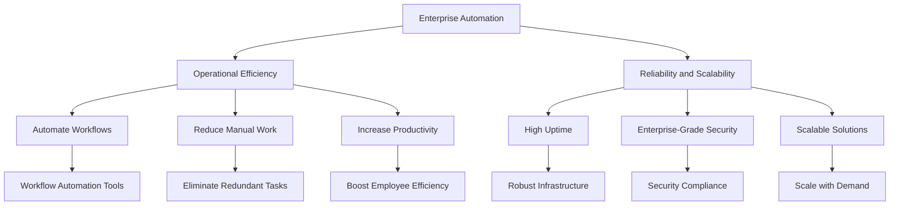
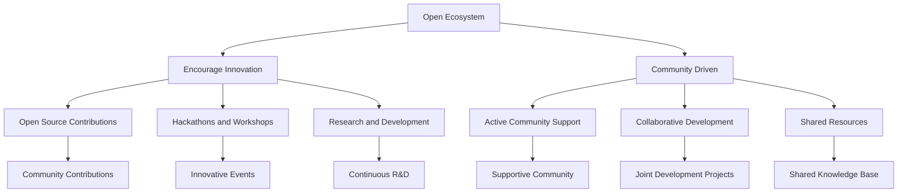

### Swarms Vision

**Swarms** is dedicated to transforming enterprise automation by offering a robust and intuitive interface for multi-agent collaboration and seamless integration with multiple models. Our mission is to enable enterprises to enhance their operational efficiency and effectiveness through intelligent automation.

#### Vision Statement

**To become the preeminent framework for orchestrating multi-agent collaboration and integration, empowering enterprises to achieve exceptional automation efficiency and operational excellence.**

#### Core Principles

1. **Multi-Agent Collaboration**: Facilitate seamless collaboration between diverse agents to solve complex and dynamic problems.
2. **Integration**: Provide robust and flexible integration with various models and frameworks to maximize functionality.
3. **Enterprise Automation**: Deliver enterprise-grade solutions designed for reliability, scalability, and security.
4. **Open Ecosystem**: Promote an open and extensible ecosystem that encourages innovation, community engagement, and collaborative development.

### Vision Document with Mermaid Graphs

#### Overview Diagram

#### Multi-Agent Collaboration

#### Integration with Multiple Models

#### Enterprise Automation

#### Open Ecosystem

---

### Detailed Breakdown

#### Multi-Agent Collaboration

Swarms excels in enabling seamless communication and coordination between multiple agents, fostering a collaborative environment where agents can work together to solve complex tasks. Our platform supports cross-agent messaging, task coordination, and real-time updates, ensuring that all agents are synchronized and can efficiently contribute to the collective goal.

#### Integration with Multiple Models

Swarms provides robust integration capabilities with a wide array of models, including OpenAI, Anthropic, Gemini, LangChain, AutoGen, and custom models. This ensures that enterprises can leverage the best models available to meet their specific needs, while also allowing for dynamic model orchestration and version control to keep operations up-to-date and effective.

#### Enterprise Automation

Our framework is designed to enhance operational efficiency through automation. By automating workflows, reducing manual work, and increasing productivity, Swarms helps enterprises achieve higher efficiency and operational excellence. Our solutions are built for high uptime, enterprise-grade security, and scalability, ensuring reliable and secure operations.

#### Open Ecosystem

Swarms promotes an open and extensible ecosystem, encouraging community-driven innovation and development. We support open-source contributions, organize hackathons and workshops, and continuously invest in research and development. Our active community fosters collaborative development, shared resources, and a supportive environment for innovation.

---

### Conclusion

**Swarms** is dedicated to providing a comprehensive and powerful framework for enterprises seeking to automate operations through multi-agent collaboration and integration with various models. Our commitment to an open ecosystem, enterprise-grade automation solutions, and seamless multi-agent collaboration ensures that Swarms remains the leading choice for enterprises aiming to achieve operational excellence through intelligent automation.