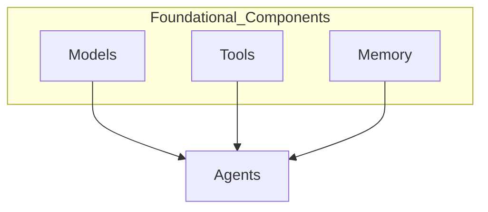
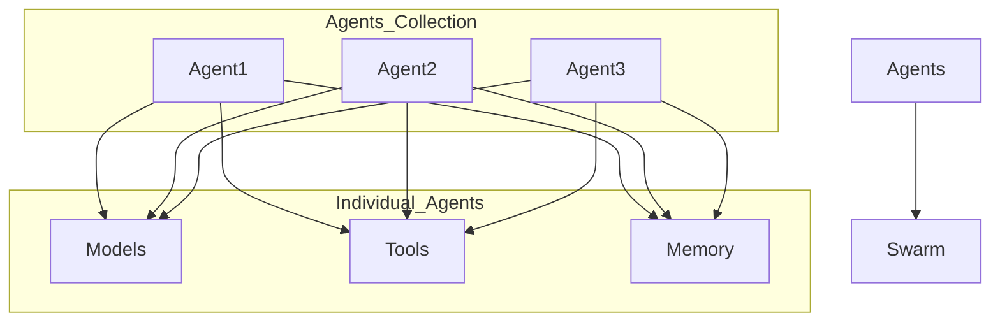
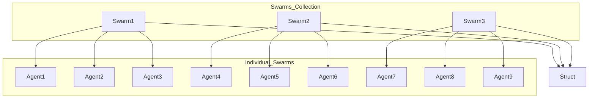
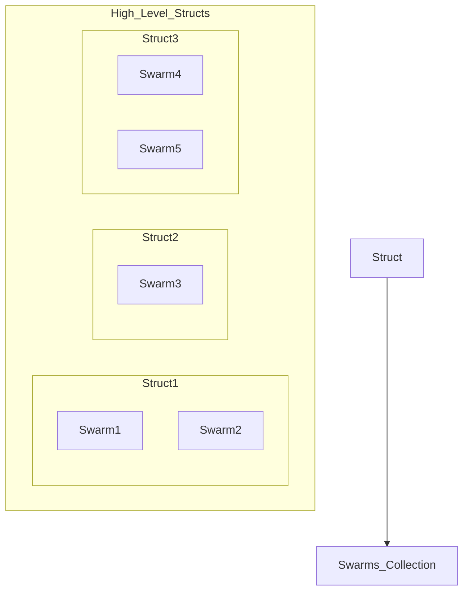

## Swarms Framework Conceptual Breakdown

The `swarms` framework is a sophisticated structure designed to orchestrate the collaborative work of multiple agents in a hierarchical manner. This breakdown provides a conceptual and visual representation of the framework, highlighting the interactions between models, tools, memory, agents, and swarms.

### Hierarchical Structure

The framework can be visualized as a multi-layered hierarchy:

1. **Models, Tools, Memory**: These form the foundational components that agents utilize to perform tasks.
2. **Agents**: Individual entities that encapsulate specific functionalities, utilizing models, tools, and memory.
3. **Swarm**: A collection of multiple agents working together in a coordinated manner.
4. **Structs**: High-level structures that organize and manage swarms, enabling complex workflows and interactions.

### Visual Representation

Below are visual graphs illustrating the hierarchical and tree structure of the `swarms` framework.

#### 1. Foundational Components: Models, Tools, Memory



#### 2. Agents and Their Interactions



#### 3. Multiple Agents Form a Swarm



#### 4. Structs Organizing Multiple Swarms



### Directory Breakdown

The directory structure of the `swarms` framework is organized to support its hierarchical architecture:

```sh
swarms/
├── agents/
├── artifacts/
├── marketplace/
├── memory/
├── models/
├── prompts/
├── schemas/
├── structs/
├── telemetry/
├── tools/
├── utils/
└── __init__.py
```

### Summary

The `swarms` framework is designed to facilitate complex multi-agent interactions through a structured and layered approach. By leveraging foundational components like models, tools, and memory, individual agents are empowered to perform specialized tasks. These agents are then coordinated within swarms to achieve collective goals, and swarms are managed within high-level structs to orchestrate sophisticated workflows.

This hierarchical design ensures scalability, flexibility, and robustness, making the `swarms` framework a powerful tool for various applications in AI, data analysis, optimization, and beyond.