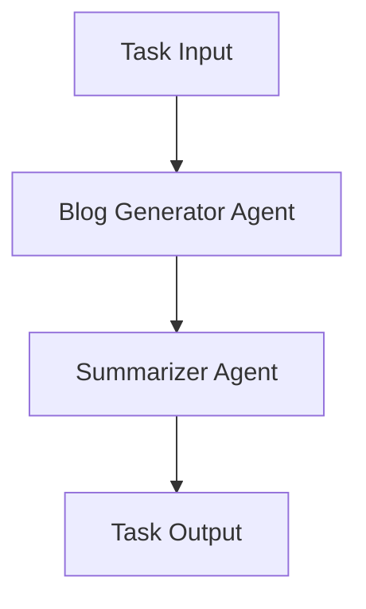
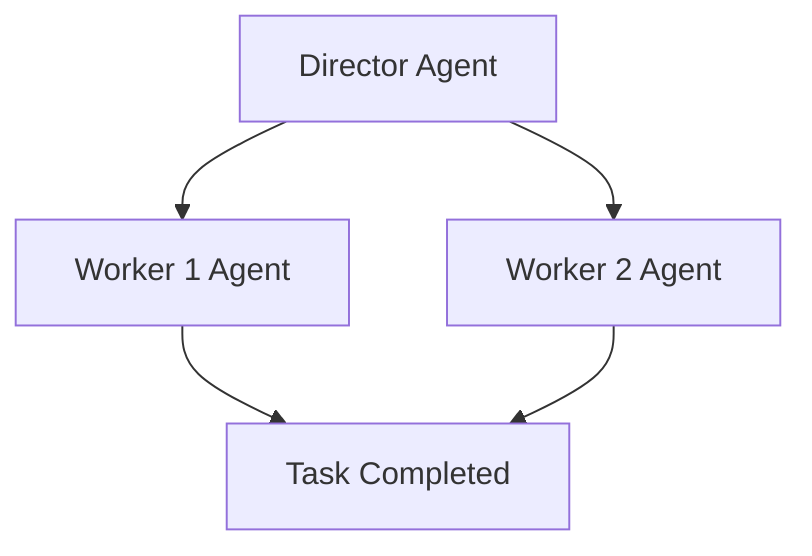
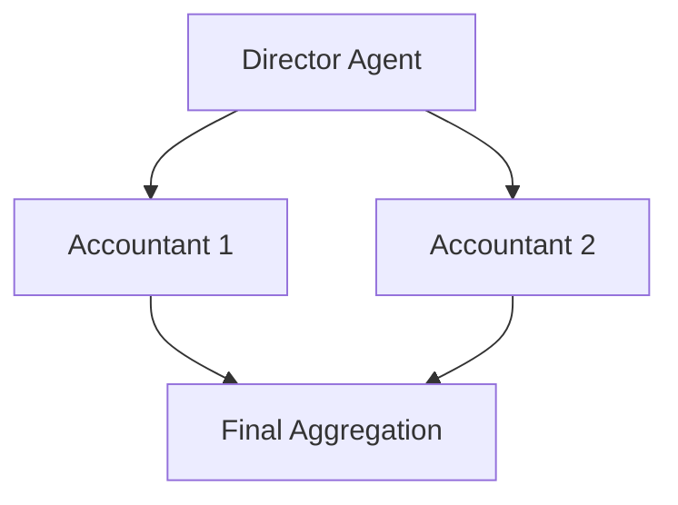
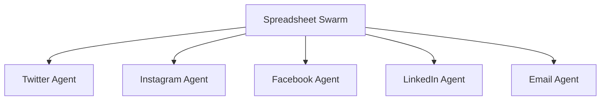

## Quickstart

**Swarms** is an enterprise-grade, production-ready multi-agent collaboration framework that enables you to orchestrate agents to work collaboratively at scale to automate real-world activities. Follow this quickstart guide to get up and running with Swarms, including setting up your environment, building an agent, and leveraging multi-agent methods.

### **Requirements**

- Python 3.10 or above
- `.env` file with API keys from your providers like `OPENAI_API_KEY`, `ANTHROPIC_API_KEY`
- Set an environment variable for your workspace directory:
  ```bash
  WORKSPACE_DIR="agent_workspace"
  ```

### **Installation**

To install Swarms, run:
```bash
$ pip install -U swarms
```

### **Usage Example: Single Agent**

Here’s a simple example of creating a financial analysis agent powered by OpenAI’s GPT-4 model. This agent will analyze financial queries like how to set up a ROTH IRA.

```python
import os
from swarms import Agent
from swarm_models import OpenAIChat
from dotenv import load_dotenv

load_dotenv()

# Initialize OpenAI model
model = OpenAIChat(
    openai_api_key=os.getenv("OPENAI_API_KEY"), model_name="gpt-4o-mini", temperature=0.1
)

# Initialize the agent
agent = Agent(
    agent_name="Financial-Analysis-Agent",
    system_prompt="Analyze financial situations and provide advice...",
    llm=model,
    max_loops=1,
    autosave=True,
    dashboard=False,
    verbose=True,
    saved_state_path="finance_agent.json"
)

# Run the agent on a financial query
out = agent.run("How can I establish a ROTH IRA to buy stocks and get a tax break? What are the criteria?")
print(out)
```

#### **Agent Class**

- **Attributes:**
  - `agent_name`: Name of the agent.
  - `system_prompt`: System-level instruction guiding the agent's behavior.
  - `llm`: Language model used by the agent (e.g., GPT, Anthropic).
  - `max_loops`: Max iterations for a task.
  - `autosave`: Auto-saves the state after each iteration.
  
- **Methods:**
  - `run(task: str)`: Executes the agent’s task.
  - `ingest_docs(doc_path: str)`: Ingests documents into the agent’s knowledge base.
  - `filtered_run(task: str)`: Runs agent with a filtered system prompt.

-----

## Creating Agents from YAML


### Step 1: Define Your Agents in a YAML File

The `create_agents_from_yaml` function works by reading agent configurations from a YAML file. Below is an example of what your YAML file (`agents_config.yaml`) should look like this. Example YAML Configuration (`agents_config.yaml`):

```yaml
agents:
  - agent_name: "Financial-Analysis-Agent"
    model:
      openai_api_key: "your_openai_api_key"
      model_name: "gpt-4o-mini"
      temperature: 0.1
      max_tokens: 2000
    system_prompt: "financial_agent_sys_prompt"
    max_loops: 1
    autosave: true
    dashboard: false
    verbose: true
    dynamic_temperature_enabled: true
    saved_state_path: "finance_agent.json"
    user_name: "swarms_corp"
    retry_attempts: 1
    context_length: 200000
    return_step_meta: false
    output_type: "str"
    task: "How can I establish a ROTH IRA to buy stocks and get a tax break?"

  - agent_name: "Stock-Analysis-Agent"
    model:
      openai_api_key: "your_openai_api_key"
      model_name: "gpt-4o-mini"
      temperature: 0.2
      max_tokens: 1500
    system_prompt: "stock_agent_sys_prompt"
    max_loops: 2
    autosave: true
    dashboard: false
    verbose: true
    dynamic_temperature_enabled: false
    saved_state_path: "stock_agent.json"
    user_name: "stock_user"
    retry_attempts: 3
    context_length: 150000
    return_step_meta: true
    output_type: "json"
    task: "What is the best strategy for long-term stock investment?"
```

### Key Configuration Fields:
- **agent_name**: Name of the agent.
- **model**: Defines the language model settings (e.g., API key, model name, temperature, and max tokens).
- **system_prompt**: The system prompt used to guide the agent’s behavior.
- **task**: (Optional) Task for the agent to execute once created.

---

### Step 2: Create the Main Script

Now, create the main Python script that will use the `create_agents_from_yaml` function.

### `main.py`:
```python
import os

from dotenv import load_dotenv
from loguru import logger
from swarm_models import OpenAIChat

from swarms.agents.create_agents_from_yaml import (
    create_agents_from_yaml,
)

# Load environment variables
load_dotenv()

# Path to your YAML file
yaml_file = "agents.yaml"

# Get the OpenAI API key from the environment variable
api_key = os.getenv("OPENAI_API_KEY")

# Create an instance of the OpenAIChat class
model = OpenAIChat(
    openai_api_key=api_key, model_name="gpt-4o-mini", temperature=0.1
)


try:
    # Create agents and run tasks (using 'both' to return agents and task results)
    task_results = create_agents_from_yaml(
        model=model, yaml_file=yaml_file, return_type="tasks"
    )

    logger.info(f"Results from agents: {task_results}")
except Exception as e:
    logger.error(f"An error occurred: {e}")

```

### Example Run:

```bash
python main.py
```

This will:
1. Load agent configurations from `agents_config.yaml`.
2. Create the agents specified in the YAML file.
3. Run the tasks provided for each agent.
4. Output the task results to the console.

---

### Step 3: Customize the Return Type

The `create_agents_from_yaml` function supports multiple return types. You can control what is returned by setting the `return_type` parameter to `"agents"`, `"tasks"`, or `"both"`.

1. **Return Only Agents**
To create agents but not run tasks, set `return_type="agents"`:

```python
agents = create_agents_from_yaml(yaml_file, return_type="agents")
for agent in agents:
    print(f"Agent {agent.agent_name} created.")
```

2. **Return Only Task Results**
If you only care about the task results and not the agent objects, set `return_type="tasks"`:

```python
task_results = create_agents_from_yaml(yaml_file, return_type="tasks")
for result in task_results:
    print(f"Agent {result['agent_name']} executed task '{result['task']}' with output: {result['output']}")
```

3. **Return Both Agents and Task Results**
To return both the list of created agents and task results, use `return_type="both"`:

```python
agents, task_results = create_agents_from_yaml(yaml_file, return_type="both")
# Process agents and tasks separately
```


## Step 4: YAML Structure for Multiple Agents

The YAML file can define any number of agents, each with its own unique configuration. You can scale this setup by adding more agents and tasks to the `agents` list within the YAML file.

```yaml
agents:
  - agent_name: "Agent1"
    # Agent1 config...

  - agent_name: "Agent2"
    # Agent2 config...

  - agent_name: "Agent3"
    # Agent3 config...
```

Each agent will be initialized according to its configuration, and tasks (if provided) will be executed automatically.

---

## Integrating External Agents
Integrating external agents from other agent frameworks is easy with swarms.

Steps:

1. Create a new class that inherits `Agent`
2. Create a `.run(task: str) -> str` method that runs the agent and returns the response. 
3. The new Agent must return a string of the response. But you may add additional methods to save the output to JSON.


### Griptape Example

For example, here's an example on how to create an agent from griptape.

Here’s how you can create a custom **Griptape** agent that integrates with the **Swarms** framework by inheriting from the `Agent` class in **Swarms** and overriding the `run(task: str) -> str` method.


```python
from swarms import (
    Agent as SwarmsAgent,
)  # Import the base Agent class from Swarms
from griptape.structures import Agent as GriptapeAgent
from griptape.tools import (
    WebScraperTool,
    FileManagerTool,
    PromptSummaryTool,
)


# Create a custom agent class that inherits from SwarmsAgent
class GriptapeSwarmsAgent(SwarmsAgent):
    def __init__(self, *args, **kwargs):
        # Initialize the Griptape agent with its tools
        self.agent = GriptapeAgent(
            input="Load {{ args[0] }}, summarize it, and store it in a file called {{ args[1] }}.",
            tools=[
                WebScraperTool(off_prompt=True),
                PromptSummaryTool(off_prompt=True),
                FileManagerTool(),
            ],
            *args,
            **kwargs,
            # Add additional settings
        )

    # Override the run method to take a task and execute it using the Griptape agent
    def run(self, task: str) -> str:
        # Extract URL and filename from task (you can modify this parsing based on task structure)
        url, filename = task.split(
            ","
        )  # Example of splitting task string
        # Execute the Griptape agent with the task inputs
        result = self.agent.run(url.strip(), filename.strip())
        # Return the final result as a string
        return str(result)


# Example usage:
griptape_swarms_agent = GriptapeSwarmsAgent()
output = griptape_swarms_agent.run(
    "https://griptape.ai, griptape.txt"
)
print(output)
```

### Key Components:
1. **GriptapeSwarmsAgent**: A custom class that inherits from the `SwarmsAgent` class and integrates the Griptape agent.
2. **run(task: str) -> str**: A method that takes a task string, processes it (e.g., splitting into a URL and filename), and runs the Griptape agent with the provided inputs.
3. **Griptape Tools**: The tools integrated into the Griptape agent (e.g., `WebScraperTool`, `PromptSummaryTool`, `FileManagerTool`) allow for web scraping, summarization, and file management.

You can now easily plug this custom Griptape agent into the **Swarms Framework** and use it to run tasks!


## Overview of Swarm Architectures in the Swarms Framework
---

### 1. **Sequential Workflow**

**Overview**: The `SequentialWorkflow` enables tasks to be executed one after the other. Each agent processes its task and passes the output to the next agent in the sequence.

#### Mermaid Graph:



#### Code Example:

```python
from swarms import Agent, SequentialWorkflow
from swarm_models import Anthropic

# Initialize agents
agent1 = Agent(agent_name="Blog generator", system_prompt="Generate a blog post", llm=Anthropic(), max_loops=1)
agent2 = Agent(agent_name="Summarizer", system_prompt="Summarize the blog post", llm=Anthropic(), max_loops=1)

# Create Sequential workflow
workflow = SequentialWorkflow(agents=[agent1, agent2], max_loops=1)

# Run workflow
output = workflow.run("Generate a blog post on how swarms of agents can help businesses grow.")
print(output)
```

---

### 2. **Agent Rearrange**

**Overview**: `AgentRearrange` allows the orchestration of agents in both sequential and parallel configurations. The user can define a flexible flow of tasks between agents.

#### Mermaid Graph:



#### Code Example:

```python
from swarms import Agent, AgentRearrange
from swarm_models import Anthropic

# Initialize agents
director = Agent(agent_name="Director", system_prompt="Directs tasks", llm=Anthropic(), max_loops=1)
worker1 = Agent(agent_name="Worker1", system_prompt="Generate a transcript", llm=Anthropic(), max_loops=1)
worker2 = Agent(agent_name="Worker2", system_prompt="Summarize the transcript", llm=Anthropic(), max_loops=1)

# Define agent relationships and workflow
flow = "Director -> Worker1 -> Worker2"
agent_system = AgentRearrange(agents=[director, worker1, worker2], flow=flow)

# Run agent system
output = agent_system.run("Create a YouTube transcript and summary")
print(output)
```

---

---

### 4. **Mixture of Agents**

**Overview**: `MixtureOfAgents` is a parallelized architecture where agents perform tasks concurrently and then feed their results back into a loop for final aggregation. This is useful for highly parallelizable tasks.

#### Mermaid Graph:



#### Code Example:

```python
from swarms import Agent, OpenAIChat, MixtureOfAgents

# Initialize agents
director = Agent(agent_name="Director", system_prompt="Directs tasks", llm=OpenAIChat(), max_loops=1)
accountant1 = Agent(agent_name="Accountant1", system_prompt="Prepare financial statements", llm=OpenAIChat(), max_loops=1)
accountant2 = Agent(agent_name="Accountant2", system_prompt="Audit financial records", llm=OpenAIChat(), max_loops=1)

# Create Mixture of Agents swarm
swarm = MixtureOfAgents(name="Mixture of Accountants", agents=[director, accountant1, accountant2], layers=3, final_agent=director)

# Run the swarm
output = swarm.run("Prepare financial statements and audit financial records")
print(output)
```

---

### 5. **Spreadsheet Swarm**

**Overview**: `SpreadSheetSwarm` enables the management of thousands of agents simultaneously, where each agent operates on its own thread. It’s ideal for overseeing large-scale agent outputs.

#### Mermaid Graph:



#### Code Example:

```python
from swarms import Agent
from swarm_models import OpenAIChat
from swarms.structs.spreadsheet_swarm import SpreadSheetSwarm
import os

# Initialize agents for different marketing platforms
agents = [
    Agent(agent_name="Twitter Agent", system_prompt="Create a tweet", llm=OpenAIChat(openai_api_key=os.getenv("OPENAI_API_KEY")), max_loops=1),
    Agent(agent_name="Instagram Agent", system_prompt="Create an Instagram post", llm=OpenAIChat(openai_api_key=os.getenv("OPENAI_API_KEY")), max_loops=1),
    Agent(agent_name="Facebook Agent", system_prompt="Create a Facebook post", llm=OpenAIChat(openai_api_key=os.getenv("OPENAI_API_KEY")), max_loops=1),
    Agent(agent_name="LinkedIn Agent", system_prompt="Create a LinkedIn post", llm=OpenAIChat(openai_api_key=os.getenv("OPENAI_API_KEY")), max_loops=1),
    Agent(agent_name="Email Agent", system_prompt="Write a marketing email", llm=OpenAIChat(openai_api_key=os.getenv("OPENAI_API_KEY")), max_loops=1),
]

# Create the Spreadsheet Swarm
swarm = SpreadSheetSwarm(agents=agents, save_file_path="real_estate_marketing_spreadsheet.csv", run_all_agents=False, max_loops=2)

# Run the swarm
swarm.run("Create posts to promote luxury properties in North Texas.")
```

---

These are the key swarm architectures available in the **Swarms Framework**. Each one is designed to solve different types of multi-agent orchestration problems, from sequential tasks to large-scale parallel processing.


### Overview of Swarm Architectures
#### **Workflow Classes**

- **SequentialWorkflow:**
  - Chains agents, where one agent's output becomes the next agent’s input.
  
- **AgentRearrange:**
  - Dynamically rearranges agent tasks either in parallel or sequentially based on defined flow.

#### **Swarm Architectures**

- **Hierarchical Swarms:**
  - Implements top-down control, where a boss agent coordinates tasks among sub-agents.
  
- **Spreadsheet Swarm:**
  - A large-scale swarm architecture for managing multiple agents working concurrently.

